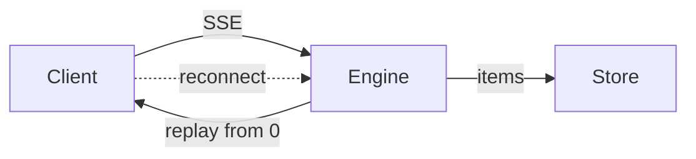
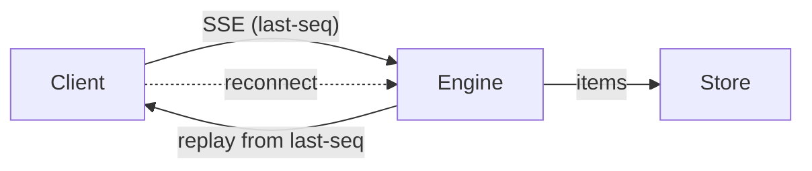

# Epic Explainer

An **explainer** is the comprehension artifact for one epic: four diagrams and almost no
prose, showing what the system did before, what it does once the set lands, how the work
divides, and how a real request travels through the new mechanism.

It exists because an epic's understanding is currently spread across an epic-spec, N issue
specs and N diffs, and nobody reads all of that to answer *"so what does this actually
do?"* — least of all the person who has to sign off on the next gate.

## It is not the epic-spec, and the line is sharp

| | Epic-spec | Explainer |
|---|---|---|
| Job | Decide | Understand |
| Gated | Yes — §1 is the objective gate | **Never.** It gates nothing and blocks nothing |
| Contains | Objective, themes, cross-cutting decisions, open questions, the running index | Four diagrams and their captions |
| Read by | Whoever approves the direction | Whoever wants the shape of the work in ninety seconds |

**The test: if a sentence asks the reader for anything, it does not belong here.** Open
questions, forks, recommendations and sign-off asks live in the epic-spec and on the epic
PR, where somebody is accountable for answering them. An explainer carrying an ask is an
epic-spec with worse formatting, and it splits the surface the user is supposed to decide
on.

The same line runs the other way: an epic-spec doesn't get diagrams of the mechanism
because they live here.

## Where it lives

`spec/_epics/<name>.explainer.md` on branch `epic/<name>`, beside the epic-spec. It
**never merges** — same branch, same never-merged PR, same reason as every spec document
(BP-037).

**Markdown is a delivery decision, not a fallback.** GitHub renders mermaid in a file's
blob view, so the link in the epic PR's links line opens the rendered explainer with no
checkout, no build and no hosted preview — the constraint that forces `spec-poc` visuals
into self-contained HTML doesn't apply, because we are not shipping a UI. The cost is
real and accepted: you get diagrams and headings, no layout and no side-by-side. Panels
that need side-by-side are panels 1 and 2, and stacking them works because they share a
node vocabulary (below).

Link it from the epic PR's links line as `Explainer: <blob URL>`. One line.

## The four panels

| # | Panel | Diagram | Answers |
|---|---|---|---|
| 1 | **Today** | `flowchart LR` or `sequenceDiagram` | What the system does now, and where it hurts |
| 2 | **After** | **The same type and the same node names as panel 1** | What it does once every issue lands |
| 3 | **The set** | `flowchart TD` | How the work divides, what's landed |
| 4 | **The path** | `sequenceDiagram` or `flowchart LR` | One real trip through the new mechanism, end to end |

**Panels 1 and 2 are one comparison, not two pictures.** Same diagram type, same node
names, same left-to-right order — only the edges, the guards and the new nodes differ. A
reader diffs them by eye in seconds, and that is the single highest-value thing this
document does. Two beautiful but differently-shaped diagrams destroy it.

**Panel 3 marks three states only** — shipped · in flight · not started — via `classDef`.
Not the phase machine. Coarse states don't rot between gates; a phase column does. Stamp
the panel *"as of the FIX-778 spec gate"* and link the epic doc for live status. **Never
copy the epic-spec's running index here**: it is `epic-agent`'s live projection, it moves
whenever any child issue moves, and a copy is stale within a day — the same failure as
copying it into the epic PR description.

**Panel 4 waits for a mechanism to exist.** Before the first implementation PR merges it
is a forecast drawn as a fact, which is the worst thing this document can do. Omit it and
say `_Panel 4 lands once the first implementation merges._` — a stated gap, not a silent
one.

### What the pair looks like

Panels 1 and 2 from a stream-resilience epic. Same type, same four nodes, same order —
only two edge labels differ, and that difference *is* the epic:

````markdown
## 1. Today



A dropped connection replays the whole session. Long runs re-send thousands of items.

## 2. After



The client sends the last sequence number it saw. The engine replays only what came after.
````

Note `"SSE (last-seq)"` is quoted and `replay from 0` isn't — parentheses force the quotes,
and quoting what doesn't need it just adds noise.

## Prose budget — hard, and checkable

- **≤ 40 words per caption.** One sentence on what to look at, one on what it changes.
- **≤ 400 words for the document**, diagram source excluded.
- **No section that is only prose.** If it can't be drawn, it belongs in the epic-spec.
- Over budget is a signal to **cut a panel, not to shrink a caption**. A caption stripped
  to a label makes the diagram ambiguous, which costs more than the panel was worth.

## Diagram grammar

The general rules are canonical in
[`pr-reviewer-guidance.md`](../../../docs/contributing/pr-reviewer-guidance.md) →
"Diagrams — one, if it earns its place": under ~10 nodes, label edges with what flows,
don't diagram a list, and if the prose beside it says the same thing cut one. They all
apply. Four additions are specific to rendering in a GitHub blob:

- **Quote every label containing `(` `)` `,` `;` `:` `/` or `[`.** GitHub's parser is
  stricter than the live mermaid editor, and a parse failure renders as a raw error block
  — strictly worse than having drawn nothing.
- **No `%%{init}%%` theme blocks and no click handlers.** Stripped in blob view.
- **`classDef` only for panel 3's three states.** Colour that encodes nothing is noise,
  and it is invisible to anyone reading in the other GitHub theme.
- **`<br/>` only inside a quoted label.** Outside one it breaks the parse.

## Refreshing it

One bounded action per dispatch, and **you never start over**: read the current explainer
first, then redraw what the new information changed. Anti-addenda discipline, exactly as
`epic-agent` applies it to the epic-spec — a panel gets **redrawn**, never appended to
with a "note: since the last refresh…" line. A document that accretes revision history
stops being a picture.

What each trigger changes, typically:

| Trigger | Usually touches |
|---|---|
| Objective gate (first build) | Panels 1–3. Panel 4 omitted |
| A spec approval | Panel 2 if the approved approach moved it; panel 3's states |
| A merge gate | Panel 3's states; panel 4 once the first impl has landed |
| `EPIC_WRAP` | All four, as the final read of what shipped |

**A refresh that changes nothing is a real outcome.** Say so and exit rather than
manufacturing a diff.

## Verify (BP-003)

Run all three against the file you are about to commit, and report the numbers:

```bash
F=spec/_epics/<name>.explainer.md

# 1. Prose budget — must be ≤ 400
awk '/^```/{f=!f; next} !f' "$F" | wc -w

# 2. Fences balanced and all tagged — the two counts must be equal
echo "$(grep -c '^```mermaid' "$F") opened / $(( $(grep -c '^```' "$F") / 2 )) pairs"

# 3. Unquoted risky labels, inside mermaid fences only — must print nothing
awk '/^```mermaid/{f=1;next} /^```/{f=0} f{print FNR": "$0}' "$F" \
  | grep -E '(\[[^]"]*[(),;:/][^]]*\])|(\|[^|"]*[(),;:/][^|]*\|)'
```

Check 3 covers **node labels `[…]` and edge labels `|…|`** — the two places the quoting rule
bites, and the two the worked example above uses. Scoping it to fence contents is what stops a
markdown table's pipes from reading as a diagram edge. It does **not** cover
`sequenceDiagram` message text, where a `:` is structural and a check would fire on every
line; read those by eye.

Then read it: **each diagram ≤ 10 nodes**, panels 1 and 2 sharing a node vocabulary, and
no sentence anywhere that asks the reader for something. Those three are judgment, so
they're checked by eye — but they're the ones that matter, so check them.

## Standalone use

`/epic-explainer <epic name or issue ID>` builds or refreshes it on demand — useful before
a demo, or when someone joins an epic mid-flight. It resolves the epic handle the same way
`epic-lifecycle` does (the Linear parent carrying the `Epic` label, its `epic/<name>`
branch), works on that branch, and pushes. It opens nothing and merges nothing; the epic
PR already exists and is where the file is read.

## Boundaries

- **Never gates anything.** No approval waits on it, and it is never the reason an epic
  holds.
- **Never merges to the default branch**, and never lands under `docs/` or `apps/docs/` —
  it is an internal comprehension artifact about work in flight, not user-facing prose.
- **Never invents mechanism.** Panels 2 and 4 draw from a ranked set of sources — a merged
  diff, else an approved spec, else the epic-spec's own objective under a `(proposed)`
  heading (`explainer-agent` → "know which tier you're on"). Tier 3 is what lets the first
  build happen at the objective gate, where nothing is approved yet and the objective is the
  thing being gated. A shape from *outside* those three isn't drawn at all.
- **Never prompts the user** when dispatched — the coordinator owns every gate and all
  user interaction.
