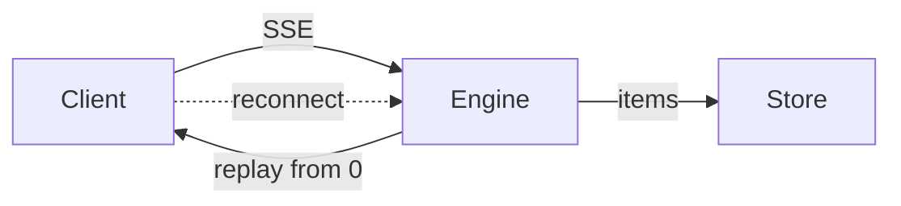
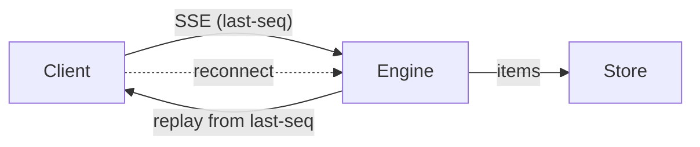

# Spec Explainer

An **explainer** is the comprehension artifact for one spec: a handful of diagrams and
almost no prose, showing what the system does today, what it does once the change lands,
and where the decision fell.

It exists because a spec is a decision document written to be argued with, and that is not
the same as a document you can understand. Part I alone runs to 400 words before §6, and
the person at the approval gate is the least likely of anyone to read all of it.

**Every spec gets one — issue and epic alike.** They differ only in their panel set.

## Two altitudes, two panel sets

| | **Issue spec** (`spec/<ISSUE-ID>.md`) | **Epic spec** (`spec/_epics/<name>.md`) |
|---|---|---|
| 1 | **Today** — what the system does now, and where it hurts | **Today** — same |
| 2 | **After** — what it does once this lands | **After** — what it does once the whole set lands |
| 3 | **Where the decision fell** — the fork, what was rejected, what the change deliberately leaves alone | **The set** — how the work divides · shipped / in flight / not started |
| 4 | *(usually none)* | **The path** — one real trip through the new mechanism |

**Three panels is the norm at issue altitude, four at epic altitude.** An epic earns the
fourth because it has a set to show and an assembled mechanism to walk; one issue usually
does not. Add a fourth to an issue spec only when it carries something the other three
can't — and drop one when the spec is small. A panel that restates its neighbour is worse
than no panel.

## It is not the spec, and the line is sharp

| | The spec | The explainer |
|---|---|---|
| Job | Decide | Understand |
| Gated | Yes — §6 is the sign-off surface | **Never.** It gates nothing and blocks nothing |
| Contains | Problem, approach, decisions, open questions, the build plan | Three or four diagrams and their captions |
| Read by | Whoever approves the direction | Whoever wants the shape of the change in ninety seconds |

**The test: if a sentence asks the reader for anything, it does not belong here.** Open
questions, forks, recommendations and sign-off asks live in the spec's §6 and §12 and on
the PR, where somebody is accountable for answering them. An explainer carrying an ask is a
spec with worse formatting, and it splits the surface the user is supposed to decide on.

Showing *what was decided* is not asking — panel 3 exists for exactly that. Showing what is
*still open* is asking, and belongs on the PR.

The same line runs the other way: a spec doesn't get diagrams of the mechanism because they
live here.

## Where it lives

Beside its spec, on the same never-merged branch:

| Altitude | File | Branch |
|---|---|---|
| Issue | `spec/<ISSUE-ID>.explainer.md` | `spec/<ISSUE-ID>` |
| Epic | `spec/_epics/<name>.explainer.md` | `epic/<name>` |

It **never merges** — same branch, same never-merged PR, same reason as every spec
document (BP-037). CI's `validate-spec-folder` check is skipped by branch name on `spec/*`
and `epic/*`, so the extra file cannot turn it red.

**Markdown is a delivery decision, not a fallback.** GitHub renders mermaid in a file's
blob view, so the link in the PR opens the rendered explainer with no checkout, no build
and no hosted preview — the constraint that forces `spec-poc` visuals into self-contained
HTML doesn't apply, because we are not shipping a UI. The cost is real and accepted: you
get diagrams and headings, no layout and no side-by-side. Panels that need side-by-side are
1 and 2, and stacking them works because they share a node vocabulary (below).

## How it reaches the PR

Both surfaces, asymmetrically — the doc has no budget pressure and the PR body does:

- **The doc** carries every panel.
- **The PR body** carries exactly **one** — the *After* panel, which answers *what does this
  do* — placed in block 2 per
  [`pr-reviewer-guidance.md`](../../../docs/contributing/pr-reviewer-guidance.md), followed
  by a one-line link to the doc. A spec PR body is capped at ~400 words above the fold and
  two diagrams total; three panels inline would blow both.
- **The links line** names the file: `visual explainer: spec/<ISSUE-ID>.explainer.md`.

**Link to the doc with an absolute blob URL** —
`https://github.com/<owner>/<repo>/blob/<branch>/<path>`. A relative link in a PR body
resolves against the repo root, not the PR, and 404s.

## The panels in detail

**Panels 1 and 2 are one comparison, not two pictures.** Same diagram type, same node
names, same left-to-right order — only the edges, the guards and the new nodes differ. A
reader diffs them by eye in seconds, and that is the single highest-value thing this
document does. Two beautiful but differently-shaped diagrams destroy it. Where the change
*removes* something, either mark the node dashed with a `classDef` and keep it visible (when
the story is where it went) or let it disappear (when its absence is the point) — both are
the delta, so pick the one that reads.

**Panel 3 differs by altitude**, and it is the panel that earns the document:

- **Issue spec — where the decision fell.** The fork, what was rejected and why, and what
  the change deliberately leaves alone. A `flowchart TD` from the issue into its halves and
  their owners reads better than any paragraph of §6. If the spec found a gap nobody owns,
  that node is the one a reader must not miss — mark it and say so.
- **Epic spec — the set.** `flowchart TD` of the issue graph, marked with **three states
  only** — shipped · in flight · not started — via `classDef`. Not the phase machine. Coarse
  states don't rot between gates; a phase column does. Stamp the panel *"as of the FIX-778
  spec gate"* and link the epic doc for live status. **Never copy the epic-spec's running
  index here**: it is `epic-agent`'s live projection, it moves whenever any child issue
  moves, and a copy is stale within a day — the same failure as copying it into the epic PR
  description.

**Panel 4 waits for a mechanism to exist**, which is why an issue spec rarely has one.
Before the first implementation merges it is a forecast drawn as a fact, which is the worst
thing this document can do. Omit it and say `_Panel 4 lands once the first implementation
merges._` — a stated gap, not a silent one.

## What you may draw from

Panels 2 and 4 are the ones that can lie, so sources are ranked, and the tier decides how
the panel is labelled:

| Tier | Source | The panel is |
|---|---|---|
| 1 | A **merged diff** | Fact. Draw it plainly |
| 2 | An **approved spec** | Agreed but unbuilt. Draw it plainly |
| 3 | The spec's **own proposed approach** (§2/§6), not yet approved | **Proposed.** Head it `## 2. After (proposed)` and say in the caption that this is the shape being gated |

**Tier 3 is the normal case for a fresh spec**, and it isn't a loophole: at the approval
gate the spec's proposal is precisely the thing under approval, so drawing it is the point.
Drop to it only when the tiers above are empty for that panel, and re-draw without the
`(proposed)` marker once the spec is approved or the code merges. A shape from *outside*
those three isn't drawn at all.

### What the pair looks like

Panels 1 and 2 from a stream-resilience epic. Same type, same four nodes, same order —
only two edge labels differ, and that difference *is* the epic:

````markdown
## 1. Today



A dropped connection replays the whole session. Long runs re-send thousands of items.

## 2. After



The client sends the last sequence number it saw. The engine replays only what came after.
````

Note `"SSE (last-seq)"` is quoted and `replay from 0` isn't — parentheses force the quotes,
and quoting what doesn't need it just adds noise.

## Prose budget — hard, and checkable

- **≤ 40 words per caption.** One sentence on what to look at, one on what it changes.
- **≤ 400 words for the document**, diagram source excluded.
- **No section that is only prose.** If it can't be drawn, it belongs in the epic-spec.
- Over budget is a signal to **cut a panel, not to shrink a caption**. A caption stripped
  to a label makes the diagram ambiguous, which costs more than the panel was worth.

## Diagram grammar

The general rules are canonical in
[`pr-reviewer-guidance.md`](../../../docs/contributing/pr-reviewer-guidance.md) →
"Diagrams — one, if it earns its place": under ~10 nodes, label edges with what flows,
don't diagram a list, and if the prose beside it says the same thing cut one. They all
apply. Four additions are specific to rendering in a GitHub blob:

- **Quote every label containing `(` `)` `,` `;` `:` `/` or `[`.** GitHub's parser is
  stricter than the live mermaid editor, and a parse failure renders as a raw error block
  — strictly worse than having drawn nothing.
- **No `%%{init}%%` theme blocks and no click handlers.** Stripped in blob view.
- **`classDef` only for panel 3's three states.** Colour that encodes nothing is noise,
  and it is invisible to anyone reading in the other GitHub theme.
- **`<br/>` only inside a quoted label.** Outside one it breaks the parse.

## When mermaid isn't enough — a hand-authored SVG

Mermaid is a **graph** language: you give it nodes and edges and it decides the layout. That
is exactly right for a dependency shape or a before/after of a pipeline, and it is why it is
the default here.

It is wrong when **the layout is the content** — when where a thing sits is part of what you
are saying. Containment and nesting, a grid or matrix, a timeline, a spatial arrangement, two
states overlaid. Mermaid will accept those and quietly arrange them its own way, and the
meaning is gone. That is the bar: reach for SVG when you can name what the *position* of an
element means. If the thing is a graph, mermaid wins on every other axis.

Our own [`docs/atlas/`](../../../docs/atlas/) is the reference for what this buys — labelled
boxes in a deliberate arrangement, almost entirely `<rect>` and `<text>`.

### It renders — here is the proof, and the constraints that come with it

GitHub's markdown renderer keeps `` — and `<picture>` with a
`prefers-color-scheme` `<source>`, which `README.md` uses for the sponsor logo today. That is
the **evidence** the path works, not the pattern to copy: **use a plain `` and put
the media query inside the one file.** `<picture>` means two files to keep in sync, and a
panel whose themes drift apart is worse than one that has no dark variant. Repo SVGs are
served as `image/svg+xml` under this CSP:

```
content-security-policy: default-src 'none'; style-src 'unsafe-inline'; sandbox
```

Read it literally, because it decides the whole design:

| The header says | So |
|---|---|
| `style-src 'unsafe-inline'` | **An inline `<style>` block works** — including `@media (prefers-color-scheme: dark)` |
| `default-src 'none'` | **No web fonts, no `<image>`, no external anything.** System font stacks only, or convert text to paths |
| `sandbox` | No script. Nothing interactive |

**The SVG must be self-contained, and this is the trap the atlas sets.** Atlas figures carry
`class="n-box t-lbl"` and nothing else — their CSS lives in the wrapping HTML page. Lift one
into a standalone `.svg` and it renders as unstyled black text on nothing. Copy the classes
*and* the custom properties they resolve to into the file itself.

### Where it goes, and how to reference it

Beside the explainer, in a folder named for it — `spec/<ISSUE-ID>.explainer/panel-3.svg`, or
`spec/_epics/<name>.explainer/panel-4.svg`. Same never-merged branch, same CI exemption.
**Panel 3 / 4 in the examples is deliberate**: both are unpaired and both have settled by the
time you would draw one.

```markdown

```

Relative from the explainer works in blob view. **In the PR body use an absolute
`https://github.com/<owner>/<repo>/blob/<branch>/<path>` URL**, and prefer `?raw=1`, since a
PR body resolves relative paths against the repo root.

### The rules that keep it cheap

- **Prefer an unpaired panel** — *where the decision fell* at issue altitude, *the path* at
  epic altitude. Panels 1 and 2 are **one comparison**, so a single SVG cannot go on one of
  them: mermaid beside SVG is the differently-shaped pair this document exists to avoid. If
  the before/after is genuinely the thing that needs spatial layout, draw **both** as SVGs
  sharing one node vocabulary — the pair is one comparison, so it spends the one allowance.
- **One allowance per explainer** — one unpaired panel, or the 1–2 pair. A second needs a
  reason you can say out loud.
- **Never for the panel that changes most** — epic panel 3 restates its states at every gate,
  and an SVG you must hand-edit each time is one you will stop editing. Mermaid there, always.
  SVG suits what has settled: an unpaired panel whose shape is decided.
- **Hand-written and grouped**, never a design-tool export. Wrap each logical element in
  `<g id="…">`, indent it, keep it under ~150 lines. A Figma export is one line of minified
  path data: undiffable, so nobody can review a change to it, and this document's failure mode
  is a diagram that is confidently wrong.
- **`role="img"` plus an `aria-label` that says what the picture says.** The atlas does this and
  it doubles as the caption a reader gets when the image fails to load.

### Starter — self-contained, both themes, house palette

```svg
<svg viewBox="0 0 640 200" role="img" aria-label="One sentence saying what this shows."
     xmlns="http://www.w3.org/2000/svg">
  <style>
    :root { --ink:#191C21; --ink-3:#7A828B; --surface:#FCFCFA; --rule:#D5D4CB; }
    @media (prefers-color-scheme: dark) {
      :root { --ink:#E6E8E5; --ink-3:#737B81; --surface:#181C1F; --rule:#2B3135; }
    }
    .n-box { fill: var(--surface); stroke: var(--rule); stroke-width: 1.2; }
    .t-lbl { fill: var(--ink-3); font-family: ui-monospace, SFMono-Regular, Menlo, monospace;
             font-size: 9.5px; letter-spacing: .1em; }
    .t-b   { fill: var(--ink); font-family: system-ui, -apple-system, sans-serif;
             font-weight: 600; font-size: 13px; }
  </style>
  <g id="example">
    <rect class="n-box" x="16" y="16" width="240" height="80" rx="5"/>
    <text class="t-lbl" x="32" y="38">LABEL</text>
    <text class="t-b" x="32" y="60">what it is</text>
  </g>
</svg>
```

**The class names are the atlas's too** (`n-box`, `t-lbl`, `t-b`), so a figure lifted from
`docs/atlas/` drops in without renaming — add the variables it needs (`--accent`, `--code`,
`--prose`) from the atlas's `:root` as you use them. The palette is `docs/atlas/`'s, light and dark. The font stacks are the atlas's *fallbacks* —
its `"IBM Plex Mono"` and `"Archivo"` are web fonts and `default-src 'none'` will not load
them, so name the system stack first and don't be surprised by the metrics.

## Refreshing it

One bounded action per dispatch, and **you never start over**: read the current explainer
first, then redraw what the new information changed. Anti-addenda discipline, exactly as
`issue-spec` and `epic-agent` apply it to the spec itself — a panel gets **redrawn**, never appended to
with a "note: since the last refresh…" line. A document that accretes revision history
stops being a picture.

What each trigger changes, typically:

| Altitude | Trigger | Usually touches |
|---|---|---|
| Issue | First draft (`issue-spec` Step 6) | All three. Panel 2 marked `(proposed)` |
| Issue | A review round that **changes the direction** | Whichever panel the change moved, and the `(proposed)` marker once approved |
| Issue | A review round that changes only prose | **Nothing.** Below-the-bar feedback doesn't move a diagram |
| Epic | Objective gate (first build) | Panels 1–3. Panel 4 omitted |
| Epic | A sub-issue's spec approval | Panel 2 if the approved approach moved it; panel 3's states |
| Epic | A merge gate | Panel 3's states; panel 4 once the first impl has landed |
| Epic | `EPIC_WRAP` | All four, as the final read of what shipped |

**A refresh that changes nothing is a real outcome.** Say so and exit rather than
manufacturing a diff.

## Verify (BP-003)

Run all three against the file you are about to commit, and report the numbers:

```bash
F=spec/<ISSUE-ID>.explainer.md        # or spec/_epics/<name>.explainer.md

# 1. Prose budget — must be ≤ 400
awk '/^```/{f=!f; next} !f' "$F" | wc -w

# 2. Fences balanced and all tagged — the two counts must be equal
echo "$(grep -c '^```mermaid' "$F") opened / $(( $(grep -c '^```' "$F") / 2 )) pairs"

# 3. Unquoted risky labels, inside mermaid fences only — must print nothing
awk '/^```mermaid/{f=1;next} /^```/{f=0} f{print FNR": "$0}' "$F" \
  | grep -E '(\[[^]"]*[(),;:/][^]]*\])|(\|[^|"]*[(),;:/][^|]*\|)'
```

Check 3 covers **node labels `[…]` and edge labels `|…|`** — the two places the quoting rule
bites, and the two the worked example above uses. Scoping it to fence contents is what stops a
markdown table's pipes from reading as a diagram edge. It does **not** cover
`sequenceDiagram` message text, where a `:` is structural and a check would fire on every
line; read those by eye.

**4. Every external `.svg` panel**, if the explainer has one — all four must hold:

```bash
S=spec/<ISSUE-ID>.explainer/panel-3.svg

grep -nE '<(script|image|foreignObject)|href=|url\(|@import' "$S"   # self-contained: nothing
grep -c 'prefers-color-scheme' "$S"                                 # both themes: 1 or more
grep -c 'aria-label' "$S"                                           # accessible: 1
wc -l < "$S"                                                        # reviewable: under ~150
```

Then read it: **each diagram ≤ 10 nodes**, panels 1 and 2 sharing a node vocabulary, and
no sentence anywhere that asks the reader for something. **Open any SVG panel** — a diagram
nobody looked at is how a wrong one ships. Those three are judgment, so
they're checked by eye — but they're the ones that matter, so check them.

## Standalone use

`/spec-explainer <ISSUE-ID or epic name>` builds or refreshes it on demand — useful before a
demo, when someone joins mid-flight, or to backfill a spec written before this was the
default. Resolve the handle the way the owning skill does (`issue-spec` for an issue,
`epic-lifecycle`'s Linear parent carrying the `Epic` label for an epic), work on that
branch, and push. It opens nothing and merges nothing; the spec PR already exists and is
where the file is read.

## Boundaries

- **Never gates anything.** No approval waits on it, and it is never the reason a spec or
  an epic holds. A failed refresh means surface the gate anyway and say the explainer is
  stale.
- **Never merges to the default branch**, and never lands under `docs/` or `apps/docs/` —
  it is an internal comprehension artifact about work in flight, not user-facing prose.
- **Never invents mechanism.** Panels 2 and 4 draw from a ranked set of sources — a merged
  diff, else an approved spec, else the epic-spec's own objective under a `(proposed)`
  heading — see "What you may draw from". Tier 3 is the normal case for a fresh spec,
  because the proposal is what the gate is deciding. A shape from *outside* those three
  isn't drawn at all.
- **Never prompts the user** when dispatched — the coordinator owns every gate and all
  user interaction.
