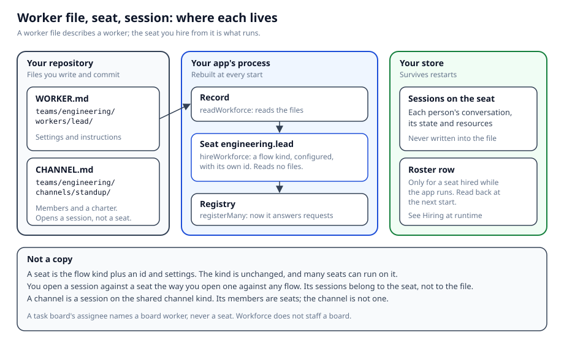

# Workforce

`@flow-state-dev/workforce` turns a roster of workers into configured, addressable copies of flows you already defined. Describe each worker (usually as a `WORKER.md`), hire the roster, and register the copies that come back.

A hired worker is a **seat**: a flow instance with its own id. You open a session against it the way you open one against any other flow.

## Workforce or orchestration

Reach for Workforce when you want a named roster you address by opening a session.

Reach for [Orchestration](../orchestration/overview) when you want to coordinate units of work on a task board. A board worker is a block that claims tasks. A task's `assignee` never names a hired worker.

## What a Workforce app looks like

A Workforce app is a roster, the channels that roster talks in, and the boards its work sits on. A board is a list of tasks, each one something somebody takes and finishes. You describe the roster in files, hire it, and open sessions against the seats you get back.



- **The roster outlives the process.** A team you hire while the app is running is still there after a restart or a redeploy, because the hire is written to the store your app uses. See [Hiring while the app runs](./durable-hire).
- **A channel is what a reader opens.** A channel is a named session on a kind the framework ships, and its transcript is the part of that conversation a person or another agent should read. A routed channel sends each post to the one member whose job fits it. See [Channels](./channels).
- **The screens are importable.** One navigator browses the whole workforce, and the roster and a board, as columns or as a live list, ship beside it as components from `@flow-state-dev/react`. See [Workforce components](./ui).

For a working example, the [kitchen-sink reference app](https://github.com/fixpoint-labs/flow-state-dev/tree/main/apps/kitchen-sink) is a support desk built this way: four specialists and one routed channel, declared under its `workforce/` folder, with a board for cases that need a person.

## Hire a roster

A worker on a team lives at `teams/<team>/workers/<name>/WORKER.md`, so `teams/engineering/workers/lead/` hires as `engineering.lead`. An org seat belongs to no team: it lives at `org/workers/<name>/WORKER.md` and hires under its folder name alone, so `org/workers/chief-of-staff/` is `chief-of-staff`.

```md
---
description: Holds the board.
model: openai/gpt-5.4-mini
---
You are the engineering lead. You break work into tasks and report what came back.
```

```ts
import { hireWorkforce } from "@flow-state-dev/workforce";
import { readWorkforce } from "@flow-state-dev/workforce/loader";

// `errors` is a worker that failed to load; `skillErrors` is one that loaded
// without a skill it should have had; `teamErrors` is a team file that failed.
// Each is collected rather than thrown, so an array you forget to check is
// one that reports nowhere.
const { workers, errors, skillErrors, teamErrors } = await readWorkforce("./workforce");
if (errors.length || skillErrors.length || teamErrors.length) {
  throw new Error(
    `workforce: ${errors.length} worker(s) failed to load, ` +
      `${skillErrors.length} loaded short, ` +
      `${teamErrors.length} team file(s) failed`,
  );
}

const seats = hireWorkforce(workers);

flowRegistry.registerMany(seats);
```

That worker file names no `flow:`, so it runs on the built-in worker kind. Its body becomes its instructions, and it talks. It sees the recent turns of the conversation it's in, and nothing it's told there reaches any other conversation.

A **skill** is a folder of instructions a worker can pull into a turn. `readWorkforce` collects the skills sitting beside each worker in the tree, and the built-in reads them. Each organization keeps its own copy of a seat's skills. When you call the worker's action, send `userId` beside `input`. The call never names the organization: every request runs in one, and [Authentication](../server/authentication.md#every-request-runs-in-an-organization) covers where it comes from. [The built-in worker](./built-in-worker.md) covers its settings, what your app can configure, and the rest of what it does not do.

To run a worker on a flow you wrote yourself, name that flow's kind in the worker's `flow:`. Here is `teams/engineering/workers/triage/WORKER.md`:

```md
---
description: Sends an incoming request to an answer or to a person.
flow: request-triage
---
Answer directly when the request is a question about a feature that already shipped.
```

Then pass the flow under that same kind when you hire:

```ts
import { requestTriageFlow } from "./flows";

const seats = hireWorkforce(workers, {
  kinds: { "request-triage": requestTriageFlow },
});
```

`requestTriageFlow` is your own `defineFlow(...)`, and `"request-triage"` is its `kind`. A record that names no `flow:` is hired into the built-in, so one roster can run both. You get back one seat per worker, ordered by id.

Pass a flow under a key that is not its own `kind` and the hire is refused. [Workers on disk](./workers-on-disk.md#when-a-worker-needs-more-than-settings) walks through writing a flow kind of your own.

`hireWorkforce` reads no files and registers nothing. A refused hire throws and returns nothing.

`readWorkforce` is Node-only (`@flow-state-dev/workforce/loader`). Import `hireWorkforce` from `@flow-state-dev/workforce`.

## Projects, workstreams, and the seats that run them

One seat helps a person run an organization. The chief of staff is who you ask who works here and who is on a channel. It also changes who works there: ask it for another seat and it hires one; ask it for one fewer and it puts the request in front of you to approve, and nothing is removed until you do. The seats it hires belong to the organization, and other seats ask it rather than hiring for themselves. It is a seat on the built-in `agent` kind, declared under `org/workers/`, and a Lab that doesn't add it doesn't have one. See [The chief of staff](./chief-of-staff).

Workstream channels are declared on disk. The chief of staff reads them; it never opens, closes, or renames a channel.

## What it will not do

- Workforce does not staff a task board. A task's `assignee` names a board worker, never a seat.
- It does not replace flows, sessions, or resources. Sessions and resources live on the seat you hired.
- Hiring at runtime adds to the roster in your files. It doesn't replace the tree.

## Related pages

- [Workers on disk](./workers-on-disk) — the folder tree, `WORKER.md`, `readWorkforce`, and `hireWorkforce`.
- [The built-in worker](./built-in-worker) — the `agent` kind a record with no `flow:` runs on: its settings, tools, skills, and memory.
- [Channels](./channels) — several agents on one topic, with one durable transcript and nobody owning a row, optionally routing each post to one member.
- [Inventory](./inventory) — a record of every seat and channel registered in an organization, readable by a block.
- [Documents on disk](./documents-on-disk) — a team's shared reference material as Markdown, installed as resources.
- [Code on disk](./code-on-disk) — your own flow kinds, blocks and capabilities in the same tree, registered by `fsdev gen`.
- [Capabilities on disk](./capabilities-on-disk) — what a capability in a `resources/` folder gives a worker, and how a worker's file picks its presets.
- [Hiring while the app runs](./durable-hire) — a roster hired at runtime, written to your store, reloaded on the next boot.
- [The chief of staff](./chief-of-staff) — the one seat a person asks to hire or fire, with a fire waiting for their approval.
- [Workforce components](./ui) — browse your flow kinds, instances and sessions, and render a roster and boards, with React components.
- [Orchestration](../orchestration/overview) — the task board and the workers that drain it.
- [Agents](../orchestration/agents) — board workers, `definePersona`, and `createWorkforceCapability`.
- [Flows](../fundamentals/flows.md) — how a flow copy is configured and addressed.
