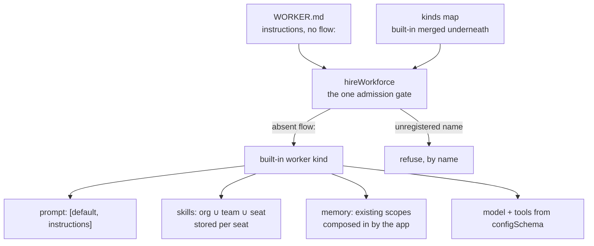

# The Default Workforce Agent Kind — Locked Contract

A team describes a worker in a file — a name, a description, some instructions — and gets a
working agent. Four separate pieces of work build toward that promise at the same time, in
four separate checkouts: the agent itself, its skills, its memory, and the teaching material.

This document is what they all read, so they do not each invent a different answer. It fixes
what the pieces owe each other. **It is a contract, not a design** — it does not build the
worker kind, wire its skills, compose in its memory, or write the guides. Those are
FIX-1363, FIX-1362, FIX-1364 and FIX-1366, and each cites this file rather than re-deriving it.

Two things are false today, and both are load-bearing:

- **A worker file that carries only instructions is refused.** `hireWorkforce` requires a
  `flow:` key and refuses anything without one
  (`packages/workforce/src/hire.ts:167`). The zero-config seat the epic leads with is a
  locked door, not an untaken shortcut.
- **A worker's skills are not that worker's.** The skills library keys its collection at
  `"skills"`, org scope, with no per-seat isolation
  (`packages/orchestration/src/skills/library.ts`). Two seats in one org share one bucket.
  The per-seat *view* is real (`read-seat-skills.ts`); the per-seat *storage* is not.

Related, and deliberately not restated here:

- [`docs/internal/design/kitchen-sink-agent-drift.md`](../internal/design/kitchen-sink-agent-drift.md)
  — the drift audit this contract cites for evidence. A dated characterization, explicitly
  not maintained. **Where it disagrees with C3 below, this document wins** (see C3).
- [`packages/workforce/README.md`](../../packages/workforce/README.md) — the hire surface as
  it ships today.
- [`docs/contributing/architecture-reference.md`](../contributing/architecture-reference.md)
  — carries the two rows a reader needs without opening this file.

**Today → after this contract.** The two facts above are the *today* column; the diagram below is
the **after** state, not what ships now:

- **Today** — an absent `flow:` is refused, and every seat's skills share one org-wide bucket.
- **After** — an absent `flow:` hires the built-in worker kind, and a seat's skills are stored
  under that seat's own instance id.



---

## C1 — Composition, not a type

The worker kind is a flow like any other. Its settings bag (`configSchema`) declares
`instructions`, `model`, `tools`, and the skills switches. It declares **no memory switch** — per
C5 memory is composed into a kind at definition time, not turned on here. `instructions` is the worker
file's body arriving as one setting — the hire step already imposes that key
(`packages/workforce/src/manifest.ts`, `INSTRUCTIONS_KEY`) and already refuses `persona` by
name (`REFUSED_PERSONA_KEY`, same file).

Generator slots stay `prompt` / `context` / `history` / `user`. Instructions compose as
`prompt: [default, instructions]`.

`tools` is a hard runtime fence, not a hint: a seat may call exactly the catalog keys it names,
and an empty list means none, regardless of anything else the app's catalog or the skills
library contributes (see C5).

The shared `default` prompt is owned and shipped elsewhere (FIX-1344 part 2, not yet landed).
Until it does, the kind ships against `instructions` alone with an explicit seam for `default`
to drop into, and **defines no second default-prompt configuration anywhere in this epic.**

### C1a — Settings are a default layer, not the only layer

A worker file supplies *defaults*. Model and thinking-style choices stay overridable per end
user; per-turn feature switches stay per-turn input. Folding all three into the settings bag
would delete controls the reference app has today (drift note §5, item 4 — model choice and
extended thinking live in user state, feature flags arrive on every `run` input).

Stated because the drift audit found this inverted in the reference app — which is how a
"configure it in the file" contract quietly becomes "configure it *only* in the file".

## C2 — Admission has exactly one gate

`hireWorkforce` is it (tenet 5: fix at the owning layer). A second check anywhere downstream is
how "absent means default" and "wrong means error" drift apart. The complete rule:

| Worker file says | Result |
|---|---|
| no `flow:` | the built-in worker kind |
| `flow: agent` | the built-in worker kind — same kind, named explicitly |
| `flow: <registered>` | that kind, exactly as today |
| `flow: <not registered>` | **refused by name**, listing the kinds that were passed — today's wording, unchanged |
| roster passes `kinds: { agent: … }` | the app's flow wins; the built-in is merged *underneath* whatever the caller supplied |

The existing refusal for a flow filed under someone else's kind name still applies to the
built-in: a replacement must declare `kind: "agent"` (`packages/workforce/src/hire.ts:184`,
the `factory.kind !== kind` check). **Adding an implicit default must not weaken any existing
refusal** — that is the loud-fail obligation the epic assigned here.

### A replacement must also declare `cardinality: "collection"`

A roster is N seats of one kind, and `defineFlow` defaults to `singleton`
(`normalizeCardinality`, `packages/core/src/flow/defineFlow.ts:200` — `undefined` returns
`"singleton"`). A singleton's id is its kind. So a replacement written the plain way —
`defineFlow({ kind: "agent", configSchema, actions })` — hires without complaint and is then
refused seat by seat at **registration**, not at the mint:

```
Flow "agent" is a singleton but was instantiated with id "engineering.lead". A singleton's id
is its kind. If this definition is meant to have several registered instances, declare
cardinality: "collection" on defineFlow(...); otherwise call the factory without an id.
```

(thrown as `singleton-id-mismatch` at `packages/engine/src/registry/flow-registry.ts:583`;
message at `packages/engine/src/registry/errors.ts:69-72`. Run, not read — see
[Evidence](#evidence).)

The refusal is loud and arrives at boot, so nothing ships broken. It is stated here because a
caller reading only "declare `kind: 'agent'`" would meet it by surprise. It is a requirement
on callers, **not a refusal anyone has to build.**

## C3 — A seat's skills are stored per seat, and *stored* is not the same as *filled*

Two things have to be true for a seat's skills to be that seat's. They are separate, and the
second one is the one that gets missed.

### The drawer — isolation

The seat's *view* already works: `org ∪ teams/<thatTeam> ∪ workers/<thatSeat>`
(`packages/workforce/src/loader/read-seat-skills.ts:187-189`), with a name reaching one seat
from two levels refused rather than shadowed (`duplicateSkillNameMessage`, same file).

The kind declares its skills collection **isolated per flow instance**. A seat *is* a flow
instance, minted with the worker's id (`hire.ts:199-200` passes `{ id: manifest.id }`), and the
storage layer already keys isolated resources as `${identityId}:${flowId}` on the **instance**
id, not the kind (`resolveResourceScopeId`, `packages/engine/src/stores/scope-keys.ts:324`).

**No new primitive is needed** — one option field has to be threaded through.
`DefineSkillsCollectionOptions` accepts `prefix`, `maxInstances` and `scope` but does not
forward `flowIsolation` (`packages/orchestration/src/skills/collection.ts:57-68`), while the
`defineResourceCollection` it wraps accepts it
(`packages/core/src/types/resource-collection.ts:58`).

### The contents — population

Isolation alone gives every seat its own *empty* drawer and then fills all of them from the
same jar.

`createSkillsLibrary` captures one static `initialSkills` array when the kind is defined —
once per kind, not once per seat (`packages/orchestration/src/skills/library.ts:264`). The
runtime seeder writes exactly that array into whichever collection ref it is handed
(`ensureSeeded`, `packages/orchestration/src/skills/seeding.ts`; called that way from
`run-skill-tool.ts`, `load-tool.ts`, `context-fn.ts`, `binding-reader.ts` and `seed-step.ts`).
N isolated seats therefore end up with N separate buckets holding N *identical* catalogs.

There is no channel for a per-seat set either: `WorkerManifest` is `{ id, declared, body }` and
nothing more, and `hireWorkforce` forwards only frontmatter settings — so the union
`read-seat-skills.ts` already computes has nowhere to ride into the mint.

**The contract therefore requires an instance-specific seeding path.** The seat's computed union
must reach *that seat's* collection as its `initialSkills`, so `ensureSeeded` writes that seat's
skills and no one else's. Acceptance criterion 5 is written to fail without one.

Where the handoff lives — a per-seat key on the kind's `configSchema`, a per-instance option on
the library, or a seed at hire time — is **FIX-1362's to design**. That it must exist is decided
here. (Same defect class as FIX-1372, filed against the reference app: an activator built with
no `initialSkills` shows every matcher tier an empty catalog on turn 1.)

### Copy-in is the honest lock-in, and it is named

Seeding writes a *copy* into the seat's drawer and records the name in `_meta.seededNames`
(`seeding.ts:58,84`), so a later edit to the company copy's **body** does not reach a seat that
already holds one. A deliberate deletion is not undone either, and that half is stronger than a
convention: `needsResed` returns `false` when the manifest is gone, preserving the decision on
purpose (`packages/orchestration/src/skills/seeding.ts:116-117`).

**One exception, and it is not a body edit.** `ensureSeeded` re-seeds an already-seeded name when
`needsResed` finds the persisted record stale against the FIX-918 migration shape — it still
carries a legacy non-inline `contextMode` the source dropped, the source declares `agents:` the
record lacks, or the source's `contextMode` changed (`seeding.ts:69-74,128-135`). Those replace a
seat's copy without anyone refreshing it. Whether that reseeding should be narrowed for seat
copies is **FIX-1362's call**; this contract's job is to state the behaviour, not design it away.

Refreshing a running seat *otherwise* is a deliberate act **with no mechanism yet**; FIX-1362 owns
building one. Saying so is this contract's job — the alternative is a privacy promise that reads
as live sharing and is not.

### This clause supersedes drift note §3a

Drift §3a says *"Real per-seat isolation needs a real resource identity — a distinct collection
key, prefix, or scope"* (`docs/internal/design/kitchen-sink-agent-drift.md:161`). **It does
not.** The identity already exists as `flowIsolation`, keyed on the seat's instance id.

Stated against the note by name because epic theme 8 sends every later issue to the note
*instead of* re-reading the app, and FIX-1362 is the issue that would otherwise read §3a and
build the refuted mechanism. The note is a dated characterization and explicitly not
maintained, so it is **not edited** — the correction lives here.

## C4 — Memory attaches to existing scopes, and the gap is named

`session`, `user`, `org`, plus per-instance isolation where a resource wants it. **Identity and
durable per-member memory are not on the seat object.**

The honest gap, verified in the reference app: user-scoped memory is durable per *end user*,
with no member or seat identity in it, so a multi-seat roster serving one person shares one
memory (drift note §3b). This contract states the gap; FIX-1364 carries it onto the teaching
surface and files a ticket. **Nothing here invents a new isolation primitive.**

## C5 — Out of the box is the cheap path, and cheap includes *off*

Three things, and they are separate:

1. **Skills** — the library plus per-generator binding (entry point pinned below).
2. **Memory is a build-time composition seam, not a setting.** An instructions-only seat does
   **not** remember out of the box. The default kind and the hire package's required graph stay
   free of memory resources and static memory imports. **"Attached" means an app composed memory
   into its own kind at definition time** — spreading the capability's resource maps plus `uses`,
   or an equivalent helper that is still ordinary flow composition (the seam FIX-1364 designs).
   It does **not** mean flipping a config flag on the stock built-in.
3. **Light-vs-heavy still holds once memory is composed in** — read-side by default. The
   model-classifier tier for skill matching and the background capture pipeline for memory stay
   **opt-in, one setting each**, on the asymmetry signed off on PR #1736: light → heavy is
   additive, heavy → light is a breaking change for rosters already hired.

That asymmetry governs *which* memory a roster gets once memory is composed in. **It never
authorized putting memory in the default required graph, and still does not.** Declaring memory's
resources on the default kind and gating them off is the same violation wearing a switch — a fence
that permits the forbidden thing as long as it is switched off is not a fence. Splitting 2 from 3
is what makes this checkable rather than decorative: a default mint with no memory in it is a
claim a test can falsify.

**Owners:** FIX-1363 may ship the default composition as talking plus skills with no memory wired
— it is not blocked on the memory work either way. FIX-1364 owns the composition-seam design, the
gap honesty, and the teaching surface for *how* an app composes memory in. FIX-1366 teaches that
honestly — not "remembers with zero configuration", and not "one setting on the stock kind".

### The skills entry point is pinned: `createSkillsLibrary` + per-generator binding

**Not `createSkillsCapability`.** Two overlapping entry points exist and reconciling them is
FIX-1362's; but *which one the default is made of* is a contract call, because leaving it open
lets FIX-1363 and FIX-1362 ship two different default stacks under one name.

The library wins on the same argument as C3, one level down: its activation is per binding, so
a skill given to one generator never appears in another's context, where the capability keeps a
session-global `activeSkills` bag. The published guide currently teaches the capability;
correcting that is FIX-1366's, not a reason to pick it.

"Whole catalog" here means the load tool's reach over the *skill* catalog (`allowed` omitted), not
licence for the skills library to re-widen a seat's tool reach past its own `tools:` (C1) — the
default kind hands the library the app's tool catalog with registration turned off
(`createSkillsLibrary({ catalog, registerCatalogTools: false })`), so a bound skill's
`allowed-tools` are still validated against it but never registered by the library itself. A
stock-kind skill may declare `allowed-tools` naming a tool in the app catalog; registration stays
solely the generator's own `tools:` mapping (C1).

## C6 — What must not be invented

- No second Agent type at framework level. Do not grow `AgentRegistry` into a product Agent.
- `defineAgent` / `materializeAgent` are **not** the teach path. Nothing here extends, imports
  or mirrors them — equally, nothing here waits on their deletion (FIX-1344 / PR #1713 owns
  that kill).
- Seats are flow instances of a kind. There is no `worker.ts` seat door.
- No Channel or MessageBoard types follow from this contract.

### And one thing that must not be *copied*

The tree still teaches the placeholder kind `worker-agent`. **The built-in kind id is
`agent`.** Until the migration lands, an implementer reading an existing example must not carry
`worker-agent` out of it.

**The migration splits by artifact type.** Teaching surface — prose and rendered pages — is
**FIX-1366's**. Executable surface — fixtures, goal files and tests — is **FIX-1363's**, because a
check goes stale the moment the behaviour changes and belongs with the change that makes it stale,
not with a later teaching pass.

Each owner derives its own list with `grep -rn "worker-agent\|workerAgentFlow"`, excluding
`node_modules`, `spec/`, and `docs/internal/design/kitchen-sink-agent-drift.md` — a dated record,
not teach surface. No list is enumerated here on purpose: the grep is the source of truth, and a
snapshot would go stale before either issue lands. Note what a markdown-only grep misses:
`docs/atlas/workforce.html` is a rendered page (drift note §2f).

**One published line is FIX-1363's, not FIX-1366's**, because it is a behaviour statement, not
teaching prose: `apps/docs/docs/workforce/workers-on-disk.md:248` teaches, as current
behaviour, that a record is refused when it *"declares no `flow`, so there is no kind to hire
it into"* — the page's paraphrase of the live refusal at `hire.ts:167`. That is the exact door
C2 opens, so the line is factually wrong the moment FIX-1363 ships and must be corrected in the
same change set. It needs naming because it sits outside every issue's declared scope:
FIX-1366's scoping grep (drift note §2f) searches
`defineAgent|materializeAgent|AgentRegistry|createAgentRegistry`, and this page contains none
of them.

---

## Acceptance criteria

The contract's falsifiable half, written as assertions a caller can watch happen. Each is
**assigned**, not pooled.

1. A worker file carrying only a description and a body hires, with no `kinds` entry supplied.
2. That seat answers a turn using its body as its instructions.
3. A worker file naming an unregistered kind refuses by name, listing the kinds that were
   passed, and nothing in the roster hires.
4. A roster passing its own `agent` — declared `cardinality: "collection"` — gets its own flow,
   not ours, for **every** seat on the roster, and those seats register.
5. Two seats whose worker folders hold **different** skills each read a catalog containing
   their own skill and not the other's, and each can use it. Separate storage keys are
   necessary and not sufficient: a run in which the two seats resolve to distinct keys and
   **identical** catalogs *fails* this criterion. (See C3 — this is the criterion the
   instance-specific seeding path exists to satisfy.)
6. Editing an org-level skill's **content** after a seat has been seeded does not change what
   that seat holds until that seat is deliberately refreshed — except on the FIX-918 migration
   paths, which replace the copy by design (see C3). A seat's deleted copy stays deleted.
7. Nothing in the shipped kind imports `defineAgent`, `materializeAgent` or `AgentRegistry`.

Each criterion belongs to the issue whose own build makes it true: **1–3 to FIX-1365**, the epic's
thin proof; **4 to FIX-1363**, which builds the built-in and the merge-underneath; **5 and 6 to
FIX-1362**, which builds the instance-specific seeding path C3 requires; and **7 to a grep**, riding
with either building issue. FIX-1365 stays thin by the epic's fence — *a thin hire of the OOTB
worker kind, nothing more* — so 4–6 land on their builders as one tracer-bullet behaviour each,
rather than deferring to a single downstream check. Every assignment is also recorded on its own
Linear issue, which is where an owner picks it up.

**None of these requires memory.** Per C5 the default mint has none, so proving that an app can
compose memory into its own kind is FIX-1364's and is not stated here.

## Edge cases

| Case | Expected |
|---|---|
| Worker file names a kind that isn't registered | Refuse by name, list the kinds passed. Never fall back to the default — that is the typo risk the epic traded for this rule |
| App registers a flow under `agent` whose own kind is something else | Refuse, via the existing mismatched-kind check (`hire.ts:184`). The built-in's presence must not create an exemption |
| App registers `agent` without `cardinality: "collection"` | Seats mint, then registration refuses each by name — see C2, which carries the rule and the error |
| App registers `agent` *and* a worker says `flow: agent` | The app's flow. One resolution path, whether the name was implicit or written |
| Worker file carries a body **and** an `instructions:` key | Already refused today (two sources, no precedence rule). Unchanged |
| Worker file declares `persona:` | Already refused by name today. Unchanged; `persona` is a reserved later opinion, not a hire key |
| Empty/whitespace-only body, no `flow:` | Hires the default with no instructions setting. A weak seat, not a failed hire — matching today's treatment of a blank body |
| Same skill name reaches one seat from two levels | Already refused with both paths named. Unchanged |
| Same skill name on two different teams | Fine, and now fine at the storage level too — different seats, different keys |
| A seat's drawer is isolated but seeded from the kind's shared array | Not an edge case — it is today's default behaviour, and it fails criterion 5. C3's instance-specific seeding path is what removes it |

**Taxonomy:** every admission problem is a startup misconfiguration, therefore fatal and
collected — one run names every bad worker, and nothing hires partially. Existing behaviour;
this contract does not soften it.

## Evidence

The empirical claims above were **run, not read**: a throwaway POC on the never-merged spec branch
`spec/FIX-1361` (under `spec-poc/FIX-1361-seat-skill-isolation/`, beside that branch's spec
document) showed that per-seat isolation separates the drawers but does not fill them —
isolation is not population, C3's second half — and that a plain
`defineFlow({ kind: "agent", … })` is a singleton refused at registration rather than at the mint,
which is why C2 requires `cardinality: "collection"`. Those paths live on that branch only; by
BP-037 neither the spec nor its POC lands on `main`.

## Known gaps, flagged not built

- **Two parallel skills entry points** — `createSkillsLibrary` + binding, and
  `createSkillsCapability` — overlap heavily and cross-reference each other, and the published
  guide teaches the one not picked. C5 pins which one the built-in uses; *reconciling* the two
  surfaces is FIX-1362's (drift note §2a), correcting the guide is FIX-1366's.
- **Two threads for FIX-1362, not one** — the `flowIsolation` passthrough *and* a per-seat handoff
  for `initialSkills`. C3 carries the diagnosis; both are required, neither is designed here.
- **Per-seat cost, unmeasured** — isolated storage plus a per-seat `ensureSeeded` means one
  bucket and one cold-start seed pass per seat. At a large roster times a large catalog that is
  a real multiplier and nobody has measured it. Flagged for FIX-1362; not a reason to change
  C3, which trades it for a privacy promise the storage actually keeps.
- **No durable per-member memory** — C4's named gap. FIX-1364 carries it onto the teaching
  surface and files a ticket.
