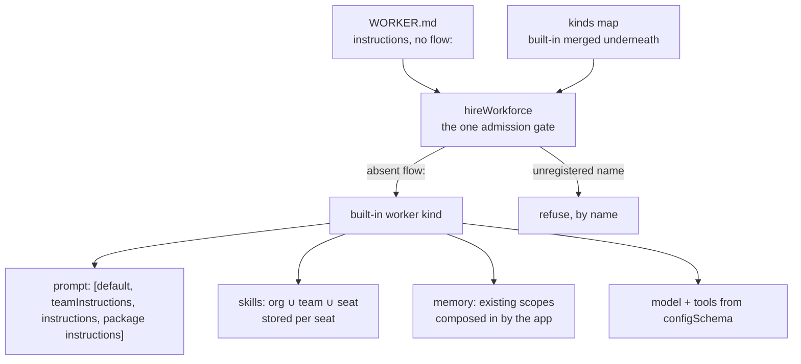

# The Default Workforce Worker Kind — Locked Contract

A team describes a worker in a file — a name, a description, some instructions — and gets a
working agent. Four separate pieces of work build toward that promise at the same time, in
four separate checkouts: the agent itself, its skills, its memory, and the teaching material.

This document is what they all read, so they do not each invent a different answer. It fixes
what the pieces owe each other. **It is a contract, not a design** — it does not build the
worker kind, wire its skills, compose in its memory, or write the guides. Those are
FIX-1363, FIX-1362, FIX-1364 and FIX-1366, and each cites this file rather than re-deriving it.

**Status: the contract has shipped.** Both facts it was written against have been closed. It is
kept as the record of what the pieces owed each other, and of the constraints a change in this
area is still bound by — not as a description of pending work.

The two facts it was written against, and where each landed:

- **A worker file carrying only instructions was refused.** `hireWorkforce` required a `flow:`
  key. It no longer does: an absent key resolves to the built-in `agent` kind, and only a
  *present* `flow:` that names nothing still refuses (C2).
- **A worker's skills were not that worker's.** The skills library keyed its collection at
  `"skills"`, org scope, with no per-seat isolation, so two seats in one org shared a bucket.
  The kind now declares `flowIsolation`, and each seat is seeded from its own resolved union (C3).

One property of that second fix is worth carrying forward, because it reaches callers: the
collection is still **org-scoped**. The organization is the one already on the principal. A
request to a built-in worker sends `userId` and does not carry an organization id; the seat's
skills resolve in that organization. An app that configures no resolver runs in the framework
development organization. The kind does not invent an organization, and it does not read one
off the request.

Related, and deliberately not restated here:

- [`docs/internal/design/kitchen-sink-agent-drift.md`](../internal/design/kitchen-sink-agent-drift.md)
  — the drift audit this contract cites for evidence. A dated characterization, explicitly
  not maintained. **Where it disagrees with C3 below, this document wins** (see C3).
- [`packages/workforce/README.md`](../../packages/workforce/README.md) — the hire surface as
  it ships today.
- [`docs/contributing/architecture-reference.md`](../contributing/architecture-reference.md)
  — carries the two rows a reader needs without opening this file.

The diagram is the shipped shape: an absent `flow:` hires the built-in worker kind, and a seat's
skills are stored under that seat's own instance id.



---

## C1 — Composition, not a type

The worker kind is a flow like any other, and its settings bag (`configSchema`) is
`workerConfigSchema().extend({ model, tools, skills })` — two sets, named here rather than counted,
because a custom-kind author hand-rolling the wrong half gets a kind that refuses the whole roster
at boot:

| | Keys | Whose |
|---|---|---|
| **The admission contract** | `instructions?`, `teamInstructions?`, `seatSkills`, `seatTools`, `seatPackages?`, `seatId` | The framework's. Every hireable kind admits these, by composing `workerConfigSchema()` (`packages/workforce/src/worker-config.ts`). |
| **This kind's own** | `model`, `tools`, `skills` (the switches) | The default kind's alone. They sit at the top level beside the contract's, where the framework closes the set and an undeclared key refuses by name. `tools` is the one of the three that is **reserved** — see below. |
| **The hire step's** | `flow`, `description`, `resources` | Never a kind's. Read and removed before admission, so no `configSchema` sees them — see `resources` below. |

**`resources` is taken outright, and is not a setting at all (FIX-1381).** Where `tools` is a key a
kind declares and the hire step reads, `resources` is a key the hire step *consumes*: it names the
documents that seat may touch, it is removed from the bag before admission, and it never reaches a
kind's `configSchema`. So a kind may not declare a `resources` setting of its own — one that did
would simply stop receiving an authored value. The narrowed map it produces replaces the kind's
flow-level resource map for that seat; `packages/workforce/src/seat-resources.ts` is canonical for
the grant shapes and the refusals.

**`tools` is reserved across hireable kinds, for one meaning: the names of tools this seat may call.** It is not a contract key — a kind declares it itself, or does not declare it at all — but a kind that declares it may not give it some other meaning, because the hire step reads it. A name in `tools:` is resolved against what is registered for that seat (its own `blocks/` folder, then its team's, then the blocks of the packages it holds; a name none of those register goes on to the kind's catalog). A package's block never shadows a catalog tool: a name that is both a held package's block and a key in the built-in `agent` kind's catalog is refused at the mint, naming the package and the catalog. The names that resolved to the seat's own folders or its packages are moved onto `seatTools` as live blocks. The hire step also keeps whether the file wrote a `tools:` line at all, decided before that split: the key reaches the kind only when a line was written, and stays present even when every name was the seat's own and the list emptied. An omitted line is never filled in as `[]`, so a kind can tell a written list from an omitted one; the built-in `agent` kind reads an unset `tools` (omitted, or a hand-built key with no value) as no line, at startup and on every turn, and grants it the tools of the capability presets the seat picked and the blocks of the packages it holds, and a written one exactly its names. A kind is free to decide what it checks the remaining names against, and free to declare no `tools` at all; what it may not do is use the key for unrelated string configuration, which the hire step would rewrite.

The reservation is written down rather than enforced, and it is not new: the pentest lab's `probe` kind re-implemented this fence from its description alone (`goals/pentest-lab/lab/workforce/flows/workers/probe.mts`) and arrived at the same meaning, which is what a real convention looks like before anyone states it. Stating it is cheaper than the alternative — probing each kind to decide whether to resolve its `tools` would put the behaviour behind a guess, and this step removed kind-probing after a probe produced a false accusation (`admissionHint`, `packages/workforce/src/hire.ts`).

It declares **no memory switch** — per C5 memory is composed into a kind at definition time, not
turned on here. `instructions` is the worker file's body arriving as one setting — the hire step
imposes that key (`packages/workforce/src/manifest.ts`, `INSTRUCTIONS_KEY`) and refuses `persona`
by name (`REFUSED_PERSONA_KEY`, same file).

There is no nested bag for a kind's own settings; open-ended data gets one declared key whose schema
is a record.

The contract is what makes a kind hireable, and the hire step hands its bag to **every** kind
rather than probing which ones declared a matching key. A kind whose schema cannot take that bag
refuses at the mint, for the whole roster, at boot.

**Admission is structural, not nominal, and that is D1 rather than an oversight.** Nothing checks
that a kind called `workerConfigSchema()`; what is checked is whether its closed schema accepts
what hire imposes, which is the single enforcement point D1 settled on. A kind hand-declaring the
same keys is therefore admitted identically — verified, not assumed. The cost is that such a kind
does not track the contract: when a key is added, a composed kind receives it and a hand-rolled one
refuses at boot naming the unrecognised key. That failure is loud and collected with the rest of
the roster's problems, never silent, which is why the trade is acceptable and a second nominal gate
is not worth the second authority it would create. That replaces a branch whose other arm was silence: a seat
whose folders declared skills used to mint, run, and hold none, with nothing said anywhere.

**Imposed and never-authored are two different properties, and the contract's keys do not line up
on them.** All six are what hire puts in the bag — `instructions` when the body is non-empty,
`teamInstructions` when the seat's team wrote a `TEAM.md`, `seatPackages` when the seat holds at
least one package, and `seatSkills`, `seatTools` and `seatId` on every record. `seatSkills`, `seatTools`,
`seatPackages`, `seatId` and `teamInstructions` are the ones no file may author, refused by name at the worker
loader and at the hire, from the shared constants in `manifest.ts` that every door references rather
than re-spelling. Those five are both; `instructions` is the one key that is imposed and authored all
the same — as the file's body.

`seatId` is the seat's record id (FIX-1589). It exists because a seat that files or posts must
name itself, and a block cannot see which seat it runs in: core keeps the flow's id off the block
context, so the seat's settings are the one per-seat fact a block can read, and only the hire writes
them. Every mint path (files, the runtime `hire` tool, the boot reload) stamps it, so no seat is
without one.

`teamInstructions` is imposed the same way and refused at **three** doors rather than two — a
`TEAM.md`, a `WORKER.md`, and the hire — all reading one exported constant
(`TEAM_INSTRUCTIONS_KEY`) rather than a literal, so a rename moves every refusal with it instead
of leaving one door open with nothing said.

`teamInstructions` carries the instructions a seat's TEAM wrote — read from that team's
`TEAM.md` by the loader (`packages/workforce/src/loader/read-teams-directory.ts`), joined onto
each of that team's worker records, and imposed by the hire step **only when the record carries
one**. A team that wrote none, and a team with no file at all, both leave the key ABSENT rather
than empty: an empty layer would be a value every kind's schema could see, and a different bag
for every team in every tree that has no file.

`seatPackages` carries the packages a seat holds (FIX-1459): each one's `name`, `path`,
`instructions` (the `PACKAGE.md` body, absent when empty) and `tools` (its blocks, live). A seat
holds every package in its own `packages/` folder and the ones its `packages:` line names from its
team's library or, failing that, the org's (`packages/workforce/src/seat-packages.ts`). The text
arrives on the worker record from the loader (`packages/workforce/src/loader/read-packages-directory.ts`),
the blocks on the generated `packageBlocks` map that `fsdev gen` writes, and the hire step is the
one place they meet. Like `teamInstructions`, the key is imposed **only when a seat holds one**, so a
kind that hand-declared the older contract still hires every seat that holds nothing, and is refused
at boot, naming the key, only when one of its seats does. Every problem a package can cause (a name
no library offers, a block name another tool already uses, a block that declares a store) is a
start-time refusal naming the seat and the package, except a clash with a tool a preset builds per
turn, which cannot be known at start and fails that turn with the framework's duplicate-name error.

Generator slots stay `prompt` / `context` / `history` / `user`. Instructions compose as
`prompt: [default, teamInstructions, instructions, package instructions]` — the framework's default
first, then the seat's team, then the seat's own, then the instructions of the packages it holds
(joined by a blank line, its own packages first), with absent layers dropped rather than joined as
blanks. (The
default is still unshipped; the slot is three entries today and gains the fourth at the front when
it lands.)

**What that order buys, and what it does not.** The position is fixed and checkable: a seat's own
text always follows its team's, and the packages it holds follow both. That is the whole promise. It is **not** a precedence rule. Assembly on this
path is plain concatenation, with no override, precedence or conflict-resolution mechanism
anywhere in it — so if a team says *never touch production* and a seat says *restart the
production queue*, what happens is whatever the **model** does with two contradictory sentences.
The framework does not adjudicate that, and no check on the composed prompt can show otherwise: a
check there proves order, which is a neighbour of precedence rather than precedence itself. Making
a seat's line genuinely win would mean resolving contradictions before the prompt is sent, which
is a different and much larger feature.

A written `tools:` line is a hard runtime fence over the app's catalog, not a hint: a seat may call
exactly the catalog keys it names, and an empty list means no catalog tools, regardless of what the app's
catalog carries, what a bound skill's `allowed-tools` declares (see C5), or what a capability
attached through `uses` would otherwise contribute. A seat that writes **no** `tools:` line may
call the tools of the capability presets its own file picked under `capabilities:` and the blocks
of the packages it holds (FIX-1459);
presets this kind switches on by default grant nothing the seat did not pick. The delegation surface
is fenced to the names the seat listed (FIX-1362's `toolSeatFence`), so a seat with `tools: []`
reaches no catalog tool through a skill's `agents:` either, and a seat with no line takes none of the
tools it chose with it.

**Capability tools are fenced by mechanism (FIX-1393).** The core resolver drops a capability's
catalog-granted tools when the consuming block declares `tools:`, so an app's `uses` can no longer
hand a seat with `tools: []` something it never named. The union this document once described is
gone; `docs/architecture/capabilities.md` → *The tools fence* is canonical for the rule.

**The carve-out is controls, and it is deliberate.** A capability contributes through two slots:
`tools` (a grant from the app's catalog, fenced) and `controlTools` (a framework control, never
fenced). A control is built inside its capability and never exported — so no `tools:` list could
name it back in, and fencing it would leave the seat advertising a tool in its prompt it cannot
call. Three ship in this kind. The first two are held only because the seat's own configuration
asked for them; the third is held by every seat in the kind, and a seat's configuration narrows it
rather than requesting it:

- **The skill loader.** A seat that sets `skills.activateTool: true` is bound with
  `dynamicActivation`, which installs the loader as a control. It reaches the model without
  appearing in `tools:` — by design, because the seat's own setting is the declaration.
- **The delegation surface.** A skill the seat holds that declares `agents:` brings the task
  board's eight tools, also as controls, so `tools: []` does not cut a worker off from the board
  it was given. FIX-1362's `toolSeatFence` still scopes which *catalog* tools reach a skill's
  agents; the board itself is not a catalog grant.
- **The discovery door (FIX-817).** `createWorkforceCapability` contributes `discover` as a
  control, and it ships **on**. This is the one control a seat does not ask for: composing the
  capability is itself the declaration that a seat may ask what is around it, so a second per-seat
  switch would have nothing to add, and defaulting it off would leave an upgraded app's seats
  unable to see the domains their kind already installed. A worker file's `discover:` key only
  **narrows** it — the key lists the domains that seat sees, an empty list sees nothing, and
  omitting the key sees every domain the scope carries. It can never widen past what the app
  installed: naming a domain the scope does not carry does not reach it, and neither does asking
  the tool for that domain directly, because the narrowing is applied to the registry rather than
  filtered in the tool. An app that wants the sources installed but the tool withheld turns off
  the capability's `door` preset. The domains themselves, and what each entry promises, are in
  [the discovery guide](../../apps/docs/docs/orchestration/discovery.md).

Note what this leaves standing: the skills library registers the app's catalog through `tools`, so
that half is fenced normally. The exemption is per-contribution, not per-capability — which is why
one capability can be on both sides of the fence at once.

**The consumer-level opt-outs are no longer load-bearing as a fence.** FIX-1364's memory recipe
(`mem.presets({ recall: false, connect: false })`) and `registerCatalogTools: false` still work and
can still be reasonable defaults on cost or behaviour grounds, but a seat's `tools:` no longer
depends on them for safety. Do not add a per-consumer fence: core is the one structural
enforcement point, and a second would be another door to forget.

The shared `default` prompt is owned and shipped elsewhere (FIX-1344 part 2, not yet landed).
Until it does, the kind ships against `instructions` alone with an explicit seam for `default`
to drop into, and **defines no second default-prompt configuration anywhere in this epic.**

### C1a — Settings are a default layer, not the only layer

A worker file supplies *defaults*. Model and thinking-style choices stay overridable per end
user; per-turn feature switches stay per-turn input. Folding all three into the settings bag
would delete controls the reference app has today (drift note §5, item 4 — model choice and
extended thinking live in user state, feature flags arrive on every `run` input).

Stated because the drift audit found this inverted in the reference app — which is how a
"configure it in the file" contract quietly becomes "configure it *only* in the file".

## C2 — Admission has exactly one gate

`hireWorkforce` is it (tenet 5: fix at the owning layer). A second check anywhere downstream is
how "absent means default" and "wrong means error" drift apart. The complete rule:

| Worker file says | Result |
|---|---|
| no `flow:` | the built-in worker kind |
| `flow: agent` | the built-in worker kind — same kind, named explicitly |
| `flow: <registered>` | that kind, exactly as today |
| `flow: <not registered>` | **refused by name**, listing the kinds that were passed — today's wording, unchanged |
| roster passes `kinds: { agent: … }` | the app's flow wins; the built-in is merged *underneath* whatever the caller supplied |

The existing refusal for a flow filed under someone else's kind name still applies to the
built-in: a replacement must declare `kind: "agent"` (`packages/workforce/src/hire.ts`,
the `factory.kind !== kind` check). **Adding an implicit default must not weaken any existing
refusal** — that is the loud-fail obligation the epic assigned here.

### A replacement must also declare `cardinality: "collection"`

A roster is N seats of one kind, and `defineFlow` defaults to `singleton`
(`normalizeCardinality`, `packages/core/src/flow/defineFlow.ts:200` — `undefined` returns
`"singleton"`). A singleton's id is its kind. So a replacement written the plain way —
`defineFlow({ kind: "agent", configSchema, actions })` — hires without complaint and is then
refused seat by seat at **registration**, not at the mint:

```
Flow "agent" is a singleton but was instantiated with id "engineering.lead". A singleton's id
is its kind. If this definition is meant to have several registered instances, declare
cardinality: "collection" on defineFlow(...); otherwise call the factory without an id.
```

(thrown as `singleton-id-mismatch` at `packages/engine/src/registry/flow-registry.ts:583`;
message at `packages/engine/src/registry/errors.ts:69-72`. Run, not read — see
[Evidence](#evidence).)

The refusal is loud and arrives at boot, so nothing ships broken. It is stated here because a
caller reading only "declare `kind: 'agent'`" would meet it by surprise. It is a requirement
on callers, **not a refusal anyone has to build.**

## C3 — A seat's skills are stored per seat, and *stored* is not the same as *filled*

Two things have to be true for a seat's skills to be that seat's. They are separate, and the
second one is the one that gets missed.

### The drawer — isolation

The seat's *view* already works: `org ∪ teams/<thatTeam> ∪ workers/<thatSeat>`
(`packages/workforce/src/loader/read-seat-skills.ts:187-189`), with a name reaching one seat
from two levels refused rather than shadowed (`duplicateSkillNameMessage`, same file).

The kind declares its skills collection **isolated per flow instance**. A seat *is* a flow
instance, minted with the worker's id (`hire.ts` mints each seat with `{ id: manifest.id }`), and the
storage layer already keys isolated resources as `${identityId}:${flowId}` on the **instance**
id, not the kind (`resolveResourceScopeId`, `packages/engine/src/stores/scope-keys.ts:324`).

**No new primitive was needed** — one option field had to be threaded through.
`DefineSkillsCollectionOptions` accepted `prefix`, `maxInstances` and `scope` but did not
forward `flowIsolation`, while the `defineResourceCollection` it wraps accepts it
(`packages/core/src/types/resource-collection.ts:58`). **FIX-1362 forwards it**, and the
built-in kind switches it on.

### The contents — population

Isolation alone gives every seat its own *empty* drawer and then fills all of them from the
same jar.

`createSkillsLibrary` captured one static `initialSkills` array when the kind was defined —
once per kind, not once per seat. The runtime seeder writes exactly what it is handed into
whichever collection ref it is handed (`ensureSeeded`,
`packages/orchestration/src/skills/seeding.ts`; called that way from `run-skill-tool.ts`,
`load-tool.ts`, `context-fn.ts`, `binding-reader.ts` and `seed-step.ts`). N isolated seats
would therefore end up with N separate buckets holding N *identical* catalogs.

There was no channel for a per-seat set either: `WorkerManifest` was `{ id, declared, body }`
and nothing more, and `hireWorkforce` forwards only frontmatter settings — so the union
`read-seat-skills.ts` already computes had nowhere to ride into the mint.

**The contract therefore requires an instance-specific seeding path.** The seat's computed union
must reach *that seat's* collection as its `initialSkills`, so `ensureSeeded` writes that seat's
skills and no one else's. Acceptance criterion 5 is written to fail without one.

**Built by FIX-1362**, and the handoff it chose is the settings bag: the loader resolves each
seat's union onto its record as `WorkerManifest.skills`, the hire step imposes it as the
`seatSkills` setting the way a body is imposed as `instructions`, and the library's
`initialSkills` takes a resolver that reads it off `ctx.flow.config`. A seat's `skills:` folder
therefore reaches only that seat's collection. (Same defect class as FIX-1372, filed against the
reference app: an activator built with no `initialSkills` shows every matcher tier an empty
catalog on turn 1.)

### Copy-in is the honest lock-in, and it is named

Seeding writes a *copy* into the seat's drawer and records the name in `_meta.seededNames`
(`seeding.ts:58,84`), so a later edit to the company copy's **body** does not reach a seat that
already holds one. A deliberate deletion is not undone either, and that half is stronger than a
convention: `needsResed` returns `false` when the manifest is gone, preserving the decision on
purpose (`packages/orchestration/src/skills/seeding.ts:116-117`).

**One exception, and it is not a body edit.** `ensureSeeded` re-seeds an already-seeded name when
`needsResed` finds the persisted record stale against the FIX-918 migration shape — it still
carries a legacy non-inline `contextMode` the source dropped, the source declares `agents:` the
record lacks, or the source's `contextMode` changed (`seeding.ts:69-74,128-135`). Those replace a
seat's copy without anyone refreshing it. FIX-1362 left that reseeding as it is for seat copies:
it fires on a *schema* mismatch between the persisted record and the current parser, never on a
body edit, so it repairs records the renderer would otherwise skip rather than propagating an
upstream rewording. Narrowing it would leave a seat quietly holding a skill that never renders.

Refreshing a running seat *otherwise* is a deliberate act, and **FIX-1362 built the mechanism**:
`refreshSeededSkills` rewrites a named skill's folder from a source set. It replaces a touched
folder **whole** — deleting keys the new source does not carry — so a supporting file withdrawn
upstream cannot outlive the withdrawal; it touches only names whose manifest still exists, so a
deliberate deletion stands; and ordinary seeding stays additive, because a file the source never
had is the seat's own edit.

### This clause supersedes drift note §3a

Drift §3a says *"Real per-seat isolation needs a real resource identity — a distinct collection
key, prefix, or scope"* (`docs/internal/design/kitchen-sink-agent-drift.md:161`). **It does
not.** The identity already exists as `flowIsolation`, keyed on the seat's instance id.

Stated against the note by name because epic theme 8 sends every later issue to the note
*instead of* re-reading the app, and FIX-1362 is the issue that would otherwise read §3a and
build the refuted mechanism. The note is a dated characterization and explicitly not
maintained, so it is **not edited** — the correction lives here.

## C4 — Memory attaches to existing scopes, and per-seat memory works

`session`, `user`, `org`, plus per-instance isolation where a resource wants it. **Identity and
durable per-member memory are not on the seat object.**

**Corrected by FIX-1364 — "member" here has always meant *seat*** (one flow instance on the
roster), not a person identity outliving seats and not a separate member graph. Read that way,
the gap this contract named is a **default, not a missing primitive**: user-scoped resources are
shared per end user unless something isolates them (BP-027), and
`defineFlow({ isolateUserState: true })` isolates them on the instance id — which a seat has.
A characterization test with a control case (POC on the FIX-1364 spec branch, and the shipped
tests in `packages/workforce/test/agent-worker-memory.test.ts`) showed a fact written through
one seat is invisible to its neighbour with the flag on, and visible with it off. The kind
forwards the flag through `defineAgentWorkerFlow({ isolateUserState })`. **Nothing invents a new
isolation primitive, and no memory field goes on the seat object.**

The residual limit is narrower than the original gap statement and is filed rather than taught
as a blocker: the flag is on the kind, and memory's resource factories do not forward
`flowIsolation` per tier, so a roster is all-isolated or all-shared and cannot mix. Renaming a
seat moves where its isolated data lives, which orphans that seat's memory; documented, not
migrated.

## C5 — Out of the box is the cheap path, and cheap includes *off*

Three things, and they are separate:

1. **Skills** — the library plus per-generator binding (entry point pinned below).
2. **Memory is a build-time composition seam, not a setting.** An instructions-only seat does
   **not** remember out of the box. The default kind and the hire package's required graph stay
   free of memory resources and static memory imports. **"Attached" means an app composed memory
   into its own kind at definition time** — spreading the capability's resource maps plus `uses`,
   or an equivalent helper that is still ordinary flow composition (the seam FIX-1364 designs).
   It does **not** mean flipping a config flag on the stock built-in.
3. **Light-vs-heavy still holds once memory is composed in** — read-side by default. The
   model-classifier tier for skill matching and the background capture pipeline for memory stay
   **opt-in, one setting each**, on the asymmetry signed off on PR #1736: light → heavy is
   additive, heavy → light is a breaking change for rosters already hired.

That asymmetry governs *which* memory a roster gets once memory is composed in. **It never
authorized putting memory in the default required graph, and still does not.** Declaring memory's
resources on the default kind and gating them off is the same violation wearing a switch — a fence
that permits the forbidden thing as long as it is switched off is not a fence. Splitting 2 from 3
is what makes this checkable rather than decorative: a default mint with no memory in it is a
claim a test can falsify.

**Owners:** FIX-1363 may ship the default composition as talking plus skills with no memory wired
— it is not blocked on the memory work either way. FIX-1364 owns the composition-seam design, the
gap honesty, and the teaching surface for *how* an app composes memory in. FIX-1366 teaches that
honestly — not "remembers with zero configuration", and not "one setting on the stock kind".

### The skills entry point is pinned: `createSkillsLibrary` + per-generator binding

**Not `createSkillsCapability`.** Two overlapping entry points exist. *Which one the default is
made of* is a contract call, because leaving it open lets FIX-1363 and FIX-1362 ship two
different default stacks under one name — and FIX-1362 **pins that choice and draws the docs
boundary** around it (its §11). **Deprecating the other surface is FIX-1390's**, not FIX-1362's:
retiring a published entry point is its own change with its own migration, and folding it into a
per-seat seat feature would multiply the blast radius for no gain.

The library wins on the same argument as C3, one level down: its activation is per binding, so
a skill given to one generator never appears in another's context, where the capability keeps a
session-global `activeSkills` bag. The published guide currently teaches the capability;
correcting that is FIX-1366's, not a reason to pick it.

"Whole catalog" here means the load tool's reach over the *skill* catalog (`allowed` omitted), not
licence for the skills library to re-widen a seat's tool reach past its own `tools:` (C1) — the
default kind hands the library the app's tool catalog with registration turned off
(`createSkillsLibrary({ catalog, registerCatalogTools: false })`), so a bound skill's
`allowed-tools` are still validated against it but never registered by the library itself. A
stock-kind skill may declare `allowed-tools` naming a tool in the app catalog; registration stays
solely the generator's own `tools:` mapping (C1).

## C6 — What must not be invented

- No second Agent type at framework level. Do not grow `AgentRegistry` into a product Agent.
- `defineAgent` / `materializeAgent` are **not** the teach path. Nothing here extends, imports
  or mirrors them — equally, nothing here waits on their deletion (FIX-1344 / PR #1713 owns
  that kill).
- Seats are flow instances of a kind. There is no `worker.ts` seat door.
- No Channel or MessageBoard types follow from this contract.

### And one thing that must not be *copied*

The tree still teaches the placeholder kind `worker-agent`. **The built-in kind id is
`agent`.** Until the migration lands, an implementer reading an existing example must not carry
`worker-agent` out of it.

**The migration splits by artifact type.** Teaching surface — prose and rendered pages — is
**FIX-1366's**. Executable surface — fixtures, goal files and tests — is **FIX-1363's**, because a
check goes stale the moment the behaviour changes and belongs with the change that makes it stale,
not with a later teaching pass.

Each owner derives its own list with `grep -rn "worker-agent\|workerAgentFlow"`, excluding
`node_modules`, `spec/`, and `docs/internal/design/kitchen-sink-agent-drift.md` — a dated record,
not teach surface. No list is enumerated here on purpose: the grep is the source of truth, and a
snapshot would go stale before either issue lands. Note what a markdown-only grep misses:
`docs/atlas/workforce.html` is a rendered page (drift note §2f).

**One published line was FIX-1363's, not FIX-1366's** — landed. `workers-on-disk` taught, as
current behaviour, that a record is refused when it *"declares no `flow`, so there is no kind to
hire it into"*: the page's paraphrase of the refusal C2 removed. It needed naming because it sat
outside every issue's declared scope — FIX-1366's scoping grep (drift note §2f) searches
`defineAgent|materializeAgent|AgentRegistry|createAgentRegistry`, and that page contains none of
them.

---

## Acceptance criteria

The contract's falsifiable half, written as assertions a caller can watch happen. Each is
**assigned**, not pooled.

1. A worker file carrying only a description and a body hires, with no `kinds` entry supplied.
2. That seat answers a turn using its body as its instructions.
3. A worker file naming an unregistered kind refuses by name, listing the kinds that were
   passed, and nothing in the roster hires.
4. A roster passing its own `agent` — declared `cardinality: "collection"` — gets its own flow,
   not ours, for **every** seat on the roster, and those seats register.
5. Two seats whose worker folders hold **different** skills each read a catalog containing
   their own skill and not the other's, and each can use it. Separate storage keys are
   necessary and not sufficient: a run in which the two seats resolve to distinct keys and
   **identical** catalogs *fails* this criterion. (See C3 — this is the criterion the
   instance-specific seeding path exists to satisfy.)
6. Editing an org-level skill's **content** after a seat has been seeded does not change what
   that seat holds until that seat is deliberately refreshed — except on the FIX-918 migration
   paths, which replace the copy by design (see C3). A seat's deleted copy stays deleted.
7. Nothing in the shipped kind imports `defineAgent`, `materializeAgent` or `AgentRegistry`.

Each criterion belongs to the issue whose own build makes it true: **1–3 to FIX-1365**, the epic's
thin proof; **4 to FIX-1363**, which builds the built-in and the merge-underneath; **5 and 6 to
FIX-1362**, which builds the instance-specific seeding path C3 requires; and **7 to a grep**, riding
with either building issue. FIX-1365 stays thin by the epic's fence — *a thin hire of the OOTB
worker kind, nothing more* — so 4–6 land on their builders as one tracer-bullet behaviour each,
rather than deferring to a single downstream check. Every assignment is also recorded on its own
Linear issue, which is where an owner picks it up.

**None of these requires memory.** Per C5 the default mint has none, so proving that an app can
compose memory into its own kind is FIX-1364's and is not stated here.

## Edge cases

| Case | Expected |
|---|---|
| Worker file names a kind that isn't registered | Refuse by name, list the kinds passed. Never fall back to the default — that is the typo risk the epic traded for this rule |
| App registers a flow under `agent` whose own kind is something else | Refuse, via the existing mismatched-kind check (`hire.ts`, the `factory.kind !== kind` check). The built-in's presence must not create an exemption |
| App registers `agent` without `cardinality: "collection"` | Seats mint, then registration refuses each by name — see C2, which carries the rule and the error |
| App registers `agent` *and* a worker says `flow: agent` | The app's flow. One resolution path, whether the name was implicit or written |
| Worker file carries a body **and** an `instructions:` key | Already refused today (two sources, no precedence rule). Unchanged |
| Worker file declares `persona:` | Already refused by name today. Unchanged; `persona` is a reserved later opinion, not a hire key |
| Empty/whitespace-only body, no `flow:` | Hires the default with no instructions setting. A weak seat, not a failed hire — matching today's treatment of a blank body |
| Same skill name reaches one seat from two levels | Already refused with both paths named. Unchanged |
| Same skill name on two different teams | Fine, and now fine at the storage level too — different seats, different keys |
| A seat's drawer is isolated but seeded from the kind's shared array | Not an edge case — it is today's default behaviour, and it fails criterion 5. C3's instance-specific seeding path is what removes it |

**Taxonomy:** every admission problem is a startup misconfiguration, therefore fatal and
collected — one run names every bad worker, and nothing hires partially. Existing behaviour;
this contract does not soften it.

## Evidence

The empirical claims above were **run, not read**: a throwaway POC on the never-merged spec branch
`spec/FIX-1361` (under `spec-poc/FIX-1361-seat-skill-isolation/`, beside that branch's spec
document) showed that per-seat isolation separates the drawers but does not fill them —
isolation is not population, C3's second half — and that a plain
`defineFlow({ kind: "agent", … })` is a singleton refused at registration rather than at the mint,
which is why C2 requires `cardinality: "collection"`. Those paths live on that branch only; by
BP-037 neither the spec nor its POC lands on `main`.

## Known gaps, flagged not built

- **Two parallel skills entry points** — `createSkillsLibrary` + binding, and
  `createSkillsCapability` — overlap heavily and cross-reference each other, and the published
  guide teaches the one not picked. C5 pins which one the built-in uses; *deprecating* the other
  is **FIX-1390's** (drift note §2a), correcting the guide is FIX-1366's.
- **Per-seat cost, unmeasured** — isolated storage plus a per-seat `ensureSeeded` means one
  bucket and one cold-start seed pass per seat. At a large roster times a large catalog that is
  a real multiplier and nobody has measured it. FIX-1362 cut the obvious part — a skill-less seat
  does no storage work at all — but the roster × catalog case is still unrun. Not a reason to
  change C3, which trades it for a privacy promise the storage actually keeps.
- **Memory isolation is per kind, not per tier** — C4's residual, and all that is left of it:
  FIX-1364 corrected C4 itself, since "member" there means *seat* and `isolateUserState`
  already isolates on the instance id. What remains is that the flag lives on the flow
  definition and memory's resource factories declare no `flowIsolation` of their own, so a
  roster cannot mix a shared tier with a per-seat one. Same shape as C3's skills-collection
  gap; belongs to the memory package. Filed as FIX-1396.
