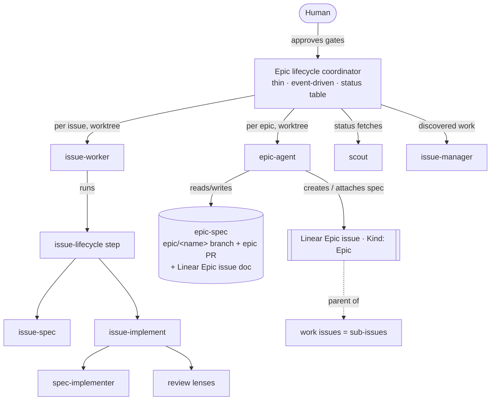
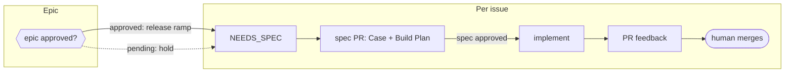
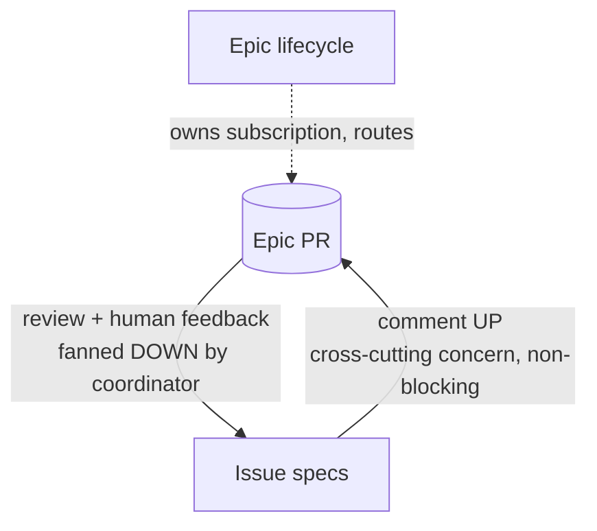

# Orchestration: epic and issue lifecycles

This is the **canonical reference** for how we drive Linear issues to merged PRs with
agents — the roles, the artifacts, and the gates. The orchestration skills
(`epic-lifecycle`, `issue-lifecycle`, `issue-spec`, `issue-implement`,
`cross-spec-review`) and the worker sub-agents (`issue-worker`, `epic-agent`,
`scout`, `spec-implementer`, `issue-manager`) **reference this doc** instead of each
restating the shared concepts. When a concept here changes, it changes here.

## The pieces at a glance

There are exactly **two lifecycles**, one per altitude: an issue has a lifecycle, and a
set of related issues has one too. Nothing coordinates a *bag* of unrelated issues —
parallelism is a property of an epic, not a mode of its own.

- **Epic lifecycle** — the coordinator. One thin, event-driven session that drives an
  **epic** and the issues under it in parallel, holds a compact status table, owns
  subscriptions, and dispatches worker sub-agents. Ephemeral (a session). See
  `epic-lifecycle`.
- **Issue lifecycle** — one issue from spec to merge-ready PR, as a state machine
  advanced one bounded step per event. See `issue-lifecycle`.
- **Epic** — the coordination layer above a *set* of related issues, so cross-cutting
  decisions aren't made in a vacuum. An epic is a **Linear parent issue
  with the `Epic` label (Kind group)**; the work items are its **sub-issues**. Its artifact is the
  **epic-spec** (attached to the epic issue, exactly as a spec attaches to a work issue).
  Owned by the epic lifecycle, authored by the `epic-agent`. **Running several issues in
  parallel always happens under an epic** — that's what makes them a set rather than a
  batch, and it's what gives their shared decisions somewhere to live. A single issue on
  its own needs no epic (`issue-lifecycle` runs standalone). See "The epic-spec" below.
- **Worker sub-agents** — token-isolated agents the coordinator/lifecycle dispatch so heavy
  work happens in *their* context and only a compact summary returns:
  - `issue-worker` (worktree) — advances one issue by one lifecycle step.
  - `epic-agent` (worktree) — authors/maintains one epic-spec.
  - `scout` (Haiku) — read-only status/handle fetches.
  - `spec-implementer` (Sonnet) — implements one decided task.
  - `issue-manager` (Sonnet) — files discovered work into Linear.



## The two coordination stores (we keep both — they are not duplicates)

| Store | What it is | Lifetime | Home |
|---|---|---|---|
| **Coordinator status table** | The coordinator's **internal working memory** — one row per issue (phase, spec PR#, impl PR#, gate-pending, worktree). Updated constantly. | Session-only | `.orchestration/` (**gitignored — never committed**) |
| **Epic-spec running index** | A **durable, exposed audit log** — links to every issue PR (spec + impl) under the epic, for humans and issue agents to navigate from one place. | Life of the epic | The epic-spec (branch + Linear Epic-issue doc) |

They overlap in *content* (both know the PR numbers) but differ in *purpose and
audience*: the table is private and ephemeral; the index is public and durable. The
index is refreshed from the table's handles — it is a projection, not a second live
source.

## Worktree branching (base every issue branch on fresh `origin/main`)

A worktree worker (`issue-worker`, `epic-agent`, or any `isolation: worktree` sub-agent)
does **not** start from a clean checkout of the default branch. The harness spins its
worktree off the **coordinator session's current checkout** — the lifecycle branch.
That branch drifts behind `main` as sibling PRs merge, and it carries coordinator-only
state (the `.orchestration/` working memory is gitignored, but the branch HEAD is still
whatever the coordinator sat on). Building an issue branch straight on top of that inherits
stale code and, if the coordinator branch ever diverges, puts unrelated commits under the
issue's PR.

So **every issue branch is (re)based on freshly-fetched `origin/main` at creation**, not on
the branch the worktree was spun off. Use the worktree-safe form:

```bash
git fetch origin main
git checkout -B <branch> origin/main        # e.g. spec/<ISSUE-ID> or fix/<ISSUE-ID>
```

- **Never `git checkout main`.** The shared `main` ref can be checked out in only one
  worktree at a time, so parallel workers racing on it collide
  (`fatal: 'main' is already checked out at ...`). `checkout -B <branch> origin/main`
  bases off the remote-tracking ref without ever occupying `main`, so any number of
  workers can run it at once.
- **Only at branch *creation*.** `-B` resets the branch to `origin/main`, discarding any
  commits already on it — so run it only when first authoring the spec or first
  implementing. On **re-entry** to an existing branch (a spec-review round, a PR-feedback
  round — each a fresh worktree under the coordinator), *fetch and check out the existing branch*
  instead: `git fetch origin <branch> && git checkout -B <branch> origin/<branch>`. Each
  spec-review round runs in a fresh worktree, so this is the normal path for a
  spec-review round, not an edge case. The
  skills' re-entry guards (an in-flight impl PR jumps straight to PR-feedback) keep these
  paths apart.
- **Exception — a dependent sub-PR** bases on its dependency's branch, not `main`, so review
  can start before the dep merges: `git fetch origin <dep branch> && git checkout -B <sub-PR
  branch> origin/<dep branch>` (rebase onto the dep when it merges). See `issue-lifecycle` →
  Multi-PR issues.

This lives here so `issue-spec` and `issue-implement` share one guarantee rather than each
half-solving it.

## The epic-spec (canonical artifact)

An **epic-spec** is a coordination artifact for a set of related issues. It exists so
decisions aren't made in a vacuum. It is **not** an implementing spec, and issues do
**not** derive from it — they *reference and align* to it.

**Every multi-issue run has one.** An epic is what makes a set of issues a set: it names
the outcome they share and gives their cross-cutting decisions somewhere to live. So
`epic-lifecycle` does not run without an epic — if the issues someone hands it have no
shared outcome worth writing down, they aren't a set, and they should run as independent
`issue-lifecycle` sessions instead. (Reject the batch; don't invent an epic to wrap it.)

The epic itself is a **Linear parent issue tagged with the `Epic` label (Kind group)**, and
the work items are its **sub-issues**. That makes Linear the durable state manager for the
whole set — one query on the epic issue returns its state plus every sub-issue's state — and
makes discovery native: a work issue's epic is simply its **parent** (no registry to parse).
The `Epic` label lets humans filter epic issues off the working board (they're containers,
not work), and forces the set to crystallize *what it's trying to achieve*. The coordinator
creates the epic issue and parents the set's issues under it (via the `epic-agent`;
`issue-manager` conventions for relations apply). **Re-parenting respects Linear's
one-parent rule** — an issue that already has a functional parent is linked with
`relates-to` and flagged, never silently detached.

**Contents:**

1. **Purpose & objective** — abstract: *why* this body of work, *what outcome*. The
   **holistic necessity check** (the `issue-spec` Step 3.5 lens at epic altitude):
   each issue can earn its place while the whole set overbuilds. This is the gated
   sign-off surface (see Gates).
2. **Themes & long-horizon direction** — cross-cutting decisions above any one issue
   (shared surface, naming, sequencing, shared contracts).
3. **Running index** — the durable audit log of every issue PR under the epic.
4. **Open cross-cutting questions** — raised by review or by issues commenting upward.

**Conventions:**

- **Branch `epic/<name>`**; the doc lives at `docs/specs/_epics/<name>.md` on that branch.
- **Never-merged epic PR** — the reviewable + commentable surface. Stays open for the life
  of the *epic*; closes **unmerged** when the epic wraps.
- **The epic branch is never deleted** (issue spec branches are; the epic branch is not) —
  it stays referenceable.
- **Dual-synced to the Linear *Epic issue's* document** — same branch + Linear-document
  pattern as issue specs (BP-037), one altitude up: the epic-spec attaches to the epic
  issue exactly as a spec attaches to a work issue. **Discovery is native** — a work issue's
  epic is its **parent** (check `issue.parent`; does it carry the `Epic` Kind label?). No registry, no
  free-text parsing.
- **Authored/maintained by the `epic-agent`**, dispatched by the coordinator. The agent
  **never starts over**: each dispatch it reads the current epic-spec (the doc + PR thread
  are its durable memory) and applies one bounded update. No private `memory:` — the state
  is the visible doc.
- **Reviewed at the same altitude as an issue spec** — the epic-spec is a *direction*
  artifact, so "Spec review: the bar and the convergence rule" below governs its PR too.
  Feedback that doesn't change the epic's objective or a cross-cutting decision belongs to
  the issues under it, not to the epic-spec.

## Gates (three native GitHub signals)

Coherence and sign-off run on signals the coordinator can read on any wake, not on
out-of-band chat approval:

| Gate | Signal | Meaning | Blocks |
|---|---|---|---|
| **Spec approval** | an approving comment or GitHub Review from a human on the spec PR | The full spec (Part I + Part II) is directionally signed off | implementing that issue |
| **Epic objective** | an approving comment or GitHub Review from a human on the epic PR | The epic's purpose/outcome is worth pursuing | *ramping* the epic's issues (they hold at NEEDS_SPEC) |

The epic-objective gate is the **only** epic-level gate — the epic's *direction* (themes,
feedback, upward comments) flows continuously and never blocks. The spec-approval gate is
per issue.

**Both gates sign off a *direction*, not a finished design.** What each gate does and does
not certify is the subject of the next section; read it before treating an open review
thread as something that has to be closed before a gate can pass.

**Why a comment or review, not a label — either drives; label and Linear mirror.** A
`labeled` webhook is **not** in the PR-activity stream the coordinator subscribes to
(comments, CI, and reviews are), so a label a human applies never wakes the session —
it's only noticed on the next heartbeat poll. A **comment or a review submission is
delivered**, so either wakes the coordinator immediately. The two sign-off gates
therefore run on **either an approving comment or an approving GitHub Review from a
human**, and the coordinator **mirrors it to the `spec approved` / `epic approved`
label** — a durable, filterable record — the moment it detects one. The label is
written by the coordinator now, not applied by the human; it records the gate, it no
longer triggers it.

**What counts as approval.** Either signal, from a human:

- **A comment** that (a) expresses approval — its body says "approved" — **and** (b) is
  authored by a human: not a bot account, and not a comment whose body marks it as
  bot-written (the `_Generated by …_` attribution footer, a "written by &lt;bot&gt;"
  line).
- **A GitHub Review** whose **current effective state is `APPROVED`**, authored by a human
  — same bot exclusion as the comment path — **and** whose author is not the PR's own author.
  GitHub already refuses to let a PR author submit an "Approve" review on their own PR, so a
  native review approval is inherently a second person's sign-off; the coordinator checks
  `review.user != pr.user` explicitly anyway rather than depending on that alone. This matters
  in practice: automated review bots (Cursor Bugbot, Codex, and similar) post Review
  submissions with a `state`, not just comments, and none of them should trip this gate.

  **Latest-state, not any-state — the reviews list is chronological history.** The reviews
  endpoint returns *every* review ever submitted, so a lone `state: APPROVED` in it does **not**
  mean the PR is approved *now*. Collapse to the **latest review per human reviewer** and gate
  on that: an approval counts only if that reviewer's most-recent review is `APPROVED`, and
  **no** human reviewer's latest review is `CHANGES_REQUESTED` (a later change-request overrides
  an earlier approval; a later approval clears an earlier change-request). Otherwise a reviewer
  who approved and then requested changes would still trip the gate on the stale approval.

  **Fresh against the current head.** Each review carries a `commit_id`. An approval on an
  earlier commit is **stale** once the author pushes new work — implementation must not start
  from an unreviewed head. Require the approving review's `commit_id` to be the PR's current
  head SHA (or, equivalently, treat any substantive push after an approval as re-opening the
  gate). Because the coordinator re-derives gate state every wake (it never treats a
  once-seen approval as permanent — see the subscription/refresh discipline), a post-approval
  push naturally drops the gate back to pending on the next refresh; the rule here is just that
  the check is "is the *current head* approved," not "was anything ever approved."

Both clauses are load-bearing — they exclude the coordinator's own footer-signed
comments and every review bot, so only a genuine human sign-off — by comment or by
review — trips the gate. **A substantive push after a comment-based approval re-opens the
gate too** (the comment carries no `commit_id`, so the coordinator treats a human "approved"
as approving the state at that moment; new work needs fresh sign-off).

The epic *issue's* Linear state is a second human-facing mirror of the objective gate, not
the trigger — the **coordinator writes that mirror** when the approving comment or review
lands, so it doesn't drift. (The epic issue itself is tagged with the **`Epic` label under Linear's
"Kind" group** — that's what marks a Linear issue as an epic and keeps it filterable off the
working board.)



For a **single-PR** issue the goal is proven at implementation completion (before the PR opens),
so `merge` is completion. For a **multi-PR** issue (a spec's PR plan), the diagram's single
`merge → done` expands: the per-sub-PR runs only prove their slices, so **after the last sub-PR
merges the assembled end-to-end goal runs, and only its PASS marks the issue done** — the last
merge is not itself completion. See `issue-lifecycle` → Multi-PR issues for the exact step.

## Spec review: the bar and the convergence rule

A spec PR exists to answer **one** question: *is this the right approach?* It is a
direction check, not a design review — the whole point of reviewing a spec is that a
wrong approach costs a doc edit here and a rewrite later. This section is the canonical
statement of the bar and how a spec-review round terminates; `issue-spec`,
`issue-lifecycle`, `epic-lifecycle`, and `issue-implement` all reference it.

### What sign-off certifies

**Directional correctness, and nothing more.** An approved spec means: the problem is
real, the approach will work, the decisions in Part I are the ones we want, and the build
plan's shape and sequence are sound. It does **not** mean the design is finished, the
names are final, or every question a reader could raise has been answered. Part II is
*directional by construction* (see `spec-template.md`) — the implementer settles
signatures, local structure, and line-level choices in the code, under `tdd`/`diagnose`
and the challenger.

So a spec is done when it is **directionally correct**, not when it is unimpeachable.
"Nothing left to nitpick" is not the bar and was never reachable — it's an infinite
target, and chasing it is how a design that was right on round one takes ten rounds to
get approved.

### The bar — one test, three dispositions

For each piece of review feedback, ask the **only** question that matters at this
altitude: *does acting on this change the approach?* Then pick exactly one disposition:

| Disposition | When | What happens |
|---|---|---|
| **Fold in** — spec-level | The approach is wrong, won't work, or solves the wrong problem · a Part I Decision is wrong or missing · a constraint the design didn't account for invalidates it · scope is wrong (a deliverable that shouldn't ship, or a missing one) · the spec contradicts itself | Re-draft the affected sections (anti-addenda rule), mirror repo doc ↔ Linear, reply on the thread |
| **Note for the implementer** *(the default)* | Anything below that line: naming, file layout, local structure, which helper, error-message wording, a micro-optimization, a test-name preference, "have you considered X *here*", a detail Part II deliberately left open | Record **verbatim** under the spec's *Review notes for the implementer* section, reply once saying it's left for implementation, move on. **Do not rewrite the design prose around it.** |
| **Drop** | Already answered in the spec · out of the issue's scope · a preference with no defect behind it · a factual error about the codebase | Reply once with the pointer or the correction. No spec edit, no note. |

**The default disposition is Note, and the burden of proof is on folding.** If you can't
name which Part I Decision or which part of the approach changes, it is not spec-level —
it's a note. Genuine factual corrections and broken references are the one cheap
exception: fix them inline without ceremony (they don't move the design, so they don't
cost a round).

Two things follow that are worth stating outright, because the instinct runs the other way:

- **A note is not a deferral or a loss.** The implementing agent reads the notes section
  as input. Recording a good observation there is *how* it gets acted on — at the altitude
  where it can actually be judged against real code. Folding it into the spec instead
  pretends the spec can settle it, which is the mistake.
- **Volume is not signal.** Ten below-the-bar comments do not add up to one spec-level
  problem. Ten notes is a normal, healthy review of a directional document.

### The convergence rule

**Default budget: two review rounds per spec PR** (a *round* = one pass over the batch of
feedback outstanding since the last push). After the second round, the spec has converged:
declare it, surface it to the human for the approval gate, and carry every remaining
open thread as implementer notes. Spend a third round only when round two surfaced a
genuine **spec-level** finding — a new approach question, not more notes. Say so when you
do, in one line, so the extra round is a visible decision rather than drift.

Three facts make that budget safe rather than reckless:

- **An unresolved thread on a spec PR blocks nothing.** The spec PR is *never merged* —
  `issue-implement` closes it unmerged when implementation starts. It has no merge gate,
  so open threads have no gating power. Do not drive them to zero; that's a habit borrowed
  from code PRs, where it's correct, and it does not transfer.
- **Nothing is lost by converging.** Below-the-bar feedback lands in the notes section and
  reaches the implementer. Above-the-bar feedback was folded in. There is no third
  category that needs another round to rescue it.
- **Implementation is a second review, and a better one.** The design gets challenged
  again against real code (`issue-implement`'s challenger), the diff gets the full
  `review` panel, and a spec blind spot that surfaces there is folded back and flagged.
  A spec doesn't have to be the last line of defence, so it shouldn't be reviewed as if
  it were.

### Reviewers are third-party — control the disposition, not the input

Most spec-PR review comes from **automated reviewers we do not control and cannot
instruct** (Bugbot, Codex, Copilot, and friends). They are tuned for code review, so they
reliably produce line-level, exhaustive, code-shaped feedback on a document that is
deliberately not a finished design. That is expected behavior, not a problem to be
argued with.

So the discipline is ours, not theirs:

- **Triage; don't negotiate.** One reply per thread stating the disposition. Never a
  back-and-forth to reach agreement with a bot, and never a re-review to satisfy one.
- **A reviewer restating a below-the-bar point is still below the bar.** Repetition
  doesn't promote it. Reply once; the second occurrence needs no new answer.
- **Only a human's approving comment or review trips the gate** (see Gates above) — bot
  reviews are explicitly excluded. A bot leaving `CHANGES_REQUESTED` on a spec PR does
  **not** hold the gate, and does not extend the round budget.
- **The spec PR description carries a short reviewer contract** (`issue-spec` Step 6) —
  what this document is, what to challenge, what is out of scope. It's the one lever we
  have on an uninstructable reviewer, it costs nothing, and it measurably raises the
  altitude of what comes back.

### How this shows up in the artifacts

- **`spec-template.md`** — the reviewer contract at the top of Part II, and *Review notes
  for the implementer* (§13) as the home for below-the-bar feedback.
- **`issue-spec`** Step 6 (reviewer contract in the PR description) and Step 6.5 (the
  triage loop that applies the bar and the budget).
- **`issue-lifecycle`** / **`epic-lifecycle`** — the round counter lives in the handle
  cache; the coordinator declares convergence and surfaces the gate.
- **`issue-implement`** — reads the notes section as input; an unaddressed below-the-bar
  spec comment is **not** a blocker to starting implementation.

## How feedback flows (epic ↔ issues)



The coordinator owns the epic PR subscription (sub-agents can't hold one) and routes epic
feedback *down* to the aligned issue workers; an issue's `issue-spec` can comment
*up* on the epic PR to raise a cross-cutting concern while it keeps working. All on
existing `subscribe_pr_activity` + PR-comment machinery — no new plumbing.

Fan-out is subject to the same bar as any spec review: an epic comment is fanned down only
when it changes a cross-cutting decision. Below-the-bar epic feedback about one issue's
internals goes to that issue's implementer notes, not into its spec.

## Environment: cloud vs. local (PR subscriptions)

`subscribe_pr_activity` depends on a webhook relay GitHub can call back into — that relay
exists only for Claude's **hosted/cloud environments** (Claude Code on the web, a managed
remote execution environment). A **local** Claude Code CLI session has no publicly
reachable callback endpoint, so subscribing does nothing there even if the call itself
succeeds: no event will ever arrive to wake the session.

**Detecting which one you're in.** A cloud session's system prompt carries an explicit
"remote execution environment" section that a local session's prompt lacks entirely; the
`mcp__Claude_Code_Remote__*` tools (`list_environments`, `create_trigger`, `send_later`)
are similarly cloud-only and won't resolve locally. Check for either before relying on
`subscribe_pr_activity` — don't assume cloud by default.

**Local fallback: poll with `Monitor`, not a scheduler.** Both `Monitor` and `CronCreate`
are harness-native (not cloud-gated), but they poll very differently, and for PR-watching
`Monitor` is the better primitive:

- **`Monitor` (preferred).** Arms a shell poll loop that runs in a **subprocess**; each
  stdout line it emits becomes an event that wakes the session. The loop hits the PR's
  comment / review / check endpoints on an interval (60s+ for a remote API — GitHub rate
  limits) and prints only *new* activity. Because the polling itself is a subprocess, the
  model wakes **only on a real event**, not on every tick — cost is proportional to actual
  PR activity, and the poll behavior is deterministic (fixed shell, not a model turn that
  re-decides each fire). This is the closest local analogue to the cloud webhook stream.
  The **`watch-pr` skill** packages this loop — reach for it rather than re-deriving the
  endpoints; use it as the *primary* wake signal a local coordinator/lifecycle re-enters on.
- **`CronCreate` (only when you need a time-based tick).** Fires a *prompt* on a wall-clock
  schedule, so it costs a full model turn **every** fire whether or not anything changed —
  a poll-and-compare on every empty tick. Use it only for a genuinely time-driven check
  (a low-frequency "is the Monitor still alive / anything I missed" backstop), not as the
  main watch.

**Cover the same signals the cloud path does** (this is where the naive comment-only loop
fails): the watch must poll **PR comments *and* reviews *and* check-runs *and* PR meta**
(`state`/`mergedAt`). Two things the comment-only loop gets wrong:

- A `state: APPROVED` review lives at `pulls/{n}/reviews`, *not* at either comment endpoint —
  omit it and a local orchestrator goes deaf to the exact approval gate above.
- **Merge/close** is a *quiet* transition — no comment, review, or check accompanies it. A
  watch that only polls activity endpoints never sees it, so a local lifecycle waiting on the
  impl PR to merge would hang. `watch-pr` polls the PR-meta each tick so its **continuous 60s
  cadence *is* the heartbeat for that transition** — which is why, locally, it substitutes for
  the `send_later` heartbeat too, not just `subscribe_pr_activity`.

Also advance the comment `since` cursor **only after a successful fetch**: a swallowed
transient `gh` failure that still moved the cursor would drop any comment posted during the
failed interval outside the next window.

**Arming a Monitor is not idempotent — one per PR.** Unlike `subscribe_pr_activity` (safe to
re-call every wake), each `watch-pr` arm spawns a *new* poll subprocess. A coordinator that
re-arms on every refresh would stack duplicate pollers, notifications, and API traffic. So a
local coordinator/lifecycle must **track each PR's Monitor handle in its `.orchestration` cache and
re-arm only when it's missing or dead** — the "re-assert every wake" discipline is for the
cloud subscription, not for local Monitors.

**Read current state at arm time — the Monitor only reports what changes *next*.** The Monitor
primes its snapshot so it emits only post-arm activity — which means anything already true when
it starts (CI that already finished green, an approval already posted) is suppressed and never
fires. A coordinator that arms the Monitor *right after opening a PR* can therefore miss an
already-green CI run, and locally there's no `send_later` heartbeat to re-read — the issue
stalls in `PR_FEEDBACK` on a green PR. So on the wake that arms (or re-arms) a Monitor for a
PR, the coordinator must **immediately re-derive that PR's current CI / review / merge state
and act on it in the same wake** — exactly the re-derive-every-wake discipline; the Monitor is
for subsequent changes, the current state is the coordinator's to read directly.

Two caveats to state to the user up front, not discover later. **(1) Session-only.** A
`Monitor` (like a `CronCreate` job) dies when the session ends, unlike a cloud session's
server-side routines — a local coordinator's "still watching" guarantee is weaker; say so rather
than imply parity. The one thing the Monitor *can't* self-heal is its own process dying, so an
unattended local run should still arm a low-frequency `CronCreate` backstop that re-checks
state and re-arms the watch. **(2) Unproven.** This fallback is the recommended design but
hasn't been confirmed against a live local run yet — verify the `watch-pr` Monitor actually
emits and re-enters the loop the first time a coordinator/lifecycle runs locally, before trusting it
unattended.

## Token discipline (why it stays cheap)

Coordinators (epic lifecycle, issue lifecycle) hold only **handles** — issue IDs, PR#s, branches, a few
lines of phase. Every heavy step (author a spec, implement, maintain the epic-spec) runs
in a **worker sub-agent** that does the work in its own context and returns ≤ a screen.
State is re-derived from durable truth (Linear + PRs + the epic-spec doc), never replayed
from transcript. Idle cost ≈ 0.

Event routing follows the same discipline. The coordinator does **not** read event
content: on a PR event it maps PR# → owning issue and dispatches that issue's worker,
which reads the review/CI in its own context. Two reads are the exception, both **small
and offloaded to `scout`**, not folded into the coordinator: the **spec/epic-PR approval
check** ("is there an approving comment or GitHub Review from a human?" — the sign-off
gate — checks both the PR's comments and its reviews) and
**epic-PR feedback fan-out** ("which aligned issues does this comment touch?"). Scout
returns the verdict / target list; the coordinator routes on it and, for a detected
approval, applies the mirror label.

> **Considered and deferred: a dedicated feedback-router sub-agent.** A standing agent that
> triages every incoming event and decides routing was weighed and **not** adopted for v1:
> the coordinator's per-event work is already cheap (PR# → owner → dispatch), content
> reading already lives in the workers, and cross-over signaling already flows via issues
> commenting up on the epic PR. The one genuinely heavy read (epic fan-out targeting) is
> handled by `scout`. Introduce a dedicated router only if event volume and cross-over
> routing outgrow the scout-assisted approach — not preemptively.
