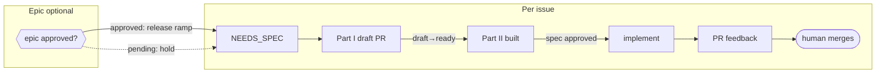
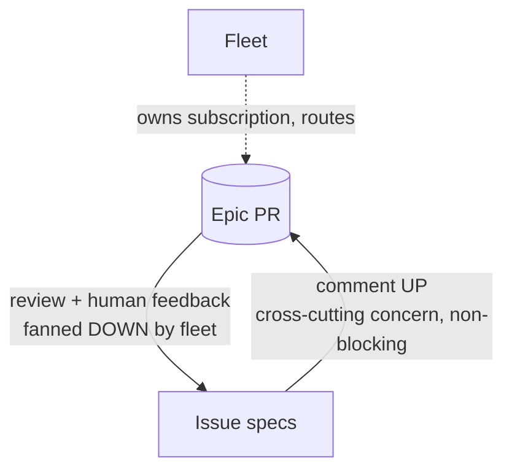

# Orchestration: fleets, epics, and issue lifecycles

This is the **canonical reference** for how we drive Linear issues to merged PRs with
agents — the roles, the artifacts, and the gates. The orchestration skills
(`issue-fleet`, `issue-lifecycle`, `issue-spec`, `issue-implement`,
`cross-spec-review`) and the worker sub-agents (`issue-worker`, `epic-agent`,
`scout`, `spec-implementer`, `issue-manager`) **reference this doc** instead of each
restating the shared concepts. When a concept here changes, it changes here.

## The pieces at a glance

- **Fleet** — the coordinator. One thin, event-driven session that drives several
  issues in parallel, holds a compact status table, owns subscriptions, and dispatches
  worker sub-agents. Ephemeral (a session). See `issue-fleet`.
- **Issue lifecycle** — one issue from spec to merge-ready PR, as a state machine
  advanced one bounded step per event. See `issue-lifecycle`.
- **Epic** *(optional)* — a coordination layer above a *set* of related issues so
  cross-cutting decisions aren't made in a vacuum. An epic is a **Linear parent issue
  with the `Epic` label (Kind group)**; the work items are its **sub-issues**. Its artifact is the
  **epic-spec** (attached to the epic issue, exactly as a spec attaches to a work issue).
  Owned by the fleet, authored by the `epic-agent`. See "The epic-spec" below.
- **Worker sub-agents** — token-isolated agents the fleet/lifecycle dispatch so heavy
  work happens in *their* context and only a compact summary returns:
  - `issue-worker` (worktree) — advances one issue by one lifecycle step.
  - `epic-agent` (worktree) — authors/maintains one epic-spec.
  - `scout` (Haiku) — read-only status/handle fetches.
  - `spec-implementer` (Sonnet) — implements one decided task.
  - `issue-manager` (Sonnet) — files discovered work into Linear.

## The two coordination stores (we keep both — they are not duplicates)

| Store | What it is | Lifetime | Home |
|---|---|---|---|
| **Fleet status table** | The coordinator's **internal working memory** — one row per issue (phase, spec PR#, impl PR#, gate-pending, worktree). Updated constantly. | Session-only | `.orchestration/` (**gitignored — never committed**) |
| **Epic-spec running index** | A **durable, exposed audit log** — links to every issue PR (spec + impl) under the epic, for humans and issue agents to navigate from one place. | Life of the epic | The epic-spec (branch + Linear Epic-issue doc) |

They overlap in *content* (both know the PR numbers) but differ in *purpose and
audience*: the table is private and ephemeral; the index is public and durable. The
index is refreshed from the table's handles — it is a projection, not a second live
source.

## The epic-spec (canonical artifact)

An **epic-spec** is a coordination artifact for a set of related issues. It exists so
decisions aren't made in a vacuum. It is **not** an implementing spec, and issues do
**not** derive from it — they *reference and align* to it.

The epic itself is a **Linear parent issue tagged with the `Epic` label (Kind group)**, and
the work items are its **sub-issues**. That makes Linear the durable state manager for the
whole set — one query on the epic issue returns its state plus every sub-issue's state — and
makes discovery native: a work issue's epic is simply its **parent** (no registry to parse).
The `Epic` label lets humans filter epic issues off the working board (they're containers,
not work), and forces the set to crystallize *what it's trying to achieve*. The fleet creates the epic
issue and parents the set's issues under it (via the `epic-agent`; `issue-manager`
conventions for relations apply). **Re-parenting respects Linear's one-parent rule** — an
issue that already has a functional parent is linked with `relates-to` and flagged, never
silently detached.

**Contents:**

1. **Purpose & objective** — abstract: *why* this body of work, *what outcome*. The
   **holistic necessity check** (the `issue-spec` Step 3.5 lens at epic altitude):
   each issue can earn its place while the whole set overbuilds. This is the gated
   sign-off surface (see Gates).
2. **Themes & long-horizon direction** — cross-cutting decisions above any one issue
   (shared surface, naming, sequencing, shared contracts).
3. **Running index** — the durable audit log of every issue PR under the epic.
4. **Open cross-cutting questions** — raised by review or by issues commenting upward.

**Conventions:**

- **Branch `epic/<name>`**; the doc lives at `docs/specs/_epics/<name>.md` on that branch.
- **Never-merged epic PR** — the reviewable + commentable surface. Stays open for the life
  of the *epic*; closes **unmerged** when the epic wraps.
- **The epic branch is never deleted** (issue spec branches are; the epic branch is not) —
  it stays referenceable.
- **Dual-synced to the Linear *Epic issue's* document** — same branch + Linear-document
  pattern as issue specs (BP-037), one altitude up: the epic-spec attaches to the epic
  issue exactly as a spec attaches to a work issue. **Discovery is native** — a work issue's
  epic is its **parent** (check `issue.parent`; does it carry the `Epic` Kind label?). No registry, no
  free-text parsing.
- **Authored/maintained by the `epic-agent`**, dispatched by the fleet. The agent **never
  starts over**: each dispatch it reads the current epic-spec (the doc + PR thread are its
  durable memory) and applies one bounded update. No private `memory:` — the state is the
  visible doc.

## Gates (three native GitHub signals)

Coherence and sign-off run on signals the coordinator can read on any wake, not on
out-of-band chat approval:

| Gate | Signal | Meaning | Blocks |
|---|---|---|---|
| **Build Plan** | spec PR `draft` → ready-for-review | The Case (Part I) holds | authoring Part II (the Build Plan) |
| **Spec approval** | an approving comment or GitHub Review from a human on the spec PR | The full spec is signed off | implementing that issue |
| **Epic objective** | an approving comment or GitHub Review from a human on the epic PR | The epic's purpose/outcome is worth pursuing | *ramping* the epic's issues (they hold at NEEDS_SPEC) |

The epic-objective gate is the **only** epic-level gate — the epic's *direction* (themes,
feedback, upward comments) flows continuously and never blocks. The two spec gates are
per issue.

**Why a comment or review, not a label — either drives; label and Linear mirror.** A
`labeled` webhook is **not** in the PR-activity stream the coordinator subscribes to
(comments, CI, and reviews are), so a label a human applies never wakes the session —
it's only noticed on the next heartbeat poll. A **comment or a review submission is
delivered**, so either wakes the coordinator immediately. The two sign-off gates
therefore run on **either an approving comment or an approving GitHub Review from a
human**, and the coordinator **mirrors it to the `spec approved` / `epic approved`
label** — a durable, filterable record — the moment it detects one. The label is
written by the coordinator now, not applied by the human; it records the gate, it no
longer triggers it.

**What counts as approval.** Either signal, from a human:

- **A comment** that (a) expresses approval — its body says "approved" — **and** (b) is
  authored by a human: not a bot account, and not a comment whose body marks it as
  bot-written (the `_Generated by …_` attribution footer, a "written by &lt;bot&gt;"
  line).
- **A GitHub Review** with `state: APPROVED`, authored by a human — same bot exclusion
  as the comment path — **and** whose author is not the PR's own author. GitHub already
  refuses to let a PR author submit an "Approve" review on their own PR, so a native
  review approval is inherently a second person's sign-off; the coordinator checks
  `review.user != pr.user` explicitly anyway rather than depending on that alone. This
  matters in practice: automated review bots (Cursor Bugbot, Codex, and similar) post
  Review submissions with a `state`, not just comments, and none of them should trip
  this gate.

Both clauses are load-bearing — they exclude the coordinator's own footer-signed
comments and every review bot, so only a genuine human sign-off — by comment or by
review — trips the gate. The Build-Plan gate is **unchanged**: it's still the human
promoting the draft spec PR to ready-for-review (caught on the heartbeat too, since a
`ready_for_review` webhook isn't guaranteed to arrive either).

The epic *issue's* Linear state is a second human-facing mirror of the objective gate, not
the trigger — the **fleet writes that mirror** when the approving comment or review lands,
so it doesn't drift. (The epic issue itself is tagged with the **`Epic` label under Linear's
"Kind" group** — that's what marks a Linear issue as an epic and keeps it filterable off the
working board.)

## How feedback flows (epic ↔ issues)

The fleet owns the epic PR subscription (sub-agents can't hold one) and routes epic
feedback *down* to the aligned issue workers; an issue's `issue-spec` can comment
*up* on the epic PR to raise a cross-cutting concern while it keeps working. All on
existing `subscribe_pr_activity` + PR-comment machinery — no new plumbing.

## Token discipline (why it stays cheap)

Coordinators (fleet, lifecycle) hold only **handles** — issue IDs, PR#s, branches, a few
lines of phase. Every heavy step (author a spec, implement, maintain the epic-spec) runs
in a **worker sub-agent** that does the work in its own context and returns ≤ a screen.
State is re-derived from durable truth (Linear + PRs + the epic-spec doc), never replayed
from transcript. Idle cost ≈ 0.

Event routing follows the same discipline. The coordinator does **not** read event
content: on a PR event it maps PR# → owning issue and dispatches that issue's worker,
which reads the review/CI in its own context. Two reads are the exception, both **small
and offloaded to `scout`**, not folded into the coordinator: the **spec/epic-PR approval
check** ("is there an approving comment or GitHub Review from a human?" — the sign-off
gate — checks both the PR's comments and its reviews) and
**epic-PR feedback fan-out** ("which aligned issues does this comment touch?"). Scout
returns the verdict / target list; the coordinator routes on it and, for a detected
approval, applies the mirror label.

> **Considered and deferred: a dedicated feedback-router sub-agent.** A standing agent that
> triages every incoming event and decides routing was weighed and **not** adopted for v1:
> the coordinator's per-event work is already cheap (PR# → owner → dispatch), content
> reading already lives in the workers, and cross-over signaling already flows via issues
> commenting up on the epic PR. The one genuinely heavy read (epic fan-out targeting) is
> handled by `scout`. Introduce a dedicated router only if event volume and cross-over
> routing outgrow the scout-assisted approach — not preemptively.
