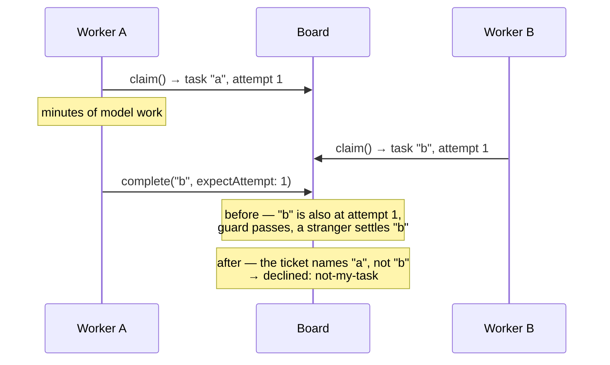

# PR descriptions — writing for two audiences

Every PR we open is read by two kinds of reviewer who want opposite things, and a
description written for one fails the other.

- A **human** has scarce attention and is the only reviewer who can judge *direction*,
  *scope*, and *whether this was worth building*. Their failure mode is skimming past the
  one decision that actually mattered — or bouncing off a wall of process text before
  reaching a single fact about the change.
- An **automated reviewer** (Bugbot, Codex, Copilot, Cursor, and friends) has unlimited
  attention and no sense of altitude. It reads every line at the same depth. Its failure
  mode is twenty line-level findings on a document that isn't code — or on code that is
  deliberately throwaway — with the one real finding buried among them.

Both get served, but **not in the same place**. The human reads top-down and stops early;
a bot reads all of it regardless. So the visible half of the description is written for
the human, and the machine-facing contract sits below the fold, where it costs a human one
skipped line and a bot nothing at all.

This file is canonical for **PR descriptions**. The fold itself, the word budgets, the
density rules, and the `<details>` mechanics live in
[`writing-for-humans.md`](writing-for-humans.md) and are not restated here — read that
first.

## The layout

Every PR that seeks review — spec, epic, implementation, docs-cleanup — is in this order.

The one exception is a PR that seeks **no** review of a direction: a `settle-claim` verdict
PR, whose body is a compact evidence block and whose only job is to put a finding in front
of a human. It leads with the claim and why it earned a PR, and stops there.

| | Block | Answers | For | Authored |
|---|---|---|---|---|
| 1 | **The problem** | What's broken, for whom, why now? | Product owner | Per PR |
| 2 | **What this does** | The mechanism in plain terms, plus a diagram if one earns its place | Product owner | Per PR |
| 3 | **What's asked of you** | The decisions *they* own, the recommendation, what a wrong one costs | Product owner | Per PR |
| 4 | **Parts worth reviewing closely** | Where, in *this* change, should attention go? | Code reviewer | Per PR |
| 5 | **Links line** | Spec doc, Linear, epic — and whether this merges | Both | Per PR |
| — | *collapsed* → **How to review this** | What is this artifact, at what altitude? | Code reviewer | Pasted verbatim per PR kind |
| — | *collapsed* → **Engineering calls** | What was decided that a product owner doesn't own | Code reviewer | Per PR |
| — | *collapsed* → **Everything else** | The full case, verification output, file-by-file changes | Code reviewer | Per PR |

**The *For* column is the load-bearing one.** A product owner's job ends at the bottom of
block 3, and blocks 1–3 are written so it can — plain language, decisions priced in
consequences. Everything below that line is engineer-to-engineer. Mixing the two registers,
by putting an implementation call in block 3 or by writing block 3 in mechanism, is the
failure this layout exists to prevent: it produces a description where the reader can't tell
which sentences are addressed to them.

Two things about this order are easy to get wrong and worth stating plainly.

**Nothing precedes the problem** — not a ref, not a label, not a sentence about what kind
of artifact this is. A reviewer can't judge any of it before they know what hurt. The
links line is genuinely useful, which is why it's kept, and it goes at position 5 where a
reader reaches for it *after* deciding they want to go deeper.

**Blocks 3 and 4 are both asks, but of different people, and both come after 1–2 for a
reason.** Asking someone to look hard at "Decision 4" before they know what problem Decision
4 serves is asking them to review a number. On a change that follows an approved spec, block
3 is one line saying so, and that line is worth writing because its absence reads as an
omission. Match it to the route: *this implements the approved direction* only where a spec
was approved; on a bug, a brief-backed change, or one with no upstream contract, *nothing
here is yours to decide* — those PRs are themselves the approval gate, so claiming an
approved direction claims provenance they don't have.

What a product owner can judge and a bot can't is direction, scope, and whether this was
worth building, so blocks 1–3 state the problem in observable behaviour and price each
decision in consequences — customers, promises, timing, reversibility. The full contract is
[`asking-for-decisions.md`](asking-for-decisions.md); §3 below applies it.

**The contract moved below the fold; it did not go away.** It is the one lever we have on
reviewers we can't instruct, and it measurably raises what comes back. But it says the
same thing on every PR of its kind, which is exactly what a `<details>` is for.

> **The contract is a request, not a control.** We don't own those reviewers and can't
> instruct them. What we can do is state the altitude, which costs nothing. When a bot
> comments off-altitude anyway, that isn't a violation to argue with — it's ordinary
> triage under [`orchestration.md`](orchestration.md) → "Spec review: the bar and the
> convergence rule".

## 1. The problem

**Two to four sentences, in words that don't require the codebase.** What breaks, who
notices, what it costs. Then *why now*, if there's a reason this is being fixed today
rather than whenever — a downstream milestone that's blocked, a failure that's moved from
rare to routine.

Lead with the failure, not with the PR. `This PR introduces a bound claim ticket…` tells a
reviewer nothing they can disagree with. `Two workers can both settle the same task, and
the loser's write lands on the winner's row` does.

## 2. What this does

**Two to four sentences on the mechanism**, in the same plain register. Then the diagram,
if there is one.

Name what it deliberately *doesn't* do in the same breath if a reader would otherwise
assume it. A known gap never collapses (`writing-for-humans.md` → "What never gets
collapsed"), and a reviewer who finds one themselves reports it as an oversight — a round
spent explaining it was on purpose.

### Diagrams — one, if it earns its place

GitHub renders ` ```mermaid ` fences in PR descriptions. Reach for one when the change is
about something prose carries badly:

| Shape | Use it for |
|---|---|
| `sequenceDiagram` | An interleaving or a race — two actors, one row, the order that goes wrong |
| `flowchart LR` | The path a value takes through layers, and where a new guard sits on it |
| `flowchart TD` | A dependency shape — a PR plan's DAG, an epic's issue graph |
| `stateDiagram-v2` | A state machine you're adding a transition to |

**Before/after is the highest-value shape we have**, because most of what we ship changes
a mechanism that already exists, and the delta is the whole review.

Rules, all cheap to check:

- **Under ~10 nodes.** Past that it's a picture of complexity, not an explanation of it.
- **Label edges with what flows**, not with `yes`/`no` where the arrow already says it.
- **Don't diagram a list.** File layouts, package trees, and numbered steps are lists, and
  a diagram of a list is a list that's harder to read.
- **If the prose beside it says the same thing, cut one.** Usually the prose, if the
  diagram is genuinely clearer. Never keep both out of politeness.
- **Two is the ceiling**, and the second one needs a reason.

## 3. What's asked of you

**This is the last block written for the product owner, and it is the one they came for.**
If they stop at the end of it, they should have done their whole job. Everything after it is
for the code reviewer.

So the failure mode here is not length — it is a reader who finishes six decisions unable to say
which one they were supposed to decide. **A decision earns its place on this surface or it
does not appear on it.**

**What survives is settled by the two filters in
[`asking-for-decisions.md`](asking-for-decisions.md) → "What reaches them at all"** — *is it
theirs?* and *is it worth their attention?* Canonical there, because they govern every ask
and not just a PR's. What follows is the PR-specific half: the one inflation rule the filters
don't catch, the shape, and a worked example of both filters run over a real block 3.

### The rule that catches the most inflation

**A decision that merely describes what the change does belongs to block 2, not here.** *"A lens missing
evidence counts for a fraction of a seat"* is the mechanism; it was already stated above.
Block 3 is only for calls where a reasonable person could have gone the other way and the
product owner would care which. Re-listing the mechanism as decisions is what turns a
two-decision change into a six-item ask.

### The shape — a subheading each, never a table

**No table here.** A table asks the reader to parse a grid and compare cells before they can
read a single decision, and it squeezes the two things that matter — the call, and what it
costs — into cells sized for neither. Each decision gets **a subheading and two bullets**:

```md
### The claim ticket replaces `expectAttempt` rather than joining it

- Callers presenting the old guard get one clear error and a one-line migration.
- **If this is wrong:** a permanently ambiguous public guard surface, or a migration third
  parties didn't need.
```

**The subheading states the decision, in plain language.** Same rule as a live fork's heading
([`asking-for-decisions.md`](asking-for-decisions.md)): a reader skimming three subheadings
should know what three decisions they're being asked about without reading a bullet. A
subheading naming a *topic* — "Guard surface" — makes them read the body to find out whether
they're being informed or asked.

**Never a bare number.** "Decision 3" as a heading makes the reader rebuild a map they don't
have; the substance goes in the heading, and the number, if the spec has one, goes after it.

**Write the *If this is wrong* bullet in consequences, not mechanism.** "A permanently
ambiguous public guard surface, or a migration third parties didn't need" is a cost a product
owner can price. "The two guards would both have to be maintained" is a fact about our code,
and it asks them to work out for themselves why that's bad.

**Three is the ceiling, hardest first — and live forks count toward it.** Two ratified
decisions and one fork is three; so is one ratified decision and two forks. Not a target —
one decision and one fork is a healthy PR, and a change following an approved spec often has
none. Past three, either the filters weren't applied or this PR carries more product surface
than one PR should.

> **On a spec PR the §6 Decisions are what approval certifies, so none is dropped — they are
> *sorted*.** The ones that pass both filters get a subheading here; the rest go one bullet
> each in the collapsed engineering block. Nothing is hidden and nothing is approved unseen. A
> §6 that yields six product decisions is a §6 that put the owner in the engineer's chair, and
> the fix for that is upstream in the spec ([`spec-template.md`](spec-template.md) → §6), not
> a longer list here.

### The live forks — the full ask, below the ratified ones

A decision the author can't settle alone gets more than two bullets. It takes the six-part
shape from [`asking-for-decisions.md`](asking-for-decisions.md): the fork as a heading, plain
terms, the trade-off, **your recommendation**, what would change your mind, and what being
wrong costs. Canonical there; don't re-derive it here. Same subheading convention as the
ratified ones, so all of block 3 skims as one list of headings — the fork's just names both
options: *"Hard ceiling at three, or a soft one?"*

Three rules keep it from swallowing the block:

- **Zero to two per PR**, inside the ceiling of three above. Three forks is a signal the
  change went too long without checking in; a fork the whole PR rests on should have been
  raised before the PR existed.
- **One to three sentences per part; ~200 words for the whole fork** — the per-fork row in
  [`writing-for-humans.md`](writing-for-humans.md) → Budgets. A five-sentence recommendation
  is an argument with itself on the page. Make the call, give the reason that actually
  decided it, and stop.
- **Never present a fork as neutral when you have a view.** That spends a round extracting
  the view, and it isn't neutrality — it's asking the reader to build a position from less
  information than you have.

A PR where nothing is open says so in one line, matched to its route (see "The layout"
above): *this implements the approved direction* on a spec-backed change, and *nothing here
is yours to decide* where nothing was approved upstream. Its absence reads as an omission.

### Before and after

A real block 3, at six decisions. The change adds investment "lenses" to an analysis panel and
discounts lenses that were missing data.

**Before** — six table rows and a fork, all looking equally weighty. Row 1 is the mechanism
restated, row 3 fails filter 1, row 5 fails filter 2, and nothing tells the reader which of
the six is theirs:

```md
| # | Decision | If it's wrong |
|---|---|---|
| 1 | A lens that reported missing evidence counts for a fraction of a seat, and only when it agrees with the majority | Agreement is no longer a headcount, so the same evidence can produce a smaller suggested position |
| 2 | The discount may change the headline read — live fork, asked in full below | Well-founded calls on partly-thin data get sized smaller than today |
| 3 | Feed the new lenses by putting the four missing valuation figures on the shared evidence surface, not by wiring data to them | The panel splits into lenses reading two versions of the same company, and the fix has to be made twice |
| 4 | Seat the two lenses the original design named, accepting that three of six now read through a value frame | A "they all agree" read is partly a property of who we seated |
| 5 | A cheap-preset report states the panel did not run, instead of omitting the block | A reader can't tell "nobody checked" from "the philosophies agreed" |
| 6 | Ships as two PRs: the agreement-honesty fix first, the pack expansion second | The honesty half reaches readers weeks later than it needs to |
```

**After** — same change, filters applied and the grid gone. The old row 1 was mechanism block
2 already stated, and its live half is the fork. The old row 3 changes none of the four
things. The old row 5 is obviously right and costs nothing to reverse. What's left is one fork
and two decisions, each answerable from its heading:

```md
### Thin data may downgrade the headline verdict — which sizes the position smaller

*(the six-part fork goes here)*

### Three of the six seated lenses read through a value frame, so the report says the panel is value-tilted

- The original design named these two lenses; seating them tips the balance, so the report
  states the tilt rather than implying an even spread.
- **If this is wrong:** we publish "the philosophies agree" when what we built was a panel
  that mostly shares one philosophy.

### The honesty fix ships first, on its own, ahead of the larger pack expansion

- Two PRs instead of one, so the agreement number stops overstating before the bigger change
  lands.
- **If this is wrong:** readers keep getting the overstated number for the weeks the pack
  expansion takes.
```

The shipping decision survives because *when something ships* is one of the four — a
sequencing call is a product call even though an engineer made it. And the two dropped rows
didn't disappear: they moved to the collapsed engineering block, one bullet each, where the
person who can actually evaluate them will read them.

## 4. Parts worth reviewing closely

**This block is for the code reviewer, and the change of audience is the point.** Blocks 1–3
were the product owner's; this one is engineer-to-engineer, and it is where the register is
allowed to become technical. Open it with one line that says so — *"The rest of this is for
whoever reviews the code"* — so a product owner knows they are done rather than skimming
three paragraphs of mechanism looking for another ask.

**1–3 items, two to four sentences each**, inside the artifact's overall budget
([`writing-for-humans.md`](writing-for-humans.md) → Budgets) rather than on top of it. Never
a walk of the diff. If everything is worth reviewing closely, nothing is, and the section has
spent the reviewer's attention without directing it. An item that needs a paragraph of setup
is usually two items, or one that belongs in a code comment next to the code it describes.

Each item names three things:

1. **Where** — the file, the section, or the numbered Decision. Precise enough to click.
2. **The question to answer** — phrased so a reviewer can answer it, not admire it.
   *"Is a filter at the serialization seam the right layer, or does resume belong in the
   store's iterator?"* — not *"please review the streaming design."*
3. **What a wrong answer costs** — a rewrite, a breaking change to a shipped contract, a
   silent data path. This is what earns the reviewer's attention rather than asking for it.

Then, separately and explicitly:

- **Where the author is genuinely unsure.** This is the highest-value line in the whole
  description and the one most likely to go missing, because writing it feels like
  admitting weakness. It is the opposite: it's the only way a reviewer knows which of your
  confident sentences was a coin flip.

  **Not the same as block 3's *what would change my mind*, though they read alike.** This
  one is about *you* — which of your own claims you'd bet least on — and it aims a
  reviewer at the code. That one is about *them* — the business fact you don't have that
  would flip your recommendation — and it tells a product owner which of their knowledge to
  check. A PR can carry both, and usually should.
- **What is deliberately not here** — a deferred deliverable, a known gap, a decision
  parked for a follow-up.

Three failure modes, all common:

- **The exhaustive list.** Nine bullets covering every changed file. Signal-free.
- **Pointing at the safe parts.** Worse than writing nothing, because it actively spends
  attention on the code you already checked twice.
- **Pre-defending.** *"I know the guard looks misplaced, but…"* — that's a comment for the
  thread. Pointing at a weak spot is the point; arguing it away in advance defeats it.

## 5. Links line

One line, no heading. The spec doc, the Linear issue, the epic, anything this consumes —
and, when the PR is never merged, say so here rather than three paragraphs earlier.

## Below the fold

Collapsed, in this order. Give each `<summary>` a real label — a reader decides whether to
open it from that line alone.

```md
<details>
<summary><b>How to review this</b> — altitude, what's in scope, what's deliberately unsettled</summary>

…the contract for this PR kind, pasted verbatim…

</details>
```

What goes down here:

- **The reviewer contract**, always, and first.
- **The engineering calls** — every decision §3's filters kept off the product owner's
  surface, **one bullet each** with what a wrong one costs, in the engineer's register. This
  is the block that makes the filters safe to apply: nothing is dropped from the record, it
  is sorted by who it is addressed to, and the reader who wants it is the reader who opens
  it. A bullet list, not a table — same reason as §3, and these are one line each anyway.

  ```md
  <details>
  <summary><b>Engineering calls</b> — decided along the way, no product sign-off needed</summary>
  ```

  **Omit the block when nothing was filtered out** — never pad it, and never keep a decision
  out of §6 just to have something to put here.

  It earns its place on an **implementation PR**, where the decisions made while building
  genuinely mix the two and the PR body is the only place they are written down. On a **spec
  PR** it is a safety net rather than a section: a compliant §6 is product-only by
  construction ([`spec-template.md`](spec-template.md) → §6), so normally nothing filters out
  and the block is omitted. It appears only when §6 collected an implementation call the
  filters caught, which keeps §6 complete without the reader having to approve it.
  **Implementation calls a compliant spec made deliberately live in Part II**, which is in the
  committed doc diff a reviewer already reads — don't copy them into the body.
- **The long-form case.** On a spec PR, the rest of Part I — tradeoffs, focus practices,
  worked examples, the Decisions in full. Blocks 1–3 above are §1, §2 and the §6 Decisions
  that passed the filters, so the collapsed block picks up where they stop and nothing is
  said twice.
- **Verification output.** Test runs, goal-check transcripts, red/green evidence. State
  the verdict above the fold in a clause; the scrollback lives here.
- **File-by-file changes**, when there are enough to be a list rather than a sentence.

## The three altitudes

The contract differs by what the PR *is*. Pick the row, paste the matching block into the
collapsed **How to review this** section.

| PR kind | The one question | The human judges | Automated review helps most on | Do **not** report |
|---|---|---|---|---|
| **Spec PR** (`spec/<ISSUE-ID>`, never merged) | Is this the right approach? | The numbered Decisions, scope, whether it's worth building at all | Constraints that would *invalidate* the design, factual errors about the codebase, internal contradictions, a missed dependency | Names, signatures, file layout, local structure, test names, anything Part II left open on purpose, the solution sketch at the line level, and **POC code at all** |
| **Epic PR** (`epic/<name>`, never merged) | Is this body of work worth doing — and does the set overbuild? | The objective, whether it's really N issues or N−1, the cross-cutting decisions | A theme that contradicts another, an issue in the index that doesn't serve the objective, a missing issue the objective implies | Any single issue's approach, architecture, or test plan — anything touching exactly one issue |
| **Implementation PR** (`fix/<ISSUE-ID>`, merges) | Is this correct, and does it match the approved direction? | The implementation decisions and their ramifications, what was subtracted, whether the goal was actually *proved* | Correctness, second paths (BP-035), auth/routing from caller-controllable input (BP-031), legacy-shape tolerance (BP-030), concurrency and null boundaries | Re-litigating a Decision the spec already settled and a human approved; style the codebase has already settled |

**The implementation row is the asymmetry worth noticing.** On a spec or epic PR we are
asking a reviewer to aim *higher* than its default. On an implementation PR we want its
exhaustiveness — that's exactly the reviewer we'd choose for a second-path sweep. The
guidance there isn't "aim lower," it's **"here is where the risk is concentrated, and here
is what was settled upstream so don't reopen it."** A spec PR and an impl PR asking for the
same review is the mistake this table exists to prevent.

## Where each block is authored

- **Spec PR** — blocks 1–3 are the spec's own §1, §2 and the §6 Decisions that passed the
  filters, condensed by `issue-spec` Step 6; contract from [`spec-template.md`](spec-template.md) → "How to
  review this".
- **Epic PR** — authored by the `epic-agent` when it opens or refreshes the epic PR;
  contract from [`epic-spec-template.md`](epic-spec-template.md).
- **Implementation PR** — authored in `issue-implement` Step 9; contract is one of the
  four variants below, picked by what backs the change.

### Implementation-PR contract — four variants, picked by what backs the change

An implementation PR reaches review with one of four things behind it — an approved spec, a
diagnosis, a one-screen brief, or nothing at all — and they need **different** review.
Getting this wrong is a real defect, not a cosmetic one: telling reviewers "the approach is
already approved" on a change where nothing was approved suppresses the only review that
change will ever get. The same is true in the other direction — asserting a brief that
doesn't exist promises work was small and local when it wasn't.

`issue-implement` routes to the first three. The fourth belongs to work no issue constrained
in advance — a pass scoped from the material, or work whose issue was filed after the fact.

**1. Spec-backed** (Feature · Enhancement · Improvement with an approved spec):

> **How to review this.** This implements an **approved spec** — the approach and the numbered
> Decisions in its §6 are already signed off by a human, so please review the **code against
> that direction**, not the direction itself. The spec lives on the issue's **Linear document**
> (the durable copy) and on the **closed spec PR** ([link](#)), which keeps its review history.
> Don't expect `spec/<ISSUE-ID>.md` to be in *this* diff — the spec PR closes unmerged
> and its branch is deleted before implementation starts (BP-037).
>
> **Most valuable here:** correctness on the second path (the legacy shape, the null
> boundary, the concurrent case, the cancel path), anything deriving an auth or routing
> decision from caller-controllable input, and a behaviour the tests assert *around*
> rather than *on*.
>
> **Already settled upstream:** the approach and every §6 Decision (human-approved — if
> one is wrong, say so as a spec finding and it gets folded back; don't re-argue it inline),
> and the conventions in `docs/contributing/best-practices.md`.

**2. A bug on the direct route** (no spec, by design — the hard part was the diagnosis):

> **How to review this.** This is a **bug fix on the direct route**: there is no spec and no
> spec PR, because the hard part was the diagnosis and it happened in code. **This PR is the
> only gate**, so unlike a spec-backed change, the **approach is in scope** — nothing here was
> signed off upstream.
>
> **Most valuable here:** the diagnosis chain — does the repro actually reproduce the reported
> failure, is the named cause the real one, does the fix address that cause rather than the
> symptom, and does the regression test fail without the fix? Then the second path (the legacy
> shape, the null boundary, the concurrent case, the cancel path).
>
> **In scope to challenge:** where the guard was placed, any behaviour change a user could
> notice, and whether this should have been a spec'd feature instead of a fix.

**3. Brief-backed** (a one-screen agent brief is the contract — `agent-brief-template.md`).
**Not a bug**, so the diagnosis chain above does not apply and pasting variant 2 would point
reviewers at a repro that doesn't exist:

> **How to review this.** The contract for this change is a **one-screen agent brief** on the
> issue, not a spec — the work was small and local enough that a full spec would have been a
> document round-trip. So **no approach was signed off upstream, and this PR is the only gate**:
> the design is in scope alongside the code.
>
> **Most valuable here:** whether the change is actually as small and local as the brief
> assumed — a brief-backed change that turns out to touch a contract, add public surface, or
> need a migration was mis-routed and should have been specced. Then the second path (the
> legacy shape, the null boundary, the concurrent case, the cancel path).
>
> **In scope to challenge:** the approach, the scope, and whether this earned its place at all.

**4. No upstream contract at all.** Two shapes reach this variant, and what they share is
that **nothing was written down before the work that constrained it**:

- **A pass whose scope came from the material** rather than from an issue — `polish-docs` at
  epic wrap is the standing case.
- **Work filed retrospectively**, where the issue was written *after* the change to record
  it — the `adhoc-commit-as-new-issue` route for anything that isn't a bug.

**Do not paste variant 3 here.** It asserts a one-screen brief exists and that the work was
expected to be small and local. Neither route wrote a brief, and a corpus-level pass isn't
local. Claiming provenance a change doesn't have is the same defect as claiming an approval
it didn't get.

> **How to review this.** This change has **no upstream contract** — no spec, no brief, no
> issue that defined its scope before the work. So **nothing was signed off anywhere and this
> PR is the only gate**: the approach, the scope, and whether this earned its place at all
> are in scope alongside the code.
>
> **Most valuable here:** whether the scope is the right scope — a change with nothing
> upstream constraining it is the one most likely to have grown past what was needed or
> stopped short of what it implied. Then the second path (the legacy shape, the null
> boundary, the concurrent case, the cancel path).
>
> **In scope to challenge:** everything. Nothing here was settled upstream.

*On an editorial pass, add one line:* the highest-value question is whether anything changed
**meaning** rather than presentation — a caveat dropped, an API detail lost, an example
quietly altered — and whether the new arrangement genuinely navigates better than the old.

Each variant ends there. **"Parts worth reviewing closely" is not part of the contract** —
it's authored per PR and lives above the fold, at position 4, where a human reaches it.

## Worked example

A real spec PR, before and after. The change is the *order* and what's collapsed. Almost
none of the prose is new.

**Before** — the first thing on screen is a block identical on every spec PR, and the
first thing asked of the reviewer is to look closely at three decisions they haven't met:

```md
## For reviewers — what this document is
This is a direction document, not an implementation…
**In scope to challenge:** …            ← ~40 lines, identical on every spec PR
**Out of scope — deliberately unsettled here:** …
**One request, if you are an automated reviewer:** …

## Parts worth reviewing closely
> 1. Decision 7 — the premise that FIX-992 already closed part of this…
> 2. Decision 4 — the deliberate hole at the tool surface…

## Part I — The Case
### 1. Problem — why it matters, why now
Two things running at the same time over one shared, durable to-do list…   ← the point, ~60 lines down
```

**After** — same material, human-first order:

````md
## The problem

Two workers on one shared, durable task board can both believe they own the same task, and
the loser's late "I finished it" lands on the winner's row. The check that should refuse it
asks *"is this task still on the attempt I claimed?"* — a bare integer that collides
constantly across a board, so it can be satisfied by **a different task on the same
attempt**. And the model-facing tools (`completeTask`, `failTask`, `cancelTask`) pass no
ownership token at all, so for them the check never runs.

**Why now.** Conductor M2 runs many issues in parallel on one shared board by construction,
so a rare interleaving becomes the default path. The cost isn't a hang — it's two agents
authoring the same spec, two PRs, and duplicate model spend, found later by a human.

## What this does

Give a claim a **ticket** — `(collectionId, taskId, attempt)`, minted by the board at claim
time — and make every ownership-dependent write present it. A write presenting a ticket for
a different task is refused out loud rather than quietly applied. The ticket rides the seam
the board already uses to tell a worker which task it's on, so nothing new is threaded
through the context and the model never sees it.

It does **not** add a cardinality mechanism: two executions can still each admit tasks past
a configured ceiling, and this spec claims no bound on that.



## What's asked of you

Approve the direction, or push back on any of these. *(This spec's §6 has three Decisions and
all three pass the filters — the normal case for a compliant §6, which is product-only by
construction, so there is no engineering-calls block on this PR.)*

### Replace the old guard, or keep both? — live fork

**Plain terms.** The ticket retires a guard we already shipped and published an error for.
Anyone who wrote code branching on that specific error would see different behaviour.

**The trade-off.** Replacing it is a one-time break for anyone reading that error today.
Keeping both means two overlapping guards with slightly different meanings, forever — and
every guard question after this one gets answered twice.

**My recommendation: replace it.** Two guards that answer almost the same question is how a
public surface stops being explainable, and we're pre-1.0 with essentially nobody depending
on that error. This is the cheapest this change will ever be — deferring doesn't shrink it,
it turns it into a breaking change later.

**What would change my mind:** if a design partner is branching on that error today, or
we've told anyone this surface is stable. Then we keep both and retire the old one at 1.0.

**Cost of being wrong: moderate, and it runs one way.** Replace it when someone did depend on
it and they get a broken build and a changelog line — annoying, recoverable, fixable in a
patch. Keep both when we didn't need to and the ambiguity outlives 1.0, where removing it
stops being cheap and becomes a breaking change we've promised not to make.

### The model-facing tools carry no ticket, so nothing is checked when they're called outside a claimed scope

- The guarantee holds where a worker claimed the task, and not where the model reached for
  the tool on its own. We say so rather than implying it covers both.
- **If this is wrong:** we claim a guarantee we don't have — the exact failure FIX-980 exists
  to eliminate.

### The first deliverable is a characterization test against merged `main`, not a fix

- It pins how the system behaves today before anything moves, so we find out whether FIX-992
  already closed part of this.
- **If this is wrong:** we spend a deliverable building a second fence beside one that's
  already there.

## Parts worth reviewing closely

> **1. Decision 7 — the premise that FIX-992 already closed part of this.** …

**Spec doc:** [`spec/<ISSUE-ID>.md`](#) · **Linear:** [FIX-981](#) · **Epic:** [FIX-939](#) (M1 of 5)
· Docs-only, never merged — closed unmerged when implementation starts.

<details>
<summary><b>How to review this</b> — altitude, what's in scope, what's deliberately unsettled</summary>

…contract, verbatim…

</details>

<details>
<summary><b>The full case</b> — tradeoffs, focus practices, worked examples, Decisions in full</summary>

…Part I §3–§6…

</details>
````

## Why this is worth the lines

Two measured costs, not one.

**Review rounds.** A spec PR reviewed as code draws exhaustive line-level feedback on a
document that is deliberately not a finished design. Every comment still has to be triaged
and answered, and volume alone can consume a two-round budget without producing a single
spec-level finding. The contract is the cheapest intervention we have on that.

**Human attention.** A description whose first screen is boilerplate gets skimmed, and a
skimmed description means the direction review — the only review a human can give and a
bot can't — doesn't happen. Reordering costs nothing and is the difference between a
reviewer who read the problem statement and one who didn't.
