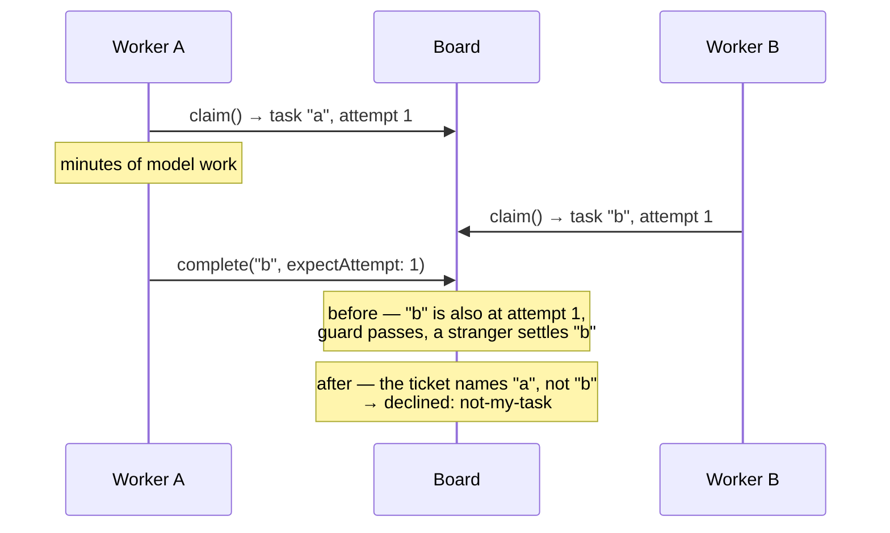

# PR descriptions — writing for two audiences

Every PR we open is read by two kinds of reviewer who want opposite things, and a
description written for one fails the other.

- A **human** has scarce attention and is the only reviewer who can judge *direction*,
  *scope*, and *whether this was worth building*. Their failure mode is skimming past the
  one decision that actually mattered — or bouncing off a wall of process text before
  reaching a single fact about the change.
- An **automated reviewer** (Bugbot, Codex, Copilot, Cursor, and friends) has unlimited
  attention and no sense of altitude. It reads every line at the same depth. Its failure
  mode is twenty line-level findings on a document that isn't code — or on code that is
  deliberately throwaway — with the one real finding buried among them.

Both get served, but **not in the same place**. The human reads top-down and stops early;
a bot reads all of it regardless. So the visible half of the description is written for
the human, and the machine-facing contract sits below the fold, where it costs a human one
skipped line and a bot nothing at all.

This file is canonical for **PR descriptions**. The fold itself, the word budgets, the
density rules, and the `<details>` mechanics live in
[`writing-for-humans.md`](writing-for-humans.md) and are not restated here — read that
first.

## The layout

Every PR that seeks review — spec, epic, implementation, docs-cleanup — is in this order.

The one exception is a PR that seeks **no** review of a direction: a `settle-claim` verdict
PR, whose body is a compact evidence block and whose only job is to put a finding in front
of a human. It leads with the claim and why it earned a PR, and stops there.

| | Block | Answers | Authored |
|---|---|---|---|
| 1 | **The problem** | What's broken, for whom, why now? | Per PR |
| 2 | **What this does** | The mechanism in plain terms, plus a diagram if one earns its place | Per PR |
| 3 | **What's asked of you** | The decisions, the recommendation, what a wrong one costs | Per PR |
| 4 | **Parts worth reviewing closely** | Where, in *this* change, should attention go? | Per PR |
| 5 | **Links line** | Spec doc, Linear, epic — and whether this merges | Per PR |
| — | *collapsed* → **How to review this** | What is this artifact, at what altitude? | Pasted verbatim per PR kind |
| — | *collapsed* → **Everything else** | The full case, verification output, file-by-file changes | Per PR |

Two things about this order are easy to get wrong and worth stating plainly.

**Nothing precedes the problem** — not a ref, not a label, not a sentence about what kind
of artifact this is. A reviewer can't judge any of it before they know what hurt. The
links line is genuinely useful, which is why it's kept, and it goes at position 5 where a
reader reaches for it *after* deciding they want to go deeper.

**Blocks 3 and 4 are the two halves of the ask, and they come after 1–2 for a reason.**
Asking someone to look hard at "Decision 4" before they know what problem Decision 4
serves is asking them to review a number. On a change that follows an approved spec,
block 3 is one line — *nothing is being decided here; this implements the approved
direction* — and that line is worth writing, because its absence reads as an omission.

**Blocks 1–3 are written for a product owner, not a peer engineer.** The human reviewing
this holds the roadmap; what they can judge and a bot can't is direction, scope, and whether
this was worth building. So the problem is stated in observable behaviour and each decision
is priced in consequences — customers, promises, timing, reversibility — rather than in
mechanism. The full contract is [`asking-for-decisions.md`](asking-for-decisions.md); §3
below applies it.

**The contract moved below the fold; it did not go away.** It is the one lever we have on
reviewers we can't instruct, and it measurably raises what comes back. But it says the
same thing on every PR of its kind, which is exactly what a `<details>` is for.

> **The contract is a request, not a control.** We don't own those reviewers and can't
> instruct them. What we can do is state the altitude, which costs nothing. When a bot
> comments off-altitude anyway, that isn't a violation to argue with — it's ordinary
> triage under [`orchestration.md`](orchestration.md) → "Spec review: the bar and the
> convergence rule".

## 1. The problem

**Two to four sentences, in words that don't require the codebase.** What breaks, who
notices, what it costs. Then *why now*, if there's a reason this is being fixed today
rather than whenever — a downstream milestone that's blocked, a failure that's moved from
rare to routine.

Lead with the failure, not with the PR. `This PR introduces a bound claim ticket…` tells a
reviewer nothing they can disagree with. `Two workers can both settle the same task, and
the loser's write lands on the winner's row` does.

## 2. What this does

**Two to four sentences on the mechanism**, in the same plain register. Then the diagram,
if there is one.

Name what it deliberately *doesn't* do in the same breath if a reader would otherwise
assume it. A known gap never collapses (`writing-for-humans.md` → "What never gets
collapsed"), and a reviewer who finds one themselves reports it as an oversight — a round
spent explaining it was on purpose.

### Diagrams — one, if it earns its place

GitHub renders ` ```mermaid ` fences in PR descriptions. Reach for one when the change is
about something prose carries badly:

| Shape | Use it for |
|---|---|
| `sequenceDiagram` | An interleaving or a race — two actors, one row, the order that goes wrong |
| `flowchart LR` | The path a value takes through layers, and where a new guard sits on it |
| `flowchart TD` | A dependency shape — a PR plan's DAG, an epic's issue graph |
| `stateDiagram-v2` | A state machine you're adding a transition to |

**Before/after is the highest-value shape we have**, because most of what we ship changes
a mechanism that already exists, and the delta is the whole review.

Rules, all cheap to check:

- **Under ~10 nodes.** Past that it's a picture of complexity, not an explanation of it.
- **Label edges with what flows**, not with `yes`/`no` where the arrow already says it.
- **Don't diagram a list.** File layouts, package trees, and numbered steps are lists, and
  a diagram of a list is a list that's harder to read.
- **If the prose beside it says the same thing, cut one.** Usually the prose, if the
  diagram is genuinely clearer. Never keep both out of politeness.
- **Two is the ceiling**, and the second one needs a reason.

## 3. What's asked of you

This block has **two registers**, and mixing them is the common failure. Most decisions the
human is *ratifying* — the direction is settled and they're confirming it's the direction
they want. One or two might be *live forks* the author genuinely can't settle alone. Ratified
rows get a line; a live fork gets the full ask.

### The ratified rows — one line each

The decisions and their consequences, with what a wrong one costs. On an implementation PR
that's the Key Decisions & Ramifications list, capped at five; on an epic PR, the
cross-cutting decisions.

**Where the artifact defines a sign-off surface, the cap doesn't apply — show all of it.**
A spec's §6 allows up to eight Decisions and every one of them is what approval certifies
(`spec-template.md` → §6). Indexing five of eight asks a reviewer to approve three they
can't see, which is worse than a slightly longer table. Eight one-liners still fits a
screen; the full text stays in the collapsed case.

Carry the substance alongside the number, never the number alone — a bare "Decision 3"
makes the reader rebuild a map they don't have.

A table works well, because the cost column is the part that gets dropped when it's prose:

```md
| # | Decision | If it's wrong |
|---|---|---|
| 1 | The ticket **replaces** `expectAttempt` rather than joining it | A permanently ambiguous public guard surface, or a migration third parties didn't need |
```

**Write the cost column in consequences, not mechanism.** "A permanently ambiguous public
guard surface, or a migration third parties didn't need" is a cost a product owner can price.
"The two guards would both have to be maintained" is a fact about our code, and it asks them
to work out for themselves why that's bad.

### The live forks — the full ask, under the table

A decision the author can't settle alone isn't a table row. It gets the six-part shape from
[`asking-for-decisions.md`](asking-for-decisions.md): the fork as a heading, plain terms, the
trade-off, **your recommendation**, what would change your mind, and what being wrong costs.
Canonical there; don't re-derive it here.

Two rules keep this from swallowing the block:

- **Zero to two per PR.** Three is a signal the change went too long without checking in.
  A fork the whole PR rests on should have been raised before the PR existed.
- **Never present a fork as neutral when you have a view.** That spends a round extracting
  the view, and it isn't neutrality — it's asking the reader to build a position from less
  information than you have.

A PR where nothing is open says so in one line — *nothing is being decided here; this
implements the approved direction* — and its absence reads as an omission.

## 4. Parts worth reviewing closely

**1–3 items. Never a walk of the diff.** If everything is worth reviewing closely, nothing
is, and the section has spent the reviewer's attention without directing it.

Each item names three things:

1. **Where** — the file, the section, or the numbered Decision. Precise enough to click.
2. **The question to answer** — phrased so a reviewer can answer it, not admire it.
   *"Is a filter at the serialization seam the right layer, or does resume belong in the
   store's iterator?"* — not *"please review the streaming design."*
3. **What a wrong answer costs** — a rewrite, a breaking change to a shipped contract, a
   silent data path. This is what earns the reviewer's attention rather than asking for it.

Then, separately and explicitly:

- **Where the author is genuinely unsure.** This is the highest-value line in the whole
  description and the one most likely to go missing, because writing it feels like
  admitting weakness. It is the opposite: it's the only way a reviewer knows which of your
  confident sentences was a coin flip.

  **Not the same as block 3's *what would change my mind*, though they read alike.** This
  one is about *you* — which of your own claims you'd bet least on — and it aims a
  reviewer at the code. That one is about *them* — the business fact you don't have that
  would flip your recommendation — and it tells a product owner which of their knowledge to
  check. A PR can carry both, and usually should.
- **What is deliberately not here** — a deferred deliverable, a known gap, a decision
  parked for a follow-up.

Three failure modes, all common:

- **The exhaustive list.** Nine bullets covering every changed file. Signal-free.
- **Pointing at the safe parts.** Worse than writing nothing, because it actively spends
  attention on the code you already checked twice.
- **Pre-defending.** *"I know the guard looks misplaced, but…"* — that's a comment for the
  thread. Pointing at a weak spot is the point; arguing it away in advance defeats it.

## 5. Links line

One line, no heading. The spec doc, the Linear issue, the epic, anything this consumes —
and, when the PR is never merged, say so here rather than three paragraphs earlier.

## Below the fold

Collapsed, in this order. Give each `<summary>` a real label — a reader decides whether to
open it from that line alone.

```md
<details>
<summary><b>How to review this</b> — altitude, what's in scope, what's deliberately unsettled</summary>

…the contract for this PR kind, pasted verbatim…

</details>
```

What goes down here:

- **The reviewer contract**, always, and first.
- **The long-form case.** On a spec PR, the rest of Part I — tradeoffs, focus practices,
  worked examples, the Decisions in full. Blocks 1–3 above are §1, §2 and the §6 index, so
  the collapsed block picks up where they stop and nothing is said twice.
- **Verification output.** Test runs, goal-check transcripts, red/green evidence. State
  the verdict above the fold in a clause; the scrollback lives here.
- **File-by-file changes**, when there are enough to be a list rather than a sentence.

## The three altitudes

The contract differs by what the PR *is*. Pick the row, paste the matching block into the
collapsed **How to review this** section.

| PR kind | The one question | The human judges | Automated review helps most on | Do **not** report |
|---|---|---|---|---|
| **Spec PR** (`spec/<ISSUE-ID>`, never merged) | Is this the right approach? | The numbered Decisions, scope, whether it's worth building at all | Constraints that would *invalidate* the design, factual errors about the codebase, internal contradictions, a missed dependency | Names, signatures, file layout, local structure, test names, anything Part II left open on purpose, the solution sketch at the line level, and **POC code at all** |
| **Epic PR** (`epic/<name>`, never merged) | Is this body of work worth doing — and does the set overbuild? | The objective, whether it's really N issues or N−1, the cross-cutting decisions | A theme that contradicts another, an issue in the index that doesn't serve the objective, a missing issue the objective implies | Any single issue's approach, architecture, or test plan — anything touching exactly one issue |
| **Implementation PR** (`fix/<ISSUE-ID>`, merges) | Is this correct, and does it match the approved direction? | The implementation decisions and their ramifications, what was subtracted, whether the goal was actually *proved* | Correctness, second paths (BP-035), auth/routing from caller-controllable input (BP-031), legacy-shape tolerance (BP-030), concurrency and null boundaries | Re-litigating a Decision the spec already settled and a human approved; style the codebase has already settled |

**The implementation row is the asymmetry worth noticing.** On a spec or epic PR we are
asking a reviewer to aim *higher* than its default. On an implementation PR we want its
exhaustiveness — that's exactly the reviewer we'd choose for a second-path sweep. The
guidance there isn't "aim lower," it's **"here is where the risk is concentrated, and here
is what was settled upstream so don't reopen it."** A spec PR and an impl PR asking for the
same review is the mistake this table exists to prevent.

## Where each block is authored

- **Spec PR** — blocks 1–3 are the spec's own §1, §2 and §6 index, condensed by
  `issue-spec` Step 6; contract from [`spec-template.md`](spec-template.md) → "How to
  review this".
- **Epic PR** — authored by the `epic-agent` when it opens or refreshes the epic PR;
  contract from [`epic-spec-template.md`](epic-spec-template.md).
- **Implementation PR** — authored in `issue-implement` Step 9; contract is one of the
  four variants below, picked by what backs the change.

### Implementation-PR contract — four variants, picked by what backs the change

An implementation PR reaches review with one of four things behind it — an approved spec, a
diagnosis, a one-screen brief, or nothing at all — and they need **different** review.
Getting this wrong is a real defect, not a cosmetic one: telling reviewers "the approach is
already approved" on a change where nothing was approved suppresses the only review that
change will ever get. The same is true in the other direction — asserting a brief that
doesn't exist promises work was small and local when it wasn't.

`issue-implement` routes to the first three. The fourth belongs to work no issue constrained
in advance — a pass scoped from the material, or work whose issue was filed after the fact.

**1. Spec-backed** (Feature · Enhancement · Improvement with an approved spec):

> **How to review this.** This implements an **approved spec** — the approach and the numbered
> Decisions in its §6 are already signed off by a human, so please review the **code against
> that direction**, not the direction itself. The spec lives on the issue's **Linear document**
> (the durable copy) and on the **closed spec PR** ([link](#)), which keeps its review history.
> Don't expect `spec/<ISSUE-ID>.md` to be in *this* diff — the spec PR closes unmerged
> and its branch is deleted before implementation starts (BP-037).
>
> **Most valuable here:** correctness on the second path (the legacy shape, the null
> boundary, the concurrent case, the cancel path), anything deriving an auth or routing
> decision from caller-controllable input, and a behaviour the tests assert *around*
> rather than *on*.
>
> **Already settled upstream:** the approach and every §6 Decision (human-approved — if
> one is wrong, say so as a spec finding and it gets folded back; don't re-argue it inline),
> and the conventions in `docs/contributing/best-practices.md`.

**2. A bug on the direct route** (no spec, by design — the hard part was the diagnosis):

> **How to review this.** This is a **bug fix on the direct route**: there is no spec and no
> spec PR, because the hard part was the diagnosis and it happened in code. **This PR is the
> only gate**, so unlike a spec-backed change, the **approach is in scope** — nothing here was
> signed off upstream.
>
> **Most valuable here:** the diagnosis chain — does the repro actually reproduce the reported
> failure, is the named cause the real one, does the fix address that cause rather than the
> symptom, and does the regression test fail without the fix? Then the second path (the legacy
> shape, the null boundary, the concurrent case, the cancel path).
>
> **In scope to challenge:** where the guard was placed, any behaviour change a user could
> notice, and whether this should have been a spec'd feature instead of a fix.

**3. Brief-backed** (a one-screen agent brief is the contract — `agent-brief-template.md`).
**Not a bug**, so the diagnosis chain above does not apply and pasting variant 2 would point
reviewers at a repro that doesn't exist:

> **How to review this.** The contract for this change is a **one-screen agent brief** on the
> issue, not a spec — the work was small and local enough that a full spec would have been a
> document round-trip. So **no approach was signed off upstream, and this PR is the only gate**:
> the design is in scope alongside the code.
>
> **Most valuable here:** whether the change is actually as small and local as the brief
> assumed — a brief-backed change that turns out to touch a contract, add public surface, or
> need a migration was mis-routed and should have been specced. Then the second path (the
> legacy shape, the null boundary, the concurrent case, the cancel path).
>
> **In scope to challenge:** the approach, the scope, and whether this earned its place at all.

**4. No upstream contract at all.** Two shapes reach this variant, and what they share is
that **nothing was written down before the work that constrained it**:

- **A pass whose scope came from the material** rather than from an issue — `polish-docs` at
  epic wrap is the standing case.
- **Work filed retrospectively**, where the issue was written *after* the change to record
  it — the `adhoc-commit-as-new-issue` route for anything that isn't a bug.

**Do not paste variant 3 here.** It asserts a one-screen brief exists and that the work was
expected to be small and local. Neither route wrote a brief, and a corpus-level pass isn't
local. Claiming provenance a change doesn't have is the same defect as claiming an approval
it didn't get.

> **How to review this.** This change has **no upstream contract** — no spec, no brief, no
> issue that defined its scope before the work. So **nothing was signed off anywhere and this
> PR is the only gate**: the approach, the scope, and whether this earned its place at all
> are in scope alongside the code.
>
> **Most valuable here:** whether the scope is the right scope — a change with nothing
> upstream constraining it is the one most likely to have grown past what was needed or
> stopped short of what it implied. Then the second path (the legacy shape, the null
> boundary, the concurrent case, the cancel path).
>
> **In scope to challenge:** everything. Nothing here was settled upstream.

*On an editorial pass, add one line:* the highest-value question is whether anything changed
**meaning** rather than presentation — a caveat dropped, an API detail lost, an example
quietly altered — and whether the new arrangement genuinely navigates better than the old.

Each variant ends there. **"Parts worth reviewing closely" is not part of the contract** —
it's authored per PR and lives above the fold, at position 4, where a human reaches it.

## Worked example

A real spec PR, before and after. The change is the *order* and what's collapsed. Almost
none of the prose is new.

**Before** — the first thing on screen is a block identical on every spec PR, and the
first thing asked of the reviewer is to look closely at three decisions they haven't met:

```md
## For reviewers — what this document is
This is a direction document, not an implementation…
**In scope to challenge:** …            ← ~40 lines, identical on every spec PR
**Out of scope — deliberately unsettled here:** …
**One request, if you are an automated reviewer:** …

## Parts worth reviewing closely
> 1. Decision 7 — the premise that FIX-992 already closed part of this…
> 2. Decision 4 — the deliberate hole at the tool surface…

## Part I — The Case
### 1. Problem — why it matters, why now
Two things running at the same time over one shared, durable to-do list…   ← the point, ~60 lines down
```

**After** — same material, human-first order:

````md
## The problem

Two workers on one shared, durable task board can both believe they own the same task, and
the loser's late "I finished it" lands on the winner's row. The check that should refuse it
asks *"is this task still on the attempt I claimed?"* — a bare integer that collides
constantly across a board, so it can be satisfied by **a different task on the same
attempt**. And the model-facing tools (`completeTask`, `failTask`, `cancelTask`) pass no
ownership token at all, so for them the check never runs.

**Why now.** Conductor M2 runs many issues in parallel on one shared board by construction,
so a rare interleaving becomes the default path. The cost isn't a hang — it's two agents
authoring the same spec, two PRs, and duplicate model spend, found later by a human.

## What this does

Give a claim a **ticket** — `(collectionId, taskId, attempt)`, minted by the board at claim
time — and make every ownership-dependent write present it. A write presenting a ticket for
a different task is refused out loud rather than quietly applied. The ticket rides the seam
the board already uses to tell a worker which task it's on, so nothing new is threaded
through the context and the model never sees it.

It does **not** add a cardinality mechanism: two executions can still each admit tasks past
a configured ceiling, and this spec claims no bound on that.



## What's asked of you

Approve the direction, or push back on any of these. *(Three of §6's seven rows are shown
here to keep the example short — a real spec PR indexes **every** Decision, because §6 is
the sign-off surface.)*

| # | Decision | If it's wrong |
|---|---|---|
| 1 | The ticket **replaces** `expectAttempt` rather than joining it | A permanently ambiguous public guard surface, or a migration third parties didn't need |
| 4 | `taskTools` outside a claimed-worker scope has no ticket, so nothing is checked | We claim a guarantee we don't have — the exact failure FIX-980 exists to eliminate |
| 7 | The first deliverable is a characterization against merged `main`, not a fix | We build a second fence beside one FIX-992 already put there |

### One live fork — replace the old guard, or keep both?

**Plain terms.** Decision 1 retires a guard we already shipped and published an error for.
Anyone who wrote code branching on that specific error would see different behaviour.
Keeping both means two overlapping guards with slightly different meanings, forever.

**My recommendation: replace it.** Two guards that answer almost the same question is how a
public surface stops being explainable, and we're pre-1.0 with essentially nobody depending
on that error. This is the cheapest this change will ever be — deferring doesn't shrink it,
it turns it into a breaking change later.

**What would change my mind:** if a design partner is branching on that error today, or
we've told anyone this surface is stable. Then we keep both and retire the old one at 1.0.

## Parts worth reviewing closely

> **1. Decision 7 — the premise that FIX-992 already closed part of this.** …

**Spec doc:** [`spec/<ISSUE-ID>.md`](#) · **Linear:** [FIX-981](#) · **Epic:** [FIX-939](#) (M1 of 5)
· Docs-only, never merged — closed unmerged when implementation starts.

<details>
<summary><b>How to review this</b> — altitude, what's in scope, what's deliberately unsettled</summary>

…contract, verbatim…

</details>

<details>
<summary><b>The full case</b> — tradeoffs, focus practices, worked examples, Decisions in full</summary>

…Part I §3–§6…

</details>
````

## Why this is worth the lines

Two measured costs, not one.

**Review rounds.** A spec PR reviewed as code draws exhaustive line-level feedback on a
document that is deliberately not a finished design. Every comment still has to be triaged
and answered, and volume alone can consume a two-round budget without producing a single
spec-level finding. The contract is the cheapest intervention we have on that.

**Human attention.** A description whose first screen is boilerplate gets skimmed, and a
skimmed description means the direction review — the only review a human can give and a
bot can't — doesn't happen. Reordering costs nothing and is the difference between a
reviewer who read the problem statement and one who didn't.
