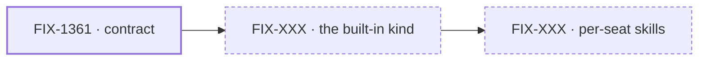

# Spec figures — pictures where position is the content

A spec set ([`spec-template.md`](spec-template.md), [`epic-spec-template.md`](epic-spec-template.md))
carries a handful of figures. They are not decoration and they are not a summary: each one shows
something the prose would carry badly, and each sits next to one sentence saying what to look at.
This file is canonical for **which figures a spec carries, where each lives, how it is drawn, how
it reaches the PR body, and how it is checked.** The templates apply it and don't restate it.

## Two kinds of picture, one rule for choosing

**Mermaid is a graph language.** You give it nodes and edges and it decides the layout. That is
exactly right for a dependency shape, a path a value takes, a before/after of a pipeline, a
decision tree — and it is text, so an agent can read it, diff it, and edit one node in place.
It is the default.

**A hand-authored SVG is for when the layout is the content** — when *where* a thing sits is part
of what you are saying. Containment and a fence. A grid or matrix. Lanes against time. Height as a
quantity. Two states side by side that must align. Mermaid will accept those and quietly arrange
them its own way, and the meaning is gone. That is the bar: reach for SVG when you can name what
the **position** of an element means. If the thing is a graph, mermaid wins on every other axis.

## The figures, by altitude

| Altitude | Figure | Shape | Lives in | In the PR body? |
|---|---|---|---|---|
| Issue | **What changes** — the thing before and after, side by side, same vocabulary | SVG when position carries it (a drawer, a fence, a stack); mermaid pair otherwise | `SPEC.md` | **Yes**, this one always |
| Issue | **How it reaches the seat** — the mechanism as a path through layers | mermaid `flowchart LR`, ≤ 10 nodes | `SPEC.md` | No |
| Issue | **The decision tree** — the issue, its decisions, what each rejected | mermaid `flowchart TD` | `DECISIONS.md` | No |
| Issue | **A decision's picture** — a matrix, a layer boundary, a grid of moments | SVG, one per decision that needs it, usually zero or one | `DECISIONS.md` beside its card | No |
| Issue | **A rule's picture** — a fence with the paths that cross it | SVG, with a mermaid companion listing the same paths by name | `BUSINESS-RULES.md` | No |
| Issue | **The build DAG** — surfaces in build order | mermaid `flowchart TD` | `PLAN.md` | No |
| Epic | **What's in the box** — in the box · composed in by the app · replaced in one line · not built | SVG (containment and a fence) | `SPEC.md` | **Yes** |
| Epic | **How the issues flow into each other** — the dependency graph, with what each hands the next | mermaid `flowchart LR`, amended when scope or dependencies change | `SPEC.md` beside the dated set table | No (linked) |
| Epic | **Who owns what** — rule × issue, each rule with exactly one owner | SVG (a matrix) | `DECISIONS.md` | **Yes** |
| Epic | **The path** — one lane per issue against time, dated bars, a now line, the critical path | SVG (lanes against time), amended when the plan changes, not per status tick | `PLAN.md` | **Yes** |
| Project | **The territory** — owned here · the substrate assembled but owned elsewhere · outside the project, with the fence that separates them | SVG (containment and a fence) | `SPEC.md` | **Yes** |
| Project | **How the epics flow into each other** — the dependency graph, edited in place as epics are filed and wrap | mermaid `flowchart LR` | `SPEC.md` beside the epics table | No (linked) |
| Project | **The arc** — one lane per epic against time, a now line, **redrawn as the project moves** | SVG (lanes against time) | `PLAN.md` | **Yes** |
| Project | **Who owns what** — rule × epic | SVG (a matrix) | `DECISIONS.md` | Only once `BUSINESS-RULES.md` carries **three or more** rules |

**The arc is the path one altitude up**, and it is drawn the same way for the same reason: lanes
against time, redrawn every refresh. A project whose epics have no bars yet gets lane labels and no
rectangles — an epic that has not started is not a zero-width bar, and a dashed placeholder box
reads as duration to everyone who is not its author.

**The plan carries no figures at issue altitude.** It is written for the implementing agent, which
reads tables and a DAG faster than a picture. At epic altitude the plan's one figure is the path,
because sequencing is what an epic plan is about.

**Every figure gets one sentence under it**, in the document, saying what to look at and what it
changes. Not a caption that names the figure — the reader has the figure — but the reading of it:
*"Height is tokens. The first stack is the common case and it's the promise."* A figure with no
sentence under it is ambiguous, and an ambiguous picture is worse than none. The `alt` text (or
the SVG's `aria-label`) says what the picture shows for a reader who can't see it; the sentence
says why it matters. They are different jobs.

**An SVG that could be misread as a graph gets a mermaid companion** listing the same elements by
name. The fence figure is the standing example: three paths approach a line, and the mermaid
beside it is the same three paths as a list, for the reader who wants names rather than positions.

## Mermaid, as GitHub renders it

GitHub renders ` ```mermaid ` fences in a file's blob view and in a PR body. Its parser is
stricter than the live editor, and a parse failure renders as a raw error block — strictly worse
than having drawn nothing. So:

- **Under ~10 nodes.** Past that it's a picture of complexity, not an explanation of it.
- **Label edges with what flows**, not with `yes`/`no` where the arrow already says it.
- **Quote every label containing `(` `)` `,` `;` `:` `/` `[` or `·`.** `A["FIX-1361 · contract"]`,
  never `A[FIX-1361 · contract]`. Quote what needs it and leave the rest bare.
- **`<br/>` only inside a quoted label.**
- **No `%%{init}%%` theme blocks and no click handlers.** Stripped in blob view.
- **`classDef` only for state.** Two are standard, and they are the only colour a graph carries:

  ```
  classDef done stroke-width:2px
  classDef proposed stroke-dasharray:4 3
  ```

  A heavy border is *done*; a dashed border is *not filed yet*. Colour that encodes nothing is
  noise, and it is invisible to a reader in the other GitHub theme.
- **Don't diagram a list.** File layouts, package trees and numbered steps are lists, and a
  diagram of a list is a list that's harder to read.
- **If the sentence under it says the same thing, cut one.** Usually the sentence.

### The placeholder convention — issues that don't exist yet

An epic spec usually causes its issues to be filed, so the dependency graph is drawn before most
of its nodes have an id. A node for an issue that isn't filed yet reads **`FIX-XXX · working
title`**, drawn dashed. When it is filed, the id is swapped in and the border goes solid. When it
is done, the border goes heavy. **The title never changes**, so the graph reads the same before
and after filing, and a reader can follow one node through all three states.



Edges are labelled with **what one issue hands the next** — *the contract*, *a kind to bind into* —
not with *depends on*. An input from another epic is a dashed edge into the set, not a node of it.

## A hand-authored SVG

### It renders — and the constraints that come with it

GitHub's markdown renderer keeps `` in a blob view and `` in a PR
body. Repo SVGs are served as `image/svg+xml` under this CSP:

```
content-security-policy: default-src 'none'; style-src 'unsafe-inline'; sandbox
```

Read it literally, because it decides the whole design:

| The header says | So |
|---|---|
| `style-src 'unsafe-inline'` | **An inline `<style>` block works** — including `@media (prefers-color-scheme: dark)` |
| `default-src 'none'` | **No web fonts, no `<image>`, no external anything.** System font stacks only |
| `sandbox` | No script. Nothing interactive |

**The SVG is self-contained.** Its CSS, its custom properties and its dark theme all live inside the
one file. The house palette and class names are `docs/atlas/`'s — a figure lifted from the atlas
drops in without renaming — but atlas figures carry `class="n-box t-lbl"` and nothing else, because
their CSS lives in the page around them. Lift one and it renders as unstyled black text on nothing.
Copy the classes *and* the properties they resolve to into the file.

### The rules that keep it cheap

- **Hand-written and grouped**, never a design-tool export. Wrap each logical element in
  `<g id="…">`, indent it, keep it **under ~150 lines**. A Figma export is one line of minified
  path data: undiffable, so nobody can review a change to it.
- **`viewBox="0 0 940 <h>"`**, so every figure renders at the same width in a PR body and a blob
  view. Height is whatever the content needs.
- **`role="img"` plus an `aria-label` that says what the picture says.** It doubles as the text a
  reader gets when the image fails to load.
- **Both themes in the one file**, via the media query. Never a `<picture>` with two files — a
  pair that drifts apart is worse than a figure with no dark variant.
- **One theme is what the reader gets.** An SVG's media query follows the reader's *operating
  system* scheme, not GitHub's theme setting. That's usually the same thing and occasionally
  isn't; both renders are checked below, and that is the whole mitigation.
- **The path figure is the one that changes most, so draw it to be redrawn**: one `<g>` per
  lane, bars as `<rect>` with a class per state (`done`, `flight`, `todo`), the now line as one
  `<path>`. Moving the now line and a bar's edge is then a two-number edit.

### Starter — self-contained, both themes, house palette

```svg
<svg viewBox="0 0 940 200" role="img" aria-label="One sentence saying what this shows."
     xmlns="http://www.w3.org/2000/svg">
  <style>
    :root { --surface:#FCFCFA; --surface-2:#E8E8E1; --ink:#191C21; --ink-2:#4C535B; --ink-3:#7A828B;
            --rule:#D5D4CB; --accent:#3E4E8C; --accent-soft:#E0E3F0; --code:#2C7C69; --code-soft:#DCEDE7;
            --prose:#A8761C; --prose-soft:#F3E8D2; --gone:#A9544F; }
    @media (prefers-color-scheme: dark) {
      :root { --surface:#181C1F; --surface-2:#202528; --ink:#E6E8E5; --ink-2:#A4ACB1; --ink-3:#737B81;
              --rule:#2B3135; --accent:#8B9BD8; --accent-soft:#1B2140; --code:#5DBBA1; --code-soft:#14302A;
              --prose:#D9A44B; --prose-soft:#332612; --gone:#DE8A84; } }
    .n-box { fill:var(--surface); stroke:var(--rule); stroke-width:1.2; }
    .t-lbl { fill:var(--ink-3); font-family:ui-monospace,SFMono-Regular,Menlo,monospace;
             font-size:9.5px; letter-spacing:.1em; }
    .t-b   { fill:var(--ink); font-family:system-ui,-apple-system,sans-serif;
             font-weight:600; font-size:13px; }
    .t-s   { fill:var(--ink-2); font-family:ui-monospace,SFMono-Regular,Menlo,monospace; font-size:9.5px; }
  </style>
  <g id="example">
    <rect class="n-box" x="16" y="16" width="240" height="80" rx="5"/>
    <text class="t-lbl" x="32" y="38">LABEL</text>
    <text class="t-b" x="32" y="60">what it is</text>
  </g>
</svg>
```

`--code` is *done / in the box*, `--accent` is *in flight / composed in*, `--prose` is *an input
from outside*, `--gone` is *removed / the now line*. Keep those meanings across a set's figures so
a reader learns the palette once.

### Look at it before you commit it

A figure nobody rendered is how a wrong one ships. Headless Chromium is on every cloud VM and
renders both themes in a second:

```bash
# S is the figure: specs/issues/<ISSUE-ID>/figures/…, specs/epics/<EPIC-ISSUE-ID>/figures/…, or
# spec/_projects/<slug>/figures/… — the rest of the block is altitude-independent.
S=specs/issues/<ISSUE-ID>/figures/<name>.svg
H=$(grep -oE 'viewBox="0 0 940 [0-9]+' "$S" | grep -oE '[0-9]+$')
CH=/opt/pw-browsers/chromium-*/chrome-linux/chrome
printf '<html><body style="margin:0;background:#FCFCFA"></body></html>' "$(realpath "$S")" > /tmp/light.html
sed 's/@media (prefers-color-scheme: dark) {/@media all {/' "$S" > /tmp/dark.svg
printf '<html><body style="margin:0;background:#181C1F"></body></html>' > /tmp/dark.html
for t in light dark; do $CH --headless=new --no-sandbox --disable-gpu --hide-scrollbars --allow-file-access-from-files \
  --window-size=940,$((H+100)) --screenshot=/tmp/$t.png /tmp/$t.html 2>/dev/null; done
```

Then open both PNGs. What you are looking for: text running past its box, an arrow crossing a
label, a lane whose bars don't line up with the axis, and anything that reads only in one theme.
Each figure in the reference sets took two or three passes; budget for that.

**A PNG is a delivery format, not a source.** Render one only for a consumer that can't take an
SVG, at `--force-device-scale-factor=2`, and keep the SVG as the file that gets edited.

## In the PR body

A spec or epic PR body carries the figures the table above marks — one at issue altitude, three at
epic altitude — as raw-content images pinned to a commit:

```html
/<repo>/<commit-sha>/specs/issues/<ISSUE-ID>/figures/<name>.svg"
     width="940" alt="What the picture shows, in a sentence" />
```

Three facts decide that form:

- **Pin to the commit SHA, never the branch.** GitHub's image proxy caches by URL, so a branch
  URL shows the first version it ever fetched. Re-pin changed figures on an open review PR;
  after merge, pin them on the follow-up amendment, not by rewriting the original PR.
  The project-spec's standing refresh lifecycle is unchanged.
- **The blob URL doesn't render; the raw URL does.** `…/blob/<branch>/<path>` is a link to a page.
- **A relative path resolves against the repo root and 404s.** Absolute, always.

**Light and dark.** The SVG's media query follows the reader's OS. A PNG pair with GitHub's
`#gh-light-mode-only` / `#gh-dark-mode-only` suffixes follows GitHub's theme instead, and is the
one reason to render PNGs for a body. Default to the SVG.

**Read the stored body after you write it.** The line above renders when the stored `src` is
the URL you sent. The failure that drops a figure does not delete the tag. It wraps the
`raw.githubusercontent.com` URL in backticks and takes the attribute's closing quote with it:

```html

```

That `src` does not load. It is the body #1905 stored at create, on 2026-09-18. It is not what
an update does to a clean line. #1944 stored three clean `` lines at create and still had
them after every later edit. A remeasure on 2026-09-23 stored the same clean line on a
description create, a description update, and a comment, including the line inside a code
fence (#2082, #2083). GitHub's rendered HTML for that create contained the ``.

There is no create-versus-update rule, and a comment is not a different rule. An earlier
note that tied the backticks to update, or to the comment channel, does not match those
bodies. Write the line, then GET the stored body.

- **No backtick in the `src`, and it starts with `https://`.** It renders. Leave it. A later
  edit keeps it. That is how a refreshed epic body still shows the figure. Do not drop the
  figure because an update is assumed to kill it.
- **A backtick in the `src`.** It will not render, and sending the same write again will not
  clear the backticks. Put a link to the blob view, which renders the figure, where the image
  would have been, and hand a person the clean line — the line you sent, not the line that
  came back. A person pasting the clean line into the description works.
- **A body a person has repaired is not rewritten.** A refresh returns the new pins for them
  to change. Rewriting that body is how a repaired figure gets lost.

GET is the check. The Cloud session's own token cannot create or update a pull request — the
pulls API returns 403 — so a curl PATCH from that token is not a write, and a 403 is not a
stripped body.

## Verify (BP-003)

Run against every document you are about to commit, and report the numbers:

```bash
D=specs/issues/<ISSUE-ID>    # or specs/epics/<EPIC-ISSUE-ID>; projects stay spec/_projects/<slug>

# 1. Fences balanced, per document — every count must be even
for f in "$D"/*.md; do echo "$f $(grep -c '^```' "$f")"; done

# 2. Unquoted risky labels inside mermaid fences — must print nothing
for f in "$D"/*.md; do awk '/^```mermaid/{f=1;next} /^```/{f=0} f{print FILENAME":"FNR": "$0}' "$f"; done \
  | grep -E '(\[[^]"]*[(),;:/·][^]]*\])|(\|[^|"]*[(),;:/·][^|]*\|)'

# 3. List every figure line — this only lists; read each one's next paragraph by eye and confirm it is a sentence, not a heading
grep -nE '^!\[|^<img ' "$D"/*.md

# 4. Every SVG: self-contained, both themes, accessible, reviewable
for s in "$D"/figures/*.svg; do
  echo "$s: ext=$(grep -cE '<(script|image|foreignObject)|href=|url\(|@import' "$s") themes=$(grep -c prefers-color-scheme "$s") aria=$(grep -c aria-label "$s") lines=$(wc -l < "$s")"
done   # want ext=0 themes≥1 aria=1 lines<~150

# 5. Prose words per document, fences excluded — against the budgets in the template
for f in "$D"/*.md; do echo "$f $(awk '/^```/{f=!f; next} !f' "$f" | wc -w)"; done

# 6. The nav line — line 3 names the required set (Evolution when present), the current one bold; must print nothing
for f in "$D"/*.md; do sed -n 3p "$f" | grep -qE 'Spec.*Decisions.*Rules.*Plan' || echo "$f: no nav line"; done
```

Check 2 covers node labels `[…]` and edge labels `|…|`, scoped to fence contents so a markdown
table's pipes don't read as an edge. It does not cover `sequenceDiagram` message text, where `:`
is structural; read those by eye. Then **render every SVG and look at it** — that check is
judgment, and it is the one that matters.
