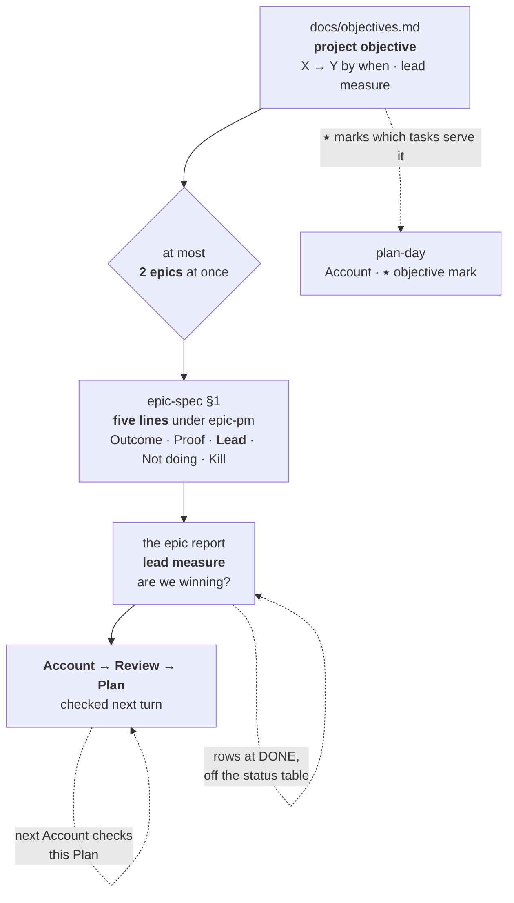

# The 4DX-inspired process — how the pieces fit

**This doc explains; it does not rule.** Every rule below is owned by another file and stated
there once. This is the narrative that makes the pieces legible as one thing — why they exist,
how they connect, and what we deliberately left out. If this doc and an owner disagree, **the
owner is right and this doc is stale.**

Where it came from: [`4dx-process-review.md`](4dx-process-review.md), the review that argued
for these five edits against [4DX](https://www.perdoo.com/resources/online-guides/4dx).

---

## The problem it solves

`epic-pm` disciplines **scope at the gate**. Before this, nothing told you mid-flight whether an
epic was *winning* — the only signal between the objective gate and the wrap was the status
table, and the status table counts activity. An epic could look healthy for weeks and land on a
Proof that failed.

That is one gap. What follows is the smallest set of edits that closes it, plus the finish line
above it that gives an epic something to be tested against.

---

## The one idea worth importing: lead vs lag

A **lag** measure is the result. You learn it too late to change it.
A **lead** measure is *predictive* of the lag and *directly influenceable*. Weight is the lag;
calories and gym hours are the lead.

We already applied this correctly in exactly one place — `distill-lessons` on the development
loop: *"rounds-to-approval trending down **is** the proof the harness is improving."* That is
textbook lead-measure reasoning. It had simply never been applied to the **product outcome**.

Everything below is that one distinction, propagated.

---

## The chain, top to bottom

**Read it as one question asked at four altitudes:** *what are we driving at, and is it
working?* The project objective asks it for the quarter, the epic's five lines ask it for the
set, and the report answers it each turn — and is where the answer gets checked against what
was promised last time.

---

## Who owns what

The point of this table is that **nothing here is owned twice.** Tenet 5: a decision restated in
ten places is corrected in none, and `stale-restatement` is a live recurring class in
[`cycle-ledger.md`](cycle-ledger.md). Go to the owner to change a rule.

| The rule | Owned by |
|---|---|
| The project objective, its finish line and its lead measure | [`docs/objectives.md`](../objectives.md) |
| At most two epics at once; the cap is on objectives, not work items | [`orchestration.md`](../contributing/orchestration.md) → "How many epics run at once" |
| The epic objective's five lines, incl. what a lead measure must be | [`epic-pm`](../../.agents/skills/epic-pm/SKILL.md) → "The objective is five lines" |
| The running index (audit log, no scoreboard) | [`epic-spec-template.md`](../contributing/epic-spec-template.md) → §4 |
| Account → Review → Plan | [`epic-em`](../../.agents/skills/epic-em/SKILL.md) — `epic-pm` inherits it and adds the cut line |
| The daily Account and the ⭑ objective mark | [`plan-day`](../../.agents/skills/plan-day/SKILL.md) |

---

## Three design calls worth knowing

**1. The cap is on objectives, not throughput.** This is the most misreadable piece. Eight
issues running in parallel under one epic is *one* objective with throughput and is untouched;
four epics under four objectives is the violation. A human team caps at one or two goals because
attention splits — ours run in isolated worktrees and cost each other nothing, so `plan-day`
keeps its ceiling of 8 and the cap lives on epics instead.

**2. The measure lives where live state lives — not in a document.** A number a human or an
agent has to remember to refresh is a number that will be wrong, and a stale one is worse than
none because it reads as evidence. An earlier draft put a scoreboard in the epic-spec's §4; it
had no refresh trigger (`foldEpicWanted` fires on epic-PR activity, never on child progress),
and every attempt to source it hit the same wall — the `epic-agent` works on an unrebased epic
branch, can't see `.orchestration/`, and isn't woken by the thing being measured. So the
measure moved to the **epic report**, which the coordinator writes from its own status table,
and §4 went back to being a pure audit log.

**3. The lead measure is rows at `DONE`, not rows merged.** `DONE` already requires the goal
proven — `epic-wake.js` only returns it once the assembled goal passes, and a single-PR issue
proves its goal before the PR opens — so counting it is counting evidence, and it needs no new
field anywhere. Tenet 7 read as a running measure instead of a completion criterion.

---

## What we deliberately did not take

4DX is a complete system, and importing it wholesale is the accretion tenet 3 exists to stop.

- **No WIG session.** There is no team to convene, and event-driven wakes beat a weekly meeting
  for agents. We took D4's *shape* (Account → Review → Plan) and left its ceremony.
- **No cascade to sub-issues.** 4DX cascades WIGs into team WIGs. Our version already exists —
  it is the per-issue goal check. A second vocabulary layered over it would be pure restatement.
- **No vocabulary rename.** We adopted **lead measure**, because we had no word for it. We did
  *not* adopt **WIG**: "objective" is already used across `epic-pm`, `epic-lifecycle`,
  `orchestration.md` and the epic-spec template, and renaming it buys nothing while breaking
  every cross-reference.
- **No new skill, gate, agent or lifecycle surface.** The change is edits to files that already
  existed, plus two internal docs — this narrative and the review it came from. Neither is
  loaded by an agent on any hot path; both are read by humans deciding whether the process is
  working.

---

## The whirlwind assumption, and why it doesn't hold here

4DX is built against the **whirlwind** — the urgent day job that crowds out the strategic goal.
Its disciplines are, at bottom, about protecting attention from urgency.

We have no whirlwind. Agents have no competing urgency and will execute whatever they are
pointed at, indefinitely and in parallel. Our failure mode is the inverse: **plenty of motion,
no discrimination.** That is why D1 and D2 (focus, lead measures — both about *discrimination*)
transferred with force, D3 transferred partially, and D4 mostly didn't transfer at all.

Worth holding onto, because it predicts which *future* borrowings from management frameworks
will be useful here and which will be cargo.

---

## This process has a kill line too

It would be dishonest to add a discipline that demands falsifiable objectives and exempt itself.

**Kill it if, after a handful of epics:** the scoreboard is routinely stale when someone reads
it (the fold cadence is too slow and design call 2's deferred fix didn't happen); or the lead
measure only ever goes up, which means goal checks are being written to the measure rather than
to the goal; or the Account line is never wrong, which means it is being written after the fact
to match what happened.

Any of those means the instrument is decorative, and a decorative instrument is worse than none
because it reads as evidence. **Where to check:** [`cycle-ledger.md`](cycle-ledger.md), the
place we already measure whether an upstream fix landed where the cost actually was.
