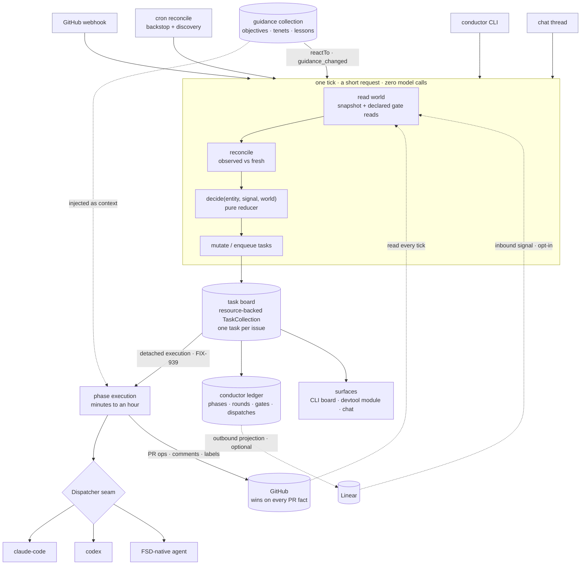
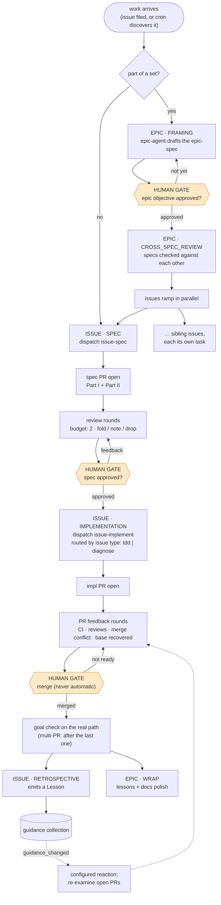
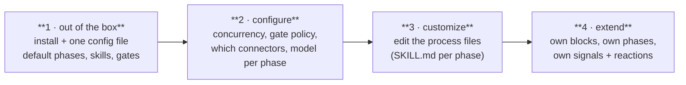

# Design — Conductor: the development orchestration system

**Date:** 2026-07-28
**Status:** DEFINITION — project framing and initial approach. **D1 (state ownership) and
D3 (workforce) are decided** (§10); D2 (the public name) stays open until launch.
**Type:** New package (`@flow-state-dev/conductor`) + surfaces (CLI, devtool module).
Composes `core`, `orchestration`, `claude-code`, `engine`, `scheduled`; deliberately
*not* a framework primitive change.
**Supersedes / absorbs:** FIX-832 (single-issue POC — closed **Done**; the code was
burned but the lesson is §3), FIX-840 (choreography reshape, **Canceled** — its
`state → action` insight is kept and generalized), and FIX-820 (DevTool as orchestration
surface, **Canceled** — its vision is absorbed here, with the board as one of conductor's
surfaces).
**Home:** Linear project *Development Workflow Orchestration*; epic **FIX-966**, milestones
**FIX-967** (M0) → **FIX-971** (M4).
**Companion:** [`conductor/poc.md`](conductor/poc.md) — the config and extension surface as a
file-by-file shape sketch (four adoption levels, what ships vs. what you write).

---

## 1. What this is, in plain terms

Conductor is a system that runs a software development process. You give it an
objective and a set of work items; it drives each one from problem through spec,
review, implementation, PR feedback, and retrospective — dispatching the actual coding
work to a coding agent (Claude Code, Codex, or an FSD-native agent), pausing only where
a human decision is genuinely required, and showing you where everything stands.

It is built *on* FSD, and it ships *with* FSD. Any project that uses the framework can
adopt it, configure it, and rewrite its process files. For us it becomes the system we
use to build FSD itself — which makes it the most credible demonstration of the
framework we have.

**This is the dev-orchestrator growing up.** The earlier attempt (§3) was a POC that
served its purpose. The bar here is different and it should be stated plainly: a product
other people would want to use. That bar settles most of the design arguments below —
notably that no connector may be a prerequisite (§10/D1) and that the process files are a
configurable, documented surface rather than our prompts with our names in them.

The process it encodes is not new. It is the process already written down in
[`docs/contributing/orchestration.md`](../../contributing/orchestration.md) and the
`epic-lifecycle` / `issue-lifecycle` / `issue-spec` / `issue-implement` skills. Conductor
does not invent it. Conductor **executes it in code instead of interpreting it in a
prompt.**

## 2. Why the harness has to change

The skills work. The harness running them does not scale.

Today a coordinator agent reads a 278-line state machine written in English and
re-derives, on every wake, what phase each issue is in and what to do next. Everything
else follows from that:

- **The coordinator's context fills up and it loses the thread.** It holds N issues'
  worth of status, gets compacted, and starts forgetting handles.
- **There is no place to look.** Understanding where five issues stand means scrolling
  agent output. The status table is in a transcript, not a view.
- **One conversation, many subjects.** Asking about issue A while the coordinator is
  mid-flight on issue B confuses both.
- **It falls off its tracks.** Phase transitions are prompt-interpreted, so they are
  probabilistic. A deterministic transition should never be probabilistic.
- **One vendor.** The whole thing is Claude Code shaped.

Each of these is a property of the *harness*, not of the process. That is the whole
argument for building this.

### Why not just use Claude Code or Codex

Not "because they're bad at coding" — they are the hands, and conductor calls them.
The claim is narrower and it holds:

| | Agent harness today | Conductor |
|---|---|---|
| Phase transitions | prompt-interpreted, probabilistic | code, deterministic and unit-tested |
| Coordinator state | a transcript that compacts | a reconciled copy of the world + an append-only workflow ledger |
| Visibility | scroll the output | a queryable board, rendered |
| Concurrency | one context holding N issues | one durable task per issue, one operator view |
| Vendor | one | a dispatcher seam; Claude, Codex, or FSD-native |
| Process customization | edit a prompt and hope | edit files against a typed contract |

## 3. Prior art in this repo — read this before starting

**This is the third run at this.** The earlier two are why the design below looks the way
it does, and one of them contains a hard-won lesson we must not pay for again. Both of the
prior tickets are now closed, so this doc is where their conclusions live.

- **FIX-820** (**Canceled**) — *DevTool as a development orchestration surface.* The
  vision: a codebase-aware cockpit that runs the dev loop. Still the right destination,
  and now pursued here rather than there: conductor is the engine, and the devtool board
  is one of its surfaces (M3).
- **FIX-832** (**Done**, POC burned) — *drive a single Linear issue through its
  lifecycle.* A durable FSD flow plus a long-lived CLI babysitter. It worked, then
  broke: it carried **two state machines** — the Linear board and the flow's own
  suspend/checkpoint progression — encoding the same progression **with no rule for who
  wins and no path to reconcile.** They drifted. A cold restart between gate 1 and gate 2
  looped forever. No code landed in the repo. Note the lesson precisely: the defect was
  the missing authority rule, not the existence of a second copy (§10/D1).
- **FIX-840** (**Canceled**) — *the reshape that diagnosed it.* Conclusion: delete the
  second ledger, make the board the single state machine, express the orchestrator as
  a pure `state → action` map firing discrete idempotent actions, triggered from
  webhook / cron / CLI. That diagnosis is correct and §5 keeps it.

FIX-840's stated rule was "Linear is the single state machine, conductor stores
nothing." That rule is too strong for a product — it makes Linear a hard dependency
and leaves nowhere to put facts Linear cannot hold. §10/D1 sharpens it.

**Related, already done:** `@flow-state-dev/claude-code` CLI dispatch (FIX-672) and
in-process Agent SDK (FIX-671); webhook receivers (FIX-439); same-request
suspend/resume and crash recovery (FIX-811); the `fsdev chat` operator loop (FIX-875).

## 4. The entity model

Two distinctions do most of the simplifying work.

**Separate phase, gate, and signal.** These are three different kinds of thing, and
mixing them is what makes a lifecycle list hard to reason about. `Drafted`/`Reviewed`/
`Approved` are states of a review; `Merge Conflict` is a condition the world reports.
Splitting them is what lets the driver be a pure function:

- **Phase** — where the work is (`SPEC`, `IMPLEMENTATION`, …).
- **Gate** — what it is waiting on (`awaiting_spec_approval`, `awaiting_merge`).
- **Signal** — what the world reported (`review_submitted`, `ci_concluded`,
  `merge_conflict`, `base_recovered`, `merged`, `approved`), **or what reconciliation
  inferred was missed.** A signal is not necessarily live: comparing conductor's observed
  copy against fresh world state yields **synthesized** signals for events that never
  arrived — a `pr_opened` conductor never saw, backdated so the driver processes it
  before the comment that revealed the gap (§10/D1). Signals are not only external:
  `guidance_changed` fires when an objective, tenet, or lesson is added or edited.

**One review cycle, parameterized.** `drafted → in_review → revised → in_review →
approved` is the *same* cycle for a spec, an implementation, an epic-spec, and a
retrospective. `orchestration.md` already states its bar, its three dispositions, and its
two-round budget once, for all of them. So model it once. A "PR" is not an entity — it is
where an **Artifact** happens to be hosted.

```
Epic ──< Issue ──< Artifact ──< Review (round n)
            │          └──< hostedAt: PR | Linear doc | file
            └──< Dispatch (one agent run: vendor, skill, cost, outcome)

Guidance (collection)  ·  label + body, kind: objective | tenet | lesson
   └─ injected as context into decisions; reacted to on change
```

| Entity | What it is | Why it exists |
|---|---|---|
| **Project** | the repo conductor drives | scope root: config, connectors, process files |
| **Epic** | a set of related issues + their shared direction | cross-cutting decisions need somewhere to live |
| **Issue** | one unit of work; `type` is a routing key | the thing that moves through phases |
| **Artifact** | a reviewable output of a phase | unifies spec review and code review |
| **Review** | one round against an artifact | carries the round count the budget needs |
| **Dispatch** | one agent run | observability and cost; "what actually ran" |
| **Guidance** | a *collection* of `label + body` documents — objectives, tenets, lessons | they are reference material, not graph nodes (below) |

### Guidance is documents, not entities

Objectives, tenets, and lessons are all the same shape (a label and a body) and serve the
same *function*: they get injected into a decision as context. That is exactly how the
current Claude Code system already uses `philosophy.md` — a reference document consulted
when making a design call, not a record something joins to. An `Objective` entity would
buy graph traversal that nothing in v1 needs, so it doesn't earn its place (tenet 3).

So: **one collection** whose instances carry `{ kind, label, body }`, with `kind` a
discriminator (`objective | tenet | lesson`) in the same way issue `type` is a routing
key. It is **filesystem-backed** — real markdown files under `.conductor/guidance/`,
because the vendor harness has to read them too (§6). Objectives ground priority by being
*read* during prioritization, not by being joined to issues.

**The promotion trigger, named so the call stays revisitable:** if we need real graph
queries — every issue serving objective X, or which objectives have no work against them —
that is when a first-class entity and a link earn their place. Not before, and not
speculatively.

**Guidance changes are signals.** Because guidance lives in a collection, `reactTo` fires
on a change to it (FIX-751 for state, **FIX-843 for content writes** — both **Done**, so
this is buildable today, not a framework gap). That makes the interesting behavior
configurable rather than bespoke: *a new objective lands → re-examine every open PR and ask
whether it changes the approach.* A guidance change is just another signal class the driver
reduces over, which is the payoff for separating signal from phase and gate.

### Two routing details

**Issue `type` is a routing key, not a state machine.** `Feature | Improvement | Bug |
Spike | Prototype | Refactor` selects the discipline (`tdd` vs `diagnose`) and the
review lenses. `issue-implement` already routes this way. Six types, one state machine.

**Phases differ by entity.** Issue: `DISCOVERY? → SPEC → IMPLEMENTATION →
RETROSPECTIVE`. Epic: `FRAMING → CROSS_SPEC_REVIEW → (issues run) → WRAP`. Stating this
explicitly avoids forcing one phase list onto both. `DISCOVERY` carries a question mark —
see §12.

## 5. The deterministic spine

One function, no model in the loop:

```ts
decide(entity, signal, world) → Action[]
```

**It is a reducer, not a planner.** Given an entity, the one thing that just happened, and
the world, it returns the actions that follow — the `(state, event) → effects` shape, not
"work out an approach" and not "choose which tasks to do next." It is deliberately **not**
called `plan`: in FSD, *plan* already means agentic planning (plan-and-execute, True Plan
Mode, plan mode), and this function never involves a model.

The signal is an explicit parameter rather than something dug out of `world`, because
conductor is an event loop: **one signal in, actions out.** That also makes the reconciler
(§10/D1) compose cleanly — it produces signals, and each is fed through `decide` in order:

```
observed + fresh ──reconcile()──▶ Signal[] ──decide() per signal──▶ Action[] ──▶ execute
```

Pure, synchronous, exhaustively unit-testable over the phase × gate × signal matrix. This
is FIX-840's `state → action` map generalized past a single issue. Actions (`draftSpec`,
`reviseSpec`, `recordApproval`, `implement`, `addressFeedback`, `resolveConflict`,
`runGoalCheck`, `retrospect`) are discrete and idempotent — a duplicate or out-of-order
signal is harmless. **Only actions dispatch agents.** The decision of *what to do next*
never involves a generator.

That single property is what kills four of the five pains in §2.

### The loop: a tick, not a daemon

"Where does the loop live" has a deliberately boring answer, and the boringness is the
feature: **there is no resident loop.** There is an idempotent **tick** — a short request
that reconciles, decides, and mutates tasks, then returns.

```
trigger (webhook | cron | CLI | chat)
  └─▶ tick  = one request:  read world → reconcile → decide per signal → mutate/enqueue tasks → return
        └─▶ phase work = a separate, detached task execution (its own cycle, minutes to an hour)
```

- **A tick is a request.** Short, no model calls, no long-held anything. It is safe to fire
  redundantly — three triggers can all fire it and the result is the same, because actions
  are idempotent and state is re-derived. That is what makes restart free: nothing is
  resident, so nothing is lost.
- **Phase work is not in the tick.** Authoring a spec or implementing a PR runs as its own
  detached task execution (FIX-939). The tick starts it and returns; it does not wait.
  Conflating the two is what would force a long-lived process back into the design.
- **Triggers are interchangeable.** Webhook (an event arrived), cron (the backstop and
  new-work discovery), CLI, or chat all call the same tick. None is privileged, and losing
  any one costs latency, not correctness — the cron backstop plus reconciliation recovers
  whatever the webhooks missed.

**Altitude: one state machine, many instances.** There is not a loop per entity — there is
one state machine *definition* and N entity instances that a tick advances. Concurrency
comes from the board: a resource-backed `TaskCollection` per epic, one task per issue, the
drain advancing them in parallel. The epic itself is a task too, with its issues as
**nested** sub-tasks, so dependency gating expresses "issues hold until the epic objective
gate passes" natively rather than as a special case.

**Not settled — validate in M2:** whether the epic-task-with-nested-issue-subtasks shape
holds up, or whether epics want a separate board from the project-level one. Both work on
paper; the nesting is more elegant and less proven.

### Gates are predicates over a snapshot, never I/O

A gate asks a question about the world — *has this spec been approved?* — and the world
lives in GitHub. That is in tension with `decide` being pure, and it decides whether M0's
testability claim is real or aspirational. The resolution falls out of the tick: **`world`
is a snapshot, materialized before `decide` runs.** Everything `decide` and every gate
predicate needs is plain data by the time either executes, so a gate is an ordinary pure
predicate and the phase × gate × signal matrix is testable by handing it a literal.

The risk is not the built-in gates, which conductor controls. It is the **extension
surface**: a user-defined phase (`poc.md` §4b) supplies its own `gate.satisfiedBy`, and if
that predicate may call GitHub, purity breaks silently — an I/O call inside a "pure" reducer
makes ticks slow and non-deterministic rather than erroring. So a phase **declares what it
reads**, and the tick fetches it:

```ts
gate: {
  name: "awaiting_security_signoff",
  reads: ["artifact.reviews", "pr.checkRuns"],   // fetched during read-world
  satisfiedBy: ({ artifact, pr }) => …,          // pure over what it declared
}
```

That is the framework's own `uses` / capability shape — declare the dependency, get it
injected — not a new mechanism, which is the test §9 applies to everything here. Two
consequences: the tick may **over-fetch** (it reads for gates that turn out not to apply,
pruned only by `appliesWhen`), and a phase cannot gate on a fact it didn't declare. Both are
fine — a tick is a bounded handful of GitHub reads, and bounded over-fetch beats an unbounded
I/O surface inside the one function the design claims is pure.

This is a **precondition for M0**, not a later refinement: M0's acceptance criteria are
written against a pure `decide`, so `reads` exists from the first commit.

## 6. Conductor over the vendor harness

Conductor is an orchestration layer **on top of another orchestration layer.** It delegates
the work inside a phase to a vendor harness (Claude Code, Codex), and that harness has its
own skills, sub-agents, and tool loop. We do not reinvent any of that — declining to is most
of why this is weeks rather than months.

That layering fixes an ownership boundary, and a lot falls out of it:

| | Conductor owns | The vendor harness owns |
|---|---|---|
| **Question** | *which* phase, *which* gate, what happens next | *how* the work inside a phase gets done |
| **Mechanism** | `decide` / `reconcile`, the board, gates, the ledger | its own skills, sub-agents, tool loop, context management |
| **State** | the workflow ledger | its own transcript, which we neither read nor keep |

### The filesystem is the interop surface

Anything *both* layers need has to be readable by both, and the vendor harness reads the
repo — not an FSD store. So **guidance is filesystem-first**: `.conductor/guidance/**/*.md`
are real files, picked up the same way Claude Code already picks up `philosophy.md` today.
Storing them only in an FSD resource would make them invisible to the layer that needs them
most.

That splits metadata by audience:

- **Front-matter** (`kind`, `label`) — shared. Both layers read it, and it travels with the
  body.
- **A separate FSD-only resource, keyed by file path** — conductor's bookkeeping (when we
  last acted on an objective, which lessons have been promoted). Deliberately *not* in the
  file: the vendor harness shouldn't have to care about our accounting, and shouldn't be
  able to clobber it by rewriting a document.

**External changes are a reconciliation problem, not a new mechanism.** A guidance file can
change without conductor doing it — a human edits it, or the vendor harness writes it
mid-phase. `reactTo` fires on FSD-mediated mutations, so those edits are invisible to it.
But this is the missed-webhook case from §10/D1 wearing different clothes: the observed copy
diverges from the world, and reconciliation is what notices. Each tick hashes the guidance
files against what conductor last observed and emits a synthesized `guidance_changed` for
anything that moved. **Correctness needs no framework work** — the reconciler already has to
exist.

What framework work *would* buy is **latency**, and the shape is already half-built:
`defineExternalResourceCollection` (FIX-858, **Done**) models exactly this — a read-only
collection resolved from an app-owned store, sharing `reactTo`. Two pieces are missing for
the filesystem case: `ExternalReactiveBindings` has no `contentUpdated` axis (only
`created` / `stateUpdated` / `deleted`, while a markdown body is content), and the
change-signal helper that would let an app *report* a change was never built. Filed as
**FIX-979**. Conductor is its pressure test, not its dependent: conductor ships on
reconciliation and gets tick-latency reactions; FIX-979 buys immediate ones.

### Getting guidance into the vendor harness

Being a file in the repo is necessary but not sufficient. Claude Code reads `CLAUDE.md` and
`.claude/skills`; Codex reads `AGENTS.md`. Nothing tells either that
`.conductor/guidance/objectives/*.md` exists. Two mechanisms, used together:

- **Push, per dispatch (primary).** The phase brief conductor hands the dispatcher carries
  the relevant guidance as explicit file references, scoped to the phase. Precise (a
  retrospective doesn't need every objective), vendor-agnostic (it rides the `Dispatcher`
  contract, not a Claude-specific file), and the only path that can be *scoped* at all.
- **Ambient pointer, per repo (safety net).** A **generated, marked block** in the
  vendor-native entrypoint (`CLAUDE.md`, `AGENTS.md`) saying where guidance lives and when
  to read it, refreshed on `guidance_changed`. This covers a human driving the harness
  directly, outside conductor.

**A pointer, never a copy.** The ambient block references the guidance files; it does not
inline their text. Copying guidance into `CLAUDE.md` would put one fact in two places with
no authority rule — §10/D1's mistake at file altitude, with a stale copy as the failure
mode. The block is delimited so conductor can rewrite it without touching hand-written
sections.

### Who owns the git worktree

A phase that writes a spec or an implementation needs a branch, and parallel phases need
isolation or they collide.

- **Conductor owns branch policy.** Naming (`spec/<ISSUE>`, `fix/<ISSUE>`) and basing —
  always `git checkout -B <branch> origin/main` off freshly-fetched `origin/main`, **never**
  `git checkout main`, because the shared `main` ref can be checked out in one worktree at a
  time and parallel workers race on it. Re-entry to an existing branch fetches and checks out
  that branch instead of `-B`-ing it, or it discards commits. These rules are already written
  down in [`orchestration.md`](../../contributing/orchestration.md) → "Worktree branching"
  and were learned the hard way; they are **process** rules, so conductor owns them.
- **The dispatcher owns workspace isolation, and declares its model.** This has to be per
  dispatcher because the answer genuinely differs: a local `claude` CLI runs in a `cwd`, so
  conductor creates `.conductor/worktrees/<issue>` and points it there; a cloud dispatch runs
  in the vendor's own environment, so conductor supplies a branch name and manages no local
  tree at all. A dispatcher declares `isolation: "worktree" | "cwd" | "remote"`, and
  conductor provisions only what that model needs.

**This does not become an FSD concern.** Worktrees are development-orchestration knowledge,
not infrastructure every FSD app needs (tenet 4). It lives in conductor's dispatcher layer,
and if a second consumer ever wants it, that is the moment to reconsider.

## 7. Transports: conversation and state

Two inbound transports with a clean division of labour, both on the existing
`InboundTransportAdapter` contract.

The Chat SDK has an [official GitHub adapter](https://chat-sdk.dev/adapters/official/github)
that models issues and PRs as **threads** and comments as **messages**, with three thread
types: PR-level (Conversation), review comments (Files Changed), and issue threads.

| | GitHub adapter | Covered by |
|---|---|---|
| **Issue comments, PR review comments (inbound)** | ✅ native — thread + message model | Chat SDK |
| **Replying in a thread** | ✅ `thread.post()` | Chat SDK |
| **PR opened / closed / merged** | ❌ not an adapter event | webhook transport |
| **CI / check-run conclusions** | ❌ | webhook transport |
| **Review *submissions* (an approval)** | ❌ — a review is not a comment | webhook transport |
| **Merge conflict / base recovered** | ❌ | webhook transport |
| **Opening a PR, merging, labels, submitting a review** | ❌ not adapter features | handler blocks over Octokit |

So the split is **conversation vs. state**:

- **Human conversation on a PR or issue rides the Chat SDK's GitHub adapter.** A human
  commenting on a PR and a human asking in Slack are the same primitive, served by one
  binding — no classification heuristic in `decide`, no second code path. It also unifies the
  operator surface: a Slack thread per issue and a GitHub PR thread per issue become the same
  thing.
- **The webhook transport is required, and for a sharper reason than "some events are
  missing":** the adapter carries *conversation*, not *state*. Everything the approval gate
  actually turns on — a `pull_request_review` submission, a merged PR, a CI conclusion — is a
  state event the adapter does not emit. A conductor built on the adapter alone would be deaf
  to its own gates.

**Outbound splits the same way.** Opening, merging, labelling, and submitting reviews are not
adapter features, so they are handler blocks over Octokit — not a transport concern at all.
Replying in a thread the SDK owns is different: the SDK holds the thread context and the
reply routing, so it should use `thread.post()`. The rule:

> **Reply in a thread the SDK owns → `thread.post()`. Write to something the SDK doesn't
> model → a handler block over Octokit.**

**Two things to verify before M3 commits to this** (unproven, not assumed):

1. **Vocabulary fit.** FSD's `chat.on` keys are `mention` / `directMessage` / `reaction` /
   `slashCommand`, deliberately uniform across platforms. Whether a GitHub thread comment
   arrives as `mention` — and whether "addressed to conductor" is distinguishable from any
   comment — needs confirming against the adapter, not inferring from the vocabulary.
2. **Session identity collision.** `sessionId` defaults to the canonical `thread.id`, so a
   GitHub PR thread would mint its own session — while conductor keys a session per *issue*.
   An issue with a spec PR and an impl PR has three candidate thread ids. The `sessionId`
   override exists for exactly this, but the mapping has to be decided deliberately rather
   than defaulted.

**The Linear analogue:** Linear is not a chat platform, so its native path is the Linear
Agent connector (FIX-567, *Backlog / Low*), which conductor doesn't need — outbound
projection plus optional inbound status signals covers what it uses Linear for.

## 8. How it fits together

Three views. The first is the machine, the second is the process it runs, the third is how a
project adopts it. A worked file-by-file sketch of the config and extension surface lives in
[`conductor/poc.md`](conductor/poc.md).

### The machine



Two things to read off it. **The tick is the only decision-maker, and it holds no model** —
every generator call happens inside a phase execution, downstream of a decision already made.
And **GitHub is read every tick and written by phases**, never mirrored-then-trusted; the
ledger holds only what GitHub has no place for.

### The default development process, end to end

This is what ships out of the box. Every box is a phase or a gate that already exists in
`orchestration.md` — conductor is running the process we already wrote down.



**Three human gates, and only three:** the epic objective, each spec, and every merge.
Everything between them moves without asking. Conductor never merges.

### How a project adopts it



Each layer is additive and none is a fork: level 4 still runs the level-1 defaults for
everything it doesn't override. [`conductor/poc.md`](conductor/poc.md) walks all four with
real file shapes.

**Level 1 is `defineConductor()` with no arguments.** The repo, the GitHub credentials, the
default branch, and which vendor harness to dispatch to are all *discovered* — conductor is
running inside a git checkout with a remote and an installed CLI, so asking for any of it
would be redundant. The rule that keeps the config surface honest: **a field earns its place
only if it encodes an intent the environment cannot reveal** (how many issues at once, which
vendor reviews, what the budget is). A required field that could have been read from the
environment is not just a redundant knob — it is a second place for one fact to live, which
is §10/D1's mistake at config altitude.

## 9. What already exists — and what conductor deliberately doesn't reuse

| Conductor needs | Already shipped |
|---|---|
| The durable work record per issue, dependency-gated, leased, CAS-claimed, retried | `taskBoard` + resource-backed `TaskCollection` (`@flow-state-dev/orchestration`) — durable across turns today |
| A cross-turn human gate on a work unit | task status `awaiting_review` + `blockTask` on a resource-backed board |
| Per-task observability | `TaskHandle.items()` + `task-change` events |
| React to a guidance document being added or edited **from inside conductor** | `reactTo` on a resource collection — state (FIX-751) **and content writes** (FIX-843), both Done |
| Notice a guidance file edited **outside** conductor (a human's editor, the vendor harness) | the reconciler — same mechanism as a missed webhook (§6). `defineExternalResourceCollection` (FIX-858) would cut latency, but needs the `contentUpdated` axis and change-signal producer FIX-979 tracks |
| Off-request execution machinery to build the FIX-939 executor on | `enqueueAction({…, sessionId })` + `jobId` dedup; `@flow-state-dev/bullmq` for durable / separated workers |
| Short-lived human input gate | `ctx.suspend()` + suspension records (FIX-811) |
| GitHub events waking the right session | webhook transport, `flow.webhooks` + `sessionId(event)` (FIX-439) |
| Chat as an inbound trigger and operator surface | `@flow-state-dev/chat-sdk`, incl. the official GitHub adapter (§7) |
| Reconcile backstop + new-work discovery | `@flow-state-dev/scheduled` |
| The hands | `@flow-state-dev/claude-code` (`/cli` and `/sdk`) |
| Entity store, project-scoped, local → cloud unchanged | resource collections + `store-sqlite` / `store-postgres` |
| User-editable process files | the skills runtime (`SKILL.md` folders, `agents:` delegation) |
| Live view of activity | SSE item stream + `@flow-state-dev/react` renderers + devtool |
| Operator CLI loop | `fsdev chat` (FIX-875) |
| Proving the real path | the `goals/` harness |
| Vendor #2 | Codex integration, specced (FIX-797) |

**Genuinely new:** the entity/phase model and driver (§4–5), the board view, and the
process-file template. Everything else is composition — which is the point (tenet 2), and
is why a first payoff is weeks not months.

### The restraint question, answered rather than deferred

The framework already ships three things that coordinate work — the **task board**,
**delegation skills**, and **`goalSeekLoop`** — so the honest question before conductor adds
a driver is *what's left?* The answer splits cleanly, and it is not the answer the surface
resemblance suggests:

**The board is reused wholesale.** Everything in the table above is real: `awaiting_review`
is in the task status enum, leases and CAS claim and `reclaim()` exist on both collection
backings, and `TaskHandle.items()` exposes a running task's emissions. Conductor builds its
board by hand and gets all of it. It adds nothing here.

**The loop is not reused, and that is a deliberate line, not an oversight.** `tick → decide →
dispatch` looks like `drain → judge → replan`, and they are structurally different in the one
way that matters:

| | `goalSeekLoop` | Conductor's tick |
|---|---|---|
| What terminates it | a **mandatory `judge`** returning a `Verdict` — a model call in practice | nothing; there is no loop to terminate |
| Bounding | a **mandatory `maxIterations`** hard backstop | none needed; a tick is one request |
| Lifetime | inside a single request (`board.drain` is `.forEach`-based) | across days, entirely event-driven |
| Model in the control path | yes, by construction | **never** — that is the whole thesis |

`goalSeekLoop` requires a judge and an iteration cap because it is a *goal-seeking* loop:
it doesn't know when it's done, so it asks. Conductor always knows what phase an issue is in
and what its gate is waiting on, so asking would be a regression. Delegation skills are the
same shape one level up — host-as-executive, a model handing out work. **Every existing loop
primitive puts a model in the termination decision, and removing the model from that decision
is the entire reason conductor exists.**

Worth stating because FIX-922 (*what does task-board + delegation + `goalSeekLoop` subsume?*)
has been cited as a question that might shrink M0. It won't, and that citation misreads it:
FIX-922 is a **patterns-catalog** pruning investigation — whether `parallelTasks`,
`planAndExecute`, `routedSpecialists`, and `supervisor` still earn their place in
`@flow-state-dev/patterns`. Conductor consumes none of them, and every pattern in its scope
is model-driven where conductor's driver is model-free. Whatever it cuts, M0 is unaffected.

Two more things that look like new layers and are not:

- **There is no "connector layer" to build.** Inbound is the existing
  `InboundTransportAdapter` contract, already implemented twice (webhook transport, Chat
  SDK). Outbound is handler blocks that call GitHub's and Linear's APIs. Neither half
  needs a new abstraction on top, and inventing one would be exactly the bloat tenet 3
  guards against. "Connector" in this doc names a *set of blocks plus a transport*, not a
  layer.
- **The entity model is blocks and resources, not an ORM.** Entities are resources
  (collections keyed by id); phases are blocks; the ledger is resource state. No
  data-access layer, no mapping layer, no repository pattern. If a sub-issue starts
  building one, that's the signal to stop.

## 10. The three framing decisions (two called, one open)

### D1 — Who owns state? **(DECIDED: authority per fact class; conductor keeps copies)**

**"Source of truth" means who wins when there is disagreement.** It does *not* mean who is
allowed to hold data. Conductor is a **highly evented system** — it reacts to things
happening in the world — and an evented system needs its own last-known copy to diff an
incoming event against. So conductor keeps copies where they help, and the question is only
ever *who wins on a conflict.*

| Fact class | Who wins | Conductor's copy |
|---|---|---|
| **PR facts** — open / closed / merged, feedback, review states, CI conclusion, head SHA, mergeability | **GitHub**, always | kept, as an observed projection with provenance (what we saw, when, from where) |
| **Workflow progress** — which phases completed, review-round counts, gate records, dispatch history and cost, lessons | **Conductor** | it *is* the record; nothing else has anywhere to put `spec_review_rounds: 2` |
| **Linear issue status** | Linear, for its own field | kept if the connector is configured |

**The local copy is an asset, not a liability.** A copy that can disagree with the world is
exactly what makes **missed events recoverable**:

> A PR comment arrives for a PR conductor never saw opened — because the `PR opened`
> notification was dropped, or arrived while the process was down. Conductor's copy is out
> of sync, and *that is how it knows*: it can backdate and fire the missed `PR opened`
> transition, then process the comment in the right order.

Without a local copy there is nothing to diff against, so a dropped event is simply lost.
With one, **a divergence is a signal** — including a signal about a signal that never
arrived. Reconciliation is therefore a first-class path, not an error handler: each tick
compares observed against fresh, and any gap becomes one or more **synthesized signals**
the driver reduces over in order.

**A copy with a designated winner and a reconcile path is a cache. A copy without one is a
second authority.** That is precisely what FIX-832 built (§3), and the whole of the lesson.

**Two consequences that are part of the decision:**

1. **Copies are kept and reconciled, never trusted over their owner.** Every observed fact
   carries provenance so a conflict is resolvable rather than ambiguous.
2. **GitHub is essential to the workflow; Linear is configuration.** GitHub is where the
   artifacts live and where the gates are read, so it is a substrate dependency. Linear is
   not, and the config decides: whether it is connected at all, whether progress is mirrored
   outbound, and whether inbound status changes are reacted to as signals. Conductor runs
   fully with no Linear connected.

### D2 — The name **(OPEN — internal name is `conductor`; public name deferred)**

`conductor` fits the metaphor and the pitch ("the harness that conducts your work").
Two cautions: **Netflix Conductor** is a well-known workflow-orchestration engine, which
is a direct collision in this exact category; and `dev-engine` collides with our own
`@flow-state-dev/engine`, which is worse — it would be incoherent inside the repo.
**Recommendation: use `conductor` internally now and treat the public name as an open
question for launch.** The internal name is cheap to change; the package name is less so.

### D3 — Relationship to `workforce` **(DECIDED: bypass, keep the `Dispatcher` seam)**

Conductor's workers are mostly *external* coding agents, not FSD generators with
personas. The right seam is a vendor-neutral `Dispatcher` (given a phase brief plus a
skill, run it, return a typed result), with `claude-code` as the first implementation
and `codex` as the second. `workforce` becomes relevant when we add **FSD-native review
agents** that don't need a full coding harness. **Decided: bypass `workforce` for v1 and
keep the `Dispatcher` seam clean so it drops in later.** Workforce Layer 2 is still in
flight; taking a dependency on it now couples two moving things.

## 11. Initial approach — four milestones, payoff at M1

Sequenced so the first milestone is the one that changes the daily experience.

### M0 — the model, as a pure module (days)

`decide(entity, signal, world) → Action[]`, the entity schemas, the phase/gate/signal types,
the **`reads` declaration** that keeps gates pure (§5), **and the reconciler** — a pure
`reconcile(observed, fresh) → Signal[]` that turns a divergence between conductor's copy and
the world into ordered signals, including backdated ones for events that never arrived
(§10/D1). No I/O, no agents, no connectors.

**Verify:** unit tests covering the full phase × gate × signal matrix, including the paths
§2 says the current harness drops (restart mid-gate, duplicate signal, out-of-order signal,
backwards phase move) **and the reconciliation paths D1 exists for**: a comment observed on
a PR whose `pr_opened` was never seen (synthesizes the missed transition, ordered ahead of
the comment); observed state ahead of fresh (stale read — no signal, no regression); and a
conflict where the copy disagrees with GitHub on a PR fact (GitHub wins, divergence is
recorded).

### M1 — one issue, end to end, driven by code (the payoff)

The tracer bullet: hand conductor one issue; it drives spec → approval gate →
implementation → PR feedback → ready-to-merge as one durable task. Driver from M0,
`claude-code` as the hands, GitHub read + PR-ops blocks, phases and dispatches emitted as
stream items, a minimal CLI board view.

**Both artifact kinds carry multi-round feedback.** A spec PR and an implementation PR
each accumulate reviewer feedback that may need incorporating over several rounds, and
today **all of it is hosted on GitHub** — comments, review threads, review states. So the
parameterized review cycle (§4) must handle rounds on *both* from the start, reading
GitHub each round and applying the two-round convergence budget from `orchestration.md`.
This is not deferrable to M2: it is most of what M1's PR-feedback phase does.

**One mechanical gotcha, learned the hard way on this very PR:** replying to a GitHub review
thread opens a *pending review*, and a second reply fails with `422 — one pending review per
pull request`. The PR-feedback phase must submit each review as it goes or batch all replies
into one submission; getting it wrong looks like silently failing to respond to feedback.

**Ships before FIX-939.** One issue, a per-tick drain, phase work in-request — that is what
the POC did and it worked locally. Restart survival comes from gates being derived (§5) and
the ledger living in conductor's own resources, re-seeding the board each tick.

**Verify:** a real FIX issue reaches a real merge-ready PR with **zero coordinator
model calls**, and the run survives a process restart mid-gate. This is FIX-832's goal on
the substrate that doesn't drift. Pains 1, 2, 4 and the vendor pain are gone at this point.

### M2 — many issues, under an epic

One durable task per issue on a resource-backed board (§5), each phase executing in its
own cycle via **FIX-939's out-of-request executor** — dependency gating, leases, and
reclaim come from the board. Plus the epic-spec and cross-spec-review phases, and nested
tasks for a multi-PR issue's sub-PRs.

**Blocked on FIX-939** (the executor, the lease sweeper, the `ctx.emit` decoupling, and the
blocking/background flag). This is the milestone that forces that epic to be specced.

**Verify:** three issues in parallel from one operator conversation, each with its own
execution and stream; asking about issue A never disturbs issue B; killing a worker returns
its issue to the queue unattended. Pain 3 is gone.

### M3 — event-driven, and a surface worth looking at

Webhook transport replaces polling; `scheduled` provides the reconcile backstop and
new-work discovery; the board becomes a devtool module. **Plus the Chat SDK integration**
(§7) — chat as both an inbound trigger and an operator surface, with the GitHub adapter
carrying PR and issue conversation. One thread per issue-session is the natural mapping, and
it is what makes conductor supervisable from Slack rather than only from a terminal.

**Verify:** a GitHub review event advances the right issue with no session running, a cold
reconcile re-derives the whole board from the world, and an issue can be driven and
questioned from a chat thread.

### M4 — Linear sync, guidance, and the loop that improves itself

Linear sync as a projection (outbound blocks, plus optional inbound status signals — no new
layer, per §9). The **guidance collection** (§4): objectives, tenets, and lessons as
`label + body` documents injected into decisions, with `reactTo` on the collection so a
guidance change is a signal. Retrospective phase writes lessons *into* that collection, and
the `distill-lessons` pass proposes the smallest upstream fix to the process files.

**Verify:** two goal checks. (1) A completed epic produces a lesson that lands as a concrete
process-file change. (2) **Adding a new objective triggers a configured re-examination of
every open PR** and reports which ones the new objective changes the approach for — the
reactive path, proven on the real collection rather than asserted.

**M1 is the fast path.** M0+M1 are the milestone worth committing to; M2–M4 are ordered
but re-decidable once we've lived on M1.

## 12. Out of scope (and open questions)

**The one hard framework dependency: FIX-939** (*Durable jobs & detached-task substrate*,
**Todo / High**, and it already records `blocks FIX-969`). M0 and M1 clear it; M2 onward does
not. The five gaps it has to close, in the order conductor needs them:

| Gap | Why conductor needs it | Gates |
|---|---|---|
| Out-of-request executor (the drain runs in-request today via `.forEach`) | a phase runs minutes to an hour; it can't be bound to the tick's request | M2 |
| Progress decoupled from `ctx.emit` → session resource + task observability | a detached task can't stream through the originating request's emitter | a live board view |
| Lease heartbeat + reclaim sweeper (`reclaim()` is implemented on both collection backings; nothing calls it) | a crashed worker's issue returns to the queue unattended | M2 |
| Blocking / background flag on tasks | conductor needs both "await this" and "let it run" | M2 |
| Task events as dispatch triggers, not just UI notification (FIX-825) | the board should drive work, not only display it | M3 |

Related and worth reading alongside it: FIX-930 (delegation substrate, Done), FIX-957
(letting a delegation board ask for the durable flavor), FIX-958 (what board durability
actually is today, Done), and FIX-825 (task events as dispatch triggers — still open).

**Already shipped, so not a dependency:** `reactTo` on resource and collection changes
(FIX-751) including **content** writes (FIX-843) — both Done. The guidance-change reactions
in §4 and M4 build on these as-is.

**Explicitly not in v1:** cloud hosting (local first; the store swap is the only
difference), codebase-awareness / structural index, auto-merge in any form, replacing Linear
as the human-facing board, and general-purpose workflow orchestration for non-development
work.

**Open:**

1. **`DISCOVERY` as a phase.** A problem arriving already articulated needs no discovery
   phase; a vague one does. Is that a phase, or is it a *type* of issue (`Spike`) that
   happens to produce an issue set? Leaning towards the latter — it needs no new machinery.
2. **Retrospective altitude.** Per issue, per epic, or both? `distill-lessons` currently
   runs per-PR *and* periodically. Two altitudes may be right; two implementations are not.
3. **Does guidance need lifecycle?** An objective can be achieved or abandoned; a lesson can
   be promoted into a tenet or retired. If that needs real states, the guidance collection
   grows a status field — but only once a behavior depends on it, not upfront.
4. **Chat adapter specifics** (§7) — whether a GitHub thread comment arrives as `mention`,
   and how a PR thread's `sessionId` reconciles with conductor's per-issue session. Verify
   before M3.
5. **Public name** (D2).
6. **Where `.conductor/` sits** — on the filesystem is settled (§6, the vendor harness must
   read it). Whether it sits alongside `.agents/skills/` or inside it is not.
7. **The `ctx.conductor.*` ambient handle** (`poc.md` §4c) — convenient, and exactly the kind
   of ambient god-object that ages badly. Capabilities are probably the right shape. Settle
   before M1 writes a phase block against it.

## 13. Immediate next step

**D1 and D3 are called.** The epic and the milestone issues are filed under the
*Development Workflow Orchestration* project. First spec to write: **M0 + M1 as a single
spec**, so the model is validated by a real run rather than by tests alone. Everything
after that is a normal issue under the epic.
