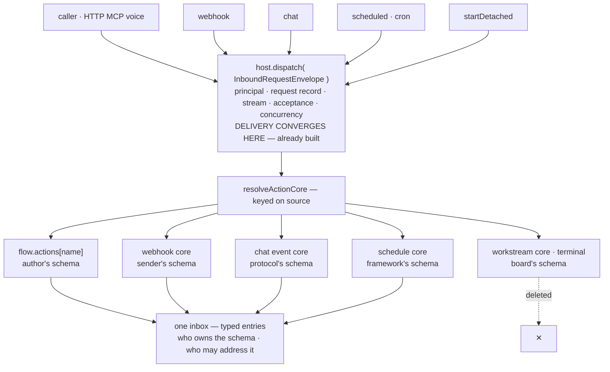

# Design — one dispatch protocol replaces Workstreams and reshapes Relay

**Date:** 2026-08-29 · substantially revised 2026-08-31
**Status:** Proposal — not approved, nothing implemented.
**Reading order:** §"This cycle's slice" says what is in this cut and what is
deferred; the body then describes the whole shape. Earlier shapes this document
carried and moved off are collected in §"Considered and not taken" at the end,
with the reason each was dropped.
**Type:** Framework change — `@flow-state-dev/core` (flow surface, detached source), `@flow-state-dev/engine` (request host, routes), `@flow-state-dev/orchestration` (task board), `@flow-state-dev/devtool`.
**Supersedes in effect:** the routing half of FIX-982 (P2 bindings, P3a core assembly) and FIX-999's `workstream` source naming. Keeps FIX-1068 (lineage) intact under a better name.
**Layer:** Layer 1 addressing. Workstreams is **already** Layer 1 — a shipped routing surface on the substrate — so removing it is a Layer 1 change, not a rename, and citing only FIX-1197 would hide that. FIX-867's Agent / Team / Channel are Layer 2 conventions and are **out of scope**. The Workforce atlas states the rule this respects: *"do not bake a Conductor opinion into Layer 1 just because it ships first."*
**Changes an approved epic:** the Relay epic (FIX-1197) was scoped while workstreams existed. Two of its six issues merge into one verb, one is not built, and one is promoted from a supporting piece to the primitive — see §"Reconciliation with the Relay epic". **This removes work from that epic; it adds none.**

---

## This cycle's slice

**The record is D-8** — *"One-inbox this cycle (same-flow); dispatcher is a
handler"* (#1530, closed 2026-09-01). Architect and Cycle PM each applied their
own lens and agreed; it is not an owner leftover. Cite D-8 rather than this
document or the PR thread when a later change asks why dispatcher is a handler
this cycle.

**One direction, a narrower first cut.** The body below describes the whole
design. This section says which part of it this cycle builds, so a reader does
not mistake the endpoint for the scope.

**In this cycle**

- **One inbox per flow, addressed `(type, name)`, same-flow only** — the address,
  the five dispatch types, the no-fallback rule, and the typed entry.
- **`dispatcher` as a handler built around a typed envelope** — not a fifth
  block kind. The handler builds the envelope, puts it through a factory-only
  seam, and returns the handle; it does not return the envelope for a brand
  check (D-8 as amended, 2026-09-01). See §"`dispatcher` — a handler this
  cycle, a kind later".
- No `relay.on`. No `sessionKind`.

**Out this cycle.** Deferred is not rejected; each of these stays live for a
later cycle:

| Deferred | Why it is not in this cut |
|---|---|
| Full Workstreams deletion | the addressing lands first; the deletion is its own change with its own public-surface rename in `client` and `react` — §"Deletions and renames" |
| A fifth `dispatcher` block kind | a locked-contract amendment is not something a first cut should carry. The three arguments for it survive in §"`dispatcher` — a handler this cycle, a kind later" |
| Amending `architecture-reference.md` | the reference stays the single spine; this document must not become a second one |
| Cross-flow dispatch | already phased out of v1 by two independent findings — §"more complicated" #2 and #3 |
| Layer 2 — Agent / Team / Channel (FIX-867) | out of scope, unchanged |
| PR #1527 | held as written — see §"What this costs, stated plainly" |

**The fence.** The leftover Workstream maps stay where they are and **do not
grow**. Nothing new routes through `flow.workstream`, `workstreamBindings`, or
`WORKSTREAM_SOURCE`, and they are not a compatibility path for the new
addressing. Work that would need them is out of this cycle rather than bridged
into it.

---

## Locked contracts this amends

`docs/contributing/architecture-reference.md` → "Locked Contracts (Phase 1)".
**Two lines change this cycle; a third is deferred.** They are listed here so
the amendment is explicit and auditable rather than a silent exception
discovered at implementation.

| Line | Today | After |
|---|---|---|
| 15 — block kinds | `handler`, `generator`, `sequencer`, `router` | **unchanged this cycle.** `dispatcher` ships as a handler factory; the fifth kind is deferred, not rejected — see §"`dispatcher` — a handler this cycle, a kind later" |
| 31 — action forms & resolution | `resolveActionCore` reads a namespaced coordinate gated on `source`, falling back to `flow.actions[name]`, terminal only for `"workstream"` | one keyed lookup on `(type, name)`; **no fallback for any type**. `"workstream"` keeps its existing terminal path this cycle, behind the fence and taking no new callers; it loses its referent with the deletion |
| 32 — public re-entry | allow-list `http` / `mcp` / `chat` / `scheduled`; `webhook` and `workstream` never openable | unchanged in shape; `task` inherits `workstream`'s exclusion — see §"What must not silently change" |

**The fifth kind was the one that needed a decision, and it has one: not this
cycle.** `dispatcher` ships as a handler factory, so line 15 stands and no
unstated exception is left behind. The three arguments for a kind — no
shape-sniffing at the dispatch seam, a roster that shows statically which workers
hand off, and a `defineFlow` walk replacing `assertWorkstreamBindingsReachable`
— are not withdrawn; they are the case a later cycle answers, kept in
§"`dispatcher` — a handler this cycle, a kind later" together with what the
handler form costs.

*This document declares the amendment; it does not edit the reference. Editing a
locked-contract file from an unapproved proposal would assert the change before it
is agreed. The edit lands with the approval.*


## The problem, plainly

We built a second way to run work, parallel to the one we already had.

A flow declares `actions`, and a caller names one. Detached work declares nothing —
it accumulates. A task board stamps a *binding* onto its drain sequencer, each
enclosing sequencer merges its children's bindings upward, `defineFlow` collects
the union off each action root, and a keyed router is assembled from that union
into a single `flow.workstream` entry. A detached dispatch resolves that one entry
and nothing else.

So we have two registries that answer the same question — *which block runs this
name?* — with different mechanisms, different failure modes, and different words.
`flow.actions` is a map somebody wrote. `flow.workstream` is a router nobody wrote,
derived from a graph walk, keyed by a length-framed composite of `boardId` and an
encoded worker coordinate.

That is a shadow flow system. It has its own routing table
(`workstreamBindings`), its own resolution rule (`WORKSTREAM_SOURCE`, terminal),
its own refusals (`no-workstream-core`, `board-not-routable`), its own session
kind (a "Workstream"), its own HTTP route, its own devtool tab, and its own word
for a resource that stores one level up (`sharedToWorkstream`). None of it is
wrong. All of it is a second copy of concepts the framework already has.

**This proposal deletes the second copy** — and then finds it was never the only
one. Every arrival becomes a named entry addressed by `(type, name)`, reached by
one declared block. A spawned session becomes an ordinary session. The word
"Workstream" stops having a referent and goes away.

**And that reaches further than workstreams.** The Relay epic (FIX-1197) is
approved and in flight, and it was scoped against the same premise this document
removes — that a workstream is a session you can start but cannot reach. Relay
exists to add the reaching. Delete the premise and relay is not a subsystem beside
the transports: it is the `internal` row of one dispatch-type table, and its send
verb is the same verb a spawn already uses with the session argument filled in.
So this is not only a deletion. **It is a smaller Relay**, and §"Reconciliation
with the Relay epic" walks its six issues one at a time.

### The symptom that makes it concrete

`startDetached` is on every block's execution context and documented as "a general
verb." In the whole repo there is **one caller**
(`packages/orchestration/src/task-board/blocks/spawn-detached.ts`) and **one
producer of bindings** (`packages/orchestration/src/task-board/index.ts:1202`). A
flow with no task board that calls `startDetached` is refused
`no-workstream-core`. The seam is general; the only door through it is
board-shaped — which is the tell that **the verb had no named target.** It took a
seed and an opaque payload, so the only way to know what a call meant was to look
at what it carried.

And because the seam cannot know whether its caller is a board, it *guesses*:
`create-request-host.ts:198` parses the caller's opaque `input` against the board
dispatch schema to decide whether the call is board work, then validates the
address it found. The 25-line comment above that parse admits what it cannot
prove — that the board making the call is the declaration it matched — and
explains that nothing in the seam identifies the caller.

A named target removes the question. There is nothing to infer from a payload
when the caller says what it wants.

### The second derivation: building the UI found the same thing

Everything above is code archaeology — reading the seam and counting its callers.
The Conductor TUI POC reached the same conclusion from the opposite direction, by
trying to *show* the model to a person.

**Its finding: all flows are top-level. You communicate to them and you spawn
them. Workstreams hid everything behind one coordinator session.**

That is worth recording because it is independent. Nobody arrived at it by
reading `resolveActionCore`; it fell out of asking what a user should see. A
workstream has no natural place in that picture — it is a run you can start and
then cannot point at, so a UI either invents a second navigation concept for it or
leaves it invisible. The devtool's separate "Workstreams" tab is that invention.

A design supported from two directions — the seam cannot identify its caller, and
the interface cannot name what the seam produced — is a stronger case than either
alone.

---

## The dispatch protocol

This section is the frame the rest of the document sits in: what the change is an
instance of, before the shape it takes.

**One word first.** An arrival at a flow is a *dispatch*, not a *message*.
`message` already names the primary content item — `ctx.emit.message()`,
`MessageItem`, the thing that enters LLM history — and the two would meet at
Relay's send, where an `internal` dispatch's payload lands as a message item in
the target session. The codebase already uses *dispatch* for the arrival:
`host.dispatch`, `DispatchEnvelope`, `DispatchHandle`, "detached dispatch", and
the `dispatcher` block. *Inbox* and *mailroom* stay as the metaphor; they collide
with nothing. (The dropped name is recorded in §"Considered and not taken".)

### The inbox already exists

Every transport converges on one seam. `InboundRequestEnvelope`
(`packages/engine/src/transports/types.ts:68`) is the single shape an adapter
builds, and `host.dispatch` is the single door it hands it to — HTTP, chat,
webhook, scheduled, MCP, voice, and `startDetached`, whose own header says
reaching past `host.dispatch` is the thing not to do
(`context/detached-start-operation.ts:18`). Principal resolution, the request
record, streaming, acceptance and concurrency arbitration all happen once, there.

Two consequences are easy to miss:

- **Concurrency config is already an inbox drain policy.** `ConcurrencyFlowView`
  is `{ actions: {…concurrency}, request: { concurrency } }` — a flow-level
  default with a per-entry override, keyed on session, offering `allow` /
  `queue` / `reject`. That is how the inbox drains. It reads as request config
  only because nothing named the inbox.
- **Cron is already a dispatch.** The scheduled adapter builds an envelope at fire
  time and puts it through the same door. The relay epic's issue 4 ("cron as
  scheduled message") is therefore a naming change, not a mechanism.

The mailroom is not a thing to build. It is a thing to stop special-casing.

### What is not unified: routing, not delivery

`resolveActionCore` is five maps keyed on `source`:

| `source` | resolves | input schema owned by |
|---|---|---|
| *(caller)* | `flow.actions[name]` | the author |
| `webhook` | the flow's webhook core | the sender's protocol |
| `chat` | the chat event core | the chat protocol |
| `scheduled` | the schedule core | the framework |
| `workstream` | the one assembled core, **terminal** | the board |

Delivery is uniform. Addressing is five special cases. This document deletes the
last row — but deleting one of five leaves four, and all five exist for the same
reason, so it is worth stating once.


Drawn, because the asymmetry is the whole argument:



**They exist because for four of them the input schema is not the author's.** A
webhook carries what the sender sends; a schedule carries a fire event; a task
carries the board's dispatch payload. An action's `inputSchema` is
author-declared, so an entry whose schema someone else owns could not live in
`flow.actions` — and each grew its own map instead.

What that actually needs is a **typed inbox entry**, not a separate map. One
namespace; entries differ in who owns the schema and who may address them.

Which settles a question this document left half-open: **a task entry is not a
third roster seat beside `actions` and `workstream`. It is an inbox entry whose
input schema the framework owns.** `on.webhook` is the same kind of thing. The
seats collapse to one.

### The dispatch types

Every type is addressed the same way — `(type, name)`, plus a session when the
dispatch targets an existing one. What differs is who owns the input schema and
who may put a dispatch through the door.

| Type | Arrives from | Schema owner |
|---|---|---|
| public | a caller — HTTP, MCP, voice, or a matched chat subscription | the author |
| webhook | an external sender; named `provider/event` | the sender |
| schedule | the host cron for a static entry; the outbox sweep for a row a block wrote | the framework |
| task | a board drain | the framework |
| internal | a `dispatcher` block in another request | the author |

The `schedule` type is what the existing `"scheduled"` transport source already
names; the string need not change. Two of these carry a coordinate the author
does not own, and one is selected by a subscription rather than addressed
directly. Both cases are handled below under
§"Protocol-owned types carry a compound name" and §"Subscription is not routing".

An adapter is already `{ source, createBindings(host) }` — an immutable factory
that produces routes and puts envelopes through the door
(`transports/types.ts:339`). Formalizing the protocol means an adapter stops
*also* inventing its own addressing convention: it declares a dispatch type, and
the inbox resolves it the same way for every type. The payoff is on the extension
path — adding a transport becomes implementing a contract, rather than writing an
adapter *and* a routing map to go with it.

This is a formalization, not a new mechanism. Most of it is already true. What it
buys is that the next transport cannot quietly add a sixth map.

### An ack is two things, and only one of them is a task

`DispatchHandle` already splits them, and that comment is visibly scar tissue
(`transports/types.ts:179`):

- **Delivery ack** (`accepted`) — the dispatch is discoverable and will not
  silently not exist. Synchronous, every dispatch has it, costs nothing.
- **Outcome ack** (`finished`, or a durable row) — the work settled with a
  result, possibly many requests later.

So: **needs an outcome ⇒ it is a task. Needs only delivery ⇒ nothing is minted.**

That is what removes relay's separate reply plumbing. A send that expects a reply
does not need a deliver-with-output mechanism; it needs somewhere durable to put
the reply and something that can watch it. A board row is exactly that, and the
board already exists.

The distinction has to survive the collapse. A sender that wants nothing back
still needs to know the letter got into the building, and a task row is the wrong
instrument for it — durable, claimable, leased, and none of that is what a
fire-and-forget sender asked for.

### Three things the collapse must not break

1. **Addressability becomes an explicit per-entry declaration.** Today
   `workstream` is safe partly because a caller cannot stamp the source, and the
   source is absent from `PUBLIC_REENTRY_SOURCES`. Flatten the maps and that
   protection leaves with them. Every inbox entry declares who may address it.
   Cheap, but part of the collapse — not a follow-up.
2. **`resolvedActionCore` is a live escape hatch.** A dynamic schedule's core is
   produced at dispatch time by a resolver, so it has no static coordinate to
   resolve from. A static inbox either keeps that hatch or dynamic schedules lose
   their path. Named now rather than discovered later.
3. **There is no second namespace.** If `kind` becomes its own binding table
   (`relay.on[kind]`), the shadow system has been deleted at one layer and
   regrown at the next. *(Refined below: the address is `(type, name)` — one
   key with two segments, not a name plus a parallel concept.)*

---

## The typed entry

The decisions taken on that frame, each with the reason it went the way it did.
Shapes that lost are in §"Considered and not taken".

### The address is `(type, name)`, not a bare name

The third guard above rules out a second namespace. An earlier draft stated that
as *"a dispatch's kind is the action name"* — aimed at the right target, a parallel
`relay.on[kind]` table, but too narrow. **The address is a pair.**

```ts
flow.public.actions.chat
flow.internal.actions.status
flow.schedule.actions.dream
flow.webhook.actions.github
flow.task.actions.work
```

This is not the five maps returning. Those are five *mechanisms* — one of them a
router assembled by a fixpoint graph walk — with different resolution rules and
different failure modes. This is **one mechanism with a two-part key.** The rule
the earlier section was reaching for survives intact: there is no second
namespace, because `type` is the first segment of the one address rather than a
parallel concept.

**Nesting: `flow.<type>.actions`, not `flow.actions.<type>`.** The deciding
factor is per-type config, which the second shape has nowhere to put.
`flow.task.retries` and `flow.public.concurrency` want a home, and one already
exists a level up: `flow.request.concurrency` is the all-types default today
(`ConcurrencyFlowView`, `transports/concurrency/arbiter.ts:44`). So the ladder
is **default → per-type → per-action**.

That is one rung more than ships, and the bottom rung is narrower today than it
looks. The arbiter reads `flow.actions[name].concurrency` for caller actions
only; an event (`webhook`, `chat`, `scheduled`) and a detached dispatch go
straight to the flow default (`arbiter.ts:144–160`), so a webhook or schedule
entry has no per-entry policy at all. Typed entries give every type the same
three rungs, and the arbiter's `isEvent` / `isDetached` special case goes with
the maps it was written for.

**The nested shape had a collision this document missed.** `flow.user` and
`flow.org` are already the user- and org-scope configs (`types/flow.ts:428`,
`flow-registry.ts:410`), so `flow.user.actions` would have sat inside the user
scope's config or displaced it. The POC on #1543 hit exactly that and went to
flat maps. Renaming the caller-facing type to `public` removes the collision —
`flow.public` has no prior meaning, and neither do `internal`, `task`, `schedule`
or `webhook` as singulars — which puts nested-versus-flat back on its merits (a
home for per-type config) rather than on an accident of naming.

### Who may address an entry

Guard 1 above says addressability becomes an explicit declaration. Under a
two-part key that declaration is the map itself: an entry in
`flow.internal.actions` is reachable by an `internal` dispatch and by nothing
else, because the lookup is keyed on the type and there is no fallback. An
earlier revision put a per-entry `from` list on top of that. It was either
redundant with the map or a way to resolve one type's dispatch in another type's
map — which is the fallback the previous section deletes. **There is no
`from`.** What remains to declare is the other half — which types a *block* may
put through the door — and that is a rule rather than a per-entry list.

**A block may dispatch a type only when it can itself supply that type's trust.**
Not "internal versus external" — that cut is wrong, and it excludes scheduling,
which a block has every reason to do.

| Type | Where its trust comes from | A block may dispatch it |
|---|---|---|
| `webhook` | a signature over raw bytes | **No** — the block does not hold the bytes |
| `public` | a caller's principal resolved at the edge | **No** — manufacturing one is BP-031 |
| `internal` | the running request's own authority | Yes |
| `task` | the same, plus a verified claim | Yes |
| `schedule` | time passing | **Yes** — see §"Scheduled delivery" |

Without this rule a `dispatcher({ type: "webhook", target: "github" })` invokes a
webhook handler with **no signature check at all** — the verification lives in the
adapter the dispatch went around. The rule states *why* rather than listing which
types are allowed, so a sixth type gets classified rather than forgotten.

`schedule` is deliberately on both sides. The `schedules` config is already *"a
resolution surface: a static map (the framework-cron case) plus an optional
`resolve(scheduleId, ctx)` hook"* (`types/schedules.ts:10`) — the static map is
the externally declared half and the resolver is the internally created half.
That split ships today.

### Protocol-owned types carry a compound name

`(type, name)` is enough for `public`, `internal` and `task`, where the author owns
both halves. It is **not** enough for types whose coordinate belongs to a
protocol.

A webhook resolves today by two coordinates, not one:
`webhooks: { <provider>: { on: { <eventType>: binding } } }`
(`types/webhook.ts:5`). One segment after `webhook` loses a dimension: either two
GitHub events cannot pick different handlers, or `push` from two verified
providers collides.

**The name is a compound the type defines.** For `webhook` it is
`provider/event`:

```
flow.webhook.actions["github/pull_request"]
flow.webhook.actions["stripe/charge.succeeded"]
```

The address stays one keyed lookup, and the structure lives inside the name where
the type owns it. The separator is part of each type's contract, so provider names
containing it are rejected at definition time rather than silently re-parsed.

### Subscription is not routing

Chat is the other protocol-owned case, and folding it into `public` as "just another
arrival" was wrong. `flow.chat` is *"per-flow chat-transport subscriptions"* whose
adapter *"discovers these declarations at mount and dispatches matching inbound
chat events to the named actions"* (`flow.ts:450`). It evaluates `when`
predicates, maps protocol events onto handler input and session ids, and stamps
the matched key.

None of that is addressing. It is **matching** — deciding which entry an event
belongs to. So it stays in the adapter, and its output is an ordinary
`(type, name)` dispatch.

`flow.chat` therefore survives as a **subscription declaration**, not a routing
map. That distinction is what keeps this from being the sixth map wearing a new
hat: a subscription selects an address, a routing map *is* the address.

### One registry — `flow.tasks` as a sibling map is not the design

Stated here rather than only in §"Considered and not taken", because this is where
an implementer looks.

An earlier revision proposed `flow.tasks` beside `flow.actions`: two hand-written
maps of name → block, differing in who may address them. **Do not build it.** It
deletes `flow.workstream` and leaves `webhook`, `chat` and `scheduled` untouched,
so it reduces the shadow-registry problem rather than removing it — and it
rebuilds two registries where the entire point is one.

A task entry is `flow.task.actions.<name>`: the same mechanism, the same two-part
key, differing only in who owns the input schema and who may address it.

### No fallbacks — and this is a generalization, not an invention

A dispatch addressed to a type that declares no such entry is refused. It does
not fall through to another type's map.

One type already works this way: `WORKSTREAM_SOURCE` resolution is terminal, and
an absent core is a named refusal rather than a fall-through to `flow.actions`.
The change generalizes that rule to all five and deletes the implicit fallback
where any non-special source lands in `flow.actions`.

**The cost is deliberate: a handler reachable from two types is declared twice.**
That is not an edge case — a chat bot serving `public.chat` and `webhook.mention`
is the ordinary case (see the atlas's third stress test). Two entries, one block,
and the block cannot assume which type it runs under. Which decides the next
question.

### The typed envelope lives at the entry, not on `ctx`

Since a shared block may be entered from two types, `ctx.task` cannot be
non-optional. Three shapes were considered:

| | |
|---|---|
| `ctx.task?` everywhere | honest, but every task worker null-checks a field it certainly has |
| `ctx.as("task")`, throwing off-type | the same check, worse ergonomics |
| **envelope handled at the entry** | **chosen** |

The typed part reaches the **entry** as input; blocks below it that need the row
take it as input too. `ctx.task` shrinks to the ambient lifecycle verb the
substrate genuinely owns — `park`. (Heartbeat is automatic lease renewal,
`tasks/lease-renewal.ts`, and needs no verb.)

This is the same rule that killed passing a task into an action wholesale: the
claim envelope is handled before the action is called, rather than pushed onto
implementers. Applied one level in. `sender` gets the same treatment — a field
on the entry's input for `internal` and `task` alike, not `ctx.sender`.

### `task`, not `worker`

Every other type names **what arrives** — a webhook, a schedule, a public call.
`worker` names who handles it. One transport named after its receiver breaks the
set.

### `dispatcher` — a handler this cycle, a kind later

A **router** picks a block to run *here*. A **dispatcher** names a destination to
run *elsewhere* — one destination per invocation. Fan-out still goes through
rows; a dispatcher that fans out is a router with side effects.

That is a real distinction, and it argued for a fifth block kind. Block kinds
are a locked contract at exactly four, and **this cycle does not amend it.**

**What ships this cycle.** `dispatcher({ … })` is a **factory that returns a
handler**. Inside its body the handler builds a **typed envelope** — the
`(type, target)` it was declared with, plus the session, payload and delivery
time `resolve` computed — hands it to the framework's dispatch seam, and returns
the handle the seam gives back. The block it produces also carries its
`(type, target)` as metadata, so the roster and `defineFlow` can read the
address without running anything.

**The envelope goes down into the seam, not up to a caller.** An earlier
revision had the handler *return* the envelope for an executor to recognize.
The codebase has no executor in that position. A child block is invoked in
`core`'s own runner — `blocks/sequencer.ts:413`, *"the one place a child block
is invoked"* — which calls the block's `run` directly and hands the output to
the next step; the engine observes that output only through the trace scope
and `_runtimeHooks`. Recognizing a brand there would mean either teaching
`core`'s runner about dispatch, which it has no host to perform, or rewriting a
block's output from a trace hook. So the handler performs the dispatch itself,
and the envelope is the seam's *argument*.

Two of the three arguments for a kind survive that form intact, and they survive
**because the seam is reachable from the factory and from nothing an author
writes**:

1. **A board can still see, statically, which workers hand off.** The seat holds
   a factory-made block; the board reads its metadata instead of its kind.
2. **The build-time check still exists.** Deleting the derived
   `workstreamBindings` also deletes `assertWorkstreamBindingsReachable`
   (`defineFlow.ts:659`), which catches a reachable block declaring a worker the
   flow never received. A hand-declared map cannot reproduce it — there is
   nothing to compare against. But `defineFlow` **can** walk the graph for
   factory-made dispatchers and check each target `(type, name)` resolves. The
   walk is complete over the reachable set precisely because no other code path
   can reach the seam. Same class of error, caught at the same time, without
   the bubble-up machinery.

So the graph walk survives the collapse — demoted from *routing source* to
*lint*. That is the honest fix for the one capability the deletion was otherwise
giving up.

**What the handler form costs.** Two things, stated rather than glossed:

- **The seam has to be hidden, and "on `ctx`" does not hide it.** The
  cautionary precedent is `startDetached`. It lives on the block context, and
  `types/request-host.ts:63` says what that means: *"which every block author
  reaches — an application block or a custom capability can call it."* A
  dispatch seam the factory reaches through an ordinary `ctx` member is
  `ctx.dispatchMessage` under another name. So the seam is not a `ctx` member.
  It is reached through a slot `core` does not export — a symbol-keyed field the
  factory closes over, or a capability only the factory installs. The bound on
  the walk holds only while that stays true, so it is a verification item, not
  an assumption.
- **The graph no longer says what the block does.** Devtool, traces, and anything
  else that renders the block graph see `handler`. Inline-versus-handed-off is
  legible to the board through metadata and invisible to a reader.

A kind would need neither: dispatch would be what the engine does *with* the
block, so there would be no seam for a handler body to reach.

**Deferred, not rejected.** The taxonomy still reads better as three groups than
five flat kinds — leaves that compute (`handler`, `generator`), a leaf that hands
off (`dispatcher`), composites (`sequencer`, `router`) — and the two costs
above are exactly what a later cycle would buy back by amending line 15. Nothing
in this cut forecloses it: the factory is the same author-facing surface either
way, so promoting it to a kind later changes the engine and the graph, not the
flows people wrote.

### Sessions can be named, and "not found" still rejects

**A correction.** An earlier claim in this document's discussion — that session
ids are derived and never author-chosen — is false as a general statement.
`handleCreateSession` accepts a caller-supplied id today:

```ts
// packages/engine/src/routes/session-routes.ts:136
const sessionId = getString(body.sessionId) ?? generateId("sess");
```

Derived ids (`deriveChildSessionId`) are the rule for **spawns**, where the
derivation is what makes a spawn idempotent — "first spawn for this row". They
are not the rule for caller-created sessions, and a named session is a
legitimate shape: a channel, `status-updates`.

So a dispatch naming a session that does not exist **rejects**. (The full
three-way is in §"The shape".) A session that exists but belongs to another
user rejects too, and that check is already there: the loaded session record's
`userId` is authoritative and a mismatch throws (`createExecutionContext.ts:642`,
`UserBindingMismatchError`). An `internal` delivery into a named session passes
through it like any request that carries a `sessionId`.

Reject is the default because an unknown id is a typo, a stale reference to a
reaped session, or — once a send verb is in a model's hands — a hallucination,
and auto-create turns all three into real work nobody is watching. Reject is also
the recoverable branch: drop the id and mint. A spawn cannot be un-spawned.

**Channel-shaped auto-create is deferred out of v1.** An entry that creates a
session on an unknown name is the one behavior here resembling a Layer 2
convention — Workforce's agent-owned channel — and the atlas rule is *"do not bake
a Conductor opinion into Layer 1 just because it ships first."* **v1 rejects, with
no per-entry exception.** If a channel is needed sooner it belongs to Conductor or
Workforce as a convention over the caller-named session `handleCreateSession`
already supports, not as new Layer 1 behavior.

**Two things to know before that lands.**
`resolveSessionStorageKey(sessionId, tenantId)` namespaces by **tenant, not
user**, so a slug is tenant-global while the record's `userId` is merely whoever
created it first. Harmless under the same-user invariant; sharp the moment two
people address one channel, which is what channels are for. And a channel wants
`queue` concurrency rather than the `allow` default, or two dispatches to
`status-updates` interleave.

---

## The shape

One address, one declared block that reaches it, one place the claim envelope is
opened.

### Dispatch is a block, not a method on `ctx`

A block does not *call* a dispatch. It **is** one — a handler the `dispatcher`
factory builds, which puts a typed envelope through the framework's seam and
returns the handle (§"`dispatcher` — a handler this cycle, a kind later"):

```ts
const handOff = dispatcher({
  name: "hand-off-to-implement",
  type: "task",              // static — the address
  target: "implement",       // static — resolves flow.task.actions.implement
  session: "per-task",       // the session policy
  resolve: (input, ctx) => ({
    session: input.threadId, // computed, and wins over the policy
    payload: { issue: input.issue },
    deliverAt: input.when,   // optional — see §"Scheduled delivery"
  }),
});
```

`type` and `target` are the address, and they are **static**. The session, the
payload and the delivery time are computed:

| `session` after `resolve` | Behaviour |
|---|---|
| absent | mint one |
| present, found | deliver into it |
| present, not found | **reject.** v1 has no exception — see §"Sessions can be named" |

**The address is static so it can be verified. The envelope is dynamic so it can
be useful.** `(type, target)` never varies, because that pair is exactly what
`defineFlow`'s walk checks — the replacement for
`assertWorkstreamBindingsReachable`. Make the target dynamic and that check dies.
Everything else — session, payload, delivery time — is computed at run time.

If the *address* genuinely varies, that is a **router over declared dispatchers**,
not a dynamic target. The reachable set stays declared, which is the whole point.

A dispatcher **returns a handle** — the session id, the request id, and for a task
the row id — so a later step can record what it started.

One consequence of a computed session: the reject-on-unknown rule now fires on a
value the flow calculated, so it is the likely path rather than a defensive one.
The refusal must name the computed value and the block that produced it.

**There is deliberately no `ctx.dispatchMessage`.** An imperative escape hatch
would defeat both reasons the factory exists: a board could no longer tell
statically which workers hand off, and `defineFlow`'s walk could not see targets
buried in handler bodies. It would also break the condition the walk rests on —
that the seam is reachable from exactly one place — so the lint would report on
a subset it cannot bound, which is worse than none because it looks complete.

It is also the call this codebase has already made twice: BP-011 (a handler does
not call blocks — compose as a sequencer) and BP-012 (`.tap()` rather than mutating
state inline). An imperative dispatch is the same violation one level out.

Four cases look like they need the hatch. None does:

| Looks like it needs an imperative call | What it actually is |
|---|---|
| Target chosen from data (`row.assignee`) | a **router** over the declared dispatchers — the roster *is* the declared set |
| Dispatch only under a condition | `.stepIf` / `.sideChainIf` (BP-036) |
| Session or payload computed at run time | the dispatcher's `resolve` slot, above |
| A model choosing the recipient (`relaySendTool`) | a router over the allowed dispatchers |

**The last row argues hardest for the restriction.** Putting send in a model's
hands with a free-text address means a hallucinated session id is a dispatch
attempt. A router over declared dispatchers makes the model's reachable set an
allowlist checked at definition time instead of a string checked at run time —
which is the recipient scoping this document otherwise had to bolt onto the tool.

**The framework still needs the seam; it is just not on `ctx`.** The board drain,
the task wrapper, the outbox sweep and every transport adapter dispatch. That is
the same shape `host.dispatch` has today — real, used, and not author-facing.

One action fanning into four kinds of work, with only one of them using a verb at
all:

```mermaid
flowchart TB
  subgraph R1["REQUEST 1 · SESSION A · FLOW A"]
    entry["public.analyze<br/>entry — type known statically"] --> seq["sequencer"]
    seq --> bg["dispatcher<br/>type: internal"]
    seq --> drain["board.drain"]
    drain --> inline["inline worker · block<br/>never leaves request 1"]
    drain --> rows[("rows · a resource<br/>durable")]
    drain --> ho["dispatcher<br/>type: task"]
  end

  bg --> S2["SESSION B · REQUEST 2<br/>internal.status<br/>nothing minted — delivery ack only"]
  ho --> S3["SESSION C · REQUEST 3 · FLOW B<br/>task.work<br/>the row is the outcome ack"]
```



The background branch and the handed-off task differ only in dispatch type, and the
type is what decides whether a durable row is minted. The inline worker is the
reminder that not every task becomes a request: it runs inside the drain that
claimed it, so the row settles with nothing dispatched.

### The board is the only thing that mints rows

A `task` dispatch is the one type that carries a claim. Rows are minted by a task
board and by nothing else, so `flow.task.actions` is meaningless without one and
`defineFlow` refuses the combination.

The four pre-worker guarantees do not move. What changes is where they live:

```
dispatch { type: "task" }  →  framework task-entry wrapper  →  flow.task.actions[row.assignee]
                              ├─ re-read the claimed row
                              ├─ verify attempt / createdAt / incarnationId / lease
                              ├─ mark the task scope
                              └─ re-mint the claim ticket
```

**There is no `flow.taskRunner` entry to declare.** Earlier drafts gave the board's
runner its own flow-level slot, which made every task dispatch resolve a runner
that then resolved a worker — two hops and a second map. Under typed entries the
runner is the framework's wrapper around the `task` type itself: the envelope is
verified before the entry block runs, and the entry receives work rather than
paperwork. That is the same rule that keeps the envelope off `ctx` — handled at
the boundary, not pushed onto implementers.

The wrapper's input is fixed, which is what lets it hand off without knowing what
a given task's work looks like:

```ts
type TaskInput<TPayload = unknown> = {
  boardId: string;          // which board claimed this
  collectionKey: string;    // which ledger to re-read and settle against
  taskId: string;
  attempt: number;
  createdAt: number;
  incarnationId?: string;   // absent on a row predating the nonce (BP-030)
  payload: TPayload;        // materialized worker input, packed at claim time
};
```

**`boardId` and `collectionKey` are not optional, and an earlier revision dropped
them.** One flow may hold several boards. Task ids can repeat across collections,
and one worker can be reached from more than one board, so `taskId` + `attempt` +
`incarnationId` do not say which ledger the wrapper must re-read. Today that fact
survives because the dispatch envelope carries `boardId` and each runner is closed
over its own collection; a replacement envelope without them lets the four checks
inspect the wrong ledger, or none.

Both are **server-derived** — stamped by the claiming board, never read from a
payload — so they add no caller-facing surface (BP-031).

Everything but `payload` is the claim envelope — compared against the re-read row,
verified and never trusted. The entry sees `payload`; `ctx.task` carries only the
ambient lifecycle verb the substrate owns (`park`).

A `task` dispatcher is therefore meaningful only as a roster seat. Invoked from
anywhere else it reaches the wrapper with no claimed row and is refused at run
time. `defineFlow` can say so earlier: a factory-made `task` dispatcher that is
reachable from an action root but held by no board is the same class of error
as an unresolvable target, and the same walk finds it.

### The board's roster: three seat types

A board's roster is not new machinery. A skill board already declares **agents**
(prompt-driven, materialized at runtime) and **assignable tools** (called directly,
no model turn), and every tool that writes an assignee — `addTask`, `assignTask`,
`updateTask` — already checks the name against that roster and returns the
available ones on a mismatch, "instead of letting a mistyped name fall through to
the default worker at drain time."

The third seat is a **dispatcher**:

| Seat | Declared as | Runs |
|---|---|---|
| Inline block | `summarize: summarizeBlock` | in the claiming request |
| Tool | any roster tool key | directly, no model turn |
| **Dispatcher** | `implement: implementDispatcher` | **its own session** |

All three seats are blocks. A dispatcher seat holds the `dispatcher({ … })` value
declared above — there is no second spelling and no roster-only shorthand.

```ts
const board = taskBoard({
  boardId: "issue-work",
  collection: workBoardCollection,
  workers: {
    summarize: summarizeBlock,     // inline — unchanged
    implement: implementDispatcher, // hands off, per-task session
    review:    reviewDispatcher,
  },
});
```

**The factory's metadata is what lets the board see this statically.**
Inline-versus-handed-off used to be a runtime fact discovered at claim time. A
factory-made block carries its address at definition time, so the roster shows
it, and it gives `defineFlow` something to walk: every dispatcher in the graph
names a `(type, name)` that must resolve. That walk is what replaces
`assertWorkstreamBindingsReachable` — the build-time check the collapse would
otherwise lose. See §"The typed entry".

`dispatch: { mode: "detached" }` disappears from this seat. A dispatcher is
detached by being a dispatcher; locality stops being an axis to configure and
becomes a property of the seat.

### Where a worker's tasks land: four modes

Two questions decide this. Does the work get its own request? If so, what keys its
session?

| Mode | Session | Use it when |
|---|---|---|
| **inline** | none — runs in the claiming drain's request | the work is short and needs nothing the drain lacks |
| **per task** *(default when dispatched)* | keyed on the task id | work is independent — a checkout per issue, a run per row |
| **per key** | keyed on a value from the row | one issue across spec, implement and review |
| **per worker** | one long-lived session for this worker | the worker should remember what it already did |

**Dispatch when at least one of these is true.** Otherwise stay inline.

- The work outlives the parent request — hours, or a wait on a person.
- It needs its own workspace: a checkout, a working directory, a harness session.
- It needs a different capability set, model, or token budget than the drain.
- Someone must address it later — to follow it, steer it, or resume it.
- Its failure must not take its siblings with it.

A sharper form of the isolation test: **if two workers would collide on
session-scoped state, they cannot both run inline.** Dispatch them, or move that
state to task scope. That is checkable against the scope model rather than a
matter of taste.

Getting it wrong cheaply costs a session record and a request record nobody
needed. Getting it wrong expensively costs a worker that dies with its parent.

**A shared session needs `queue`, not the `allow` default.** Per-key and
per-worker both let two tasks dispatch into one session at once, interleaving
writes to its state and history. Those modes should default to `queue`; inheriting
the global `allow` is a footgun, not a choice.

**Failure timing differs, and it is operational.** Inline fails fast into the
drain. A dispatched worker that dies silently costs a full lease before anything
reclaims the row. "How long until we notice" is part of choosing a mode.

#### `per-worker` needs a derivation it does not have yet

This was stated too easily in an earlier revision as "three seeds, not three
mechanisms." That is wrong, and the code says so.
`deriveChildSessionId` hashes `[tenantId, userId, parentSessionId, lineageId,
topic, key]` (`detached-child.ts:68`) — the parent session and lineage come
**before** the key. So a user- or org-scoped board drained from two sessions
produces two children from one per-worker seed, not the single long-lived session
the mode promises.

Two ways out, and this is an open decision:

- **Narrow the contract** to one worker session per parent, which the existing
  derivation already gives. Cheap, and weaker than advertised.
- **Give the mode its own derivation** that omits `parentSessionId`, which then
  needs its own owner, adoption rule and authorization check — a real addition,
  not a seed change.

*Recommendation: narrow the contract for v1 and record the wider version as
follow-on.* A worker that must remember across parents is a channel, and channels
have their own naming path.

### Concurrency: three limits, and the one that is missing

Three separate things bound how much runs at once, and they are easy to conflate.

| Limit | Where it lives | What it bounds | Default |
|---|---|---|---|
| Worker pool | `taskBoard({ concurrency })` | parallel workers **across the whole board** | 4 |
| Add burst | `taskBoard({ maxPending })` | rows added while others are `pending` | 100 |
| Entry arbitration | `flow.<type>.actions.<name>.concurrency` | competing dispatches **on one key** | `allow` |

**"Max 2 `implement` workers" is not expressible today, and that is worth knowing
before this design leans on it.** Board `concurrency` is a pool size for the whole
board — `.forEach({ maxConcurrency })` over one worker set — so setting it to 2
caps *every* assignee, not one. Entry arbitration does not fill the gap either:
under the default `per-task` session policy every dispatch carries a different
session, so a session-keyed policy has nothing to serialize.

What the existing surface *can* express:

- **Board-wide cap** — `concurrency: 2`. Bounds everything, which is often what a
  rate-limited backend actually wants.
- **One at a time for an entry** — a custom `ConcurrencyKey` returning a constant
  (`() => "task:implement"`) with `queue`. `ConcurrencyKey` already accepts a
  function, so this needs no new mechanism.
- **One at a time per session** — the default session key, which is what
  `per-worker` and explicit reuse both produce.

What it cannot: **max-N for one entry.** The arbiter is built on
`keyed-async-gate`, a mutex — one holder per key. Max-1 falls out; max-2 needs a
counting semaphore. That is a real addition, not a config, and this document does
not propose it. Noted so that a spec which assumes per-worker limits knows it is
proposing the semaphore too.

### Within a skill

A skill declares **one list: which registered workers it may assign to.** Not
`agents` plus `tasks` plus `allowed-tools` — those were three lists describing one
fact, and each carried its own inline definition, so a skill could mint a worker
nobody else could see.

```yaml
# SKILL.md
workers: [reviewer, implement]
```

The names resolve in the registry. Whether `reviewer` is a prompt-driven agent
running inline and `implement` a dispatcher handing off to its own session is the
registry's business, not the skill's — the skill states only what it is permitted
to assign.

```ts
await ctx.cap.issueWork.addTask({ assignee: "implement", input: { issue: "FIX-1219" }, deps: [] });
await ctx.cap.issueWork.addTask({ assignee: "reviewer",  input: { issue: "FIX-1219" }, deps: [implementId] });
```

The generator does not know or care which is which. It assigns a name; the seat
type decides where the work happens — the same indifference the board already
gives agents and tools.

**Two things this collapses.** Inline agent definitions go away: a skill that wants
a worker registers it, so the same worker is reachable from a board, another skill,
or a flow, and there is one place it is defined. And `allowed-tools` stops being a
separate axis — a tool is a registered worker like the others, so "what may this
skill assign to" has one answer instead of three.

### Cross-flow is phase 2

A dispatcher naming another flow is the cross-flow case, and it is where the
guards in *What gets more complicated* come due:

```ts
workers: {
  implement: dispatcher({ type: "task", target: "implement", flow: reviewFlow }), // phase 2
}
```

The bare form has no cycle: the board lives inside the flow whose entries it names,
so naming them by string needs no reference back to the flow value. The `{ flow }`
form takes a *different* flow's value, which is why it is separable and why phase 1
ships without it.

**This also settles the reach rule.** A board may dispatch to the flows it declares
seats for and nothing else — board ownership, which needs no new concept because
the roster check that already rejects a mistyped agent name does it. Phase 1
narrows that to its own flow, which makes the question moot for now.

### Not everything durable is a task

Conductor holds epics and issues. It is tempting to make them board rows, because
they are durable and there are lots of them. They should be a **resource
collection** instead, and one question separates the two:

> **Does anything claim it?**

A task row is a unit of claimable work with a lease: pending → claimed → settled,
one worker at a time. An epic is a record people edit. Nobody claims an epic. It
has no lease and no worker, and it sits for weeks while its priority changes and
issues move in and out.

| | Store | Lifecycle |
|---|---|---|
| `epics`, `issues` | resource collection | created, edited, reprioritized, closed |
| `tasks` | task board | pending → claimed → settled, then gone |

The board is a **work queue derived from the record.** It is not the record.

Three consequences make this more than vocabulary:

- **`maxPending` defaults to 100 and applies to the board.** Thirty long-lived
  epics as rows would sit `pending` forever, consuming that budget and making
  every drain walk past them.
- **Board `concurrency` is a pool for the whole board.** Mixing bookkeeping rows
  with real work makes that number mean nothing.
- **Deprioritizing an epic becomes a resource edit** — no claim to break, no lease
  to reason about. Cancelling its work fails task rows and leaves the epic row
  untouched.

The healthy steady state is thirty epics and an empty board. That state is only
expressible when the two live in different stores.

Conductor already leans this way: its run record is a resource, separate from the
board rows. This makes that separation the rule rather than an accident.

### Worked example: conductor

```ts
const conductor = defineFlow({
  kind: "conductor",
  public:   { actions: { seed, status, answer } },
  internal: { actions: { wake } },
  task:     { actions: { spec, implement, review } },
});

const board = taskBoard({
  boardId: "conductor",
  collection: workBoardCollection,
  workers: {
    spec:      specDispatcher,
    implement: implementDispatcher,
    review:    reviewDispatcher,
  },
});
```

Today this needs three `epic` values and three hosts, because one flow has one
workstream core and two conductor instances share a board. Here the phases are
three rows with three assignees, epics partition by **session**, and `implement`
handing off to `review` in the same checkout is `session: ctx.sessionId` on the
file.

This is shape **A** — one flow, sessions by role. See §"Conductor ships as A".

---

---

## Scheduled delivery

A schedule is not a timer that reaches into the framework from outside. **Sending
writes a row; a sweep decides what is due.**

```
dispatcher(… deliverAt) ──► outbox row { deliverAt, envelope, status, repeat? }
                                       ▲
host cron ──► POST /sweep ─────────────┘  claim due rows · dispatch · settle
```

This is what makes `send_later` possible at all: a block cannot ask Vercel Cron to
add an entry, but it can write a row.

**It moves scheduling ownership — at the endpoint.** Today the host owns every
schedule: each cron entry is its own host job, and the scheduled adapter builds
the envelope when that job fires (`scheduled/src/routes.ts`), with no row
anywhere. Rows are what the outbox adds, and v1 adds them for the dispatches a
*block* writes; static entries keep the path they have. Folding static
schedules into the outbox — materializing them as rows at mount, re-arming them,
doing so once across instances — is its own change, and "the **host owns one
heartbeat**" is where that change ends, not where this one starts. The framework
still cannot wake itself, so the single external tick stays either way.

Both paths deliver a `schedule` dispatch to the same entry. The arrival transport
is a different axis from the dispatch type: the cron route and the sweep are two
*sources* for one *type*, and re-entry keys on the source
(§"What must not silently change").

### The outbox is not a task board

A board is per-flow; the sweep must be host-level. An outbox row has no assignee,
no worker roster, and no claim ticket a model presents. And routing `send_later`
through a board would mean **every flow wanting a timer needs a board** — which is
`no-workstream-core` again, the exact defect this document deletes.

### Four cases, not two

§"An ack is two things" had two. Deferred delivery adds a second axis, because a
row can exist to hold a *dispatch* rather than to record an *answer*.

| | needs no outcome | needs an outcome |
|---|---|---|
| **immediate** | nothing minted | task row |
| **deferred** | **outbox row** | task row with `notBefore` |

Tasks have no `notBefore` today. The bottom-right cell is therefore not
expressible, and a spec that wants "wake me later and confirm it happened" is
proposing that field.

### Mechanics that must be decided, not discovered

- **Granularity is the tick.** `deliverAt` five minutes out on a one-minute tick
  delivers between five and six minutes. The contract says *not before*, never
  *at*.
- **The sweep claims.** Two overlapping ticks otherwise deliver twice. Reuse the
  board's lease rather than inventing a second fence.
- **At-least-once, not exactly-once.** Dispatch, then mark delivered; a process
  that dies between the two lets the lease lapse and the row redeliver. Receiving
  entries tolerate a duplicate.
- **Cap the batch.** A tick that finds ten thousand due rows does not dispatch ten
  thousand.
- **A row carries its principal.** A static schedule runs as
  `schedule.principal ?? gatewayPrincipal` today (`types/schedules.ts:81`). A row
  a block wrote has no gateway: it runs as the request that wrote it, so the row
  persists that request's tenant, user and org, and the sweep dispatches under
  them. The sweep itself runs with host authority across every tenant, which is
  why it is a transport and not a block.
- **The lease is not where the outbox is.** "Reuse the board's lease" names a
  primitive that lives in `orchestration` (`tasks/lease-renewal.ts`,
  `task-board/shared.ts`), and `engine` cannot depend on `orchestration`
  (`orchestration/package.json:78` depends on `engine`). A host-level sweep
  needs the claim-and-lease primitive one package down — moved, not reused.

### A recurring schedule can stop itself

A recurring row re-arms after each delivery, so the receiving action needs a way
to end it. These are lifecycle verbs the substrate owns — the same carve-out
this document makes for `ctx.task`, for the same reason. (Neither exists today:
`park` is a board *mode* that excuses `awaiting_review` rows from the drain's
waitable count, `task-board/park-exit.ts`, and there is no `ctx.task` at all.)

```ts
ctx.schedule.cancel();            // stop re-arming
ctx.schedule.reschedule(next);    // change the cadence from inside
```

`reschedule` earns its place: it is how a poller backs off rather than hammering a
fixed interval.

`ctx.schedule` has the shape problem `ctx.task` had — a block reachable from two
types cannot assume it — and gets the same answer: the entry declared under
`schedule` receives the schedule handle, and a block shared with another type
takes it as input.

**Cancel must survive at-least-once delivery.** A duplicate can arrive after the
action already cancelled, so cancel writes to the row and the row's status gates
re-arming. Otherwise a redelivery resurrects a schedule someone killed.

**Cancelling from outside is a different surface.** A coordinator ending a schedule
it created is not inside that dispatch's entry and cannot use `ctx.schedule`. That
is a capability method — `ctx.cap.schedule.cancel(id)` — the same shape as
`addTask`. Both surfaces exist, or the second is discovered late.


## What gets simpler

**Concepts removed outright.** Workstream. Workstream binding. Workstream
coordinate key. Workstream core. Workstream source. Five nouns for one idea — *a
background run*. After this there is one: a **task**, which orchestration already
had.

**One registry instead of five.** Every arrival resolves through one map with a
two-part key. Today `resolveActionCore` is five mechanisms with different
resolution rules and failure modes, one of them a router assembled from a graph
walk over every action root.

**Three verbs collapse to one.** `startDetached`, sibling spawn and `sendMessage`
were three entry points because a workstream was a second class of session that
could be started but not reached. Remove that premise and they are one verb with
an optional `session`.

**The seam stops guessing.** `create-request-host.ts:198` parses the caller's
opaque input against the board schema to decide whether a call is board work,
and the comment above it admits it cannot prove what it matched. A named
`(type, name)` removes the question.

**Whole mechanisms delete, not shrink:**

| File | Current size | Fate |
|---|---|---|
| `core/src/types/workstream.ts` | 222 lines | **delete** — bindings, merge, `workstreamBindingKey` and its length-framing |
| `core/src/flow/workstream-core.ts` | 250 lines | **delete** — core assembly, runner dedupe, keyed router |

---

## What gets more complicated

Being honest about the cost. Four of these are real; two were corrections to
claims this document originally got wrong.

### 1. The map and the board must agree

Requiring a board dissolves the claim-gate question earlier drafts opened — a
task entry is reachable only *through* the wrapper that verified the claim, by
construction rather than registration. The residual cost is different and
smaller: `flow.task.actions` keys and the board's roster keys are two
declarations of one fact.

**The dispatcher factory closes most of it.** A dispatcher seat holds a
factory-made block, and `defineFlow`'s walk verifies that every dispatcher's
target resolves. What remains uncovered is the inverse — a task entry no seat names —
which is dead configuration rather than a runtime failure.

### 2. Two flows can now share one lineage bucket

`sharedToLineage` resources store against the minted `lineageId`. Today a lineage
is single-flow, so two declarations of one storage key with different schemas
cannot meet. Cross-flow makes that reachable.

**An earlier draft proposed refusing this at context construction. That does not
work.** Checked after review raised it: `buildScopeBuckets`
(`createExecutionContext.ts:946`) builds its bucket map from
`sessionResourceConfigs` — *the currently executing flow's* resources — and throws
on two collections **within one flow** sharing a prefix with conflicting flags. It
has no cross-flow visibility, and persisted resource-state rows carry values and
versions but no schema identity, so flow B has nothing to compare against.

Closing it needs something that does not exist: a lineage-level declaration
registry, or a stable schema fingerprint stored beside the rows. That is work
cross-flow creates, which moves this from "small and closable" to a genuine cost
of legalizing it.

### 3. Cross-flow children collide with the child listing's auth boundary

`parentIdentity` (`workstream-routes.ts:218`) conjoins `flowKind: parent.flowKind`
into `SessionStore.list`, and its contract says why: *"the flow-kind one is an
**authentication** boundary: a public parent authorizes anonymously, so a child
stamped with a protected flow's kind would be handed to a caller hop 2 refuses."*

Cross-flow forces a choice and both arms cost something:

- **Keep the filter** → cross-flow children vanish from the listing, and the
  session tree this proposal promises is incomplete.
- **Drop the filter** → a public flow spawning into a protected one discloses that
  child to an anonymous caller.

So cross-flow needs **per-child authorization** on this route — resolve each
child's own flow and authorize it, rather than authorizing the parent once. A new
mechanism, not a rename. It is also the single item gating Conductor's move from
shape A to shape B.

### 4. Session-handle reuse needs a check that is not free

Board rows are not same-parent by construction. `defineTaskCollection` accepts
`scope: "session" | "user" | "org"`, and at user/org scope "the ledger already
spans every session the principal touches." Two sessions can drain one board, and
a row's stored handle can point at a child of the *other* session — grafting work
onto a sibling conversation's lineage, where its `sharedToLineage` resources then
write. Check the lineage, or restrict reuse to session-scoped boards.

### 5. Cross-flow is phase 2

Findings #2 and #3 are cross-flow's alone; neither touches same-flow work. Nothing
in v1 needs cross-flow — the conductor case is three task entries on one flow, and
a same-flow v1 still deletes the binding machinery, kills the shape-sniff, and
carries session reuse.

*Recommendation: split. What would change my mind: a near-term need same-flow
entries cannot serve.*

### 6. Declaring twice is now ordinary

No-fallbacks means a handler reachable from two dispatch types is declared twice.
That is the intended cost — it makes addressability explicit per type — but it is
a cost, and it lands on the common case rather than an edge one: a bot serving
`public.chat` and `webhook.mention` is exactly this. It also forces every shared
block to be written type-agnostically, which is why the typed envelope sits at the
entry rather than on `ctx`.

---

## What must not silently change

`WORKSTREAM_SOURCE` is deliberately absent from the public re-entry allow-list
(`routes/public-reentry.ts`): *"a detached dispatch started by the injection seam.
It has no caller-facing entry at all, so it must have no caller-facing re-entry."*
Retry additionally accepts a caller-supplied `inputOverride`.

**`task` and `internal` go into `NEVER_PUBLIC_REENTRY_SOURCES`, not merely
stay out of the allow-list.** There are three tiers, not two
(`public-reentry.ts:47–98`): the built-in allow-list; a `never` set the
framework enforces at host construction (`assertPublicReentrySources`); and a
host-supplied `publicReentrySources` that may admit anything not in the `never`
set. A source that is only *absent* from the allow-list can be re-opened by one
line of deployment config. `workstream` sits in the `never` set for the reason
the file gives — it has no caller-facing entry — and both new framework-stamped
types inherit the reason, so they inherit the set. The goal of "spawned sessions
are callable" is served by a `public` dispatch to the spawned session id — an
ordinary caller-addressed request, already supported.

**A block-originated `schedule` dispatch is not re-enterable either.** The
`scheduled` source is on the allow-list because retry and continue on a
cron-fired request are *"existing, relied-upon behaviour"*. That covers a
request whose input a host cron produced. It does not cover an outbox row a
block wrote, whose payload is that block's computed value; re-entering one with
a caller-supplied `inputOverride` is the bypass the allow-list exists to close.
The outbox sweep is its own transport source, and that source goes in the
`never` set; the cron route keeps `scheduled` and its behaviour. One dispatch
type, two sources, two re-entry answers — which is why type and source stay
separate axes (§"Scheduled delivery").

Adding any new type to the allow-list, or leaving one out of the `never` set,
would be the single most damaging line in this change. The allow-list is an
allow-list precisely so a new internal type does not inherit public re-entry by
being forgotten — and the `never` set exists so a deployment cannot un-forget it.

**And the collapse removes a structural guard that has to be replaced by a
declared one.** `workstream` is safe today partly *because* it has its own map: a
caller cannot stamp the source. Flatten the maps and that protection leaves with
them, so per-entry addressability ships **with** the collapse, not after it.

---

## Deletions and renames

**The full deletion is out of this cycle** (§"This cycle's slice"). The table is
the endpoint, not the first cut. What the fence requires meanwhile: the rows
below stay as they are and take no new callers — the new addressing does not
route through them.

| Today | After | Note |
|---|---|---|
| `flow.workstream` | `flow.task.actions` | typed entries, hand-declared — not an assembled router |
| `flow.workstreamBindings` | — | deleted; nothing bubbles |
| `core/types/workstream.ts` | — | deleted |
| `core/flow/workstream-core.ts` | — | deleted |
| `workstreamBindingKey` | — | deleted; no composite key |
| `declareWorkstreamBindings` | hand-declared entries; the wrapper keeps the gate | §"more complicated" #1 |
| `assertWorkstreamBindingsReachable` | a `defineFlow` walk over factory-made dispatchers | demoted from routing source to lint |
| `startDetached`, sibling spawn, `sendMessage` | a `dispatcher` block | three verbs, one declared factory |
| `WORKSTREAM_SOURCE` (`"workstream"`) | `TASK_SOURCE` (`"task"`) | still terminal, still off the re-entry allow-list |
| `no-workstream-core`, `board-not-routable` | — | inference failures; no longer reachable |
| arbiter `isEvent` / `isDetached` special case (`arbiter.ts:144–160`) | one lookup on `(type, name)` | every type gets the same concurrency ladder |
| `GET /sessions/:id/workstreams` | `GET /sessions/:id/children` | honest name; same handler **only for same-flow children** — §"more complicated" #3 |
| `sharedToWorkstream` | `sharedToLineage` | see below |
| devtool "Workstreams" tab | spawned sessions / session tree | |
| `deriveChildSessionId`, topic/key seed | kept | shrinks to "first spawn for this row" |
| `lineageId`, `lineage-scope.ts`, `StorageScopeType.lineage` | kept, unchanged | FIX-1068 survives intact |

### The purge is wider than the deletions above

The table covers the framework's own machinery. **It does not cover the public
client surface, and an earlier revision's "deletion is real" check would pass
while Workstream stayed public.**

| Surface | Where |
|---|---|
| `WorkstreamSummary` | exported from `client/src/index.ts:111` |
| `SessionClient.listWorkstreams` | `client/src/session-client/sessions.ts:124` |
| the `…/workstreams` URL the client calls | same file, line 232 |
| React `workstreams` options and state | `packages/react` |
| `maxWorkstreamListLimit` | client options |
| persisted `metadata.workstream` | request records (BP-030 applies) |

The word appears in seven packages. Two of them — `client` and `react` — are
the public API surface, so removing it is a documented breaking change under
Changesets (BP-022), not an internal edit. It is not a migration: nothing has
been published — every package sits at `0.0.0`, and `state-and-scopes.md`
records that *"no version of this package has been published"* — so there is
no consumer to carry across, and the changeset is the whole path.

**This needs a repo-wide vocabulary gate**, with deliberate exclusions for
historical references (changelogs, this document's own "Considered and not taken").
Without one, the deletion check is satisfied by removing two files while the
concept survives in everything a consumer imports.

### On `sharedToLineage` — the one rename worth its churn

Not `sharedWithSpawns`. The storage address **is** `lineageId`; `lineage` is
already a `StorageScopeType`; `lineage-scope.ts` is already the module. The
current name points at a concept this proposal deletes, and the accurate name is
already in the codebase. Every other rename here is cosmetic and can wait.

---

## Verification

- **Deletion is real, not moved.** `core/types/workstream.ts` and
  `core/flow/workstream-core.ts` removed; `pnpm typecheck` clean with no
  replacement module of equivalent size. Pass: neither file exists and no new file
  reconstructs a binding registry.
- **The four pre-worker guarantees still hold.** Port `detached-runner`'s existing
  suite (`test/task-board/detached-*.test.ts`) unchanged — the wrapper keeps the
  runner's role, so these should need no edit beyond the lookup it consults.
  Pass: same tests green without weakening an assertion, particularly the
  unfenced-settlement case, which fails silently if the re-mint regresses.
- **`task`, `internal` and the outbox source are not publicly re-enterable.** A
  test asserting `retry` / `continue` / `resume` refuse a request on each of the
  three sources, and that `assertPublicReentrySources` throws on a host that
  names any of them. Pass: nine refusals and three construction errors.
- **No fallbacks.** A dispatch addressed to a type declaring no such entry is
  refused by name. Pass: the refusal names `(type, name)` and no other type's map
  is consulted — assert on the refusal reason, not merely on non-execution, since
  a fall-through that happens to miss also fails to execute.
- **The dispatcher walk catches an unresolvable target.** A flow containing a
  dispatcher naming a `(type, name)` that does not exist. Pass: `defineFlow`
  throws, naming the block and the target. This is the replacement for
  `assertWorkstreamBindingsReachable`.
- **The seam cannot be reached from authored code.** The walk is only complete
  while that holds, so it is checked rather than assumed: a hand-written handler
  that builds an envelope-shaped value and tries every public `ctx` member and
  every `@flow-state-dev/core` export. Pass: nothing dispatches, and the seam's
  slot is absent from the package's public surface. Assert on the surface, not
  merely on the dispatch not firing — a malformed value also fails to fire.
- **An unknown session is always refused in v1.** Dispatch with a `session` that
  does not exist. Pass: refused by name, and no entry can opt out. The channel
  exception is deferred, so a test asserting creation would assert a behavior v1
  does not have.
- **A block cannot dispatch a protocol-owned type.** A flow declaring a
  `dispatcher({ type: "webhook" })`. Pass: `defineFlow` rejects it by name. Assert
  on the refusal reason — a dispatch that merely fails to deliver also "fails".
- **A webhook address keeps both coordinates.** Two events for one provider, and
  one event name across two providers. Pass: four distinct handlers, none
  shadowed.
- **A chat subscription still selects an entry.** One inbound chat event matching
  a `when` predicate. Pass: it reaches the named entry as a `public` dispatch, and
  `flow.chat` remains a subscription rather than a resolution map.
- **The task envelope names its ledger.** Two boards in one flow with colliding
  task ids. Pass: each wrapper re-reads its own collection; neither settles the
  other's row.
- **The sweep delivers once under overlap.** Two ticks racing on one due row.
  Pass: one dispatch. Then kill the process between dispatch and settle. Pass:
  redelivery, since the contract is at-least-once — assert the duplicate is
  *tolerated*, not that it never happens.
- **A cancelled recurring schedule stays cancelled.** Cancel inside the action,
  then redeliver the same row. Pass: no re-arm.
- **`per-worker` returns one session.** Drain one user-scoped board from two
  sessions. Pass: whatever §"four modes" settles — one session under the wide
  contract, or a documented two under the narrow one. **This bullet does not pass
  against the current derivation**, which hashes `parentSessionId` first.
- **Workstream is gone from the public API surface.** A vocabulary gate over
  `packages/*/src`, excluding changelogs. Pass: no hits outside the exclusions.
- **Cross-flow spawn shares user resources.** A parent in flow A spawns into flow
  B; both read one user-scoped resource with default isolation. Pass: same cell.
- **Lineage-bucket collision refused.** Two flows in one lineage declaring the same
  storage key with different schemas. Pass: refused — **by the registry or
  fingerprint §"more complicated" #2 says this needs.** The original wording here
  ("refused at context construction") was checked and is unimplementable: the
  bucket map sees one flow. Any phase that legalizes cross-flow owes this
  mechanism first; this bullet does not pass without it.

---

## Open decisions

1. **Handle-reuse scope.** Lineage check, or session-scoped boards only?
   *Recommendation: lineage check; one comparison, and it does not restrict a
   board shape people already use.*
2. **Phase cross-flow out of v1?** Two findings say yes and both are cross-flow's
   alone (§"more complicated" #2 and #3). Nothing in v1 needs it.
   *Recommendation: split.*
3. **Migration.** Nothing is published — no package has a version above
   `0.0.0`, and `state-and-scopes.md` records that no deployed store holds
   workstream addresses — so this is a clean break with no dual-read, and the
   `client` / `react` rename is a breaking changeset rather than a migration
   (§"The purge is wider than the deletions above"). *Decided, unless a
   deployment exists that this document does not know about.*
4. **`per-worker` contract.** Narrow to one session per parent, which the existing
   derivation gives, or build a derivation that omits `parentSessionId`?
   *Recommendation: narrow for v1.*
5. **`notBefore` on tasks.** Adding it makes "wake me later and confirm it
   happened" expressible. Without it that quadrant stays empty.
6. **Per-entry concurrency above one.** Max-1 falls out of a constant key with
   `queue`. Max-N needs a counting semaphore the arbiter does not have. Not
   proposed here; recorded so a spec that assumes it knows it is proposing one.
7. **Park's lease policy.** Hold (waiting on a person) versus release (waiting on
   a child run). Unverified: whether the substrate can release a lease without
   settling.
8. **Topic/project scope.** Try it as an org-scoped parameterized collection
   before adding a `StorageScopeType`; whole-scope read cost decides.


---

## Conductor ships as A; B is the endpoint

A flow is a set of entries, so the test for "flow or session?" is whether two
roles accept different dispatches. A coordinator takes chat and seeds; an epic
takes wakes, task work, and a person's answer to a parked question. Different
sets — so on the test they are different flows, and **B (a coordinator flow plus
an epic flow) is the endpoint.** It is also what a workstream always was: a
second entry surface bolted onto one flow, promoted to the thing it imitated.

**A ships first** — one flow, sessions differing by role.

The reason is narrower than "fewer moving parts at once." Of the two verified
findings behind this document's *phase cross-flow spawn out of v1*
recommendation, **only one bites Conductor, and it is the one that would break
the devtool breadcrumb.**

| Phase-2 finding | Applies to Conductor? |
|---|---|
| Lineage-bucket collisions cannot be refused at context construction | **No.** The lab uses no lineage sharing at all |
| The child listing's `flowKind` clause | **Yes** — but as a listing gap, not an auth hole |

**Lineage is inert here, and that is recorded rather than assumed.**
`run-record.ts:23–37` documents that lineage sharing was tried in this lab and
abandoned: *"a new coordinator session is a different lineage root… it was three
lineages."* The run record moved to `user` scope, `flow.ts:16` states
*"`user`-scoped, no `sharedToWorkstream`"*, and `inbox.ts:141` confirms *"with no
`sharedToWorkstream` anywhere."* `run-record.ts:143` adds that user scope spans
every session the principal touches, **a superset of what lineage sharing gave**
— so B would not reintroduce the need either.

**The listing gap is real but is not the security case.** The `flowKind` clause
exists because *"a public parent authorizes anonymously, so a child stamped with
a protected flow's kind would be handed to a caller hop 2 refuses."* That is an
asymmetry between a public parent and a protected child. Coordinator and epic
would both sit behind the same tenant gate, resolved from the request's own
authenticated principal (`flow.ts:831`), so the asymmetry does not arise. What
does arise is duller: the listing filters children by the **parent's** flowKind,
so a coordinator asking for its epic sessions gets an empty answer.

Under A that costs nothing — every session is on one flow, so the listing and the
devtool breadcrumb work as they do today. Under B the breadcrumb is dark until
that route carries per-child authorization.

**So the migration trigger is a single item.** When the child listing gains
per-child authorization, B is close to free for Conductor: the other blocker
never applied. Until then A holds, with one honest weakness.

**A's weakness, stated rather than glossed.** Entries belong to the flow, not the
session, so an epic session on the shared flow *does* accept `public.seed` — and
under no-fallbacks that is not a routing accident to be caught, it is a real
entry on that flow. The guard has to be a check inside the entry reading the
session's role. That is convention enforced by vigilance, which is the class of
thing this whole document is trying to reduce. It is an accepted, temporary cost
of A, and it disappears in B, where the split is structural.

---

## Why this reads as message-passing rather than as an event system

*Message* in this section is the analogy's word, not the framework's. The
framework's noun is *dispatch* — `message` names a content item — so read every
*message* below as *dispatch* on our side of the comparison.

The earlier framing for this work was an eventing system bolted onto the
framework. What it became is closer to a message-passing runtime, and the
resemblance is load-bearing in one place: **`handle_call` versus `handle_cast` is
exactly the two-ack cut.** A call expects a reply; a cast does not. Needs an
outcome ⇒ a row; needs only delivery ⇒ nothing minted.

Four places the resemblance stops, recorded because each is a way to reason
wrongly by analogy:

- **The mailbox is durable, not in-memory.** A crashed process takes its mailbox
  with it and supervision restarts from known state. Our rows outlive
  everything, so "let it crash" leaves durable rows something must reclaim. That
  is the lease, and it has no counterpart in the analogy.
- **There is no authorization axis in the analogy.** Any process may send to any
  address it can name. Per-entry addressability, BP-031 and
  `PUBLIC_REENTRY_SOURCES` have no equivalent — so the analogy gives no guidance
  precisely where the risk is.
- **Ordering is not free.** Per-pair ordering is a runtime guarantee there. Here
  it holds under `queue` and not under `allow`, which is the default.
- **Sessions are not cheap processes.** A session carries storage. "One process
  per unit of work" does not port.

---

## Reconciliation with the Relay epic (FIX-1197)

**Added after the epic and its first PR were read.** Everything above was written
before, and this section supersedes it wherever the two disagree.

The relay epic ([PR #1357](https://github.com/fixpoint-labs/flow-state-dev/pull/1357),
approved) and its first implementation ([PR #1527](https://github.com/fixpoint-labs/flow-state-dev/pull/1527),
draft) were designed while workstreams existed — a second class of session that
could be started but not reached. Remove that premise and three of the epic's six
issues change shape. **None of this adds work to the epic; it removes some.**

### The epic already contains `park()`

> **Issue 5 — An exit/park mode for `awaiting_review` — a parked task whose
> request may end.** *Issue 1 does not depend on issue 5.*

That is the settlement mechanism this document proposes, approved and already
scoped as independent of the send verb. Nothing new to specify.

### The epic recorded the question this document answers

> **Where I'm unsure:** which callers use `waitForCondition` versus
> wake-to-a-new-request — specifically a workstream drain.

**A drain parks and ends.** Something later settles the row by presenting the
claim reference. Two of the epic's own deployment facts argue the same way: an
expected wait holds a request open, which a hard request ceiling forbids; and
enough blocked waiters exhaust the worker pool before recipients ever run. A
coding run is hours, so holding a drain open is the pathological case for both.

### Sibling spawn and the send verb are one verb

The epic frames issue 3 as **address supply** — *"it mints the peer the send verb
addresses."* That framing only makes sense while a workstream is a thing you mint
separately. Without it:

```ts
dispatcher({ type: "internal", target: action })   // + an optional session on its input
//   session absent  → mint a session   (was issue 3 / startDetached)
//   session present → deliver into it  (was issue 1 / sendMessage)
```

Same shape as the HTTP route (`flowKind`, `actionName`, `sessionId?`), which is
the epic's own mailroom premise honored rather than restated: *"a flow is already
a mailroom… what changes is who may put a message through the door, not how it is
routed once inside."* A parallel `relay.on` binding table is the one thing that
does not follow from that premise — a private action is the same entry behind the
same routing.

**The dispatch protocol section above generalizes this.** The epic reached the
mailroom premise for relay specifically; it holds for every dispatch type, and an
internal send is one of five. Relay is not a subsystem next to the transports —
it is the `internal` row of the same table.

### Issue-by-issue

| Epic issue | Becomes | Why |
|---|---|---|
| 1 — address + send verb | merges | one half of the dispatch verb |
| 2 — cross-worker wake channel *(conditional)* | **not built** | it exists only if blocking waits do; park-and-end means the drain never blocks. The epic's own alternative outcome — *"AC 4 is the whole answer and issue 2 has nothing left"* |
| 3 — sibling spawn | **promoted** | not address supply — the spawn primitive, replacing what workstreams did |
| 4 — cron as scheduled message | unchanged | the same verb on a schedule trigger; deferred |
| 5 — park for `awaiting_review` | unchanged | already approved; this is `ctx.task.park()` |
| 6 — watch | open | adjacent to the steering-checkpoint question; semantics sit below the epic doc's fold |

### Same-user is an approved invariant, and it collapses the door

The epic states it twice — *"relay always sends within a single user identity…
user-to-user communication is not possible in the framework"* and *"every send is
same-owner by design invariant."*

PR #1527's door has two axes; the second requires **both ends caller-addressable**,
so a background job neither exposes its public actions nor reaches a peer's. Under
a same-user invariant that is not a privilege boundary — a foreground session
reads pasted content and a background one reads a diff; neither is less trusted
than the other, and both act as the same user. The containment surface is what
the flow declares, not which session it runs in.

**One guard has to move rather than disappear.** `relaySendTool()` puts send in a
model's hands, and session ids are not secret — they appear in items, traces and
prior messages. Recipient scoping belongs on the tool (an allowlist, or ids the
block placed in state), which is where per-tool config already lives.

### What this costs, stated plainly

`sessionKind` in PR #1527 is not a name — it is a persisted field, a `SessionKind`
type, a backfill sweep, `fsdev migrate session-kind`, a refusal path and eight
tests, and the door reads it. If sibling spawn subsumes workstreams, that field
loses its consumer. PR #1527 is a draft at ~4,900 additions across 65 files;
raising this while it is still draft is cheaper than unwinding it after.

### Relay does not steer — and was never meant to

A send creates a **new** request: refused `recipient-busy` under a reject policy,
queued behind the current one otherwise. The epic lists FIX-1179 out of scope,
noting it *"gates steer-with-continuity, not the ask direction."*

Steering needs a checkpoint the running block reads — between sequencer steps, or
between agent turns. That is a shared-scope collection plus a convention, not a
dispatch layer, and it must live at a scope both parties can address (lineage,
user or topic), because cross-session state writes do not exist by design. The
mailbox holds pending mail; session history holds the record, so rows can be
deleted on read.

### Still open

- Park's lease policy — hold (waiting on a person) vs release (waiting on a
  child run). Unverified: whether the substrate can release a lease without
  settling.
- Whether `execute_action` with a `sessionId` already delivers the same
  semantics as a relay send (input item, arbitration, incarnation check). If it
  does, `sendMessage` is provably its in-process twin.
- What the door's first axis protects that `private: true` on an action would
  not.
- Topic/project scope — try it as an org-scoped parameterized collection before
  adding a `StorageScopeType`; whole-scope read cost decides. Note the epic's
  own named gap, *one user with sessions in two orgs*, is adjacent.

**Read against:** the epic PR body and #1527's body, not `spec/_epics/relay.md`
itself. C1–C6 and issue 6's semantics sit below that fold and could change any of
the above.

---

## Considered and not taken

Shapes this document carried at one point and moved off. Recorded because most
were argued over more than once, and a reader who arrives at the same idea
deserves the reason it was dropped rather than rediscovering it.

### Spawning and filing as two capabilities

The doc's first shape split **spawn a session** from **file a task** into two
verbs with separate homes — `ctx.sessions.spawn({ flow, action })` reaching the
public action surface with no board required, and `flow.tasks` reaching a private
map that required one. The split was a genuine improvement on `startDetached`,
which fused both and therefore had to sniff its caller's payload to tell them
apart.

**Dropped because the dispatch type already carries the distinction.** Once an
address is `(type, name)`, "does this mint a durable row" is answered by the type
rather than by which verb was called. Two verbs became one with a typed argument,
and the question the split existed to answer stopped being asked.

### `flow.actions` and `flow.tasks` as sibling maps

The consequence of the split above: two hand-authored maps of name → block,
differing in whether a caller may address them and whether a claim gate stands in
front.

**Dropped because it is two of the five maps, not a replacement for them.**
Deleting `flow.workstream` and adding `flow.tasks` leaves `webhook`, `chat` and
`scheduled` untouched, so the shadow-registry problem is reduced rather than
solved. `flow.<type>.actions` is one mechanism with a two-part key and covers all
five.

### `flow.tasks` as a "third roster seat"

A framing carried through several revisions: a flow task is a third kind of seat
beside a board's agents and assignable tools.

**Dropped because it describes the board's roster, not the flow.** The seat idea
is right and survives — it is how a board knows what it may assign to. What was
wrong is the flow-level half: a task entry is not a new kind of slot on a flow, it
is an inbox entry whose input schema the framework owns, exactly like a webhook
entry. The seats collapse to one; the roster keeps three.

### `flow.taskRunner` as a declared entry

The board's runner had its own flow-level slot, so a task dispatch resolved the
runner, which then resolved a worker.

**Dropped as a second hop and a second map.** The runner is framework behaviour,
not author configuration, so it became the wrapper around the `task` type itself.
Same four guarantees, one resolution, and the entry receives work rather than an
envelope it has to open.

### Preset task lifecycle names

`task.start`, `task.cancel`, `task.park` as fixed entry names on every flow.

**Dropped on its own objection:** one flow may host several workers of different
kinds, and preset global names give it exactly one of each. The lifecycle belongs
per entry. It then shrank further — `park` is not an inbound dispatch at all
(nobody sends you a park; the worker decides), and `cancel` is largely substrate,
since `abort-registry.ts` already cancels a running request by id and a task's run
is a request. What survives is: the entry *is* start, with an optional cancel hook
where a flow genuinely must do something.

### `worker` as the dispatch type name

**Dropped for consistency.** Every other type names what arrives — a webhook, a
schedule, a public call. `worker` names who handles it, and one transport named
after its receiver breaks the set.

### `ctx.task` as ambient context

**Dropped because no-fallbacks makes shared handlers ordinary.** A block reachable
from both `task.work` and `internal.work` cannot assume its type, so `ctx.task`
could never be non-optional and every worker would null-check a field it certainly
has. The envelope moved to the entry. `ctx.task` survives only for the ambient
lifecycle verbs the substrate owns.

### `sharedWithSpawns` as the resource-sharing name

**Dropped for `sharedToLineage`.** The storage address is already `lineageId`,
`lineage` is already a `StorageScopeType`, and `lineage-scope.ts` is already the
module. The accurate name was in the codebase before the rename was proposed.

### A separate relay binding table

Relay was designed as `relay.on[kind]` — its own map of dispatch kinds to handlers.

**Dropped because it regrows the shadow system one layer up.** Deleting
`flow.workstream` and adding `relay.on` trades one parallel routing table for
another. A dispatch's kind is the first segment of the one address, not a separate
concept, and relay is the `internal` row of the dispatch-type table rather than a
subsystem beside it.

### An Issue flow under Conductor

The natural third level: coordinator → epic → issue, each its own flow.

**Ruled out by the harness, not by taste.** `labs/conductor/src/implement.ts`
resumes a *harness* session via `previousSessionId` and notes that "the harness
offers no seam for a question." Issue-level work runs in a session Claude Code
owns; FSD holds the durable row and the resume handle, not the run. An issue flow
would declare no entries and execute nothing.

### `ctx.dispatchMessage` as an author-facing verb

Earlier revisions of this document put dispatch on the execution context as a
method any block could call.

**Dropped because it nullifies the dispatcher factory.** Every reason to make
dispatch a declared block — a board seeing statically which workers hand off,
`defineFlow` walking for unresolvable targets, one place the seam is reached —
depends on there being no other way to dispatch. With an escape hatch the walk reports on a
subset it cannot bound, which is worse than not having it, because it looks
complete. The four cases that appear to need it all decompose into existing
composition (§"The shape"), and the hardest of them — a model choosing a
recipient — comes out *better* as a router over declared dispatchers, because the
reachable set becomes an allowlist rather than a runtime string.

The seam still exists for the framework, as `host.dispatch` does today. What was
dropped is the author-facing method, not the mechanism.

### The outbox as a task board

Scheduled delivery looked like it could ride the existing board: a row with a
`notBefore`, drained by the usual claim and lease.

**Dropped because a board is per-flow and the sweep must be host-level**, and
because it would make every flow that wants a timer declare a board. That is
`no-workstream-core` in a new costume — the precise failure this document exists
to remove. The outbox reuses the board's *lease*, not its structure.

### Batch dispatch — many rows, one request

Attractive for cost: review ten pull requests in one session, one request.

**Dropped because one request would hold ten claims.** A partial failure then has
no settlement: three failed and seven completed cannot be expressed against a
single lease, so the claim model would need reworking to support it. If batching
matters, batch at row *creation* — one row carrying ten items.

### A parent that waits for its child

A "slow call": the parent holds its request open until the child answers.

**Dropped because §"four modes" already covers it.** If the parent waits, the
parent's own request record is the durable trace and no row is needed — so it is
not a task, it is a block call. A fresh-context sub-agent is a generator with its
own context, which is inline. The only real gap is wanting isolated *session
storage* while waiting, and nothing needs that yet.

### A dynamic dispatch target

Letting a dispatcher compute `target` at run time, so one dispatcher serves many
addresses.

**Dropped because it kills the build-time check.** `(type, target)` static is
exactly what `defineFlow`'s walk verifies — the replacement for
`assertWorkstreamBindingsReachable`. A varying address is a router over declared
dispatchers, which keeps the reachable set declared and reads better besides. The
*envelope* is dynamic; only the address is fixed.

### `message` as the concept's name

Every draft up to 2026-09-02 called an arrival a *message* — message types, a
message protocol, a user message.

**Dropped because `message` already names a content item.** It is the primary
item type (`docs/architecture/items.md`, `ctx.emit.message()`, `MessageItem`),
the thing that enters LLM history — and the two meanings meet at Relay's send,
where an `internal` dispatch's payload lands as a message item in the target
session. One word for both is ambiguous in exactly that case. *Dispatch* is
what the codebase already calls this thing — `host.dispatch`, `DispatchEnvelope`,
`DispatchHandle`, "detached dispatch", the `dispatcher` block — so the rename
adds no vocabulary. *Mailroom* and *inbox* survive as the metaphor; they collide
with nothing.

### `user` as the caller-facing type name

**Dropped for the same collision one level down, and for one this document
missed.** A `user` dispatch type beside a `user`-role message item repeats the
ambiguity; and `flow.user` is already the user scope's config
(`types/flow.ts:428`), so `flow.user.actions` never had a home — the POC on
#1543 found that and went to flat maps. `public` is the codebase's existing word
for caller-addressable (`PUBLIC_REENTRY_SOURCES`, "the public action endpoint",
the Relay epic's `private: true`), it pairs with `internal`, and it says what
the type actually distinguishes: every dispatch runs as a user principal, so
`user` never distinguished anything.

### Auto-creating a session on an unknown id

Considered so that a dispatch naming a missing session would just work.

**Dropped outright. v1 has no exception, per-entry or otherwise.** An unknown id
is a typo, a stale reference to a reaped session, or — once a send verb is in a
model's hands — a hallucination, and auto-create turns all three into real work
nobody is watching. Reject is also the recoverable branch: drop the id and mint. A
spawn cannot be un-spawned.

An earlier revision kept a channel-shaped entry as an opt-in. **That is also
dropped**, because an entry that creates a session on an unknown name is a Layer 2
convention — Workforce's agent-owned channel — and Layer 1 does not acquire it by
shipping first. A named channel remains a legitimate shape; it belongs to
Conductor or Workforce as a convention over the caller-named session
`handleCreateSession` already supports (`session-routes.ts:136`), not as new
Layer 1 behavior.
