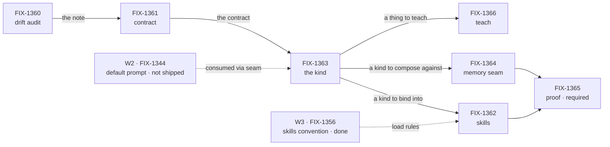

# FIX-1359 · Plan

An epic plan sequences the work and says what each piece entails. It does not say how to build any piece; that's each issue's own plan. IDs cross-reference [DECISIONS.md](DECISIONS.md) (D-n) and [BUSINESS-RULES.md](BUSINESS-RULES.md) (ER-n).

## The path

A chain, not a fan-out. Only the first two issues could start at the gate. The one real parallel window is skills beside memory once the kind exists, and that's where the set is now. Required does not move the proof earlier: it waits on both.

## What each issue entails

| Issue | Route | Consumes | Delivers | Releases | Size |
|---|---|---|---|---|---|
| **FIX-1360** drift audit | spec → docs PR | `apps/kitchen-sink` chat-agent and skill activator | A dated drift note: what not to copy, the named gaps, what KS still proves, what to re-home | FIX-1361 | Small |
| **FIX-1361** contract | spec → docs PR | The drift note · D2 · D5 | A locked contract for the kind: admission, loud-fail, the built-in id, decision 2's fence, the skills isolation contract | FIX-1363 | Small |
| **FIX-1363** the kind | spec → impl PR | The contract · W2's default prompt through a seam (D3) | The built-in `agent` flow kind: talks, consumes the prompt, no memory wired. The admission and loud-fail paths built | FIX-1362 · FIX-1364 · FIX-1366 | Medium |
| **FIX-1362** per-seat skills | spec → impl PR | The kind · W3's skills convention · the isolation contract | Skills bound per seat with real storage isolation, three activation paths, the merge rule, refresh | FIX-1365 (with 1364) | Medium-large |
| **FIX-1364** memory seam | spec → impl PR | The kind · D4 | The named build-time composition seam, the gap list, how-you-attach teaching | FIX-1365 (with 1362) | Medium |
| **FIX-1366** teach | spec → docs PR | The kind · the contract's vocabulary | The overview leads with the zero-code hire; the reference is complete; the Atlas stops teaching the killed factory | Nothing; it's a leaf | Small |
| **FIX-1365** proof · required | spec → goal check | A roster · the kind · skills · the seam | One real hire of the built-in on the real path, asserted on behaviour | The epic's wrap | Small |

## Where it is · as of 2026-09-16

| Issue | State | Evidence |
|---|---|---|
| FIX-1360 | **Done** | #1739 merged Sep 12 · note at `docs/internal/design/kitchen-sink-agent-drift.md` |
| FIX-1361 | **Done** | #1751 merged Sep 13 · contract at `docs/architecture/workforce-agent-kind.md` |
| FIX-1363 | **Done** | #1754 merged Sep 14 |
| FIX-1362 | Impl in review | spec #1766 approved · impl #1776 open, two bot findings to work |
| FIX-1364 | Impl in review | spec #1768 approved · impl #1782 open |
| FIX-1366 | Spec in review | #1765 open, direction reversed twice in review, now grow-and-promote |
| FIX-1365 | Not started | Blocked by FIX-1362 and FIX-1364 |
| W2 FIX-1344 pt 2 | Not shipped | The kind ships against `instructions` with a seam (D3) |
| W3 FIX-1356 | Done | Load rules consumed by FIX-1362 |

## What unblocks what, from here

1. **FIX-1362 and FIX-1364 merge** → FIX-1365 can start. Nothing else is waiting on them.
2. **FIX-1366's spec is approved** → its docs PR runs beside the proof. It gates nothing.
3. **FIX-1365's goal check passes** → the epic wraps: lessons pass, docs polish, the epic PR closes unmerged.
4. **If W2's default prompt lands during any of this** → the seam in FIX-1363 takes it. No child re-sequences.

## Coordination seams to watch

| Seam | Between | Rule |
|---|---|---|
| Memory teaching | FIX-1364 and FIX-1366 | Both write about memory on the workforce pages. Current behaviour in 1366, how-to in 1364. Whichever lands second links rather than repeats |
| The contract file rename | FIX-1366 and FIX-1362 | 1366 renames it; 1362 edits its C5 in the impl PR. Find it by content, not path |
| The skills entry points | FIX-1362 and FIX-1366 | 1362 pins which one the built-in uses; deprecation is FIX-1390, not this epic |
| The `tools:` fence hole | FIX-1366 and core | Teach the guarantee and name the hole; enforcement is FIX-1393 |

## Not children, deliberately

FIX-1344 (W2 soft dep) · FIX-1356 (W3 convention) · FIX-1355 (W3 lab) · FIX-1367 (thin `WorkerConfig`, W3 hire admission) · FIX-1390 (entry-point deprecation, filed by 1362) · FIX-1393 (fence enforcement, filed by 1366) · FIX-1387 (Atlas voice, filed by 1366). Linked from the rules, never re-parented (ER-10).

## Wrap

When ER-17 holds: run the lessons pass over the set's review rounds, dispatch the docs polish over the workforce pages the children each edited in isolation, refresh this plan's status table one last time, and close the epic PR unmerged.
