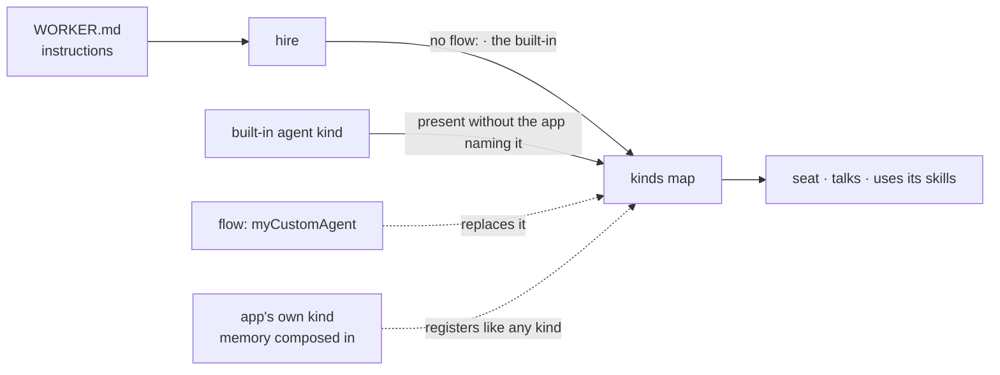

# FIX-1359 · Default Workforce agent flow: a built-in, replaceable `agent` kind

Epic · 7 issues · Workforce, Layer 2 · Goal 1, validate through real usage
[Decisions](DECISIONS.md) · [Rules every issue obeys](BUSINESS-RULES.md) · [Plan](PLAN.md)

## Three teams, before and after

| A team that… | Today | After this epic |
|---|---|---|
| **writes a `WORKER.md` with only instructions** | Hire refuses it: no `flow:`, no seat. They write their own agent flow, or use a factory we're deleting | Hire selects the built-in kind. The seat talks and uses its skills. Zero config lines |
| **wants their own agent shape** | Every kind is theirs anyway | One line, `flow: myCustomAgent`, wins when that kind is registered. A typo fails loudly |
| **wants the agent to remember** | Nothing to attach to | Assembles the shipped memory pieces into a kind of their own. A seam, not a setting. Where durable per-member memory is missing, the gap is named, not faked |
| **reads the docs to learn any of this** | The Atlas teaches the factory we're deleting | One documented way in |

**Why now.** The W2 epic is deleting `defineAgent` / `AgentRegistry` / `materializeAgent`. Removing the old path before a replacement exists leaves the first thing a new team does with Workforce as the thing we just took away.

## What's in the box

Everything inside the box is what a team gets for nothing. The fence is the decision that keeps it cheap: the built-in carries no memory import, and nothing at hire time can add one. Memory is composed in by the app, into a kind of its own, on scopes we already ship ([D4](DECISIONS.md#d4)). The bottom strip is what the set refuses to build.

## The set

| Issue | What it delivers | Why the set needs it |
|---|---|---|
| FIX-1360 | Kitchen-sink drift audit | Cheap reconnaissance the next four cite instead of re-reading the app |
| FIX-1361 | The kind's contract, including admission and loud-fail | A contract artifact before implementation starts |
| FIX-1363 | The built-in `agent` kind | The substance |
| FIX-1362 | Per-seat skills, isolated in storage | A seat that can't use its own skills isn't an agent |
| FIX-1364 | The memory composition seam, and its named gaps | The honest answer to "does it remember" |
| FIX-1366 | Teach the built-in | A kind that ships while the docs teach the killed factory leaves two ways in |
| FIX-1365 | Thin proof: hire the built-in for real · **required** | The only child shaped to move Goal 1. Without it the epic adds surface and proves nothing |

Four are substance, one is recon, one is docs, one is the proof. Whether seven is really six was argued at the gate and is [D6](DECISIONS.md#d6).

## How the pieces reach the seat

## What stays as it is

- `session` / `user` / `org` scopes and the shipped member patterns. Memory attaches to them; no new isolation primitive.
- The W3 fence: no `worker.ts` as a seat door.
- The old factory cluster's deletion runs on its own schedule. Nothing here waits for it, and nothing here extends it.
- Collab, channel rosters, MCP: not this epic.

## Sign off

1. **[D1](DECISIONS.md#d1) · A stock agent seat is worth seven issues, now.** If wrong: a cycle on a kind nobody hires, which FIX-1365 exists to make impossible to miss.
2. **[D2](DECISIONS.md#d2) · Zero config lines: an omitted `flow:` selects the built-in.** If wrong: the headline narrows to the same paper cut the old factory made people pay.
3. **[D4](DECISIONS.md#d4) · Memory is composed in by the app, never switched on in the stock kind.** If wrong: every team carries memory machinery it didn't ask for, or we promise a mechanism that can't exist.

**Open: none.** Every question the set raised is answered in [DECISIONS.md](DECISIONS.md). The rules every child obeys are in [BUSINESS-RULES.md](BUSINESS-RULES.md). The order the work runs in, and what each issue entails, is [PLAN.md](PLAN.md).
