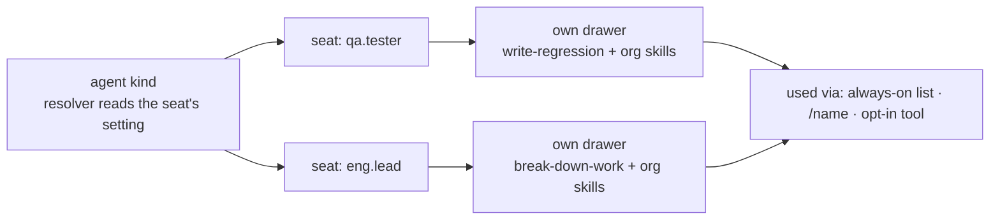

# spec(FIX-1362): per-seat skills in the built-in worker kind

**Two workers on one roster read each other's skills, and nothing fills either one.** Every worker holds every other's instructions out of one org-wide bucket, and a skills folder beside a worker does nothing. The contract already promises *a seat's skills are that seat's*. The built-in kind shipped days ago; this is the next thing a roster reaches for.

**Change:** each seat gets its own drawer, filled from its own folders, used in exactly three ways. No new primitive.

## Sign off on

| # | Decision | Instead of | Locks in |
|---|---|---|---|
| D2 | A skill beside a worker is **reachable**, not always-on. The tool is off until turned on | Colocated = always-on | Drop a folder, nothing changes until `/name` or an edit. Skills never slow a worker |
| D3 | A seat holds a **copy**. Refresh is deliberate and replaces a skill's folder **whole** | Live propagation · file-by-file overwrite | A company typo fix means someone refreshes. A seat's own additions inside a refreshed folder are lost |
| D1 | Skills travel on the worker record, handed over at hire | A `hireWorkforce` option · a runtime lookup | Fixed at roster read. Re-hire to change |

**Open: none.** D2 is the one to think about. It trades the first impression for a promise.

## Reviewers · look here

- **D2** — is "drop a folder, type `/name`" a good enough first experience? Cheap to reverse, but everyone meets it.
- **Plan · the per-seat channel.** Everything hangs on: a block's only per-seat view is its config bag. Wrong layer makes steps 5–9 a rewrite.
- **Plan · the fence.** A seat's *own* skill can now declare `agents:`. New exposure past a fence FIX-1363 closed once. Check where it's closed.
- **Unsure:** D3's all-or-nothing half. It's the honest reading of "the copy matches the source", and it destroys local edits on an action someone may think of as an update.

**Not here:** classifier or keyword tier · trigger phrases · memory (FIX-1364) · teaching (FIX-1366) · deprecating an entry point (FIX-1390, filed).

[Spec](SPEC.md) · [Plan](PLAN.md) · Linear FIX-1362 · Epic FIX-1359 · builds on #1754 · never merges

<b>How to review this</b> — altitude, what's in scope, what's deliberately unsettled

*(the spec-PR contract, pasted verbatim from `spec-template.md`)*

<b>Engineering calls</b> — decided in the plan, no product sign-off needed

- One convergence point for tool registration: the generator's `tools:` mapping. Library catalog registration stays off; the load tool contributes only itself; delegation is closed to the seat's list.
- Three pinned identifiers: `WorkerManifest.skills`, the `seatSkills` setting, the refused `seatSkills:` key.
- Refresh replaces a touched skill's folder whole; `ensureSeeded` stays additive.
- A name from both the app option and a seat's folders is refused at the mint, naming both.
- Slash matches a person's message only.
- The FIX-918 migration reseed is left alone.
- Build-time skill binding under a resolver refuses loudly.
- A collection seeded before this change is orphaned, not migrated (BP-030).

<b>Folded in review round 1</b>

| Thread | Fold |
|---|---|
| Refresh leaves stale files (Greptile) | D3 now replaces the folder whole. `ensureSeeded` stays additive |
| Contract still assigns reconciliation here (Cursor) | Step 9 narrows it in the impl PR. Deprecation filed as FIX-1390 |
| Unnamed symbols (Cursor ×3) | Three names pinned, with the reason |
| The resolver alternative (Cursor) | Kept, with the rejected direct-read and two traps |
| Size (Cursor) | Medium-large. Two-PR seam at step 4 |

