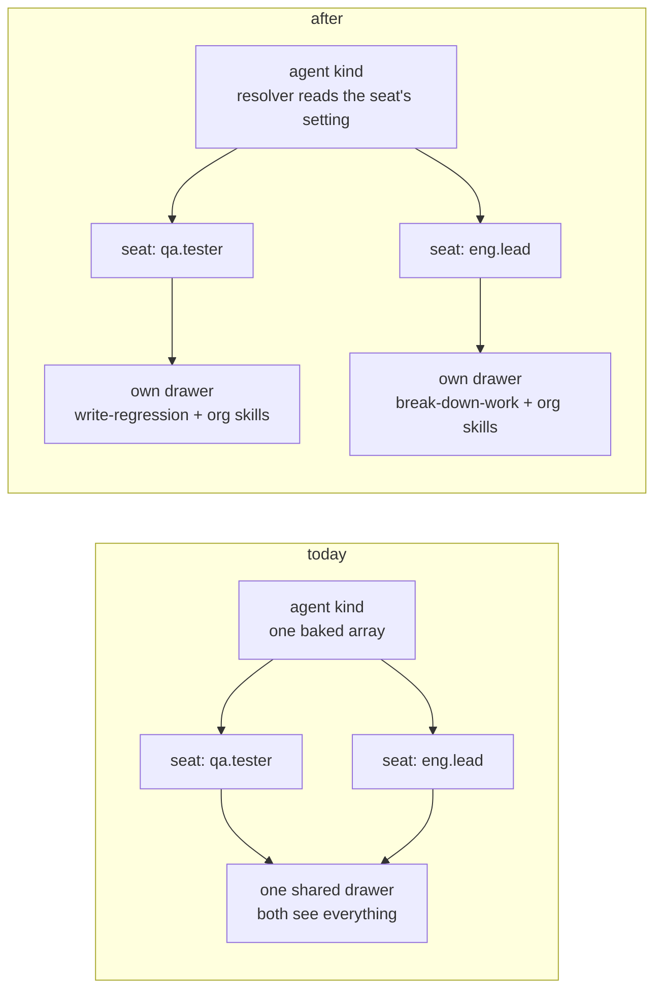

# FIX-1362 · Per-seat skills in the built-in worker kind

| | |
|---|---|
| **Status** | Spec · awaiting sign-off |
| **Type** | Feature · 3 packages + docs · public surface grows |
| **Size** | Medium-large · 9 steps · 1 or 2 PRs · 1 `minor` changeset |
| **Epic** | FIX-1359 · builds on FIX-1363 (#1754) · blocks FIX-1365 |
| **Plan** | [PLAN.md](PLAN.md) |

## Problem

Two workers on one roster, each with a skills folder beside it. Today they read each other's, and nothing fills either one.

| What a person does | What happens today | What the contract promises |
|---|---|---|
| Gives the QA tester a `write-regression` skill folder | Nothing. No seat's catalog is filled from folders at all | A folder beside a worker is that worker's skill |
| Gives two workers different skills | Both read one org-wide bucket. Every worker holds every other's instructions | *A seat's skills are that seat's* |
| Runs a turn that uses no skill | Fine today. Must stay free | Skills never slow a worker down |

**Why now.** The built-in `agent` kind shipped days ago (FIX-1363). Skills are the next thing a roster reaches for, and the contract already promises isolation in writing. It's false until this lands.

## Change

Three moves, one per failure. No new primitive.



| Move | Mechanism | Already exists? |
|---|---|---|
| Each seat gets its own drawer | Turn on `flowIsolation` for the skills collection. Storage already keys an isolated resource per flow instance | Yes. Never asked for |
| Each drawer is filled from that seat's folders | The org ∪ team ∪ worker union the loader computes rides on the worker record → hire imposes it as a setting → the kind's resolver reads it | Union: yes. The ride: new |
| A worker uses skills in exactly three ways | Always-on list in the worker file · a typed `/skill-name` · an opt-in mid-turn tool, off by default | Slash + tool: yes. Always-on + switches: new |

**Why the settings bag.** A block sees `{ config }` and nothing else. It cannot see its own instance id, by design. Config is the only per-seat channel; every other route ends in a cast.

**Not changing:** the classifier tier (opt-in, FIX-1363's) · trigger phrases and the keyword tier (out, not renamed) · memory (FIX-1364) · the teaching surface (FIX-1366) · which of the two skills entry points survives (FIX-1390, filed).

## What using it looks like

```md
---
description: Runs regression passes
tools: [runTests]
skills:
  active: [house-style]     # in every prompt
  activateTool: true        # model may pull one in mid-turn · off by default
---
You write regression tests for reported bugs.
```

`write-regression` sits in `teams/qa/workers/tester/skills/` and is listed nowhere. The tester holds it plus the org's `house-style`. The QA lead never sees it. A worker file with a body and no `skills:` key hires, answers, and pays nothing.

## Requirements

| # | Must hold | Checked by |
|---|---|---|
| R1 | Two seats resolve distinct storage keys **and** distinct catalog contents | CI spec · contents, not keys |
| R2 | A colocated skill is in its seat's catalog with no `skills:` list anywhere | CI spec |
| R3 | An always-on skill is in the prompt every turn; a merely held one is not | CI spec |
| R4 | `/name` activates without clobbering the always-on set | CI spec |
| R5 | Both switches off → no catalog listing, no load tool, no classifier call in the trace | CI spec · trace |
| R6 | A seat with `tools: []` calls nothing, including through a delegated board worker | CI spec |
| R7 | Editing an org skill changes nothing on a seeded seat until refresh; a deleted copy survives both | CI spec |
| R8 | A supporting file dropped upstream is gone after refresh, unreachable via `prompt-ref`; ordinary seeding deletes nothing | CI spec |
| R9 | `hireWorkforce` still refuses an unregistered kind, empty `flow:`, mismatched kind | Existing suite |
| G | Two seats, two skills, `fsdev run` each: the answer reflects its own skill and none of the other's | Goal check, real model |

## Decisions · sign these

| # | Decision | Instead of | What you're locking in |
|---|---|---|---|
| D1 | A seat's skills travel on the worker's own record, handed to the seat at hire like its instructions | An option on `hireWorkforce` (FIX-1363 closed that door) · a runtime lookup by id (a block can't see its id) | Skills are fixed when the roster is read. Changing a seat's set means re-hiring. No hot swap |
| D2 | A skill beside a worker is **reachable**, not always in context. Always-on is an explicit line; the activate tool is off until turned on | Colocated = always-on. Friendlier first impression, charges every turn for every skill | Drop a folder, nothing visible changes until someone types `/name` or edits the file. We trade "why isn't it working" for "skills never slow a worker" |
| D3 | A seat holds a **copy**. Company edits don't reach it. A refresh is deliberate and replaces that skill's folder **whole** | Live propagation (makes the drawer a view again) · file-by-file overwrite (leaves withdrawn instructions reachable) | Fixing a typo in a company skill means someone refreshes the seats. Refresh is all-or-nothing per skill: a seat's own additions inside that folder don't survive it |

**Decided, not asked.** Slash matches a person's message only, never model-emitted text: an activation path the model drives is an injection surface. The activate tool ships in v1, off by default: building the switch later would mean shipping it always-on first.

**Open: none.** Hardest to ratify is D2. It optimises for a promise over the thing people try first. Cheap to reverse, but it's the shape everyone meets.

## How this spec got here

| Round | What moved |
|---|---|
| Draft | Two separable failures. Handoff via the worker record + settings bag. Three activation paths, tool off by default. Reconciliation of the two entry points deferred |
| Review | D3 gained *replace the folder whole*: seeding only overwrites files still in the source, so a withdrawn supporting file stayed live on every seat. The deferred reconciliation became FIX-1390 plus a contract-narrowing step, because the contract still assigned it here |
