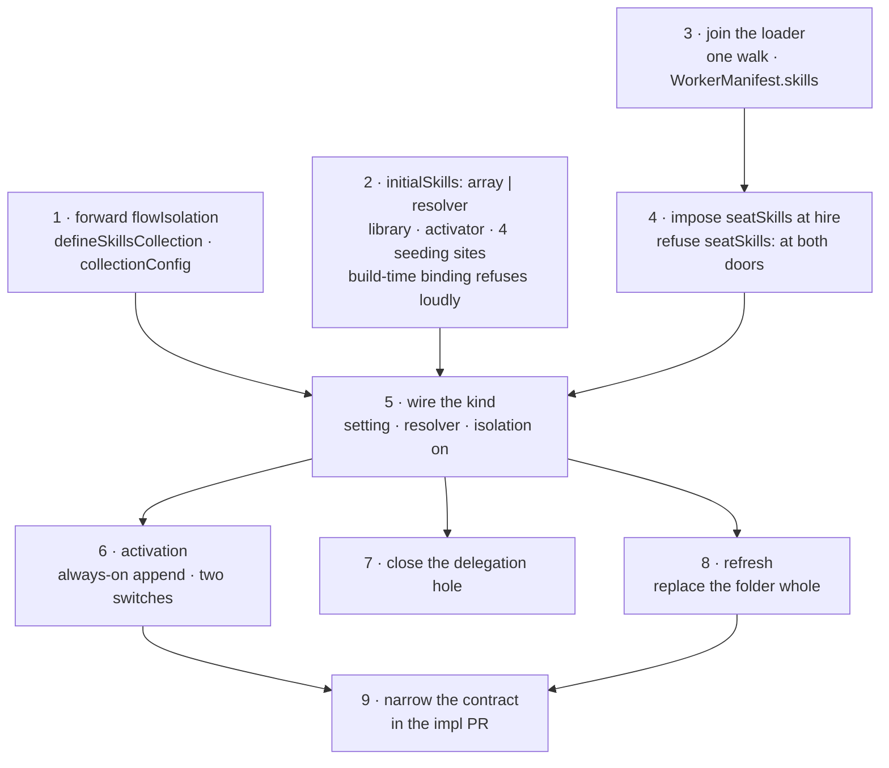
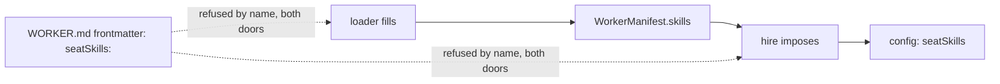
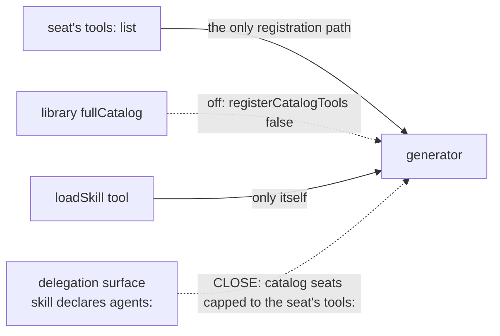
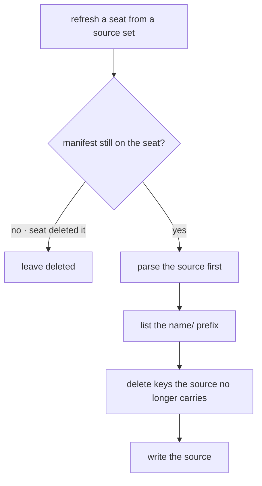

# FIX-1362 · Plan

Executes [SPEC.md](SPEC.md). `tdd`. Seams: `packages/workforce/test/` and `packages/orchestration/src/skills/`.

## The sequence

| Step | Passes when |
|---|---|
| 1 | Two instances of one flow → distinct keys. Session scope still refuses |
| 2 | Different configs → different catalogs. `with({ active })` under a resolver throws, naming why |
| 3 | Two seats on two teams → disjoint sets. Colocated needs no list. Errors collect, not throw |
| 4 | Hand-built record works. `seatSkills:` refused by name at each door. `HireOptions` gains nothing |
| 5 | Two seats, different skills, each reads only its own. **Contents**, not keys |
| 6 | Defaults render. Slash adds without clobbering. Both off → no listing, no tool, no classifier call in the trace |
| 7 | `tools: []` + own skill with `agents:` → no app tool reachable |
| 8 | Org edit → no change until refresh. Deleted copy survives. Withdrawn file gone and `prompt-ref` fails. Ordinary seeding deletes nothing |
| 9 | C5 + Known-gaps say *pins the choice, draws the docs boundary*; FIX-1390 owns deprecation. "No mechanism yet" line and `dynamicActivation: true` gone |

**Two-PR seam:** 1–4 the substrate, 5–9 the kind. One PR if reviewable.

## Three pinned names

`seatSkills`, not `skills`: the bag already has an author-written `skills` object. Everything else is the implementer's to name.

## The fence

New exposure: a seat's *own* skill can declare `agents:`. A seat with `tools: []` must not reach app tools through a board worker.

## Refresh

`ensureSeeded` stays additive: a file the source never had is the seat's edit. The FIX-918 migration reseed stays: schema mismatch only, never a body edit.

## Traps

| Trap | Rule |
|---|---|
| Resolver runs on every render of every binding | O(1) read of `ctx.flow.config.seatSkills`. No I/O |
| `ensureSeeded` memoizes on the collection ref | One ref per request across reader, load tool, seed step. Empty array → no storage read |
| App-level `skills` option still exists | Seat holds the union. Same bare name from both → refused at the mint naming both |
| Activate tool listing is a per-turn token cost | Behind the switch, default off. Empty catalog → no listing, no tool slot |
| Seeding sites reading config directly | No. They're in `orchestration`, which must not learn what a seat is. Hire is sync, before storage. Can't express the union |

## Edge cases

| Case | Expected |
|---|---|
| No skills at any level | Hires. No storage read, no seeding, no context |
| `skills.active` names an unheld skill | Refused at the mint, by name, listing what it holds |
| Same bare name on two teams | Fine. Different seats, different keys |
| Collection seeded before this change | Read moves to a new key. Old rows orphaned. No migration. Say so in the PR |
| Slash emitted by the model | Not a match. `message` input only |
| Seat added a file in a skill folder, then refresh | Lost. D3 |

Everything that refuses is a startup misconfiguration: fatal, collected, one run names every bad worker.

## Docs

| Surface | Change |
|---|---|
| `workforce/workers-on-disk.md` | EXTEND: a worker's skills, after settings, before channels. Say "keeps its own copy", not "isolation" |
| `skills/activation.md` | EXTEND, minimum: two ways → three. FIX-1366 owns the rest |
| `packages/workforce/README.md` | EXTEND: joined loader, skills settings |
| Changeset | One `minor` for `workforce` + `orchestration` |

## Follow-ups

FIX-1390 filed · per-seat cost unmeasured, a measurement issue · `scope` vs `flowIsolation` can contradict, flag on a third caller.
