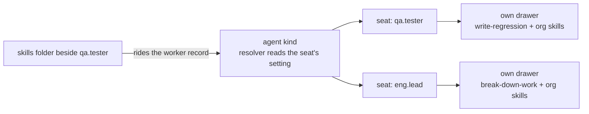
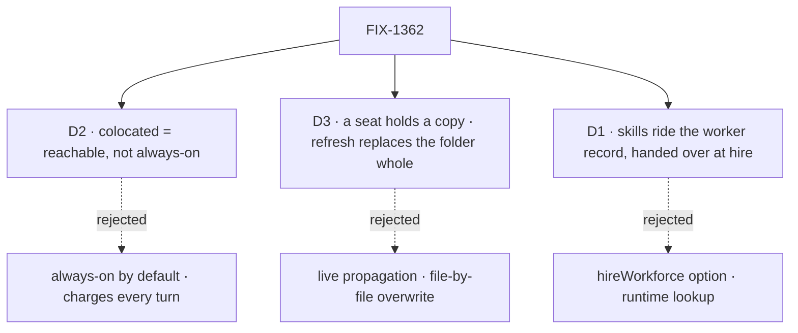

# spec(FIX-1362): per-seat skills in the built-in worker kind

**Two workers on one roster read each other's skills, and nothing fills either.** The contract promises *a seat's skills are that seat's*. It's false until this lands, and the built-in kind shipped days ago.

## After

Own drawer, filled from own folders, used three ways: always-on list · `/name` · opt-in tool. A turn that uses no skill costs nothing.

## Sign off on

- **D2 locks in:** drop a folder, nothing changes until `/name` or an edit.
- **D3 locks in:** a typo fix means a refresh; a seat's own additions in that folder are lost.
- **D1 locks in:** fixed at roster read. Re-hire to change.

**Open: none.** D2 is the one to weigh.

## Reviewers · look here

- **D2** — is "drop a folder, type `/name`" a good enough first experience?
- **Spec §3** — the settings bag as the only per-seat channel. Wrong layer = rewrite.
- **Plan · the fence** — a seat's own skill can now declare `agents:`. Check where it's closed.
- **Unsure:** D3's all-or-nothing half destroys local edits on an "update".

**Not here:** classifier · keyword tier · trigger phrases · FIX-1364 · FIX-1366 · FIX-1390 (filed).

[Spec](SPEC.md) · [Plan](PLAN.md) · Linear FIX-1362 · Epic FIX-1359 · builds on #1754 · never merges

<b>How to review this</b> — altitude, what's in scope, what's deliberately unsettled

*(the spec-PR contract, pasted verbatim from `spec-template.md`)*

