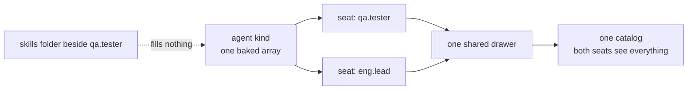
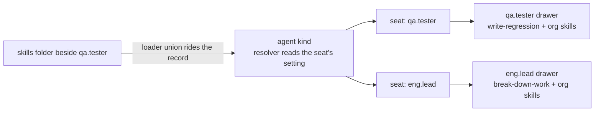
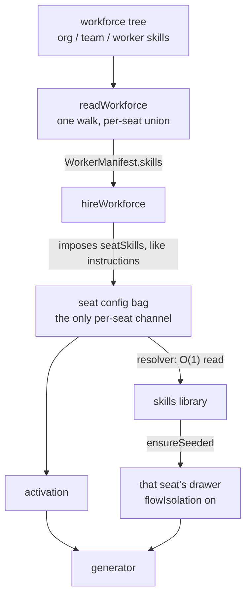
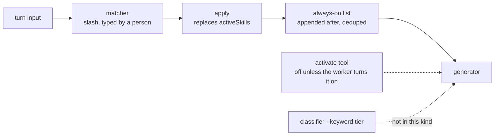
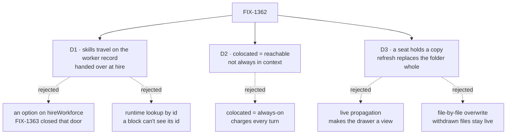
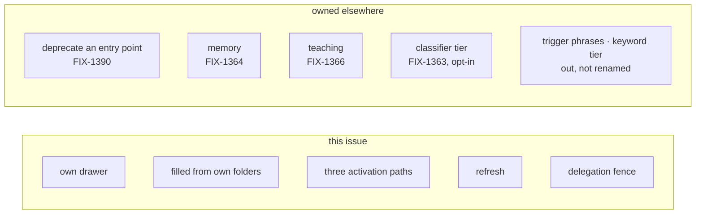
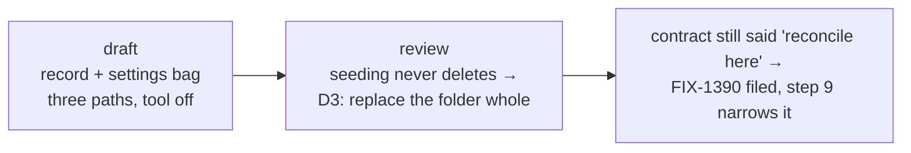

# FIX-1362 · Per-seat skills in the built-in worker kind

Feature · 3 packages + docs · medium-large · 1 or 2 PRs · epic FIX-1359 · [plan](PLAN.md)

## 1. Today



Every seat reads the same bucket. A skills folder beside one worker reaches all of them, or, since nothing fills a seat today, none. The contract already promises *a seat's skills are that seat's*.

## 2. After



Each seat gets its own drawer, filled from its own folders. Storage keys on the seat. No new primitive: isolation and the union both exist, they were never connected.

## 3. How a per-seat set reaches code built once for the kind



A block sees `{ config }` and nothing else. It cannot see its instance id, by design. So the set rides the record, is imposed at hire, and is read from config. Every other route ends in a cast.

## 4. How a turn picks a skill



Three stock paths. A turn that uses no skill makes no extra model call and spends no extra tokens. The always-on set is appended *after* the matcher because apply replaces the active set by design.

## 5. Where the decisions fell



| | Locks in |
|---|---|
| D1 | Skills are fixed when the roster is read. Re-hire to change. No hot swap |
| D2 | Drop a folder, nothing visible changes until `/name` or an edit. Skills never slow a worker |
| D3 | A company typo fix means someone refreshes the seats. A seat's own additions inside a refreshed folder are lost |

**Decided, not asked:** slash from a person's message only (model-emitted text is an injection surface) · activate tool in v1, off by default.

## 6. What using it looks like

```md
---
description: Runs regression passes
tools: [runTests]
skills:
  active: [house-style]     # every prompt
  activateTool: true        # off by default
---
```

`write-regression` sits beside the tester and is listed nowhere. The tester holds it plus `house-style`. The QA lead never sees it. A body with no `skills:` key hires and pays nothing.

## 7. Must hold

- [ ] Two seats: distinct keys **and** distinct catalog contents
- [ ] A colocated skill needs no list
- [ ] Always-on is in every prompt; merely held is not
- [ ] `/name` adds without clobbering always-on
- [ ] Both switches off → no listing, no load tool, no classifier call
- [ ] `tools: []` calls nothing, including through a delegated board worker
- [ ] Org edit reaches no seeded seat until refresh; deleted copies stay deleted
- [ ] Refresh removes a withdrawn supporting file; ordinary seeding deletes nothing
- [ ] **Goal:** two seats, two skills, `fsdev run` each, the answer shows its own and none of the other's

## 8. Boundary



## 9. How it got here


