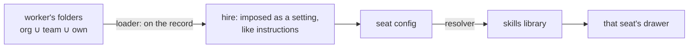

# FIX-1362 · Per-seat skills in the built-in worker kind

Feature · 3 packages + docs · medium-large · 1 or 2 PRs · epic FIX-1359 · [plan](PLAN.md)

## Three people, before and after

| Someone who… | Today | After |
|---|---|---|
| **drops a `write-regression` folder beside the QA tester** | Nothing happens. No seat is filled from folders | The tester holds it. Nobody else does. Typing `/write-regression` uses it. Nothing else changes until they ask for more |
| **gives two workers on one roster different skills** | Both read one org-wide bucket. Every worker holds every other's instructions | Each has its own drawer. The eng lead never sees the tester's skill |
| **wants a skill in every one of a worker's prompts** | No way to say so | One line in the worker file: `skills.active: [house-style]` |
| **wants the model to pull a skill in mid-turn** | Always on, for everyone, with a per-turn catalog listing | `skills.activateTool: true`, per worker, off by default |
| **fixes a typo in a company skill** | Every worker sees it (they all read the same bucket) | Workers already holding it keep their copy until someone refreshes them |
| **runs a turn that uses no skill** | No extra cost | Still no extra cost. No extra model call, no extra tokens |

## The worker file, as a diff

```diff
  ---
  description: Runs regression passes
  tools: [runTests]
+ skills:
+   active: [house-style]     # in every prompt
+   activateTool: true        # let the model pull one in mid-turn · off by default
  ---
  You write regression tests for reported bugs.

  teams/qa/workers/tester/
    WORKER.md
+   skills/write-regression/  # held by the tester, listed nowhere, reached by /write-regression
```

A body with no `skills:` key hires, answers, and pays nothing for the skills it holds.

## How a seat's own set reaches code built once for the kind



A block can see its config and nothing else, not even which instance it is. So the skill set rides the record and arrives as a setting. Every other route ends in a cast.

## Why not…

**…an option on `hireWorkforce`?** FIX-1363 closed that door. Two doors onto one setting is how "absent means default" and "wrong means error" drift apart. **Cost of the chosen route:** skills are fixed when the roster is read. Re-hire to change them.

**…make a colocated skill always-on? It's friendlier.** It charges every turn for every skill in the folder. The promise is that skills never slow a worker down. **Cost:** someone drops a folder, sees nothing change, and wonders. They type `/name` or add one line. Cheap to reverse, but everyone meets it.

**…let company edits flow to every worker?** That makes the drawer a view again and undoes isolation. **Cost:** a typo fix means someone refreshes the seats. An operational step, not a background job.

**…refresh file by file instead of replacing the folder?** It reads safer. It leaves a supporting file the company withdrew live on every seat that had it, reachable through `prompt-ref`. Review caught this: today's seeding never enumerates what's already there. **Cost:** refresh is all-or-nothing per skill. A file the worker added inside that folder is gone. Ordinary seeding never deletes anything.

**…one shared drawer, filtered on read?** A handful of lines. The promise is about storage, not display. A filter is a convention a later reader steps around, a seat's edit still writes into everyone's bucket, and no test tells it from the bug.

**…let the seeding code read the seat's setting directly?** Those call sites live in orchestration, which must not learn what a seat is. And hire runs before any storage exists.

**…a classifier or keyword tier?** Not in this kind. The classifier stays FIX-1363's opt-in. The keyword tier is out, not renamed.

## What stays as it is

- The two skills entry points. Deprecating one is FIX-1390, filed. This issue pins which the built-in uses.
- Memory (FIX-1364). The teaching surface (FIX-1366).
- Every refusal `hireWorkforce` already makes.
- The migration reseed from FIX-918: it fires on a schema mismatch, never on a body edit.

## Sign off

1. **Skills travel on the worker record, handed over at hire.** If wrong: we've built on the wrong layer and the kind's wiring is a rewrite.
2. **A skill beside a worker is reachable, not always-on.** If wrong: the first thing people try looks broken, for a promise they may not have needed.
3. **A seat holds a copy. Refresh is deliberate and replaces the folder whole.** If wrong: either withdrawn instructions stay live, or a refresh destroys edits someone thought would survive.

**Decided, not asked:** slash from a person's message only, never model text (injection). Activate tool in v1, off by default.

**Open: none.** Number 2 is the one to weigh.

## How this spec changed its mind

Drafted as two failures with the handoff through the record and the settings bag. Review found seeding only overwrites files still in the source, so a withdrawn file would outlive its withdrawal; refresh now replaces the folder whole. The contract still assigned entry-point reconciliation here, so FIX-1390 was filed and the plan narrows the contract.
