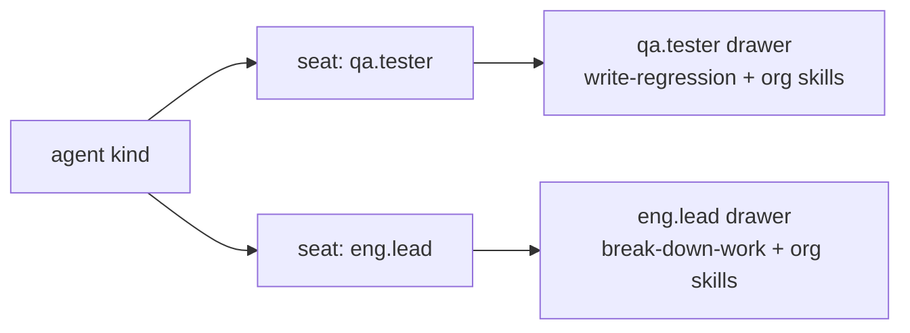
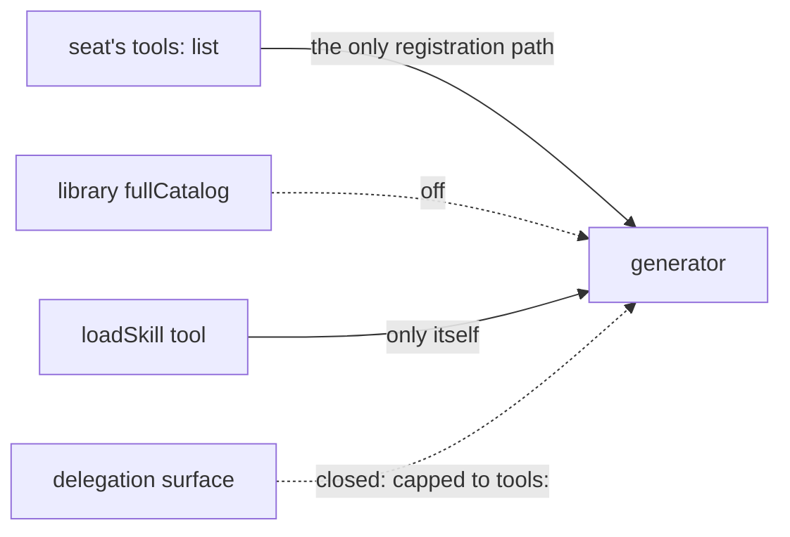
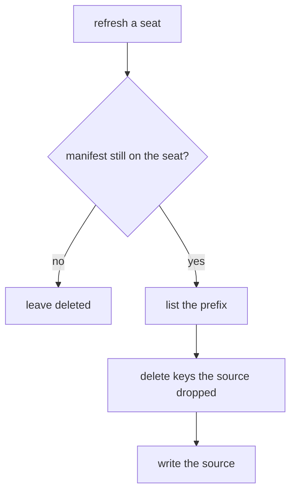
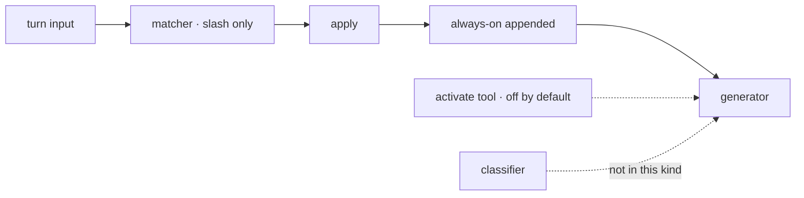
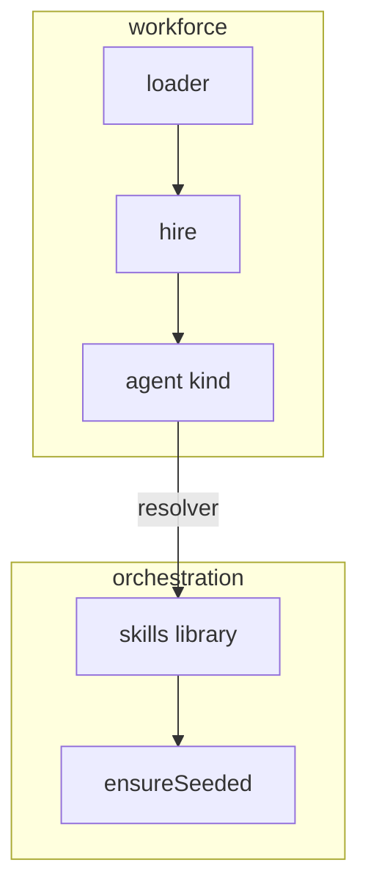

# POC · hand-authored SVG where mermaid can't carry the meaning

Mermaid is a graph language. You hand it nodes and edges and it picks the layout. That's right for a dependency shape or a before/after of a pipeline, and wrong whenever **where a thing sits is part of what you're saying**. This POC takes five concepts from FIX-1362 that the mermaid rewrites flattened, and draws each as a self-contained SVG. Each section shows what position carries, the mermaid version beside it, and what the mermaid version loses.

Every figure: hand-written, under 100 lines, grouped by `<g id>`, both themes from one file via `prefers-color-scheme`, system fonts only, `role="img"` with an `aria-label` that says what the picture says. Rendered in headless Chromium in both themes before commit.

## 1. Two drawers · containment

**Position carries:** which *level* a skill came from (org, team, own) is its vertical band. Two drawers side by side with identical band structure diff by eye. The same skill in both drawers is two separate copies, which is D3.


<details>
<summary>The mermaid version, and what it loses</summary>



The drawers are labels on nodes. Nothing shows that `house-style` came from the org level and `write-regression` from the worker's own folder, nothing shows the two `house-style` entries are separate copies, and nested subgraphs would let mermaid re-stack the two drawers however it likes. The level structure is the point, and it's prose in the label.

</details>

## 2. The fence · a boundary that paths cross or stop at

**Position carries:** left of the line is what the seat can reach, right is the app's catalog, and each path's relationship to the line is its story. One passes through the only gate. One stops. One used to cross and is now stopped, drawn as both.


<details>
<summary>The mermaid version, and what it loses</summary>



Four arrows into one node with adjectives on them. There's no fence to be on either side of, so "stopped at" and "passes through" are the same arrow with a different label, and the before/after of the delegation path needs two diagrams or a sentence.

</details>

## 3. Refresh · a grid of files over time

**Position carries:** row is a file, column is a moment, and the cell's colour is that file's state then. D3's two rules are the last two columns read top to bottom: ordinary seeding changes nothing, refresh replaces the folder whole. The seat's own file surviving one and dying in the other is the row that decides whether you sign D3.


<details>
<summary>The mermaid version, and what it loses</summary>



That's the algorithm, and it's a fine diagram of the algorithm. It says nothing about what a specific file experiences across time, which is the thing a product owner is being asked to accept. Mermaid has no grid, and its `timeline` type can't overlay per-row state.

</details>

## 4. What one turn costs · height on a shared baseline

**Position carries:** height is tokens. Four stacks on one baseline, so the eye reads the cost of each activation path as a difference in height, and the rejected classifier is the only stack that adds a second model call. D2 is the gap between the first stack and the fourth.


<details>
<summary>The mermaid version, and what it loses</summary>



That's the pipeline, and B's spec uses it. It shows *order*, not *cost*. Nothing in it is bigger or smaller, so "a turn that uses no skill costs nothing extra" is a caption, not a picture.

</details>

## 5. The package boundary · a socket on a line

**Position carries:** above the line knows what a seat is, below it doesn't. The resolver is one box straddling the line. The rejected alternative is an arrow pointing the wrong way across it. Cursor pushed on this design point during review; this is the picture that would have answered in one look.


<details>
<summary>The mermaid version, and what it loses</summary>



Subgraphs render as boxes, but mermaid decides which one is on top, and "above means depends on" is not something it will preserve. There's no line to put a socket on, and the rejected shape can't be drawn as *direction across the line* because there's no line.

</details>

## What this settles

- **Five concepts in one code spec needed layout.** Containment, a boundary, a grid, height, and layering. None is exotic. The explainer skill's escape hatch is written as "rare"; on a spec like FIX-1362 it's one panel in three.
- **The cost is real.** Each figure took two render passes to fix text overflow, and there's no tool to catch it; the fix loop is render, look, edit. Mermaid never overflows. Budget one figure per spec by default, two when the plan has an invariant to draw.
- **It renders in blob view with no build.** `` from a markdown file, one file per figure, both themes inside it.

## Verification

Run from this folder. All five must pass every line.

```bash
for f in figures/*.svg; do
  grep -nE '<(script|image|foreignObject)|href=|url\(http|@import' "$f"   # self-contained: prints nothing
  grep -c 'prefers-color-scheme' "$f"                                  # both themes: 1
  grep -c 'aria-label' "$f"                                            # accessible: 1
  wc -l < "$f"                                                         # reviewable: under 100
done
```

Rendered with `/opt/pw-browsers/chromium-1194/chrome-linux/chrome --headless=new --screenshot` in light and dark (dark by rewriting the media query to `@media all`), then read by eye for overflow. Two passes: five overflows found and fixed in pass one, three in pass two, none in pass three.
