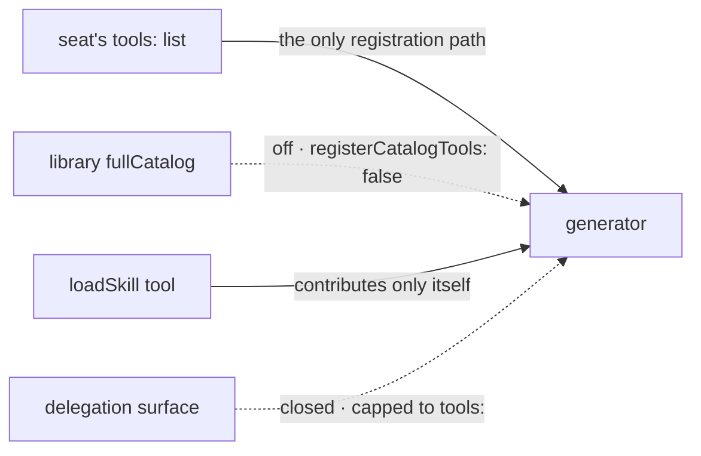

# FIX-1362 · Business rules

The cases, written as rules. Each says what a person or the system does and what happens. The *proved by* column is the check the plan runs. A human reviews this page; the plan turns it into work.

## Holding skills

| # | When | Then | Proved by |
|---|---|---|---|
| BR-1 | Two seats on one roster have different skill folders | Each holds its own set and none of the other's. Distinct storage **and** distinct catalog contents | CI · goal check on a real model |
| BR-2 | A skill folder sits beside a worker and is listed nowhere | It's in that seat's catalog | CI |
| BR-3 | A worker has skills at no level | It hires. No storage read, no seeding pass, no skill context | CI |
| BR-4 | The same bare name reaches a seat from two levels, or from the app's `skills` option and its folders | Refused at hire, both sources named. No precedence rule | CI |
| BR-5 | The same bare name is used on two different teams | Fine. Different seats, different keys | CI |
| BR-6 | A collection was seeded before this change | The read moves to a new key; the seat re-seeds from its own set. Old rows are orphaned, not lost. No migration | Stated in the PR |

## Using skills

| # | When | Then | Proved by |
|---|---|---|---|
| BR-7 | A worker lists a skill under `skills.active` | It is in the prompt on every turn | CI |
| BR-8 | A worker holds a skill and doesn't list it | It is not in the prompt until `/name` or the activate tool | CI |
| BR-9 | A person types `/name` | That skill is active for the turn. The always-on set stays | CI |
| BR-10 | The model emits a `/name` token in its own text | Not a match. Only the person's message is read | CI |
| BR-11 | `skills.activateTool` is off (the default) | No catalog listing in context, no load tool on the generator, no extra model call | CI · trace |
| BR-12 | `skills.activateTool` is on and the catalog is empty | No listing, no tool slot | CI |
| BR-13 | `skills.active` names a skill the seat doesn't hold | Fatal, by name, listing what the seat holds, before the seat answers a turn | CI |

Where BR-13 fires is the implementer's call. The original spec said "at the mint"; the implementation found the check spans two settings and can't sit on a closed config schema, so it fires on the seat's first turn. The rule is the same either way.

## The fence

| # | When | Then | Proved by |
|---|---|---|---|
| BR-14 | A worker names tools in `tools:` | The seat can call exactly those catalog keys. An empty list means none | CI |
| BR-15 | A seat's own skill declares `agents:` and the seat has `tools: []` | Board workers delegated to get no catalog seats beyond the seat's own list. The fence is the seat's, not the skill's | CI |

Left of the line is what the seat can reach. Three paths approach it: one passes through the only gate, one is stopped, and one used to cross and is now stopped, which is BR-15. The mermaid companion below is the same three paths as a list, for the reader who wants names rather than positions.

## Refresh

| # | When | Then | Proved by |
|---|---|---|---|
| BR-16 | The company edits a skill a seat already holds | The seat's copy is unchanged until someone refreshes it | CI |
| BR-17 | An ordinary seeding pass runs | It never deletes anything from a seat's folder | CI |
| BR-18 | A refresh runs and the seat still holds the skill | The folder is replaced whole: the new version lands, files the source withdrew are deleted, files the seat added inside that folder are lost | CI |
| BR-19 | A refresh runs and the seat deleted the skill | It stays deleted | CI |
| BR-20 | A withdrawn supporting file was referenced by `prompt-ref` | After refresh the reference no longer resolves | CI |

BR-16 to BR-20 are the columns of this grid read top to bottom. The bottom-right cell is BR-18's third clause.

## Authoring

| # | When | Then | Proved by |
|---|---|---|---|
| BR-21 | A `WORKER.md` declares `seatSkills:` in frontmatter | Refused by name at the loader and again at hire. It is imposed, never authored | CI |
| BR-22 | A record is hand-built in code with no skills field | It works. The field is optional | CI |
| BR-23 | `hireWorkforce` meets an unregistered kind, an empty `flow:`, or a mismatched kind | Refused exactly as today | Existing suite |

## Failure taxonomy

Every refusal above is a startup misconfiguration: fatal, collected, one run names every bad worker. Nothing here retries and nothing hires partially.

## Acceptance criteria this issue owns

From the locked contract: **criterion 5** (two seats, different skills, each reads and uses only its own, asserted on catalog *contents*) and **criterion 6** (refresh semantics as BR-16 to BR-20).
