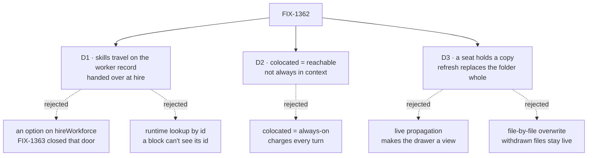

# FIX-1362 · Decisions

What was considered, what was chosen, why, and what each choice locks in. Three decisions are the sign-off surface. Everything else here is context for them.

## The tree

Solid edges are what you're signing. Dashed edges lost, and the label says why.

## D1 · A seat's skills travel on the worker's own record, handed to the seat at hire like its instructions

| | |
|---|---|
| **Instead of** | An option on `hireWorkforce` · a runtime lookup by seat id · the seeding code reading the seat's setting directly |
| **Because** | FIX-1363 closed the hire-option door: two doors onto one setting drift. A running block cannot see its instance id, by design. And the seeding code lives in a package that must not learn what a seat is |
| **Locks in** | Skills are fixed when the roster is read. Changing a seat's set means re-hiring. No hot swap |

Above the line knows what a seat is. Below it doesn't. The resolver is the one socket on the boundary: workforce plugs in a function that reads the seat's setting, and orchestration calls it without ever seeing the key. The dashed arrow is the alternative a reviewer pushed for and it points the wrong way across the line.

## D2 · A skill beside a worker is reachable, not always in context

| | |
|---|---|
| **Instead of** | Colocated = always-on, automatically |
| **Because** | The friendlier version charges every turn for every skill in the folder. The promise is that skills never slow a worker down |
| **Locks in** | Drop a folder, nothing visible changes until someone types `/name` or edits the file. We trade a moment of "why isn't it working" for the promise |

The picture is the cost stacks in [SPEC.md → What a turn costs](SPEC.md#what-a-turn-costs). This is the decision to weigh: it optimises for a promise over the thing people try first. Cheap to reverse, but everyone meets it.

## D3 · A seat holds a copy. Company edits don't reach it. A refresh is deliberate and replaces that skill's folder whole

| | |
|---|---|
| **Instead of** | Live propagation · refresh as a file-by-file overwrite |
| **Because** | Propagation makes the drawer a view again and undoes D1. Overwrite reads safer and leaves a withdrawn supporting file live and reachable through `prompt-ref`. Review caught that today's seeding never enumerates what's already there |
| **Locks in** | Fixing a typo in a company skill means someone refreshes the seats: an operational step, not a background job. Refresh is all-or-nothing per skill: a seat's own additions inside that folder don't survive it |

Read the last two columns top to bottom. An ordinary seeding pass changes nothing. A refresh brings the new version, deletes what the company withdrew, and loses what the seat added inside that folder. The bottom-right cell is the half of this decision that's new since review, and the one I'm least sure about.

## Decided, not asked

- **Slash matches a person's message only**, never model-emitted text. An activation path the model drives is an injection surface. The activate tool is the sanctioned model-driven route.
- **Activate tool ships in v1, off by default.** Adding the switch later would mean shipping it always-on first, which D2 refuses.

## Considered and dropped

| Alternative | Why not |
|---|---|
| One shared drawer, filtered on read | The promise is about storage, not display. A filter is a convention a later reader steps around, a seat's edit still writes into everyone's bucket, and no test tells it from the bug |
| A classifier or keyword tier in this kind | The classifier stays FIX-1363's opt-in. The keyword tier is out, not renamed |
| Deprecate one of the two skills entry points here | Its own change with its own migration. Filed as FIX-1390. The contract still assigned it here, so the plan narrows the contract |

## How it got here

- **Draft** — two separable failures; handoff via record + settings bag; three activation paths, tool off; reconciliation deferred.
- **Review** — D3 gained *replace the folder whole*: seeding overwrites only files still in the source, so a withdrawn file stayed live on every seat. Reconciliation became FIX-1390 plus a contract-narrowing step, because two authorities is worse than either.

**Open: none.**
