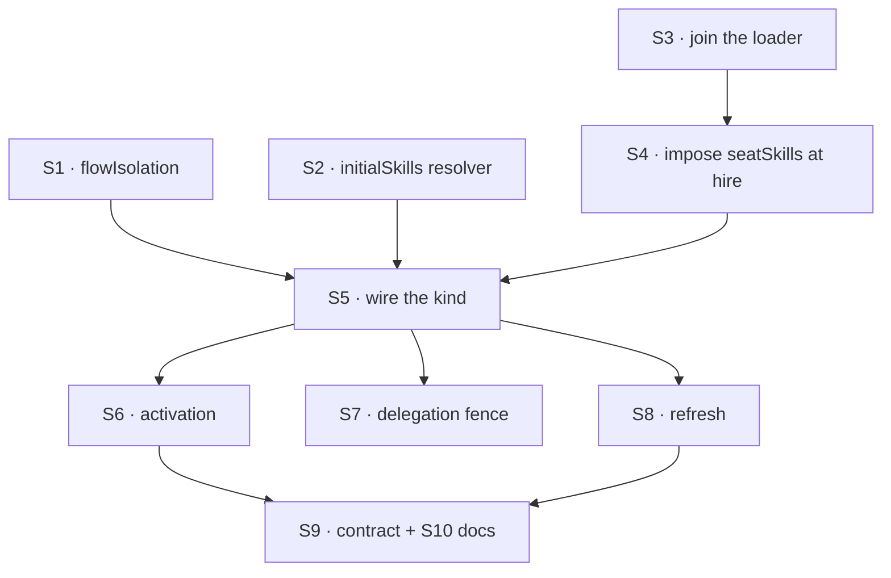

# FIX-1362 · Plan

Written for the implementing agent. IDs cross-reference [BUSINESS-RULES.md](BUSINESS-RULES.md) (BR-n) and [DECISIONS.md](DECISIONS.md) (D-n). No figures here on purpose: the pictures are for the human readers of the spec, the decisions and the rules; this file is tables and one DAG. `tdd`. One PR, or two at the seam after S4.

## Surfaces

| ID | Package · file | Change | Rules |
|---|---|---|---|
| S1 | `orchestration` · `defineSkillsCollection`, `SkillsLibraryOptions.collectionConfig` | Forward `flowIsolation` | BR-1 |
| S2 | `orchestration` · `createSkillsLibrary`, `createSkillActivator`, 4 seeding sites (`binding-reader`, both in `load-tool`, `seed-step`) | `initialSkills: array \| (ctx) => array`. Each site resolves before `ensureSeeded`; its signature stays. Build-time `with({ active })` / `with({ allowed })` under a resolver refuses loudly, naming why | BR-1 |
| S3 | `workforce` · loader | One new entry point: walk once, return records carrying their union. Reuse `readSeatSkills` + `readWorkforceDirectory`. Add `WorkerManifest.skills` | BR-2 BR-4 BR-21 |
| S4 | `workforce` · `hire.ts` | Impose `seatSkills` like the body becomes `instructions`. Refuse `seatSkills:` frontmatter by name: one constant, both doors | BR-21 BR-22 BR-23 |
| S5 | `workforce` · `agent-worker-flow.ts` | Declare the setting. Pass the resolver to library and activator. `flowIsolation` on. Union with the app-level `skills` option; duplicate bare name refused naming both | BR-1 BR-3 BR-4 BR-5 |
| S6 | `workforce` · `agent-worker-flow.ts` | Always-on append **after** the matcher's apply step, deduped. Per-seat switches `skills.active`, `skills.activateTool`. Both activators slash-only. Empty catalog → no listing, no tool | BR-7 to BR-13 |
| S7 | `orchestration` · delegation surface | Cap board workers' catalog seats to the seat's `tools:` | BR-14 BR-15 |
| S8 | `orchestration` · refresh | Exported refresh: touch only names whose manifest exists; replace that folder whole (`list` prefix → `delete` dropped keys → write). `ensureSeeded` stays additive | BR-16 to BR-20 |
| S9 | `docs/architecture/workforce-agent-kind.md` (being renamed by FIX-1366; find by content) · in the **impl PR** | C5 + Known-gaps: FIX-1362 pins the choice, FIX-1390 owns deprecation. Drop the "no mechanism yet" refresh line, the seeding gap, the unconditional `dynamicActivation: true` | — |
| S10 | Docs | `workers-on-disk.md` EXTEND (a worker's skills; say "keeps its own copy", never "isolation") · `skills/activation.md` EXTEND minimum (two ways → three; FIX-1366 owns the rest) · workforce README · one `minor` changeset for both packages | — |

## Sequence

**Seam:** S1–S4 are the substrate and ship alone. S5–S10 are the kind.

## Checks

| ID | Runs after | Passes when |
|---|---|---|
| V1 | S1 | Two instances of one flow → distinct keys. Session scope still refuses |
| V2 | S2 | Different configs → different catalogs. `with({ active })` under a resolver throws, naming why |
| V3 | S3 | Two seats on two teams → disjoint. Colocated needs no list. Loader errors collect, not throw |
| V4 | S4 | Hand-built record works. `seatSkills:` refused by name at each door. `HireOptions` unchanged. Existing refusals unchanged |
| V5 | S5 | BR-1 on catalog **contents**, never keys. BR-3, BR-4, BR-5 |
| VG | S5 | Goal, real model: two seats, two skills, `fsdev run` each. Own skill visible, other's absent |
| V6 | S6 | BR-7 to BR-13. BR-11 asserted on the trace: no classifier call |
| V7 | S7 | BR-15: `tools: []` + own skill with `agents:` → no app tool reachable |
| V8 | S8 | BR-16 to BR-20. BR-17 has its own test: an ordinary pass deletes nothing |
| V9 | S9 S10 | By eye. Docs build |

## Pinned names · the only three

| Where | Name | Why pinned |
|---|---|---|
| `WorkerManifest` | `skills` | Loader fills it. Absent on a hand-built record |
| Settings bag | `seatSkills` | Imposed. Not `skills`: an author-written `skills` object already exists there |
| Frontmatter | `seatSkills:` | Refused by name at both doors. Two doors refusing two spellings is the failure |

Everything else is yours to name.

## Guardrails

| Rule | Because |
|---|---|
| The resolver is an O(1) read of `ctx.flow.config.seatSkills`. No walking, parsing, I/O | It runs on every render of every binding |
| One collection ref per request across binding reader, load tool, seed step. Resolve the array first; empty → no storage read | `ensureSeeded` memoizes on the ref. A miss costs a `_meta` read per site per turn |
| Seeding sites never read config directly | They're in `orchestration`, which must not learn what a seat is. Hire is synchronous, before storage exists. A fixed key can't express the union with the app option |
| Library `fullCatalog()` stays off (`registerCatalogTools: false`); the load tool contributes only itself | The generator's `tools:` mapping is the one registration path (BR-14) |
| The always-on set is appended after the matcher's apply step | Apply replaces `activeSkills` by design. Defaults written before it are wiped every turn |
| BR-13 fires fatally, by name, before the seat answers. Where is your call | A rule spanning two settings can't sit on a closed config schema |
| FIX-918 migration reseed untouched | Fires on schema mismatch, never a body edit. Not a hole in D3 |
| No third directory walker | The join reuses the two that exist |

## Docs voice

In `apps/docs`: "each worker keeps its own copy", never "isolation" or "seeding". No issue numbers.

## At implement time

- FIX-1364 landed first → link its memory teaching rather than repeat.
- Option or file names moved → source wins over this table.
- Contract file renamed by FIX-1366 → find S9 by content.

## Follow-ups · filed or flagged

- FIX-1390 deprecates one of the two skills entry points. Filed.
- Per-seat cost unmeasured: large roster × large catalog. A measurement issue.
- `defineSkillsCollection`'s `scope` and `flowIsolation` can now contradict. Flag on a third caller.
