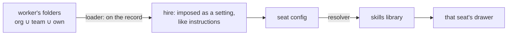

# FIX-1362 · Per-seat skills in the built-in worker kind

Feature · 3 packages + docs · medium-large · 1 or 2 PRs · epic FIX-1359
[Decisions](DECISIONS.md) · [Business rules](BUSINESS-RULES.md) · [Plan](PLAN.md)

## Three people, before and after

| Someone who… | Today | After |
|---|---|---|
| **drops a `write-regression` folder beside the QA tester** | Nothing happens. No seat is filled from folders | The tester holds it. Nobody else does. `/write-regression` uses it. Nothing else changes until they ask for more |
| **gives two workers on one roster different skills** | Both read one org-wide bucket. Every worker holds every other's instructions | Each has its own drawer. The eng lead never sees the tester's skill |
| **wants a skill in every one of a worker's prompts** | No way to say so | One line in the worker file: `skills.active: [house-style]` |
| **wants the model to pull a skill in mid-turn** | Always on, for everyone, with a catalog listing every turn | `skills.activateTool: true`, per worker, off by default |
| **fixes a typo in a company skill** | Every worker sees it, because they all read the same bucket | Workers already holding it keep their copy until someone refreshes them |
| **runs a turn that uses no skill** | No extra cost | Still no extra cost. No extra model call, no extra tokens |

The contract already promises *a seat's skills are that seat's*. The built-in kind shipped days ago; skills are the next thing a roster reaches for.

## What changes


Each seat gets its own drawer, filled from its own three folder levels. The band a skill sits in is where it came from. `house-style` appears in both drawers because each seat holds its own copy, which is why a company edit doesn't reach a running worker on its own ([D3](DECISIONS.md#d3)).

## The worker file, as a diff

```diff
  ---
  description: Runs regression passes
  tools: [runTests]
+ skills:
+   active: [house-style]     # in every prompt
+   activateTool: true        # let the model pull one in mid-turn · off by default
  ---
  You write regression tests for reported bugs.

  teams/qa/workers/tester/
    WORKER.md
+   skills/write-regression/  # held by the tester, listed nowhere, reached by /write-regression
```

A body with no `skills:` key hires, answers, and pays nothing for the skills it holds.

## What a turn costs


Height is tokens. The first stack is the common case and it's the promise: a turn that uses no skill pays for its instructions and its always-on list, nothing more. The fourth stack is what we refused ([D2](DECISIONS.md#d2)).

## How it reaches the seat



A block can see its config and nothing else, not even which instance it is. So the skill set rides the record and arrives as a setting. Why that layer and not another is [D1](DECISIONS.md#d1).

## What stays as it is

- The two skills entry points. Deprecating one is FIX-1390, filed. This issue pins which the built-in uses.
- Memory (FIX-1364). The teaching surface (FIX-1366). Every refusal `hireWorkforce` already makes.
- The classifier tier stays FIX-1363's opt-in. The keyword tier is out, not renamed.

## Sign off

1. **[D1](DECISIONS.md#d1) · Skills travel on the worker record, handed over at hire.** If wrong: the kind's wiring is a rewrite.
2. **[D2](DECISIONS.md#d2) · A skill beside a worker is reachable, not always-on.** If wrong: the first thing people try looks broken, for a promise they may not have needed.
3. **[D3](DECISIONS.md#d3) · A seat holds a copy. Refresh is deliberate and replaces the folder whole.** If wrong: withdrawn instructions stay live, or a refresh destroys edits someone expected to keep.

**Open: none.** Number 2 is the one to weigh. The full reasoning, what was rejected, and what each locks in is in [DECISIONS.md](DECISIONS.md). The cases the pages and code must satisfy are in [BUSINESS-RULES.md](BUSINESS-RULES.md).
