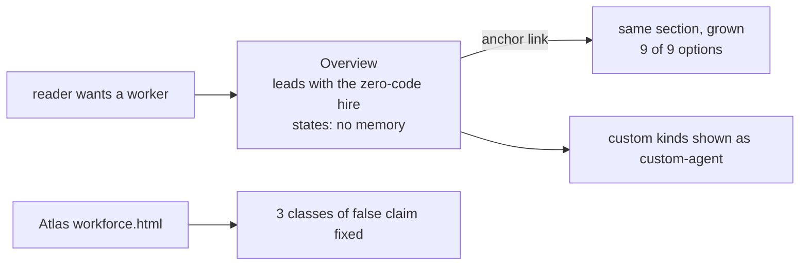

# spec(FIX-1366): teach the built-in worker kind

**The built-in worker is documented but unfindable, misnamed beside it, and under-counted.** The overview never mentions it. The example kind `worker-agent` reads like the shipped default. The reference lists 3 of 9 options. A public Atlas page calls a removed API a pending decision.

**Change:** grow and promote what exists. No new page.

## Sign off on

| # | Decision | Instead of | Locks in |
|---|---|---|---|
| D1 | Grow the existing section, promote by anchor. **No new page** | New page · redirect stub | No sidebar entry. If nobody finds it, a label fixes it later |
| D2 | Reference lists all 9 options, emphasis unchanged | "3 + a switch" · or list 3, defer 2 in a line | 3 classifier knobs become public surface |
| D3 | Atlas: 3 classes of false claim on `workforce.html` only | Restructure · sweep all 4 pages | Sibling pages stay wrong until FIX-1387 |

**One open call → recommend yes.** Promote by anchor only, no sidebar entry. Cost if wrong: one label change after someone fails to find it.

## Reviewers · look here

- **D1** — is an anchor link enough? A sidebar-only reader never sees the concept named. Cheap to fix later, so I took it.
- **D2 · the classifier knobs** — documenting them makes 3 knobs public surface we can't quietly narrow. Right line, or defer 2 with a one-liner?
- **Plan · Atlas stop rule** — 59 matching lines. "False" vs "merely old" is a judgment call on some. Is the 3-class rule tight enough?

**Not here:** sibling atlas pages (FIX-1387) · skills entry points (FIX-1362) · memory composition (FIX-1364) · `createChannelFlow` rename (FIX-1386) · core tool resolution (FIX-1393) · the docstring fix (shipped, FIX-1392).

[Spec](SPEC.md) · [Plan](PLAN.md) · Linear FIX-1366 · Epic FIX-1359 · never merges

<b>How to review this</b> — altitude, what's in scope, what's deliberately unsettled

*(the spec-PR contract, pasted verbatim from `spec-template.md`)*

<b>How this spec changed direction</b> — two rounds and a ruling

| Round | What moved |
|---|---|
| Draft | Proposed a new page. Premise: nothing teaches the built-in |
| R1 | It duplicates an existing section. Folded as move-not-copy |
| R2 | Premise false. Reversed to grow + promote. Grep gate rescoped |
| Ruling | `tools:` fence stands, core will enforce (FIX-1393). Teach it, name the hole |

