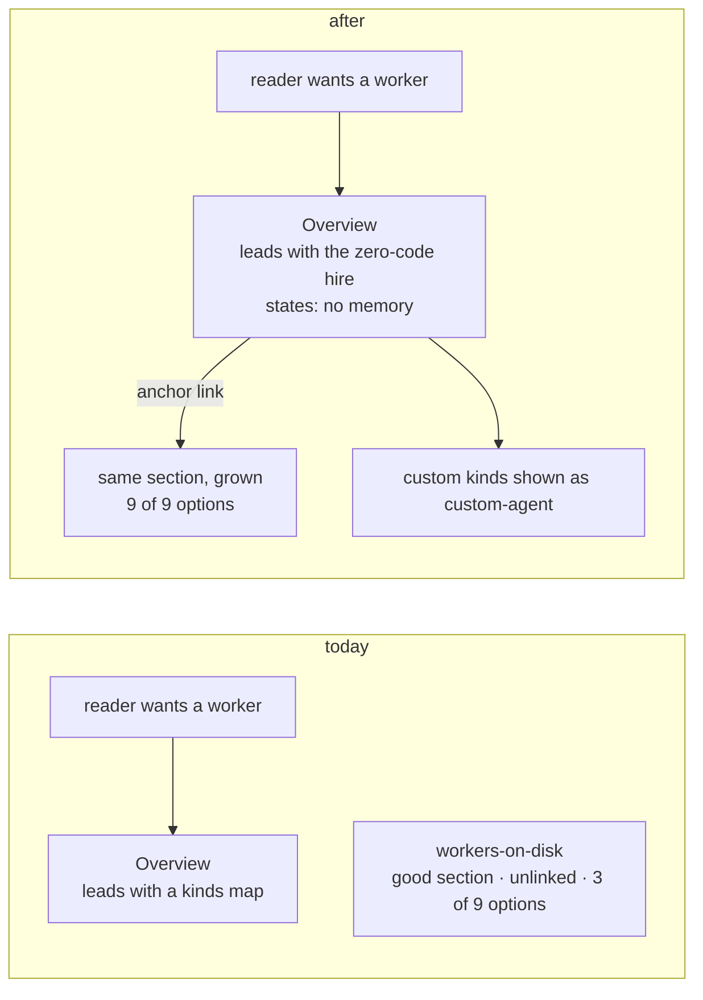

# FIX-1366 · Teach the built-in worker kind

| | |
|---|---|
| **Status** | Spec · awaiting sign-off |
| **Type** | Docs only · no behaviour change |
| **Size** | 0 new pages · 5 surfaces edited · 1 file rename · 1 PR |
| **Epic** | FIX-1359 |
| **Plan** | [PLAN.md](PLAN.md) |

## Problem

The built-in worker is documented. A reader can't find it, and what they do find is wrong in two places.

| Where | What a reader hits | Why it hurts |
|---|---|---|
| Workforce → Overview | First example leads with a `kinds` map as the required step | "What do I get with no code?" is never answered on the front door |
| Overview · workers-on-disk · workforce README | Example kind is named `worker-agent` | Reads like the shipped default. The real built-in id is `agent` |
| workers-on-disk → "The worker you get without writing one" | Says 3 settings "plus a switch" | Real API: 5 app options + 4 worker settings |
| Atlas `workforce.html` (public Pages root) | Calls `defineAgent` an "invent-kill candidate" | It was removed. A published page states a pending decision that's done |

**Why now.** The kind is the epic's headline and it's on `main`. Every day the front door hides it, the placeholder gets copied again.

## Change

Grow and promote what exists. Write no second copy.

| Surface | Edit |
|---|---|
| `apps/docs/docs/workforce/overview.md` | Lead with the zero-code hire · state **no memory** · anchor-link into the section · introduce `kinds` after, as opt-in |
| `apps/docs/docs/workforce/workers-on-disk.md` | Grow the existing section with the full 5 + 4 inventory and the `tools:` fence. Everything else untouched |
| overview · workers-on-disk · `packages/workforce/README.md` | `worker-agent` → `custom-agent` · `workerAgentFlow` → `customAgentFlow` |
| `docs/atlas/workforce.html` | Correct 3 classes of false claim. Nothing else |
| `docs/architecture/workforce-agent-kind.md` | Rename → `workforce-default-worker-kind.md` + its 2 inbound refs |

**Not changing:** the pages that document `agentRegistry` / `materializeAgent` as bring-your-own options (they're correct) · the 3 sibling atlas pages (FIX-1387) · core tool resolution (FIX-1393) · the source docstring (shipped as FIX-1392).

## Requirements

| # | The pages must… | Checked by |
|---|---|---|
| R1 | Answer "what do I get with no code?" in the overview's **first** example | By eye |
| R2 | State the built-in has **no memory**, on the new front door, at least as prominently as today | By eye |
| R3 | List all 5 app options and 4 worker settings | Diff against `agent-worker-flow.ts` |
| R4 | Not push readers toward the LLM classifier. It's opt-in, off by default | By eye |
| R5 | Teach the `tools:` fence as the guarantee **and** name the hole: capability tools are unioned, not intersected | By eye · check FIX-1393 first |
| R6 | Carry no `worker-agent` on teaching surface | Grep A empty |
| R7 | Carry no issue numbers under `apps/docs` | Grep |
| R8 | Build with no broken links, including the new anchor | `pnpm --filter docs build` |

## Decisions · sign these

| # | Decision | Instead of | What you're locking in |
|---|---|---|---|
| D1 | Grow the existing section. Promote it from the overview by anchor. **No new page** | A new `built-in-worker.md` · or a stub page that only redirects | No sidebar entry names the concept. If nobody finds it, the fix is a sidebar label, later, once someone actually fails |
| D2 | The reference lists all 9 options. Emphasis unchanged | Ship "3 + a switch" as if complete · *or* list 3 and defer 2 in one explicit line (acceptable) | `classifierModel`, `confidenceThreshold`, `enableLlmClassifier` become public surface. Narrowing later reads as a removal |
| D3 | Atlas: fix 3 classes of false claim on `workforce.html` only | Restructure it · or sweep all 4 atlas pages | Sibling pages keep asserting a removed API exists until FIX-1387 |

**One open call.** Is an anchor link enough discoverability without a sidebar entry? **Recommend yes.** A sidebar label is a one-line change and is better made after someone fails to find it than guessed now. What would change my mind: a design partner who onboards from the sidebar alone. Cost if wrong: the problem returns as "still hard to find", and one label fixes it.

## How this spec got here

| Round | What moved |
|---|---|
| Draft | Proposed a new `built-in-worker.md`. Premise: nothing teaches the built-in |
| R1 | Reviewers: it duplicates an existing section. Folded as move-not-copy |
| R2 | Premise shown false. The section has existed since the kind shipped. Direction reversed to grow + promote. Grep gate rescoped: the repo-wide form could never pass |
| Ruling | Architect on epic PR #1730: the `tools:` fence stands, core will enforce it (FIX-1393). Teach the guarantee, name the hole, no roadmap language |
