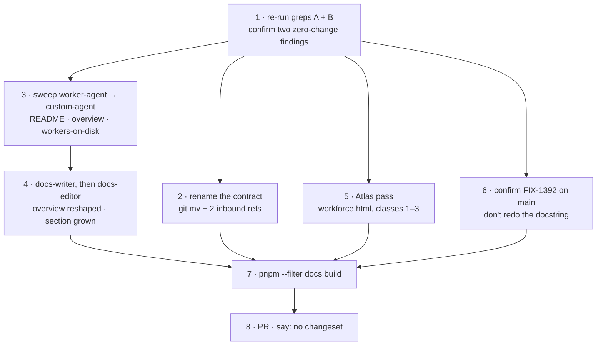
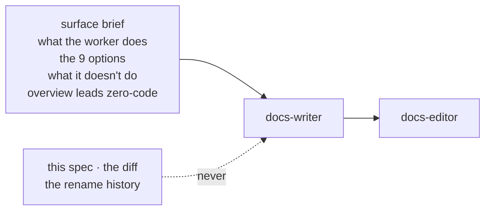
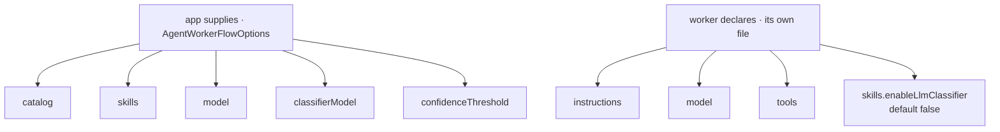
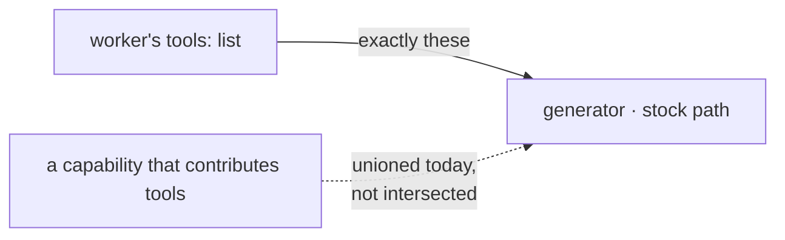
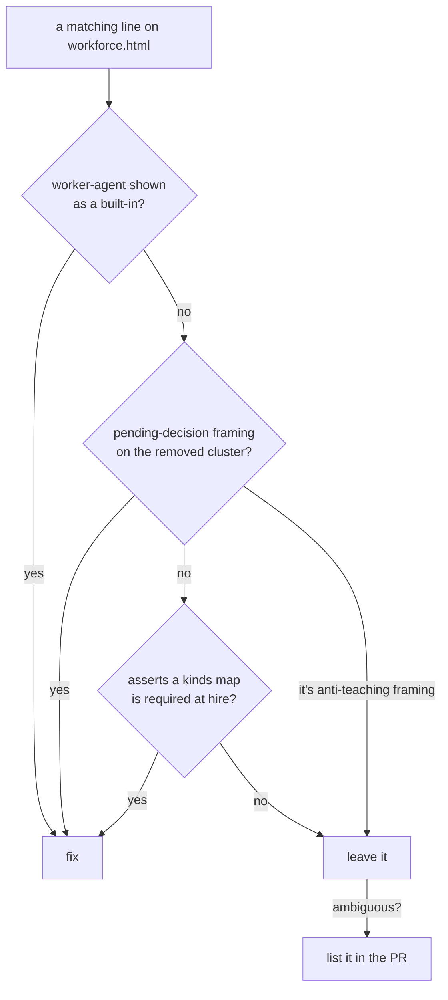

# FIX-1366 · Plan

Executes [SPEC.md](SPEC.md). Docs only. One PR. No tests, no changeset.

## The sequence



| Step | Passes when |
|---|---|
| 1 | Superseded factory names: 0 hits repo-wide. Orchestration and skills pages untouched |
| 2 | `grep -rn workforce-agent-kind . \| grep -v node_modules` → empty |
| 3 | Grep A → only the Atlas hit remains |
| 4 | Spec §6 boxes tick by eye. The no-memory line is on the overview, not only in the linked section |
| 5 | Grep A → empty. Grep B on that page → anti-teaching framing only |
| 6 | `pnpm --filter @flow-state-dev/workforce typecheck` |
| 7 | Exit 0. `onBrokenLinks: "throw"` catches the anchor |

## Step 4 · the writer's brief



Hand the writer the brief only. The outsider rule is the binding constraint. No new file, no `sidebars.ts` change.

## What the section grows into



`classifierModel` and `confidenceThreshold` sit on the app because the matcher is built once per kind. Re-derive from `agent-worker-flow.ts` at implement time.

## The `tools:` fence



Teach the solid edge as the guarantee. Name the dashed edge as a known limit, one or two sentences, no dates. If FIX-1393 has landed, the dashed edge is gone: teach the fence flat.

## Grep A · teaching surface only

```bash
grep -rn "worker-agent\|workerAgentFlow" \
  --include=*.md --include=*.mdx --include=*.html \
  apps/docs packages/*/README.md docs/atlas
```

Empty after step 5. Not reached, must stay: the contract's C6 text · `docs/internal/design/kitchen-sink-agent-drift.md`. The repo-wide form can never pass.

## Grep B · the removed cluster

```bash
grep -rn "defineAgent\|materializeAgent\|AgentRegistry\|createAgentRegistry" \
  --include=*.md --include=*.mdx --include=*.html . | grep -v node_modules
```

Never empty. Most hits are correct and stay.

## Step 5 · Atlas, what to touch



Plus one mechanical edit: re-pin the `origin/main` line (242). Match entity-escaped HTML. Fix an SVG `<text>` and its `aria-label` together.

## Leave alone

| Surface | Because |
|---|---|
| `orchestration/configuration.md` · `orchestration/agents.md` · `skills/delegation.md` · `guides/building-a-research-team.md` | They document live bring-your-own options. Correct |
| `workers-on-disk.md:248` | FIX-1363 owns it |
| The built-in section's existing prose | Grow it. Don't move, copy, or re-voice |
| The contract's C6 body | Deliberate residue |
| Merged PR descriptions | History |

## At implement time

- FIX-1393 landed → teach the fence flat.
- FIX-1364 landed first → link its memory teaching, don't repeat.
- Option counts moved → source wins over the diagram above.
