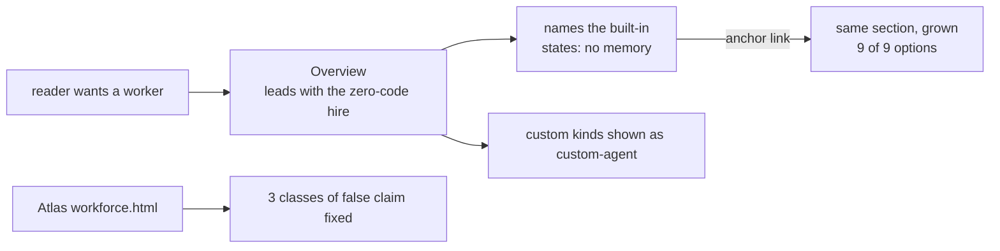
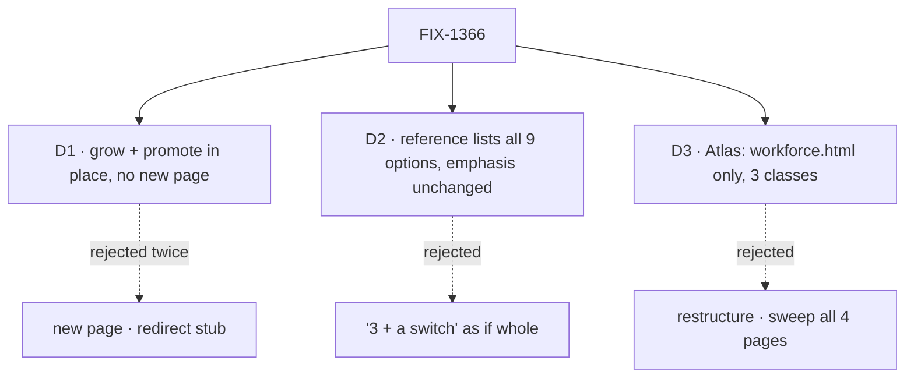

# spec(FIX-1366): teach the built-in worker kind

**The built-in worker is taught two-thirds down a page about the file format.** The front door never mentions it, the example kind `worker-agent` reads like a shipped default, and the reference lists 3 of 9 options. A public Atlas page calls a removed API a pending decision.

## After

No new page. Grow and promote what exists.

## Sign off on

- **D1 locks in:** no sidebar entry names the concept. A label fixes it later if needed.
- **D2 locks in:** 3 classifier knobs become public surface.
- **D3 locks in:** sibling atlas pages stay wrong until FIX-1387.

**One open call → recommend yes.** Anchor-link promotion only. Cost if wrong: one sidebar label.

## Reviewers · look here

- **D1** — is an anchor link enough discoverability? Sidebar-only readers never see the concept named.
- **D2** — document the 2 classifier tuning knobs, or defer them in one line?
- **Plan · Atlas** — is the 3-class stop rule tight enough on a 59-line match set?

**Not here:** FIX-1387 · FIX-1362 · FIX-1364 · FIX-1386 · FIX-1393 · FIX-1392 (shipped).

[Spec](SPEC.md) · [Plan](PLAN.md) · Linear FIX-1366 · Epic FIX-1359 · never merges

<b>How to review this</b> — altitude, what's in scope, what's deliberately unsettled

*(the spec-PR contract, pasted verbatim from `spec-template.md`)*

