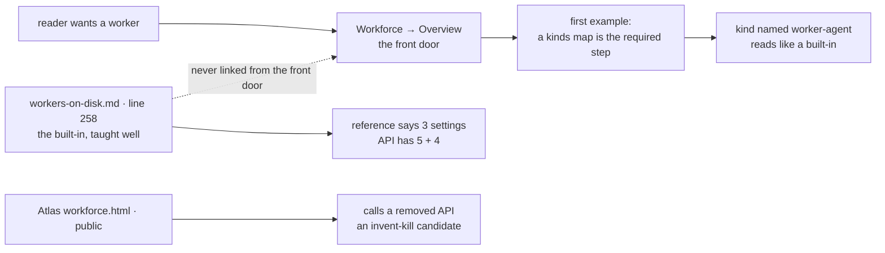
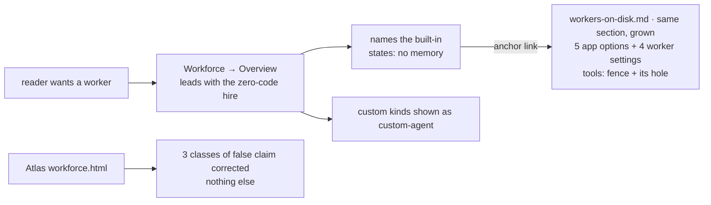
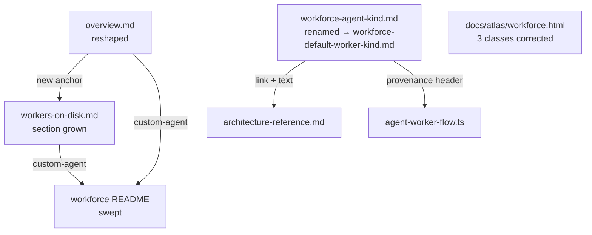
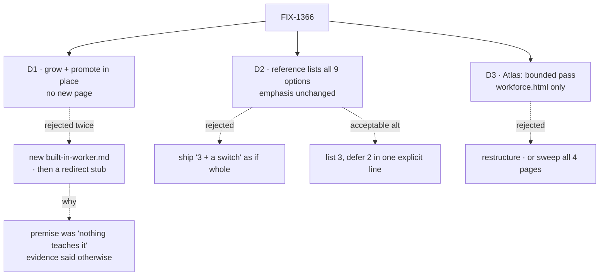
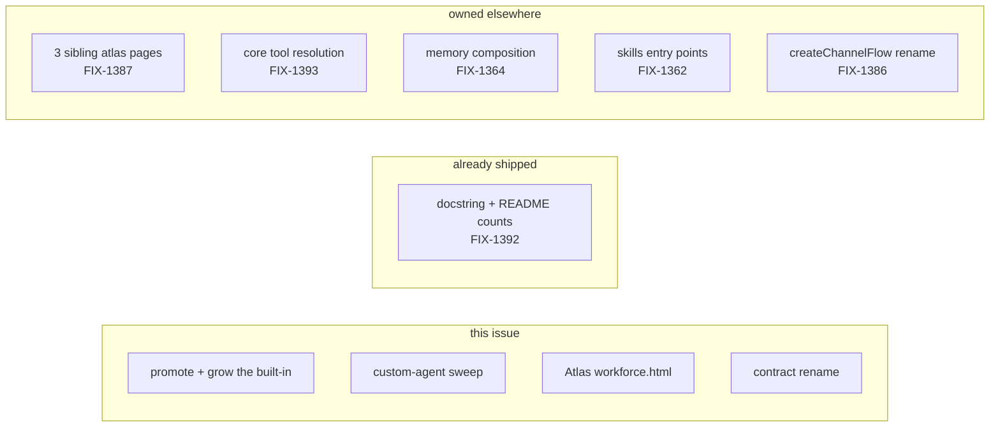
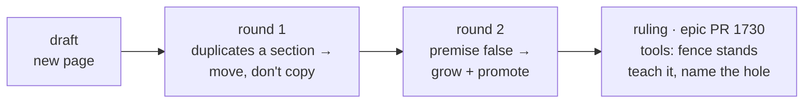

# FIX-1366 · Teach the built-in worker kind

Docs only · 0 new pages · 5 surfaces · 1 rename · 1 PR · epic FIX-1359 · [plan](PLAN.md)

## 1. Today

The built-in is already taught, two-thirds down a page about the file format. The front door never mentions it, the example kind reads like a shipped default, and the reference undercounts the API.

## 2. After

No new page. The front door answers the question it's asked and links into the section that already holds the answer. That section grows only where it was thin.

## 3. What gets touched

Edges are the links that must stay in step. The docs build catches the anchor. Nothing catches the other three, so each gets a grep in the plan.

## 4. Where the decisions fell

Solid edges are what you're signing. Dashed edges are what lost, and why. D1's dashed branch is the one worth reading: the spec's own first draft died on evidence.

## 5. What each decision locks in

| | Locks in |
|---|---|
| D1 | No sidebar entry names the concept. If nobody finds it, a sidebar label fixes it later |
| D2 | `classifierModel`, `confidenceThreshold`, `enableLlmClassifier` become public surface. Narrowing later reads as a removal |
| D3 | Sibling atlas pages keep asserting a removed API until FIX-1387 |

## 6. The pages must

- [ ] Answer "what do I get with no code?" in the overview's first example
- [ ] State **no memory** on the new front door, as prominently as today
- [ ] List all 5 app options and 4 worker settings
- [ ] Not push readers toward the LLM classifier. Opt-in, off by default
- [ ] Teach the `tools:` fence as the guarantee, and name the hole
- [ ] Carry no `worker-agent` on teaching surface, and no issue numbers under `apps/docs`
- [ ] Build clean

## 7. Boundary

Also untouched, on purpose: the pages documenting `agentRegistry` / `materializeAgent` as bring-your-own options. They're correct.

## 8. How it got here

**One open call → recommend yes.** Promote by anchor only, no sidebar entry. Cost if wrong: one label change, after someone fails to find it.
