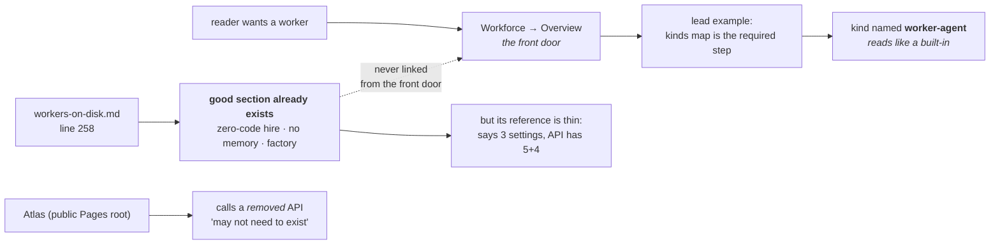
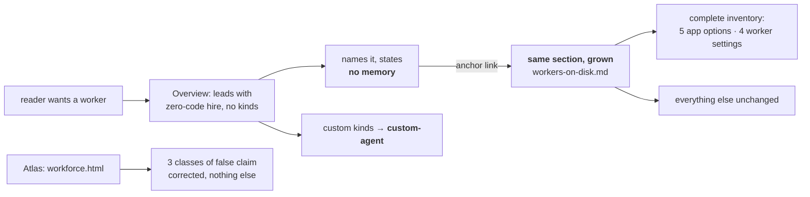
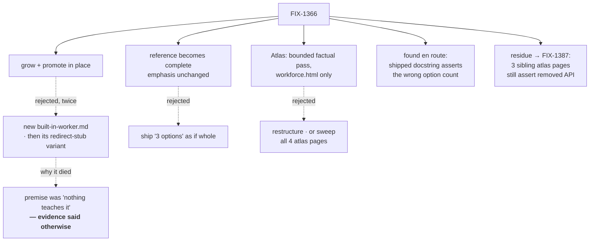

# FIX-1366 · explainer

> **Control.** This is the explainer as it exists today on PR #1765, unchanged. Approach C keeps it beside the spec so the question "does a separate comprehension artifact still earn its place next to a grid-shaped spec?" is answered by comparison rather than by assertion. A, B and D fold it in.

## 1. Today

The built-in is **already taught** — and taught well — two-thirds down a page about the file format. The overview never mentions it. So the content is not missing; it is unfindable, sitting beside a placeholder name that reads like a shipped default, with an options list that undercounts the real API.

## 2. After (proposed)

**No new page.** The front door is reshaped to answer the question it is asked, and links into the section that already holds the answer. That section grows only where it was thin.

## 3. Where the decision fell

Three calls. The branch worth reading is the dashed one under Decision 1: this spec argued for a new page, review produced the page that already existed, and the direction reversed. The classifier is documented but **not promoted** — opt-in, off by default.
