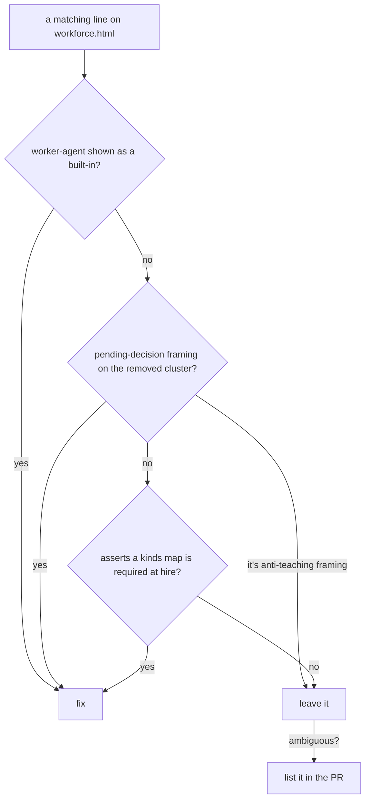

# FIX-1366 · Business rules

What the pages must say, must not say, and must leave alone. Written as rules a human reviews; the plan turns each into a step and a check.

## The front door · `overview.md`

| # | Rule | Proved by |
|---|---|---|
| BR-1 | The **first** example is a worker file and a hire call with no `kinds` argument | By eye |
| BR-2 | The front door names it as the built-in and states it has **no memory across turns**, at least as prominently as the section it links to does today | By eye |
| BR-3 | It anchor-links into the existing section. The section's heading text does not change, so the anchor holds | Docs build: `onBrokenLinks: "throw"` |
| BR-4 | `kinds` is introduced after that, as what you pass when you want a kind of your own | By eye |

## The reference · `workers-on-disk.md`

| # | Rule | Proved by |
|---|---|---|
| BR-5 | Lists all 5 app options and all 4 worker settings, with one sentence on why the two classifier knobs are app-level | Diff against `agent-worker-flow.ts` |
| BR-6 | Does not promote the LLM classifier. A reader finishes knowing the knob exists with no impression they should enable it | By eye |
| BR-7 | Teaches the `tools:` fence as the guarantee **first**, then names the hole in one or two sentences: capability-contributed tools are unioned onto declared `tools:` today. No dates, no "soon". If FIX-1393 has landed, the hole sentence comes out | By eye · check FIX-1393 |
| BR-8 | Everything already correct in the section stays word for word: the zero-code example, the no-memory line, the shared-skills line, the factory replacement, the empty-catalog note | Diff |

## Naming, everywhere prose teaches

| # | Rule | Proved by |
|---|---|---|
| BR-9 | No `worker-agent` or `workerAgentFlow` on teaching surface: `apps/docs`, the workforce README, `docs/atlas`. Custom kinds are shown as `custom-agent` / `customAgentFlow`. A `kinds` map key and its identifier are renamed together | Grep A, scoped, empty |
| BR-10 | No issue or PR numbers under `apps/docs` | Grep |

Grep A is scoped to teaching surface on purpose. The repo-wide form can never pass: the contract's C6 text keeps `worker-agent` as the record of the split, and `docs/internal/design/kitchen-sink-agent-drift.md` is a dated record.

## The Atlas · `workforce.html` only

| # | Rule | Proved by |
|---|---|---|
| BR-11 | Change a line only if it is one of three classes: (1) `worker-agent` presented as a built-in; (2) pending-decision framing on the removed cluster, such as "invent-kill candidate", "may not need to exist", "kill it"; (3) a row asserting a `kinds` map is required at hire | Grep A empty · grep B shows anti-teaching framing only |
| BR-12 | Anti-teaching framing stays: "do not teach `defineAgent` as a block factory" is still correct. So do the fence, sequence, vocabulary, voice, Linear links, and anything merely old | Diff |
| BR-13 | A line that is ambiguous between false and merely old is left alone and listed in the PR body | PR body |

Plus one mechanical edit: re-pin the `origin/main` line (242) to the landing commit and date. Match the file's entity-escaped HTML. An SVG `<text>` node and its `aria-label` change together.

## The contract · `workforce-agent-kind.md`

| # | Rule | Proved by |
|---|---|---|
| BR-14 | Renamed with `git mv` to `workforce-default-worker-kind.md`, retitled "The Default Workforce Worker Kind — Locked Contract". Both inbound references move in the same commit: the reference-table row (link and text) and the provenance header in `agent-worker-flow.ts` | `grep -rn workforce-agent-kind . \| grep -v node_modules` empty |
| BR-15 | The body is not rewritten. C6 keeps its `worker-agent` strings | Diff |

## Must not be touched

| # | Surface | Because |
|---|---|---|
| BR-16 | `orchestration/configuration.md`, `orchestration/agents.md`, `skills/delegation.md`, `guides/building-a-research-team.md` | They document `agentRegistry` / `materializeAgent` / `capabilityCatalog` as bring-your-own options. Those are live. Only the implementations were removed |
| BR-17 | `workers-on-disk.md:248`, the refusal-list line | FIX-1363's |
| BR-18 | The three sibling atlas pages | FIX-1387's, recorded residue |
| BR-19 | The source docstring and README option counts | Already on `main` as FIX-1392. Confirm, don't redo |
| BR-20 | Merged PR descriptions carrying the old option count | History |

## Process rules

| # | Rule | Because |
|---|---|---|
| BR-21 | The user-facing prose is written by `docs-writer` from a surface brief, then `docs-editor`. Never hand it this spec, the diff, or the rename history | The outsider rule: pages describe what the worker does, never what it used to be called or which issue changed it |
| BR-22 | No changeset | No published package's API changes |
