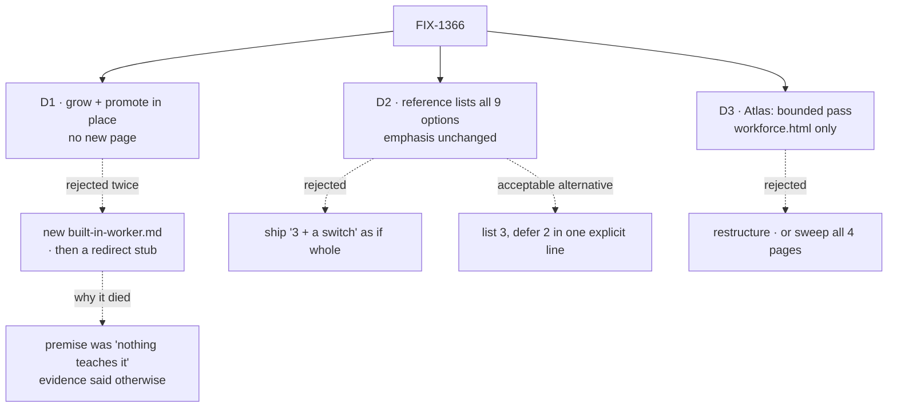

# FIX-1366 · Decisions

What was considered, what was chosen, why, and what each choice locks in. This spec reversed direction in review; the tree shows where.

## The tree

Solid edges are what you're signing. The dashed branch under D1 is the one worth reading: the spec's own first draft died on evidence.

## D1 · No new page. Grow the existing section, promote it from the overview by anchor

| | |
|---|---|
| **Instead of** | A new `built-in-worker.md` as the canonical home · a stub page that only redirects |
| **Because** | The teaching exists and is good. A new page relocates it, buys one URL and a sidebar row, and creates a second surface to keep in step. The stub is worse: a row that teaches nothing and splits attention at the moment a reader is orienting |
| **Locks in** | No sidebar entry names the concept. A reader browsing the sidebar alone still won't see "the built-in worker". If that proves too quiet, a sidebar label or a page split is cheap, and better made after someone actually fails to find it |

The wireframes in [SPEC.md → The front door](SPEC.md#the-front-door) are this decision: the sidebar column is identical on both sides, and the anchor arrow is the whole promotion.

**The open call, recommend yes.** Is an anchor link enough discoverability? What would change my mind: a design partner who onboards from the sidebar alone. Cost if wrong: the problem returns as "still hard to find", and one label fixes it.

## D2 · The reference lists all five app options and all four worker settings, with the emphasis unchanged

| | |
|---|---|
| **Instead of** | Publishing "3 settings plus a switch" as if it were the whole surface · *acceptable:* document the 3 core options and defer the 2 classifier-tuning knobs in one explicit line |
| **Because** | A reference that undercounts a public surface sends people to read our source. Not acceptable: an inventory that reads as complete and isn't |
| **Locks in** | `classifierModel`, `confidenceThreshold` and `skills.enableLlmClassifier` become documented public surface. Narrowing them later reads as a removal. The emphasis rule is part of the decision: the classifier is opt-in and off by default, and the prose must not leave a reader feeling they're expected to turn it on |

The coverage grid in [SPEC.md → The reference](SPEC.md#the-reference) is this decision: nine cells, and three of them marked *documented, not promoted*.

## D3 · The Atlas gets a bounded factual pass on `workforce.html`, not a restructure

| | |
|---|---|
| **Instead of** | Rebuilding the workforce Atlas around the shipped built-in · extending the pass to the three sibling atlas pages |
| **Because** | `workforce.html` has 59 matching lines. An unbounded "factual pass" over that becomes a rewrite. The siblings (14 lines) are real and false, and fixing them turns this issue into a full Atlas hygiene sweep |
| **Locks in** | The Atlas stays a planning record corrected per epic. `conductor.html`, `framework.html` and `roadmap.html` keep asserting a removed API exists until FIX-1387 picks them up: a known, recorded residue rather than a silent one |

The three classes of change and the *fix or leave* rule are [BR-11 to BR-13](BUSINESS-RULES.md#the-atlas).

## Two acceptance criteria that used to be decisions

- **The no-memory line stays at least as prominent as today.** An earlier draft had a publish-now-or-hold fork on disclosing that the built-in has no memory. Review showed the disclosure already ships, so the fork dissolved into a rule: the reshaped front door must carry the line, not only the section it links to ([BR-2](BUSINESS-RULES.md)).
- **The `tools:` fence is taught with its hole named.** An Architect ruling on epic PR #1730 settled it: the hard-fence guarantee stands, core will enforce it (FIX-1393), and a rebrand to "convention" was rejected. Until enforcement lands, the page states the guarantee and names the residue as behaviour, not roadmap ([BR-7](BUSINESS-RULES.md)).

## Considered and dropped

| Alternative | Why not |
|---|---|
| Fix the pages documenting `agentRegistry` / `materializeAgent` | They document live bring-your-own options on `createSkillsLibrary`. Only the implementations were removed. Those pages are right |
| Sweep the superseded factory names | Zero hits repo-wide. Already absorbed before this issue |
| Fix the source docstring here | Shipped separately as FIX-1392, because a spec branch never merges and a false statement about a published API shouldn't wait through a spec gate |
| A repo-wide grep as the gate | Can never pass: the contract keeps `worker-agent` in its C6 text on purpose. An evidence path that cannot pass is not evidence |

## How it got here

- **Draft** — proposed a new `built-in-worker.md`. Premise: nothing teaches the built-in.
- **Round 1** — it duplicates an existing section. Folded as move-not-copy: new page canonical, old section shrinks to a pointer.
- **Round 2** — the premise was false. The section has existed since the kind shipped, with the no-memory line. Direction reversed to grow and promote. The grep gate was rescoped. The three sibling atlas pages moved out to FIX-1387.
- **Ruling fold** — the `tools:` fence: teach the guarantee, name the hole, no roadmap language. The docstring fix split out as FIX-1392.
