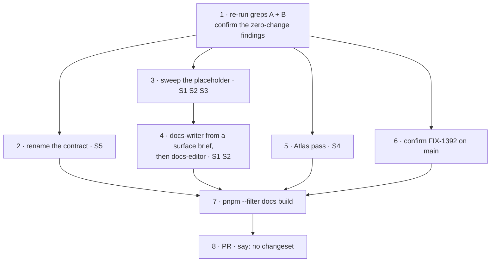

# FIX-1366 · Plan

Written for the implementing agent. IDs cross-reference [BUSINESS-RULES.md](BUSINESS-RULES.md) (BR-n). No figures here; the pictures are in the spec and the decisions. Docs only, one PR, no tests, no changeset.

## Surfaces

| ID | File | Change | Rules |
|---|---|---|---|
| S1 | `apps/docs/docs/workforce/overview.md` | First example: worker file + hire call with no `kinds`. Name it the built-in, state no memory, anchor into S2. Introduce `kinds` after. `worker-agent` → `custom-agent`, `workerAgentFlow` → `customAgentFlow` | BR-1 to BR-4, BR-9, BR-10 |
| S2 | `apps/docs/docs/workforce/workers-on-disk.md` | Grow "The worker you get without writing one" (line 258) in place: replace the 3-settings sentence with the 5 + 4 inventory; add the `tools:` fence with its hole. Heading text unchanged. Sweep custom-kind material to `custom-agent` | BR-5 to BR-10 |
| S3 | `packages/workforce/README.md` | `worker-agent` → `custom-agent` sweep (lines 17, 31, 35, 193, 199) | BR-9 |
| S4 | `docs/atlas/workforce.html` | Classes 1–3 only. Re-pin the `origin/main` line (242) | BR-11 to BR-13 |
| S5 | `docs/architecture/workforce-agent-kind.md` → `workforce-default-worker-kind.md` | `git mv`, retitle, update `architecture-reference.md:42` (link and text) and the header at `agent-worker-flow.ts:15`. C6 body untouched | BR-14, BR-15 |

## Sequence



## Checks

| ID | Check | Passes when |
|---|---|---|
| V1 | Grep A | Empty after step 5. After step 3, only the Atlas hit remains |
| V2 | Grep B on `workforce.html` | Anti-teaching framing only, no pending-decision framing |
| V3 | `grep -rn workforce-agent-kind . \| grep -v node_modules` | Empty |
| V4 | `grep -rn "FIX-[0-9]" apps/docs/docs/workforce` | Empty |
| V5 | `pnpm --filter docs build` | Exit 0. `onBrokenLinks: "throw"` catches the anchor |
| V6 | `pnpm --filter @flow-state-dev/workforce typecheck` | Passes after S5 |
| V7 | By eye against BR-1, BR-2, BR-4, BR-6, BR-7, BR-8 | Reviewer agrees |
| V8 | Superseded factory names repo-wide | 0 hits, as before this issue |

```bash
# Grep A · teaching surface only. Repo-wide can never pass.
grep -rn "worker-agent\|workerAgentFlow" \
  --include=*.md --include=*.mdx --include=*.html \
  apps/docs packages/*/README.md docs/atlas

# Grep B · the removed cluster. Never empty. Most hits are correct.
grep -rn "defineAgent\|materializeAgent\|AgentRegistry\|createAgentRegistry" \
  --include=*.md --include=*.mdx --include=*.html . | grep -v node_modules
```

## Step 4 · the writer's brief

Hand `docs-writer` a surface brief only: what the built-in worker does, the complete 5 + 4 inventory with the one-sentence reason the classifier knobs are app-level, what it does not do (no memory, no classifier by default), the `tools:` fence and its hole as behaviour, and that the overview must lead with the zero-code path and link into the section. Never this spec, the diff, or the rename history. No new file, no `sidebars.ts` change. Then `docs-editor`.

## S2 · the inventory · re-derive from `agent-worker-flow.ts` at implement time

| App · `AgentWorkerFlowOptions` | Worker · its own file |
|---|---|
| `catalog` — tools workers may name in `tools:` | `instructions` |
| `skills` — seeded into every seat's library | `model` |
| `model` — default when a worker names none | `tools` |
| `classifierModel` — the matcher's opt-in third tier | `skills.enableLlmClassifier` · default `false` |
| `confidenceThreshold` — that tier's bar | |

The last two are app-level because the matcher is built once per kind; a per-worker value could never be honoured.

## S2 · the fence

1. Guarantee first: a seat calls exactly the catalog keys it names; empty means none.
2. Then the hole, one or two sentences: capability-contributed tools are unioned onto declared `tools:` today (`generator.ts` resolves `[...base, ...staticTools, ...dynTools]`). Holds for the stock worker and for capabilities that opt out.
3. No dates, no issue number on the page. **If FIX-1393 has landed, skip step 2.**

## S4 · Atlas snapshot

| Class | Where |
|---|---|
| 1 · `worker-agent` as a built-in | line 577 |
| 2 · pending-decision framing | standfirst 236 · §04 lede 568 · SVG `aria-label`s and `<text>` nodes · W2/W3 table |
| 3 · `kinds` map required at hire | §03 table |

59 matching lines / 94 occurrences in total; most are class 2 or must stay (BR-12). Ambiguous → BR-13.

## At implement time

- FIX-1393 landed → teach the fence flat (BR-7).
- FIX-1364 landed first → link its memory teaching rather than repeat.
- Option counts moved → source wins over the table above.
