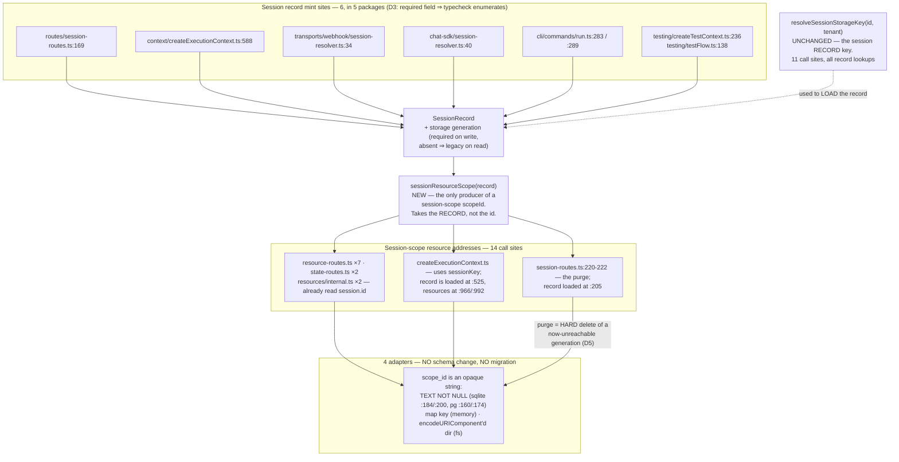

# FIX-1000: A create racing session deletion lands in a purged, caller-reusable scope — fence the scope generation — Implementation Spec

> **Linear issue:** [FIX-1000](https://linear.app/fixpoint-labs/issue/FIX-1000) · **Epic:** [FIX-980](https://linear.app/fixpoint-labs/issue/FIX-980) — Honest task substrate · **Precondition met:** [FIX-992](https://linear.app/fixpoint-labs/issue/FIX-992) has merged (#1035 / #1039 / #1036), so the lifecycle column, the retained tombstone and the conformance case this spec flips are all on `main` at `26664927` · **No external blockers.**

## Spec evolution *(the change story, not an audit log)*

- **Spec drafted.** Framed as an *addressing* problem rather than a concurrency one: the cross-key invariant "no live rows in a purged scope" is unexpressible as a predicate, so the scope stops being re-addressable instead of being defended. Per-session storage generation on the session record; one derivation for every session-scope resource address; a purged generation becomes unreachable and is therefore hard-deleted wholesale, which is also the session-scope half of tombstone reclamation. **The premise was run, not asserted** (§7's POC, §12) — the race is reachable on the real path through the real routes and the real registry, and a brand-new session inherits the straggler. Two enumerations that would have shipped wrong were caught by running the command instead of reading: session records are minted in **six** places across **five** packages (not the two the issue implies), and `resolveSessionStorageKey` has **eleven** call sites (not ten). Medium / 1 PR.

---

## For reviewers — what this document is

This is a **direction document**, not an implementation. Reviewing it well means answering one question: **is this the right approach?**

**In scope to challenge:** the problem framing · the approach · any numbered **Decision** in §6 · missing constraints that would **invalidate** the design · scope.

**Out of scope — deliberately unsettled, owned by the implementing agent:** names, signatures, file paths, module layout · local structure, which helper, error-message wording · micro-optimizations and style · test names and internal test structure (the *behaviours* are in §10) · anything Part II left open on purpose · **the POC on this branch, entirely** — it is throwaway, it never ships, and its findings are summarized in §7.

Feedback in the second list is recorded verbatim in **§13**. It will not be argued with and will not be folded into the design prose. One mention is enough for it to land.

**One thing this spec asks of its reviewers, because the epic has paid for it six times.** Two of the tables below are search results, and each carries the command that produced it. **Re-run the command rather than re-reading the table** — and if you believe an entry is missing, paste the output that shows it. Both commands use `grep -a`: `packages/engine/src/context/resource-registry.ts` contains a NUL byte, so a bare `grep` reports it binary and prints nothing, which is indistinguishable from a clean run.

---

## Part I — The Case *(for the human)*

### 1. Problem — why it matters, why now

**In plain language.** You can delete a session and immediately create a new one with the same name. When you do, the new session is supposed to start empty. It doesn't always. If any work was still running when the delete landed, that work can write a piece of data into the session *after* it was emptied, and the brand-new session is born holding it. From the outside this looks like data from a deleted session leaking into a fresh one that happens to share its name.

**Why now.** [FIX-992](https://linear.app/fixpoint-labs/issue/FIX-992) merged hours ago and closed every neighbouring version of this — a delete racing a write, a delete-then-recreate of one key, a purge racing a write to a key that already existed. It named this one as the residual it deliberately does not close, and pinned it with a committed conformance case that asserts the broken behaviour on purpose (`stores/testing/resource-store-conformance.ts:809`, *"the create LANDS — the residual this design does not close"*). This spec flips that test. Leaving it open also leaves FIX-992's storage cost unpaid: nothing reclaims a tombstone today, in any scope.

**Why FIX-992 could not close it, which is the whole shape of the problem.** FIX-992 gives every write a per-key predicate — `lifecycle = 'live'` plus a version. That fences any key that *existed* when the purge ran: the marked row keeps its version, so a stale observer never matches. It cannot fence a key that never existed. A create carries `expectedVersion: 0`, meaning *no live row*, and a never-existed key satisfies that against a purged scope exactly as it does against a fresh one; a bulk mark had no row to touch. **"No live rows in a purged scope" is a cross-key invariant, and no per-key `WHERE` clause expresses one.**

**This is not theoretical, and it was run rather than argued.** The conformance case proves the store *permits* the write; it calls `store.set(..., 0)` directly and proves nothing about whether a production path *drives* one. A characterization POC on this branch drives it end to end — real `createFlowApiRouter` session routes, real `createExecutionContext` registry, nothing about the mechanism mocked — and the brand-new session inherits the row (§7, §12). The exposure is proportional to how long an action runs, not to a two-statement window: any action holding a context across a concurrent DELETE can write into the dead scope for its whole remaining life.

### 2. Solution in plain terms

**Stop defending the scope and stop re-addressing it.** A session record mints a **storage generation** when it is created. Session-scoped resource state and content are addressed by that generation, so a session recreated under the same caller-supplied id reads a *different* address. A straggler write from the previous generation still commits — nothing stops it, and nothing needs to — but it lands somewhere no future reader will ever look. Unreachable, not fenced.

**The move is to change the address, not to add a mechanism.** Every candidate that tries to *defend* the scope needs something the substrate does not have: a barrier the filesystem adapter cannot provide, or a liveness signal FIX-992 already proved broken at both ends. Addressing needs neither. There is no predicate, no barrier, no quiescence, and no observer question — a generation nobody can name is dead by construction.

**Three things fall out of it, and they are why this shape wins rather than merely works.**

1. **It reaches `ContentStore`, which no predicate can.** Content is last-write-wins by decision (FIX-992 D3) and carries no version at all, so `content.deleteAll` racing a content write is unfenceable by any per-key predicate — and `handleDeleteSession` purges *both* stores (`session-routes.ts:219-222`). An address change is not a predicate, so it fences both stores identically. The POC's third case shows content leaking today.
2. **Reclamation stops needing an observer.** FIX-992 retained every tombstone forever because a sweep would have to ask "is anything still watching?", and its round-5 POC showed the request record answers that wrongly at both ends. A dead generation needs no such question: once the session record is gone, nothing can name the address, so the whole generation is hard-deletable — every tombstone the session ever accumulated, in one indexed range delete.
3. **It costs no migration in any adapter.** The scope id is an opaque string everywhere: `scope_id TEXT NOT NULL` in SQLite (`schema.ts:184`, `:200`) and Postgres (`:160`, `:174`), a map key in memory, and one `encodeURIComponent`'d directory name on the filesystem. Nothing is added to a schema; a string gets longer.

**The philosophy this leans on.**

- **Tenet 5 (fix at the owning layer, and find where paths converge).** The defect is session identity, not the resource store — FIX-992 said so when it filed this. The convergence point already exists and this spec makes it the only one: twelve of the fourteen session-scope resource calls already read their address off the loaded session record as `session.id`.
- **Tenet 3 (earn every addition).** One field and one derivation. No column, no migration, no barrier, no sweep, no new store method — and it *removes* the indefinite retention FIX-992 accepted for session scope.
- **Tenet 1 (coherence over local cleverness).** This is the same move `resolveSessionStorageKey` already made for tenancy (FIX-682): isolation by namespacing the key, not by a check at every reader. Adding a second component to an address the codebase already composes is the established shape.

### 3. Tradeoffs & alternatives

**Rejected: quiesce in-flight executions before the purge.** The obvious fix — do not purge until nothing is writing. It needs a sound liveness signal, and FIX-992 spent a POC establishing that the request record is not one: a context loads resource state at `createExecutionContext.ts:986` before it persists its record at `:1041`, and the default path writes no stub in front at all, so *absent* does not mean *no observer* ([FIX-1002](https://linear.app/fixpoint-labs/issue/FIX-1002)); and `drainRequestWorkPool` runs only on the success path (`runAction.ts:1409`), so *terminal* does not mean *no observer* either ([FIX-1001](https://linear.app/fixpoint-labs/issue/FIX-1001)). Two blocking dependencies to *start*, and then DELETE has to wait — for an interval with no bound, since nothing enforces a maximum action lifetime (FIX-992 round 4 established this: `runAction` sets no deadline, `ToolsConfig.defaults.timeoutMs` is per-tool and opt-in, and `scope-lock.ts:40` documents that its own timeout does not cancel the mutation). A route that blocks for an unbounded interval on two unlanded issues is worse than the defect.

**Rejected: a scope-generation column that every write predicates on.** This is the closest competitor and it deserves a straight answer rather than a caricature. It need not be a barrier: a straggler write could land carrying a stale generation and simply be filtered out by readers, which is sound. It loses on three counts. (a) **It cannot reach `ContentStore`** — content has no version and no predicate surface, and giving it one is FIX-992 D3's rejected symmetry, so the content half of the purge stays open. (b) **It needs the current generation at every write site anyway**, which is the entire plumbing cost of the address approach, *plus* a column and a read filter in four adapters and two migrations — immediately after FIX-992 did exactly that work. (c) **A filter is a thing every reader must remember**; an address is a thing a reader cannot get wrong. Strictly more cost, strictly less coverage.

**Rejected: refuse session id reuse.** Keep a tombstone of dead session ids and 409 a create that names one. It does close the inheritance half — an address never re-entered is as good as one never re-addressable. But it deletes a capability callers have: `body.sessionId` is caller-supplied precisely so an app can use a natural key (`"user-123-main"`, a ticker and a date — `apps/docs/docs/persistence/overview.md:136` documents that pattern), and delete-then-recreate is the reset idiom for it. It also needs a permanent registry of dead ids, which is the unbounded growth FIX-992 spent five rounds learning to avoid, and it does not cover the five non-route session mint sites (§7) at all.

**Rejected: backfill a generation onto existing session records.** Minting one for a live legacy session would move its address and orphan every resource it already has. So legacy records keep the bare address for life (§9) — and this costs less than it sounds, because the hole closes on *recreation*: a legacy session that is deleted and recreated gets a record with a generation, reads a fresh address, and does not inherit. The unfenced case is narrow and named in §9.

**Considered and deliberately included: session-scope tombstone reclamation.** The issue asks whether reclamation belongs here or is separable, and the honest answer is *both, split along a line the design draws for us*. Reclaiming a **purged session generation** is not an add-on — it is the same fact as the fix, because "unreachable" is exactly what makes a hard delete safe, so refusing to do it would mean writing code to retain rows nobody can address. That is in scope. Reclaiming **user- and org-scoped tombstones** is not, and not merely for budget: `deleteAll` is only ever called with `"session"` (§7's command proves it), so no purge path exists for those scopes at all; their tombstones come from per-key deletes in scopes that are never torn down, which needs a liveness-gated sweep, which needs FIX-1002 and FIX-1001. Different problem, different dependencies, filed (§12). **Named rather than silently absorbed, per the issue's instruction.**

**Where the genuine complexity is.** In order:

1. **Finding every session-record mint site, and keeping them found.** There are six, in five packages, and two of them are transports this issue never mentions. A generation minted at five of six sites is a silent hole — the session works, and is unfenced. This is the risk that decides the change, and D3 makes it a compile error rather than an audit.
2. **The two call sites that do not already read `session.id`**, one of which (`createExecutionContext`) also *creates* the record it must then read the generation from, in the same function.
3. **Deciding what a straggler write should do**, which this spec answers with "nothing" — see §9. It is a real choice and it looks like an omission if it is not stated.

### 4. Focus practices (1–5)

- **A cross-key invariant is an addressing problem, not a predicate problem.** FIX-992's standing lesson was *a predicate fences a row, not an absence*. The corollary this spec adds: when the thing you must fence is the absence of rows across a whole scope, stop trying to fence and make the scope unnameable. Ask of any guarantee: *is there a version of this where nothing has to be checked at all?*
- **Enumerate by a command, and own the list at the altitude where the command is decidable — then make the compiler the command where you can.** Both of this spec's enumerations were wrong by inspection before they were run (§7). The strongest form of a search result is a type error, which is why D3 makes the field required rather than optional.
- **Use `grep -a`.** `resource-registry.ts` carries a NUL byte at line 619; a bare `grep` prints nothing for it, and a clean grep and a skipped one look identical. Already recorded in `docs/architecture/state-and-scopes.md:98`.
- **Run the premise before pricing the fix.** The store-level fact was pinned by a committed test; whether any production path drives it was not. Those are different claims, and only the second justifies a P0.
- **BP-030 / BP-035.** A stored record without the new field must read as *legacy*, never as *broken*; and the delete/recreate, in-flight-straggler, multi-tenant and legacy paths all need stated behaviour.

### 5. What using it looks like

**Public flow-authoring API: unchanged.** Nobody writes a generation in flow code, no block signature moves, and no route gains a parameter. What changes is a guarantee.

```ts
// The observable behaviour, from a client. Today the last line can be non-empty.
await sessions.delete("user-123-main");
await sessions.create({ sessionId: "user-123-main", userId: "u1" });
const state = await sessions.getState("user-123-main");
// after: always the flow's declared defaults, even if an action was still
// running when the delete landed
```

At the internal seam, the change is that a session-scope resource address is derived from the record rather than from the id:

```ts
// before — the address is the session's storage key
await stores.resourceState.getAll("session", session.id);

// after — the address is the session's current generation, and the derivation
// takes the RECORD, so a caller that has only an id structurally cannot
// produce one without loading it first
await stores.resourceState.getAll("session", sessionResourceScope(session));
```

### 6. Decisions & rules — the sign-off surface

1. **Fence by address, not by predicate: a session record mints a storage generation, and session-scoped resource state and content are addressed by it.** *Rejected:* quiescing in-flight executions; a scope-generation column every write predicates on; refusing session id reuse (§3). *Ramification:* a straggler write still commits and is not an error — it lands in a generation nothing can address. No barrier, no liveness signal, no observer question, and it covers `ContentStore`, which no predicate can.

2. **The generation is a freshly generated nonce, not a counter, and it is opaque — nothing parses it back.** *Rejected:* an incrementing generation per session id. *Ramification:* a counter has to read the previous value, and deletion removes the record that held it, so two successive generations of a deleted-and-recreated session would both be `1` — reproducing the collision. A nonce needs no history. Nothing inverts a session-scope resource address today (`toBareSessionId` has exactly one call site, `session-routes.ts:82`, and it operates on the session *record* key), so opacity costs nothing and the separator is the implementer's.

3. **The field is required on `SessionRecord` when a record is constructed, and tolerated as absent when one is read.** *Rejected:* an optional field. *Ramification:* this is the decision the change actually turns on. Records are minted at **six** sites across **five** packages (§7) — including the webhook and chat-sdk transports, which this issue does not mention — so an optional field means a new or missed mint site silently produces an unfenced session, which is the exact failure being fixed. Required makes the typechecker the enumeration rather than an audit that ships wrong three times. A *stored* record without the field is legacy and reads at the bare address (BP-030); the two are different boundaries and only the write side is required.

4. **One derivation owns every session-scope resource address, and it takes the record, not the id.** *Rejected:* threading a generation string alongside the session id. *Ramification:* the convergence point already exists — twelve of fourteen session-scope resource calls read `session.id` off a loaded record — and taking the record makes the remaining shape structural: a call site holding only a `sessionId` cannot produce an address without loading the record, so it fails to compile rather than silently addressing the wrong generation. `resolveSessionStorageKey` keeps its current meaning (the *session record* key) and is not touched.

5. **A purged generation is hard-deleted, and that is the session-scope half of tombstone reclamation.** *Rejected:* keeping FIX-992's bulk lifecycle mark for the scope purge; and a separate reclamation pass. *Ramification:* retention exists to fence a stale observer against a *recreation at the same address*, and after D1 there is no recreation at that address — so the retained versions are fencing nothing and every tombstone the session accumulated goes with the generation, in one indexed range delete per store. Per-*key* deletes inside a live session still tombstone exactly as FIX-992 specified; only the scope purge changes. **User and org scope are untouched and keep indefinite retention** — nothing purges them (§7), so their reclamation is a different problem with different dependencies (§12).

6. **A straggler write is not an error and is not reported.** *Rejected:* failing the write, or emitting a warning. *Ramification:* detecting one requires knowing the generation is dead, which requires reading the session record on every resource write — a per-write store round trip to report an event nobody can act on, on a path FIX-992 just finished making cheap. The write lands in a dead generation and is garbage. What that leaves open is named in §9 and §12: rows written *after* the purge are not reclaimed by it.

7. **Legacy session records are not backfilled and are not retro-fenced.** *Rejected:* minting a generation for existing records. *Ramification:* a record with no generation addresses the bare scope id, exactly as today, so an existing session keeps its existing resources. The hole closes on recreation rather than on deploy — see §9 for the one case that stays open and why it is narrow.

**Non-goals.** Quiescing in-flight executions (§3) · reclaiming rows a straggler writes into an already-purged generation (D6, §12) · reclaiming user- or org-scoped tombstones, and any liveness signal that would make it possible ([FIX-1002](https://linear.app/fixpoint-labs/issue/FIX-1002) / [FIX-1001](https://linear.app/fixpoint-labs/issue/FIX-1001), §12) · cross-record atomicity between the state and content stores ([FIX-854](https://linear.app/fixpoint-labs/issue/FIX-854)) · the `maxInstances` cap race ([FIX-981](https://linear.app/fixpoint-labs/issue/FIX-981)) · changing per-key delete semantics, versioning, or the CAS driver (all FIX-992's, and unchanged) · any change to the public flow-authoring API or to `resolveSessionStorageKey`'s meaning · tenant-namespacing the transport mint sites, which use a bare session id (§12).

**Size: Medium — 1 PR.** One field, one derivation, fourteen resource call sites, six mint sites, two route edits, no adapter change and no migration. It is one PR rather than a DAG because the required field (D3) makes the whole thing one typecheck: splitting it would mean landing a half-converted surface that compiles only because the field was optional, which is the decision this spec rejected.

---

## Part II — The Build Plan *(for the implementing agent)*

### 7. Technical design

Two things change: the **session record** gains a generation, and the **session-scope resource address** is derived from it instead of from the session's storage key.



**What the POC on this branch established, and what it did not.** `spec-poc/FIX-1000-purged-scope-create/` — a characterization POC, throwaway, never merged. It answers one question: *is the purged-scope create reachable on the real path, or only at the store's own API?* Four cases, all passing on `main` at `26664927`:

| Case | Result |
|---|---|
| An in-flight context's create of a previously-absent key, after a real `DELETE /sessions/:id` | **Lands.** A session recreated under the same id inherits `tasks/late` — `["tasks/late"]`, 1 instance |
| The same interleaving for a key that **existed** before the purge | **Correctly fenced** — FIX-992's tombstone conflicts. This is the discrimination check: it is what makes the row above evidence rather than a broken harness |
| `ContentStore` under the same purge | **Leaks, with no version to check** — the argument in D1 for an address over a predicate |
| A per-generation scope id, at the store layer | Straggler unreachable in **both** stores; the recreated generation reads empty |

Run it:

```bash
cd spec-poc/FIX-1000-purged-scope-create && ../../node_modules/.bin/vitest run
```

**What it does not establish:** it arranges the interleaving deterministically rather than racing it, so it shows the ordering is *reachable and consequential*, not how *likely* it is. Nothing in the design depends on the likelihood. It also uses in-memory stores — the store-layer fact is already pinned across all four adapters by FIX-992's conformance suite.

**Enumeration 1 — session-record mint sites. This is the one that decides the change, and inspection had it at two.** The issue and FIX-992 both speak as though the route and the execution context are the mint sites. They are six, in five packages:

```bash
grep -ran "session\.set(\|session\.delete(" packages/*/src apps/*/src
```

| Site | Kind | Note |
|---|---|---|
| `routes/session-routes.ts:169-193` | **mint** | the HTTP create route; caller-supplied id (`:135`) |
| `context/createExecutionContext.ts:588-602` | **mint** | implicit creation when no record exists — and it must then read the generation back for `:966` / `:992` in the same function |
| `transports/webhook/session-resolver.ts:34` | **mint** | not mentioned anywhere in the issue |
| `chat-sdk/src/session-resolver.ts:40` | **mint** | ditto |
| `cli/src/commands/run.ts:283`, `:289` | **mint** | two literals |
| `testing/createTestContext.ts:236`, `testing/testFlow.ts:138` | **mint** | first-party published package, same trap FIX-992's writer table hit |
| `session-routes.ts:257`, `createExecutionContext.ts:2125` / `:2158`, `runAction.ts:652` | update | spread an existing record, so they carry the field forward — **verify this per site rather than trusting the classification** |
| `session-routes.ts:223` | delete | the purge path (D5) |

**After D3 this table stops mattering**, which is the point of D3: with the field required, `pnpm typecheck` fails at every mint site until each one produces a generation, and a mint site added later fails the same way. Treat the table as a starting map and the typecheck as the authority.

**Enumeration 2 — session-scope resource addresses.**

```bash
grep -ran '\(resourceState\|content\)[?.]*\.\(get\|getAll\|getByPrefix\|set\|delete\|deleteAll\)(\s*"session"' packages/*/src apps/*/src
```

Fourteen rows. **Twelve already pass `session.id` from a loaded record** — `resource-routes.ts` (×8: `:286`, `:344`, `:350`, `:457`, `:458`, `:551`, `:728`, `:745`), `state-routes.ts:149` / `:154`, `resources/internal.ts:196` / `:197`. Those become one-line swaps to the new derivation. The other two are `session-routes.ts:220` / `:221` — the purge, which passes the derived `sessionKey`; its record is already loaded at `:205`.

**The command misses one file entirely, and it is the biggest consumer** — say this rather than let the row count imply coverage. `createExecutionContext` never calls the store with a literal scope argument: it passes `stores.resourceState` and `"session"` into helpers (`loadDeclaredResourceState` at `:992`, `loadDeclaredScopeContent` at `:966`), so no pattern anchored on `resourceState.get("session"` can see it. Its `sessionKey` (`:502`) reaches the resource layer at `:815`, `:877`, `:899`, `:966`, `:992` and `:1901`. The record is loaded at `:525` and created-if-absent at `:588`, both before the resource loads, so the generation is in hand — but **the grep will not tell you this file exists**, which is precisely why the authority is the type (below) and not the command.

**The decidable version of this list is the type, not the grep**, for the same reason as D3: a derivation that takes a `SessionRecord` cannot be called by a site that holds only a string, so after the change the compiler owns the question of whether a session-scope address was derived correctly. The grep is how you find the sites to convert; the typecheck is how you know you finished.

**Why `resolveSessionStorageKey` is not touched, and the eleven call sites are not a cost.** The issue prices this change at "ten call sites of `resolveSessionStorageKey`, several of which derive the key without loading the session record". Run it — there are **eleven** (`grep -ran "resolveSessionStorageKey(" packages/*/src apps/*/src`), and the classification inverts the cost argument: **every site that derives the key without loading a record does so *in order to* load the record**, and none of those uses it as a resource address.

| Call sites | Role | Change |
|---|---|---|
| `createInboundTransportHost.ts:411` · `stream-routes.ts:225` · `runAction.ts:645` · `route-utils.ts:97` · `session-routes.ts:136` · `debug-snapshot.ts:261` / `:430` / `:568` · `resources/internal.ts:186` | **9 — session-record lookup only.** Several derive the key without a record in hand, and that is fine: the key *is* how you load one | **None** |
| `session-routes.ts:204` · `createExecutionContext.ts:502` | **2 — the value also becomes a resource address.** Both already load the record (`:205`, `:525`) before the resource layer is reached | Keep the key for the record; derive the address separately |

The function keeps one meaning (the record key); the new derivation gets the other (the resource address). **The ambiguity that made this look expensive is that one function served both questions under one name; separating them is most of the fix.**

**The purge becomes a hard delete (D5).** `handleDeleteSession` currently marks every key's lifecycle in both stores and then deletes the record (`:219-223`). After D1 the generation it purges can never be addressed again, so the retained versions fence nothing: the purge deletes the rows outright, which reclaims every tombstone the session accumulated over its life. Two orderings are load-bearing and quiet when regressed — the rows must be removed **before** the session record is (the existing comment at `:216-218` already states the reason: the reverse leaks), and a legacy record with no generation must keep the *marking* purge, because its address is the bare one and a recreation will land there.

**Deliberately unchanged, verified rather than assumed.** Per-key `delete` and `evictInstance` still tombstone (FIX-992 D11/D7) — only the scope purge changes. `resolveUserStorageKey` / `resolveOrgStorageKey` / `resolveResourceScopeId` are untouched: `deleteAll` is only ever called with `"session"` (the command in §7 above returns exactly `session-routes.ts:220` / `:221` outside the stores and their conformance suite), so no other scope has a purge to fence. `toBareSessionId` has one call site and operates on the record key, so nothing inverts a resource address.

### 8. Implementation sequence

One PR. The ordering matters because step 1 is what makes steps 2–4 enumerable.

1. **Add the generation to `SessionRecord`, required on construction.** → *verify:* `pnpm typecheck` fails at every mint site; the failure list **is** enumeration 1, and reconcile it against §7's table rather than trusting either alone.
2. **Mint at all six sites.** A shared factory is worth considering over six literals, but that is the implementer's call — what is not optional is that all six produce one. → *verify:* typecheck green; a test asserting a record from each production transport carries a generation.
3. **Add the derivation, and make it take the record.** Keep `resolveSessionStorageKey` untouched and cross-reference the two so the next reader sees which answers which question. → *verify:* a legacy record (no generation) derives the bare scope id, byte-identical to today.
4. **Convert the fourteen resource addresses** (§7), including the two the grep does not find. → *verify:* the full engine suite green with no behavioural diff for a legacy record.
5. **Purge becomes a hard delete for a generation-bearing record; unchanged for a legacy one.** → *verify:* the store holds no rows for a purged generation; a legacy session's purge still leaves tombstones.
6. **Flip the conformance case.** `stores/testing/resource-store-conformance.ts:809` asserts the create lands; it is a *store*-level case and the store is unchanged, so it stays true at that altitude — **retitle it to say what it now means** ("a per-key predicate cannot fence this; the address is what fences it, see FIX-1000") rather than deleting it, and add the route-level spec (§10) that proves the hole is closed where it mattered. → *verify:* both green, and the pairing is legible.
7. **Docs (§11) and a changeset** (BP-022, `patch` — user-observable behaviour change).

**What gets removed.** The lifecycle-marking path in `handleDeleteSession` for generation-bearing records (replaced by a hard delete, not merely annotated); and the implicit rule that `resolveSessionStorageKey`'s result doubles as a resource address — which is the ambiguity the whole defect grew in.

### 9. Edge cases & error handling

| Case | Expected behaviour |
|---|---|
| **Create racing the purge, previously-absent key** (the defect) | The write lands in the dead generation. The recreated session reads a different address and does **not** inherit it (D1) |
| **Create racing the purge, key that existed** | Unchanged — FIX-992's retained version conflicts, terminal. Still tested |
| **`ContentStore` write racing the purge** | Same as the state store: lands in the dead generation, unreachable. The first coverage this path has had |
| **Legacy session record, no generation** | Addresses the bare scope id, byte-identical to today. No backfill, no migration, no behavioural diff |
| **Legacy session deleted and recreated** | The recreated record **has** a generation, so it reads a fresh address and does not inherit. The hole closes on recreation, not on deploy (D7) |
| **Legacy session, still live, action in flight across a concurrent delete** | **Still exposed** — the only unfenced case that survives. Both generations are the bare address. Bounded: it requires a session created before the upgrade, deleted during an in-flight action, and recreated under the same id. Named, not closed |
| **In-flight context writing after its session was deleted** | Succeeds, writes garbage into a dead generation, reports nothing (D6). Not an error — see §12 for what it leaks |
| **Same session id, two tenants** | Unchanged. The generation composes onto a scope id that is already `${tenantId}:${sessionId}`; tenancy isolation is not touched |
| **Session recreated twice in a row** | Each mint is an independent nonce, so generation *N* never collides with *N−1* — the reason D2 rejects a counter |
| **Ephemeral session** (`createExecutionContext`'s `ephemeral_…` id) | Gets a record and a generation like any other. Not caller-supplied, so not reusable, but nothing special-cases it |
| **Filesystem adapter** | One directory per generation, `encodeURIComponent`'d (`filesystem-resource-store.ts:149`). A generated nonce can never be `""`, `"."`, `".."` or a Windows reserved name, so `validateScopeId` (`:131-139`) passes. `purgeScopeDirectory` (`:91`) is the wholesale primitive D5 wants |
| **Filesystem, very long caller-supplied session id** | The generation adds bytes to a directory name that already carries the tenant and the caller's id, against the OS limit (255 bytes on most filesystems). **Narrows existing headroom; does not create the limit.** Worth a test at the boundary |
| **SQLite / Postgres** | `scope_id` is `TEXT NOT NULL` — unbounded, no migration. The existing `idx_resource_*_scope` index on `(scope_type, scope_id)` makes the wholesale purge one indexed range delete |
| **A new session mint site added later** | Fails `pnpm typecheck` (D3). This is the whole reason the field is required |
| **DevTool / debug surfaces** | Route through `session.id` on a loaded record, so they follow the generation automatically. A displayed scope id now shows it — cosmetic |

**Second-path checklist (BP-035).** *Legacy* — three rows above; a stored record with no generation must never read as broken. *Null boundary* — an absent generation means *legacy*, not *empty string*; `== null`-guard rather than truthy-check, or an empty-string generation silently addresses `${id}#`. *Concurrent-409* — the create route's existing read-then-act existence check (`session-routes.ts:137-142`) is racy today and this spec does not fix it; two concurrent creates of the same id can both mint, and the loser's generation is orphaned (§12). *Cancel/error* — a straggler write after cancellation behaves exactly as one after a delete: lands, unreachable. *Multi-tenant* — above. *Cost/observability* — no new store round trip on any path; the purge gets cheaper (a delete instead of an enumerate-and-mark, which on the filesystem adapter restores something close to the `rm -rf` FIX-992 gave up). *Flag off/new state* — the legacy path **is** the off state and is tested explicitly.

### 10. Testing strategy

**Goal check.** *"A session deleted and recreated under the same caller-supplied id starts empty, even when an action was in flight across the delete."* This is the POC's first case, graduated: drive it through the real router and a real execution context, against SQLite so it is not an in-memory artifact. Model-free.

**Contended tests are mandatory, and the interleaving is the test.** Every assertion here passes trivially if the delete and the create do not overlap — which is why the defect survived FIX-992's suite.

**CI specs (observable behaviours).**

- A create of a previously-absent key from a context that outlived a `DELETE /sessions/:id` is **not** visible to a session recreated under the same id. *(The defect. Fails on `main`.)*
- The same for `ContentStore` content, not just resource state.
- A key that existed before the purge is still fenced by its retained version — FIX-992's guarantee is not regressed by the address change.
- A session record from **each** production mint path (HTTP route, execution context, webhook resolver, chat-sdk resolver, CLI) carries a generation. One test per path, because this is the failure that is silent.
- A legacy record with no generation reads and writes at the bare scope id, and its resources are unchanged across the upgrade.
- A legacy session deleted and recreated does **not** inherit — the recreation is fenced even though the original was not.
- Purging a generation-bearing session leaves **no rows** in either store for that generation, tombstones included; purging a legacy one still leaves tombstones.
- Two successive recreations produce three distinct addresses.
- Filesystem: a purged generation's directory is gone and the surviving generation's is intact; a long session id plus a generation stays within the segment limit.
- The store conformance case at `:809` stays green and retitled (§8 step 6).

### 11. Documentation plan

**A docs change is required** — the fix changes an observable guarantee (delete-then-recreate now reliably starts clean) and retires a documented one (indefinite tombstone retention, for session scope).

| File | Change | Why |
|---|---|---|
| `docs/architecture/state-and-scopes.md` | **Extend, and correct two statements that this change falsifies.** `:80` ("Nothing reclaims a tombstone; that is deliberate") is now true only for user and org scope. `:119` ("What per-key CAS honestly does not close") lists the purged-scope create — it is closed, by an address rather than a predicate, and the entry should say so and point here rather than being deleted. Add a short subsection on the session storage generation beside the existing tenancy model | Internal contract doc, and the authority a future reader will check. Leaving `:119` as-is is worse than never having written it |
| `apps/docs/docs/persistence/overview.md` | **Extend.** Insert beside the multi-tenant isolation section (`:97-106`), which documents the exactly analogous `${tenantId}:${sessionId}` namespacing and is the closest sibling in both topic and shape. Say what a reader can now rely on — deleting a session and creating a new one with the same id starts clean — and that no migration or manual step is involved | User-facing, and it is where a reader who chose a caller-supplied session id (`:136`, "Looking up sessions by metadata") will be |
| `apps/docs/docs/fundamentals/state-and-scopes.md` | **Extend, one paragraph**, only if it currently describes session-scoped resource lifetime. Check before writing; do not add a section for its own sake | Concept page for scopes |
| `packages/engine/README.md` | **Extend** if it documents `SessionRecord` or the store contracts — a required field is a contract change for anyone implementing a custom store | BP-009. Also note the custom-store guidance at `persistence/overview.md:110` |
| `.changeset/*.md` | **New**, `patch` | BP-022; user-observable behaviour change |

**Voice constraints for the user-facing pages** (`CLAUDE.md` → Writing Style): describe what the reader can rely on, never the race that prompted it or the issue that fixed it (the outsider rule). No internal issue ids anywhere under `apps/docs/`. Avoid "generation" as unexplained jargon on first use — say what it does before naming it. Watch em-dash density; the surrounding persistence page is already dense with them.

**Not proposed:** a new page (this is one paragraph under an existing concept, and the sidebar is already fine-grained here), a blog post, and a guide (no new end-to-end workflow is unlocked).

### 12. Dependencies, open questions & follow-ups

**Nothing blocks this.** [FIX-992](https://linear.app/fixpoint-labs/issue/FIX-992) has merged across #1035 / #1039 / #1036 and is on `main` at `26664927`; this spec is written against that tree and every line reference is verified there. FIX-1002 and FIX-1001 are **not** dependencies — they gate a liveness-signalled sweep, and the whole point of D1 is that unreachability needs no liveness signal.

**Settled by running, not asserted (§7).** The premise — *is the purged-scope create reachable on the real path?* — **CONFIRMED**, with a discrimination check that fails if the harness cannot reach the store. Evidence and the command are in §7. **This is settled on this spec and is not reopened** by restating either side.

**Two enumerations that were wrong before they were run**, recorded because the epic's standing check (FIX-992 §12 (d), (g)) asks for exactly this: session-record mint sites were **six across five packages**, not the two the issue implies; `resolveSessionStorageKey` has **eleven** call sites, not ten, and the classification inverts the issue's cost argument (§7). Both are now owned by the typechecker rather than by a table (D3, D4).

**Open questions: none blocking.** One thing is put to the gate rather than decided silently: **whether §9's one surviving exposure is acceptable** — a session created *before* the upgrade, deleted while an action is in flight, and recreated under the same id, is still unfenced, because both generations are the bare address. Closing it needs a backfill, which orphans every existing session's resources (§3). This spec recommends accepting it and says so in §9 rather than burying it.

**Follow-ups (flagged, not built):**

- **Rows a straggler writes *after* the purge are not reclaimed** (D6). The purge removes what exists when it runs; a write landing later persists in a dead generation forever. This is now reclaimable *in principle* with no observer question — a pass could delete any session-scope generation whose session record no longer exists, since unreachability is a fact rather than an observation — but it needs a way to enumerate scope ids per store, which no adapter exposes today. Worth its own issue; the leak is small (a straggler is per-action, not per-key) and, unlike a tombstone, bounded by how often a delete races an in-flight action.
- **User- and org-scoped tombstone reclamation.** Not this issue and not merely deferred: nothing purges those scopes (§7), so their tombstones come from per-key deletes in scopes that are never torn down. Reclaiming them needs a liveness-gated sweep, which needs **[FIX-1002](https://linear.app/fixpoint-labs/issue/FIX-1002)** and **[FIX-1001](https://linear.app/fixpoint-labs/issue/FIX-1001)** — exactly the pair FIX-992 retired its sweep to avoid. FIX-992 §12 says "FIX-1000 owns reclamation"; this spec delivers the session-scope half in full and hands the rest back, rather than claiming both.
- **`handleCreateSession`'s existence check is a read-then-act** (`session-routes.ts:137-142`): `get` then `set(..., "any")`, so two concurrent creates of the same id can both pass and both write. The session store already takes an `ExpectedVersion`, so the fix is `expectedVersion: 0` and a 409 on conflict — the same move FIX-992 D12 made for the collection-item create route. Pre-existing, adjacent, and made slightly more visible by this change (the loser's generation is orphaned). Should be its own issue.
- **The webhook and chat-sdk resolvers key sessions by a bare `sessionId`**, not by `resolveSessionStorageKey`, so a session created through either is not tenant-namespaced. Noticed while enumerating mint sites; unrelated to this defect, and a tenancy question rather than a concurrency one. File separately rather than widening this.
- **Two candidate BPs**, both earned here and both extensions of ones FIX-992 already surfaced: *when an invariant spans keys, change the address rather than adding a predicate* — the corollary to "a predicate fences a row, not an absence"; and *the strongest form of a completeness table is a type error* — FIX-992 converted two tables from inspection to a grep, and a required field converts this one from a grep to a typecheck. Raise with `distill-lessons` after this lands.
- **Deepening opportunity.** `resolveSessionStorageKey` served two questions under one name, which is where this defect grew. After the split, `scope-keys.ts` is worth a look for the same shape in the user and org resolvers. Follow up via `improve-codebase-architecture`.

### 13. Review notes for the implementer

Below-the-bar spec-PR feedback will be recorded here verbatim, **not** folded into the design — inputs, not instructions. Empty on first publication.
