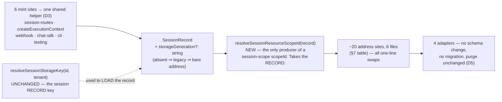

# FIX-1000: A create racing session deletion lands in a purged, caller-reusable scope — fence the scope generation — Implementation Spec

> **Linear issue:** [FIX-1000](https://linear.app/fixpoint-labs/issue/FIX-1000) · **Epic:** [FIX-980](https://linear.app/fixpoint-labs/issue/FIX-980) — Honest task substrate · **Precondition met:** [FIX-992](https://linear.app/fixpoint-labs/issue/FIX-992) has merged (#1035 / #1039 / #1036), so the lifecycle column, the retained tombstone and the conformance case this spec references are all on `main` at `26664927` · **No external blockers.**

## The short version

Delete a session, create a new one with the same id, and the new one can be born holding a row the old one's still-running action wrote after the delete. **Fix: give each session record a random generation string, and address its resources by that instead of by its id.** The straggler's write still lands — into an address nobody will ever read again.

**Size: Small — 1 PR.** One optional field, one derivation, ~20 one-line call-site swaps in six files. No adapter change, no migration, no breaking type, no new mechanism.

## Spec evolution *(the change story, not an audit log)*

- **v1 — drafted.** Framed as an *addressing* problem rather than a concurrency one: the cross-key invariant "no live rows in a purged scope" is unexpressible as a predicate, so the scope stops being re-addressable instead of being defended. The premise was run rather than asserted (§7). Two enumerations that would have shipped wrong were caught by running the command instead of reading. Medium / 1 PR.
- **v2 — scope cut, direction unchanged.** Review challenged the size, correctly. Two things came out. **D3's required field is dropped for an optional one:** required enumerates *mint sites*, but the dangerous set is *read sites*, which it does not cover — and it costs a breaking change to a published type plus churn in ~20 test files that build record literals. **D5's reclamation is split into its own issue:** it is the only part that needs a new per-adapter hard-delete path, and it is a storage-cost deliverable riding on a correctness fix. What replaces the compiler as the completeness check is one test pinning the two address producers together (§10). Medium → **Small**.

<details>
<summary><b>For reviewers — what this document is</b></summary>

This is a **direction document**, not an implementation. Reviewing it well means answering one question: **is this the right approach?**

**In scope to challenge:** the problem framing · the approach · any numbered **Decision** in §6 · missing constraints that would **invalidate** the design · scope.

**Out of scope — deliberately unsettled, owned by the implementing agent:** names, signatures, file paths, module layout · local structure, which helper, error-message wording · micro-optimizations and style · test names and internal test structure (the *behaviours* are in §10) · anything Part II left open on purpose · **the POC on this branch, entirely** — it is throwaway, it never ships, and its findings are summarized in §7.

Feedback in the second list is recorded verbatim in **§13**. It will not be argued with and will not be folded into the design prose. One mention is enough for it to land.

**One ask, because the epic has paid for it six times.** The tables below are search results and each carries the command that produced it. **Re-run the command rather than re-reading the table** — and if you believe an entry is missing, paste the output that shows it. Both commands use `grep -a`: `packages/engine/src/context/resource-registry.ts` contains a NUL byte, so a bare `grep` reports it binary and prints nothing, which is indistinguishable from a clean run.

</details>

---

## Part I — The Case *(for the human)*

### 1. Problem — why it matters, why now

**In plain language.** You can delete a session and immediately create a new one with the same name. The new session is supposed to start empty. It doesn't always: if any work was still running when the delete landed, that work can write into the session *after* it was emptied, and the brand-new session is born holding it. From outside it looks like data from a deleted session leaking into a fresh one that shares its name.

**Why FIX-992 could not close it — this is the whole shape of the problem.** FIX-992 gives every write a per-key predicate (`lifecycle = 'live'` plus a version). That fences any key that *existed* when the purge ran. It cannot fence a key that never existed: a create carries `expectedVersion: 0`, meaning *no live row*, and a never-existed key satisfies that against a purged scope exactly as against a fresh one. **"No live rows in a purged scope" is a cross-key invariant, and no per-key `WHERE` clause expresses one.**

**How often this happens, honestly.** It needs an action in flight at the instant the delete lands, *and* id reuse. The realistic shape is a "reset conversation" button on a natural key while a stream is still running — real, not test-only, but not common either. The priority is inherited from the epic (FIX-992 named this as its residual and pinned it with a conformance case at `stores/testing/resource-store-conformance.ts:809`), not from incidence.

**It was run, not argued.** The conformance case proves the store *permits* the write. A characterization POC on this branch drives it end to end through the real routes and the real registry, and the brand-new session inherits the row (§7). Exposure is proportional to how long an action runs, not to a two-statement window.

### 2. Solution in plain terms

**Stop defending the scope; stop re-addressing it.** A session record mints a **storage generation** when it is created. Session-scoped resource state and content are addressed by that generation, so a session recreated under the same caller-supplied id reads a *different* address. A straggler write still commits — nothing stops it, and nothing needs to — but it lands where no future reader will look. Unreachable, not fenced.

Three things fall out of that, and they are why this shape wins rather than merely works:

1. **It reaches `ContentStore`, which no predicate can.** Content is last-write-wins by decision (FIX-992 D3) and carries no version at all, and `handleDeleteSession` purges both stores (`session-routes.ts:219-222`). An address change is not a predicate, so it fences both identically.
2. **It costs no migration.** `scope_id` is an opaque string in every adapter — `TEXT NOT NULL` in SQLite/Postgres, a map key in memory, an `encodeURIComponent`'d directory on the filesystem. Nothing is added to a schema; a string gets longer.
3. **Every smaller guard fails the same way.** Purge-again-on-create, a dirty-scope check, a scope-level sentinel, a timestamp fence — each closes the window *up to some instant*, and the straggler holds a live context for its whole remaining life. Forcing a fresh address at session creation is the minimum that actually closes it.

**Philosophy.** *Tenet 5* — the defect is session identity, not the resource store, and the convergence point already exists: most session-scope resource calls read their address off a loaded record. *Tenet 3* — one optional field and one derivation; no column, barrier, sweep or new store method. *Tenet 1* — this is the move `resolveSessionStorageKey` already made for tenancy (FIX-682): isolation by namespacing the address, not by a check at every reader.

### 3. Tradeoffs & alternatives

| Rejected | Why |
|---|---|
| **Quiesce in-flight executions before the purge** | Needs a sound liveness signal; FIX-992's POC showed the request record is not one at either end (FIX-1002 / FIX-1001). Two blocking dependencies to *start*, and then DELETE blocks for an unbounded interval |
| **A scope-generation column every write predicates on** | The closest competitor. Cannot reach `ContentStore` (no version, no predicate surface), needs the generation at every write site anyway — the whole plumbing cost — *plus* a column, a read filter in four adapters and two migrations. A filter is a thing every reader must remember; an address is a thing a reader cannot get wrong |
| **Refuse session id reuse** | Deletes a capability: `body.sessionId` is caller-supplied so apps can use a natural key, and delete-then-recreate is the reset idiom. Needs a permanent registry of dead ids — the unbounded growth FIX-992 spent five rounds avoiding |
| **Backfill a generation onto existing records** | Moving a live legacy session's address orphans every resource it has. Legacy records keep the bare address; the hole closes on *recreation* instead of on deploy (D7, §9) |

<details>
<summary>Long-form on each, and where the genuine complexity is</summary>

**Quiesce.** A context loads resource state at `createExecutionContext.ts:986` before it persists its record at `:1041`, and the default path writes no stub in front, so *absent* does not mean *no observer* (FIX-1002). `drainRequestWorkPool` runs only on the success path (`runAction.ts:1409`), so *terminal* does not mean *no observer* either (FIX-1001). And nothing bounds the wait: FIX-992 round 4 established that `runAction` sets no deadline, `ToolsConfig.defaults.timeoutMs` is per-tool and opt-in, and `scope-lock.ts:40` documents that its own timeout does not cancel the mutation.

**Predicate column.** It need not be a barrier — a straggler write could land carrying a stale generation and be filtered out by readers, which is sound. It loses on coverage (`ContentStore`), on cost (everything the address approach needs, plus a column and two migrations, immediately after FIX-992 did exactly that work), and on failure mode (a forgotten filter is silent; a wrong address is impossible).

**Id reuse.** `apps/docs/docs/persistence/overview.md:136` documents the natural-key pattern. Refusing reuse also does not cover the five non-route mint sites (§7).

**Where the genuine complexity is.** In order: (1) the *read* sites — a missed one means writer and reader disagree, which is silent data loss, and it is the only real risk in this change (§10 pins it); (2) `createExecutionContext`, which creates the record it must then read the generation from, in the same function; (3) deciding what a straggler write should do, which this spec answers with "nothing" (D6).

</details>

### 4. Focus practices

- **A cross-key invariant is an addressing problem, not a predicate problem.** FIX-992's lesson was *a predicate fences a row, not an absence*. The corollary: when what you must fence is the absence of rows across a whole scope, make the scope unnameable. Ask of any guarantee — *is there a version of this where nothing has to be checked at all?*
- **Enumerate by a command, then pin the result with a test.** Both of this spec's enumerations were wrong by inspection before they were run (§7). Where a type can own the list it should; where it cannot, a test that fails when the list is incomplete is the substitute (§10) — an unpinned table is a claim, not a check.
- **Use `grep -a`.** `resource-registry.ts` carries a NUL byte at line 619; a bare `grep` prints nothing for it, and a clean grep and a skipped one look identical. Recorded in `docs/architecture/state-and-scopes.md:98`.
- **BP-030 / BP-035.** A stored record without the new field reads as *legacy*, never as *broken*; the delete/recreate, in-flight-straggler, multi-tenant and legacy paths all need stated behaviour (§9).

### 5. What using it looks like

**Public flow-authoring API: unchanged.** No block signature moves, no route gains a parameter. What changes is a guarantee.

```ts
// The observable behaviour, from a client. Today the last line can be non-empty.
await sessions.delete("user-123-main");
await sessions.create({ sessionId: "user-123-main", userId: "u1" });
const state = await sessions.getState("user-123-main");
// after: always the flow's declared defaults, even if an action was still
// running when the delete landed
```

At the internal seam, a session-scope resource address is derived from the record rather than from the id:

```ts
// before — the address is the session's storage key
await stores.resourceState.getAll("session", session.id);

// after — the derivation takes the RECORD, so a caller holding only an id
// cannot produce an address without loading one first
await stores.resourceState.getAll("session", resolveSessionResourceScopeId(session));
```

### 6. Decisions & rules — the sign-off surface

1. **Fence by address, not by predicate: a session record mints a storage generation, and session-scoped resource state and content are addressed by it.** *Rejected:* quiescing; a predicated generation column; refusing id reuse (§3). *Ramification:* a straggler write still commits and is not an error — it lands in a generation nothing can address. No barrier, no liveness signal, no observer question, and it covers `ContentStore`.

2. **The generation is a freshly generated nonce, not a counter, and it is opaque.** Mint with `crypto.randomUUID()` — already used in `core`/`tools`, and unlike `generateId()` it carries no timestamp semantics anyone could come to depend on. *Rejected:* an incrementing generation per session id — a counter must read the previous value, and deletion removes the record that held it, so two successive generations would both be `1`, reproducing the collision. The separator is the implementer's, but state it in the module doc: `scope-keys.ts` already documents `:` caveats for tenancy, so `#` is the safer default. Nothing inverts a session-scope resource address today (`toBareSessionId` has one call site, on the *record* key), so opacity costs nothing.

3. **The field is optional on `SessionRecord`, and every production mint site sets it through one shared helper.** *Rejected:* a required field. *Ramification:* this reverses v1, and the reasoning is the failure modes, not the effort. A **missed mint site** degrades to today's behaviour — the session is unfenced, nothing breaks. A **missed read site** makes writer and reader disagree, which is silent data loss. Required catches only the first and costs a breaking change to a type the published `testing` package exposes, plus churn in the ~20 test files that build record literals. The convergence that actually pays is a single `mintSessionRecord()`-style helper in `engine` used by all six sites (FIX-995 and FIX-992 both paid for exactly this), plus one test per mint path (§10). A *stored* record without the field is legacy and reads at the bare address (BP-030).

4. **One derivation owns every session-scope resource address, and it takes the record, not the id.** Name it `resolveSessionResourceScopeId(record)` and put it in `scope-keys.ts` beside `resolveResourceScopeId` — the module's helpers are uniformly `resolve*`, and the sibling naming is what tells the next reader these two answer different questions. *Rejected:* threading a generation string alongside the session id. *Ramification:* a call site holding only a `sessionId` cannot produce an address without loading the record. `resolveSessionStorageKey` keeps its current meaning (the *session record* key) and is not touched.

5. **The purge is unchanged, and session-scope tombstone reclamation moves to its own issue.** *Rejected:* v1's hard delete of the purged generation. *Ramification:* this is the other half of the scope cut. Reclamation is genuinely unlocked by D1 — a dead generation needs no observer question, so it is safely hard-deletable — but it is a *storage-cost* deliverable riding on a *correctness* fix, and it is the only part that needs a new wholesale hard-delete path in four adapters (`ResourceStateStore.deleteAll` bulk-*marks* today; content already deletes). Keeping the marking purge also means **one** purge path rather than a legacy-vs-generation branch. The cost of deferring: a purged generation's tombstones are unreachable garbage until the follow-up lands. **FIX-992 §12 hands reclamation to this issue; this spec hands it on rather than half-doing it** (§12).

6. **A straggler write is not an error and is not reported.** *Rejected:* failing the write, or emitting a warning. *Ramification:* detecting one means reading the session record on every resource write — a per-write round trip to report an event nobody can act on, on a path FIX-992 just made cheap. The write lands in a dead generation and is garbage.

7. **Legacy session records are not backfilled and are not retro-fenced.** *Rejected:* minting a generation for existing records. *Ramification:* a record with no generation addresses the bare scope id, exactly as today. The hole closes on recreation rather than on deploy — one narrow case stays open, named in §9 and put to the gate in §12.

**Non-goals.** Quiescing in-flight executions · reclaiming a purged generation's rows (D5 → §12) · reclaiming user- or org-scoped tombstones and any liveness signal that would make it possible ([FIX-1002](https://linear.app/fixpoint-labs/issue/FIX-1002) / [FIX-1001](https://linear.app/fixpoint-labs/issue/FIX-1001)) · cross-record atomicity between the state and content stores ([FIX-854](https://linear.app/fixpoint-labs/issue/FIX-854)) · the `maxInstances` cap race ([FIX-981](https://linear.app/fixpoint-labs/issue/FIX-981)) · per-key delete semantics, versioning, or the CAS driver (all FIX-992's, unchanged) · any change to the public flow-authoring API or to `resolveSessionStorageKey`'s meaning · tenant-namespacing the transport mint sites (§12).

---

## Part II — The Build Plan *(for the implementing agent)*

### 7. Technical design

Two things change: the **session record** gains a generation, and the **session-scope resource address** is derived from it instead of from the session's storage key.



**The address sites — this is the list that matters.** A missed one is silent data loss (D3), so it is enumerated by file rather than by count:

| File | Sites | Today | Change |
|---|---|---|---|
| `routes/resource-routes.ts` | 8 — `:286`, `:344`, `:350`, `:457`, `:458`, `:551`, `:728`, `:745` | `session.id` off a loaded record | one-line swap |
| `routes/state-routes.ts` | 2 — `:149`, `:154` | same | one-line swap |
| `resources/internal.ts` | 2 — `:196`, `:197` | same | one-line swap |
| `routes/session-routes.ts` | 2 — `:220`, `:221` (the purge) | `sessionKey`; record already loaded at `:205` | derive from the record |
| `context/createExecutionContext.ts` | 6 — `:815`, `:877`, `:899`, `:966`, `:992`, `:1901` | `sessionKey` from `:502` | derive **once** after the record is in hand (`:525` loaded, `:602` minted), then swap |
| `packages/testing` | 2 — `runtime/createTestContext.ts:249`, `test-utilities/testFlow.ts:152` | `seedResourceState("session", options.sessionId, …)` | must move with its own mint sites (`:236`, `:138`) or seeded resources go invisible |

<details>
<summary>The two greps, what they miss, and why the mint-site table is not the authority</summary>

```bash
# address sites
grep -ran '\(resourceState\|content\)[?.]*\.\(get\|getAll\|getByPrefix\|set\|delete\|deleteAll\)(\s*"session"' packages/*/src apps/*/src
# mint sites
grep -ran "session\.set(\|session\.delete(" packages/*/src apps/*/src
```

**The address grep misses two files, and one is the biggest consumer.** `createExecutionContext` never calls a store with a literal scope argument — it passes `stores.resourceState` and `"session"` into helpers (`loadDeclaredScopeContent` at `:966`, `loadDeclaredResourceState` at `:992`), so no pattern anchored on `resourceState.get("session"` can see it. `packages/testing` is missed the same way, via `seedResourceState`. Repo-wide, session-scope store calls outside tests live in exactly four `engine` files plus the conformance suite — the set is closed and small, but **the command will not tell you the other two exist.**

**Mint sites — six, in five packages.** Inspection had it at two:

| Site | Note |
|---|---|
| `routes/session-routes.ts:193` (record built `:169-192`) | the HTTP create route; caller-supplied id (`:135`) |
| `context/createExecutionContext.ts:602` (record built `:588`) | implicit creation; must read the generation back for `:966` / `:992` in the same function |
| `transports/webhook/session-resolver.ts:34` | not mentioned anywhere in the issue |
| `chat-sdk/src/session-resolver.ts:40` | ditto |
| `cli/src/commands/run.ts:283`, `:289` | two literals |
| `testing/runtime/createTestContext.ts:236`, `testing/test-utilities/testFlow.ts:138` | first-party published package |

`session-routes.ts:257`, `createExecutionContext.ts:2125` / `:2158`, `runAction.ts:652` spread an existing record and carry the field forward — **verify per site rather than trusting the classification.**

**`resolveSessionStorageKey` is not touched, and its 11 call sites are not a cost.** Nine are session-record lookups only (`createInboundTransportHost.ts:411`, `stream-routes.ts:225`, `runAction.ts:645`, `route-utils.ts:97`, `session-routes.ts:136`, `debug-snapshot.ts:261`/`:430`/`:568`, `resources/internal.ts:186`) — several derive the key without a record in hand, and that is fine: the key *is* how you load one. Two (`session-routes.ts:204`, `createExecutionContext.ts:502`) also become resource addresses, and both already load the record first. **The ambiguity that made this look expensive is that one function served both questions under one name; separating them is most of the fix.**

**Deliberately unchanged, verified rather than assumed.** Per-key `delete` and `evictInstance` still tombstone (FIX-992 D11/D7). `resolveUserStorageKey` / `resolveOrgStorageKey` / `resolveResourceScopeId` are untouched: `deleteAll` is only ever called with `"session"`, so no other scope has a purge to fence.

</details>

<details>
<summary>What the POC established, and what it did not</summary>

`spec-poc/FIX-1000-purged-scope-create/` — a characterization POC, throwaway, never merged, not to be reviewed as code. It answers one question: *is the purged-scope create reachable on the real path, or only at the store's own API?* Run it:

```bash
cd spec-poc/FIX-1000-purged-scope-create && ../../node_modules/.bin/vitest run
```

**Three bug repros on the real path**, all passing on `main` at `26664927`:

| Case | Result |
|---|---|
| An in-flight context's create of a previously-absent key, after a real `DELETE /sessions/:id` | **Lands.** A session recreated under the same id inherits `tasks/late` |
| The same interleaving for a key that **existed** before the purge | **Correctly fenced** by FIX-992's retained version. This is the discrimination check — it is what makes the row above evidence rather than a broken harness |
| `ContentStore` under the same purge | **Leaks, with no version to check** — the argument in D1 for an address over a predicate |

**Plus one proposed-shape demo, which is not evidence of anything broken:** a per-generation scope id at the store layer (manual `gen1`/`gen2`, no router, record or derivation) makes the straggler unreachable in both stores. Labelled separately here so "four cases, all passing on main" is not read as four production-path failures.

**What it does not establish:** it arranges the interleaving deterministically rather than racing it, so it shows the ordering is *reachable and consequential*, not how *likely* it is. It uses in-memory stores; the store-layer fact is already pinned across all four adapters by FIX-992's conformance suite.

</details>

### 8. Implementation sequence

One PR. The read-site conversion (step 3) is the whole risk; everything else is mechanical.

1. **Add `storageGeneration?: string` to `SessionRecord`, plus the shared mint helper in `engine`, and call it from all six mint sites** (D3). → *verify:* one test per production mint path asserts the record carries a generation.
2. **Add `resolveSessionResourceScopeId(record)` to `scope-keys.ts`** (D4), and fix the module doc at `:65-67`, which currently claims `resolveSessionStorageKey` serves both the record key and the resource `scopeId` — the exact ambiguity being removed. → *verify:* a legacy record derives the bare scope id, byte-identical to today.
3. **Convert every address site in §7's table**, including the two the grep does not find. Derive once per function where the record is already loaded rather than at each call. → *verify:* §10's seam test, then the full engine suite green with no behavioural diff for a legacy record.
4. **Leave the purge alone** (D5) — it now passes a derived address instead of `sessionKey`, and that is the only change to `handleDeleteSession`.
5. **Retitle the conformance case** at `stores/testing/resource-store-conformance.ts:809` rather than deleting it. It is a *store*-level case and the store is unchanged, so it stays true — say what it now means ("a per-key predicate cannot fence this; the address is what fences it, see FIX-1000"), and add the route-level spec (§10) that proves the hole is closed where it mattered.
6. **Docs (§11) and a changeset** (BP-022, `patch`).

**What gets removed.** The implicit rule that `resolveSessionStorageKey`'s result doubles as a resource address — the ambiguity this defect grew in.

### 9. Edge cases & error handling

**The one exposure that survives, stated up front:** a session created *before* the upgrade, deleted while an action is in flight, and recreated under the same id, is **still unfenced** — both generations are the bare address. Closing it needs a backfill, which orphans every existing session's resources (§3). Recommended: accept. Put to the gate in §12.

<details>
<summary>Full edge-case table + BP-035 second-path checklist</summary>

| Case | Expected behaviour |
|---|---|
| **Create racing the purge, previously-absent key** (the defect) | The write lands in the dead generation. The recreated session reads a different address and does **not** inherit it (D1) |
| **Create racing the purge, key that existed** | Unchanged — FIX-992's retained version conflicts, terminal. Still tested |
| **`ContentStore` write racing the purge** | Same as the state store: lands in the dead generation, unreachable. The first coverage this path has had |
| **Legacy session record, no generation** | Addresses the bare scope id, byte-identical to today. No backfill, no migration, no behavioural diff |
| **Legacy session deleted and recreated** | The recreated record **has** a generation, so it reads a fresh address and does not inherit |
| **Legacy session, live, action in flight across a concurrent delete** | **Still exposed** — see above. Bounded and named, not closed |
| **In-flight context writing after its session was deleted** | Succeeds, writes garbage into a dead generation, reports nothing (D6) |
| **Same session id, two tenants** | Unchanged. The generation composes onto a scope id that is already `${tenantId}:${sessionId}` |
| **Session recreated twice in a row** | Each mint is an independent nonce, so generation *N* never collides with *N−1* (D2) |
| **Ephemeral session** (`createExecutionContext`'s `ephemeral_…` id) | Gets a record and a generation like any other; nothing special-cases it |
| **Filesystem adapter** | One directory per generation, `encodeURIComponent`'d (`filesystem-resource-store.ts:149`). A UUID can never be `""`, `"."`, `".."` or a Windows reserved name, so `validateScopeId` (`:131-139`) passes |
| **Filesystem, very long caller-supplied session id** | The generation adds bytes to a directory name that already carries the tenant and the caller's id, against the 255-byte segment limit. **Narrows existing headroom; does not create the limit.** Worth a boundary test |
| **SQLite / Postgres** | `scope_id` is `TEXT NOT NULL` — unbounded, no migration |
| **A new session mint site added later** | Not caught by the compiler (D3). Caught by §10's per-path mint test only if the new path is added to it — this is the accepted cost of the optional field |
| **DevTool / debug surfaces** | Route through `session.id` on a loaded record, so they follow the generation automatically. A displayed scope id now shows it — cosmetic |

**Second-path checklist (BP-035).** *Legacy* — three rows above; a stored record with no generation must never read as broken. *Null boundary* — an absent generation means *legacy*, not *empty string*; `== null`-guard rather than a truthy check, or an empty-string generation silently addresses `${id}#`. *Concurrent-409* — the create route's read-then-act existence check (`session-routes.ts:137-142`) is racy today and this spec does not fix it; two concurrent creates can both mint, and the loser's generation is orphaned (§12). *Cancel/error* — a straggler write after cancellation behaves exactly as one after a delete: lands, unreachable. *Multi-tenant* — above. *Cost/observability* — no new store round trip on any path. *Flag off/new state* — the legacy path **is** the off state and is tested explicitly.

</details>

### 10. Testing strategy

**Goal check.** *"A session deleted and recreated under the same caller-supplied id starts empty, even when an action was in flight across the delete."* The POC's first case, graduated: through the real router and a real execution context, against SQLite so it is not an in-memory artifact. Model-free.

**The one test this design depends on.** Because D3 gives up the compiler, completeness of the read-site conversion rests here: **write a session resource through a route, then read it inside an execution context — and the reverse.** That pins the two address producers to each other, so a missed swap in either fails loudly. It does not exist today: `resource-state-routes`, `resource-collection-routes`, `scope-persist-routing` and `resource-flow-isolation` never run an action, so the route ↔ context seam is currently unpinned, which is exactly where a missed swap would hide.

**Contended tests are mandatory, and the interleaving is the test** — every assertion below passes trivially if the delete and the create do not overlap, which is why the defect survived FIX-992's suite.

**CI specs (observable behaviours).**

- A create of a previously-absent key from a context that outlived a `DELETE /sessions/:id` is **not** visible to a session recreated under the same id. *(The defect. Fails on `main`.)*
- The same for `ContentStore` content, not just resource state.
- A key that existed before the purge is still fenced by its retained version — FIX-992's guarantee is not regressed.
- The route ↔ context seam, both directions (above).
- A session record from **each** production mint path (HTTP route, execution context, webhook resolver, chat-sdk resolver, CLI) carries a generation. One test per path, because this failure is silent.
- `packages/testing`'s seeded session resources are visible to a flow under test — the seam that breaks if `createTestContext` mints a generation but seeds at the bare id.
- A legacy record with no generation reads and writes at the bare scope id, unchanged across the upgrade; a legacy session deleted and recreated does **not** inherit.
- Two successive recreations produce three distinct addresses.
- Filesystem: a purged generation's directory is gone and the surviving generation's is intact; a long session id plus a generation stays within the segment limit.
- The store conformance case at `:809` stays green, retitled (§8 step 5).

### 11. Documentation plan

| File | Change |
|---|---|
| `packages/engine/src/stores/scope-keys.ts` | **Fix the module doc** (`:65-67`) — it says `resolveSessionStorageKey` is used for both the record key and the resource `scopeId`, which this change makes false. Provenance travels with the split (BP-034) |
| `docs/architecture/state-and-scopes.md` | **Extend + correct.** `:119` lists the purged-scope create under "what per-key CAS honestly does not close" — it is closed, by an address rather than a predicate; say so and point here. Add a short subsection on the storage generation beside the tenancy model, and cross-ref `scope-keys.ts`. `:80` ("nothing reclaims a tombstone") stays true — D5 defers reclamation |
| `apps/docs/docs/persistence/overview.md` | **Extend.** Beside the multi-tenant isolation section (`:97-106`), which documents the analogous `${tenantId}:${sessionId}` namespacing. Say what a reader can rely on — delete-then-recreate starts clean — and that no migration or manual step is involved |
| `apps/docs/docs/fundamentals/state-and-scopes.md` | **One paragraph, only if** it currently describes session-scoped resource lifetime. Check before writing |
| `packages/engine/README.md` | **Extend** if it documents `SessionRecord` or the store contracts (BP-009) |
| `.changeset/*.md` | **New**, `patch` (BP-022) |

**Voice constraints for the user-facing pages** (`CLAUDE.md` → Writing Style): describe what the reader can rely on, never the race that prompted it or the issue that fixed it. No internal issue ids under `apps/docs/`. Don't use "generation" as unexplained jargon on first use. Watch em-dash density — the persistence page is already dense with them.

**Not proposed:** a new page, a blog post, a guide.

### 12. Dependencies, open questions & follow-ups

**Nothing blocks this.** FIX-992 has merged and is on `main` at `26664927`; every line reference is verified there. FIX-1002 and FIX-1001 are **not** dependencies — they gate a liveness-signalled sweep, and the point of D1 is that unreachability needs no liveness signal.

**Settled by running (§7):** *is the purged-scope create reachable on the real path?* — **CONFIRMED**, with a discrimination check that fails if the harness cannot reach the store. **Not reopened** by restating either side.

**Open question for the gate:** whether §9's one surviving exposure is acceptable (a pre-upgrade session, deleted mid-action, recreated under the same id). Recommended: accept.

**Follow-ups (flagged, not built):**

- **Session-scope tombstone reclamation** — D5's other half, and the largest of these. A dead generation is safely hard-deletable with no observer question, but it needs a wholesale hard-delete path in four adapters (`ResourceStateStore.deleteAll` bulk-*marks*; the filesystem's `purgeScopeDirectory` at `:91` is the primitive it wants). **FIX-992 §12 assigns reclamation to FIX-1000 — this must be filed, or the epic will believe it shipped.**
- **Rows a straggler writes *after* the purge are not reclaimed** (D6). Reclaimable in principle by the same follow-up — a pass could delete any session-scope generation whose record no longer exists — but no adapter can enumerate scope ids today. Small and bounded: per-action, not per-key.
- **User- and org-scoped tombstone reclamation.** Different problem: nothing purges those scopes, so their tombstones come from per-key deletes in scopes never torn down. Needs a liveness-gated sweep, hence FIX-1002 + FIX-1001.
- **`handleCreateSession`'s existence check is a read-then-act** (`session-routes.ts:137-142`): `get` then `set(..., "any")`, so two concurrent creates of the same id can both pass. The store already takes an `ExpectedVersion`, so the fix is `expectedVersion: 0` and a 409 — the move FIX-992 D12 made for the collection-item route. Pre-existing; made slightly more visible here.
- **The webhook and chat-sdk resolvers key sessions by a bare `sessionId`**, not by `resolveSessionStorageKey`, so a session created through either is not tenant-namespaced. A tenancy question, not a concurrency one.
- **Two candidate BPs** for `distill-lessons`: *when an invariant spans keys, change the address rather than adding a predicate*; and *a required field enumerates writers, not readers* — pick the enumeration mechanism by which set is dangerous, which is the reasoning that flipped D3.

### 13. Review notes for the implementer

Below-the-bar spec-PR feedback, recorded verbatim — inputs, not instructions.

**Round 1 — Cursor `/simplify` (direction approved).** Eight of its findings are folded into the design above (enumeration gaps in `createExecutionContext` and `packages/testing`; the `deleteAll` mark-vs-delete correction, which became D5's split; the dual purge path, which the split removes; the shared mint factory, now D3's convergence point; `resolveSessionResourceScopeId` naming; `crypto.randomUUID()` and the separator; the `scope-keys.ts` module doc). Recorded rather than folded:

- *"Enumeration counts (6 sites / 11 RSK call sites) repeat ~5×; POC narrative repeats in §1/§2/§7/§12. Deduping to §7 would shorten the spec without changing decisions."* — adopted in v2's rewrite; noted here because it was a review input, not a design change.
- *"Dual purge path … Acceptable if §9's surviving exposure is gate-approved."* — the exposure is at the gate (§12); the dual path no longer exists after D5's split.
- *"The fourth [POC] test … is a store-layer sketch, not broken-today evidence — worth labeling separately in §7."* — done.
