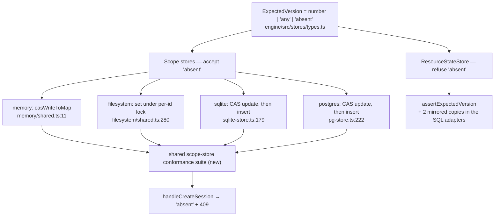

# FIX-1007: Scope stores cannot express create-if-absent, so Workstream get-or-create races — Implementation Spec

> **Linear issue:** [FIX-1007](https://linear.app/fixpoint-labs/issue/FIX-1007) · **Epic:** [FIX-939](https://linear.app/fixpoint-labs/issue/FIX-939) — Durable jobs & detached-task substrate ([epic-spec](https://github.com/fixpoint-labs/flow-state-dev/blob/epic/durable-jobs/docs/specs/_epics/durable-jobs.md) → N5a, N62) · **Blocks:** [FIX-982](https://linear.app/fixpoint-labs/issue/FIX-982) · **No blocking dependencies** — [FIX-992](https://github.com/fixpoint-labs/flow-state-dev/pull/1036) has merged, and this spec deliberately does *not* build on its sentinel.

## The short version

Two requests can create the same session at the same time and both succeed, because no scope store can express "write this only if it does not exist." The obvious fix — copy `ResourceStateStore`, where `expectedVersion: 0` already means create-if-absent — **does not work here**, and that is this spec's main finding. `ResourceStateStore` reserved `0` by starting its versions at `1`. The scope stores create records *at* version `0`, so `0` is a real, live version with real, live callers.

**Fix: add a distinct sentinel, `expectedVersion: "absent"`.** It says exactly one thing, it means the same thing in every store, and it cannot collide with a version number.

**Size: Medium — 1 PR.** Four adapters, one shared type, a shared conformance suite, one real caller. No schema migration, no data migration, no behaviour change to any existing caller.

## Spec evolution *(the change story, not an audit log)*

- **Spec drafted.** The issue and the epic (N62) both frame this as a *port* of FIX-992's `expectedVersion: 0`. Research refuted that premise: scope records are born at version `0` and the first CAS write on every new session passes `0` against a live row, so redefining `0` breaks a pinned contract. The framing moved from "port a sentinel" to "the sentinel is unavailable — add a distinct one," which also dissolves the tombstone question the issue expected to be the main decision.
- **Review round 1.** Three judgment calls the draft left open are now closed with evidence rather than preference: Decision 1 carries the explicit cost comparison against a `createIfAbsent()` method; Decision 3's "I wouldn't argue hard" wobble is settled against the alias, on the `delete` path the estimate missed; Decision 6 now names `createExecutionContext` as the second racing caller — the one on the epic's hot path — and argues its exclusion instead of omitting it.

<details>
<summary><b>For reviewers — what this document is</b></summary>

A **direction document**. The one question is: is this the right approach? The full reviewer contract — what is in scope to challenge, what is deliberately unsettled and owned by the implementer, and why §7's sketch is pseudocode — is in the PR description and in [`docs/contributing/pr-reviewer-guidance.md`](../contributing/pr-reviewer-guidance.md). Out-of-scope feedback is recorded verbatim in **§13** rather than argued with; one mention is enough for it to land.

**One ask specific to this spec.** Every claim that decides the approach carries a `file:line`, and the behavioural ones carry the probe that produced them (§7). **Check the citation rather than the prose** — and if you believe a claim is wrong, paste the output that shows it.

</details>

## Parts worth reviewing closely

> **1. Decision 1 — a third member on a shared union.** `ExpectedVersion` threads through two store families with deliberately different semantics, and I am widening it rather than minting a scope-only type or a `createIfAbsent()` method. The cost table is in Decision 1; the judgment is whether you price a one-time enumerable audit above or below permanent interface surface.
>
> **2. Decision 2 — no tombstones.** The issue expected this to be the main decision and priced it as what makes the change Small vs Large. I decline them and accept version reuse on a recreated id. Is delete/recreate genuinely FIX-1000's hazard (it fences by address), or does the scope record still need monotonic versions? A wrong answer here is a migration we skipped.
>
> **3. Decision 6 — caller scope.** `createExecutionContext` races the same way the public route does, and it is the path FIX-982 actually takes. This spec rewires the route and deliberately does **not** rewire `createExecutionContext` — the two need different semantics, and the second is get-or-create, FIX-982's subject per the epic's own split. If that split is wrong, this is the decision to push on.

---

## Part I — The Case *(for the human)*

### 1. Problem — why it matters, why now

**In plain language.** Two things happening at once can both create the same session, and both think they won. There is no way to ask the store for "make this, but only if nobody made it already." The store's answer to a create is always yes.

**Why now.** The durable-jobs epic routes a Workstream — a sub-session dedicated to one body of work — by *deriving* its id from the work it belongs to. Two coordinating requests in one parent session naturally target that derived id at the same time (request concurrency defaults to `allow`), so the framework needs the loser to fail. It cannot fail today. FIX-982 is blocked on exactly this.

**Two call sites race today, not one.** Both read, check, then write, and read-then-act is all that is available to them:

| Site | The race |
|---|---|
| `session-routes.ts:137-142` → `:193` (public `POST /session`) | Two concurrent creates of one id both pass the existence check and both write. The second silently overwrites the first |
| `createExecutionContext.ts:584` (user), `:602` (session), `:664` (org) | Implicit creation when an action runs against an unknown id. Same read-then-`set(…, "any")` shape, on every action execution — **and this is the path a Workstream dispatch takes**, via `runAction.ts:1020` |

The second is the epic's hot path and the more consequential; Decision 6 settles which this issue rewires and why.

**This is about to get worse.** FIX-1000 (in review, a sibling epic) gives each session record a storage generation so a recreated session cannot read a deleted one's resources. Once that lands, two concurrent creates mint *two different generations* and the loser's write clobbers the winner's record — so any resource the winner already wrote becomes permanently unaddressable. FIX-1000 mints at **both** sites above (its §7 mint table names `createExecutionContext.ts:602`), so both inherit the hazard. Its own second-path checklist names it and proposes "`expectedVersion: 0` and a 409." **That fix does not work**, for the reason in §2, and this spec is what makes it work.

### 2. Solution in plain terms

Give the store a way to say **"only if absent"** — a distinct value, `expectedVersion: "absent"`, alongside the version numbers and the existing `"any"`.

#### Why the obvious port is unavailable *(the canonical statement — §3, §6 and §7 point here rather than restate it)*

`ResourceStateStore` shipped create-if-absent three weeks ago and spells it `expectedVersion: 0`. Copying that is the obvious move and is what the issue and the epic both assume. It is not available, for one reason:

> `ResourceStateStore` starts its versions at `1`, which is what leaves `0` free to mean "no live row." **The scope stores create records at version `0`** (`createExecutionContext.ts:580, 597, 660`; `session-routes.ts:187`) **and write them with `"any"`** (`:584, :602, :664`; `session-routes.ts:193`). So a brand-new session is a *live row at version 0*, and the first state write on it passes `expectedVersion: 0` through `runWithCAS` → `createScopePersist` → `store.set` (`scope-persist.ts:148`) and must succeed.

`store-cas-contract.test.ts:79-84` pins exactly that — `set(id, rec, 0)` succeeding against an absent record and then again against the live v0 row it just made. Redefining `0` breaks the first write of every new session, user and org. The behaviour was confirmed by running it, not by reading it (§7).

So the sentinel is taken. A word that is not a number cannot be taken, cannot be confused with a version, and needs no migration to introduce.

**Philosophy.** *Tenet 5 (fix at the owning layer)* — the race is unwinnable at the call site because the store cannot express the condition; the fix belongs in the store contract, at the four points where every scope write converges, not in a retry at each caller. *Tenet 1 (coherence)* — the codebase already documents that these two store families diverge on what `0` means (`types.ts:596-604`, `engine/README.md:531`); this adds a spelling that means one thing in both rather than deepening the divergence. *Tenet 3 (earn every addition)* — one union member, no new method, no column, no migration.

### 3. Tradeoffs & alternatives

| Rejected | Why |
|---|---|
| **Redefine `0` as create-if-absent (the literal port)** | Unavailable — §2. Breaks the first CAS write on every new scope record; pinned at `store-cas-contract.test.ts:79-84`. BP-030 |
| **Rebase scope versions to start at `1`, freeing `0`** | Makes the port legal at the cost of a data migration over every persisted scope row in three backends — and a legacy row at version `0` becomes indistinguishable from absence, the same ambiguity in a new place |
| **A `createIfAbsent()` method instead of a sentinel** | Avoids the union audit entirely, at roughly double the edits and a permanent second way to write a scope record. Costed in Decision 1 |
| **Bring tombstones to the scope stores** | The issue expected this to be the main decision. It is real work — lifecycle semantics in four adapters, two schema migrations, read filtering, a retention policy — and it does nothing for the race this issue exists to close. It only makes versions monotonic across delete-and-recreate: a different hazard, at a different layer, already owned by FIX-1000 (D2) |
| **A scope-only `ExpectedVersion` variant** | Makes the divergence unrepresentable, which is genuinely attractive. Costs a second type threaded through `DeltaStoreOps` and every scope signature, to protect against a misuse one line in an existing guard already rejects loudly |
| **Fix it above the store (a lock, or retry-and-compare)** | A lock serializes an operation the store could simply refuse; retry-and-compare cannot distinguish "I created it" from "I overwrote someone." Both are workarounds every caller copies — tenet 5's smell |

<details>
<summary>Where the genuine complexity is</summary>

Not in the happy path — the predicate is two lines per adapter. It is in three places:

1. **The 21 sites that branch on `expectedVersion === "any"`** (§7). Adding a union member silently changes what `expectedVersion !== "any"` admits: today it means "a number," tomorrow it means "a number *or* `"absent"`," and the body behind every one of those guards assumes a number. Eleven are scope-store sites that must handle the new value; ten are resource-store sites that must refuse it. A missed one is a wrong answer, not a type error, because `"absent" !== 5` is a perfectly good comparison.
2. **The delta verbs.** `patchField` / `incField` / `pushToArray` / `deleteField` all take `ExpectedVersion` and all read-modify-write an existing record. `"absent"` is meaningless there and must throw rather than conflict.
3. **The SQL adapters' in-band sentinels.** Both resource-state stores carry `-1` as an in-band `"any"` inside a delete predicate (`store-sqlite/src/resource-state-store.ts:258`, `store-postgres/src/resource-state-store.ts:219`). A string reaching a numeric bind parameter is the failure mode that guard exists to prevent.

</details>

### 4. Focus practices

- **Verify the premise before porting it (tenet 7).** Three artifacts — the issue, epic note N62, sibling spec FIX-1000 — encode the same assumption that `expectedVersion: 0` is create-if-absent on scope stores. Reading the `ResourceStateStore` contract would never have shown otherwise; running the scope store took four minutes.
- **A precedent transfers only if its load-bearing property does.** `ResourceStateStore`'s create-if-absent rests on versions starting at `1` — invisible in a signature that is otherwise identical. Mirroring syntax without mirroring semantics is the trap here.
- **Find the convergence point, then pin it (tenet 5).** No shared suite covers the scope-store *CAS* contract today: `stores/testing/` has suites for traces, `RequestStore.subscribeToEvents` and resource state, but scope `set` is pinned only by per-package tests. The resource store's suite is why its four adapters agree; §10 adds the equivalent.
- **BP-030.** Every existing `0`, positive-version and `"any"` caller is unaffected by construction — the design adds a value instead of redefining one.

### 5. What using it looks like

**Public flow-authoring API: unchanged.** No block signature moves, no route gains a parameter. What changes is a store verb and one route's honesty.

```ts
// The store contract — the new value sits beside the two that exist today.
await stores.session.set(id, record, "any");      // unconditional (unchanged)
await stores.session.set(id, record, 3);          // only at version 3 (unchanged)
await stores.session.set(id, record, "absent");   // only if it does not exist (new)

// The loser gets the ordinary conflict shape, so no caller learns a new result
// type: result.conflict.currentValue is the winner's record.
```

From a client, two concurrent creates of one session id: before, both return 201 and the second silently overwrites the first; after, one returns 201 and the other 409.

### 6. Decisions & rules — the sign-off surface

1. **Create-if-absent is a distinct sentinel, `"absent"`, added to `ExpectedVersion` — not a redefinition of `0`, and not a new method.**
   *Rejected:* porting FIX-992's `0` (unavailable — §2); rebasing scope versions to start at `1`; a scope-only variant type; a `createIfAbsent(id, record)` method.
   *The method comparison, since it is the live alternative:*

   | | Sentinel on `set` (chosen) | `createIfAbsent()` method |
   |---|---|---|
   | Type change | 1 line (`types.ts:166`) | none |
   | Scope write predicate | **4** — one per adapter family; each covers session/request/user/org because all four share the helper (`casWriteToMap`, the fs helper, the two SQL helpers) | 4 shared helpers, same place |
   | Interface signatures | **0** — `set` already takes `ExpectedVersion` | 1 on `DeltaStoreOps` (scope-only base), rippling to **16** concrete implementations (4 store kinds × 4 adapter families) |
   | Delta verbs | ~4 guard edits (memory's `checkVersion` covers all 4 verbs × 4 stores) | untouched — Decision 4 dissolves |
   | Resource stores | 3 refusals (`assertExpectedVersion` × 3) | untouched — Decision 3 dissolves |
   | The 21 `!== "any"` sites | **all 21 change meaning**; 11 are the scope sites being edited, 10 are fronted by the 3 asserts | none change |
   | Implementers / mocks / doubles | none break | a required method breaks every external implementer of a public pre-1.0 interface; an optional one (like the delta verbs) means callers feature-detect and silently fall back to the racy path |
   | **Total edits** | **≈ 12** | **≈ 21** |

   *Sign-off:* the method's advantage is real — it removes the audit. It is bought with roughly double the edits, a signature change across sixteen implementations, and a permanent second way to write a scope record that every future adapter must implement and every future reader must know to prefer over `set`. **The sentinel's cost is a one-time, greppable, enumerable audit (§7's grep finds all 21); the method's cost is permanent surface.** Tenet 3 prices the permanent thing. The repo pattern is also sentinel-on-`set` (FIX-992). Decision stands — but §8 now carries the audit as an explicit checklist item rather than leaving it to the grep.
   *Locks in:* `ExpectedVersion = number | "any" | "absent"` is shared by both store families, so every branch over it is a place the semantics can be got wrong; §10 pins all four adapters against one suite. Existing callers are unaffected by construction, not by care.

2. **No tombstones on the scope stores. A recreated id may reuse versions, and that is stated rather than hidden.**
   *Rejected:* porting `ResourceStateStore`'s tombstone lifecycle.
   *Locks in:* `delete(id): Promise<void>` keeps hard-delete semantics, so an observer holding a pre-delete version could match a later generation at the same id. Exposure is narrow — `session.delete` has exactly one caller (`session-routes.ts:223`, the DELETE route), so it needs an explicit user-initiated delete *plus* a concurrent stale-version holder. It is also the wrong layer for that hazard: FIX-1000 fences delete-and-recreate by making the new generation *unaddressable*, and rejected a counter for precisely the version-reuse reason (its D2). If monotonic scope versions are ever needed, that is a migration with its own issue.

3. **`ResourceStateStore` refuses `"absent"` loudly; its `0` keeps today's meaning.**
   *Rejected:* accepting `"absent"` there as an alias for its `0`.
   *Why the alias loses, having been costed properly:* on `set` it is genuinely cheap — one clause in `checkWriteVersion:119`, one in `store-sqlite:202`, one in `store-postgres:151`, and the numeric `expectedVersion + 1` below them is unreachable because both branches return. **The `delete` path is where it breaks down.** `store-sqlite:258` and `store-postgres:219` compute `guard = expectedVersion === "any" ? -1 : expectedVersion` and bind it straight into a numeric comparison, so the alias must special-case both — and, worse, it must answer *what `delete(…, "absent")` means*. Resource `0` has a coherent answer there ("no live row" → the requested terminal state already holds → idempotent success). "Delete only if absent" has none. **The alias does not converge the vocabulary; it gives `"absent"` a second, verb-dependent meaning on the subtlest predicate in the file** — the one whose 24-line comment (`store-sqlite:279-302`) exists because two concurrent deletes already got it wrong once. That inverts the coherence argument that motivated it. Cost is ~8-10 sites across 3 files versus 3 for the refusal, and the 3 are provably total: `assertExpectedVersion` fronts every resource `set`/`delete` in all four adapters (`resource-state-predicate.ts:91`, `store-sqlite:192/:257`, `store-postgres:127/:218`), so `"absent"` is unreachable downstream by construction.
   *Locks in:* `0` still means two different things across one `StoreRegistry` — create-if-absent on resource state, version-equality on scope state. This spec **names that divergence at both call sites** (§11) rather than unifying it. The convergence path — move resource callers to `"absent"`, then retire its `0` — is §12, and it is the right shape precisely because it retires a spelling rather than adding one.

4. **The delta verbs reject `"absent"` rather than accepting it.**
   *Rejected:* treating it as "create the record."
   *Locks in:* `patchField` / `incField` / `pushToArray` / `deleteField` read-modify-write an existing record, so `"absent"` is a programming error at the call site, not a lost race — it throws, matching the posture `assertExpectedVersion` already takes for an out-of-domain version.

5. **One shared conformance suite pins the verb across all four scope adapters.**
   *Rejected:* extending each package's own tests.
   *Locks in:* the scope stores get the thing the resource stores already have and the reason their four adapters agree. It joins the three suites already in `engine/src/stores/testing/` and is exported the same way, from `@flow-state-dev/engine/testing`. This is the completeness check for a contract with four implementations and no compiler to enforce agreement.

6. **`handleCreateSession` is rewired onto the new verb in this PR. `createExecutionContext` is not, and that is a decision rather than an oversight.**
   *Rejected:* shipping the verb with no caller; rewiring `createExecutionContext` here too.
   *Why the route and not the hot path.* `createExecutionContext:584/:602/:664` races identically and is what a Workstream dispatch actually reaches (`runAction.ts:1020`), so the reasonable objection is that this issue fixes the path the epic never takes. Three things decide it:
   - **The epic already split it this way.** "The store half is N5(a) and needs its own issue; the derivation is FIX-982's" (epic-spec §1). This issue is N5a. FIX-982 owns the derived id *and* the wiring that consumes it.
   - **The two callers need different semantics, and only one of them is a one-line swap.** The route wants create-or-**409**. `createExecutionContext` wants create-or-**adopt** — on conflict it must take the winner's record and keep going, because failing the request would be a regression. Adopt is not a swap: the adopted record must then pass the binding validation the load path already runs (`UserBindingMismatchError` `:609-611`, `TenantBindingMismatchError` `:620-626`, `ensureJournalDefaults` `:604`, and the org-immutability check at `:636`), or a lost race silently skips a tenant/user binding check — BP-031 territory. That is three records (user, session, org), each with its own adopt rule.
   - **Adopt-on-conflict *is* get-or-create,** which is the semantics FIX-982 exists to define. Defining it here, with no consumer to validate it against, is the speculative shape tenet 3 rejects.
   *Locks in:* this PR ships the verb plus one real consumer and a real end-to-end assertion (two concurrent `POST /session` → one 201, one 409). **That proves the verb on a production path; it does not exercise the epic's hot path, and this spec does not claim it does.** `createExecutionContext` stays racy until FIX-982 rewires it, which is a pre-existing hole, not a regression — §12 states exactly what FIX-982 inherits. Coordinate with FIX-1000, which edits both the same route region and `createExecutionContext:602` (§12).

> **Non-goals** — Workstream routing itself (FIX-982); **rewiring `createExecutionContext`** (Decision 6, FIX-982's); tombstones or monotonic versions for scope records (Decision 2); changing `ResourceStateStore`'s semantics (Decision 3); reclaiming anything.
>
> **Size:** Medium — 1 PR. Four adapters, one shared type, three mirrored guards, a new conformance suite, one caller, two doc surfaces. No schema or data migration.

---

## Part II — The Build Plan *(for the implementing agent)*

### 7. Technical design

The contract lives in `engine`, and four adapters implement it. Each adapter family already has exactly one place where a scope write decides whether it may proceed — that is where this lands.



**What each adapter needs.** The SQL adapters are already 90% there: both try a CAS `UPDATE` and fall back to an `INSERT` when `expectedVersion === 0`. The new value takes the insert path *without* the update attempt, and treats an existing row as a conflict rather than a success.

- **`@flow-state-dev/engine`** — the type, the two in-repo scope adapters (memory, filesystem), the resource-side refusal, the conformance suite.
- **`@flow-state-dev/store-sqlite` / `store-postgres`** — the scope write predicate plus the mirrored `assertExpectedVersion` copies. These packages depend on `engine` type-only (`scripts/validate-package-boundaries.mjs`), so the guard is restated, not imported — FIX-992's arrangement, and the conformance suite is what keeps the copies honest.
- **Untouched:** `runWithCAS`, `resource-cas.ts`, the registry, every block kind, all persisted schemas.

**The 21 branch sites.** Enumerate them, don't trust this list:

```
grep -rn '=== "any"\|!== "any"' packages --include=*.ts | grep -v test
```

Eleven are scope-store sites that must handle `"absent"` (`memory/shared.ts:18,61` · `filesystem/shared.ts:285,328,335` · `sqlite-store.ts:153,162,187` · `pg-store.ts:160,230,342`); ten are resource-store sites that must refuse it. The hazard is that `expectedVersion !== "any"` currently means "is a number" and silently stops meaning that.

**Solution sketch — pseudocode. Illustrative, not the contract. React to the shape.**

```
in the scope store's write predicate, before the version compare:

    if expectedVersion is "absent":
        if a record exists at this id:
            return conflict carrying that record and its version
        otherwise:
            insert and succeed
        ← done; never falls through to the numeric compare

    otherwise: today's logic, untouched
        "any"  → write unconditionally
        number → compare against the stored version

in the SQL adapters the same thing is one statement, because
compare-and-swap has to be atomic there:

    INSERT ... ON CONFLICT (id) DO NOTHING
    if nothing was inserted → read the winner, return it as the conflict

on the resource side, in the guard that already fronts every set/delete:

    if expectedVersion is "absent": throw   ← one line, three copies
```

**Evidence the premise was run, not argued.** A throwaway probe against the real in-memory session store (deleted; reproduce in three assertions) established all three claims this design rests on:

| Claim | Result |
|---|---|
| `set(id, rec, 0)` against an **absent** record | succeeds — insert |
| `set(id, rec, 0)` against a **live record at version 0** | **also succeeds** — so `0` is not "must not exist" |
| Two concurrent `set(id, rec, 0)` on one id | **both succeed** — the race has no loser today |

`store-cas-contract.test.ts` (8 tests, memory + filesystem) passes on `main` and already asserts the second row deliberately at lines 79-84 and 104-105 — so this is a pinned contract, not an accident.

### 8. Implementation sequence

1. **Widen the type.** `ExpectedVersion = number | "any" | "absent"` in `engine/src/stores/types.ts`, with the contract comment on `SessionStore.set` stating what `"absent"` means and what `0` means *here* (the divergence, named — Decision 3).
2. **Refuse it on the resource side first.** Add the rejection to `assertExpectedVersion` and its two mirrored SQL copies. Doing this before step 3 means a mistake in the scope work surfaces as a throw, not as a silent wrong answer.
3. **Memory adapter.** `casWriteToMap` — the `"absent"` branch ahead of the numeric compare. Also guard the delta-verb path (`checkVersion`).
4. **Filesystem adapter.** Same predicate inside the existing per-id lock. The lock's stated limitation (in-process only, `types.ts:626-631`) is unchanged and must stay stated.
5. **SQLite and Postgres.** Route `"absent"` to the existing insert path, skipping the CAS `UPDATE` attempt, and treat "no row inserted" as a conflict. Postgres already has `ON CONFLICT ... DO NOTHING`; SQLite already catches the PK conflict.
6. **The conformance suite.** New shared suite in `engine/src/stores/testing/`, exported from `@flow-state-dev/engine/testing` alongside the three that live there, exercised by all four adapters from their own packages.
7. **The caller.** `handleCreateSession`: replace the read-then-act (`session-routes.ts:137-142`) with a single `set(..., "absent")` and return 409 on conflict.
8. **Docs and changeset** (§11).

**Audit checklist — do not substitute the grep for this.** Every one of the 21 `expectedVersion !== "any"` / `=== "any"` sites must be visited and classified explicitly:

- [ ] Does the body behind this guard assume `typeof expectedVersion === "number"`? If yes, it needs either an explicit `"absent"` branch or a narrowing test written as `typeof expectedVersion === "number"` rather than `!== "any"`.
- [ ] Does the value reach arithmetic (`expectedVersion + 1`) or a SQL bind parameter? Those are the two places a string fails silently rather than loudly.
- [ ] Is this site reachable with `"absent"` at all, or is it fronted by a guard that already threw? Record which — "unreachable by construction" is a valid disposition, and it is what makes the three resource-side asserts sufficient.

**Removals (tenet 3):** step 7 deletes the `get`-then-check in `handleCreateSession` — the read-then-act goes away rather than being kept alongside the new predicate. No other path is superseded.

### 9. Edge cases & error handling

| Case | Behaviour |
|---|---|
| `"absent"` against an existing record at **any** version, including 0 | Conflict, carrying the existing record and its version. This is the whole feature |
| `"absent"` against an absent record | Insert, at whatever version the caller's record carries |
| Two concurrent `"absent"` writes | Exactly one succeeds. On SQL this is the insert's uniqueness; on memory it is single-threaded; on filesystem it is the per-id lock, in-process only |
| `"absent"` passed to a delta verb | Throws (Decision 4) — a programming error, not a conflict |
| `"absent"` passed to `ResourceStateStore.set`/`delete` | Throws (Decision 3) |
| Existing `0`, positive, `"any"` callers | Byte-for-byte unchanged. The pinning test is the existing `store-cas-contract.test.ts`, which must pass untouched |
| A legacy persisted record at version 0 | Reads as a live record; `"absent"` conflicts against it. No migration, no dual-read — the meaning of stored data does not change (BP-030) |
| Delete then recreate at the same id | Permitted; versions may restart. Stated, not defended — Decision 2 |
| `"absent"` reaching a SQL numeric bind parameter | Must be impossible by construction: the string never enters the numeric path. The in-band `-1` sentinels (`resource-state-store.ts:258`/`:219`) are on the resource side, which refuses `"absent"` at the guard |
| Concurrent implicit creation via `createExecutionContext` | **Still races** — not rewired here (Decision 6). Unchanged from today, and inherited by FIX-982 (§12) |

**Second-path checklist (BP-035).** *Legacy* — a stored v0 record is live, not absent (row above). *Null boundary* — `"absent"` is a string sentinel; guards must test it explicitly, never via falsiness, and `expectedVersion !== "any"` no longer implies `typeof === "number"`. *Concurrent-409* — this change exists to produce one; `handleCreateSession` returns it. *Cancel/error* — no new async path. *Multi-tenant* — the predicate operates on the already tenant-namespaced storage key (`resolveSessionStorageKey`); no tenancy decision moves. *Cost/observability* — the SQL path does one statement instead of two on the create path, so it is cheaper, not dearer. *Flag off/new state* — there is no flag; the off state is every existing caller, pinned by the untouched contract test.

### 10. Testing strategy

**Discipline: `tdd`** (Linear category is a defect in a contract, but the deliverable is new behaviour — red-green per adapter).

**The goal check (BP-003), on the real path:** two concurrent `POST /session` calls with the same `sessionId` → exactly one `201`, one `409`, and one stored record. This is the assertion that would have failed before and passes after; everything below supports it.

**Behaviours to test, in observable terms:**

- `"absent"` against absent → `ok: true`; against live-at-v0 → `ok: false`; against live-at-v3 → `ok: false` carrying version 3.
- Two concurrent `"absent"` writes on one id → exactly one `ok: true`, and the loser's `conflict.currentValue` is the winner's record.
- Every existing behaviour of `0`, positive versions and `"any"` is unchanged — **the existing `store-cas-contract.test.ts` must pass with no edits.** If it needs editing, the design is wrong.
- `"absent"` to each delta verb → throws.
- `"absent"` to `ResourceStateStore.set` and `.delete` → throws, on all four adapters.
- The four scope adapters return *identical* results for the same sequence — the shared conformance suite, run from each package.

**Concurrency coverage must be cross-connection on SQL, and this is a requirement, not a nicety.** A single-process `Promise.all` of two `"absent"` writes proves *ordering*, not *atomicity*: `better-sqlite3` is synchronous, so nothing yields between two statements inside one process and the interleaving that would break a non-atomic implementation cannot occur — the adapter documents exactly this at `store-sqlite/src/resource-state-store.ts:290-296`. So the SQL adapters need the concurrent-`"absent"` case driven through **two registries over one shared database**, matching how the resource store's cross-connection delete case is covered on Postgres. Without it, a scope predicate implemented as read-then-insert would pass every in-process test and still lose the race in production.

**Evidence path:** `pnpm --filter @flow-state-dev/engine test` · `pnpm --filter @flow-state-dev/store-sqlite test` · `pnpm --filter @flow-state-dev/store-postgres test` · plus the concurrent-create route test. Pass criteria: the goal check above, green; the cross-connection SQL case, green; `store-cas-contract.test.ts` green and unmodified.

### 11. Documentation plan

Internal contract change with one user-visible behaviour change (a 409 that used to be a silent overwrite). No new page; no new sidebar entry.

| File | Change | Why |
|---|---|---|
| `packages/engine/src/stores/types.ts` | `ExpectedVersion` doc gains `"absent"`; `SessionStore.set` doc states what `0` means **here** and links the divergence | The contract is the primary doc for this type, and today only the `ResourceStateStore` side names the divergence (`:596-604`) — that is the asymmetry the issue's coherence constraint is about |
| `packages/engine/README.md` (~`:531`) | Extend the existing "Two meanings differ from the scope stores" passage to cover `"absent"` | It already names the divergence; leaving it describing only half is how the next reader gets it wrong (BP-009) |
| `docs/architecture/state-and-scopes.md` (~`:111`) | Note that scope state can now express create-if-absent, and that it spells it differently from resource state and why | This doc explicitly separates the two CAS drivers; it is where a reader goes to learn they differ |
| `apps/docs/docs/persistence/overview.md` | Confirm the documented natural-key create pattern still reads correctly now that duplicate creates 409 | User-facing behaviour change. Check-then-edit-if-needed, not an assumed edit |
| `.changeset/*.md` | `patch` — user-visible: concurrent duplicate session creates now return 409 | BP-022 |

**Not changed:** no new Docusaurus page, no sidebar edit, no guide. `expectedVersion` is not part of the flow-authoring surface — application code reaches state through `ctx.session.patchState`, which is unaffected. Per CLAUDE.md, the user-facing prose is written by `docs-writer`, not by the implementing agent holding the diff.

### 12. Dependencies, open questions & follow-ups

**Blocking dependencies: none.** FIX-992 has merged; this spec deliberately does not build on its sentinel.

**Blocks:** FIX-982 (Workstream get-or-create). **What FIX-982 inherits, explicitly (Decision 6):**

- The store verb, on all four scope adapters, pinned by the conformance suite. This is the half the epic assigned to N5a, and it is complete.
- **`createExecutionContext:584/:602/:664` still read-then-`set(…, "any")`.** FIX-982 rewires them onto `"absent"` with **adopt-on-conflict**, not 409 — and the adopted record must be run through the same binding validation the load path applies (`:604` journal defaults, `:609-611` userId, `:620-626` tenant, `:636` org immutability), or a lost race skips a tenancy check.
- Watch the ordering against FIX-1000, which mints a storage generation at `:602`. If it lands first, the adopted record's generation is the winner's — which is the correct outcome and the reason the two changes are compatible.

**Coordination — FIX-1000 (PR #1049, epic FIX-980), not a blocker but do not ignore:**

- It edits the same `handleCreateSession` region this spec's step 7 touches (it mints a storage generation there). Whichever lands second rebases; the changes are compatible, and neither depends on the other.
- **Its §12 proposes fixing that route with `expectedVersion: 0`. That will not work** — §7's probe is the evidence. Once this ships, the correct spelling is `"absent"`. This has been raised on #1049 so the sibling spec does not encode the wrong assumption.
- Its D2 (nonce, not counter) and this spec's Decision 2 are the same reasoning about delete-and-recreate reached independently, at two different layers. They are coherent; neither needs the other.

**Epic alignment:** N62 sizes this as a "port, not invention" and flags it as the epic-spec's least-supported claim. **The flag was right and the sizing was not** — the port is unavailable, for a reason that is invisible in the signature (§2). N5a's dependency on FIX-982 is unchanged, and the correction has been raised on the epic PR (#993).

**Follow-ups, not in scope:**

- **Converge the vocabulary:** move `ResourceStateStore` callers from `expectedVersion: 0` to `"absent"`, then retire its `0` sentinel, so one spelling means create-if-absent everywhere and `0` means version-equality everywhere. Deliberately deferred (Decision 3) — it touches a contract that shipped three weeks ago with a conformance suite pinning it, and it is not needed to unblock FIX-982. Note this retires a spelling rather than adding one, which is why it is the right shape for later and the alias was not the right shape for now.
- **Monotonic scope versions / tombstones**, if a future consumer needs a recreated id never to reuse a version (Decision 2). Needs a schema migration; should be its own issue with its own evidence that something depends on it.
- **No shared suite covers the scope-store CAS contract today** — `stores/testing/` has three suites (trace, `RequestStore.subscribeToEvents`, resource state) but the scope `set` contract is pinned only by per-package tests, including three near-duplicate `cas-contract.test.ts` files. §10 adds a suite for this verb; extending it to the rest of the scope contract and folding those three files into it is a coherence follow-up (`improve-codebase-architecture`).

**Open questions:** none blocking. The three judgment calls raised in review — Decision 1's method alternative, Decision 3's alias, Decision 6's caller scope — are now closed in place with the evidence that closed them.

### 13. Review notes for the implementer

*Recorded verbatim from spec-PR review. Not folded into the design prose: these are file-layout, naming and reuse calls the implementer makes against real code.*

**From Cursor review, 2026-08-06 (round 1):**

> Propose a **`scope-write-predicate.ts`** parallel to `resource-state-predicate.ts` — memory/fs import it; SQL mirrors it (same FIX-992 arrangement).

> Point implementers at **`resource-routes.ts:247-259`** and **`collection-item-route-races.test.ts`** as caller/test templates.

> Plan to **export** the new suite from `@flow-state-dev/engine/testing` and eventually fold the triplicate `cas-contract.test.ts` files into it.

*(The export is now Decision 5 / §8 step 6 — it is how the other three suites in that directory already ship. The triplicate fold is a §12 follow-up. The predicate module and the templates are the implementer's call.)*
