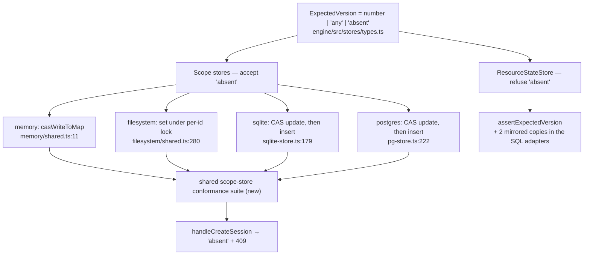

# FIX-1007: Scope stores cannot express create-if-absent, so Workstream get-or-create races — Implementation Spec

> **Linear issue:** [FIX-1007](https://linear.app/fixpoint-labs/issue/FIX-1007) · **Epic:** [FIX-939](https://linear.app/fixpoint-labs/issue/FIX-939) — Durable jobs & detached-task substrate ([epic-spec](https://github.com/fixpoint-labs/flow-state-dev/blob/epic/durable-jobs/docs/specs/_epics/durable-jobs.md) → N5a, N62) · **Blocks:** [FIX-982](https://linear.app/fixpoint-labs/issue/FIX-982) · **No blocking dependencies** — [FIX-992](https://github.com/fixpoint-labs/flow-state-dev/pull/1036) has merged, and this spec deliberately does *not* build on its sentinel.

## The short version

Two requests can create the same session at the same time and both succeed, because no scope store can express "write this only if it does not exist." The obvious fix — copy `ResourceStateStore`, where `expectedVersion: 0` already means create-if-absent — **does not work here**, and that is this spec's main finding. `ResourceStateStore` reserved `0` by starting its versions at `1`. The scope stores create records *at* version `0`, so `0` is a real, live version with real, live callers.

**Fix: add a distinct sentinel, `expectedVersion: "absent"`.** It says exactly one thing, it means the same thing in every store, and it cannot collide with a version number.

**Size: Medium — 1 PR.** Four adapters, one shared type, a shared conformance suite, one real caller. No schema migration, no data migration, no behaviour change to any existing caller.

## Spec evolution *(the change story, not an audit log)*

- **Spec drafted.** The issue and the epic (N62) both frame this as a *port* of FIX-992's `expectedVersion: 0`. Research refuted that premise: scope records are born at version `0` and the first CAS write on every new session passes `0` against a live row, so redefining `0` breaks a pinned contract. The framing moved from "port a sentinel" to "the sentinel is unavailable — add a distinct one," which also dissolves the tombstone question the issue expected to be the main decision.

<details>
<summary><b>For reviewers — what this document is</b></summary>

This is a **direction document**, not an implementation. Reviewing it well means answering one question: **is this the right approach?**

**In scope to challenge:** the problem framing · the approach · any numbered **Decision** in §6 · missing constraints that would **invalidate** the design · scope.

**Out of scope — deliberately unsettled, owned by the implementing agent:** names, signatures, file paths, module layout · local structure, which helper, error-message wording · micro-optimizations and style · test names and internal test structure (the *behaviours* are in §10) · anything Part II left open on purpose.

**The sketch in §7 is pseudocode.** It is knowingly incomplete, is not real code, and is not what will ship. Review it for shape and layer, not for error handling, edge cases, or whether the names exist.

Feedback in the second list is recorded verbatim in **§13**. It will not be argued with and will not be folded into the design prose. One mention is enough for it to land.

**One ask.** Every claim in §1 and §3 that decides the approach carries a `file:line` citation and, where it is behavioural, the probe that produced it (§7). **Check the citation rather than the prose** — and if you believe a claim is wrong, paste the output that shows it.

</details>

## Parts worth reviewing closely

> **1. Decision 1 — a third member on a shared union.** `ExpectedVersion` is `number | "any"` and is threaded through two store families with deliberately different semantics. I am adding `"absent"` to it rather than minting a scope-only type. The question: is one widened union with a loud rejection on the resource side better than two types that make the divergence unrepresentable? Getting it wrong means every `expectedVersion !== "any"` guard in the repo (21 sites, §7) is a place the next author can get it silently wrong.
>
> **2. Decision 2 — no tombstones.** The issue expected this to be the spec's main decision and priced it as the thing that makes the change Small vs Large. I am declining tombstones and accepting version reuse on a recreated id. The question: is the delete/recreate hazard genuinely FIX-1000's (which fences it by address), or does the scope record itself still need monotonic versions? A wrong answer here is a migration we skipped and have to do later.
>
> **Where I'm unsure:** decision 3. Rejecting `"absent"` on `ResourceStateStore` keeps this change small and leaves `0` meaning two different things across one `StoreRegistry` — the exact coherence smell the issue flagged. Accepting it as an alias would converge the vocabulary at the cost of touching the SQL resource predicates. I have taken the small option and scheduled the convergence (§12); I would not argue hard against the other call.
>
> **Deliberately absent:** rewiring the Workstream get-or-create itself — that is FIX-982's, and it is why this issue blocks it.

---

## Part I — The Case *(for the human)*

### 1. Problem — why it matters, why now

**In plain language.** Two things happening at once can both create the same session, and both think they won. There is no way to ask the store for "make this, but only if nobody made it already." The store's answer to a create is always yes.

**Why now.** The durable-jobs epic routes a Workstream — a sub-session dedicated to one body of work — by *deriving* its id from the work it belongs to. Two coordinating requests in one parent session naturally target that same derived id at the same time (request concurrency defaults to `allow`), so the framework needs the loser to fail. It cannot fail today. FIX-982 is blocked on exactly this.

**It is not only the epic's problem.** The public create-session route has the same hole and has had it all along: it reads, checks, then writes (`session-routes.ts:137-142` then `:193`), so two concurrent creates of the same id both pass the check and both write. The second silently overwrites the first.

**This is about to get worse, not better.** FIX-1000 (in review, a sibling epic) gives each session record a storage generation so a recreated session cannot read a deleted one's resources. Once that lands, two concurrent creates mint *two different generations* and the loser's write clobbers the winner's record — so any resource the winner already wrote becomes permanently unaddressable. FIX-1000 names this in its own second-path checklist and proposes the fix "`expectedVersion: 0` and a 409." **That fix does not work**, for the reason in §2, and this spec is what makes it work.

**The workaround is the bug.** Read-then-act is what both call sites do now. There is nothing else available to them.

### 2. Solution in plain terms

Give the store a way to say **"only if absent"** — a distinct value, `expectedVersion: "absent"`, alongside the version numbers and the existing `"any"`.

**Why not just copy what already works.** `ResourceStateStore` shipped create-if-absent three weeks ago and spells it `expectedVersion: 0`. Copying that is the obvious move, it is what the issue and the epic both assume, and **it is not available here.** `ResourceStateStore` starts its versions at `1`, which is what leaves `0` free to mean "no live row." The scope stores create records **at version `0`** and write them with `"any"` (`createExecutionContext.ts:580, 597, 660`; `session-routes.ts:187`). So a brand-new session is a *live row at version 0*, and the first state write on it passes `expectedVersion: 0` through `runWithCAS` → `createScopePersist` → `store.set` (`scope-persist.ts:148`) and must succeed. The existing contract test pins that behaviour deliberately (`store-cas-contract.test.ts:77-83, 104-105`). Redefining `0` would break the first write of every new session, user and org.

So the sentinel is taken. A word that is not a number cannot be taken, cannot be confused with a version, and needs no migration to introduce.

**Philosophy.** *Tenet 5 (fix at the owning layer)* — the race is unwinnable at the call site because the store cannot express the condition; the fix belongs in the store contract, at the four points where every scope write converges, not in a retry at each caller. *Tenet 1 (coherence)* — the codebase already documents that these two store families diverge on what `0` means (`types.ts:596-604`, `engine/README.md:531`); this adds a spelling that means one thing in both rather than deepening the divergence. *Tenet 3 (earn every addition)* — one union member, no new method, no column, no migration.

### 3. Tradeoffs & alternatives

| Rejected | Why |
|---|---|
| **Redefine `0` as create-if-absent (the literal port)** | Breaks the first CAS write on every new scope record, which passes `0` against a live v0 row. Pinned by `store-cas-contract.test.ts:77-83`. Verified by running it, not by reading (§7). BP-030 |
| **Rebase scope versions to start at `1`, freeing `0`** | Makes the port legal at the cost of a data migration over every persisted scope row in SQLite, Postgres and the filesystem — and a legacy row at version `0` becomes indistinguishable from absence, which is the same ambiguity in a new place. Large, risky, and buys nothing a distinct sentinel does not |
| **Bring tombstones to the scope stores** | The issue expected this to be the main decision. It is real work — lifecycle semantics in four adapters, two schema migrations, read filtering in `get`/`list`, a retention policy — and it does nothing for the race this issue exists to close. It only makes versions monotonic across delete-and-recreate, which is a different hazard, at a different layer, already owned by FIX-1000 (D2) |
| **A scope-only `ExpectedVersion` variant** | Makes the divergence unrepresentable, which is genuinely attractive. Costs a second type threaded through `DeltaStoreOps` and every scope signature, to protect against a misuse that one line in an existing guard already rejects loudly. Named as the live alternative under Decision 1 |
| **Fix it above the store (a lock, or retry-and-compare)** | A scope lock serializes an operation the store could simply refuse; retry-and-compare cannot distinguish "I created it" from "I overwrote someone." Both are workarounds every caller copies — tenet 5's smell |

<details>
<summary>Where the genuine complexity is</summary>

Not in the happy path — the predicate is two lines per adapter. It is in three places:

1. **The 21 sites that branch on `expectedVersion === "any"`** (`§7`). Adding a union member silently changes what `expectedVersion !== "any"` admits: today it means "a number," tomorrow it means "a number *or* `"absent"`," and the body behind every one of those guards assumes a number. Eleven are scope-store sites that must handle the new value; ten are resource-store sites that must refuse it. A missed one is a wrong answer, not a type error, because `"absent" !== 5` is a perfectly good comparison.
2. **The delta verbs.** `patchField` / `incField` / `pushToArray` / `deleteField` all take `ExpectedVersion` and all read-modify-write an existing record. `"absent"` is meaningless there and must throw rather than conflict.
3. **The SQL adapters' in-band sentinels.** Both resource-state stores carry `-1` as an in-band `"any"` inside a delete predicate (`store-sqlite/src/resource-state-store.ts:258`, `store-postgres/src/resource-state-store.ts:219`). A string reaching a numeric bind parameter is the failure mode that guard exists to prevent.

</details>

### 4. Focus practices

- **Verify the premise before porting it (tenet 7).** The issue, the epic note N62 and the sibling spec FIX-1000 all assume `expectedVersion: 0` is create-if-absent on scope stores. It is not, and no amount of reading the `ResourceStateStore` contract would have shown that — it took running the scope store. Three artifacts encoded the same wrong assumption; the probe took four minutes.
- **A precedent transfers only if its load-bearing property does.** `ResourceStateStore`'s create-if-absent rests on versions starting at `1`. That property is invisible in the signature, which is identical. Mirroring syntax without mirroring semantics is the trap here.
- **Find the convergence point, then pin it (tenet 5).** Four adapters implement this contract and there is no shared scope-store conformance suite today — only per-package tests. The resource store has one, and that is what keeps its four adapters honest. §10 adds the equivalent.
- **BP-030.** Every existing `0`, positive-version and `"any"` caller must be byte-for-byte unaffected. The design achieves this by construction rather than by care: it adds a value instead of redefining one.

### 5. What using it looks like

**Public flow-authoring API: unchanged.** No block signature moves, no route gains a parameter. What changes is a store verb and one route's honesty.

```ts
// The store contract — the new value sits beside the two that exist today.
await stores.session.set(id, record, "any");      // unconditional (unchanged)
await stores.session.set(id, record, 3);          // only at version 3 (unchanged)
await stores.session.set(id, record, "absent");   // only if it does not exist (new)
```

The losing writer gets the ordinary conflict shape every other CAS failure returns, so no caller learns a new result type:

```ts
const result = await stores.session.set(id, record, "absent");
if (!result.ok) {
  // someone else created it first; result.conflict.currentValue is their record
}
```

Observable behaviour, from a client — two concurrent creates of the same session id:

```ts
// before: both return 201, the second silently overwrites the first
// after:  one returns 201, the other returns 409
```

### 6. Decisions & rules — the sign-off surface

1. **Create-if-absent is a distinct sentinel, `"absent"`, added to `ExpectedVersion` — not a redefinition of `0`.**
   *Rejected:* porting FIX-992's `0` (breaks the first CAS write on every new scope record, pinned at `store-cas-contract.test.ts:77-83`); rebasing scope versions to start at `1` (a data migration that recreates the same ambiguity for legacy rows); a scope-only variant type (the live alternative — see *Parts worth reviewing closely* 1).
   *Locks in:* `ExpectedVersion = number | "any" | "absent"` is shared by both store families, so every branch over it is a place the semantics can be got wrong; §10 pins all four adapters against one suite. Existing callers are unaffected by construction, not by care.

2. **No tombstones on the scope stores. A recreated id may reuse versions, and that is stated rather than hidden.**
   *Rejected:* porting `ResourceStateStore`'s tombstone lifecycle.
   *Locks in:* `delete(id): Promise<void>` keeps hard-delete semantics, so an observer holding a pre-delete version could match a later generation at the same id. Exposure is narrow — `session.delete` has exactly one caller (`session-routes.ts:223`, the DELETE route), so it needs an explicit user-initiated delete *plus* a concurrent stale-version holder. It is also the wrong layer for that hazard: FIX-1000 fences delete-and-recreate by making the new generation *unaddressable*, and rejected a counter for precisely the version-reuse reason (its D2). If monotonic scope versions are ever needed, that is a migration with its own issue.

3. **`ResourceStateStore` refuses `"absent"` loudly; its `0` keeps today's meaning.**
   *Rejected:* accepting `"absent"` there as an alias for its `0`.
   *Locks in:* `0` still means two different things across one `StoreRegistry` — create-if-absent on resource state, version-equality on scope state. This spec **names that divergence at both call sites** (§11) rather than unifying it, because unifying means adding a second spelling to a contract that shipped three weeks ago with a conformance suite pinning it. The convergence path — move resource callers to `"absent"`, then retire its `0` — is §12. The refusal goes in `assertExpectedVersion`, which already fronts every resource `set`/`delete` in all four adapters.

4. **The delta verbs reject `"absent"` rather than accepting it.**
   *Rejected:* treating it as "create the record."
   *Locks in:* `patchField` / `incField` / `pushToArray` / `deleteField` read-modify-write an existing record, so `"absent"` is a programming error at the call site, not a lost race — it throws, matching the posture `assertExpectedVersion` already takes for an out-of-domain version.

5. **One shared conformance suite pins the verb across all four scope adapters.**
   *Rejected:* extending each package's own tests.
   *Locks in:* the scope stores get the thing the resource stores already have and the reason their four adapters agree. This is the completeness check for a contract with four implementations and no compiler to enforce agreement.

6. **`handleCreateSession` is rewired onto the new verb in this PR; Workstream routing is not.**
   *Rejected:* shipping the verb with no caller.
   *Locks in:* the change gets one real consumer and a real end-to-end assertion (two concurrent creates → one 201, one 409) rather than only store-level tests — tenet 7. Workstream get-or-create is FIX-982's, which is why this issue blocks it. Coordinate with FIX-1000, which edits the same route region (§12).

> **Non-goals** — Workstream routing itself (FIX-982); tombstones or monotonic versions for scope records (Decision 2); changing `ResourceStateStore`'s semantics (Decision 3); reclaiming anything.
>
> **Size:** Medium — 1 PR. Four adapters, one shared type, three mirrored guards, a new conformance suite, one caller, two doc surfaces. No schema or data migration.

---

## Part II — The Build Plan *(for the implementing agent)*

### 7. Technical design

The contract lives in `engine`, and four adapters implement it. Each adapter family already has exactly one place where a scope write decides whether it may proceed — that is where this lands.



**What each adapter needs.** The SQL adapters are already 90% there: both try a CAS `UPDATE` and fall back to an `INSERT` when `expectedVersion === 0`. The new value takes the insert path *without* the update attempt, and treats an existing row as a conflict rather than a success.

- **`@flow-state-dev/engine`** — the type, the two in-repo scope adapters (memory, filesystem), the resource-side refusal, and the conformance suite.
- **`@flow-state-dev/store-sqlite` / `store-postgres`** — the scope write predicate, plus the mirrored `assertExpectedVersion` copies. These packages depend on `engine` type-only (`scripts/validate-package-boundaries.mjs`), so the guard is restated, not imported — the same arrangement FIX-992 used, and the conformance suite is what keeps the copies honest.
- **Untouched:** `runWithCAS`, `resource-cas.ts`, the registry, every block kind, all persisted schemas.

**The 21 branch sites.** Enumerate them, don't trust this list:

```
grep -rn '=== "any"\|!== "any"' packages --include=*.ts | grep -v test
```

Eleven are scope-store sites that must handle `"absent"` (`memory/shared.ts:18,61` · `filesystem/shared.ts:285,328,335` · `sqlite-store.ts:153,162,187` · `pg-store.ts:160,230,342`); ten are resource-store sites that must refuse it. The hazard is that `expectedVersion !== "any"` currently means "is a number" and silently stops meaning that.

**Solution sketch — pseudocode. Illustrative, not the contract. React to the shape.**

```
in the scope store's write predicate, before the version compare:

    if expectedVersion is "absent":
        if a record exists at this id:
            return conflict carrying that record and its version
        otherwise:
            insert and succeed
        ← done; never falls through to the numeric compare

    otherwise: today's logic, untouched
        "any"  → write unconditionally
        number → compare against the stored version

in the SQL adapters the same thing is one statement, because
compare-and-swap has to be atomic there:

    INSERT ... ON CONFLICT (id) DO NOTHING
    if nothing was inserted → read the winner, return it as the conflict

on the resource side, in the guard that already fronts every set/delete:

    if expectedVersion is "absent": throw   ← one line, three copies
```

**Evidence the premise was run, not argued.** A throwaway probe against the real in-memory session store (deleted; reproduce in three assertions) established all three claims this design rests on:

| Claim | Result |
|---|---|
| `set(id, rec, 0)` against an **absent** record | succeeds — insert |
| `set(id, rec, 0)` against a **live record at version 0** | **also succeeds** — so `0` is not "must not exist" |
| Two concurrent `set(id, rec, 0)` on one id | **both succeed** — the race has no loser today |

`store-cas-contract.test.ts` (8 tests, memory + filesystem) passes on `main` and already asserts the second row deliberately at lines 77-83 and 104-105 — so this is a pinned contract, not an accident.

### 8. Implementation sequence

1. **Widen the type.** `ExpectedVersion = number | "any" | "absent"` in `engine/src/stores/types.ts`, with the contract comment on `SessionStore.set` stating what `"absent"` means and what `0` means *here* (the divergence, named — Decision 3).
2. **Refuse it on the resource side first.** Add the rejection to `assertExpectedVersion` and its two mirrored SQL copies. Doing this before step 3 means a mistake in the scope work surfaces as a throw, not as a silent wrong answer.
3. **Memory adapter.** `casWriteToMap` — the `"absent"` branch ahead of the numeric compare. Also guard the delta-verb path (`checkVersion`).
4. **Filesystem adapter.** Same predicate inside the existing per-id lock. The lock's stated limitation (in-process only, `types.ts:626-631`) is unchanged and must stay stated.
5. **SQLite and Postgres.** Route `"absent"` to the existing insert path, skipping the CAS `UPDATE` attempt, and treat "no row inserted" as a conflict. Postgres already has `ON CONFLICT ... DO NOTHING`; SQLite already catches the PK conflict.
6. **The conformance suite.** New shared suite in `engine/src/stores/testing/`, mirroring `resource-store-conformance.ts`, exercised by all four adapters from their own packages.
7. **The caller.** `handleCreateSession`: replace the read-then-act (`session-routes.ts:137-142`) with a single `set(..., "absent")` and return 409 on conflict.
8. **Docs and changeset** (§11).

**Removals (tenet 3):** step 7 deletes the `get`-then-check in `handleCreateSession` — the read-then-act goes away rather than being kept alongside the new predicate. No other path is superseded.

### 9. Edge cases & error handling

| Case | Behaviour |
|---|---|
| `"absent"` against an existing record at **any** version, including 0 | Conflict, carrying the existing record and its version. This is the whole feature |
| `"absent"` against an absent record | Insert, at whatever version the caller's record carries |
| Two concurrent `"absent"` writes | Exactly one succeeds. On SQL this is the insert's uniqueness; on memory it is single-threaded; on filesystem it is the per-id lock, in-process only |
| `"absent"` passed to a delta verb | Throws (Decision 4) — a programming error, not a conflict |
| `"absent"` passed to `ResourceStateStore.set`/`delete` | Throws (Decision 3) |
| Existing `0`, positive, `"any"` callers | Byte-for-byte unchanged. The pinning test is the existing `store-cas-contract.test.ts`, which must pass untouched |
| A legacy persisted record at version 0 | Reads as a live record; `"absent"` conflicts against it. No migration, no dual-read — the meaning of stored data does not change (BP-030) |
| Delete then recreate at the same id | Permitted; versions may restart. Stated, not defended — Decision 2 |
| `"absent"` reaching a SQL numeric bind parameter | Must be impossible by construction: the string never enters the numeric path. The in-band `-1` sentinels (`resource-state-store.ts:258`/`:219`) are on the resource side, which refuses `"absent"` at the guard |

**Second-path checklist (BP-035).** *Legacy* — a stored v0 record is live, not absent (row above). *Null boundary* — `"absent"` is a string sentinel; guards must test it explicitly, never via falsiness, and `expectedVersion !== "any"` no longer implies `typeof === "number"`. *Concurrent-409* — this change exists to produce one; `handleCreateSession` returns it. *Cancel/error* — no new async path. *Multi-tenant* — the predicate operates on the already tenant-namespaced storage key (`resolveSessionStorageKey`); no tenancy decision moves. *Cost/observability* — the SQL path does one statement instead of two on the create path, so it is cheaper, not dearer. *Flag off/new state* — there is no flag; the off state is every existing caller, pinned by the untouched contract test.

### 10. Testing strategy

**Discipline: `tdd`** (Linear category is a defect in a contract, but the deliverable is new behaviour — red-green per adapter).

**The goal check (BP-003), on the real path:** two concurrent `POST /session` calls with the same `sessionId` → exactly one `201`, one `409`, and one stored record. This is the assertion that would have failed before and passes after; everything below supports it.

**Behaviours to test, in observable terms:**

- `"absent"` against absent → `ok: true`; against live-at-v0 → `ok: false`; against live-at-v3 → `ok: false` carrying version 3.
- Two concurrent `"absent"` writes on one id → exactly one `ok: true`, and the loser's `conflict.currentValue` is the winner's record.
- Every existing behaviour of `0`, positive versions and `"any"` is unchanged — **the existing `store-cas-contract.test.ts` must pass with no edits.** If it needs editing, the design is wrong.
- `"absent"` to each delta verb → throws.
- `"absent"` to `ResourceStateStore.set` and `.delete` → throws, on all four adapters.
- The four scope adapters return *identical* results for the same sequence — the shared conformance suite, run from each package.

**Evidence path:** `pnpm --filter @flow-state-dev/engine test` · `pnpm --filter @flow-state-dev/store-sqlite test` · `pnpm --filter @flow-state-dev/store-postgres test` · plus the concurrent-create route test. Pass criteria: the goal check above, green; `store-cas-contract.test.ts` green and unmodified.

### 11. Documentation plan

Internal contract change with one user-visible behaviour change (a 409 that used to be a silent overwrite). No new page; no new sidebar entry.

| File | Change | Why |
|---|---|---|
| `packages/engine/src/stores/types.ts` | `ExpectedVersion` doc gains `"absent"`; `SessionStore.set` doc states what `0` means **here** and links the divergence | The contract is the primary doc for this type, and today only the `ResourceStateStore` side names the divergence (`:596-604`) — that is the asymmetry the issue's coherence constraint is about |
| `packages/engine/README.md` (~`:531`) | Extend the existing "Two meanings differ from the scope stores" passage to cover `"absent"` | It already names the divergence; leaving it describing only half is how the next reader gets it wrong (BP-009) |
| `docs/architecture/state-and-scopes.md` (~`:111`) | Note that scope state can now express create-if-absent, and that it spells it differently from resource state and why | This doc explicitly separates the two CAS drivers; it is where a reader goes to learn they differ |
| `apps/docs/docs/persistence/overview.md` | Confirm the documented natural-key create pattern still reads correctly now that duplicate creates 409 | User-facing behaviour change. Check-then-edit-if-needed, not an assumed edit |
| `.changeset/*.md` | `patch` — user-visible: concurrent duplicate session creates now return 409 | BP-022 |

**Not changed:** no new Docusaurus page, no sidebar edit, no guide. `expectedVersion` is not part of the flow-authoring surface — application code reaches state through `ctx.session.patchState`, which is unaffected. Per CLAUDE.md, the user-facing prose is written by `docs-writer`, not by the implementing agent holding the diff.

### 12. Dependencies, open questions & follow-ups

**Blocking dependencies: none.** FIX-992 has merged; this spec deliberately does not build on its sentinel.

**Blocks:** FIX-982 (Workstream get-or-create).

**Coordination — FIX-1000 (PR #1049, epic FIX-980), not a blocker but do not ignore:**

- It edits the same `handleCreateSession` region this spec's step 7 touches (it mints a storage generation there). Whichever lands second rebases; the changes are compatible, and neither depends on the other.
- **Its §12 proposes fixing that route with `expectedVersion: 0`. That will not work** — §7's probe is the evidence. Once this ships, the correct spelling is `"absent"`. This has been raised on #1049 so the sibling spec does not encode the wrong assumption.
- Its D2 (nonce, not counter) and this spec's Decision 2 are the same reasoning about delete-and-recreate reached independently, at two different layers. They are coherent; neither needs the other.

**Epic alignment:** N62 sizes this as a "port, not invention" and flags it as the epic-spec's least-supported claim. **The flag was right and the sizing was not** — the port is unavailable, for a reason that is invisible in the signature (§2). N5a's dependency on FIX-982 is unchanged, and the correction has been raised on the epic PR (#993).

**Follow-ups, not in scope:**

- **Converge the vocabulary:** move `ResourceStateStore` callers from `expectedVersion: 0` to `"absent"`, then retire its `0` sentinel, so one spelling means create-if-absent everywhere and `0` means version-equality everywhere. Deliberately deferred (Decision 3) — it touches a contract that shipped three weeks ago with a conformance suite pinning it, and it is not needed to unblock FIX-982.
- **Monotonic scope versions / tombstones**, if a future consumer needs a recreated id never to reuse a version (Decision 2). Needs a schema migration; should be its own issue with its own evidence that something depends on it.
- **The scope stores have no shared conformance suite today** — only per-package tests, while the resource stores have one. §10 adds one for this verb; extending it to cover the rest of the scope contract is a coherence follow-up (`improve-codebase-architecture`).

**Open questions:** none blocking. The one live judgment call is Decision 3 vs. its alternative, surfaced in *Parts worth reviewing closely*.

### 13. Review notes for the implementer

*(Populated verbatim from spec-PR review. Empty at draft time.)*
