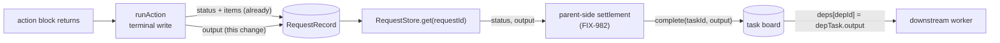

# FIX-1008: FIX-991a — a settled task's result is not readable across the request boundary — Implementation Spec

> **Linear issue:** [FIX-1008](https://linear.app/fixpoint-labs/issue/FIX-1008) · **Epic:** [FIX-939](https://linear.app/fixpoint-labs/issue/FIX-939) — Durable jobs & detached-task substrate ([epic PR #993](https://github.com/fixpoint-labs/flow-state-dev/pull/993)) · **Blocks:** [FIX-982](https://linear.app/fixpoint-labs/issue/FIX-982) · **Sibling:** [FIX-991](https://linear.app/fixpoint-labs/issue/FIX-991) (FIX-991b, the `items()` accessor fix, lands *after* FIX-982)
>
> Every `file:line` in this spec was opened on `spec/FIX-1008`, branched from `origin/main` at **`26664927`**.

## Spec evolution *(the change story, not an audit log)*

- **Spec drafted** — Framed the gap as an *incomplete record* rather than a missing feature: `RequestRecord` persists a run's input, items, status and timings, and nothing else about what the run produced. Chose to finish the record (persist `ExecutionResult.output`) over the epic's two interim options — a tagged result item, or a task-keyed shared resource — because both invent a convention and then need a decoder, which is exactly what N31 says a result projection must not be. Priced the change against `origin/main`: one optional field, one write site, **zero store-adapter changes and zero migrations**, because all four adapters already persist the record as an opaque JSON blob. The epic deliberately did not add this surface, so Decision 1 escalates it explicitly rather than assuming it.

---

## For reviewers — what this document is

This is a **direction document**, not an implementation. Reviewing it well means
answering one question: **is this the right approach?**

**In scope to challenge:**

- The problem framing — are we solving the right thing?
- The approach — will it work, does it fit the architecture and `docs/philosophy.md`?
- Any numbered **Decision** in §6 — that's the sign-off surface.
- Missing constraints, edge cases, or dependencies that would **invalidate** the design.
- Scope — a deliverable that shouldn't ship, or one that's missing.

**Out of scope — deliberately unsettled here, and owned by the implementing agent:**

- Names, signatures, file paths, and module layout.
- Local structure: which helper, how a function is decomposed, error-message wording.
- Micro-optimizations and style preferences.
- Test names and internal test structure (the *behaviours* to test are in §10; the tests
  themselves are not).
- Anything Part II left open on purpose — it is directional by design, and a gap at
  that altitude is intended, not an omission.
- **The solution sketch, at the line level.** A spec may include a rough pseudocode sketch
  showing the *shape* of the proposed solution. It is knowingly incomplete, is not real
  code, and is not what will ship. **Review it for directional viability and key design
  aspects only** — is this the right shape, in the right layer, composing the right way?
  Do **not** report that it lacks error handling, omits edge cases, names things that
  don't exist in the repo, or wouldn't build: all of that is true on purpose, and the
  names are deliberately not real. A sketch that has to survive line-level review stops
  being cheap, and then nobody writes one.

**One request, if you are an automated reviewer:** the two lists above are the whole
difference between a useful review of this document and a long one. Volume is not signal
here — a single finding above the line is worth more than twenty below it.

Feedback in the second list is welcome and gets **recorded verbatim in §13** for the
implementer to weigh against real code. It will not be argued with, and it will not be
folded into the design prose — that would pretend the spec can settle something it
can't. Please don't re-raise it: one mention is enough for it to land in §13.

**The one exception is the sketch.** Line-level feedback on it is *dropped*, not recorded
— there is nothing for an implementer to weigh about code that isn't shipping, and a §13
note would imply otherwise. Sketch feedback that is about **direction** is not line-level
and is treated like any other above-the-bar finding.

---

## Parts worth reviewing closely

> **1. Decision 1 — persisting `ExecutionResult.output` at all.** The epic named this
> surface and deliberately did not add it (§4, *"The worker's result must land on a durable
> surface"* → *"a framework surface this epic is deliberately not adding right now"*). This
> spec argues it is now the cheapest correct option and asks for that call to be reversed.
> The question: **is finishing `RequestRecord` the right move, or should a detached worker
> carry an extra result obligation the inline one doesn't?** A wrong answer here is not an
> adjustment — every other section changes, and FIX-982 inherits a decoder it has to invent.
>
> **2. Decision 4 — what happens when a run's output cannot be serialized.** Today output
> is never persisted, so an unserializable one is harmless. After this change the terminal
> write touches it. Getting this wrong turns a request that *succeeded* into one recorded as
> `failed`, on a path that works today. The question: is a persist-then-degrade retry the
> right shape, or should the constraint be enforced earlier and louder?
>
> **Where I'm unsure:** Decision 5 (keeping `output` off the session-requests listing route).
> `input` rides that response today and `items` deliberately does not, so there are two live
> precedents and I picked the more recent one. I can't tell from outside whether a DevTool
> consumer wants outputs in the list badly enough to want the `include_items`-shaped flag now.
>
> **Deliberately absent:** the `TaskHandle.items()` accessor, cross-attempt item unioning,
> and item attribution on the detached path (N24). All three are FIX-991b and land *after*
> FIX-982 — see §6's non-goals. This spec does not touch the accessor.

---

## Part I — The Case *(for the human)*

### 1. Problem — why it matters, why now

When a piece of work runs inside the request that asked for it, whatever it returns is
handed straight back to the caller, in memory. That's how the task board settles a task
today: the worker returns a value, and the board records it.

Once the work runs somewhere else — a different request, a different process, possibly
after a restart — that hand-back doesn't exist. And nothing wrote the value down. We keep a
durable record of every run: what went in, everything it emitted along the way, whether it
succeeded, how long it took. We do not keep **what it produced**.

**Why now.** FIX-982 makes the parent side settle its own task once the detached worker's
request reaches a terminal state (epic Decision 7). Settling means calling
`complete(taskId, output)` — and there is no `output` to call it with. Without this, FIX-982
either ships a settlement path that cannot recover what it is settling with, or it invents a
result convention of its own inside the orchestration package. There is no workaround at the
call site: the value is gone the moment the worker's process moves on.

And the damage doesn't stop at settlement. Whatever gets recorded as a task's output is
handed verbatim to the next worker that depends on it — the board resolves each dependency
as `deps[depId] = depTask.output` (`packages/orchestration/src/task-board/blocks/worker-step.ts:98-105`).
So a result that is reconstructed by guesswork doesn't just write the wrong thing on one
row; it feeds a wrong-shaped value into another worker's typed input, where nothing checks
it. That's the epic's N31, and it is the reason "just emit something and read it back later"
is not good enough.

### 2. Solution in plain terms

Write the output down, in the place that already holds everything else about a run.

A request's durable record keeps its input. It keeps its items. It keeps its status and its
timings. It does not keep its return value — and that's the only thing missing. So the fix
is to finish the record: when a run reaches a successful terminal state, store what it
produced alongside what it consumed. Reading it back is then an ordinary read of a record
that anyone with the request id can already fetch. No new accessor, no tagging scheme, no
decode rule, no attribution.

The value that comes back is the same value the worker returned. Not a re-assembled
approximation of it — the thing itself, subject only to the JSON round-trip that a durable
task board **already** imposes on `task.output` today
(`packages/orchestration/src/tasks/collection/resource-backed.ts` casts each task to
`JsonObject` before persisting it). So a detached worker's result arrives in exactly the
shape an inline worker's result arrives in on the same durable board.

**Philosophy** — **tenet 2 (composition over features)**: this is the refinement move, not
the accretion one. Rather than putting a result concept *beside* the request record — a new
item type, a task-keyed resource, a convention about which emission is "the" result — it
sharpens the primitive that already exists so it covers the case. **Tenet 5 (fix at the
owning layer)**: `runAction` is the single point where an `ExecutionResult` and its
`RequestRecord` are both in hand. There is exactly one such convergence point, and the fix
belongs there rather than at each caller that wishes it had the value. **Tenet 3 (earn every
addition)**: the public surface grows by one optional field on a record that already carries
its symmetric twin, and by zero options, zero methods, and zero store-adapter changes.

**In tension with:** the epic's own §4 note, which called persisting `ExecutionResult.output`
*"a framework surface this epic is deliberately not adding right now."* Decision 1 asks to
reverse that. The justification is in §3 — the two options the epic kept instead both turned
out to need the same missing piece (a canonical, typed result projection), and building that
piece costs more than finishing the record does.

### 3. Tradeoffs & alternatives

**Alternative A: a tagged result item.** The worker emits a distinguished item; settlement
reads the request's items and picks it out. This is the epic's first interim option, and it
does not work as written. Two costs, one of them fatal:

- The item log is a *list*, and `complete(taskId, output)` takes one typed value. So the
  design needs a tag convention *and* a decode rule — "which item is the result, and how do
  I turn it back into `TOutput`". The epic's N31 says this projection must be "canonical and
  typed, not a convention"; a tag is a convention by construction.
- A `ComponentItem`'s payload is `data: Record<string, unknown>`
  (`packages/contracts/src/items/types.ts:405-420`), so a worker returning an array, a
  string, or a number has to box it — and settlement has to unbox it correctly, forever, for
  every worker shape. That's the wrong-shaped-value-into-`deps` failure, built in.

It also drags in attribution work this issue is explicitly not scoped for: the epic's N24
measures that `_markTaskScope` has exactly one call site
(`packages/orchestration/src/task-board/index.ts:700`), inside the worker-body sequencer,
which a top-level Workstream action never reaches. **This spec's approach does not need N24
resolved** — settlement reads the record by *request id*, a binding FIX-982 already has to
persist for its own reconciler, not by item-level `taskId` attribution. That is the cleanest
separation between this half and FIX-991b.

**Alternative B: a task-keyed shared user/org resource.** The epic's second interim option.
The worker writes its result to a `flowIsolation: false` user- or org-scoped resource keyed
by task id; the parent reads it back. This is a *storage location*, not a design — it names
no resource reference and no projection, so it still needs the same canonical typed shape
Alternative A needs, plus three things the record option doesn't: a declared resource on
both the worker and coordinator side, a retention story (when is a settled task's result
resource deleted?), and a deliberate cross-flow read that the isolation rules exist to
prevent. More surface, more lifetime questions, same missing piece.

**Alternative C: read it off the queue.** The BullMQ worker already returns the whole
`ExecutionResult` as the job's return value (`packages/bullmq/src/worker.ts`), and BullMQ
persists it. Rejected on the epic's own Decision 8: *the board is the truth, the queue is a
wake.* Reading results from the queue makes the queue the truth, and it only works for one
transport.

**The simpler approach considered — and rejected: do nothing here, let FIX-982 solve it.**
Genuinely tempting, because it needs no engine change at all. Insufficient for two reasons.
FIX-982 would have to build one of A or B anyway, so the work doesn't disappear — it moves
into an issue the epic already calls the largest in the set. And it would put the result
contract in the orchestration package, where it applies only to task-board workers, when the
gap is general: *any* out-of-request caller has the same problem.

**Where the complexity is:** not the write. It's the boundary where an in-memory value
becomes a stored one. Today a run whose output can't be JSON-serialized completes happily,
because nothing tries. After this change something does, and the failure mode — a successful
request recorded as failed — is worse than the problem being solved. §9 and Decision 4 are
mostly about that one case.

### 4. Focus practices (1–5)

1. **BP-030 (tolerate the old shape)** — every request record written before this change has
   no `output`. A reader must treat absent as "unknown", not as "the run returned nothing",
   and must `== null`-guard it. §9 states why no dual-read or version marker is needed.
2. **BP-035 (second-path checklist)** — the second path here is the *unhappy* terminal write.
   A suite that only proves output round-trips on a clean success proves nothing about the
   case that can regress live traffic. Failure, abort, suspension, interruption, and
   unserializable output each need a stated expectation.
3. **Tenet 5 — one convergence point.** There is exactly one place where an `ExecutionResult`
   and its `RequestRecord` meet, and the write must sit there. An `output` written at some
   call sites and not others is worse than no `output` at all, because settlement can't tell
   the difference between "didn't produce one" and "this path forgot".
4. **BP-003 (verification evidence)** — the pass criterion is not "a test asserts the field
   exists". It is: a value produced by a real run is read back by a process that never held
   the `ExecutionContext` that produced it.

### 5. What using it looks like (1–5 examples)

**Recovering a detached worker's result for settlement** *(what this spec proposes — today
the second line reads `undefined` no matter what the worker returned)*:

```ts
// Parent side, in a later request. It holds the request id FIX-982 persisted
// for this task's attempt; it does not hold the worker's ExecutionContext.
const record = await stores.request.get(attemptRequestId);

if (record?.status === "completed") {
  await collection.complete(taskId, record.output, { expectAttempt: attempt });
}
```

**Telling the three terminal shapes apart** — the read that makes settlement decidable:

```
record.status === "completed" && record.output !== undefined   → the worker produced a value
record.status === "completed" && record.output === undefined   → the worker returned nothing
record.status === "failed"                                     → the terminal ErrorItem in
                                                                 record.items carries why
```

**What a downstream worker receives** (before / after), for a task whose dependency ran
detached:

```
before  deps[depId] → undefined            the dependency's output was never written down
after   deps[depId] → the worker's value   identical to the inline path on a durable board
```

*(Note the qualifier. On a durable board the value has already been through a JSON round-trip
inline, because the board persists `task.output` as JSON. This change does not add a
round-trip; it makes the detached path match the inline one.)*

### 6. Decisions & rules — the sign-off surface

1. **`ExecutionResult.output` is persisted on the request record, as one optional field
   written at the terminal write.**
   *Rejected:* a tagged result item (§3 A), a task-keyed shared resource (§3 B), the queue's
   return value (§3 C), and leaving it to FIX-982.
   *Locks in:* the record becomes the canonical durable answer to "what did this run
   produce", so every later consumer reads one place. **This reverses the epic's deliberate
   deferral of this surface — it is the call this spec most wants signed off.** It also
   restores the epic §1 orthogonality claim it had to narrow: a block now behaves the same
   inline or detached with respect to its *result*, not just its definition.

2. **The read needs no new API. Settlement uses `RequestStore.get(requestId)` and reads
   `status` and `output` off the record it already gets back.**
   *Rejected:* a dedicated result accessor or a `{ status, output, error }` projection helper.
   *Locks in:* no speculative surface for a caller (FIX-982) that doesn't exist yet, and no
   second way to ask the same question. The two facts settlement needs arrive together from
   one read, which is what makes them consistent with each other.

3. **A failed run's reason stays where it already is — the terminal `ErrorItem` in the
   request's item log. No `error` field is added to the record.**
   *Rejected:* a symmetric `error` field beside `output`.
   *Locks in:* the failure side already has a durable surface (`runAction` emits a
   non-transient `ErrorItem` carrying `message` and `code` before the terminal patch), so
   adding one would be a second copy. FIX-982's `fail(id, error)` mapping reads it from
   there. The asymmetry is deliberate and stated rather than accidental.

4. **Persisting the output must never fail the request.** The terminal write attempts the
   record with `output`; if the store cannot serialize it, the write is retried without it
   and the record carries an explicit marker saying the output was not persistable.
   *Rejected:* letting the store error propagate (turns a successful run into a recorded
   failure — a live regression on a path that works today), and silently dropping the field
   (settlement could not tell "returned nothing" from "we lost it", which is precisely the
   silent-wrong-value hazard N31 exists to prevent).
   *Locks in:* one extra optional field that is absent on every healthy record, and a rule
   that the durability of a result never outranks the honesty of a status.

5. **`output` is not returned by the session-requests listing route.** The only read path is
   `get(requestId)`.
   *Rejected:* returning it unconditionally (grows an existing client response for a
   consumer that doesn't exist), and adding a `withOutput` store-contract option mirroring
   `withItems` (a new public option four adapters must honour, for the same absent consumer).
   *Locks in:* the field costs nothing on any listing path today. If an inspection consumer
   appears later it gets an explicit query flag, the way `include_items` was added.

6. **Output is persisted for every request, not only detached ones.** No opt-in, no config.
   *Rejected:* a per-action or per-flow flag.
   *Locks in:* one code path and no knob (tenet 3), and — decisively — the engine never has
   to know whether a request is backing a task, which would invert the package boundary.

**Non-goals** — the `TaskHandle.items()` accessor and its cross-attempt union (**FIX-991b**,
after FIX-982); item-to-task attribution on the detached path (**N24**, assigned to FIX-982
and FIX-991); the settlement logic itself, including the six-terminal-status map, the attempt
fence, and the `(taskId, attempt) → requestId` binding (**all FIX-982**); the board-scoped
item lifetime bound (**FIX-991b**); and any change to what `ExecutionResult` *is*.

**Size:** Small (one field plus a failure marker, one write site, one route projection, tests
and docs; no store-adapter changes and no migrations — see §7).

---

## Part II — The Build Plan *(for the implementing agent)*

Part II carries **shape and sequence**, not the finished design.

### 7. Technical design

One value, one write site, one read verb. Nothing new sits between them.



- **`@flow-state-dev/engine`** — `RequestRecord` gains an optional output field and an
  optional marker for the unserializable case. `runAction`'s terminal write is the only
  producer. The session-requests listing route drops the field from its response
  (decision 5). Nothing else in the engine reads it.
- **Store adapters — untouched, and this is measured, not assumed.** All four persist the
  record as an opaque JSON blob: sqlite (`sqlite-store.ts`, `JSON.stringify(value)` into a
  `data` column), postgres (`pg-store.ts`, the same into JSONB), filesystem
  (`stores/filesystem/shared.ts` → `writeRecord`, one JSON file per record), memory (holds
  the object).
  None enumerates `RequestRecord`'s fields, and there is no Zod schema for the record. **A new
  optional field therefore requires no adapter change and no migration.** The sqlite and
  postgres adapters strip `items` before writing because items live in a child table; output
  has no such table and rides the blob exactly as `input` does.
- **`@flow-state-dev/orchestration` — untouched by this issue.** The consumer is FIX-982.
- **Untouched:** `ExecutionResult` itself, the item taxonomy, every block kind, the SSE event
  set, and the request-status route (which projects a narrow snapshot and never returned the
  whole record).

**Where the write goes.** `runAction` reaches its success terminal in one place, and the
value is in scope there — the same `result.output` the `onCompleted` observers already
receive. The failure branch has its own terminal write and gets no output by construction.
The suspension branch writes `status: "suspended"` and must not write an output: the run
hasn't produced one, and it will reach a real terminal on continuation.

**Sketch — pseudocode. Illustrative, not the contract. React to the shape.**

```
at the ONE place a run records its successful terminal state:

    try:
        write the record with { status, timings, items, output }
    on serialization failure:
        write the record with { status, timings, items } and a marker
        saying the output could not be kept, plus why      ← decision 4
        log it at error level; do NOT rethrow

failure branch:      unchanged — no output, the terminal error item already carries why
suspension branch:   unchanged — no output; the run has not produced one yet

at the session-requests listing route:
    drop the output field from each record before responding   ← decision 5
```

What this asks a reviewer: *is a persist-then-degrade retry the right shape for decision 4,
or should an unserializable output be rejected earlier and louder?* Degrading keeps a working
path working, at the cost of a second optional field. The alternative — validating before the
write — costs a serialization pass on every successful request, for a case that should never
happen on a durable board.

### 8. Implementation sequence

1. **Add the field to the record type.** No writer, no reader yet. *Test:* a record carrying
   an output round-trips through each of the four adapters unchanged (JSON-equal in, JSON-equal
   out) and a record written without it reads back with the field absent. *Depends on:* nothing.
2. **Write it at the terminal success write.** Happy path only. *Test:* a completed run's
   record carries the action's return value, read back from the store rather than from the
   `ExecutionResult`; a failed run's record carries none; a suspended run's carries none.
   *Depends on:* 1.
3. **The serialization fail-safe** (decision 4). *Test:* an action returning a value the store
   cannot serialize still records `completed`, records the marker, and does not throw — on a
   serializing adapter *and* on the in-memory one, where the failure never fires.
   *Depends on:* 2.
4. **Drop the field from the session-requests listing response** (decision 5). *Test:* the
   listing response has no output field even for completed requests that have one; `get`
   still does. *Depends on:* 2.
5. **Docs** per §11 — including correcting `docs/architecture/streaming.md`'s claim that the
   items array is "the canonical output of a request", which this change makes false.
   *Depends on:* 2.
6. **Nothing is removed.** This change supersedes no path — it fills a hole. Stated
   explicitly because tenet 3 expects subtraction and its absence should be a deliberate
   answer rather than an oversight. The two interim options in the epic's §4 are *retired by
   this decision* but were never built, so there is no code to delete; the epic-spec text is
   the epic PR's to update, not this issue's.

### 9. Edge cases & error handling

| Case | Expected |
|---|---|
| Run returns `undefined` | Field absent. Legitimate — a side-effect-only worker. Distinguishable from the unserializable case by the marker (decision 4) |
| Output cannot be serialized | Status still `completed`; output absent; marker set; error-level log. Never a failed request (decision 4) |
| Output is a `Date` / `Map` / class instance | Round-trips as JSON does — `Date` becomes a string, `Map` becomes `{}`. **Not a new loss:** a durable board already persists `task.output` as JSON, so the detached path matches the inline path on the only backing a detached worker is allowed to use (epic rule 15) |
| Record written before this change | Field absent. Read it through one `== null` guard (BP-030). **No dual-read and no version marker needed**, and here is why: the only consumer is detached settlement, which does not exist until FIX-982, so no legacy record will ever be settled from. Stated rather than assumed |
| Terminal status is `incomplete` (token budget stop) | Output persisted — the run produced one. FIX-982 decides what settlement that maps to; this spec only records it |
| `suspended` / `interrupted` | No output. These are not settlements (epic Decision 7), and a continuation will reach a real terminal |
| Abort mid-run | Falls through the failure branch — no output, terminal error item as today |
| Same-request continuation (FIX-811) | The output written is the continuation's, at its terminal write. Only one terminal write per completed run |
| Very large output | Persisted whole, like `input`. No cap. Listing responses are unaffected (decision 5) |
| Multi-tenant | Nothing new: the field rides a record already keyed and filtered by tenant |
| Existing clients | Additive optional field on a type they don't construct. The listing response is unchanged by decision 5, and the request-status route never returned the record |

**Taxonomy:** exactly one new failure is introduced, and it is non-fatal by construction —
a store that cannot serialize an output degrades to recording the terminal status without
it. Everything else on these paths keeps the behaviour it has today. There is no new
retryable class and no new error code.

### 10. Testing strategy

**Goal:** run a real action end to end, with a real model, against a **durable** store, and
then read its output back **from a second process that never held the `ExecutionContext`** —
the boundary the issue names. `fsdev run` against a SQLite-backed runtime writes the record;
a separate short read script opens the same database and prints the recovered output. Pass
criterion: the recovered value is JSON-equal to what the run returned. Evidence path
`goals/detached-result/read-across-process/`. *(This is as close to the real detached path as
exists before FIX-982 lands. The BullMQ worker path — `packages/bullmq/src/worker.ts` runs
`runAction` out-of-process today — is the stronger check if a Redis-backed harness is
available to the implementer; prefer it if so, and say which was run.)*

**CI specs** (the behaviours, not the test names):

- **One behaviour per decision in §6**, stated in observable terms — what a reader of the
  store sees, not how the value got there.
- **Round-trip fidelity across all four adapters** (decision 1's premise): the same structured
  value in and out of memory, filesystem, sqlite and postgres. This is the claim that "no
  adapter change is needed" rests on, so it is tested rather than argued.
- **The second path** (BP-035): every terminal shape, not only success — `failed`,
  `suspended`, `incomplete`, abort, and same-request continuation each assert what the record
  carries. A suite that only covers a clean success proves nothing here.
- **The distinguishing behaviour that is easy to get wrong**: a run returning `undefined` and
  a run whose output could not be persisted must be **separately identifiable** from the
  record alone. Asserting only "output is absent" in both would pass while leaving settlement
  unable to tell them apart — the exact silent-wrong-value failure this spec exists to
  prevent.
- **What must not change**: a completed request's `status`, timings, `items`, and `input` are
  identical to before, and the session-requests listing response is byte-identical.
- **The fail-safe cannot regress a request**: an unserializable output leaves the request
  `completed`, never `failed`, and never throws out of the terminal write.

**Discipline:** `tdd` (this is an enhancement, not a bug — a new field and a new contract).
The seam is `runAction`'s terminal write in `@flow-state-dev/engine`, reachable from a vitest
spec with the engine's existing test harness plus the in-memory and SQLite stores, so every
behaviour above is a tracer bullet with no HTTP server involved.

### 11. Documentation plan

- **EXTEND** `docs/architecture/streaming.md` — the line stating that the items array on
  `RequestRecord` *"is the canonical output of a request — what it produced"* becomes false
  with this change and must be corrected, not merely supplemented. Rewrite it to distinguish
  what a run *emitted* (items) from what it *returned* (output), and say the record now
  carries both. Internal architecture doc, not site-published.
  *Voice risk:* none — reference register.
- **EXTEND** `docs/contributing/architecture-reference.md` — one line under the request-record
  contract entries, naming the field and the one rule that binds callers (absent means
  unknown; `== null`-guard it).
- **EXTEND** `apps/docs/docs/persistence/overview.md` — one row in the "What gets persisted"
  table for a request's return value, sitting beside the existing **Items** row. This is the
  only user-facing surface that changes, and it is one row.
  *Voice risks:* don't reach for "seamless" or "first-class"; introduce *request record* in
  plain terms on first use rather than assuming it; no issue or PR numbers (published docs).
- **EXTEND** `packages/engine/README.md` — one line in the `RequestStore` section noting that
  a completed request's record carries the action's return value, so an out-of-request reader
  can recover it. The README already documents `countItems` and the `withItems` opt-in at this
  altitude; match it.
- **No new page.** This is one field on an existing record, not a term a user will search for
  on its own. A page would fragment the persistence sidebar for content that belongs in one
  table row.
- **No blog post, no guide.** The user-visible behaviour change is "a field you didn't have is
  now there"; nobody needs a walkthrough for it.
- **Cross-links:** the persistence overview row links → the engine README's `RequestStore`
  section; `docs/architecture/streaming.md` links → `docs/contributing/architecture-reference.md`
  for the contract line. No inbound link is needed from `apps/docs/docs/streaming/` — the SSE
  wire is unchanged.

### 12. Dependencies, open questions & follow-ups

**Dependencies:** none. This is the head of FIX-982's prerequisite branch and nothing gates it
— it does not wait on FIX-981, FIX-978, create-if-absent, or S1a. Epic §5 sequences it on the
M3-prerequisite branch, parallel to the claim-safety branch.

**Downstream:** **FIX-982** consumes this and owns everything settlement-shaped — the
six-terminal-status map, the attempt fence, and the `(taskId, attempt) → requestId` binding
that makes the read in §5 addressable. **This spec assumes FIX-982 persists that binding**;
epic rule 10 already requires a substrate-derived restart-safe binding for the reconciler, so
it is not new work this spec is pushing onto it, but FIX-982's spec should say so explicitly.

**Open PRs:** none touch `RequestRecord`, `runAction`'s terminal write, or the request stores.
PR #1046 (`fix(orchestration): isolate durable task resource keys`) touches durable task
resource keys and is worth a rebase check at implementation time, but does not overlap this
change's surface.

**Open questions:** none that block implementation. Decision 1 needs a human's sign-off
because it reverses an epic-level deferral, but the design does not branch on the answer —
if it is rejected, the issue needs re-specifying against §3's Alternative A, not amending.

**Follow-ups (flagged, not built):**

- **The listing opt-in.** If an inspection consumer (the DevTool) later wants outputs in the
  session-requests listing, it gets an explicit query flag shaped like `include_items` rather
  than an unconditional field. Not built now — no consumer.
- **`ExecutionResult` is now almost entirely durable, and nobody has said so in one place.**
  After this change `items` ✓, `output` ✓, `durationMs` is derivable from the record's
  timestamps, `error` lives in the terminal error item, and `requestId` is the record's id. A
  short architecture note stating that the record is the durable projection of an
  `ExecutionResult` would stop the next author re-deriving it. Out of scope; cheap.
- **Deepening:** `runAction` carries several near-identical terminal `patchRequestRecord`
  call sites across the success, failure, suspension and abort branches. They are correct but
  repetitive, and decision 4's retry lands in one of them. Not in scope for this spec; follow
  up via `improve-codebase-architecture`.
