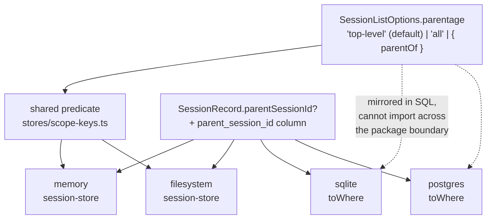

# FIX-1009: S1a — SessionListOptions has no parentage predicate, and its default is unrestricted — Implementation Spec

**Linear:** [FIX-1009](https://linear.app/fixpoint-labs/issue/FIX-1009) · **Epic:** [FIX-939 — Durable jobs & detached-task substrate](https://linear.app/fixpoint-labs/issue/FIX-939) ([epic PR #993](https://github.com/fixpoint-labs/flow-state-dev/pull/993)) · **Blocks:** [FIX-982](https://linear.app/fixpoint-labs/issue/FIX-982) · **Followed by:** [FIX-1010 (S1b)](https://linear.app/fixpoint-labs/issue/FIX-1010)

## Spec evolution

- **Spec drafted** — framed as a *default* change rather than a new option, because an omitted filter is unrestricted today and every existing listing caller passes no filter; chose a three-mode discriminated `parentage` option over an optional string so the "everything" mode stays named rather than becoming a sentinel; found that `SessionRecord` carries no `parentSessionId` at all, so the record field and its two SQL columns are inside this issue's scope rather than FIX-982's.

---

## Part I — The Case *(for the human)*

### 1. Problem — why it matters, why now

Listing sessions returns every session. That is correct today, because every session is something a person started — a conversation, a run, a report. There is nothing else in the table.

The durable-jobs epic changes that. Background work will run in a **Workstream**: a session that belongs to another session rather than to a person. The moment the first one is created, every place that lists sessions starts showing them next to the user's real conversations — the app's own session picker, the DevTool's session list, an operator's recovery scan. None of those surfaces will have been edited. They will simply start showing internal machinery to end users.

**Why now.** This has to land *before* the code that creates Workstreams, not after. Once FIX-982 starts creating them, the regression is live in every deployment between the two merges, and the fix stops being free — it becomes a change to data that already exists. Sequenced the other way it is a change to a table where no row has a parent yet, so it cannot break anything on the day it ships.

There is no workaround. A caller cannot filter out what it cannot identify: nothing on a session record says whether it belongs to a person or to another session.

### 2. Solution in plain terms

Give a session record a way to say who its parent is, and give the listing call three explicit modes:

- **top-level only** — sessions that belong to a person. This becomes the **default**, so a caller that asks for nothing gets the safe answer.
- **children of a named parent** — one session's Workstreams.
- **everything** — exactly what listing does today. Admin, debug and recovery callers still need it, so it stays available and gets a name.

The important half is the second word in "default". Adding a filter without changing the default would leave every existing caller pointed at the unrestricted behaviour, which is the behaviour that breaks. Changing the default is the fix; the filter is what makes the other two cases reachable.

Implemented once as a shared predicate and mirrored in SQL by the two database adapters, the same way tenant filtering already works.

**Philosophy** — **tenet 5 (fix at the owning layer)**: the store owns which rows come back, so parentage is a store predicate, not a post-filter each caller re-implements (also BP-033 — filter at the source). **Tenet 3 (earn every addition)**: one predicate with three modes, and the `boardId` / `coordinate` / `topic` predicates an earlier epic draft imagined are deliberately not built — nothing lists by them. **Tenet 1 (coherence over local cleverness)**: this deliberately breaks symmetry with the neighbouring `tenantId` option, whose *absence* means unrestricted; §6 decision 3 names that rather than hiding it, because a reader who pattern-matches the two will get one of them backwards.

### 3. Tradeoffs & alternatives

**Alternative: `parentSessionId?: string`.** The obvious shape, and the one the epic caught (N44). It expresses two states — omitted and named — for three needs. Shipping it either deletes the "list everything" capability or smuggles it back as an undocumented sentinel (`"*"`, `null`, `""`). Rejected. It is cheap to reject now and expensive later: once four adapters have shipped a two-state shape, widening it is a breaking store-contract change.

**The simpler approach: add the filter, leave the default alone.** Genuinely simpler, and it is what the issue title says is broken. Insufficient because *no existing caller will pass the filter* — they were all written before Workstreams existed. A positive-only filter fixes nothing that is actually broken and leaves the regression fully armed.

**Considered and rejected: make `parentage` required.** It would convert a silent behaviour change into a compile error, which is the strictest possible reading of BP-030. Rejected because it breaks every app that calls `sessions.list()` for a hazard that, on the day this merges, is exactly zero rows — and it would still not protect the one caller that genuinely can't be type-checked (a third-party store adapter). It buys noise, not safety.

**Where the complexity is:** not the predicate, which is four lines. It is (a) that the same option object now has two filters with *opposite* absence semantics, and (b) that a custom third-party `SessionStore` — a documented extension point — will silently ignore a new optional key and keep returning Workstreams, with nothing in the type system to catch it. §9 and §11 are mostly about those two.

### 4. Focus practices (1–5)

1. **BP-030 (tolerate the old shape)** — the crux of this issue. Every persisted session predates the field and every existing caller passes no filter. Records with no `parentSessionId` must read as top-level (`== null`, covering both `undefined` and a JSON `null`), and §6 decision 5 states what each existing caller gets.
2. **BP-031 (never route off caller-controllable input)** — `parentOf` takes a caller-supplied id. It must only ever *narrow* a result set, never widen one past the tenant filter already applied (N8).
3. **BP-035 (second-path checklist)** — the second path here is the *legacy row* and the *new mode*. A suite that only tests `parentOf` proves nothing; the default and `"all"` are where the behaviour change lives.
4. **One convergence point for the predicate** (tenet 5) — four adapters must agree on what "top-level" means. One shared predicate for the two in-process stores, mirrored deliberately in SQL, exactly as `matchesTenantFilter` already is.
5. **BP-003 (evidence)** — "reproduces today's behaviour" is a testable claim, not a reassurance. §10 names how it is checked.

### 5. What using it looks like

*(What this spec proposes. Today none of these compile — `parentage` does not exist and neither does `SessionRecord.parentSessionId`.)*

**The default — every existing caller, unchanged source, new behaviour:**

```ts
// The framework's own listing route, and every app that calls list() directly.
const rows = await stores.session.list({ flowKind: "chat", tenantId });
// Before: every session, including Workstreams once they exist.
// After:  only sessions with no parent. Workstreams never appear.
```

**Enumerating one session's Workstreams:**

```ts
const workstreams = await stores.session.list({
  tenantId,
  parentage: { parentOf: "sess_abc" }
});
```

**Keeping today's unrestricted behaviour, on purpose:**

```ts
// Admin/debug tooling and FIX-982's recovery scans.
const everything = await stores.session.list({ parentage: "all" });
```

**What changes for a given row (before / after):**

```
row with no parentSessionId    before → listed    after → listed        (unchanged)
row with parentSessionId set   before → listed    after → hidden        (the fix)
                                                  after, parentage:"all" → listed
                                                  after, parentOf match  → listed
```

### 6. Decisions & rules — the sign-off surface

1. **`SessionRecord` gains an optional `parentSessionId`, and this issue adds it.**
   *Rejected:* leaving the field to FIX-982, which is the code that actually writes it.
   *Locks in:* you cannot filter on a field that does not exist, so the field, the two SQL columns and their migration are inside this issue even though nothing writes the field until FIX-982. A useful consequence: because no writer exists yet, **no backfill is ever needed** — every row is NULL at migration time. Had this landed after FIX-982 it would have required a `data`-blob-to-column backfill.

2. **The predicate is tri-state and discriminated: `parentage?: "top-level" | "all" | { parentOf: string }`.**
   *Rejected:* `parentSessionId?: string` (two states for three needs, N44); and a `parentSessionId` + `includeChildren` pair, which makes 2×2 combinations for 3 meanings and lets nonsense like `{ parentSessionId: "x", includeChildren: false }` typecheck.
   *Locks in:* the "everything" mode is a **named** value rather than a sentinel, and a fourth state is unrepresentable. The exact spelling is the implementer's; the three modes and their discrimination are not.

3. **Omitting `parentage` means `"top-level"` — and this is deliberately the opposite of how `tenantId` behaves in the same object.**
   *Rejected:* absence-means-unrestricted (symmetry with `tenantId`), which is the bug; and making the option required, which breaks every caller to protect zero rows (§3).
   *Locks in:* a real coherence cost inside one options type — `tenantId` absent widens, `parentage` absent narrows. It is justified because the safe default differs: an un-tenanted list is an admin read, whereas an un-parented list is the *common* read and must be safe by default. Both semantics must be stated on the type (BP-007), because this is the thing a reader will get backwards.

4. **`parentSessionId` stores a bare session id, and `parentOf` is conjunctive with every other predicate — it can only narrow.**
   *Rejected:* namespacing the stored parent as `${tenantId}:${sessionId}`; and a store-level guard rejecting `parentOf` when no `tenantId` key is present.
   *Locks in:* consistency with `RequestRecord.sessionId` (bare id, separate `tenantId`, isolation from the conjoined filter). Because parentage only ever ANDs into the existing tenant clause, it opens no cross-tenant enumeration path that `userId` does not already have (N8, BP-031). The guard was rejected because it would block legitimate cross-tenant admin enumeration and would duplicate an isolation decision the route already owns — `handleListSessions` always passes the tenant key today, and S1b/FIX-982 must keep doing so.

5. **Every existing caller that passes no filter gets top-level-only, deliberately (BP-030).** In this repo that is exactly one production call site, `handleListSessions`, plus everything downstream of it:

   | Caller | What it passes | Gets after this ships | On merge day | Once FIX-982 ships |
   |---|---|---|---|---|
   | `handleListSessions` (`engine`, `GET /sessions`) — the only direct production caller | no `parentage` | top-level only | no change (no row has a parent) | Workstreams excluded — **desired** |
   | `client` `listSessions` → `react` `useFlow` (4 sites) | via the route | top-level only | no change | Workstreams excluded |
   | DevTool session list (`use-sessions`) | via the route | top-level only | no change | Workstreams excluded — **a real debug-visibility gap until S1b**; see §12 |
   | MCP host `list_sessions` tool | via the route | top-level only | no change | Workstreams excluded |
   | `labs/trading-desk` past-reports | via the route | top-level only | no change | unaffected (no Workstreams) |
   | Store suites (engine / sqlite / postgres) and the CLI chat integration test | mostly no filter | top-level only | no change (fixtures are parentless) | n/a |
   | FIX-982 recovery scans | `parentage: "all"` | everything | n/a | today's semantics, preserved |
   | **Third-party custom `SessionStore`** | ignores the new key | **everything** | no change | **silently returns Workstreams** — un-typecheckable; §9, §11 |

   *Locks in:* the behaviour change is inert on merge day and only becomes load-bearing when its consumer lands. That is the whole argument for this ordering.

6. **One shared predicate for the in-process stores; the SQL adapters mirror it in their `WHERE` builders.**
   *Rejected:* four independent implementations; and post-filtering in the route (violates BP-033 and would not fix a direct store caller).
   *Locks in:* the memory and filesystem stores import one function; SQLite and Postgres cannot (type-only package boundary) and reproduce it in SQL, with a comment naming the shared predicate as the source of truth — the identical arrangement `matchesTenantFilter` already uses.

**Non-goals** — the HTTP route and its query param, and request metadata on the create path (**S1b / FIX-1010**, which lands *after* FIX-982); the `client` and `react` hops (S2 / S3); *writing* `parentSessionId`, i.e. actually creating Workstreams (FIX-982); `boardId` / `coordinate` / `topic` predicates (dropped — routing resolves by derived id, so nothing lists by them); **liveness** — this filter enumerates which children *exist*, never which are *running* (N3, FIX-982's separate activity query); create-if-absent (FIX-1007).

**Size:** Medium (single PR, ~10 files across `engine` + the two store packages, plus tests and docs).

---

## Part II — The Build Plan *(for the implementing agent)*

### 7. Technical design

One field on the record, one option on the list contract, one predicate expressed four times. Nothing above the store layer changes in this issue.



- **`@flow-state-dev/engine`** — `SessionRecord` gains the optional parent id; `SessionListOptions` gains the three-mode option; `stores/scope-keys.ts` gains the predicate beside `matchesTenantFilter`; the memory and filesystem session stores add it to their existing filter chains. The predicate stays internal to the package, as `matchesTenantFilter` does; the *types* are already public via the package index.
- **`@flow-state-dev/store-sqlite`** — a nullable `parent_session_id` column with an additive, idempotent migration guarded on `pragma_table_info`; the column added to the store's indexed-column list and row projection; the three modes rendered into the `WHERE` builder.
- **`@flow-state-dev/store-postgres`** — the same, with the `information_schema` / `ADD COLUMN IF NOT EXISTS` idiom already used there.
- **Untouched:** every route, `client`, `react`, DevTool, and the execution engine. No caller source changes — the default does the work.

**The precedent to follow is FIX-682's tenant filter**, end to end: shared predicate in `scope-keys.ts`, SQL mirror with a comment pointing back at it, additive nullable column, per-package isolation tests. Read it before writing anything; this change is the same shape with different semantics.

**Solution sketch — pseudocode. Illustrative, not the contract. React to the shape.**

```
the predicate, beside the tenant one:

    match(parentage, row's parent id):
        parentage absent  → same as "top-level"      ← the default flip
        "top-level"       → row has no parent        (null OR undefined)
        "all"             → always true
        { parentOf: id }  → row's parent equals id

the two SQL adapters, in their WHERE builders:

    absent / "top-level" → parent column IS NULL
    "all"                → emit no clause at all      ← today's query, unchanged
    { parentOf: id }     → parent column = ?
```

What this asks a reviewer: **is "absent means top-level" the right default given that `tenantId` in the same object means the opposite when absent** (decision 3)? And is one tri-state key the right shape versus two independent keys (decision 2)? Whether the predicate is called `matchesParentageFilter` or something else is the implementer's to pick.

### 8. Implementation sequence

1. **Declare the record field and the option type.** `SessionRecord.parentSessionId?: string` and the three-mode `parentage` on `SessionListOptions`, both documented per BP-007 — the option's doc comment must state the absence semantics *and* contrast them with `tenantId`'s (decision 3). *Test:* typecheck only. *Depends on:* nothing.
2. **Add the shared predicate** beside `matchesTenantFilter`, with the `== null` guard covering `undefined` and `null` (decision 5, BP-030). *Test:* unit-test the predicate directly — mirror `scope-keys-tenant.test.ts`, one case per mode plus a legacy row. *Depends on:* 1.
3. **Wire the two in-process adapters** — memory and filesystem — into their existing filter chains. *Test:* per-mode listing on both; the legacy row (no field) reads as top-level. *Depends on:* 2.
4. **SQLite: column, migration, index, `WHERE`.** Additive nullable column guarded on `pragma_table_info`; add to the store's column list and `toRow`; render the three modes. *Test:* the mode matrix, plus opening a database created before the column and listing successfully. *Depends on:* 1.
5. **Postgres: the same.** *Test:* as 4. *Depends on:* 1. (Independent of 4 — both mirror step 1, not each other.)
6. **Prove the "all" equivalence.** Re-point the existing unrestricted list assertions in the three store suites at `parentage: "all"` and confirm they pass unchanged — that is the byte-for-byte claim in §10, not a new assertion. *Depends on:* 3, 4, 5.
7. **Docs and changeset** per §11.

**Nothing is removed by this change.** Worth stating because tenet 3 asks: the predicate is purely additive, and the surface it *prevents* (the `boardId` / `coordinate` / `topic` predicates) is surface never built rather than surface deleted.

No PR plan — this is Medium and ships as one PR.

### 9. Edge cases & error handling

| Case | Expected |
|---|---|
| Record persisted before the field exists (`undefined`) | Top-level. The BP-030 case, and every row on merge day. |
| Record round-tripped through a store that JSON-nulls absent keys | Top-level. `== null`, not `=== undefined`. |
| `{ parentOf: id }` where no session has that parent | Empty list. Not an error — indistinguishable from a parent with no Workstreams. |
| `{ parentOf: id }` naming a session in another tenant | Empty, **provided the tenant filter is also passed** (it is, from the route). Parentage only narrows (decision 4). |
| `{ parentOf: "" }` or a whitespace id | Empty list. Do **not** coerce empty to "top-level" — that would be a sentinel by accident, which is what decision 2 exists to prevent. |
| `parentage: "all"` combined with `flowKind` / `userId` / `tenantId` | All other predicates still apply. `"all"` disables *parentage* filtering only, never the others. |
| A session whose parent id points at a deleted session | Still a child; still hidden by default, still returned by `parentOf`. Orphan semantics are FIX-982's (N21/N59), not this issue's. |
| A self-referential or cyclic parent id | Out of scope — the predicate is a single-level equality test, not a tree walk. No recursion, so no cycle hazard exists here. |
| **A custom third-party `SessionStore` that ignores `parentage`** | **Returns everything.** No compile error is possible — it is a new optional key. Mitigated by documentation only (§11); flagged in §12. |
| Pagination interacting with the new filter | `limit`/`offset` continue to apply *after* filtering, as they do for every other predicate. A page can be shorter once children are excluded; that is correct, not a bug. |

**Taxonomy:** there are no new error paths. Every mode is a valid query; a mode that matches nothing returns an empty array. Nothing here throws.

### 10. Testing strategy

**No real-model goal check applies** — this is a store-contract and type change with no model, no flow and no streaming in the path. Per BP-003, the evidence path is a deterministic cross-adapter one instead, and it is stated as a falsifiable claim rather than a reassurance:

> **Evidence path:** the store suites in `packages/engine`, `packages/store-sqlite`, `packages/store-postgres`.
> **Pass criteria:** (1) with a parented row present, a no-filter list omits it on **all four** adapters; (2) `parentage: "all"` returns the identical set the same query returns on `main` — checked by re-pointing the *existing* unrestricted assertions at `"all"` and requiring them to pass unmodified; (3) `{ parentOf }` returns exactly that parent's children; (4) a database created before the migration opens, migrates and lists correctly on both SQL adapters.

**CI specs** (the behaviours, not the test names):

- **One behaviour per mode, on each of the four adapters.** The mode matrix is the contract, and an adapter that diverges is exactly the failure this issue exists to prevent.
- **The legacy path** (BP-030/BP-035): a record with no parent field reads as top-level, both as `undefined` in memory and as a NULL column after migration.
- **What must not change:** `parentage: "all"` reproduces today's result set, and every *other* predicate (`flowKind`, `userId`, `tenantId`, `limit`, `offset`) behaves identically in all three modes.
- **The multi-tenant second path** (BP-035, BP-031): `{ parentOf }` conjoined with a tenant filter never returns another tenant's child. Mirror the existing `tenant-isolation.test.ts` in the two store packages.
- **The invariant that is easy to state wrongly:** the default is *top-level*, not *"no parentage filtering"*. A test asserting that an unfiltered list returns every seeded row will pass today and encode the bug. Seed at least one parented row in the default-behaviour tests, or the test cannot fail.

**Discipline:** `tdd`. The seam is the `SessionStore.list` contract, reachable directly from vitest with no HTTP server and no flow — every behaviour above is a tracer bullet against a constructed store.

### 11. Documentation plan

- **EXTEND** `apps/docs/docs/persistence/overview.md` → the **Custom stores** section. It already tells custom-store authors to honour `tenantId` on `SessionListOptions`; add the parentage obligation beside it, since a custom store that ignores it silently returns child sessions (§9). **This is the load-bearing docs change** — it is the only mitigation available for the one caller class the type system cannot reach.
  *Voice risk:* describe it as parent/child sessions in plain terms. Do **not** introduce "Workstream" here — that concept has no user-facing surface until S1b/FIX-982, and naming it now documents something a reader cannot yet use. No issue IDs (the outsider rule).
- **EXTEND** `packages/store-sqlite/README.md` and `packages/store-postgres/README.md` — one line each in their existing migration notes, stating that the new column is additive, nullable, applied automatically on open, and needs no backfill.
- **No new page, and no `packages/engine/README.md` change.** The engine README does not document `SessionListOptions` today, so there is nothing to keep current; and this change adds one option to an existing contract rather than a concept users will search for. The concept page belongs to S1b, which is the issue that first gives a user something to call.
- **Changeset (BP-022):** `minor` — a public type gains a field and a documented default behaviour changes. Pre-1.0, so `minor` is the ceiling.

### 12. Dependencies, open questions & follow-ups

**Dependencies:** none. This issue leads its branch of the epic — that is the point of splitting S1a out of S1. It does not depend on FIX-982 (its consumer), FIX-1007 (create-if-absent), or FIX-992 (merged; unrelated `ResourceStateStore` surface). No open PR touches the session stores — verified against the full open-PR list.

**Open questions:** none blocking implementation.

**Follow-ups (flagged, not built):**

- **DevTool loses Workstream visibility between FIX-982 and S1b.** Once Workstreams exist, the DevTool session list — an explicitly debug-oriented surface — hides them, and the opt-in that would restore them is the route query param that S1b owns. This is an accepted consequence of the split, not an oversight, but it argues for S1b following FIX-982 promptly rather than trailing the epic. Belongs to **FIX-1010**.
- **A custom `SessionStore` cannot be made to honour this by the type system.** A new optional key is invisible to an existing implementation. Documentation is the mitigation here; if the store contract accumulates more such obligations, a conformance test-kit exported from `@flow-state-dev/engine` would be the real fix. Out of scope; follow up via `improve-codebase-architecture`.
- **Two opposite absence semantics now live in one options type** (`tenantId` absent = unrestricted, `parentage` absent = restricted). Justified per decision 3, but it is a coherence cost, and a third predicate added later should not have to guess which convention it follows. Worth a note in the store contract docs rather than a rewrite.
- **Epic-spec inconsistency, non-blocking, reported upward.** §5's sequencing note says S1a is a prerequisite of FIX-982 "on N3 and N16 grounds", with N3 assigning FIX-982 the job of enumerating a session's Workstreams *through this filter*. §7's S1a row says the opposite — "on N16/BP-030 grounds only. FIX-982 does not *read* through this filter" — while the same row also states that FIX-982's recovery scans use the `"all"` mode. Both readings make FIX-982 a caller and both require all three modes, so **nothing in this spec's scope changes either way**. Flagged for the epic to reconcile so FIX-982 is not scoped from the narrower row.

---

*No review notes yet — this spec has not been reviewed.*
