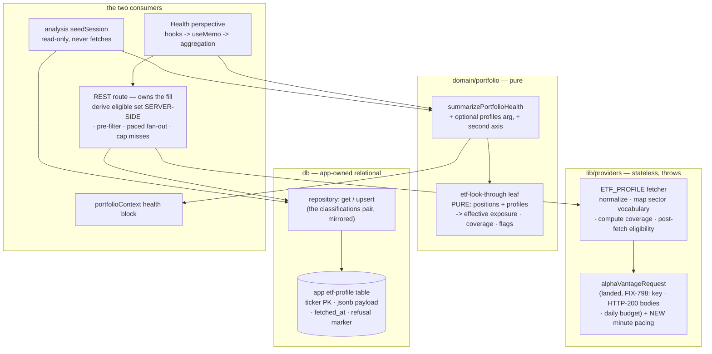

# FIX-801: Trading-desk: ETF profile & holdings look-through (Alpha Vantage ETF_PROFILE) — Implementation Spec

Linear issue: [FIX-801](https://linear.app/fixpoint-labs/issue/FIX-801) ·
Epic: [FIX-934 — Alpha Vantage data layer](https://linear.app/fixpoint-labs/issue/FIX-934) (epic PR #880) ·
Blocked by: FIX-798 (landed)

---

## Part I — The Case *(for the human)*

### 1. Problem — why it matters, why now

**The problem, in plain language.** The desk's household Health view answers "how
balanced is my book?" — biggest position, sector mix, how concentrated you are.
It answers honestly for individual stocks and gives up on funds. If you own an
S&P 500 fund and also own Apple directly, the view reports two unrelated
positions; it cannot see that the fund is itself several percent Apple. So your
real Apple exposure is understated, and however much of the book sits in funds
lands in a bucket literally labelled "Funds (no look-through)" — a placeholder,
not an answer. The same blind spot rides into the analysis pipeline, where the
trader and portfolio manager size a new position against that same partial
picture.

How wrong is it? On a worked example of $10k Apple held directly plus $30k in a
Nasdaq-100 fund and $60k in an S&P 500 fund, Apple's real weight is **16.9%**,
not the 10.0% the view reports — 69% higher than the line item shows.

**Why now.** This is a wrong number in a real-money view, not a missing
nicety. The consumer already exists and already says it is waiting: the health
aggregation ships a literal `lookThrough: "none"` marker, exempts funds from
single-name concentration flags, and its own file header names this issue as the
refinement. There is no workaround a user can apply — the desk has no ETF data
source of any kind. And the data is now cheap to get: the Alpha Vantage provider
foundation landed with FIX-798, and its `ETF_PROFILE` endpoint returns a fund's
holdings with weights on the free tier.

### 2. Solution in plain terms

Teach the desk what is inside a fund, then use it to compute a second, clearly
labelled read of the book — and refuse to compute it when the data isn't good
enough.

Four moves:

1. **Fetch and remember.** Ask Alpha Vantage for a fund's holdings once, and keep
   the answer in the app's own database, keyed by ticker. Constituent lists barely
   move (an index reconstitutes quarterly or annually); the weights drift with
   prices, but by tens of basis points over a week — immaterial to "am I too
   concentrated in Apple?". So this is reference data, not a quote: fetched lazily
   the first time a fund appears in someone's book, refreshed only when the stored
   copy is older than a stated bound, and stamped with when we fetched it.
2. **Compute effective exposure.** Combine each fund position with its
   constituent weights so a directly-held name and the same name held inside a
   fund add up instead of sitting apart, and attribute the fund's sector mix to
   real sectors instead of the "Funds" placeholder.
3. **Refuse when the data is too thin.** The provider is not uniformly good. For
   a US-equity fund it returns the whole book (~500 constituents summing to
   99.5%). For an international fund it silently returns **only the US-listed
   lines** — one measured example gave 15 of 137 holdings, summing to 26% of the
   fund, with no error and no warning. A fund whose holdings don't account for
   enough of it is left opaque and *named as incomplete*, not half-attributed.
4. **Report it as a second axis, not a replacement.** The existing wrapper-basis
   figures stay exactly as they are — that is what the brokerage statement says,
   and it is observed rather than derived. The look-through read sits beside it,
   labelled, with its own coverage figure. Nothing is renormalised to make the
   percentages look tidy.

**The philosophy that led here.**

- **Tenet 2 (composition over features).** The fetch composes the landed
  `alphaVantageRequest` — key gating, Alpha Vantage's HTTP-200 error bodies, and
  the shared 25-request daily budget are already solved and are not
  reimplemented. The persistence composes the existing app-owned table model
  (the `instrument_classifications` lazy-fill table that already backs the
  health view's sector axis is the same shape, and the `quotes` table is the same
  as-of discipline). The math composes the one existing pure health leaf rather
  than standing up a parallel aggregation.
- **Tenet 3 (earn every addition; subtract as you go).** The `lookThrough:
  "none"` literal was a placeholder for precisely this work; it widens rather
  than gains a sibling field. No ETF *analysis tool* is added, because no analyst
  consumes one yet (that is FIX-777) — a tool with no caller would be surface
  that hasn't earned its place.
- **Tenet 7 (prove the goal, not the mock).** The outcome that matters is
  arithmetic a human can check by hand: a book of one S&P fund plus a direct
  Apple position must report an Apple exposure larger than the direct position
  alone. That is the goal check, run against a real fetched profile.

Aligned to the epic (FIX-934 §2b/§2c): one provider module, one daily budget,
one provenance convention — and FIX-801 is one of the two consumers the epic
expects to add a *new* primitive rather than extend an existing tool's fallback
chain.

### 3. Tradeoffs & alternatives

**The main alternative: make look-through the primary basis** — replace the
wrapper-basis weights and flags with effective exposure everywhere. Rejected as a
*payload* decision, though the UI may still lead with it per view (see below).
Look-through is derived from partial data, so making it *the* answer would quietly
replace an observed number with an estimate. The desk's discipline throughout is
the opposite: keep the observed figure, add the derived one beside it, and surface
the gap (the `preGate*` fields on the portfolio-manager gates and the
`basisUnknown*` fields on realised gains are the same shape). It also keeps
existing readers of `lookThrough: "none"` working (BP-030).

There is a real counter-argument worth recording, because the established
precedent outside this codebase goes the other way. Morningstar's Portfolio X-Ray
splits by *view type*: look-through replaces the wrapper in the analytical views
(sector, region, concentration) and the wrapper stays in the holdings views — on
the grounds that a portfolio of funds has no meaningful sector breakdown
otherwise, which is exactly what our "Funds (no look-through)" bucket
demonstrates. This spec resolves that by keeping **both** in the payload and
letting the presentation lead with look-through where it is the better answer. The
payload stays additive; the chart the user sees first is a UI call.

**The simpler approach considered: attribute only the fund's *sector* mix and
skip single-name reconciliation.** It would fix the ugliest symptom (the "Funds"
bucket) for maybe a third of the work. Rejected because single-name
double-counting is the correctness bug the issue actually names, and both reads
come from the same fetched profile — cutting one saves the fetch of nothing and
the math of very little.

**The provider we did not use: Yahoo, which is already a dependency.** The desk
already depends on `yahoo-finance2`, already calls `quoteSummary` with typed
module lists, and already routes fund *sector* data through Yahoo — so
`quoteSummary({ modules: ["topHoldings"] })` is the obvious keyless,
budget-free reuse candidate, and leaving it unmentioned would invite an
implementer to re-litigate the choice. It is rejected on depth: Yahoo's
`topHoldings` returns roughly the top ten constituents, which for an S&P 500
tracker is about 36% of the fund — comfortably below the coverage floor in
Decision 4, so every fund would gate itself out and the feature would do nothing.
Yahoo is the right source for a fund's *sector* mix if we ever want a second
opinion, and the wrong one for look-through. (Worth revisiting only if Yahoo
starts returning full constituent sets.)

**A second simpler approach considered and partly taken: cache in memory rather
than in the database.** The desk's only cache today is a 120-second in-process
one. For data on a quarterly cadence against a 25-per-day budget, that would
re-spend the budget on every cold start. The durable table is the simpler thing
*in aggregate*, and it is the shape the sector axis already uses. (This is
deliberately *not* the general durable day-cache the epic leaves open as its
fourth pillar — that pillar stays open; see §12.)

**Where the genuine complexity is.** Not the fetch and not the multiplication. It
is that **the provider is quietly unreliable and says nothing about it.** There is
no as-of date in the response, no echo of which fund it describes, no signal when
three quarters of a fund is missing, and a documented allocation field that has
simply disappeared from live responses. Every derived number therefore has to
carry its own coverage, and the honest behaviour on thin data is to withhold the
number rather than caveat it. Secondary: a shared 25-per-day budget means a
retry-forever failure path can starve the analysis pipeline; and the same
arithmetic has to come out of one leaf in two very different callers (the browser
pane and the server-side analysis seed).

### 4. Focus practices (1–5)

1. **Never renormalise to hide a gap, and withhold rather than caveat** (tenet 7,
   BP-020's spirit). Uncovered fund weight is an explicit residual, never
   redistributed to make a total reach 100%. Below a coverage floor the fund is
   not attributed at all. A figure computed from partial data carries its coverage
   number or it is not shown.
2. **Compose the provider, don't re-solve it** (tenet 2). The new fetcher calls
   `alphaVantageRequest` and nothing else touches HTTP, the API key, the HTTP-200
   body errors, or the daily budget. If the fetcher needs a behaviour the shared
   request lacks, that behaviour belongs in the shared request.
3. **One copy of the money math** (tenet 5, BP-034). The look-through arithmetic
   is a pure leaf consumed by both the Health pane and the analysis seed, exactly
   as `summarizePortfolioHealth` and `holdingMarketValue` already are. Two call
   sites, never two implementations.
4. **Widen the old shape; don't fork it** (BP-030). `lookThrough` goes from the
   literal `"none"` to a small union, and the wrapper-basis fields keep their
   current meaning and names. A stored session or a consumer written before this
   change must still read a valid value.
5. **Every request is a shared budget unit.** The 25-per-day allowance is spent by
   the whole Alpha Vantage family, so a path that can re-spend a unit on every
   page mount is a bug, not an inefficiency. Fetch only funds whose profile will
   actually be used, and remember refusals as well as answers.

### 5. What using it looks like

**A household read, before and after.** The Health perspective's aggregation is
already the one call both the pane and the analysis seed make; it gains an
optional fund-holdings input and a second axis on its result.

```ts
// Before — funds are opaque; the caller passes quotes + sector classifications.
const before = summarizePortfolioHealth(accounts, quotes, classifications, asOf);
before.lookThrough;                      // "none"
before.concentration.maxPosition;        // { ticker: "AAPL", weightPct: 10.0 }  ← direct only
before.sectorExposure;                   // [{ bucket: "Funds (no look-through)", pct: 90.0 }, …]

// After — one more optional map: ticker → the fund's stored profile.
const after = summarizePortfolioHealth(accounts, quotes, classifications, asOf, etfProfiles);
after.lookThrough;                       // "partial"
after.concentration.maxPosition;         // { ticker: "AAPL", weightPct: 10.0 }  ← unchanged, observed
after.sectorExposure;                    // unchanged — still the wrapper basis

after.lookThroughExposure?.maxPosition;  // { ticker: "AAPL", weightPct: 16.9 }  ← +6.9 seen through the funds
after.lookThroughExposure?.coveragePct;  // 99.0  ← how much of the book we attributed
after.lookThroughExposure?.sectorExposure;   // real sectors, no "Funds" bucket
after.lookThroughExposure?.flags;        // look-through-basis flags, tagged separately
after.lookThroughExposure?.opaqueFunds;  // funds left unattributed, with why
```

Called with no profiles (or none fetched yet) it returns `lookThrough: "none"`
and a null second axis — today's behaviour, unchanged.

*(Illustrative — a sketch of the usage, not the contract. The exact field names
are the implementer's; what is fixed is that the wrapper-basis fields keep their
meaning, the second axis is nullable, and it carries its own coverage, its own
flags, and a list of the funds it could not see into.)*

**Filling the cache is a lazy REST read, mirroring the sector axis.** The client
asks once, with no ticker list — the route derives the household's eligible fund
tickers server-side from the user's own holdings (BP-031/033, exactly as the
classifications route does), and returns the stored profiles plus, for each fund
it could not attribute, the reason. The client hook takes no arguments, following
`useClassifications`, and exposes a ticker-keyed map alongside the refusal list, so
the Health section gains one hook call and one more argument to the aggregation it
already runs in a `useMemo`.

### 6. Decisions & rules — the sign-off surface

1. **Fund profiles live in a durable, ticker-keyed app table, lazily filled and
   refreshed only when the stored copy is older than a stated bound — not fetched
   per run, and not held in the in-process cache.** *Alternative rejected:* route
   the data through the analysis tool catalog (`resolveToolPayload` / fixtures /
   `getOrFetch`), the convention every `get_*` data tool follows. *Ramification:*
   this is the `instrument_classifications` + `quotes` precedent rather than the
   tool precedent — and it is the documented intent: that table's own header
   already calls itself "a minimal security-master seam FIX-801's ETF profiles can
   later join." It is chosen because the primary consumer is the Portfolio pane,
   which has no session and no `dataSource` and is deliberately outside the
   analysis fixture/live system (the same reason `refreshQuotes` is a REST route
   reusing a fetch idiom rather than a tool). Three consequences worth seeing at
   sign-off: the analysis seed reads the table **read-only and never fetches** (the
   sector-classification precedent), so a run sees look-through only for funds the
   Portfolio view has already warmed; a fixture-mode analysis run therefore carries
   live-derived holdings in its portfolio context, and is not byte-reproducible on
   this axis; and because there is no fixture escape valve, the cost discipline the
   catalog would have given us has to be built deliberately instead (Decision 5).

2. **Look-through is an additive second axis in the payload; the wrapper-basis
   fields are untouched.** *Alternative rejected:* make effective exposure the
   primary basis and drop the wrapper view (the Morningstar posture — see §3).
   *Ramification:* `lookThrough` widens from the literal `"none"` to a small union,
   a nullable look-through block joins the payload, and every existing field keeps
   its current meaning and name — so pre-change consumers and stored sessions stay
   valid (BP-030). In particular the existing `sectorExposure` keeps its "Funds (no
   look-through)" bucket and the existing concentration flags keep their fund
   exemption; the attributed sector breakdown lives on the new axis. Which one the
   UI shows *first* is a presentation call, not a payload one. This does extend the
   payload, refining the health leaf's own note that FIX-801 would refine funds
   "without reshaping the payload" — the extension is purely additive and
   non-breaking (nothing today reads `lookThrough` outside its test), and that note
   is corrected as part of this change rather than left to contradict the code.

3. **Uncovered fund weight is an explicit residual and is never renormalised.**
   *Alternative rejected:* scale the known constituent weights up so each fund's
   attribution sums to 100%. *Ramification:* look-through weights legitimately do
   not sum to 100%, so every consumer reads the accompanying coverage figure to
   interpret them. The cost of the alternative is measurable: on a fund the
   provider covers badly, renormalising would report a 7.0% constituent as
   **27.3%** — a near-4× fabrication presented as a concentration alert. It also
   fixes the reading of the derived figures: an effective single-name weight is a
   **lower bound**, so a flag firing is trustworthy while a flag *not* firing is not
   a clean bill of health, and the UI copy must say exactly that.

4. **A fund is attributed only if it passes two gates: an eligibility predicate
   and a coverage floor. Otherwise it stays opaque and is named as incomplete.**
   *Alternative rejected:* attribute every fund we can fetch, however thin, and let
   the coverage number carry the caveat. *Ramification:* this is the decision the
   research forced and the one most worth scrutinising. *Eligibility* keeps out the
   funds whose constituents aren't resolvable single names at all — mutual funds
   (the endpoint is ETF-only; the provider's own listing universe contains no
   mutual funds), leveraged and inverse funds (the payload flags these itself, so
   we read the flag rather than guess from weights), and commodity or bond funds
   whose constituents are bullion or unsymboled debt. Without this, a gold fund's
   bullion line or a treasury fund's unsymboled holdings would be attributed as a
   "single name" and could trip a concentration flag. *Coverage* catches the silent
   case: the provider returns only the US-listed portion of an international fund's
   book — 15 of 137 holdings summing to 26% in one measured example, with no error
   and no flag. Attributing that produces numbers that are technically lower bounds
   and practically noise. So coverage is a **gate, not just a label**: below the
   floor the fund is left in the opaque bucket exactly as today and surfaced as
   "holdings data incomplete". The floor is an exported named constant beside the
   existing concentration thresholds (~85% proposed; a tuning number, not a
   contract).
   **The gate is evaluated per axis, not per fund.** Holdings coverage and sector
   coverage are independently incomplete (Decision 7), so one verdict cannot serve
   both: a profile at 90% constituent coverage and 25% sector coverage would either
   publish exactly the sector noise the gate exists to prevent, or throw away a
   sound name axis. So a fund can **pass for names and fail for sectors**, or the
   reverse. Each axis carries its own coverage figure and its own opaque set; in the
   asymmetric case the fund appears attributed on the axis it passed and in the
   opaque list *for the other axis*, labelled with which data was thin. Both
   asymmetries are tested.

   **A thin profile is stored, not refused.** Failing a coverage gate is a
   *presentation* verdict about data we hold, not a fetch failure: the row is
   persisted and re-read normally, and it refreshes on the ordinary staleness bound
   because coverage may improve. Only genuine fetch failures and permanent
   ineligibility become refusals (Decision 5).

   Two consequences of passing the gate are *not* symmetrical, and the difference is
   load-bearing. **Single-name figures — largest name, top-N — are honest lower
   bounds** above the floor and are reported as point estimates. **The
   effective-position count is not**, and is reported as an interval rather than a
   number, because its formula squares the weights and the unattributed remainder
   can land anywhere. Writing *r* for the residual share and *w*ₘₐₓ for the largest
   attributed weight, the concentration measure is bounded by

   > `Σwᵢ² ≤ HHI ≤ Σwᵢ² + 2·wₘₐₓ·r + r²`, so the count lies in
   > `[ 1 / (Σwᵢ² + 2·wₘₐₓ·r + r²) , 1 / Σwᵢ² ]`.

   The lower end is the residual piling entirely onto the **largest name we already
   see** — not onto a new name. That distinction is the whole point: a residual that
   *overlaps* an observed holding raises the measure by `2wr + r²`, strictly more
   than the `r²` a brand-new name would add, and overlap is the common case here
   because an opaque fund often holds names the household also holds directly.
   (Worked: four observed 20% names plus a 20% residual give a count of 3.57 when
   the residual overlaps one of them — outside the interval a new-name-only bound
   would allow, which is why that bound is wrong.) Note the width is therefore
   dominated by the **linear** term whenever *w*ₘₐₓ exceeds *r*/2, so even at 95%
   coverage a book of twenty effective names carries an interval of roughly 16–20,
   not a few percent either way. The interval tightens as coverage rises and reads
   like a point estimate when the data earns that; a wide range is itself the signal
   that it doesn't.

   *Also refused:* a book whose invested denominator is not a long-only net — the
   existing aggregation nets signed market value into invested NAV, so a short fund
   position shrinks the denominator and would inflate every effective weight above
   100%. The second axis returns null for such a book, with the reason named, rather
   than reporting uninterpretable weights (§9).

5. **A refusal is remembered, not retried on every read.** *Alternative rejected:*
   the classifications precedent of returning a failure without persisting it, so
   it retries on the next request. *Ramification:* that idiom came from a keyless
   provider where a retry is free. Alpha Vantage's 25-per-day allowance is shared
   with the whole analysis family, so "never persist a failure" means every mount
   of the Health view re-spends units on the same unfetchable ticker — a mistyped
   symbol or an ineligible fund could starve the analysis pipeline of its budget.
   So a refusal is stored as a marker with its reason and a **retry-at** stamp, and
   is not re-attempted until that moment passes. One generic delay cannot work: a
   short one re-spends an already-exhausted daily budget on every mount, and a long
   one blocks the next-day healing a quota refusal is entitled to. The backoff is
   therefore **per failure class**, and the classes are enumerated in §9 — with
   quota exhaustion the special case that heals at the provider's **daily reset**
   rather than after any fixed delay. Transient failures heal on their own schedule;
   permanent ones stop costing. The fetch set is also narrowed to funds whose
   profile will actually be *used* — skipping unpriced funds, excluded
   (`inconsistent_history`) rows, and anything the aggregation's own classifier
   would not treat as a fund — so a unit is never spent on a profile nothing reads.
   And what the desk can already rule out locally is **pre-filtered before the
   fetch**, not refused after it: the curated bond-ETF list and the existing asset
   classification are consulted first, so an ineligible fund costs zero units
   instead of one unit to learn what we already knew. (Only the leveraged/inverse
   flag genuinely requires the payload.) That is also where the curated list earns
   its keep, which is part of why open question 2 keeps it.

   **This decision expands scope into a shared module, deliberately.** The free tier
   caps at five requests per *minute* as well as 25 per day, and the landed shared
   request implements only the daily counter — while reserving its daily unit
   *before* the fetch. So an uncached household with more than five funds is
   throttled on request six having already spent those units: the budget is debited
   for answers we never receive. Bounding concurrency does not fix it; concurrency
   limits how many are in flight, not how many start per minute. The minute limit is
   a property of the provider, so the pacing goes into the **shared request** where
   it is cured for every Alpha Vantage caller (tenet 5) rather than into this
   feature's fan-out where the next consumer would rediscover the bug. FIX-801 owns
   adding it because it is the first caller to fan out over many tickers.
   *Alternative rejected:* pace locally in this route and leave the shared seam
   as-is — cheaper here, but it guarantees the same defect in FIX-799, FIX-800, and
   FIX-802.

6. **Store whatever holdings the provider returns, at full depth; no top-N
   truncation in the desk.** *Alternative rejected:* keep only the top 10–25
   constituents to bound row count. *Ramification:* the provider already returns
   the full constituent set for the funds it covers well (~500 rows for an S&P 500
   tracker, at no extra request cost), so truncating would be self-inflicted data
   loss — and the numbers say top-N is not a viable design anyway: the top *ten*
   holdings of an S&P 500 tracker are only ~36% of it, and the top fifty ~60%. A
   top-10 design would leave two thirds of the fund unattributed, i.e. below the
   Decision 4 floor — it would gate itself out. Row counts stay bounded by how many
   distinct funds a household holds, and the prompt-facing rendering is summarised
   (top constituents plus a residual line), never dumped.

7. **The single-name axis comes from the constituent holdings; the sector axis
   comes from the fund's own reported sector allocation; and the canonical sector
   vocabulary stays the one the app already uses.** *Alternative rejected:* derive
   the sector axis by resolving each constituent's sector through the existing
   classification path. *Ramification:* two provider fields feed two axes, so each
   carries its own coverage figure and both are partial (the provider's sector
   weights summed to 96% on the same fund whose holdings summed to 99.9%, and to
   25% on the badly-covered one). Because those two figures move independently, the
   coverage gate is evaluated **per axis** — a fund can be attributed for names and
   withheld for sectors (Decision 4) — and both figures plus their verdicts travel in
   the route's projection, since the client cannot recover the sector axis any other
   way (§7). It avoids fanning out hundreds of
   per-constituent classification lookups for an answer the provider already
   states. The trap this decision closes: the provider's sector labels are
   upper-case GICS names while the app's existing buckets are the sector strings
   its equity classifier produces — merging them naively would create parallel
   duplicate buckets. Provider labels are therefore mapped to the app's vocabulary
   **at the fetcher**, and a label that doesn't map becomes its own explicit
   bucket rather than being silently folded into a neighbour.

8. **The look-through basis gets its own concentration flags, tagged as such,
   beside the wrapper-basis flags.** *Alternative rejected:* let look-through
   change the existing flag set, or emit no flags at all on the new axis.
   *Ramification:* this is the most user-visible output of the whole change, so it
   is decided here rather than left to the UI: the existing flags keep the fund
   exemption and their current meaning (Decision 2), and the new axis emits its own
   flags at the same thresholds, distinguishable by which basis produced them. A
   flag on the look-through basis reads "you are effectively over-concentrated in
   X, counting funds", and inherits the lower-bound caveat from Decision 3.

9. **No analysis data tool and no new analyst wiring in this issue.**
   *Alternative rejected:* add `get_etf_profile` to the tool catalog alongside the
   durable table. *Ramification:* the analysis pipeline gains look-through only
   through the health block already injected into the trader and portfolio
   manager's `<portfolioContext>` — no new tool, no fixture corpus entry, no
   analyst fan-out change. ETF *analysis* (an analyst reasoning about the fund
   itself) stays FIX-777's scope, which can add the catalog tool over the same
   fetcher when it has a caller. Accepted cost: until then, one provider call has
   two caching disciplines in the repo (this table, and FIX-777's future tool) —
   flagged in §12 so the second one composes rather than duplicates.

10. **Three sub-PRs, with the pure arithmetic independent of the plumbing.**
    *Alternative rejected:* one PR (the original sizing). *Ramification:* the work
    is Large, and splitting it puts all of the honesty accounting — the residual,
    the coverage floor, the lower-bound reading — in one reviewable diff with no IO
    in it, instead of buried under a migration and a route. The data path and the
    math are genuinely independent and can be built in parallel; the consumers
    depend on both. The DAG is in §8.

**Non-goals.** No mutual-fund look-through; no leveraged, inverse, commodity, or
bond-fund attribution; no analysis-catalog ETF tool or analyst wiring (FIX-777);
no drift-vs-target or rebalancing math (FIX-761); no generalised durable day-cache
for Alpha Vantage (the epic's open fourth pillar); no multi-level look-through (a
fund inside a fund resolves one level only; a fund-of-funds is detected via the
ordered oracle in §7 and left opaque rather than half-decomposed, and a constituent
identified as a fund is never counted as a single name); no expense-ratio-weighted cost analysis
beyond storing the ratio; and — the one worth reading twice — **the deterministic
decision gates stay on the wrapper basis.** Look-through reaches the trader and
portfolio manager as context they reason with, not as an input to the policy,
mandate, or evidence clamps, so a book that is over-concentrated *through funds* is
surfaced to the human and to the model but does not by itself trip a size cap.
Making the gates look-through-aware is a real-money behaviour change that deserves
its own issue and its own sign-off (§12, open question 1).

**Size estimate: Large** — ~15 files and >500 LOC across per-minute pacing in the
shared provider request, a provider fetcher, a table plus migration and repository
methods, a REST route that owns the fill, a client hook, a new pure domain leaf, a
widened health payload, the Health-perspective UI, the analysis-seed prompt block,
tests, one new doc and several doc edits. Split into the three sub-PRs declared in
§8 (Decision 10). No framework-package changes; entirely `labs/trading-desk`.

---

## Part II — The Build Plan *(for the implementing agent)*

### 7. Technical design

All changes are in `labs/trading-desk`. No framework package is touched. Four
layers, each following a convention the app already has exactly one of — and the
shape is deliberately the **classifications route**, the closest existing analog
(lazy fill of a global ticker-keyed reference table from a provider), not the
injected-fetcher shape that `refreshQuotes` uses.



**Why there is no separate injectable "source" layer.** An earlier draft put a
`getOrFetch`-wrapped source function between the route and the fetcher, on the
`PortfolioQuoteSource` / `SplitFetcher` precedent. It has been removed: the
durable table already *is* the cross-request cache, so wrapping the fetcher in the
120-second process cache is a cache on top of a cache, and it would additionally
mask a refusal for two minutes. The injected-function precedent exists so a
*domain service* can avoid importing a provider — but there is no domain service
here (the seed is read-only, so the fill logic has exactly one runtime caller),
and inventing one to justify the seam would be surface without a second consumer.
Tests mock the fetcher module, exactly as the classifications route spec does.

**What each layer owes.**

- **Provider.** One new fetcher for the `ETF_PROFILE` endpoint, calling the landed
  shared request. It is where every provider quirk stops (Decision 7, focus
  practice 2): every scalar and every weight arrives as a string, with an `"n/a"`
  sentinel; weights are fractions, but parse defensively — a production client in
  the wild handles both `0.511` and `"51.1%"`; the response does **not** echo which
  fund it describes, so identity comes from the request; there is **no as-of or
  portfolio date at all**; the documented asset-allocation field is absent from
  live responses and must be treated as optional-and-probably-gone; and sector
  labels are upper-case GICS needing the vocabulary mapping. The fetcher also
  computes the fund's coverage total and decides eligibility, so downstream layers
  receive an already-judged, provider-neutral profile. It throws on failure, like
  every other fetcher here.
- **Store.** One row per fund ticker, the profile carried as a jsonb document.
  There is no cross-fund query, no join, and no aggregation — a profile is always
  read whole, by ticker — so jsonb is right and adding fields later is free (the
  `holdings.attributes` precedent). Global, not user-scoped: no ownership guard,
  matching the classifications and quotes tables. The row also carries our fetch
  time (the only date available) and, for a refusal, its reason and timestamp so
  the backoff in Decision 5 can be honoured. Repository read/upsert mirror the
  classifications pair. **The staleness bound is ~30 days**, and that is a ceiling
  imposed by the data, not a preference: index membership only moves quarterly, but
  some large ETFs (the Vanguard share-class funds among them) publish holdings
  monthly with a roughly two-week lag, so a bound much tighter than a month cannot
  be satisfied for them and would just burn budget re-fetching an unchanged file.
- **Route.** Owns the fill: derives the eligible fund set from the user's own
  holdings, pre-filters what the desk can already rule out, reads the table, and
  fetches only the misses and the stale — paced, with a cap on how many misses one
  call will fetch (§8). It also **projects** what it returns rather than shipping the
  whole stored document. The projection must carry **everything the pure leaf needs
  to produce both axes**, which is: per-constituent ticker and weight; the **mapped
  sector-allocation rows**; **both** coverage figures (names and sectors) and their
  per-axis gate verdicts; the fund's eligibility/refusal status and reason; and the
  fetch date. Dropping the sector rows would make the promised sector attribution
  unproducible on the client while Decision 7 forbids recovering it by
  per-constituent lookups — so they are part of the contract, not an optimisation to
  trade away. What the projection *omits* is the per-constituent descriptive payload
  (names, types, raw provider fields), which is where the bulk sits: constituents
  reduce to a ticker and a number, sector rows are a dozen per fund, so a
  ten-fund household lands in the low hundreds of kilobytes rather than megabytes.
  The full document stays in the table.
- **Domain.** A **new pure leaf** owns the look-through arithmetic — kept out of
  the health module, which is already large, and unit-testable on its own. The
  health aggregation gains one optional trailing argument (positional, matching how
  `buildPortfolioContext` already appended its optional classifications map) and
  calls the leaf; it keeps every existing field and adds a nullable second axis.
- **Consumers.** The pane fills the cache through the route and passes profiles
  into the aggregation it already runs. The analysis seed reads the table
  **read-only and never fetches** — precisely how it already reads sector
  classifications — so an analysis run sees look-through for funds the pane has
  already warmed, and never spends a budget unit.

**Effective exposure, directionally.** For each priced, non-cash, positive-mass
position: a direct name contributes its whole market value to its own ticker; an
attributable fund contributes `marketValue × weight` to each constituent and its
unattributed remainder to an explicit residual; an ineligible, thin, or
unfetchable fund contributes its whole market value to the residual and is named
in the opaque list. Weights use the same invested-NAV denominator as the wrapper
basis so the two axes are directly comparable, and the residual is what makes the
look-through total reach 100%.

Four things to pin, because they are the places two implementers would diverge:

- **Units, stated once.** Constituent weights are **fractions in [0, 1]** (the
  provider's convention, defensively parsed). Every field whose name ends `Pct` is
  **0–100**, matching the existing payload throughout. Do not mix them.
- **The residual is a named entry, not a position.** It carries its mass, its
  share, and the one cause that *isn't* recoverable elsewhere — the
  non-attributable constituent lines (unsymboled foreign, futures, cash rows) that
  came from funds we did attribute. The per-fund causes (thin, ineligible,
  unfetchable) are already on the opaque-fund list with their reasons, so the
  residual does not restate them; a consumer that wants the breakdown joins the two.
  The residual is **not** rankable as a top position and can never be the
  largest-name answer.
- **The look-through single-name axis contains only names — and the fund oracle is
  specified, because the default classifier gets this wrong.** A fund is either
  decomposed into constituents or left opaque; a fund ticker is never itself an entry
  on that axis. The trap: `classifyInstrument` types a bare ticker-shaped symbol as
  `equity` absent a hint, so an all-ETF allocation fund would otherwise report its
  component ETFs as single-name concentrations and could fire a false concentration
  alert. Constituents therefore default to **name**, and fund-ness is a *positive*
  finding from an ordered oracle: (1) a stored profile row for that ticker in this
  same table — a successful ETF profile proves it is a fund, a "not an ETF" refusal
  proves it isn't; (2) the desk's curated fund lists (the bond-ETF list and the
  classifier's existing fund sets); (3) the household's own classification, if it
  holds that ticker; (4) as a last resort, a fund-shaped signal on the constituent's
  description text — used **only** to route a constituent *away* from the name axis,
  never to assert that something is a name. Detection is then applied at the **fund**
  level: when a material share of a fund's constituent weight resolves as funds, the
  fund itself is ineligible (it is a fund-of-funds) and stays opaque rather than
  being half-decomposed. Residual risk, stated rather than hidden: a first-encounter
  allocation fund whose components are in none of layers 1–3 relies on layer 4, so
  step 1 must verify the signal against a real allocation fund's profile and §9
  carries the regression case. This preserves the wrapper basis's existing conviction
  that a 30% index fund is not a 30% single name.
- **Two coverage figures, not one.** The name axis and the sector axis are fed by
  independent provider fields with independently incomplete sums (Decision 7), so
  each reports its own coverage. `lookThrough` itself stays a two-state union —
  `"none"` when nothing was attributed (no funds held, or none attributable) and
  `"partial"` when something was. There is deliberately no `"full"` state: coverage
  is never 100%, and a state that can't occur would invite consumers to branch on
  it.

**One known incoherence, surfaced rather than papered over.** The health leaf's own
header states that the pane and the trader/PM "see ONE household picture, not
two." Because the seed reads the table but never fetches (Decision 1), the same
household can read `"partial"` in the browser and `"none"` in a headless run whose
funds nobody has warmed. That is a real divergence in a documented invariant. It is
accepted rather than hidden, on the grounds that the alternative — letting the
analysis seed spend shared budget mid-run — is worse, and that the honest failure
is the *lesser* picture, never a different one: the seed's numbers are always a
subset, never a contradiction. The leaf's header comment is updated to say so, and
both surfaces label their coverage, so a reader can tell which picture they have.

**Presentation** should follow the two-level shape the established tools use: one
aggregate row per effective name, expandable to show which wrapper each slice came
from (including the direct holding as one of the sources), with the fetch date on
the per-fund sub-row where it belongs. The existing sector buckets already expand
to constituents, so this is the same idiom.

### 8. Implementation sequence

**PR plan (Decision 10).** Sub-PR branches are `fix/FIX-801-<id>`; **b** carries
no IO and is where the honesty arithmetic is reviewed.

| sub-PR | deliverables | depends_on |
|---|---|---|
| a | minute pacing in the shared Alpha Vantage request · provider fetcher (normalization, sector-vocabulary mapping, coverage, post-fetch eligibility) · table + migration + repository pair · REST route owning the fill (pre-filter, paced fan-out, miss cap, refusal markers + backoff) · client hook | — |
| b | the pure look-through leaf · the widened health payload (union, nullable second axis, optional trailing argument) · the stale doc-comment removals | — |
| c | Health-perspective UI · analysis-seed read + prompt projection and renderer · the docs in §11 | a, b |

**Ordered steps within each.**

*Sub-PR a — the data path.*

0. **Minute pacing in the shared request** (Decision 5). Add per-minute admission
   control alongside the existing daily counter, in the same shared function, so
   every Alpha Vantage caller inherits it. The ordering matters: the daily unit is
   currently reserved *before* the fetch, so pacing must gate *before* that
   reservation — otherwise a throttled request still debits the day. *Test:* a
   sixth call inside one minute waits rather than firing; a paced call does not
   consume a daily unit while waiting; the daily guard's existing behaviour and its
   spec are unchanged; and the pacing is disabled by the same unlimited sentinel the
   daily limit already honours (a paid plan has no 5/min cap).
1. **Provider fetcher.** *Test:* unit-test normalization against captured
   responses — string parsing and `"n/a"` sentinels, both weight formats, the
   coverage total, the sector-vocabulary mapping including an unmappable label,
   eligibility refusals (leveraged flag, no resolvable constituents), and that all
   four of the landed Alpha Vantage error types propagate unchanged.
2. **Table + migration + repository.** Add the table to the schema module, run the
   generator (never hand-write the SQL), commit the generated migration and
   journal entry, add the read/upsert pair with a read-boundary mapper. *Test:*
   round-trip spec mirroring the instrument-classifications repository spec —
   round-trip, omit-unknown, upper-case on read and write, overwrite in place,
   same-ticker batch dedupe, empty-input no-ops, and a stored refusal round-trip.
3. **REST route (owns the fill) + client hook.** Derives the eligible fund set
   from the user's own holdings server-side, pre-filters what the desk can already
   rule out, reads the table, fetches only the misses and the stale, persists
   successes **and** refusals, honours the backoff, and returns a projection plus
   per-fund refusal reasons. Short-circuits with no fan-out for a fund-less book.

   **Fan-out policy, pinned** — do not copy the classifications route's
   concurrency, which fans out to a *keyless* provider and is the wrong precedent
   for a keyed 5/min + 25/day one. This route fetches misses at low concurrency
   (serial or two at a time), leans on the shared pacing from step 0 rather than
   re-implementing it, and **caps how many misses one call will fetch** — roughly a
   minute's worth — leaving the remainder to the next read. A twelve-fund cold
   household therefore warms over a few reads instead of colliding with both limits
   at once, and the cap is what keeps one page load from consuming half a day's
   budget.

   *Test:* route spec against the in-memory migrated repository with the fetcher
   module mocked, mirroring the classifications route spec — server-derived set, no
   fan-out on a fund-less book, a pre-filtered ineligible fund costing zero fetches,
   the miss cap deferring the remainder, a refusal written and then not re-attempted
   inside the backoff (the budget-protection test), and a throwing fetch leaving the
   stored row intact.

*Sub-PR b — the arithmetic.*

4. **The pure look-through leaf.** Positions plus a profile map to effective
   exposure, sector attribution, coverage, look-through flags, and the opaque-fund
   list. Total and pure — guarded division, never throws, empty inputs give nulls.
   *Test:* its own spec, including the worked overlap example from §1 checked by
   hand, the coverage floor gating a thin fund out, and every §9 edge.
5. **Widen the health payload.** `lookThrough` becomes a union; add the nullable
   second axis and the optional trailing argument; delegate to the leaf. **Remove**
   the now-inaccurate claims from the module header and from the `lookThrough`
   field's own docstring (the two real sites — the funds-bucket constant's
   docstring makes no look-through claim), and correct the header's
   one-household-picture invariant per §7. Also update the stale test prose that
   asserts opacity: a file header referring to the "no-look-through caveat" and a
   test title describing "funds as their own opaque bucket" — a test title is an
   intent statement, so leaving it contradicts what the suite now proves.
   *Test:* absent profiles reproduce
   today's output exactly (the BP-030 guarantee, asserted not assumed); present
   profiles produce the second axis; an ineligible or thin fund stays in the
   residual and in the opaque list.

*Sub-PR c — the consumers.*

6. **Health perspective UI.** Add the hook and a look-through block beside the
   existing concentration block.

   **Close the eligibility-refetch hole first — it is a real bug, not a nit, and it
   has more than one trigger.** Decision 5 narrows the fetch set to funds that are
   *priced* and *classified as funds*, and both of those inputs settle
   asynchronously after holdings load. The stable-URL query hook only re-runs when
   its URL changes, so any input that arrives late is missed permanently for that
   session. Two known triggers, and there will be more:

   - **Prices.** On a cold mount the profile route runs before any quote exists,
     skips every fund as unpriced, and returns nothing. The existing price-refresh
     completion path refetches quotes only.
   - **Classifications.** A ticker-shaped ETF imported with no type hint starts as
     `equity`; the classifications route may asynchronously correct it to `etf`. A
     profile request issued before that correction skips the holding, and the
     account refetch that follows does not re-run the stable-URL profile query.

   So state the rule once rather than patching each trigger: **profile fetching
   re-runs whenever its eligibility inputs change — prices, classifications, or the
   holdings set.** Implement it as one derived key (or one post-settle refetch) that
   both paths feed, not two bespoke call sites; a third input later then costs
   nothing. *Test:* two regression specs — mount with no quotes, resolve prices,
   assert profiles arrive without a remount; and a **cold-import** case where a
   ticker-shaped ETF lands as `equity`, is corrected to `etf`, and its profile is
   then fetched without a remount.

   The block itself renders: effective top names with their per-wrapper
   breakdown, attributed sectors, the coverage line, the tagged look-through flags,
   the named incomplete funds, and copy stating the lower-bound reading. The
   existing wrapper-basis blocks are **not** restyled or re-bucketed (Decision 2) —
   the funds bucket keeps its muted data-gap styling on the wrapper axis, because
   on that axis it still *is* a data gap; attribution appears only on the new axis.
   The standing "funds are exempt from single-name flags — no look-through in this
   view" caveat is replaced with its coverage-qualified successor, and the copy must
   also say plainly that the look-through read does **not** move the decision gates
   (Non-goals), since a user seeing 25% effective exposure while the pipeline
   clears an add on a 6% wrapper reading would otherwise be justifiably confused.
   *Test:* a
   component-level assertion that the coverage line and the lower-bound copy render
   whenever the second axis is present, and that a thin fund renders as incomplete
   rather than attributed — the honesty gate needs its own evidence, not the goal
   check's (BP-003).
7. **Analysis seed + prompt block.** The seed reads profiles read-only alongside
   classifications, inside the same degrade-to-empty guard. Extend the prompt
   projection and renderer with a look-through line plus its coverage, and update
   the hard-coded "no ETF look-through" header string. *Test:* extend the
   build-portfolio-context and prompt-format specs — their exact-string assertions
   need updating, which is the point — **plus a spec asserting the seed path spends
   no Alpha Vantage request**, mirroring how the household-health work pinned the
   equivalent for its provider.
8. **Docs.** §11.

### 9. Edge cases & error handling

| Case | Expected behavior |
|---|---|
| No Alpha Vantage key configured | No fetch attempted; nothing stored; `lookThrough: "none"`, second axis null. Identical to today (BP-020 — no fixture fallback, no fabricated attribution). |
| Daily budget spent / rate-limit body | The landed error types propagate; recorded as a `quota` refusal whose retry-at is the **next daily reset**, not a fixed delay (see the backoff table below). Already-stored profiles keep working. |
| More than five uncached funds on a cold household | The provider's per-minute cap. Handled by the shared pacing (Decision 5, §8 step 0) plus the route's miss cap: requests are admitted at the provider's rate and the remainder defers to the next read. Without pacing these would be throttled *after* debiting their daily units. |
| Health mounts before prices resolve | The unpriced funds are outside the fetch set, so nothing is fetched. Profiles must arrive once pricing resolves without a remount (§8 step 6) — this is the ordering hole, and it is fixed rather than tolerated. |
| Short / negative-mass non-cash position anywhere in the book | **The whole second axis returns null**, with the reason named. The existing aggregation nets signed market value into invested NAV, so a long $1,000 name beside a short $500 fund gives a $500 denominator and would report the long name at 200% — and negative weights also make the effective-position formula meaningless. v1 look-through is defined for a long-only invested book; the wrapper basis continues to handle such a book exactly as today. (A gross-exposure denominator would work and is the natural follow-up, but it breaks the shared-denominator property that makes the two axes comparable, so it is not a v1 change.) |
| Provider returns only the US-listed slice of an international fund | The measured failure mode (15 of 137 holdings, 26% coverage, no error). Caught by the coverage floor: fund stays opaque, named "holdings data incomplete". **Never renormalised.** |
| `symbol: "n/a"` constituent rows (foreign lines, futures, cash) | Present even in well-covered funds. Cannot be keyed by ticker, so they go to an explicit non-attributable pool that still counts against coverage. **Not dropped** — dropping would inflate apparent coverage. |
| A constituent that is itself a fund (fund-of-funds) | Identified by the ordered oracle in §7 — **not** by the default classifier, which types a bare ticker as `equity` and would report a component ETF as a single-name concentration. When a material share of a fund's constituent weight resolves as funds, the fund is ineligible and stays opaque. **Regression case:** an all-ETF allocation fund must not report any component ETF as a single name, and must not fire a concentration flag. |
| A fund passes one coverage gate and fails the other | The asymmetric case the per-axis gate exists for (Decision 4): a profile at 90% constituent / 25% sector coverage is attributed on the **name** axis and listed as opaque on the **sector** axis, labelled with which data was thin — never both-or-nothing. Both directions tested. |
| Dual share classes (two lines for one issuer) | Kept as the provider reports them, not merged. Merging is economically defensible but is a separate decision with its own display consequences; recorded in §12. |
| Leveraged / inverse fund | Ineligible by the payload's own flag — never attributed. (Reading the flag, not inferring from weights over 100%.) |
| Commodity or bond fund | Ineligible: constituents are bullion or unsymboled debt, so there is nothing to attribute to a name. Falls to the residual and the opaque list. |
| Mutual fund | Never fetched — the endpoint is ETF-only. Keeps today's opaque treatment. |
| Money-market holding | Already a **cash** position: it never enters the invested book, the sector view, or look-through at all. It is not part of the residual. (Note the inverse live case: short-treasury *ETFs* are `etf`-typed, in the invested book, and are excluded by the bond-fund eligibility rule instead.) |
| Unpriced fund position | Contributes to no numerator or denominator on either axis and is already surfaced in `coverage` — the existing rule. Also excluded from the fetch set: no budget unit for a profile nothing can use. |
| `inconsistent_history` fund row | Excluded from all money math as today; the split guard runs first. Also excluded from the fetch set. |
| Effective-position count on the look-through basis | Reported as an **interval**, never a point estimate (Decision 4): the unattributed remainder *r* can sit anywhere between one concentrated name and a very long tail, moving the figure by up to *r²*. The interval is tight at high coverage and visibly wide at low coverage, which is the honest signal. Largest-name and top-N stay point estimates — they are genuine lower bounds. |
| A ticker held as an ETF in one account and an equity in another | The existing dominant-lot classifier decides, and the fetch set is derived from that same decision — so a unit is never spent on a profile the aggregation won't use. |
| Invested NAV zero or negative | Every look-through weight is null; the axis renders as a gap, not `NaN` (the existing guarded-division rule). |
| Weights sum to more than 100% | Rejected at normalization as a provider error rather than stored; recorded as a refusal so it is not re-fetched in a loop. |
| A refresh returns materially worse coverage than the stored copy | Keep the stored profile and flag it. The provider has silently changed its response shape before (the vanished allocation field), and a silent coverage regression would quietly degrade a real-money number. |
| Stored profile older than the staleness bound | Refetched on the next read that needs it — a stale row is just another kind of miss. No timer, matching the "never on a timer" posture of the sibling table. |
| A session or consumer written before this change | Reads `lookThrough: "none"` and a null second axis — valid values, no migration of stored sessions (BP-030). |

**Refusal backoff by failure class.** The persistence schema stores a class plus a
`retry_at`, so the budget-protection tests can assert the boundary rather than a
duration. Values are the proposed defaults, exported as named constants.

| Class | Cause | retry-at | Why |
|---|---|---|---|
| `quota` | Daily budget spent; rate-limit body | **Next daily reset** (UTC day boundary) | The allowance is what expired, so it heals exactly when the allowance does — no sooner (wasted unit) and no later (lost day). |
| `transient` | Network failure, non-2xx, parse error | ~15 min, a few attempts, then escalate to `unavailable` | Genuinely retryable, but must not retry-loop on a persistent outage. |
| `malformed` | Weights sum over 100%; unparseable profile | ~7 days | A provider-side bug that may be fixed, but not worth re-checking often. |
| `not_an_etf` | Provider has no profile for the ticker | ~90 days | A near-permanent fact about the security — this is the mistyped-symbol case that must stop costing units — but not immutable, since a ticker can later become an ETF. |
| `ineligible` | Leveraged/inverse/commodity/bond, detected post-fetch | ~90 days | The fund's nature won't change. After the first detection the local pre-filter (Decision 5) usually catches it for free anyway. |
| *(not a refusal)* | **Coverage below the floor** | n/a — normal staleness bound | The profile is valid and stored; the gate is a presentation verdict, and coverage may improve on the next ordinary refresh (Decision 4). |

*Tests:* a `quota` refusal is not re-attempted before the reset and **is** after it;
an `ineligible` refusal costs zero fetches on a later mount; and a below-floor
profile is stored and re-read rather than refused.

**Second-path checklist (BP-035).** *Legacy:* pre-change stored sessions and the
absent-profiles call path both return today's exact payload — asserted, not
assumed. *Null boundary:* every new numeric field is nullable and `== null`
-guarded; zero is never substituted for unknown; the coverage figure is null rather
than 0 when nothing is attributable. *Concurrent write:* the upsert is
conflict-updating and batch-deduped in memory, so two parallel fills of the same
fund converge (the classifications idiom). *Multi-tenant:* the table is global
reference data with no user column by design, and the route derives its ticker set
from the requesting user's own holdings — no caller-supplied tickers (BP-031).
*Cost observability:* the fetch path is the only spender, the fetch set is narrowed
to funds that will be read, refusals are remembered so they stop costing, and the
analysis seed spends nothing — each of those has a test, not just an intention.
*React derived state:* the profiles map and the aggregation are `useMemo`, never an
effect (BP-010).

### 10. Testing strategy

- **Goal & goal check.** A real fetch and a hand-checkable outcome: a book of one
  broad-market ETF plus a direct position in a name that ETF holds must report an
  effective exposure for that name strictly greater than the direct position alone,
  with a coverage figure below 100% and a residual that closes the total — the §1
  worked example, asserted against weights read out of the same response so the
  check proves the attribution rather than that a number appeared. A second
  assertion runs the same book with the table empty and asserts the output is
  identical to today's. A third asserts a thin (international) fund is reported
  incomplete rather than attributed — the Decision 4 gate, which is the whole
  correctness story.
  **Budget semantics, stated because no existing desk goal check fetches live:**
  it runs **out of CI**; the response is recorded once so re-runs cost zero units;
  and a missing key or an exhausted budget is **inconclusive, never FAIL** — the
  check cannot be a gate on a shared 25-per-day allowance.
- **CI specs (mocked, deterministic).** Behaviours in observable terms:
  normalization including sentinels, both weight formats, and the sector-vocabulary
  mapping; eligibility refusals; the coverage floor gating a thin fund out; the
  landed error types surviving the fetcher; repository round-trip, dedupe, and
  refusal round-trip; lazy fill hitting cache, refetching stale, persisting a
  refusal and honouring backoff; the route deriving its set server-side and not
  fanning out on a fund-less book; the leaf's overlap arithmetic and every §9 edge;
  absent-profiles output equality with today; the seed spending no request; the
  prompt renderer emitting the look-through line with coverage and omitting it when
  nothing is attributed.
- **Discipline.** `tdd` (the issue is a Feature). Seams for the red-green loop: the
  pure leaf and the widened payload for the arithmetic (vitest, no IO); the injected
  source for the fill service and route (vitest with the in-memory migrated
  repository); a component-level assertion for the honesty copy; and the headless
  `fsdev run` + `runSummary` path for the prompt-block change.

### 11. Documentation plan

**No published-site (`apps/docs`) change — deliberate, not an oversight.** The
site documents the lab only as a framework-composition case study, and only its
analysis pipeline: the walkthrough guide has no portfolio, health, holdings, or
exposure section, and the strings "ETF" and "look-through" appear nowhere in
`apps/docs`. Nothing on the published site asserts that funds are opaque, so
nothing there becomes wrong. This change adds no framework surface either — no
block kind, capability, pattern, or public export — so BP-004 and BP-009 do not
fire, and no `packages/*/README.md` or `docs/architecture/*` page is affected.

Everything below is internal/lab documentation. Note the lab corpus deliberately
diverges from the published-site voice rules on two points — issue IDs appear in
headings and are the corpus's cross-reference system, and em-dashes are its normal
connector. **Do not strip `FIX-` references out of these files in the name of the
site style guide**; that rule is scoped to `apps/docs`.

| # | File | Action | Where | What |
|---|---|---|---|---|
| 1 | `labs/trading-desk/docs/etf-look-through.md` | **CREATE** | new file | The methodology reference, following `tax-estimate.md`'s shape (honesty posture up front, a pointer to the user-facing surface and the code, a worked example nested under the section it exemplifies, an explicit "what it deliberately doesn't do", a `See also`). Named for its subject, matching the majority convention in that directory; the `portfolio-` prefix on two siblings is part of their noun, not a namespace. Stays in `docs/` (what README and CLAUDE.md link to), not `docs/specs/` (design records nothing links to). It must **cover**: where the data comes from and that it is a provider's *stated* profile carrying no as-of date of its own; what each `lookThrough` state means; the eligibility predicate and the coverage floor, with the measured international-fund example (the part that earns the doc); why both bases are kept and the lower-bound reading; the shared budget, the pacing, and the refusal backoff; and the worked arithmetic. Link it to `specs/bond-etf-asset-class-design.md`, which is currently orphaned. Structure beyond that is the author's. |
| 2 | `labs/trading-desk/CLAUDE.md` — Portfolio view | **EXTEND** | the Health-perspective paragraph, plus the later bond/price paragraph | Rewrite the two standing forward-references this change falsifies: the "funds are honestly opaque — `lookThrough: "none"` … ETF look-through is FIX-801" sentence, and "ETF look-through is FIX-801 (deferred)". Describe the shipped behaviour and the `lookThrough` states; add the look-through axis to the Health enumeration; add the new table as the *second* ticker-keyed global reference table, explicitly following the classifications idiom; state that non-equity and thinly-covered funds stay opaque; link the new note. **Highest-risk omission in the plan** — leaving those sentences would tell a reader funds are still opaque after they aren't. |
| 3 | `labs/trading-desk/CLAUDE.md` — layout tree | **EXTEND** | the `math/`, `db/schema.ts`, `app/api/portfolio/`, and `lib/providers/` listings | One line each: the look-through leaf, the new table, the new route, and `alpha-vantage.ts` (which the tree already omits and which this change edits). **Also add `instrument_classifications` to the table listing** — it is missing today, and item 2's mandated "the *second* ticker-keyed reference table" phrasing is incoherent while its antecedent is absent, so this one is a prerequisite rather than pre-existing drift. Other omissions in those lists stay **flagged, not swept in**. |
| 4 | `labs/trading-desk/docs/specs/bond-etf-asset-class-design.md` | **EXTEND** | two sites: the `## Scope` out-of-scope table row, and `## Follow-ups (not this change)` | That record's out-of-scope row reads `ETF look-through — underlying holdings/weights (Tier 2) │ This is FIX-801. Needs a real holdings provider. Large.` Mark Tier 2 delivered **for equity ETFs only** and link the new note. Record the two knock-ons (§12): Tier 1 does not close here, and the curated bond-ETF list remains the classifier of record — reinforced by bond funds being explicitly ineligible for look-through. Annotate rather than delete; it is an implemented design record and its reasoning trail is the point. |
| 4b | `labs/trading-desk/domain/portfolio/math/classify-instrument.ts` | **EXTEND** | the `KNOWN_BOND_ETFS` doc header | It currently says that when a real classification source lands (ETF look-through / a security master) it **replaces this set**. After this change a holdings provider exists and §12's open question 2 decides it deliberately does *not* replace it. **This is the highest-value single line in the plan** — it is where the next engineer will actually read the decision, whereas the design record in item 4 has no inbound links. State the position: the curated list stays the classifier of record because classification feeds valuation and must not depend on lazily-filled reference data; the profile's allocation field is a cross-check at best; superseding is a separate issue. |
| 4c | `labs/trading-desk/db/schema.ts` | **EXTEND** | the reference-tables header comment | It reads "a minimal security-master seam FIX-801's ETF profiles **can later join**" — the sentence Decision 1 quotes as its own justification. Once the table lands, "can later join" is false. Update it to say the seam is joined (classifications + ETF profiles), and make it the home of §12's consolidation trigger: a third ticker-keyed table is the signal to build a real security-master. |
| 4d | `labs/trading-desk/components/portfolio/health-section.tsx` | **EXTEND** | the `SectorExposure` JSDoc | A second stale forward-reference ("until FIX-801 lands real look-through") documenting exactly the behaviour step 7 changes. Leaving it makes the component's own contract self-contradictory. |
| 4e | `goals/trading-desk-portfolio/household-health/goal.md` | **EXTEND** | the contract paragraph | It states the household-health contract as "funds as their own opaque bucket — no ETF look-through". The check itself still **passes** (its pass criterion and its `drift === null` anti-game clause are both preserved by Decision 2), so this is a stale description, not a broken gate. Annotate with the date-stamped framing the design record gets: funds were opaque as of FIX-762; this change adds the look-through axis; wrapper-basis flags and this check are unaffected. |
| 4f | `goals/trading-desk-portfolio/etf-look-through/goal.md` (+ its runner) | **CREATE** | new goal directory | §10's goal check needs its `goal.md`; `goals/README.md` specifies the format and all four sibling portfolio goals have one, so this is a specified doc artifact, not incidental scaffolding. Carries the hand-checkable arithmetic, the empty-table equality assertion, the thin-fund refusal assertion, and the out-of-CI / inconclusive-not-FAIL budget semantics from §10. Written against `goals/lib` if PR #912 has landed (§12). |
| 5 | `labs/trading-desk/README.md` — Health bullet | **EXTEND** | the fund parenthetical in the Health bullet | Replace "no ETF look-through in this version" with the look-through basis in plain terms, the coverage caveat, and the fact that some funds stay opaque by design. Keep the existing "plain arithmetic, no model calls" claim true by saying plainly that the *input* is a third party's stated composition. |
| 6 | `labs/trading-desk/README.md` — Provider keys | **EXTEND** | the Alpha Vantage key entry | It currently scopes that key to analysis consumers. Add that it now also powers portfolio look-through — a non-analysis consumer sharing the same daily budget — and that without it funds stay opaque in the Health view. Match the existing degradation-honesty phrasing used for the other keys. The least obvious edit and the most user-visible. |
| 7 | `labs/trading-desk/README.md` — Further reading | **EXTEND** | after the mandate entry | One line for the new note. The live precedent is `portfolio-mandate.md`, which is listed there; note that `tax-estimate.md` — the file item 1 mirrors structurally — is *not* in Further reading (it is linked only from CLAUDE.md). That asymmetry is a pre-existing gap, flagged not swept; the new note earns its entry on the same grounds as the mandate doc. |
**Checked and deliberately unchanged:** `docs/portfolio-mandate.md` (the gates stay
wrapper-basis, so mandate compliance is unaffected), `fixtures/README.md` (portfolio
data paths are off the analysis-fixture rails by Decision 1), `README.md`'s
app-owned table and REST-reads enumerations (both already omit the two precedents
this change follows, so extending them would sweep in unrelated drift — same
discipline as item 3), `docs/portfolio-csv-format.md` (says nothing about
look-through; classification is untouched), and `eval/**` plus
`docs/run-quality-eval.md` (the eval invariant surface never references the health
block, so a new axis breaks no invariant and gates no exit code).

**Release notes (BP-022).** The spec PR is docs-only and takes no changeset. Each
implementation sub-PR takes an `--empty` changeset: the lab package is private, so
there is no consumer-facing version bump.

### 12. Dependencies, open questions & follow-ups

**Dependencies — all clear.**

- **FIX-798 (blocking): landed** (merged as PR #889). The key check, shared
  request, HTTP-200 body-error types, and the daily-budget guard are all available
  to compose. Nothing else blocks this issue. Note its header points at
  `docs/specs/FIX-798.md`, which was never committed to main — do not treat that
  path as a readable source.
- **Epic FIX-934 is `epic approved`**, which is what released this issue to be
  specced. Its running index should gain this spec's PR.
- **No merge conflicts in flight.** No open PR touches the schema module, the
  repository, the migrations directory, the health leaf, the portfolio components,
  the portfolio API routes, or the Alpha Vantage provider. Every trading-desk
  -adjacent open PR is a spec or epic document.
- **Three sequencing notes, none blocking.** (1) FIX-800's spec (PR #802, on hold)
  plans a second fetcher in the same provider module — line-level overlap only, and
  this issue will likely land there first; mirror its settled conventions rather
  than re-litigating them (honest-null coercion, ratios as fractions,
  degrade-not-throw at the tool boundary). **Note this issue now also modifies the
  shared request function itself** (the minute pacing, Decision 5), not just adds a
  fetcher beside it — so whichever of the two lands second rebases onto a changed
  shared seam, and every AV consumer inherits the pacing for free. That is the
  intent, but it is a wider blast radius than "one more fetcher" and worth flagging
  to the epic. (2) PR #912 rewrites every goal-check
  runner onto a new shared `goals/lib`, which does not exist yet; write the goal
  check against it if it has landed by implementation time, and expect a follow-up
  migration if not. (3) The next migration is `0011`; two branches generating
  concurrently both produce an `0011_*` file and both append the same journal
  index — regenerate, never hand-merge the journal.

**Open questions.**

1. **Should the look-through axis drive the analysis pipeline's *gates*, or only
   the prompt?** This spec feeds look-through in as narrative context only and
   deliberately does not touch the deterministic gates, so a household 25% in Apple
   *through funds* still clears a single-name policy cap measured on the wrapper
   basis. Making the gates look-through-aware is a real-money behaviour change with
   its own orthogonality question; it needs its own issue and sign-off. Flagged,
   not decided.
2. **Does the fund's own reported asset-type allocation supersede the curated
   bond-ETF list?** The bond-ETF design record built that list because there was no
   holdings provider. The answer here is **no, twice over.** First, the field that
   would carry it is absent from live provider responses despite being documented,
   so it cannot be relied on. Second, even if present it feeds *classification*,
   which feeds valuation and asset-class allocation — making a holding's asset class
   depend on a lazily-populated table would couple it to whether anyone had opened
   the Health view. Recorded in that design record rather than acted on.
3. **Merge dual share classes, or keep them separate?** Two lines for one issuer
   (a founder-class and an ordinary-class ticker) are separate constituents in every
   fund. This spec keeps them separate, matching the provider's own reporting.
   Merging is economically more correct for a concentration read and is a small
   change — worth a decision if a real book makes it visible.
4. **Is one level of look-through enough in practice?** An all-ETF
   asset-allocation fund attributes to funds, not names — handled here by routing
   fund constituents to the residual, so the answer is honest but uninformative for
   such a holding. Recursion would multiply the request budget per level. Left as a
   non-goal; revisit if a real book shows it mattering.
5. **Unverified: does the provider truncate very large funds?** The largest sample
   measured was ~500 constituents. A total-market fund holds several thousand, and
   whether the response caps out is unknown. **Make this the first empirical probe
   of implementation** — if such funds come back truncated, they fall below the
   coverage floor and stay opaque, which is safe but means the feature quietly does
   not serve a very common holding. Worth knowing before the UI copy is written.

**Follow-ups (flagged, not built).**

- **The epic's fourth pillar is still open.** FIX-798 shipped the in-process daily
  budget but not the durable, cadence-keyed day-cache the epic (FIX-934 §4 Q4)
  names as a shared pillar. This spec does **not** close it: a durable table is the
  right home for slowly-changing reference data, but a day-cadence cache for
  daily-refreshed series is a different problem and every other consumer in the
  family still needs it. Raised on the epic PR as a non-blocking cross-cutting note.
- **Two caching disciplines over one provider call.** Decision 9 defers the
  analysis-catalog tool to FIX-777. Until then this table is the only cache for
  `ETF_PROFILE`; when FIX-777 adds a catalog tool it should read *through* this
  table rather than introduce a second fixture-based cache over the same endpoint,
  or the desk will have two answers to "what is in this fund" (tenet 1).
- **The ETF's own sector label (the design record's "Tier 1") stays open.** The
  fetched profile carries a fund's sector allocation, which is most of what a
  per-fund sector *label* would need — but labelling the fund row changes
  `holdings[].sector` and its consumers, whereas this change attributes the
  allocation at the *exposure* axis only. Cheap to do later, deliberately not
  bundled.
- **The security-master question.** This is the second global, ticker-keyed
  reference table beside classifications, and the classifications header already
  anticipates them joining. If a third arrives, that is the signal to consolidate
  into a real security-master rather than accrete a table per axis — a deepening
  opportunity for `improve-codebase-architecture`, out of scope here.
- **A dangling doc reference.** The landed provider module's header points at a
  spec path that was never committed. Worth fixing; not this change's to make.
- **Aligns with the portfolio epic's exclusion-axis theme.** That epic (PR #902)
  holds that non-equity coverage stays an explicit exclusion axis until FIX-777,
  "never a silent mislabel." Decision 4 honours it: a mutual fund, a bond fund, and
  a thinly-covered fund are each counted in the visible residual and named as
  opaque, never silently attributed.

---

## Spec evolution

- **Spec drafted** — framed as a correctness gap in an already-shipped consumer (the household Health view's opaque `lookThrough: "none"` funds) rather than as a new data feature; chose a durable ticker-keyed reference table with lazy fill over the analysis tool-catalog convention because the primary consumer sits outside the fixture system; made look-through an additive second axis with explicit coverage rather than a replacement basis; and — after measuring the provider rather than trusting its docs — made coverage a **gate** rather than a label, since it silently returns only the US-listed slice of an international fund (26% of one measured fund, with no error), added an eligibility predicate so bullion and unsymboled debt are never attributed as single names, made refusals durable so a shared 25-per-day budget can't be drained by a re-mounting page, and split the work into three sub-PRs so the honesty arithmetic is reviewed on its own.
- **After spec review** — corrected an overclaim and closed three holes reviewers found in the code: the effective-position count is now reported as an interval rather than a point estimate (a coverage floor cannot bound a weight-squared measure "to within a few percent", and the un-attributed remainder can span a factor of two on a diversified book); the second axis returns null for a book containing a short position, because the existing aggregation nets signed value into the denominator and would have reported a long name above 100%; per-minute pacing moved into the *shared* provider request rather than this feature's fan-out, since the daily unit is reserved before the fetch and a throttled request was debiting budget for an answer never received (tenet 5); and the profile fetch now reacts to prices resolving, which a cold mount previously missed entirely. Also dropped the redundant injectable source layer — the durable table already is the cache and there was no second runtime caller to justify the seam — and recorded Yahoo's `topHoldings` as a rejected alternative (top-ten only, so it gates itself out).
- **After second spec review** — corrected the concentration bound and closed four gaps the previous round's own fixes opened. The interval was wrong: it assumed the residual is a *new* name and bounded its effect at `r²`, but a residual overlapping an already-observed name adds `2wr + r²`, so the bound now piles the residual onto the largest known weight and the width is linear rather than quadratic in the residual. The coverage gate is now evaluated **per axis**, since names and sectors are independently incomplete and one verdict either published sector noise or discarded a sound name axis. The route's payload projection had been trimmed to constituent rows only, which made the promised sector attribution unproducible on the client — it now carries mapped sector rows and both coverage figures as contract. The fund-of-funds promise was not implementable as written (the default classifier types a bare ticker as equity), so the constituent-type oracle is specified in order. And the eligibility-refetch fix generalised from a prices-only special case to one rule covering prices, classifications, and holdings, after a second trigger (async classification self-heal) surfaced. Also pinned the refusal backoff per failure class, with quota healing at the daily reset.
