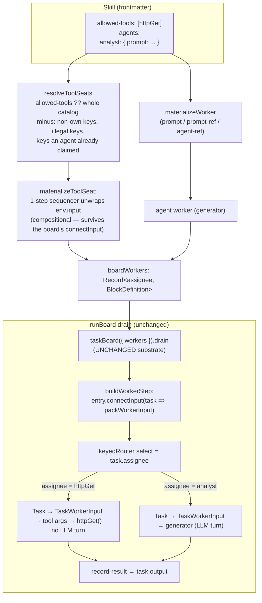

# FIX-925: Assign a task board task directly to a tool (dynamic tool-call tasks) — Implementation Spec

> **Epic:** [FIX-930 — Delegation substrate](https://linear.app/fixpoint-labs/issue/FIX-930) (approved; In Development). This is a delegation-surface follow-on, aligned to the shipped board-commanded delegation model (FIX-918/927/928). Epic PR: fixpoint-labs/flow-state-dev#873.

---

## Part I — The Case

### 1. Problem — why it matters, why now

When a delegation skill plans a graph of work, every node on that graph is an **agent** — a prompt-driven teammate that takes an LLM turn. But some nodes are deterministic: fetch a document, run a calculation, call an API, transform a payload. Today, to put one of those on the board you have to wrap it in an agent (give the agent the tool, assign the task to the agent, and hope the model calls the tool with the right args). You pay for a whole language-model turn just to make one function call — extra latency, extra tokens, and a nondeterministic step where a deterministic one belongs.

**Why now.** The board-commanded delegation surface shipped this cycle (FIX-918, plus FIX-927/928 follow-ons). Mixed graphs — a research lead that farms subtopics to agents *and* fans deterministic lookups to tools — are exactly the shape that surface is meant to run. The interim (tool-via-agent) works, so this isn't urgent, but it leaves a deterministic capability the substrate already has unreachable from the one place a skill author declares a board.

### 2. Solution in plain terms

Make every tool a delegating skill allows assignable to a task, by its catalog key. Nothing is declared: `agents:` keeps holding agents, and the board's other seats are the skill's tools — the keys in its `allowed-tools`, or the whole catalog when it declares none. The coordinator does `addTask({ assignee: "<catalog key>", input: {...} })`, and when it drains the board that task invokes the tool directly with `task.input` as the tool's own typed arguments — no agent turn. The tool's return value records onto the task like any worker's output.

Agents and tools share one assignee namespace, and a declared agent wins a collision.

The important discovery driving this spec: **the task-board substrate already dispatches any block by `task.assignee`.** Its worker registry is block-kind-agnostic, and the drain already threads `task.input` through to every worker. So assigning a task to a tool is not a new substrate capability — it is *surfacing an existing one* at the skill-authoring layer, and it needs no declaration to do it. A tool is adapted into a board worker with a small purpose-built connector (read the tool's args out of the task envelope's `input`) and registered alongside the agent workers. The board can't tell the difference; it routes by assignee and records the result.

**The philosophy that led here.**
- **Tenet 2 (the framework absorbs what serves apps broadly; primitives stay few).** The substrate already runs any block as a worker, and a catalog tool is already a block. The right move is to *expose* that, not to invent a parallel "tool task" mechanism — and not to add a declaration for something both halves already have.
- **Tenet 3 (subtract before you add).** The leanest version touches no substrate code — no per-entry "kind" on the registry, no dispatch branch in the worker step — *and no new frontmatter field*. The only code that had to exist is the envelope unwrap.
- **Tenet 1 (coherence).** A deterministic node and a prompt-driven node sharing one board, one assignee namespace, one drain, and one output-recording path is more coherent than a second code path that reimplements dispatch for tools.

### 3. Tradeoffs & alternatives

- **Alternative: widen the substrate registry to carry a per-entry `kind` (agent vs tool) and branch the dispatch adapter in the worker step** (the shape the original issue sketched). Rejected. The substrate registry is already `Record<assignee, BlockDefinition>` and the drain already passes `task.input` through to `TaskWorkerInput.input`. A tool seat needs neither a kind tag nor a dispatch branch — the delegation surface adapts the tool with a connector (BP-013's blessed pattern, exactly what the board already does for agent workers) and the existing uniform dispatch runs it. Branching the substrate would add surface the substrate doesn't need and couple it to a distinction only the skills layer cares about.
- **Simpler approach considered: do nothing, keep tool-via-agent.** It works and needs no code. It's insufficient because the whole point is to *remove* the agent turn; the interim is precisely the cost we're eliminating, and the substrate already supports the cheaper path.
- **Where the genuine complexity is.** Not the happy path (register an adapted tool, drain, record). It's **dep-output semantics.** An agent worker receives upstream dep *outputs* (materialized into `TaskWorkerInput.deps` at claim time and rendered into its prompt). A tool receives only `task.input`, which the coordinator fixes at plan time — *before* the drain produces any upstream output. So a tool task gets dependency **ordering** but cannot consume an upstream's **runtime output**. That's a real limitation to name clearly, not paper over.

### 4. Focus practices (1–5)

1. **Subtract before adding (tenet 3).** The substrate is not to be touched. If the implementer finds themselves editing `worker-step.ts` or the `Task` schema, stop — the design says the change is declaration + materialization only. A substrate edit is a signal the approach drifted.
2. **BP-030 (tolerate the old shape).** `AgentSpec` and the persisted `SkillState.agents` are existing shapes and must not change: a skill authored before this ships parses and materializes byte-identically. Widening the assignee key pattern only accepts input previously refused, never the reverse.
3. **BP-035 (second-path checklist).** Walk the assignee-miss path (a key that names nothing), the collision path (a catalog key equal to an agent key), the rosterless path (a `delegation: true` board with no agents), and the off state (a skill with no catalog at all).
4. **BP-031 (never route off caller-controllable input).** Seats derive from `allowed-tools`, which rides a `.passthrough()` manifest an admin can edit after seeding. Every key gets an own-property check against the catalog and the assignee-key check before it can become a route.

### 5. What using it looks like

**A skill with a tool seat** (skill frontmatter). `httpGet` is a catalog tool key the app already supplies. Nothing declares the seat — `allowed-tools` is the skill's existing tool scope, and it is now also what's assignable:

```yaml
---
description: Fetch a set of pages and summarize each.
allowed-tools: [httpGet]
agents:
  analyst:
    prompt: You read fetched page text and extract the key claims.
---
You are the research lead. For each URL:
1. addTask assignee "httpGet", input { url } — one per page.
2. addTask assignee "analyst", deps [the matching fetch task], to extract claims.
3. Call runBoard once. Surface the analyst outputs.
```

**Coordinator planning against it** (the model's tool calls during its turn):

```
addTask({ goal: "fetch page A", assignee: "httpGet", input: { url: "https://a.example" } })  → { taskId: "t1" }
addTask({ goal: "extract claims from A", assignee: "analyst", deps: ["t1"] })               → { taskId: "t2" }
runBoard()
```

**Observable result.** `t1` runs `httpGet({ url: "https://a.example" })` directly — no model turn — and its return value records as `t1.output`. `t2` waits for `t1` (ordering), then the `analyst` agent runs with `t1`'s output materialized into its prompt (agents still receive dep outputs). `runBoard` returns the settled board with both tasks `completed`.

**Before/after** — the deterministic node, today vs. with this change:

```yaml
# BEFORE — a wrapper agent exists only to make one tool call (one LLM turn per fetch)
agents:
  fetch:
    prompt: Call httpGet with the given url and return the body verbatim.
    tools: [httpGet]
# AFTER — nothing declares the seat; the tool is already assignable (zero LLM turns)
allowed-tools: [httpGet]
```

### 6. Decisions & rules — the sign-off surface

1. **A tool seat is declared nowhere. The skill's tools ARE its tool seats.** Seats are the keys in `allowed-tools`, or the whole catalog when the skill declares none — the same set the coordinator generator is registered with, so a seat opens no reach the model didn't have; it only adds a second way to reach it (as a board task rather than an inline call). — *Alternatives rejected:* (a) a `tool:` resolution kind on the `agents:` map — the shape this spec originally carried, and what shipped to review; (b) a separate top-level `tools:`/`participants:` map. Both make an author re-declare, per skill, something the runtime already holds twice — in the catalog and in `allowed-tools`. — *Ramification:* one assignee namespace, one registry, one memo snapshot. `agents:` keeps meaning agents, so the naming imperfection the earlier draft accepted goes away with the field. A declared agent wins a key collision (the coordinator is told about the agent, so the agent must be what runs). What is lost is aliasing — a seat can't be renamed from its catalog key — which is app-level: register the tool twice.
2. **No substrate change.** The task-board registry, `worker-step.ts` dispatch, and the `Task` schema are untouched. — *Alternative rejected:* per-entry `kind` + dispatch branch (the issue's original sketch). — *Ramification:* tool seating is a delegation-surface concern; the substrate stays kind-agnostic. The tool is adapted as a **compositional one-step sequencer** (input `TaskWorkerInput`; inner step the tool pre-connected via `connectInput(env => env.input)`) and registered like any worker. This is the ONE piece of mechanism the feature needs, and it survives decision 1: a *bare* `tool.connectInput` would not. `buildWorkerStep` applies its own `connectInput<Task>(packWorkerInput)` to every worker, and `connectInput` **replaces** a block's mapper rather than composing with it, so the board's wrap would clobber the tool's unwrap. Wrapping keeps the unwrap on an inner block the board never touches — which is why no `worker-step.ts` edit is needed (mechanism detailed in §7).
3. **`task.assignee` stays a bare string; kind is carried registry-side.** — *Alternative rejected:* a typed assignee or a Task-schema migration. — *Ramification:* no persisted-Task change; existing boards and records round-trip unchanged.
4. **Dep semantics for tool tasks: ordering only, not upstream outputs.** A tool receives `task.input` (fixed at plan time); it does not receive materialized dep outputs. — *Alternative rejected:* merging `deps` into the tool's input (breaks the tool's typed schema) or a templated-input mini-language (scope creep). — *Ramification:* a node that must consume an upstream's *runtime* output stays an agent (or awaits the follow-up in §12). Deps still gate a tool task's *scheduling*.
5. **Nothing is rejected at parse time, because nothing new is parsed.** The `agents:` map keeps its three resolution kinds and its existing exclusivity rules. — *Superseded:* the earlier draft's rejection matrix (agent-only fields alongside `tool:`) and its materialization-time re-check for parser-bypassed camelCase specs. Both existed only to police a field that no longer exists. — *Ramification:* `AgentSpec`, `parseAgentSpec`, and `serializeAgents` are unchanged from `main`; a persisted or programmatic spec has no new shape to bypass a parser with.
6. **A key that doesn't resolve is dropped, not thrown.** A seat is derived, not declared, so a key in `allowed-tools` that isn't in the catalog simply isn't a seat. This matches what `allowed-tools` already does everywhere else — `resolveTools` warn-skips, and the rendered restriction note is advisory — and a static binding's misses already fail loud at build time in `validateDeclaredTools`. — *Superseded:* the earlier draft's always-throw rule, which existed because a *declared* participant that silently vanished would leave the coordinator assigning to a node the board can't route. A derived seat has no such promise to break: the coordinator is never told about seats individually. — *Ramification:* two more keys are dropped rather than seated, both BP-031: one that isn't an own property of the catalog (`constructor`, `toString`), and one that isn't a legal assignee key (`__proto__` would hit the worker registry's prototype setter). `allowed-tools` rides a `.passthrough()` manifest an admin can edit after seeding, so it is caller-controllable.
7. **A seat is not checked for being model-free.** A catalog key pointing at a generator is seated, and running it takes a model turn. — *Superseded:* the earlier draft's `assertDeterministicTool` guard (reject a `generator`; reject a `router` whose `config.routes` exposes one). That guard existed to keep a *declared participant kind's* promise — "deterministic, no LLM turn" — true. With no declaration there is no such kind and no such promise: a seat runs whatever the catalog holds under that key, and the catalog is the app's. — *Alternative rejected:* keep the guard anyway. It could only ever be partial (`createSequencer` closes its steps into `execute` and exposes no enumeration API, so a generator nested in a sequencer is undetectable without a new public-traversal API), and a partial guard that reads as a guarantee is worse than a documented "it's your catalog." — *Ramification:* the docs say plainly that assigning to a tool doesn't mean cheap. A skill author who wants a model-free seat keeps that tool model-free.
8. **The always-rendered guidance spends one sentence on tools, not one line per tool.** — *Alternative rejected:* a roster line per seat, as the earlier draft did for declared `tool:` participants. That was affordable for a hand-written list and is not for a derived one: it would scale with the app's catalog rather than the skill's team, on every turn, re-paying for descriptions the coordinator already carries in its own tool surface. — *Ramification:* the `unknown_assignee` error still names every legal assignee, agents and seats alike — it is read once, not every turn. `describe()` and the guidance therefore differ on purpose.
9. **Assignee keys admit uppercase.** `/^[a-z0-9][a-z0-9_-]*$/` → `/^[a-zA-Z0-9][a-zA-Z0-9_-]*$/`. — *Why:* the predicate no longer gates only hand-authored keys. Catalog keys are camelCase by convention (`httpGet`, `webSearch`), and `validateAgentKeys` would filter exactly those out of the worker registry. — *Alternative rejected:* two patterns, one per source. More surface for no gain; the namespace is one namespace. — *Ramification:* the leading-alphanumeric anchor is untouched, so `__floor__`, `__no_assignee__`, and `__proto__` stay unclaimable — that anchor, not the character class, is what was ever load-bearing. Widening only accepts input that was previously refused (BP-030).

**Non-goals.** No runtime-dep-output injection into tools (ordering only). No new substrate primitive. No change to the raw `taskBoard(...)` public API (which already accepts tool-shaped workers directly). No new frontmatter field, and no change to the `agents:` grammar. No enforcement that a seat is model-free.

**Size:** Small–Medium (single PR, ~100–200 LOC across the delegation surface, the worker materializer, the assignee key pattern, and doc comments, plus tests and the docs sweep). Single-node PR plan.

---

## Part II — The Build Plan

Part II is directional. It fixes which modules change and in what order; exact signatures and local structure are the implementer's, settled in the code with `tdd`.

### 7. Technical design

The change lives in two layers, both above the task-board substrate (which is untouched):

1. **Seat derivation** — the delegation surface derives the board's tool seats from the skill's allowed tools and registers each as a board worker, alongside the agent workers it already builds.
2. **Roster/guidance** — the surface tells the coordinator that its tools are assignable, and widens the assignment gate so naming one is accepted.

Nothing is added to the declaration layer: `AgentSpec`, the SKILL.md parser, and `serializeAgents` are unchanged. The board substrate already does the rest: dispatch by `assignee`, threading `task.input`, recording output, gating deps.




**Adapter seam** (illustrative — a sketch, not the contract). The board registers each worker, then `buildWorkerStep` calls `worker.connectInput<Task>(task => packWorkerInput(...))` on it. `connectInput` **replaces** a block's input mapper — it rebuilds the block with the new mapper and does not compose with a prior one (see `build-block.ts`). So a bare `tool.connectInput<TaskWorkerInput>(env => env.input)` registered directly is *clobbered* by the board's own `connectInput<Task>`, and the tool would receive the whole `TaskWorkerInput` envelope instead of its typed args — its `inputSchema` would then reject the shape.

The adapter therefore has to be **compositional**: wrap the tool in a thin one-step sequencer whose input is `TaskWorkerInput` and whose inner step is the tool pre-connected to read `env.input`. The board connects the *outer* sequencer (`Task → TaskWorkerInput`); the *inner* tool keeps its unwrap (`TaskWorkerInput → tool args`) because it is a distinct block the board never re-connects:

```ts
// in the materializer's tool branch
const tool = deps.catalog[spec.tool];            // resolve; throw if missing (loud, always)
// One-step sequencer: outer input is TaskWorkerInput (what the board feeds
// every worker); the inner tool is pre-connected to unwrap env.input.
return sequencer({
  inputSchema: taskWorkerInputSchema,
  steps: [tool.connectInput<TaskWorkerInput>((env) => env.input)],
});
```

The board then wraps the sequencer with `entry.connectInput<Task>(task => packWorkerInput(...))`, yielding `Task → TaskWorkerInput → (unwrap) → tool args`. The tool's native `outputSchema` flows straight to `record-result`. The fix lives entirely in the materializer's wrapper shape — no substrate/`worker-step.ts` edit (BP-011: compose as a sequencer, not a handler calling a block; BP-013: `connectInput` on the inner step).

### 8. Implementation sequence

1. **Materializer — extract the seat adapter.** In `worker-materializer.ts`, export `materializeToolSeat(toolKey, tool, skillName)`: the compositional one-step sequencer of §7. Synchronous — it resolves no registry and reads no file. `materializeWorker` is untouched. *Test:* given a `TaskWorkerInput` with `input: X`, the seat invokes the tool with `X` and returns its native output; and re-connecting the seat with a `connectInput` (standing in for `buildWorkerStep`) does not clobber the inner unwrap.
2. **Surface — derive and register the seats.** In `delegation-surface.ts`, add `resolveToolSeats(sources, catalog, rosterPurposes)` returning `catalogKey → tool`: union each source's `allowedTools` (or all catalog keys when it declares none); no sources at all means the whole catalog (the rosterless `delegation: true` board). Drop a key that is not an own catalog property, is not a legal assignee key, or is already an agent's. Register each seat into `boardWorkers` **after** the agent loop, so a declared agent wins its key. *Test:* every catalog key is assignable with no `allowed-tools`; only the declared ones with it; an agent shadows a same-named tool.
3. **Surface — thread `allowedTools` to the seats.** `DelegationAgentSource` gains `allowedTools`, populated on all three paths `collectAgentSources` feeds: `library.ts`'s `staticSources` and `buildBundledAgentIndex` (from the parsed index), and the live-manifest read (whose state already carries it, so an admin edit after seeding moves the seats too). *Test:* a runtime activation of a bundled skill gets the same seats a static binding does.
4. **Surface — roster gate and guidance.** `WorkerRoster.has` covers agents ∪ seats, and `describe()` names both, so `unknown_assignee` lists every legal option. The assignment gate installs when either is non-empty — a board with seats and no agents now validates, where before it accepted anything. Guidance gets ONE `TOOL_SEAT_NOTE` sentence (decision 8), and the tool sentences move out of `DELEGATION_PLAYBOOK` so a board with no seats doesn't carry them. Keep the model-facing `addTask` / `runBoard` descriptions covering "agent or tool" — the coordinator reads those strings, and agents-only wording is how the feature silently doesn't get used. *Test:* a seated board refuses a typo and names the seats; guidance holds one roster line per agent and none per tool, at any catalog size.
5. **Key pattern — admit uppercase.** Widen `AGENT_KEY_PATTERN` in `skill-md.ts` to `/^[a-zA-Z0-9][a-zA-Z0-9_-]*$/` (decision 9). The anchor stays. *Test:* a camelCase key parses; `__proto__`, `__floor__`, `__no_assignee__`, and a leading `-`/`_` still don't.
6. **Changeset (BP-022).** A **patch** fragment for `@flow-state-dev/core` (the `AgentSpec` / `ToolCatalog` doc comments) and `@flow-state-dev/orchestration` (surface, materializer, key pattern). User-facing, so not `--empty`. Pre-1.0: `patch` only.

No step touches `worker-step.ts`, `taskBoard`, the `Task` schema, or the SKILL.md parser's agent grammar. Single PR (single-node plan).


### 9. Edge cases & error handling

| Case | Expected behavior |
|---|---|
| `allowed-tools` names a key that isn't in the catalog | Not a seat — dropped, not thrown (Decision 6). `validateDeclaredTools` already fails a static binding's build on this, so only a runtime skill reaches here, and `allowed-tools` warn-skips a miss everywhere else it is read. |
| A catalog key is not an own property (`constructor`, `toString`) | Not a seat. `Object.hasOwn`, per BP-031 — a bare lookup returns a truthy `Object.prototype` member that is not a block. |
| A key that could never be a legal assignee (`__proto__`, leading `_`) | Not a seat. `allowed-tools` rides a `.passthrough()` manifest an admin can edit after seeding, so it is caller-controllable; `__proto__` would hit the worker registry's prototype setter rather than create an own key. |
| A catalog key equals a declared agent's key | The agent wins and the seat is dropped. The coordinator is told about the agent, so the agent must be what runs. |
| A seated catalog key resolves to a **generator** | It is seated and it takes a model turn (Decision 7). Not an error: with no declaration there is no "deterministic participant" promise to break. Documented rather than guarded. |
| Board with tool seats but no declared agents | The assignment gate now installs (there is a roster to check), so a typo'd assignee is refused instead of landing on the floor. An unset assignee still runs on the floor. |
| Board with no agents AND an empty catalog | No roster, gate inert, every assignee accepted — the pre-FIX-924 rosterless behavior, unchanged (BP-030). |
| Tool task declares `deps` | Deps gate *scheduling* (task waits). Tool receives only `task.input` — no dep outputs injected (Decision 4). Documented explicitly. |
| Tool throws at runtime | Propagates through the router's `.rescue()` → `recordError` → `collection.fail` on the offending task, exactly like an agent worker. `maxAttempts` retry applies unchanged. |
| Old skill, no catalog | Parses and materializes byte-identically to today (BP-030); the parser's agent grammar is untouched. |
| Tool returns a non-string / structured output | Recorded as `task.output` as-is (workers already return heterogeneous `unknown`; only agent generators are pinned to `z.string()`). |

Second-path checklist (BP-035): legacy shape (old skills, no catalog) ✓; null-boundary (`input` absent → tool called with `undefined`, its schema decides) ✓; concurrent (per-task fail via `currentTaskId`, unchanged) ✓; cancel/error (router rescue path, unchanged) ✓; memo/cost (seats derive from the same source list the memo snapshots) ✓; multi-tenant (a seat reaches nothing the coordinator's own tool surface didn't already) ✓.


### 10. Testing strategy

- **Goal & goal check (real path).** A delegation skill with one agent and a catalog holding a deterministic tool, run via `fsdev run` (or the orchestration integration harness): assert a task assigned to the tool's catalog key completes with the tool's output and **no model turn is emitted for it**. Note what this does and does not prove: a seat is model-free because the catalog's block is (Decision 7), not because anything enforced it.
- **CI specs (mocked, deterministic).**
  - Materializer: the seat invokes the catalog tool with `env.input` and returns its native output; re-connecting the seat does not clobber the inner unwrap (the clobber regression the wrapper exists for).
  - Surface: every catalog key is assignable with no `allowed-tools`, only the declared ones with it; a declared agent shadows a same-named tool; a non-own key, an illegal key, and a catalog miss are each dropped rather than seated.
  - Gate + guidance: a seated board refuses a typo and names both agents and seats in the error; the guidance carries one roster line per agent and one sentence for all tools, at a 30-tool catalog.
  - Parser: a camelCase agent key parses; the reserved shapes still don't.
- **Discipline:** `tdd` (this is a feature). Seam for the red-green loop: `materializeToolSeat` (unit, `packWorkerInput`-shaped input), then the surface through a real binding.

### 11. Documentation plan

**Sweep, don't enumerate.** The agents-only mental model is spread across the docs and guides: every page that describes `addTask` / `runBoard` / `assignee` under "assignee names an agent" framing goes stale the moment a tool is assignable. Rather than keep bolting on individual pages, the implementer **audits every `apps/docs` page (docs *and* guides) that documents `addTask`, `runBoard`, or `assignee` and updates it** — so the class is closed, not just the instances known today. Grep the corpus for those three terms and reconcile each hit with the mixed board. Keep the full contract in one place (the delegation guide) and cross-link from the rest; peripheral pages get a one-line "an agent **or a tool**" correction, not a duplicated contract.

Known instances (examples, not exhaustive — the sweep is the deliverable): `apps/docs/guides/adding-skills-to-your-app.md`, `apps/docs/docs/orchestration/overview.md`, `apps/docs/docs/orchestration/task-board.md`, `apps/docs/docs/patterns/overview.md`.

Per-page guidance for the primary contracts (part of the same sweep):

- **EXTEND `apps/docs/docs/skills/delegation.md`** (the delegation guide). Its resolution table stays at three rows — a tool is not a resolution kind — with a line under it saying tools aren't declared here. Add a subsection "Assigning a task to a tool" covering: what it is (a board node invoked directly, no LLM turn), which tools are assignable (`allowed-tools`, else the catalog), the `addTask(assignee, input)` calling shape, the **dep-output limitation** (ordering, not runtime outputs — for that, use an agent), and the honest note that nothing checks a seat is model-free. *Voice risks:* keep terms introduced in plain language on first use; avoid "powerful/first-class"; watch em-dash density (the page already runs high).
- **EXTEND `apps/docs/docs/skills/authoring.md`** — the frontmatter-fields table. The `agents` row is unchanged; the **`allowed-tools`** row gains the seat meaning and a cross-link, since that field now decides what is assignable.
- **EXTEND `apps/docs/docs/orchestration/agents.md`** — the roster paragraph should say tools are assignable too and explain why they are *not* on the roster (the coordinator already has their descriptions).
- **EXTEND `packages/orchestration/README.md`** — the delegation section gains a short paragraph on tool seats and updates the assignment-gate wording.
- **EXTEND `apps/docs/guides/building-a-research-team.md`** — this guide framed staffing a non-agent block as a deliberate **non-goal** "until a task can be assigned to a tool directly." That is now false. Replace it with the seat shape and cross-link the delegation guide's subsection.
- **EXTEND `apps/docs/guides/agents-command-the-board.md`** — the drain description says "assigned **agent**"; say agent or tool.
- **No new page.** This is one behavior under an existing documented concept — extending is correct.
- **No architecture-doc change.** No locked contract (streaming, items, state, Task schema) changes.

### 12. Dependencies, open questions & follow-ups

**Dependencies.** None blocking. Builds on the shipped delegation surface (FIX-918/927/928, all landed) and on FIX-924's roster validation, whose gate this widens to cover seats.

**Open questions.** None load-bearing.

**Follow-ups (flagged, not built):**
- **Runtime dep-output for tools.** A templated `input` (e.g. `{ $fromDep: "<taskId>" }`) resolved at dispatch from the collection would let a tool consume an upstream's runtime output. Deliberately out of scope (Decision 4); a real extension if a consumer needs it.
- **Making `allowed-tools` restrictive.** It is advisory today — the generator is registered with the full catalog regardless, and the field only renders a prompt-level note. Seats read it as a real scope, which is the first place it binds. Whether it should bind everywhere is a separate call on a shipped field.
- **Seat aliasing.** A seat is named by its catalog key. Renaming one per skill would need a declaration again; the app-level answer is to register the tool twice. Revisit only if a real case appears.

---

## Spec evolution

- **Spec drafted** — framed as surfacing an existing substrate capability (the board already dispatches any block by assignee) at the skill-authoring layer, not a new mechanism; chose a `tool` resolution kind on the existing participant map with zero substrate change (rejecting the issue's original per-entry-kind + dispatch-branch sketch); settled dep semantics as ordering-only for tools; single Medium PR.
- **After spec review** — folded 5 completeness gaps (always-throw on unknown tool keys; reject `visibility`; materialization-time guard; `serializeAgents` + `library.ts` seams; roster/migration copy) plus 3 reviewer points (a compositional one-step-sequencer adapter, because `connectInput` replaces rather than composes and the board's `connectInput<Task>` would clobber a bare `tool.connectInput` — the "no substrate change" conclusion still holds; roster/worker fail-loud consistency via always-throw; and the `authoring.md` docs seam), because the review confirmed the approach but found the parser-only/warn-skip/bare-adapter framing left round-trip, persisted-binding, resolution-miss, and adapter-clobber paths uncovered.
- **After spec review (docs completeness)** — added building-a-research-team + agents-command-the-board guides to the docs plan and the ToolCatalog type-comment update, because two guides + the exported type comment would otherwise ship stale.
- **After spec review (final pass)** — updated model-facing addTask/runBoard tool descriptions (load-bearing), hardened the materialization guard for parser-bypassed camelCase fields, constrained tool: to deterministic non-generator blocks (enforced at the block's directly-detectable surface — `kind` and router `config.routes`; a generator buried in a sequencer's closed-over steps is out of scope since core exposes no traversal for it), added the changeset step, and made the docs plan a sweep of all addTask/runBoard/assignee pages.
- **After PR review — the `tool:` field is dropped entirely.** Review asked why a tool needs an explicit entry when any tool a skill already allows could just be assignable. Checking it out: `GeneratorTool` **is** `BlockDefinition<any, any>`, the board routes purely on `registry[task.assignee]`, and `library.ts` registers `fullCatalog()` on the coordinator anyway — so the declaration was re-naming something the runtime already held twice, and seats derived from `allowed-tools` (else the catalog) reach exactly the tool set the model could already call. That deleted `AgentSpec.tool`, the parse-time exclusion matrix, the materialization-time camelCase re-check, and the whole `assertDeterministicTool` guard, leaving only the compositional sequencer — which is mechanism, not declaration, and survives. Two consequences the earlier shape had hidden: the assignee pattern was lowercase-only and would have filtered out camelCase catalog keys (decision 9), and a roster line per seat would scale the always-rendered guidance with the app's catalog rather than the skill's team (decision 8). Decisions 5, 6, and 7 were superseded rather than amended: each existed to police a declaration that no longer exists.