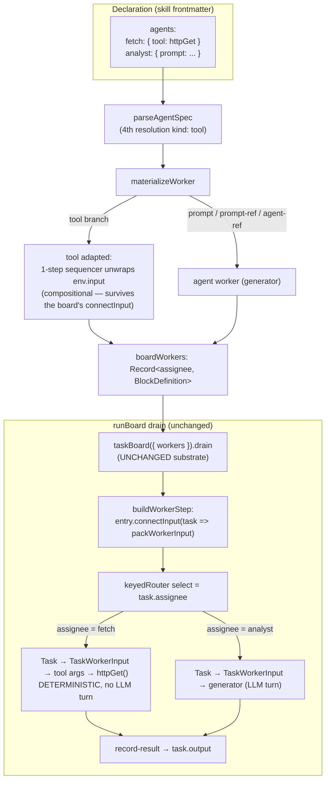

# FIX-925: Assign a task board task directly to a tool (dynamic tool-call tasks) — Implementation Spec

> **Epic:** [FIX-930 — Delegation substrate](https://linear.app/fixpoint-labs/issue/FIX-930) (approved; In Development). This is a delegation-surface follow-on, aligned to the shipped board-commanded delegation model (FIX-918/927/928). Epic PR: fixpoint-labs/flow-state-dev#873.

---

## Part I — The Case

### 1. Problem — why it matters, why now

When a delegation skill plans a graph of work, every node on that graph is an **agent** — a prompt-driven teammate that takes an LLM turn. But some nodes are deterministic: fetch a document, run a calculation, call an API, transform a payload. Today, to put one of those on the board you have to wrap it in an agent (give the agent the tool, assign the task to the agent, and hope the model calls the tool with the right args). You pay for a whole language-model turn just to make one function call — extra latency, extra tokens, and a nondeterministic step where a deterministic one belongs.

**Why now.** The board-commanded delegation surface shipped this cycle (FIX-918, plus FIX-927/928 follow-ons). Mixed graphs — a research lead that farms subtopics to agents *and* fans deterministic lookups to tools — are exactly the shape that surface is meant to run. The interim (tool-via-agent) works, so this isn't urgent, but it leaves a deterministic capability the substrate already has unreachable from the one place a skill author declares a board.

### 2. Solution in plain terms

Let a skill declare a board participant that is a **tool** instead of an agent. In the skill's `agents:` map (which is really the board's *participant registry*), an entry can resolve to a catalog tool via a new `tool:` field, the same way it resolves to a persona via `prompt:` / `prompt-ref:` / `agent-ref:` today. The coordinator then does `addTask({ assignee: "<tool>", input: {...} })`, and when it drains the board that task invokes the tool directly with `task.input` as the tool's own typed arguments — no agent turn. The tool's return value records onto the task like any worker's output.

The important discovery driving this spec: **the task-board substrate already dispatches any block by `task.assignee`.** Its worker registry is block-kind-agnostic, and the drain already threads `task.input` through to every worker. So a tool participant is not a new substrate capability — it is *surfacing an existing one* at the skill-authoring layer. A tool is adapted into a board worker with a small purpose-built connector (read the tool's args out of the task envelope's `input`) and registered alongside the agent workers. The board can't tell the difference; it routes by assignee and records the result.

**The philosophy that led here.**
- **Tenet 2 (the framework absorbs what serves apps broadly; primitives stay few).** The substrate already runs any block as a worker. The right move is to *expose* that at the declaration layer, not to invent a parallel "tool task" mechanism. One participant registry, two resolution kinds.
- **Tenet 3 (subtract before you add).** The leanest version of this feature touches no substrate code — no new per-entry "kind" on the registry, no dispatch branch in the worker step. The change lives entirely in declaration + materialization.
- **Tenet 1 (coherence).** A deterministic node and a prompt-driven node sharing one board, one assignee namespace, one drain, and one output-recording path is more coherent than a second code path that reimplements dispatch for tools.

### 3. Tradeoffs & alternatives

- **Alternative: widen the substrate registry to carry a per-entry `kind` (agent vs tool) and branch the dispatch adapter in the worker step** (the shape the original issue sketched). Rejected. The substrate registry is already `Record<assignee, BlockDefinition>` and the drain already passes `task.input` through to `TaskWorkerInput.input`. A tool participant needs neither a kind tag nor a dispatch branch — the delegation surface adapts the tool with a connector (BP-013's blessed pattern, exactly what the board already does for agent workers) and the existing uniform dispatch runs it. Branching the substrate would add surface the substrate doesn't need and couple it to a distinction only the skills layer cares about.
- **Simpler approach considered: do nothing, keep tool-via-agent.** It works and needs no code. It's insufficient because the whole point is to *remove* the agent turn; the interim is precisely the cost we're eliminating, and the substrate already supports the cheaper path.
- **Where the genuine complexity is.** Not the happy path (register an adapted tool, drain, record). It's **dep-output semantics.** An agent worker receives upstream dep *outputs* (materialized into `TaskWorkerInput.deps` at claim time and rendered into its prompt). A tool receives only `task.input`, which the coordinator fixes at plan time — *before* the drain produces any upstream output. So a tool task gets dependency **ordering** but cannot consume an upstream's **runtime output**. That's a real limitation to name clearly, not paper over.

### 4. Focus practices (1–5)

1. **Subtract before adding (tenet 3).** The substrate is not to be touched. If the implementer finds themselves editing `worker-step.ts` or the `Task` schema, stop — the design says the change is declaration + materialization only. A substrate edit is a signal the approach drifted.
2. **BP-030 (tolerate the old shape).** `AgentSpec` and the persisted `SkillState.agents` are existing shapes. Adding a `tool` resolution kind must dual-read cleanly: old specs (no `tool` field) parse and materialize exactly as before; a `tool` entry is purely additive.
3. **BP-035 (second-path checklist).** Walk the assignee-miss path (a tool key that names nothing), the collision path (a tool key equal to an agent key), and the memo path (the per-execution delegation memo keys on the participant-key set — tool keys must be in that snapshot).
4. **BP-007 (concise API docs) + fail-loud parsing.** The parser already rejects `block-ref` and inline-tuning-on-`agent-ref` with pointed errors. A `tool` spec that carries agent-only fields (`prompt`, `model`, `context-supply`, `visibility`, inline `tools`) must fail the same way, not silently ignore them.

### 5. What using it looks like

**Declaring a tool participant** (skill frontmatter). `httpGet` and `summarize` are catalog tool keys the app already supplies:

```yaml
---
description: Fetch a set of pages and summarize each.
agents:
  fetch:
    tool: httpGet          # deterministic participant — invoked directly, no LLM turn
  analyst:
    prompt: You read fetched page text and extract the key claims.
---
You are the research lead. For each URL:
1. addTask assignee "fetch", input { url } — one per page.
2. addTask assignee "analyst", deps [the matching fetch task], to extract claims.
3. Call runBoard once. Surface the analyst outputs.
```

**Coordinator planning against it** (the model's tool calls during its turn):

```
addTask({ goal: "fetch page A", assignee: "fetch", input: { url: "https://a.example" } })  → { taskId: "t1" }
addTask({ goal: "extract claims from A", assignee: "analyst", deps: ["t1"] })               → { taskId: "t2" }
runBoard()
```

**Observable result.** `t1` runs `httpGet({ url: "https://a.example" })` directly — no model turn — and its return value records as `t1.output`. `t2` waits for `t1` (ordering), then the `analyst` agent runs with `t1`'s output materialized into its prompt (agents still receive dep outputs). `runBoard` returns the settled board with both tasks `completed`.

**Before/after** — the deterministic node, today vs. with this change:

```yaml
# BEFORE — a wrapper agent exists only to make one tool call (one LLM turn per fetch)
agents:
  fetch:
    prompt: Call httpGet with the given url and return the body verbatim.
    tools: [httpGet]
# AFTER — the tool is the participant (zero LLM turns)
agents:
  fetch:
    tool: httpGet
```

### 6. Decisions & rules — the sign-off surface

1. **A tool participant is a new resolution kind on the existing participant map, not a new map.** — *Alternative rejected:* a separate top-level `tools:`/`participants:` frontmatter map. — *Ramification:* one assignee namespace, one registry, one memo snapshot; agent and tool keys share a namespace and cannot collide (correct — `assignee` is one namespace). The `agents:` field name now covers tools too, a minor naming imperfection accepted over a breaking rename (see §12 follow-up).
2. **No substrate change.** The task-board registry, `worker-step.ts` dispatch, and the `Task` schema are untouched. — *Alternative rejected:* per-entry `kind` + dispatch branch (the issue's original sketch). — *Ramification:* tool participation is a delegation-surface concern; the substrate stays kind-agnostic. The tool is adapted in the materializer as a **compositional one-step sequencer** (input `TaskWorkerInput`; inner step the tool pre-connected via `connectInput(env => env.input)`) and registered like any worker. A *bare* `tool.connectInput` on the registered block would NOT survive: `buildWorkerStep` applies its own `connectInput<Task>(packWorkerInput)` to every worker, and `connectInput` **replaces** a block's mapper rather than composing with it, so the board's wrap would clobber the tool's unwrap. Wrapping keeps the unwrap on an inner block the board never touches — which is why no `worker-step.ts` edit is needed (mechanism detailed in §7).
3. **`task.assignee` stays a bare string; kind is carried registry-side.** — *Alternative rejected:* a typed assignee or a Task-schema migration. — *Ramification:* no persisted-Task change; existing boards and records round-trip unchanged.
4. **Dep semantics for tool tasks: ordering only, not upstream outputs.** A tool receives `task.input` (fixed at plan time); it does not receive materialized dep outputs. — *Alternative rejected:* merging `deps` into the tool's input (breaks the tool's typed schema) or a templated-input mini-language (scope creep). — *Ramification:* a node that must consume an upstream's *runtime* output stays an agent (or awaits the follow-up in §12). Deps still gate a tool task's *scheduling*.
5. **A `tool` spec rejects agent-only fields at parse time.** `prompt`/`prompt-ref`/`agent-ref`/`agent-overrides`/`model`/`context-supply`/`visibility`/inline `tools` alongside `tool:` fail loud. `visibility` matters especially: it maps to `itemVisibility` and lives in `AGENT_KNOWN_KEYS`, so a `tool:` + `visibility:` would otherwise parse silently — the exact anti-pattern this decision rejects. — *Alternative rejected:* silently ignoring them. — *Ramification:* mirrors the existing `agent-ref`-tuning rejection; `tool` joins the mutually-exclusive resolution set (now four, still exactly-one).
6. **An unknown tool key always throws — at build time and at materialization.** A `tool:` naming a catalog key that doesn't resolve throws, matching how an `agent-ref`/`prompt-ref` miss already fails from `materializeWorker` (resolution failure is unconditionally loud). The loud/soft split the surface carries is keyed on key *collision* (`specsCollide`), not on a failed lookup — so there is no runtime warn-skip for a missing tool. — *Alternative rejected:* warn-and-skip a broken tool participant at runtime — it would let a bound board silently drop a node and diverge from the agent-resolution path. — *Ramification:* `buildTools` and the drain stay unchanged; no new per-entry try/catch. A bound-but-broken tool participant fails the turn loudly rather than vanishing from the board.
7. **A `tool:` participant must resolve to a deterministic, non-generator block.** `ToolCatalog` stores arbitrary `BlockDefinition`s, so a catalog key could point at a generator — or a `sequencer`/`router` that contains one — which would take a model turn and make the feature's "no LLM turn" promise false. So `tool:` is *constrained* to deterministic blocks: the resolved catalog block is rejected if it is a `generator`, or if it is a `sequencer`/`router` whose composed tree contains a generator leaf. — *Enforcement:* checked where the tool resolves — at `library.ts` build-time for static skills and in `materializeWorker` for runtime activations — by inspecting the resolved block's `kind` (reject `generator` outright) and, for `sequencer`/`router`, walking its composed steps/routes for a generator leaf; a violation throws with a pointed error naming the offending key. — *Alternative rejected:* allow any catalog block and downgrade the promise to "no *wrapper-agent* turn." Weaker: it would let an assignee the model treats as deterministic silently emit a model call, defeating the point (a deterministic tool with no wrapper-agent turn). The restriction is the recommended resolution; the downgraded wording is the fallback only if the structural walk proves impractical. — *Ramification:* the "no model turn" goal-check (§10) is *guaranteed* by construction, not merely hoped for; `tool:` is genuinely deterministic. A node that needs a model turn stays an agent (`prompt`/`prompt-ref`/`agent-ref`).

**Non-goals.** No runtime-dep-output injection into tools (ordering only). No new substrate primitive. No change to the raw `taskBoard(...)` public API (which already accepts tool-shaped workers directly). No rename of the `agents:` field.

**Size:** Medium (multi-file, single PR, ~150–300 LOC across core types, the frontmatter parser + serializer, `library.ts` build-time validation, the worker materializer, and the roster/guidance prose, plus tests). Single-node PR plan.

---

## Part II — The Build Plan

Part II is directional. It fixes which modules change and in what order; exact signatures and local structure are the implementer's, settled in the code with `tdd`.

### 7. Technical design

The change lives in three layers, all above the task-board substrate (which is untouched):

1. **Declaration** — `AgentSpec` (core types) gains a `tool` resolution field; the SKILL.md frontmatter parser learns to parse and validate it.
2. **Materialization** — the worker materializer gains a `tool` branch that resolves the named catalog tool and adapts it into a board worker.
3. **Roster/guidance** — the delegation surface describes a tool participant to the coordinator so the model assigns to it correctly.

The board substrate already does the rest: dispatch by `assignee`, threading `task.input`, recording output, gating deps.



**Adapter seam** (illustrative — a sketch, not the contract). The board registers each worker, then `buildWorkerStep` calls `worker.connectInput<Task>(task => packWorkerInput(...))` on it. `connectInput` **replaces** a block's input mapper — it rebuilds the block with the new mapper and does not compose with a prior one (see `build-block.ts`). So a bare `tool.connectInput<TaskWorkerInput>(env => env.input)` registered directly is *clobbered* by the board's own `connectInput<Task>`, and the tool would receive the whole `TaskWorkerInput` envelope instead of its typed args — its `inputSchema` would then reject the shape.

The adapter therefore has to be **compositional**: wrap the tool in a thin one-step sequencer whose input is `TaskWorkerInput` and whose inner step is the tool pre-connected to read `env.input`. The board connects the *outer* sequencer (`Task → TaskWorkerInput`); the *inner* tool keeps its unwrap (`TaskWorkerInput → tool args`) because it is a distinct block the board never re-connects:

```ts
// in the materializer's tool branch
const tool = deps.catalog[spec.tool];            // resolve; throw if missing (loud, always)
// One-step sequencer: outer input is TaskWorkerInput (what the board feeds
// every worker); the inner tool is pre-connected to unwrap env.input.
return sequencer({
  inputSchema: taskWorkerInputSchema,
  steps: [tool.connectInput<TaskWorkerInput>((env) => env.input)],
});
```

The board then wraps the sequencer with `entry.connectInput<Task>(task => packWorkerInput(...))`, yielding `Task → TaskWorkerInput → (unwrap) → tool args`. The tool's native `outputSchema` flows straight to `record-result`. The fix lives entirely in the materializer's wrapper shape — no substrate/`worker-step.ts` edit (BP-011: compose as a sequencer, not a handler calling a block; BP-013: `connectInput` on the inner step).

### 8. Implementation sequence

1. **Core type — add the `tool` resolution kind.** In `@flow-state-dev/core`'s skill types (`packages/core/src/types/skill.ts`), add `tool?: string` to `AgentSpec`; update the doc comment on `AgentSpec` (currently says "there is no `blockRef`… a tool is a follow-up" — this *is* that follow-up). Frame the `agents:` map as the board's participant registry. **Also update the exported `ToolCatalog` doc comment**: it currently describes catalog refs only as `allowed-tools` and says "Unknown refs are warned and skipped." FIX-925 makes `tool:` a second `ToolCatalog` consumer whose missing-key semantics are the opposite — a `tool:` naming an unresolved catalog key **always throws** (Decision 6), never warn-skipped. Amend the comment so the public type doesn't state a warn-skip rule that the new consumer contradicts (note both consumers: `allowed-tools` warn-skips an unknown ref; a `tool:` participant fails loud). *Test:* type-level — a `tool` spec is assignable; no runtime test here.
2. **Frontmatter parser + serializer — parse, validate, and round-trip `tool`.** In the skills SKILL.md parser (`skill-md.ts`): add `tool` to the known-keys set and to the mutually-exclusive resolution set (now `prompt` / `prompt-ref` / `agent-ref` / `tool`, exactly-one). Reject agent-only fields (`prompt`*, `model`, `context-supply`, `visibility`, inline `tools`, `agent-overrides`) on a `tool` spec with a pointed error, mirroring the existing `agent-ref` tuning rejection. Update the `block-ref`-removal migration error (FIX-918 deferred this pointer to this issue) so it names `tool:` as the way to put a deterministic app block on the board — a `block-ref` today should migrate to `tool:`, not only to `agent-ref`/`prompt`. **Also give `serializeAgents` a `tool:` branch**: it serializes the `agents:` map back to frontmatter, so without it a `tool:` participant survives parse but not a serialize→re-parse cycle (persisted-state round-trip) — parser-only support is incomplete. *Test:* a `tool:` entry parses to `{ tool: "..." }`; a `tool:` with `model:`/`visibility:` throws; two resolution fields throw; a `tool:` spec survives a `serializeAgents`→parse round-trip.
3. **Worker materializer — the `tool` branch (+ a materialization-time guard).** In `materializeWorker`, dispatch a `tool` branch (before or alongside the existing three) that resolves `spec.tool` against `deps.catalog`, **throws on miss unconditionally** (an unresolved key is loud — the same way an `agent-ref`/`prompt-ref` miss already throws here; no warn-skip), and returns the catalog tool wrapped in the **compositional one-step sequencer of §7** (input `TaskWorkerInput`, inner step `tool.connectInput(env => env.input)`) — NOT a bare `tool.connectInput`, which the board would clobber. **Mirror the FIX-920 `contextSupply` guard — and guard by `AgentSpec` (camelCase) field names, not the parser's kebab keys.** An `AgentSpec` can arrive via a persisted/programmatic `PatternBinding` that **bypassed the parser** and therefore arrives already camelCase, so the materialization guard must reject every agent-only resolution/tuning field by its `AgentSpec` name: `promptRef`, `agentRef`, `model`, `contextSupply`, `itemVisibility`, inline `tools`, and agent-overrides (plus inline `prompt`). This is load-bearing because the materializer's branch order checks `agentRef` → `promptRef` → `prompt`: a parser-bypassed `{ tool: "fetch", agentRef: "x" }` would otherwise take the `agentRef` branch and silently materialize an agent instead of failing loud. The guard must run **before** the resolution branches so a `tool` spec carrying any agent-only field throws rather than falling into an earlier branch — one added check alongside the existing `contextSupply` re-validation. **Enforce the non-generator constraint (Decision 7) at the same seam**: once `spec.tool` resolves, reject the block if it is a `generator`, or a `sequencer`/`router` whose composed tree contains a generator leaf, with a pointed error naming the key — so a `tool:` can never smuggle in a model turn. And add the **build-time half in `library.ts`**: its static-agent validation loop already fails loud on an unresolvable `agent-ref`/`prompt-ref`; add a parallel check that `spec.tool` names a key in the `catalog` **and that the resolved block passes the same non-generator check**. *Test:* a resolved tool worker, given a `TaskWorkerInput` with `input: X`, invokes the tool with `X` and returns its output; an unknown tool key throws at materialization and at `library.ts` build-time; and — **exercising the parser-bypassed path explicitly** — a persisted/programmatic `AgentSpec` (camelCase, not run through the parser) of `{ tool, agentRef }`, `{ tool, promptRef }`, `{ tool, model }`, `{ tool, contextSupply }`, and `{ tool, itemVisibility }` each throws at materialization (not just the kebab parse-time cases); and a `tool:` pointing at a **generator-backed catalog key** (a bare generator, and a sequencer containing a generator) throws at both `library.ts` build-time and materialization (Decision 7).
4. **Delegation surface — roster + guidance (incl. the model-facing tool descriptions, load-bearing).** In `delegation-surface.ts`: `agentPurpose` gains a tool branch — describe the tool from its catalog `description` when present, with a **pinned fallback** for a catalog tool that has none (catalog tools are `BlockDefinition` with an *optional* `description`), e.g. `` `tool \`<key>\` (deterministic)` `` — so the roster line never renders empty. The roster line marks it a tool so the coordinator knows to pass structured `input` and not expect prose reasoning. Nudge the `DELEGATION_PLAYBOOK` prose from "assignee names an agent" to "assignee names an agent or a tool," and the roster heading (`"Your agents:"` in `buildGuidance`) so it reads as covering tools too now that the list is mixed. **Update the two model-facing task-tool descriptions — the coordinator reads the actual tool `description` strings, so leaving them agents-only silently breaks the feature (a `tool:` participant registers but the model is told to assign to agents and never assigns to it):** (a) `addTask` in `packages/orchestration/src/skills/task-tools-capability.ts` currently says *"Set assignee to an agent … input to a structured payload for the agent"* — reword so `assignee` may name an **agent or a tool** and `input` carries the tool's structured arguments; (b) `runBoard` in `delegation-surface.ts` currently says *"executes every runnable task with its assigned agent … assignee names an agent"* — reword to *its assigned agent **or tool*** so the drain description matches the mixed board. Also update the `task-tools-capability.ts` file-header comment (line ~12, "an `assignee` naming an agent") for the same reason. The `boardWorkers` registration loop already handles any materialized block — confirm a tool entry flows through unchanged, including the per-execution memo snapshot (keyed on participant keys via `Object.keys(agents)`, which already includes tool keys). **Roster/worker consistency (P2):** `buildGuidance` renders from the unfiltered `sources`, but the always-throw resolution (step 3) keeps the missing-tool case consistent — `materializeWorker` throwing aborts surface assembly for that turn, so guidance can't advertise a tool key that failed to resolve. (The pre-existing runtime-*collision* warn-skip divergence between roster and `boardWorkers` predates this change and affects agents equally; out of scope — no shared filtered list added here.) *Test:* a skill mixing an agent and a tool lists both in the roster with the right kind; a catalog tool with no `description` uses the pinned fallback; the memo snapshot includes the tool key.
5. **End-to-end drain.** A skill with one tool participant and one agent participant, deps chaining tool → agent: draining runs the tool with no generator turn, records its output, then runs the agent with the tool's output in its prompt. *Test:* integration-style (see §10).
6. **Changeset (BP-022).** Before commit, run `pnpm changeset` and add a **patch** fragment for the affected publishable packages — `@flow-state-dev/core` (the new `AgentSpec.tool` resolution kind + `ToolCatalog` comment) and `@flow-state-dev/orchestration` (parser/serializer, materializer, delegation-surface roster + tool descriptions). This PR changes user-facing behavior and adds the `tool:` SKILL.md authoring contract, so it is not `--empty`. Pre-1.0: `patch` only.

No step touches `worker-step.ts`, `taskBoard`, or the `Task` schema. Single PR (single-node plan).

### 9. Edge cases & error handling

| Case | Expected behavior |
|---|---|
| `tool:` names a catalog key that doesn't resolve | Always throw — at `library.ts` build-time validation for a static skill, and at `materializeWorker` for a runtime activation. Matches the `agent-ref`/`prompt-ref` miss path, which throws unconditionally; resolution failure is never warn-skipped (the warn-skip split is keyed on key *collision*, not a failed lookup). |
| `tool:` names a catalog key that resolves to a **generator** (or a `sequencer`/`router` containing one) | Throw at both build-time and materialization with a pointed error (Decision 7). `tool:` is constrained to deterministic, non-generator blocks so the "no model turn" promise holds by construction; a node that needs a model turn stays an agent. |
| `tool` key collides with an agent key under the same board | Same participant-key namespace as today: identical spec dedupes; a *different* spec under the same key throws (static) / warn-skips (runtime), via the existing `specsCollide` path. |
| `tool` spec also sets `prompt`/`agent-ref`/etc. | Parse-time throw (mutual exclusion) — never reaches materialization. |
| `tool` spec sets `model`/`context-supply`/`visibility`/inline `tools`/`agent-ref`/`prompt-ref` | Parse-time throw (agent-only fields on a tool spec). Re-checked at materialization by the fields' **camelCase `AgentSpec` names** (`model`/`contextSupply`/`itemVisibility`/inline `tools`/`agentRef`/`promptRef`), since a persisted/programmatic `PatternBinding` bypasses the parser and arrives camelCase; the guard runs *before* the `agentRef → promptRef → prompt` resolution branches so `{ tool, agentRef }` throws instead of silently taking the agent branch (step 3, mirroring the FIX-920 `contextSupply` guard). |
| Tool task declares `deps` | Deps gate *scheduling* (task waits). Tool receives only `task.input` — no dep outputs injected (Decision 4). Document this explicitly. |
| Tool throws at runtime | Propagates through the router's `.rescue()` → `recordError` → `collection.fail` on the offending task, exactly like an agent worker. `maxAttempts` retry applies unchanged. |
| Old skill with no `tool` entries | Parses and materializes byte-identically to today (BP-030). |
| Tool returns a non-string / structured output | Recorded as `task.output` as-is (workers already return heterogeneous `unknown`; only agent generators are pinned to `z.string()`). |

Second-path checklist (BP-035): legacy shape (old specs) ✓; null-boundary (`input` absent → tool called with `undefined`, its schema decides) ✓; concurrent (per-task fail via `currentTaskId`, unchanged) ✓; cancel/error (router rescue path, unchanged) ✓; memo/cost (tool participation in the per-execution snapshot) ✓.

### 10. Testing strategy

- **Goal & goal check (real path).** A delegation skill declaring one `tool:` participant and one agent, run via `fsdev run` (or the orchestration integration harness): assert the tool task completes with the tool's output and **no model turn is emitted for it**. The non-generator constraint (Decision 7) makes this a *guarantee* rather than an observation — a `tool:` cannot resolve to a generator, so "no model turn" holds by construction; verify via trace/items that the deterministic node produced no model call. This is the outcome a user cares about.
- **CI specs (mocked, deterministic).**
  - Parser: `tool` parses; agent-only fields on a `tool` spec throw; multiple resolution fields throw; unknown key throws.
  - Materializer: adapted tool invokes the catalog tool with `env.input` and returns its output; unknown tool key throws (static).
  - Surface: roster lists a tool participant with the tool kind; the delegation memo snapshot includes tool keys; a tool+agent dep chain records the tool output and passes it to the downstream agent's prompt.
- **Discipline:** `tdd` (this is a feature). Seam for the red-green loop: the materializer's `tool` branch (unit, `packWorkerInput`-shaped input) and the parser (unit), then the drain end-to-end.

### 11. Documentation plan

**Sweep, don't enumerate.** The agents-only mental model is spread across the docs and guides: every page that describes `addTask` / `runBoard` / `assignee` under "assignee names an agent" framing goes stale the moment a `tool:` participant is real. Rather than keep bolting on individual pages, the implementer **audits every `apps/docs` page (docs *and* guides) that documents `addTask`, `runBoard`, or `assignee` and updates it for tool participants** — so the class is closed, not just the instances known today. Grep the corpus for those three terms and reconcile each hit with the mixed board. Keep the full `tool:` authoring contract in one place (the delegation guide) and cross-link from the rest; peripheral pages get a one-line "an agent **or a tool**" correction, not a duplicated contract.

Known instances found so far (examples, not an exhaustive list — the sweep is the deliverable):

- **`apps/docs/guides/adding-skills-to-your-app.md`** — mentions `addTask`/`runBoard`/`assignee`; correct the agents-only framing.
- **`apps/docs/docs/orchestration/overview.md`** — describes the board dispatch under agents-only; note the drain also dispatches tools.
- **`apps/docs/docs/patterns/overview.md`** — same agents-only framing on the board surface; reconcile.

Detailed per-page guidance for the primary contracts (still part of the same sweep):

- **EXTEND `apps/docs/docs/skills/delegation.md`** (the delegation guide; `sidebar_position: 4` under Skills). This page already documents `agents:` with a "Declaring agents" section and a resolution table (`prompt` / `prompt-ref` / `agent-ref`). Add a fourth row for `tool` and a short subsection "Deterministic participants (tools)" after the resolution table, covering: what a tool participant is (a board node invoked directly, no LLM turn), the `tool:` frontmatter shape, the `addTask(assignee, input)` calling shape, and the **dep-output limitation** (ordering, not runtime outputs — for that, use an agent). Reuse the page's existing before/after framing. *Cross-links:* from the "Declaring agents" table to the new subsection; no new page. *Voice risks:* keep the term "participant" introduced in plain language on first use; avoid "powerful/first-class"; watch em-dash density (the page already runs high — match its existing restraint).
- **EXTEND `apps/docs/docs/skills/authoring.md`** — the primary SKILL.md authoring reference. Its frontmatter-fields table documents `agents` as only inline `prompt`/`prompt-ref`/`agent-ref`; `tool:` is a new authoring contract on that same field, so the table row (and any adjacent prose) must name it, else the primary reference ships stale/incorrect. Keep it to the field enumeration and a cross-link to the delegation guide's new subsection — the conceptual explanation lives there, not duplicated here.
- **EXTEND `packages/orchestration/README.md`** — the delegation/skills section, if it enumerates `AgentSpec` resolution kinds, gains the `tool` kind in one line. Terse. (Verify the README actually lists them; if it doesn't, skip.)
- **EXTEND `apps/docs/guides/building-a-research-team.md`** — this guide currently frames staffing a non-agent block through a skill's `agents:` map as a deliberate **non-goal** "until a task can be assigned to a tool directly." FIX-925 *is* that direct tool assignment, so the non-goal paragraph is now false and will ship stale. Replace it with a short description of tool participants (`tool:` on an `agents:` entry, deterministic node, no LLM turn) and cross-link the delegation guide's new "Deterministic participants (tools)" subsection for the full contract. Match the guide's existing voice.
- **EXTEND `apps/docs/guides/agents-command-the-board.md`** — this guide describes the `runBoard` drain as "dispatching every runnable task to its assigned **agent**"; with FIX-925 the drain also dispatches to tools. Update the drain description (and the "assign tasks, then drain" framing) to say the drain dispatches each task to its assigned agent **or tool**, so the guide doesn't contradict the mixed board. Keep it to the dispatch wording; the `tool:` authoring contract lives in the delegation guide, cross-linked.
- **No new page.** A tool participant is one resolution option under an existing documented concept — extending is correct (fragmenting the sidebar for one field would hide it).
- **No architecture-doc change.** No locked contract (streaming, items, state, Task schema) changes.

### 12. Dependencies, open questions & follow-ups

**Dependencies.** None blocking. Builds on the shipped delegation surface (FIX-918/927/928, all landed). Independent of the FIX-923 host-model floor decision and of FIX-924 roster validation — note one touchpoint: if FIX-924's assignment validation lands a roster check, it must treat tool keys as valid assignees (they're in the same participant registry). Flag for whoever builds 924; no ordering constraint.

**Open questions.** None load-bearing. The `agents:`-covers-tools naming imperfection (Decision 1) is settled as an accepted tradeoff, not an open question.

**Follow-ups (flagged, not built):**
- **Runtime dep-output for tools.** A templated `input` (e.g. `{ $fromDep: "<taskId>" }`) resolved at dispatch from the collection would let a tool consume an upstream's runtime output. Deliberately out of scope (Decision 4); a real extension if a consumer needs it.
- **Participant-registry naming.** The `agents:` field now also carries tools. A future rename to `participants:` (with `agents:` as a deprecated alias) would remove the imperfection — heavier than this issue warrants; revisit via `improve-codebase-architecture` if a third participant kind appears.

---

## Spec evolution

- **Spec drafted** — framed as surfacing an existing substrate capability (the board already dispatches any block by assignee) at the skill-authoring layer, not a new mechanism; chose a `tool` resolution kind on the existing participant map with zero substrate change (rejecting the issue's original per-entry-kind + dispatch-branch sketch); settled dep semantics as ordering-only for tools; single Medium PR.
- **After spec review** — folded 5 completeness gaps (always-throw on unknown tool keys; reject `visibility`; materialization-time guard; `serializeAgents` + `library.ts` seams; roster/migration copy) plus 3 reviewer points (a compositional one-step-sequencer adapter, because `connectInput` replaces rather than composes and the board's `connectInput<Task>` would clobber a bare `tool.connectInput` — the "no substrate change" conclusion still holds; roster/worker fail-loud consistency via always-throw; and the `authoring.md` docs seam), because the review confirmed the approach but found the parser-only/warn-skip/bare-adapter framing left round-trip, persisted-binding, resolution-miss, and adapter-clobber paths uncovered.
- **After spec review (docs completeness)** — added building-a-research-team + agents-command-the-board guides to the docs plan and the ToolCatalog type-comment update, because two guides + the exported type comment would otherwise ship stale.
- **After spec review (final pass)** — updated model-facing addTask/runBoard tool descriptions (load-bearing), hardened the materialization guard for parser-bypassed camelCase fields, constrained tool: to deterministic non-generator blocks, added the changeset step, and made the docs plan a sweep of all addTask/runBoard/assignee pages.
