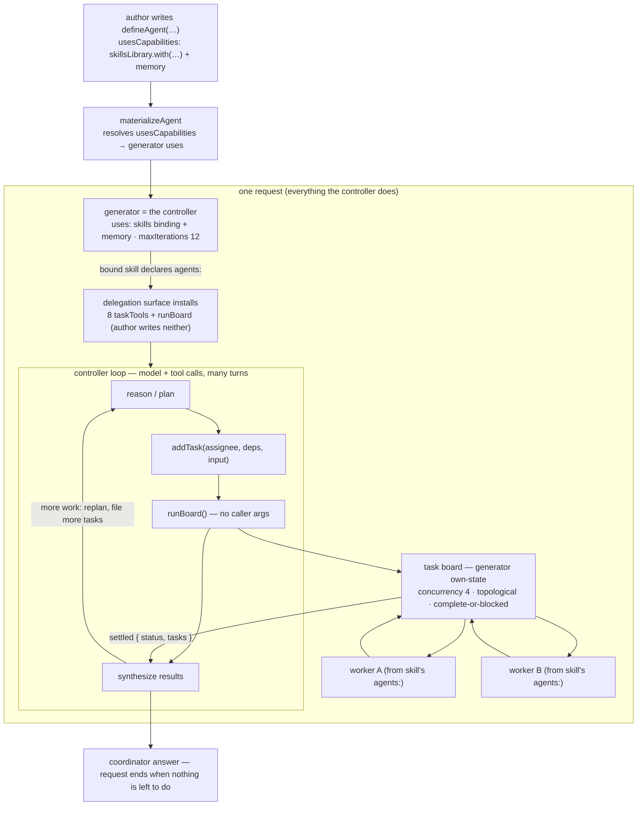

# FIX-929: Design — is a capability enough to express the agent controller? — Implementation Spec

> **This is a design / decision spike, like FIX-923.** Its deliverable is a decision
> — whether a *capability* is enough to express everything the skill/controller role
> needs, or whether the controller is fundamentally *capabilities plus a small set of
> installed blocks* — **not** a build. It ships no API. Part II below is **The Findings**
> (the grounded evidence behind Part I's decisions and the hand-off to the issues this
> feeds), not a build sequence.

## Part I — The Case *(for the human)*

### 0. Grok it first — turn is not request

Before anything else, one framing the rest of the spec leans on.

A **request** is the whole long-lived unit of work. It begins when the caller acts and
ends only when there is nothing left for the agent to do. A request can run 30 minutes or
more. Inside it the agent can take many turns, call sub-agents, file dozens of tasks,
replan, file more, drain a board, synthesize, and only then finish. Activating a skill,
deactivating it, doing work before the coordinator decides what to do next — all of that is
*part of the one request*.

A **turn** is a sub-unit *inside* a request. A turn can be a single ReactLoop turn (one
model call plus its tool calls) or a board-drain turn. A request is made of turns; a turn
is never bigger than the request that contains it.

Everything the "agent controller" does — install a skill, activate it, deactivate it,
plan, delegate, drain, replan — happens **inside the one request**. This spike is about
what it takes to express that in-request controller. It is *not* about picking work back up
across requests; see §6 for why that is a separate, out-of-scope concern with a trivial
answer.

### 1. Problem — why it matters, why now

A generator today is a model plus a tool loop. When we want an agent to do more than
"reason and call tools in one turn" — activate a skill on a cue, deactivate it, coordinate
delegated work, drain a board while it keeps planning, enforce a lifecycle — the question is
*where that machinery lives*. The FIX-918 delegation review floated a bespoke
`skillController` block to own board lifecycle outside the model's loop. On reflection the
real question is sharper, and it is the one the spec owner named:

**Is a capability enough to express all of the skill/controller functionality?** Capabilities
are our composition surface for adding behavior around a generator's loop — they contribute
context, tools, resources, and state to a block via `uses`. But a capability has a hard
limit: **it does not install pipeline blocks.** It contributes to the *one* block that lists
it. And we already know at least one piece of skill functionality lives in an installed
block, not a capability: the skill-library **activator** (`createSkillActivator`, FIX-421) is
a separate `.tap`-able sequencer that must be installed *before* the generator. So the
premise "the controller is just a generator with the right capabilities" is already, on the
current tree, not quite true. This spike measures exactly how untrue.

Why now: FIX-923 (the keystone host-model spike) has **landed** and decided *what* the
delegation host is (coordinator + synthesizer; on-demand as a default-worker floor). How the
host is *packaged* — one capability, several capabilities, a capability plus installed
blocks, or a new primitive — was left to this spike (epic FIX-930 §2e, Q6). Settling it
prevents building the wrong shape. There is no user-facing gap open today.

### 2. Solution in plain terms — the recommendation

**Start from the strong claim and test it against the code.** The strong claim is: *there is
no new primitive; the "agent controller" is a generator plus capabilities composed around
it.* Keep `defineAgent`'s `Agent` as the *spec* (persona, model, tools, `usesCapabilities`);
compose skills and delegation as capabilities on the generator; don't add an
`AgentController` wrapper or a tower of nesting decorators. **Flat, not nested.**

That claim is **mostly** right, and §3's inventory shows why. Installing the skills library,
preloading a skill, activating a skill mid-turn via the load tool, installing the delegation
board, draining it inline — all of these are already expressible as capability contributions
on the generator, no wrapper needed.

But the claim is **overstated as written**, and the two places it breaks are the load-bearing
findings of this spike:

- **Deterministic up-front activation needs an installed block.** A `/skill-name` cue,
  keyword scan, or LLM classifier that decides which skill applies *before* the generator
  runs cannot be a capability: a capability contributes to the generator, it cannot prepend a
  block ahead of it in the pipeline, and the classifier tier is itself a separate generator
  call. This is not hypothetical — it is `createSkillActivator` (FIX-421), an installed
  `.tap` sequencer, shipping today.
- **Background drain-while-planning needs a runtime affordance.** Draining the board in the
  background *while the agent keeps planning* (FIX-901) is not a capability contribution
  either: `runBoard` is a tool call, and a tool call blocks the loop until it returns.
  Concurrent in-request drain needs the runtime to detach the drain, not a tool that a
  capability installs.

So the honest shape of the controller is **capabilities + a small set of installed blocks
(at minimum the activator) + one runtime affordance for background drain.** Capabilities are
necessary and carry most of the weight; they are not *sufficient* on their own.

**The key open decision for the owner.** Given that the controller is "capabilities + a few
installed blocks," does that composition warrant a *named primitive*? This spike's job is to
make the answer legible, not to foreclose it. The recommended verdict (see §3 and Decision 1)
is: **no new block-kind or `AgentController` object** — the pieces compose flat — but there
*may* be room for a thin convenience factory that co-wires the activator block with the
generator's skills binding, because those two must agree on a shared `activeState` field and
that is an easy seam to desync. A helper, not a new primitive. **This is the call the owner
is reasoning through; the evidence below is meant to make it defensible either way.**

**The philosophy that led here.** This leans on **tenet 2 (composition over features)** — most
of the controller is a composition of primitives that already exist. **Tenet 3 (earn every
addition)**: the default answer to "should an `AgentController` exist?" is no, and the
installed blocks the controller *does* need (the activator) already exist for independent
reasons. **Tenet 4 (framework absorbs infrastructure, not knowledge)**: background drain is a
runtime scheduling concern; if it is built, it belongs in the runtime (FIX-901), not in a
user-constructed controller object.

### 3. The capability-sufficiency inventory

For each thing the controller does, is it expressible as a **capability**, or does it need an
**installed block** (or a runtime affordance)? Read against the current tree.

| Controller responsibility | Capability? | Installed block / runtime? | Grounding |
| -- | -- | -- | -- |
| Install the skills library | **Yes** | — | `createSkillsLibrary()` returns a `DefinedCapability`; `uses: [skills]` (`library.ts:223-225`). |
| Activate a skill — preload (`active`) | **Yes** | — | `.with({ active })` injects bodies + declared tools via the binding's config resolver (`library.ts:294-353`). |
| Activate a skill — model-driven, mid-turn | **Yes** | — | `.with({ allowed, dynamicActivation: true })` installs a load tool + catalog context — both generator contributions (`library.ts:356-372`). |
| Activate a skill — **deterministic, up-front** (`/skill`, keyword, classifier) | **No** | **Installed block** | `createSkillActivator` is a `.tap` sequencer that runs *before* the generator; tier-3 is its own classifier generator (`skill-activator.ts:96-160`). A capability contributes to the generator, it can't prepend a pipeline block. |
| Deactivate a skill | **In principle** | — (unbuilt) | No deactivate tool exists today. The symmetric write to the `activeState` field is what the load tool already does (`activation-store` `replaceActivations`), so it *could* be a generator tool the binding contributes — capability-expressible, not built. |
| Install the delegation board (taskTools + `runBoard` + board own-state + guidance) | **Yes** | — | Contributed by the skills binding when a bound skill declares `agents:` (`library.ts:393-539`, `delegation-surface.ts`). |
| Drain the board **inline** (today) | **Yes** | — | `runBoard` is a sequencer tool (`.step(drain).step(settle)`) the binding contributes; it blocks the loop and returns the settled board (`delegation-surface.ts:246-306`). |
| Drain the board **in background while planning continues** (FIX-901) | **No** | **Runtime affordance** | A tool call blocks the loop until it returns; concurrent in-request drain needs the runtime to detach the drain, not a contributed tool. Not an installed block either — a scheduling concern. |

**Reading the table.** Six of eight rows are pure capability work, and they are the common
path. The controller-as-capabilities claim holds for install, preload, mid-turn activation,
delegation install, and inline drain. It breaks in exactly two places: **deterministic
up-front activation** (needs an installed block, and one already exists) and **background
drain-while-planning** (needs a runtime affordance FIX-901 must build). Deactivation is a
latent capability — expressible, unbuilt.

**One nuance worth stating precisely.** The block requirement for up-front activation is
unconditional for the *general* activator, which bundles slash + keyword + LLM-classifier
tiers into one installed sequencer. A **slash-only** cue (no keyword, no classifier) is the
most capability-adjacent case — a synchronous prefix match plus a state write — and could in
principle be a context-time side effect on the generator. It is the LLM-classifier tier that
*hard*-requires a separate generator block. So the owner's framing ("capabilities don't
install blocks, so we need the activator block") is exactly right for the shipped activator;
the requirement softens only if you drop the classifier tier, which the shipped surface does
not.

### 4. Focus practices (1–3)

1. **Compose, don't accrete (tenet 2).** Express everything expressible as a capability —
   install, preload, mid-turn activation, delegation, inline drain — via `Agent` (spec) +
   `usesCapabilities` + the generator's skills binding. Reach for an installed block only
   where a capability provably can't reach: pre-generator activation.
2. **Name the capability/block seam honestly (tenet 3).** Do not claim the controller is
   "just capabilities." It is capabilities + the activator block + (for background) a runtime
   affordance. State the two exceptions plainly; they are the point of the spike.
3. **Don't add a primitive the composition doesn't need.** A new `AgentController` type or a
   decorator tower is rejected (Decision 1). If a convenience factory is wanted, it co-wires
   the activator block and the binding — a helper, not a new block kind.

### 5. What using it looks like

This spike ships **no new API**. The recommendation is that *the surface a delegating author
writes today does not change* — the controller is a composition they can already express. To
make that legible, here is the whole in-request "agent controller" as the two forms an author
writes today, each piece marked **exists** or **directional (FIX-901)**. Read against the
current tree (`define-agent.ts`, `materialize-agent.ts`, `skills/delegation-surface.ts`).

**Form A — as a `defineAgent` spec.** `defineAgent` returns an `Agent` (persona + model +
capabilities); `materializeAgent` turns it into the generator. The load-bearing fact: the
skills binding is *itself a capability* — `skillsLibrary.with(...)` returns a
`DefinedCapability` — so it rides **`usesCapabilities`** alongside memory. It does **not**
use the dead `usesSkills` field (a `string[]` of skill names, warn-only in
`materialize-agent.ts:119-123`). Skills-as-a-capability and the unwired `usesSkills` field are
two different things; the composition uses the former.

```ts
// The "agent controller" as a spec. No new type — this IS defineAgent today.
const coordinator = defineAgent({
  name: "coordinator",
  description: "Plans delegated work and synthesizes the results.", // required field
  persona: "Plan the work with addTask, run it with runBoard, then write the report.",
  model: "intent/chat",
  usesCapabilities: [
    // EXISTS — the skills binding is a capability ref, so it composes here. A bound
    // skill that declares `agents:` is what turns the delegation surface on.
    skillsLibrary.with({ active: ["coordinate-research"] } satisfies SkillsBindingConfig),
    memory, // EXISTS — any around-the-loop capability composes the same way.
  ],
  // NOT usesSkills: [...] — reserved-and-unwired (warn-only). Skills ride usesCapabilities.
});
```

`materializeAgent(coordinator, …)` resolves `usesCapabilities` into the generator's `uses`
and returns, verbatim (`materialize-agent.ts:146-165`):

```ts
generator({
  name: "agent_coordinator",
  model: "intent/chat",
  itemVisibility: { client: true, history: false }, // agent default
  uses: [ /* skillsLibrary.with(...), memory — resolved from usesCapabilities */ ],
  maxIterations: 12, // fixed by materializeAgent
  prompt: /* persona */, user: (input) => input.goal,
});
```

What makes this a *controller* is the delegation surface, and the author writes none of it
by hand: when a bound skill declares `agents:`, the skills binding installs the **eight
`taskTools`** (the board ledger — `addTask` with `assignee`/`deps`/`input`) **and
`runBoard`** onto the generator (`delegation-surface.ts:441-444`). `runBoard` takes **no
caller arguments** (`inputSchema: z.object({})`) — the model has already populated the board
with `addTask`; `runBoard` drains it (concurrency 4, topological, complete-or-blocked) and
returns `{ status: "drained" | "blocked", tasks }`. That drain **is** the controller loop —
inline, and it all happens inside the one request.

**One honest seam — in-request, not cross-request.** The activator that does deterministic
up-front activation runs *before* the generator and writes an `activeState` field; the
generator's binding reads that same field. Because the matcher runs before the generator, it
cannot reach the generator's block-state default — the two must name the **same explicit
`activeState` field** or the matcher writes state the generator never renders
(`apply-skill-activation.ts:53-91`; `library.ts` `activeState`). This is purely about whether
the activator's writes reach the generator *within the request*. It is the one seam a
convenience factory (§2) would exist to close.

**Form B — as a hand-written generator**, when you want `history: true` (a user-facing
coordinator that reseeds itself from the conversation):

```ts
generator({
  name: "coordinator",
  model: "intent/chat",
  history: true, // EXISTS on generator; NOT expressible via defineAgent
  // A deterministic /skill-name cue is an activation matcher on this binding
  // (createSkillActivator, FIX-421) — an INSTALLED BLOCK that runs before the generator,
  // not a capability. It writes activeState; this binding must read the SAME field —
  // `active[]` / own block state alone can't see the matcher's writes.
  uses: [
    skillsLibrary.with({
      allowed: ["research", "summarize"],
      activeState: { scope: "session", field: "activeSkills" },
    } satisfies SkillsBindingConfig),
    memory /* cross-turn capability */,
  ],
  prompt: "Plan with addTask, run with runBoard, surface the report.",
});
```

> **Not** `defineAgent({ usesSkills: [...] })`: that hook is reserved-and-unwired
> (warn-only, `materialize-agent.ts:119-123`). Skills bind at the generator, as above.
>
> The matcher (`createSkillActivator`) and this generator binding must name the **same**
> `activeState` field. The matcher is an installed block (`skill-activator.ts` returns a
> `BlockDefinition`); the binding is a capability. That split — block for up-front
> activation, capability for the binding — is the whole finding of this spike.

Both forms produce the same in-request controller shape: a generator whose `uses` carries the
skills binding, which installs `addTask` + `runBoard`, which drains the board inline — plus,
where deterministic up-front activation is wanted, an installed activator block ahead of it.
**No wrapper, no new primitive.** The composition, end to end:



The **background** variant of this same loop — drain the board *while the agent keeps
planning* rather than blocking on `runBoard` — is **FIX-901's** to build. It is in-request
concurrency, not a cross-request mechanism (§7).

### 5a. Candidate solution — the controller as an enclosing sequencer (owner's directional sketch)

§3 found the "not-capability" part of the controller in exactly one place on the common
path: **background drain-while-planning**. A capability contributes *to* the generator; it
cannot wrap the generator to run work *after* its loop exits and then re-enter it. So the
question §2 left open — *what is the enclosing block that §3 said background drain needs?* —
has a concrete answer, and the spec owner sketched it: an **installed sequencer that wraps the
generator.** Not an `AgentController` object, not a new block kind — a sequencer.

```
new sequencer({})
  .step(checkSkillActivation)
  .step(generator)  
  // if the generator called runBoard, we will do it after it exits its loop
  .workIf(generatorRequestedDrain, 
    new sequencer({}).step(snapshotActiveTasks).step(drainTasks)
  )
  // Wait for the task board to be empty, only wait 30 seconds though, giving the main generator an check in on the work.
  .waitForCondition(isTaskBoardEmpty, {
    when: generatorRequestedDrain,
    timeout: 30000
  })
  .loopBack("generator", { when: stillWaitingForTasks})
```

> *Directional sketch (spec owner). This is the **shape** of the controller for the
> background-drain case, not a locked API. The primitive names are ground-checked against the
> tree below; where the sketch and the code disagree, the disagreement is the point — it marks
> what FIX-901 (or a dependency) must build. Treat it as a proposed mechanism for FIX-901, not
> a settled one.*

**Reading the shape.** Four moving parts around the generator:

- **Step 1 — `checkSkillActivation`.** This *is* the installed activator block §3 named
  (`createSkillActivator`, FIX-421, `skill-activator.ts:96`). It runs before the generator,
  classifies which skill applies, and writes `activeState` (§5's seam). The enclosing sequencer
  is where that block was always going to live.
- **Step 2 — `generator`.** The ReactLoop — the controller loop of §5. It plans with `addTask`,
  and when it wants the board run it *signals* a drain rather than blocking on it (see the
  runBoard shift below).
- **Conditional drain — `.workIf(generatorRequestedDrain, …)`.** If the generator asked for a
  drain, the enclosing sequencer snapshots and drains the board *after* the generator exits its
  loop, not inside a tool call.
- **Wait + loop back.** `.waitForCondition(isTaskBoardEmpty, …)` parks for the board to empty
  (bounded at 30s), then `.loopBack("generator", …)` re-enters the generator so it can check in
  on the in-flight work, replan, or synthesize.

This is how "background drain while the agent keeps planning" is achieved **within one
request**: interleaved re-entry into the same generator, not a separate execution model and not
a cross-request wake (§7). The generator does a pass, hands the board to the enclosing
sequencer, and gets re-entered to see progress — many times, all inside the one request.

**What it makes concrete about §3's verdict.** The controller for the full-featured case is
neither "just capabilities on a generator" nor an `AgentController` object. It is a **sequencer
with a known shape**: activator → generator → conditional drain → bounded wait → loopBack. That
is a strong candidate for the "thin convenience factory" the reframe floated (§2, Decision 1's
open decision): a factory that *builds this controller sequencer*, co-wiring the activator
block, the generator's skills binding (on the shared `activeState` field), and the
drain/wait/loopBack scaffold. A helper that emits a sequencer — still no new block kind.

**Reconciling with Decision 1 ("flat, not nested").** Read literally, this sketch contradicts
"no wrapper" — it *does* wrap the generator. The contradiction is only apparent, and §3 already
carries the resolution. The capability-expressible responsibilities (install, preload, mid-turn
activation, delegation install, inline drain) compose **flat**, no wrapper. The
**background-drain case** needs the *one* enclosing controller sequencer above, because §3 found
that case is not capability-expressible. So "flat, not nested" is scoped to the capability
surface, not an absolute; Decision 1's wording is qualified accordingly. The enclosing sequencer
is not the rejected `AgentController` — it is a plain sequencer of existing primitives, and the
convenience factory, if built, is what emits it.

**Primitive grounding — what exists vs. what FIX-901 must add.** Read against the current tree.

| Primitive in the sketch | Status | Grounding / gap |
| -- | -- | -- |
| `.step(checkSkillActivation)` | **Exists** | `createSkillActivator` returns the `.tap`-able block that runs before the generator (`skill-activator.ts:96`; exported `skills/index.ts:115`). The sketch's `checkSkillActivation` is the block this factory produces — the §3 up-front activator. |
| `.workIf(cond, block)` | **Exists** (BP-036) | `sequencer-methods.ts:247-261`. Note `.work`/`.workIf` dispatch a **fire-and-forget background sidechain** (`sequencer-kernel.ts:7`), joined with `.waitForWork()`. That fire-and-forget semantics is aligned with "drain in the background," but it also means the drain's result is not a return value — consistent with the signal reframe below. |
| `.waitForCondition(pred, { timeout })` | **Exists, signature differs** | `sequencer-methods.ts:343-352`. The real predicate is `(items) => boolean` over the **request's item stream**, not an arbitrary state check; the option is **`timeoutMs`**, not `timeout`; and there is **no `when:` gate**. `isTaskBoardEmpty` must therefore be a predicate over the board's `task-change` items (history-hidden, `delegation-surface.ts:291-293`), ideally narrowed with the `wakeOn` pre-filter (FIX-660). Gating the wait on `generatorRequestedDrain` has to be done by *not reaching the step* when no drain was requested — `waitForCondition` takes no conditional-entry option. |
| `.loopBack("generator", { when })` | **Exists, one required arg omitted** | `sequencer-methods.ts:222-228`. `maxIterations` is **mandatory** — the sketch omits it, and that bound is exactly the anti-spin backstop the termination question needs. `loopBack` targets a step **by name**, so the `.step(generator)` step must be named `"generator"` or the runtime throws `loopBack target "generator" was not found` (`sequencer.ts:843`). |
| `generatorRequestedDrain` signal | **Does not exist — required addition** | Today `runBoard` drains **inline** and **returns** `{ status, tasks }` in the same turn (`.step(board.drain).step(settle)`, `delegation-surface.ts:246-306`). There is no "drain requested, defer it" flag. Turning `runBoard` into a signal that makes the generator exit and see results on re-entry is new mechanism FIX-901 must build. |

So three of the four sequencer primitives exist as sketched (modulo the `waitForCondition`
signature and the missing mandatory `maxIterations`); the load-bearing gap is the
`runBoard`→signal contract shift, which is the mechanism FIX-901 owns.

**Open questions the FIX-901 build must resolve (surfaced, not settled here):**

- **runBoard contract shift.** Today `runBoard` drains inline and returns the settled board for
  the generator to synthesize in the *same* turn (`delegation-surface.ts:246-306`). In this
  sketch, calling `runBoard` becomes a *signal* (`generatorRequestedDrain`): the generator exits
  its loop, the enclosing sequencer drains, and the generator sees results only on
  **re-entry**, not as a return value. That is a real semantic change, and it means the
  generator must be *authored for re-entry*. History-driven hosts (Form B, `history: true`)
  absorb this naturally — they reseed from the conversation each pass. Own-state hosts (Form A's
  materialized agent) need the board state to persist across the `loopBack` so the re-entered
  generator can read what settled; connect to the history/own-state seam already in §5 and §9.
  FIX-901 must decide how the settled board reaches the re-entered generator for each host shape.
- **Termination / anti-spin.** What flips `stillWaitingForTasks` to false and *ends* the loop?
  Board-empty is one exit. But the generator also needs a way, on a check-in, to say "done —
  emit the final answer and stop looping," or the loop can spin: re-enter, request nothing, wait
  out the 30s, re-enter. `loopBack`'s mandatory `maxIterations` is a hard backstop, not a crisp
  done-condition. FIX-901 must define the explicit termination signal; board-empty alone is
  under-specified.
- **Poll vs. event.** The 30s `waitForCondition` timeout is a **poll-based** check-in: simple,
  needs no event infrastructure, but pays coarse latency and burns a generator turn when nothing
  changed. The **event-driven** alternative wakes the generator when the board actually empties —
  `waitForCondition`'s `wakeOn` pre-filter over `task-change` items (FIX-660) is the substrate
  for it. Both are viable; this spike names the choice without picking one.

### 6. Cross-request is out of scope (non-goal)

Picking work back up **across requests** is **not** what this spike is about, and it does not
need the durable-controller machinery an earlier draft of this document proposed. A request
is one long-lived unit of work that ends when there is nothing left to do; everything the
controller does lives inside it. If a session's work should be resumable by a *later* request,
the substrate is trivial: a **session- or user-scoped `taskBoard`**, so the record of "these
tasks exist, here is their status" is simply there when the next request arrives and looks. No
external drainer, no durable controller checkpoint, no idempotent re-entry apparatus is in
scope here.

A future feature — an agent deciding *not* to handle certain tasks within its request and
leaving them for later — is **future, not now**. If we ever want it, the same session-scoped
board is the place it would live. That one-line pointer is the entirety of what this spike
says about cross-request; it is called out only so the boundary is not crossed by accident.

### 7. FIX-901 is in-request concurrency, not cross-request wake

FIX-901's "background" means one specific thing: **drain the board in the background while the
agent continues to plan** — concurrent, *inside the one request*. It does **not** mean suspend
the request, close it, and wake it on a later request. Getting this right matters because an
earlier draft of this spec mis-cast FIX-901 as a cross-request suspend/resume subsystem; it is
not.

What the code says today:

- `runBoard` drains **inline** and **blocks the loop** — it is a sequencer tool
  (`.step(board.drain).step(settle)`) whose return value is the settled board
  (`delegation-surface.ts:246-306`). While it runs, the controller's loop is parked on that
  tool call. The board's *workers* run concurrently (concurrency 4), but the *controller* does
  not keep planning while they do.
- So "drain in the background while the agent keeps planning" is **not today's behavior**, and
  it is **not a capability contribution**: a tool that a capability installs still blocks the
  loop when called. What it needs is a **runtime affordance** — a way for the runtime to
  advance the drain while the controller keeps taking turns in the same request. That is
  FIX-901's build, and it is in-request scheduling, not a notification bus and not a
  cross-request wake.

Still-accurate mechanism facts, repurposed to *this* question: the framework's suspend/resume
runtime (`ctx.suspend()` + resume, FIX-814) re-enters the exact tool call that suspended, by
replay-log identity (`generator.ts:1293,1490-1500`). That is the substrate a background
`runBoard` could lean on to yield the loop and be re-entered when the board makes progress —
all within the request. Whether concurrent drain-while-planning needs *new* machinery beyond
that, or can be expressed as an in-request suspend/re-enter cycle on the same `runBoard` call,
is FIX-901's design question. This spike's contribution is only the reframe: FIX-901 is
**in-request concurrency**, so it should not be designed as, or blocked on, a cross-request
substrate.

A concrete **candidate shape** for that in-request affordance is the enclosing controller
sequencer in §5a — the owner's directional sketch that wraps the generator (activator →
generator → conditional drain → bounded wait → loopBack) and expresses drain-while-planning as
interleaved re-entry into the same generator. Three of its four primitives already exist
(`.workIf`, `.waitForCondition`, `.loopBack`); the missing piece is the `runBoard`→signal
contract shift (`generatorRequestedDrain`), plus a crisp termination condition. §5a carries the
grounding and the open questions. It is a proposed mechanism for FIX-901, not a locked one.

### 8. Decisions & rules — the sign-off surface

1. **No new primitive; the controller is capabilities + a small set of installed blocks —
   flat for everything capability-expressible, with one enclosing controller sequencer for the
   background-drain case (§5a).** Capabilities compose via `usesCapabilities` on the `Agent`, which
   `materializeAgent` resolves into the generator's `uses`. The **skills binding and the
   `runBoard` drain wire at the generator**, not through `materializeAgent` (which only
   resolves `usesCapabilities` and warns/ignores `Agent.usesSkills`,
   `materialize-agent.ts:119-123`). **Deterministic up-front activation is an installed block**
   (`createSkillActivator`), because a capability cannot prepend a block ahead of the
   generator.
   - *Alternative rejected:* a new `Agent`/`AgentController` type that owns the generator, or a
     stack of nesting per-capability decorators.
   - *Ramification:* around-the-loop concerns are capabilities; pre-generator activation is a
     block; `defineAgent` stays the single agent spec. The "flat, not nested" rule is scoped to
     the capability surface — install, preload, activation, delegation, and inline drain compose
     flat on the generator. The **background-drain case is the one place a wrapper is warranted**:
     an enclosing sequencer around the generator (§5a), because §3 found that case is not
     capability-expressible. That wrapper is not the rejected `AgentController` object — it is a
     plain sequencer of existing primitives (activator → generator → `.workIf` drain →
     `.waitForCondition` → `.loopBack`), and the convenience factory, if built, is what emits it.
     *Open decision (owner's):* whether the
     capability + activator-block composition warrants a thin convenience factory that
     co-wires them on a shared `activeState` field. Recommended: a helper if the pattern
     recurs, not a new primitive.
2. **Background drain (FIX-901) is in-request concurrency, not cross-request wake.** `runBoard`
   drains inline and blocks the loop today (`delegation-surface.ts:246-306`). "Drain in the
   background while the agent keeps planning" needs a **runtime affordance** so the controller
   keeps taking turns while the board advances — inside the one request. It can lean on the
   existing suspend/resume model (`ctx.suspend()` re-enters the exact tool call by replay-log
   identity, FIX-814) but it is not a notification subsystem and not a cross-request substrate.
   - *Alternative rejected:* designing FIX-901 as a cross-request suspend/resume/wake subsystem,
     or as a standalone event/listener/notification bus.
   - *Ramification:* FIX-901 owns the in-request concurrency affordance; the host packaging
     commits to nothing that blocks it. *Falsifier (kept):* if the runtime cannot advance a
     drain while the same generator keeps issuing turns without new machinery, FIX-901's build
     is larger than a suspend/re-enter cycle on `runBoard` — name that when it's measured.
3. **Skill install/activation is capabilities for everything except up-front activation.**
   Install (`uses: [skills]`), preload (`.with({ active })`), and mid-turn model-driven
   activation (`.with({ allowed, dynamicActivation: true })`) are all capability contributions
   (`library.ts`). Deterministic up-front activation (`/skill`, keyword, classifier) is the
   installed `createSkillActivator` block. `Agent.usesSkills` is a **separate, reserved-and-
   unwired** hook (warn-only, `materialize-agent.ts:119-123`) → wire or remove, not something
   this spike relies on.
   - *Alternative rejected:* a bespoke skill-install path inside a controller wrapper.
   - *Ramification:* the activator and the generator binding must agree on a shared
     `activeState` field (§5's seam). *Falsifier:* if deterministic pre-generation activation
     could be expressed without an installed block (e.g. a slash-only cue as a context-time
     write), the "needs a block" claim narrows — but the shipped activator bundles the LLM
     classifier tier, which is a generator block by construction.

**Non-goals.** Not building the controller, FIX-901's concurrency affordance, or any API (this
is a decision doc). Not cross-request resumption (§6) — that is a session/user-scoped board,
future and out of scope. Not a general agent-abstraction redesign — the wider
agent-abstraction / roster-introspection question stays in **FIX-817, out of this epic**.

**Size estimate.** Design/decision spike — **no code, no PR plan.** Deliverable is this
document (mirrored to Linear), like FIX-923. The *downstream* build it informs (chiefly
FIX-901) is separately estimated at its own spec.

---

## Part II — The Findings *(grounded analysis + hand-off to the issues this feeds)*

> Dense on purpose: the evidence behind Part I's decisions, read against the current tree,
> plus the concrete hand-off to FIX-901 / FIX-641 / FIX-931 / FIX-933 / FIX-817.

### 9. Current behavior — verified against the code

Every claim was read in the current tree, not taken from the issue on faith.

- **`defineAgent` already *is* the agent spec.** `defineAgent(config: Agent)` validates and
  returns an `Agent` (name, `description`, `persona`, `model`, `allowedTools`,
  `usesCapabilities`, `usesSkills`, `itemVisibility`, `outputSchema`, `contextMode`) —
  `packages/workforce/src/define-agent.ts`, type in `packages/core/src/types/agent.ts`. Note
  it carries **no `history` field** — a materialized agent is not history-driven (see §5's
  seam; the `history: true` case is the hand-written Form B).
- **`materializeAgent` composes capabilities *around* a generator, flat.** It builds a
  `generator({ … tools, uses, maxIterations })` from an `Agent`, resolving `usesCapabilities`
  into `uses` and folding in board-scoped `taskTools`
  (`packages/workforce/src/materialize-agent.ts`). It warns-and-ignores `usesSkills`
  ("reserved and not yet wired", `:119-123`) and `contextMode: "fork"` ("not honored",
  `:125-129`). → confirms Decision 1: around-the-loop capabilities are *already* `uses`,
  materialized flat; the skill-install and fork concerns are reserved slots, not missing
  primitives.
- **`createSkillsLibrary()` is a capability; the binding carries install + activation +
  delegation.** It returns a `DefinedCapability` (`library.ts:223-225`). `.with({ active })`
  preloads bodies + tools; `.with({ allowed, dynamicActivation: true })` installs a load tool
  + catalog context (`library.ts:294-372`); a bound skill's `agents:` installs the delegation
  surface — `taskTools`, `runBoard`, the own-state board field, and guidance
  (`library.ts:393-539`). → grounds §3: install, preload, mid-turn activation, and delegation
  are all capability contributions.
- **`createSkillActivator` is an installed block, not a capability.** It returns a
  `BlockDefinition` — a `.tap`-able sequencer with slash / keyword / LLM-classifier tiers that
  runs *before* the generator and writes the resolved skills to an `activeState` field
  (`skill-activator.ts:96-160`; the apply step, `apply-skill-activation.ts:53-91`). Tier-3 is
  its own classifier generator. A capability contributes to the generator; it cannot prepend
  this. → grounds §3 and Decision 1/3: deterministic up-front activation is the block the
  owner named. It also grounds the seam — the activator and the generator binding must share
  the `activeState` field.
- **`runBoard` drains *inline* and blocks the loop — no background today.** The delegation
  surface installs `taskTools` + `runBoard`, a sequencer `.step(board.drain).step(settle)`
  over the generator's own-state board, only when a bound skill declares `agents:`
  (`delegation-surface.ts:246-306`, `library.ts:393-408`). The drain settles inside the
  calling loop iteration and returns; the controller does not keep planning while it runs. →
  grounds §3 and Decision 2: background drain-while-planning is not shipped behavior and is not
  a tool contribution — it needs a runtime concurrency affordance (FIX-901).
- **Generator suspend/resume re-enters the exact tool call (the substrate background could
  lean on).** A tool that calls `ctx.suspend()` throws `SuspensionError`; on resume the runtime
  re-enters the *same* tool call by replay-log identity — `completed` calls inject persisted
  output, the pending gate's `ctx.suspend()` returns the resume payload (FIX-814,
  `generator.ts:1293,1490-1500`; resume runtime FIX-141). → grounds Decision 2's falsifier:
  an in-request background `runBoard` can yield and be re-entered without new re-entry
  machinery; whether that fully expresses drain-while-planning is FIX-901's to measure.
- **Cross-request resumption needs no new apparatus here — a session-scoped board suffices.**
  `defineTaskCollection` yields a durable, resource-backed `TaskCollection` surviving across
  turns (`tasks/collection/define-task-collection.ts`). Delegation today backs `runBoard` on
  the generator's **own-state sequencer** (`delegation-surface.ts:374-382`), which is
  request-scoped. → grounds §6: *if* cross-request resumption is ever wanted (future, out of
  scope), a session/user-scoped board is the substrate — not a durable controller checkpoint or
  external drainer, which this spike explicitly does not propose.

### 10. Prior art — the packaging question, cited

- **Anthropic, "Building Effective Agents"** ([post](https://www.anthropic.com/research/building-effective-agents)):
  orchestrator-workers is a *composition* ("a central LLM dynamically breaks down tasks,
  delegates them to worker LLMs, and synthesizes"), and the guidance is explicit — *start
  simple, add structure only when it earns its place.* A controller primitive is exactly the
  structure to defer until composition fails. Here composition covers most of the surface; the
  installed activator earns its place for a concrete reason (pre-generator classification), not
  as a general wrapper. → Decision 1.
- **Counter-signal (why a wrapper *can* be right)**: OpenAI Agents-SDK and LangGraph both ship
  an explicit orchestrator object — justified when it owns runtime state a plain function
  can't. In FSD, the state that is genuinely not a capability contribution is the *in-request
  background-drain scheduling*, which lives in the runtime (FIX-901), not a user-constructed
  `AgentController`. That is the honest case for and against a primitive — the owner's call.

### 11. How the recommendation maps to each downstream issue

| Issue | What this spike hands it |
| -- | -- |
| **FIX-901** (background drain) | **Reframe: it is IN-REQUEST concurrency — drain the board while the agent keeps planning, inside the one request — not a cross-request suspend/resume/wake subsystem and not an event/listener bus.** `runBoard` drains inline and blocks the loop today (§9), so the build is a **runtime affordance** that advances the drain while the controller keeps taking turns; it can lean on the existing suspend/resume re-entry (FIX-814) but stays within the request. Its shape is decided; its viability rests on the suspend/re-enter proven in §9. **Candidate mechanism (owner's directional sketch, §5a):** an enclosing controller sequencer — activator → generator → `.workIf` conditional drain → `.waitForCondition` bounded wait → `.loopBack` re-entry — expressing drain-while-planning as interleaved re-entry. `.workIf`/`.waitForCondition`/`.loopBack` exist (modulo signature); the load-bearing dependency is turning `runBoard` from an inline-returning tool into a drain *signal* (`generatorRequestedDrain`), plus a crisp termination condition. Sketch, not locked API. |
| **FIX-641** (class+identity) | Unaffected by this packaging call — it aligns to 923's decided default-worker floor. No dependency on 929. |
| **FIX-924** (validateAssignee) | Unaffected — mode-based rule already decided by 923. |
| **FIX-931** (enqueue cap) / **FIX-933** (spend cap) | Budgets are an in-request concern here; the controller's board is the natural home for a per-request cumulative count. Cross-request budget accumulation is out of scope (no cross-request wake). Accumulate-vs-reset within a request is **FIX-931/933's** call. |
| **FIX-917** (durable block-state) | **Not a dependency of this spike.** With cross-request resumption out of scope (§6), there is no woken-host-loses-block-state hazard for 929 to name. If cross-request resumption is ever built on a session-scoped board, durability lives at that board (session scope), not block scope. |
| **FIX-817** (agent/roster introspection) | **Out of this epic and out of this spike.** The wider agent-abstraction / "what can I compose" surface stays there; 929 is bounded to the delegation host + skill-controller role. |

### 12. Edge cases the downstream builds must handle

| Case | Expected behavior |
| -- | -- |
| In-request inline drain (no background) | Today's behavior preserved: `runBoard` synthesizes inline; no suspend, no extra machinery required. |
| Background drain while planning (FIX-901) | The controller keeps taking turns while the board advances, all in one request. Wake granularity (advance per-completion vs. once-all-done) is an undecided FIX-901 policy — today's `runBoard` takes no caller args (`inputSchema: z.object({})`), so this spike adds no wake-timing config. The board is the source of truth for which tasks settled. §5a sketches the enclosing-sequencer mechanism and its open questions (runBoard→signal shift, termination/anti-spin, poll vs. event). |
| Up-front activation seam | The installed activator and the generator binding must name the **same** `activeState` field; otherwise the matcher writes state the generator never renders (§5). A convenience factory, if built, closes this seam. |
| Cross-request resumption | Out of scope (§6). If ever wanted, a session/user-scoped `taskBoard` is the substrate — no durable controller checkpoint or external drainer proposed here. |
| Slash-only up-front cue | The most capability-adjacent activation case (synchronous match + state write). The shipped activator still routes it through an installed block because it is bundled with the LLM-classifier tier; a slash-only variant is the one case where the block requirement softens (§3 nuance). |

### 13. Documentation plan

**No end-user docs change from *this* spike** — it ships no API. Docs land with the surface:
FIX-901 documents the in-request background-drain model when it ships; FIX-932 (delegation
authoring guide) is the home for "how a coordinator delegates and synthesizes," including the
background variant once FIX-901 lands.

### 14. Dependencies, open questions & follow-ups

**Dependencies.** This spike has **no hard blockers** (it is a decision). It **informs**
FIX-901 (whose design commitment should wait for it) and reframes the epic's Q6. It does
**not** block FIX-641 / FIX-924 / FIX-931.

**Open questions for the human (do not block the decision):**
- **The key decision — does the capability + installed-block composition warrant a named
  primitive?** Recommended: no new block-kind or `AgentController` object; possibly a thin
  convenience factory co-wiring the activator block with the generator's skills binding on a
  shared `activeState` field. The evidence (§3) is meant to make either call defensible — this
  is the owner's to settle.
- **Sequencing (epic Q6).** Recommended: land 929 now, FIX-901 builds against the in-request
  reframe, and the floor/identity/cap work (FIX-641/924/931) proceeds in parallel. The only
  thing that must wait for 929 is FIX-901's design commitment.

**Follow-ups (flagged, not built):**
- **Deepening opportunity — retire the reserved-but-unwired `Agent` hooks.** `usesSkills`
  ("reserved and not yet wired") and `contextMode: "fork"` ("not honored") in
  `materialize-agent.ts` are warn-only placeholders. When skill auto-load (Decision 3) and
  fork-like context supply (FIX-920) land, these should be *wired or removed*, not left as
  permanent warnings (tenet 3, subtract-as-you-go). Follow up via `improve-codebase-architecture`.
- **Already-rejected direction.** A new `Agent`/`AgentController` primitive and a nesting
  decorator tower are rejected here (Decision 1); record rather than re-litigate if they
  resurface.

---

## Spec evolution

- **Spec drafted** — framed FIX-929 as the packaging/decision spike it is (not a build);
  recommended **no new primitive** — the "agent controller" is `Agent` + capabilities
  (`uses`) + the skills binding + the drain, flat not nested; grounded the background loop in
  the *existing* suspend/resume (FIX-814) + `wakeOn` (FIX-660) + durable `defineTaskCollection`
  substrate read in-tree; resolved epic Q6 and reframed FIX-901; named a conditional FIX-917
  dependency.
- **After spec review** — sharpened mechanism-chosen vs FIX-901-work-remaining, fixed the usesSkills sketch, and trimmed the spike, because two reviewers flagged over-delivery + accuracy.
- **After second review pass** — split the Part-I recommendation so capabilities compose via `usesCapabilities` on the `Agent` while skills bind at the *generator*; removed the nonexistent "suspend-reset warning."
- **After spec review (final accuracy pass)** — matched the sign-off rule to the skills/drain-wire-at-generator fact, showed the explicit activeState for slash activation, named the step-capable-model precondition.
- **Made the recommendation legible (spec owner)** — replaced §5's abstract sketch with the concrete `defineAgent` composition (Form A + Form B), what `materializeAgent` produces, and the two Mermaid diagrams (in-request composition; a since-removed two-regime boundary).
- **After owner re-centering (this pass)** — the owner rejected the cross-request premise: turn ≠ request. A request is the whole long-lived unit of work (30+ min, many turns, sub-agent calls, dozens of tasks, replanning); a turn is a sub-unit inside it; everything the controller does happens in the one request. Cut the entire §6 "Cross-request wake: the two regimes" section, its two-regime Mermaid diagram, the BEFORE/AFTER cross-request code pair, and the durable-controller-checkpoint / external-drainer / idempotent-re-entry apparatus — cross-request is now a one-paragraph explicit non-goal handled trivially by a session/user-scoped taskBoard. Reframed FIX-901 as in-request concurrency (drain the board while the agent keeps planning), not cross-request suspend/resume/wake. Dropped the FIX-917 durable-block-state dependency (no cross-request survival hazard remains in scope). **Re-centered the spike on its real question: is a capability enough to express the skill/controller functionality?** Added the §3 capability-sufficiency inventory grounded in `library.ts` / `delegation-surface.ts` / `skill-activator.ts` / `materialize-agent.ts`, with the recommended verdict — capabilities carry most of it but are not sufficient: deterministic up-front activation needs an installed block (`createSkillActivator`, already shipping) and background drain needs a runtime affordance (FIX-901) — marked explicitly as the owner's key open decision, not foreclosed. Kept the §5 `defineAgent` composition and the in-request loop diagram, recontextualized.
- **Added the candidate controller sketch (spec owner, this pass)** — introduced §5a: the owner's directional sketch of the "not-capability" part of the controller as an **installed sequencer that wraps the generator** (activator → generator → `.workIf` conditional drain → `.waitForCondition` bounded wait → `.loopBack` re-entry), flagged as a proposed mechanism for FIX-901. Ground-checked its primitives against the tree — `.workIf` (BP-036), `.waitForCondition` (signature differs: item-stream predicate + `timeoutMs`, no `when:` gate), and `.loopBack` (mandatory `maxIterations` the sketch omits) all exist; the `generatorRequestedDrain` drain-signal does **not** (today `runBoard` drains inline and returns), so it is a required FIX-901 addition. Surfaced three open questions (runBoard contract shift, termination/anti-spin, poll vs. event). Qualified Decision 1's "flat, not nested" to scope it to the capability surface, with the one enclosing controller sequencer allowed for the background-drain case §3 found is not capability-expressible. Threaded the candidate into §7 and the §11 FIX-901 hand-off.
