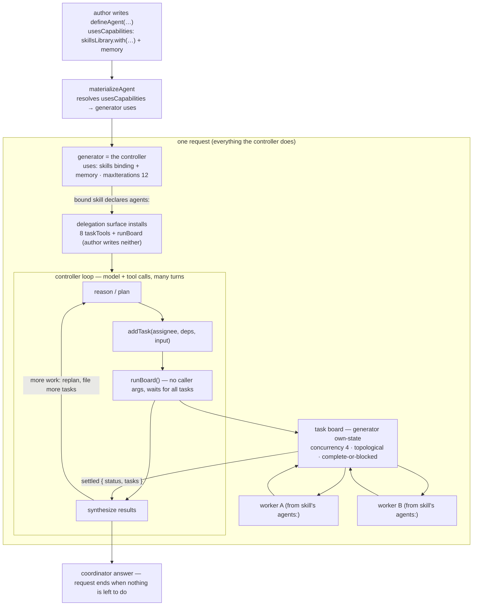

# FIX-929: Design — is a capability enough to express the agent controller? — Implementation Spec

> **This is a design / decision spike, like FIX-923.** Its deliverable is a decision
> — whether a *capability* is enough to express everything the skill/controller role
> needs, or whether the controller is fundamentally *capabilities plus a small installed
> block* — **not** a build. It ships no API. Part II below is **The Findings**
> (the grounded evidence behind Part I's decisions and the hand-off to the issues this
> feeds), not a build sequence.

## Part I — The Case *(for the human)*

### 0. Grok it first — turn is not request, and this epic is in-request only

Before anything else, two framings the rest of the spec leans on.

A **request** is the whole long-lived unit of work. It begins when the caller acts and
ends only when there is nothing left for the agent to do. A request can run 30 minutes or
more. Inside it the agent can take many turns, call sub-agents, file dozens of tasks,
replan, file more, drain a board, synthesize, and only then finish. Activating a skill,
deactivating it, doing work before the coordinator decides what to do next — all of that is
*part of the one request*.

A **turn** is a sub-unit *inside* a request. A turn can be a single ReactLoop turn (one
model call plus its tool calls) or a board-drain turn. A request is made of turns; a turn
is never bigger than the request that contains it.

**This epic is in-request only, and every task is blocking.** The generator plans with
`addTask`, calls `runBoard`, and `runBoard` waits for **all** tasks to settle before it
returns the board — then the generator decides what to do next. There is no blocking/background
task distinction in scope, and there is no outer controller loop. That is close to today's
behavior, on purpose. Detached execution — draining a board in the background while the agent
keeps planning, out-of-request executors, durable job queues — is **out of scope** and lives in
**FIX-939** (§7). Everything the "agent controller" does here — install a skill, activate it,
deactivate it, plan, delegate, drain, replan — happens **inside the one request**. This spike
is about what it takes to express that in-request controller. It is *not* about picking work
back up across requests; see §6 for why that is a separate, out-of-scope concern with a trivial
answer.

### 1. Problem — why it matters, why now

A generator today is a model plus a tool loop. When we want an agent to do more than
"reason and call tools in one turn" — activate a skill on a cue, deactivate it, coordinate
delegated work, drain a board, enforce a lifecycle — the question is *where that machinery
lives*. The FIX-918 delegation review floated a bespoke `skillController` block to own board
lifecycle outside the model's loop. On reflection the real question is sharper, and it is the
one the spec owner named:

**Is a capability enough to express all of the skill/controller functionality?** Capabilities
are our composition surface for adding behavior around a generator's loop — they contribute
context, tools, resources, and state to a block via `uses`. But a capability has a hard
limit: **it does not install pipeline blocks.** It contributes to the *one* block that lists
it. And we already know at least one piece of skill functionality lives in an installed
block, not a capability: the skill-library **activator** (`createSkillActivator`, FIX-421) is
a separate `.tap`-able sequencer that must be installed *before* the generator. So the
premise "the controller is just a generator with the right capabilities" is already, on the
current tree, not quite true. This spike measures exactly how untrue.

Why now: FIX-923 (the keystone host-model spike) has **landed** and decided *what* the
delegation host is (coordinator + synthesizer; on-demand as a default-worker floor). How the
host is *packaged* — one capability, several capabilities, a capability plus an installed
block, or a new primitive — was left to this spike (epic FIX-930 §2e, Q6). Settling it
prevents building the wrong shape. There is no user-facing gap open today.

### 2. Solution in plain terms — the recommendation

**Start from the strong claim and test it against the code.** The strong claim is: *there is
no new primitive; the "agent controller" is a generator plus capabilities composed around
it.* Keep `defineAgent`'s `Agent` as the *spec* (persona, model, tools, `usesCapabilities`);
compose skills and delegation as capabilities on the generator; don't add an
`AgentController` wrapper or a tower of nesting decorators. **Flat, not nested.**

That claim is **almost entirely** right, and §3's inventory shows why. Installing the skills
library, preloading a skill, activating a skill mid-turn via the load tool, installing the
delegation board, draining it inline (waiting for all tasks) — all of these are already
expressible as capability contributions on the generator, no wrapper needed.

The claim is **overstated in exactly one place**, and that one place is the load-bearing
finding of this spike:

- **Deterministic up-front activation needs an installed block.** A `/skill-name` cue,
  keyword scan, or LLM classifier that decides which skill applies *before* the generator
  runs cannot be a capability: a capability contributes to the generator, it cannot prepend a
  block ahead of it in the pipeline, and the classifier tier is itself a separate generator
  call. This is not hypothetical — it is `createSkillActivator` (FIX-421), an installed
  `.tap` sequencer, shipping today.

So the honest shape of the controller within this epic's scope is **capabilities + one
installed block (the activator).** Capabilities are necessary and carry most of the weight;
they are not *sufficient* on their own, because deterministic pre-generator activation lives
in a block.

**The decision this resolves.** Given that the controller is "capabilities + the activator
block," does that composition warrant anything more? The answer is: **no new block-kind and no
`AgentController` object** — the pieces compose flat. The one convenience worth offering is a
thin, **optional activation utility**: a helper that emits a sequencer co-wiring the activator
block with the generator's skills binding on a shared `activeState` field, because those two
must agree on that field and it is an easy seam to desync (§5a). It is optional and minor — a
helper, not a new primitive, and not a controller loop.

**The philosophy that led here.** This leans on **tenet 2 (composition over features)** — most
of the controller is a composition of primitives that already exist. **Tenet 3 (earn every
addition)**: the default answer to "should an `AgentController` exist?" is no, and the
installed block the controller *does* need (the activator) already exists for independent
reasons; the optional activation utility earns its place only as a small co-wiring helper, not
a new abstraction.

### 3. The capability-sufficiency inventory

For each thing the controller does, is it expressible as a **capability**, or does it need an
**installed block**? Read against the current tree, under this epic's in-request, all-blocking
scope.

| Controller responsibility | Capability? | Installed block? | Grounding |
| -- | -- | -- | -- |
| Install the skills library | **Yes** | — | `createSkillsLibrary()` returns a `DefinedCapability`; `uses: [skills]` (`library.ts:223-225`). |
| Activate a skill — preload (`active`) | **Yes** | — | `.with({ active })` injects bodies + declared tools via the binding's config resolver (`library.ts:294-353`). |
| Activate a skill — model-driven, mid-turn | **Yes** | — | `.with({ allowed, dynamicActivation: true })` installs a load tool + catalog context — both generator contributions (`library.ts:356-372`). |
| Activate a skill — **deterministic, up-front** (`/skill`, keyword, classifier) | **No** | **Installed block** | `createSkillActivator` is a `.tap` sequencer that runs *before* the generator; tier-3 is its own classifier generator (`skill-activator.ts:96-160`). A capability contributes to the generator, it can't prepend a pipeline block. |
| Deactivate a skill | **In principle** | — (unbuilt) | No deactivate tool exists today. The symmetric write to the `activeState` field is what the load tool already does (`activation-store` `replaceActivations`), so it *could* be a generator tool the binding contributes — capability-expressible, not built. |
| Install the delegation board (taskTools + `runBoard` + board own-state + guidance) | **Yes** | — | Contributed by the skills binding when a bound skill declares `agents:` (`library.ts:393-539`, `delegation-surface.ts`). |
| Drain the board (wait for all tasks, then return) | **Yes** | — | `runBoard` is a sequencer tool (`.step(drain).step(settle)`) the binding contributes; it blocks the loop until all tasks settle and returns the settled board (`delegation-surface.ts:246-306`). |

**Reading the table.** Six of seven rows are pure capability work, and they are the whole
in-scope path. The controller-as-capabilities claim holds for install, preload, mid-turn
activation, delegation install, and the wait-for-all drain. It breaks in exactly one place:
**deterministic up-front activation**, which needs an installed block — and one already exists
(`createSkillActivator`). Deactivation is a latent capability — expressible, unbuilt.

*(Detached / background drain — draining the board while the agent keeps planning — is **not**
in this table because it is out of this epic's scope. That concern moved wholesale to FIX-939;
see §7.)*

**One nuance worth stating precisely.** The block requirement for up-front activation is
unconditional for the *general* activator, which bundles slash + keyword + LLM-classifier
tiers into one installed sequencer. A **slash-only** cue (no keyword, no classifier) is the
most capability-adjacent case — a synchronous prefix match plus a state write — and could in
principle be a context-time side effect on the generator. It is the LLM-classifier tier that
*hard*-requires a separate generator block. So the owner's framing ("capabilities don't
install blocks, so we need the activator block") is exactly right for the shipped activator;
the requirement softens only if you drop the classifier tier, which the shipped surface does
not.

### 4. Focus practices (1–3)

1. **Compose, don't accrete (tenet 2).** Express everything expressible as a capability —
   install, preload, mid-turn activation, delegation, the wait-for-all drain — via `Agent`
   (spec) + `usesCapabilities` + the generator's skills binding. Reach for an installed block
   only where a capability provably can't reach: pre-generator activation.
2. **Name the capability/block seam honestly (tenet 3).** Do not claim the controller is
   "just capabilities." It is capabilities + the activator block. State the one exception
   plainly; it is the point of the spike.
3. **Don't add a primitive the composition doesn't need.** A new `AgentController` type or a
   decorator tower is rejected (Decision 1). The one convenience offered is the optional
   activation utility — a helper that co-wires the activator block and the binding — a helper,
   not a new block kind.

### 5. What using it looks like

This spike ships **no new API**. The recommendation is that *the surface a delegating author
writes today does not change* — the controller is a composition they can already express. To
make that legible, here is the whole in-request "agent controller" as the two forms an author
writes today. Every piece **exists**. Read against the current tree (`define-agent.ts`,
`materialize-agent.ts`, `skills/delegation-surface.ts`).

**Form A — as a `defineAgent` spec.** `defineAgent` returns an `Agent` (persona + model +
capabilities); `materializeAgent` turns it into the generator. The load-bearing fact: the
skills binding is *itself a capability* — `skillsLibrary.with(...)` returns a
`DefinedCapability` — so it rides **`usesCapabilities`** alongside memory. It does **not**
use the dead `usesSkills` field (a `string[]` of skill names, warn-only in
`materialize-agent.ts:119-123`). Skills-as-a-capability and the unwired `usesSkills` field are
two different things; the composition uses the former.

```ts
// The "agent controller" as a spec. No new type — this IS defineAgent today.
const coordinator = defineAgent({
  name: "coordinator",
  description: "Plans delegated work and synthesizes the results.", // required field
  persona: "Plan the work with addTask, run it with runBoard, then write the report.",
  model: "intent/chat",
  usesCapabilities: [
    // EXISTS — the skills binding is a capability ref, so it composes here. A bound
    // skill that declares `agents:` is what turns the delegation surface on.
    skillsLibrary.with({ active: ["coordinate-research"] } satisfies SkillsBindingConfig),
    memory, // EXISTS — any around-the-loop capability composes the same way.
  ],
  // NOT usesSkills: [...] — reserved-and-unwired (warn-only). Skills ride usesCapabilities.
});
```

`materializeAgent(coordinator, …)` resolves `usesCapabilities` into the generator's `uses`
and returns, verbatim (`materialize-agent.ts:146-165`):

```ts
generator({
  name: "agent_coordinator",
  model: "intent/chat",
  itemVisibility: { client: true, history: false }, // agent default
  uses: [ /* skillsLibrary.with(...), memory — resolved from usesCapabilities */ ],
  maxIterations: 12, // fixed by materializeAgent
  prompt: /* persona */, user: (input) => input.goal,
});
```

What makes this a *controller* is the delegation surface, and the author writes none of it
by hand: when a bound skill declares `agents:`, the skills binding installs the **eight
`taskTools`** (the board ledger — `addTask` with `assignee`/`deps`/`input`) **and
`runBoard`** onto the generator (`delegation-surface.ts:441-444`). `runBoard` takes **no
caller arguments** (`inputSchema: z.object({})`) — the model has already populated the board
with `addTask`; `runBoard` drains it (concurrency 4, topological, complete-or-blocked),
**waits for all tasks to settle**, and returns `{ status: "drained" | "blocked", tasks }`.
That drain **is** the controller loop — inline, blocking, and it all happens inside the one
request. The generator reads the settled board and decides what to do next.

**One honest seam.** The activator that does deterministic up-front activation runs *before*
the generator and writes an `activeState` field; the generator's binding reads that same field.
Because the matcher runs before the generator, it cannot reach the generator's block-state
default — the two must name the **same explicit `activeState` field** or the matcher writes
state the generator never renders (`apply-skill-activation.ts:53-91`; `library.ts`
`activeState`). This is purely about whether the activator's writes reach the generator *within
the request*. It is the one seam the optional activation utility (§5a) exists to close.

**Form B — as a hand-written generator**, when you want `history: true` (a user-facing
coordinator that reseeds itself from the conversation):

```ts
generator({
  name: "coordinator",
  model: "intent/chat",
  history: true, // EXISTS on generator; NOT expressible via defineAgent
  // A deterministic /skill-name cue is an activation matcher on this binding
  // (createSkillActivator, FIX-421) — an INSTALLED BLOCK that runs before the generator,
  // not a capability. It writes activeState; this binding must read the SAME field —
  // `active[]` / own block state alone can't see the matcher's writes.
  uses: [
    skillsLibrary.with({
      allowed: ["research", "summarize"],
      activeState: { scope: "session", field: "activeSkills" },
    } satisfies SkillsBindingConfig),
    memory /* cross-turn capability */,
  ],
  prompt: "Plan with addTask, run with runBoard, surface the report.",
});
```

> **Not** `defineAgent({ usesSkills: [...] })`: that hook is reserved-and-unwired
> (warn-only, `materialize-agent.ts:119-123`). Skills bind at the generator, as above.
>
> The matcher (`createSkillActivator`) and this generator binding must name the **same**
> `activeState` field. The matcher is an installed block (`skill-activator.ts` returns a
> `BlockDefinition`); the binding is a capability. That split — block for up-front
> activation, capability for the binding — is the whole finding of this spike.

Both forms produce the same in-request controller shape: a generator whose `uses` carries the
skills binding, which installs `addTask` + `runBoard`, which drains the board inline and waits
for all tasks — plus, where deterministic up-front activation is wanted, an installed activator
block ahead of it. **No wrapper, no new primitive.** The composition, end to end:



A **detached** variant of this same loop — drain the board *while the agent keeps planning*
rather than blocking on `runBoard` — is **out of scope for this epic** and belongs to FIX-939
(§7). This epic's `runBoard` waits for all tasks and returns; the generator decides next.

### 5a. Optional activation utility

§3 leaves exactly one thing a capability cannot express within this epic's scope:
deterministic up-front activation. The activator (`createSkillActivator`, FIX-421) is an
installed `.tap` sequencer that runs *before* the generator and writes an `activeState` field
the generator's skills binding then reads (§5's seam). A capability contributes to the
generator; it cannot prepend a block ahead of it. So installing the activator and keeping its
`activeState` field in sync with the binding is the one bit of wiring the composition doesn't
do for free.

That wiring is delivered as an **optional, installable utility**: a small helper that emits a
sequencer running the activator before the generator and passing both the **same** explicit
`activeState` field. It exists only to make deterministic up-front activation easy to install
and hard to desync. It is not a controller loop, and it is not the centerpiece of this spike —
authors who don't want deterministic up-front activation never install it (mid-turn
model-driven activation, `.with({ allowed, dynamicActivation: true })`, is a pure capability
contribution and needs no enclosing sequencer at all).

```ts
// Optional: co-wire the activator with the generator's skills binding on a shared field.
// A helper that emits a sequencer — no new block kind, no wrapper "controller."
new sequencer({})
  .tap(createSkillActivator({ /* slash / keyword / classifier tiers */ activeState }))
  .step(generator({ uses: [skillsLibrary.with({ allowed, activeState })] }));
```

The two primitives it wires already exist: `createSkillActivator` returns the `.tap`-able
block that runs before the generator (`skill-activator.ts:96`; exported `skills/index.ts:115`),
and the skills binding is the capability the generator lists. The utility adds no mechanism; it
only guarantees the `activeState` field matches on both sides.

> An earlier draft sketched an enclosing sequencer here that wrapped the generator to drain a
> board *after* its loop and re-enter it (`.workIf` drain → `.waitForCondition` → `.loopBack`).
> That scaffold is **not this epic's mechanism.** It belongs to the detached/background case,
> which moved to FIX-939 (§7). If FIX-939's substrate later wants an enclosing-sequencer shape,
> that is FIX-939's to explore — it is explicitly not a design consideration for this epic.

### 6. Cross-request is out of scope (non-goal)

Picking work back up **across requests** is **not** what this spike is about, and it does not
need durable-controller machinery. A request is one long-lived unit of work that ends when
there is nothing left to do; everything the controller does lives inside it. If a session's
work should be resumable by a *later* request, the substrate is a **session- or user-scoped
`taskBoard`**, so the record of "these tasks exist, here is their status" is simply there when
the next request arrives and looks. No external drainer, no durable controller checkpoint, no
idempotent re-entry apparatus is in scope here.

That cross-request / detached direction is exactly what **FIX-939 ("Durable jobs &
detached-task substrate")** now owns. This spike says only where the boundary is and designs
the task/board contract so FIX-939 can slot in later (§7); it does not build across-request
resumption.

### 7. Detached execution is out of scope — FIX-939 owns it

This epic is **in-request only**, and every task is blocking. The generator plans with
`addTask`, calls `runBoard`, and `runBoard` waits for **all** tasks to settle before returning
the board so the generator can decide what to do next (§5, `delegation-surface.ts:246-306`).
There is no blocking/background task distinction and no outer controller loop in scope. That is
close to today's behavior, deliberately.

Draining the board *in the background while the agent keeps planning*, detached or
out-of-request executors, a durable job queue, wake-on-board-empty, `ctx.suspend()`-based
deferred drain — all of that is **out of scope** and now lives in **FIX-939 ("Durable jobs &
detached-task substrate")**. FIX-901, which framed this concern as a "background work pool," is
**canceled**; FIX-939 supersedes it. Any mechanism an earlier draft floated for the background
case (a `generatorRequestedDrain` signal, an enclosing drain/wait/loopBack sequencer, a
`runBoard`-becomes-a-signal contract shift) belongs to FIX-939, not here.

**The detach-ready contract this epic owes FIX-939.** The task/board contract is deliberately
designed so a detached-task substrate can slot in *without breaking callers*. The task
collection is already the durable-job primitive — tasks are durable, leased, mutable, and
observable (`defineTaskCollection`, `tasks/collection/define-task-collection.ts`). That is the
seam FIX-939 will build on. An out-of-request executor is just another claimer against that
lease-based board. Nothing in this epic's host packaging bakes in an assumption that forecloses
it: `runBoard`'s inline, wait-for-all drain is one claimer, and adding a detached claimer later
does not change the `addTask` / board-state contract the generator writes against. That forward
compatibility — not baking in a foreclosing assumption — is the whole of what this epic hands
FIX-939.

### 8. Decisions & rules — the sign-off surface

1. **No new primitive; the controller is capabilities + one installed block (the activator),
   flat.** Capabilities compose via `usesCapabilities` on the `Agent`, which `materializeAgent`
   resolves into the generator's `uses`. The **skills binding and the `runBoard` drain wire at
   the generator**, not through `materializeAgent` (which only resolves `usesCapabilities` and
   warns/ignores `Agent.usesSkills`, `materialize-agent.ts:119-123`). **Deterministic up-front
   activation is an installed block** (`createSkillActivator`), because a capability cannot
   prepend a block ahead of the generator.
   - *Alternative rejected:* a new `Agent`/`AgentController` type that owns the generator, or a
     stack of nesting per-capability decorators.
   - *Resolved (was the open decision):* the capability + activator-block composition warrants a
     thin **optional activation utility** — a helper that emits a sequencer co-wiring the
     activator block with the generator's skills binding on a shared `activeState` field (§5a).
     It is optional and minor: a helper, not a new block kind, and not a controller loop.
   - *Ramification:* around-the-loop concerns are capabilities; pre-generator activation is a
     block; `defineAgent` stays the single agent spec. "Flat, not nested" holds across the whole
     in-scope surface — install, preload, activation, delegation, and the wait-for-all drain all
     compose flat on the generator.
2. **In-request only; detached execution is out of scope (FIX-939).** `runBoard` drains inline,
   waits for all tasks, and returns the settled board; the generator decides what to do next
   (`delegation-surface.ts:246-306`). Draining in the background while the agent keeps planning,
   out-of-request executors, and durable job queues are **FIX-939's**. FIX-901 is **canceled**
   (superseded by FIX-939).
   - *Alternative rejected:* pulling any background/detached drain, deferred-drain signal, or
     outer controller loop into this epic's scope.
   - *Ramification:* this epic designs the task/board contract to be **detach-ready** — tasks
     are already durable, leased, mutable, and observable (`defineTaskCollection`), and nothing
     here forecloses a later out-of-request claimer (§7). That forward compatibility is the only
     thing this epic owes FIX-939.
3. **Skill install/activation is capabilities for everything except up-front activation.**
   Install (`uses: [skills]`), preload (`.with({ active })`), and mid-turn model-driven
   activation (`.with({ allowed, dynamicActivation: true })`) are all capability contributions
   (`library.ts`). Deterministic up-front activation (`/skill`, keyword, classifier) is the
   installed `createSkillActivator` block. `Agent.usesSkills` is a **separate, reserved-and-
   unwired** hook (warn-only, `materialize-agent.ts:119-123`) → wire or remove, not something
   this spike relies on.
   - *Alternative rejected:* a bespoke skill-install path inside a controller wrapper.
   - *Ramification:* the activator and the generator binding must agree on a shared
     `activeState` field (§5's seam; the optional activation utility closes it). *Falsifier:* if
     deterministic pre-generation activation could be expressed without an installed block (e.g.
     a slash-only cue as a context-time write), the "needs a block" claim narrows — but the
     shipped activator bundles the LLM classifier tier, which is a generator block by
     construction.

**Non-goals.** Not building the controller or any API (this is a decision doc). Not detached /
background drain, out-of-request executors, or durable job queues — those are FIX-939's, and
FIX-901 is canceled. Not cross-request resumption (§6) — that is a session/user-scoped board,
future and out of scope. Not a general agent-abstraction redesign — the wider
agent-abstraction / roster-introspection question stays in **FIX-817, out of this epic**.

**Size estimate.** Design/decision spike — **no code, no PR plan.** Deliverable is this
document (mirrored to Linear), like FIX-923.

---

## Part II — The Findings *(grounded analysis + hand-off to the issues this feeds)*

> Dense on purpose: the evidence behind Part I's decisions, read against the current tree,
> plus the concrete hand-off to FIX-939 / FIX-641 / FIX-931 / FIX-933 / FIX-817.

### 9. Current behavior — verified against the code

Every claim was read in the current tree, not taken from the issue on faith.

- **`defineAgent` already *is* the agent spec.** `defineAgent(config: Agent)` validates and
  returns an `Agent` (name, `description`, `persona`, `model`, `allowedTools`,
  `usesCapabilities`, `usesSkills`, `itemVisibility`, `outputSchema`, `contextMode`) —
  `packages/workforce/src/define-agent.ts`, type in `packages/core/src/types/agent.ts`. Note
  it carries **no `history` field** — a materialized agent is not history-driven (see §5's
  seam; the `history: true` case is the hand-written Form B).
- **`materializeAgent` composes capabilities *around* a generator, flat.** It builds a
  `generator({ … tools, uses, maxIterations })` from an `Agent`, resolving `usesCapabilities`
  into `uses` and folding in board-scoped `taskTools`
  (`packages/workforce/src/materialize-agent.ts`). It warns-and-ignores `usesSkills`
  ("reserved and not yet wired", `:119-123`) and `contextMode: "fork"` ("not honored",
  `:125-129`). → confirms Decision 1: around-the-loop capabilities are *already* `uses`,
  materialized flat; the skill-install and fork concerns are reserved slots, not missing
  primitives.
- **`createSkillsLibrary()` is a capability; the binding carries install + activation +
  delegation.** It returns a `DefinedCapability` (`library.ts:223-225`). `.with({ active })`
  preloads bodies + tools; `.with({ allowed, dynamicActivation: true })` installs a load tool
  + catalog context (`library.ts:294-372`); a bound skill's `agents:` installs the delegation
  surface — `taskTools`, `runBoard`, the own-state board field, and guidance
  (`library.ts:393-539`). → grounds §3: install, preload, mid-turn activation, and delegation
  are all capability contributions.
- **`createSkillActivator` is an installed block, not a capability.** It returns a
  `BlockDefinition` — a `.tap`-able sequencer with slash / keyword / LLM-classifier tiers that
  runs *before* the generator and writes the resolved skills to an `activeState` field
  (`skill-activator.ts:96-160`; the apply step, `apply-skill-activation.ts:53-91`). Tier-3 is
  its own classifier generator. A capability contributes to the generator; it cannot prepend
  this. → grounds §3 and Decision 1/3: deterministic up-front activation is the block the
  owner named. It also grounds the seam — the activator and the generator binding must share
  the `activeState` field (the optional activation utility, §5a, closes it).
- **`runBoard` drains *inline*, waits for all tasks, and returns.** The delegation
  surface installs `taskTools` + `runBoard`, a sequencer `.step(board.drain).step(settle)`
  over the generator's own-state board, only when a bound skill declares `agents:`
  (`delegation-surface.ts:246-306`, `library.ts:393-408`). The drain settles all tasks inside
  the calling loop iteration and returns the settled board; the generator then decides what to
  do next. → grounds §3, §7, and Decision 2: this epic's drain is the inline, wait-for-all
  behavior; detached drain-while-planning is out of scope (FIX-939).
- **The task collection is durable, leased, mutable, observable — the seam FIX-939 builds on.**
  `defineTaskCollection` yields a durable, resource-backed `TaskCollection` surviving across
  turns (`tasks/collection/define-task-collection.ts`). Delegation today backs `runBoard` on
  the generator's **own-state sequencer** (`delegation-surface.ts:374-382`), which is
  request-scoped. → grounds §7: the durable-job primitive already exists; a detached executor
  (FIX-939) is another claimer against the same lease-based board, and this epic's contract
  does not foreclose it. It also grounds §6: *if* cross-request resumption is ever wanted, a
  session/user-scoped board is the substrate — not a durable controller checkpoint or external
  drainer, which this spike does not propose.

### 10. Prior art — the packaging question, cited

- **Anthropic, "Building Effective Agents"** ([post](https://www.anthropic.com/research/building-effective-agents)):
  orchestrator-workers is a *composition* ("a central LLM dynamically breaks down tasks,
  delegates them to worker LLMs, and synthesizes"), and the guidance is explicit — *start
  simple, add structure only when it earns its place.* A controller primitive is exactly the
  structure to defer until composition fails. Here composition covers the whole in-scope
  surface; the installed activator earns its place for a concrete reason (pre-generator
  classification), not as a general wrapper. → Decision 1.
- **Counter-signal (why a wrapper *can* be right)**: OpenAI Agents-SDK and LangGraph both ship
  an explicit orchestrator object — justified when it owns runtime state a plain function
  can't. In FSD, the state that might justify a wrapper — detached/background scheduling — is
  **out of this epic's scope** and lives in FIX-939, not a user-constructed `AgentController`.
  Within this epic's in-request, wait-for-all scope there is no such state to own, so no wrapper
  is warranted. → Decision 1.

### 11. How the recommendation maps to each downstream issue

| Issue | What this spike hands it |
| -- | -- |
| **FIX-939** (durable jobs & detached-task substrate) | **Owns all detached/background execution** — draining the board while the agent keeps planning, out-of-request executors, durable job queues, wake-on-board-empty. **Supersedes FIX-901, which is canceled.** This epic hands FIX-939 a **detach-ready contract**: the task collection is already the durable-job primitive — durable, leased, mutable, observable (`defineTaskCollection`, §9) — and this epic's host packaging does not foreclose an out-of-request claimer (§7). Any background mechanism an earlier draft floated (a `generatorRequestedDrain` signal, an enclosing drain/wait/loopBack sequencer, turning `runBoard` into a deferred-drain signal) is FIX-939's design space, not this epic's. |
| **FIX-901** (background work pool) | **Canceled — superseded by FIX-939.** Its "background work pool" framing is folded into FIX-939's detached-task substrate. |
| **FIX-641** (class+identity) | Unaffected by this packaging call — it aligns to 923's decided default-worker floor. No dependency on 929. |
| **FIX-924** (validateAssignee) | Unaffected — mode-based rule already decided by 923. |
| **FIX-931** (enqueue cap) / **FIX-933** (spend cap) | Budgets are an in-request concern here; the controller's board is the natural home for a per-request cumulative count. Cross-request budget accumulation is out of scope. Accumulate-vs-reset within a request is **FIX-931/933's** call. |
| **FIX-917** (durable block-state) | **Not a dependency of this spike.** With cross-request resumption out of scope (§6), there is no woken-host-loses-block-state hazard for 929 to name. Cross-request / detached durability is FIX-939's, and it lives at the (session/board) scope, not block scope. |
| **FIX-817** (agent/roster introspection) | **Out of this epic and out of this spike.** The wider agent-abstraction / "what can I compose" surface stays there; 929 is bounded to the delegation host + skill-controller role. |

### 12. Edge cases the downstream builds must handle

| Case | Expected behavior |
| -- | -- |
| In-request inline drain | This epic's behavior: `runBoard` waits for all tasks, returns the settled board, and the generator synthesizes and decides next — no suspend, no extra machinery. |
| Detached drain while planning | **Out of scope (FIX-939).** This epic files only blocking tasks; a detached-executor model, wake granularity, and job durability are FIX-939's to design against the detach-ready contract (§7). |
| Up-front activation seam | The installed activator and the generator binding must name the **same** `activeState` field; otherwise the matcher writes state the generator never renders (§5). The optional activation utility (§5a) closes this seam. |
| Cross-request resumption | Out of scope (§6). If ever wanted, a session/user-scoped `taskBoard` is the substrate — no durable controller checkpoint or external drainer proposed here; the durable direction is FIX-939's. |
| Slash-only up-front cue | The most capability-adjacent activation case (synchronous match + state write). The shipped activator still routes it through an installed block because it is bundled with the LLM-classifier tier; a slash-only variant is the one case where the block requirement softens (§3 nuance). |

### 13. Documentation plan

**No end-user docs change from *this* spike** — it ships no API. Docs land with the surface:
FIX-932 (delegation authoring guide) is the home for "how a coordinator delegates and
synthesizes" when it lands, and FIX-939 documents any detached/background model if and when it
ships.

### 14. Dependencies, open questions & follow-ups

**Dependencies.** This spike has **no hard blockers** (it is a decision). It **informs** FIX-939
(which now owns the detached/background concern) and reframes the epic's Q6. It does **not**
block FIX-641 / FIX-924 / FIX-931.

**Open questions for the human (do not block the decision):**
- **Sequencing (epic Q6).** Recommended: land 929 now with in-request-only scope; the
  floor/identity/cap work (FIX-641/924/931) proceeds in parallel; FIX-939 picks up the
  detached-task substrate against the detach-ready contract this spike defines.

**Follow-ups (flagged, not built):**
- **Deepening opportunity — retire the reserved-but-unwired `Agent` hooks.** `usesSkills`
  ("reserved and not yet wired") and `contextMode: "fork"` ("not honored") in
  `materialize-agent.ts` are warn-only placeholders. When skill auto-load (Decision 3) and
  fork-like context supply (FIX-920) land, these should be *wired or removed*, not left as
  permanent warnings (tenet 3, subtract-as-you-go). Follow up via `improve-codebase-architecture`.
- **Already-rejected direction.** A new `Agent`/`AgentController` primitive and a nesting
  decorator tower are rejected here (Decision 1); record rather than re-litigate if they
  resurface.

---

## Spec evolution

- **Spec drafted** — framed FIX-929 as the packaging/decision spike it is (not a build);
  recommended **no new primitive** — the "agent controller" is `Agent` + capabilities
  (`uses`) + the skills binding + the drain, flat not nested; grounded the background loop in
  the *existing* suspend/resume (FIX-814) + `wakeOn` (FIX-660) + durable `defineTaskCollection`
  substrate read in-tree; resolved epic Q6 and reframed FIX-901; named a conditional FIX-917
  dependency.
- **After spec review** — sharpened mechanism-chosen vs FIX-901-work-remaining, fixed the usesSkills sketch, and trimmed the spike, because two reviewers flagged over-delivery + accuracy.
- **After second review pass** — split the Part-I recommendation so capabilities compose via `usesCapabilities` on the `Agent` while skills bind at the *generator*; removed the nonexistent "suspend-reset warning."
- **After spec review (final accuracy pass)** — matched the sign-off rule to the skills/drain-wire-at-generator fact, showed the explicit activeState for slash activation, named the step-capable-model precondition.
- **Made the recommendation legible (spec owner)** — replaced §5's abstract sketch with the concrete `defineAgent` composition (Form A + Form B), what `materializeAgent` produces, and the two Mermaid diagrams (in-request composition; a since-removed two-regime boundary).
- **After owner re-centering** — the owner rejected the cross-request premise: turn ≠ request. A request is the whole long-lived unit of work; a turn is a sub-unit inside it; everything the controller does happens in the one request. Cut the cross-request "two regimes" section and durable-controller apparatus — cross-request is now a one-paragraph explicit non-goal handled by a session/user-scoped taskBoard. **Re-centered the spike on its real question: is a capability enough to express the skill/controller functionality?** Added the §3 capability-sufficiency inventory grounded in `library.ts` / `delegation-surface.ts` / `skill-activator.ts` / `materialize-agent.ts`.
- **Added the candidate controller sketch (spec owner)** — introduced §5a: an owner's directional sketch of a background-drain controller as an enclosing sequencer wrapping the generator (activator → generator → `.workIf` drain → `.waitForCondition` wait → `.loopBack`), ground-checked against the tree and flagged as a proposed mechanism for the background case.
- **Scope-lock (owner, this pass)** — locked the epic to **in-request only, all tasks blocking**: `runBoard` waits for all tasks, returns the settled board, and the generator decides next; no blocking/background distinction and no outer controller loop. **Moved all detached/background execution (background drain, out-of-request executors, durable job queue, wake-on-board-empty) wholesale to the new FIX-939 ("Durable jobs & detached-task substrate"); canceled FIX-901 (superseded) and redirected every FIX-901 reference to FIX-939.** Demoted §5a from an enclosing "controller sequencer" to a short **optional activation utility** (a helper that co-wires the activator block with the generator's skills binding on a shared `activeState` field), dropping the drain/wait/loopBack scaffold, its primitive-grounding table, and its open questions — kept only a one-line pointer that FIX-939 may later explore that shape. Reduced §3's two-gap finding to the single in-scope gap (deterministic up-front activation); resolved the former open decision cleanly (yes to the optional activation utility, minor, not a new primitive). Added the **detach-ready contract** note (§7): the task collection is already durable/leased/mutable/observable, so FIX-939 can slot a detached executor in without breaking callers. Net effect: a shorter, cleaner spec — no new primitive; capabilities + an optional activation utility; everything detached is FIX-939's.
