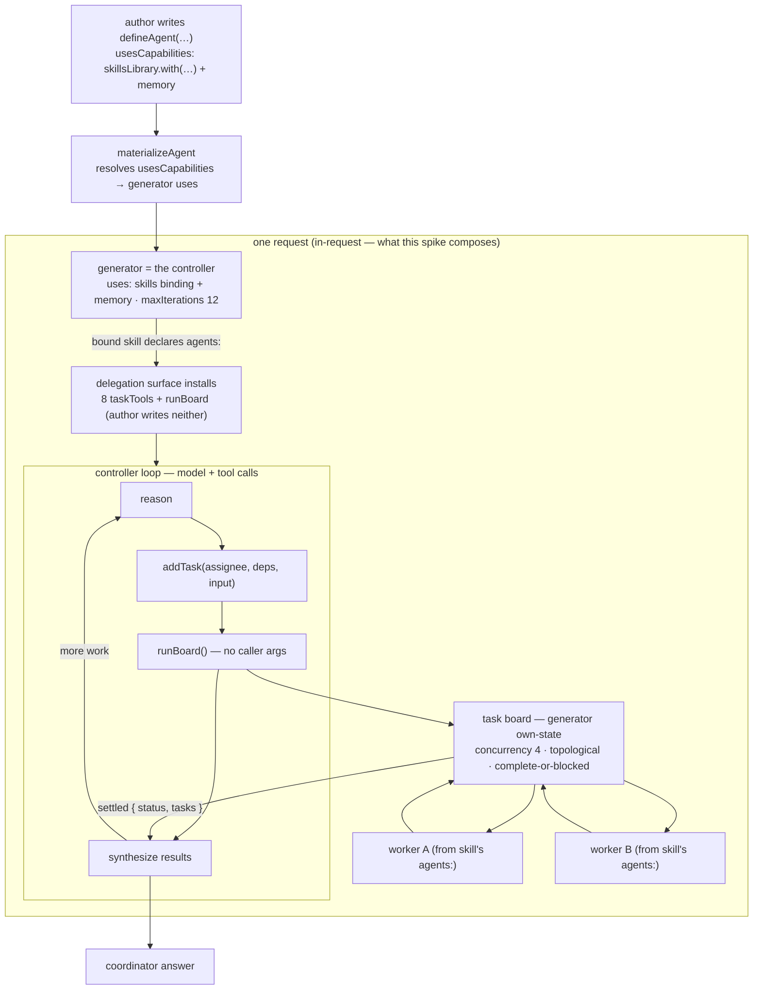
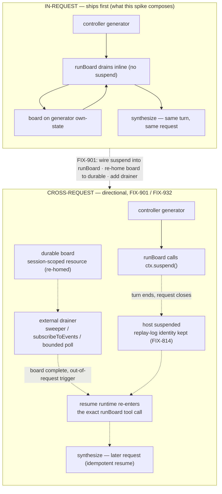

# FIX-929: Design — Agent vs. AgentController (wrap a generator with fuller agent-level capabilities) — Implementation Spec

> **This is a design / decision spike, like FIX-923.** Its deliverable is a decision
> — Agent-vs-AgentController, flat-vs-nested, the relationship to `defineAgent` and to
> capabilities, and the background-execution model — **not** a build. It ships no API.
> Part II below is **The Findings** (the grounded evidence behind Part I's decisions and
> the hand-off to the issues this feeds), not a build sequence.

## Part I — The Case *(for the human)*

### 1. Problem — why it matters, why now

A generator today is a model plus a tool loop. When we want an agent to do more than
"reason and call tools in one turn" — coordinate delegated work, auto-load a skill on a
deterministic cue, run work in the background and pick the results back up later, enforce
a lifecycle — the question is *where that machinery lives*. The FIX-918 delegation review
floated a bespoke `skillController` block to own board lifecycle outside the model's loop.
On reflection the real question is broader: **is the managed unit we deploy and delegate
to a new "Agent" primitive, a separate "AgentController" that has a generator, or just a
generator with the right capabilities composed around it?**

Why now: FIX-923 (the keystone host-model spike) has **landed** and decided *what* the
delegation host is (coordinator + synthesizer; on-demand as a default-worker floor). Two
coupled questions about *how the host is packaged and run* were deliberately left to this
spike (epic FIX-930 §2e, Q6): the Agent/AgentController shape, and whether delegated work
can run in the **background** via a controller loop rather than a standalone
event/listener/notification subsystem (FIX-901's current lean). Those calls gate how
FIX-901 is designed and how the host packaging reads, so they are worth settling before
that work proceeds. There is no user-facing gap open today — this decision prevents
building the wrong shape, it does not unblock a broken workflow.

### 2. Solution in plain terms — the recommendation

**There is no new primitive. The "agent controller" is a composition role, not an object
the author constructs.** Keep `defineAgent`'s `Agent` as the *spec* (persona, model,
tools, `usesCapabilities`). Everything the issue calls an "agent-level capability" splits
across two existing composition surfaces, neither a new primitive:
- **Capabilities** (delegation/board draining, memory, HITL gating) compose via
  **`usesCapabilities` on the `Agent`**, which `materializeAgent` resolves into the
  generator's `uses`.
- **Skills** (install / auto-load) do **not** ride the `Agent` — `materializeAgent`
  explicitly *ignores* `agent.usesSkills` (warns). They bind at the **generator** via
  `skillsLibrary.with(...)` in `uses` (as §5 shows). Part I therefore does not treat
  `Agent.usesSkills` as a real path, and downstream (FIX-901) must not build on it.

The managed unit is *the materialized generator plus the capabilities and skills bound
around it*. We do **not** add an `AgentController` wrapper, and we do **not** build a tower
of nesting decorators. **Flat, not nested.**

The one thing a capability genuinely *cannot* do by itself is **re-invoke the generator
across a gap** — a capability runs *inside* a loop iteration; it can `ctx.suspend()` to
pause, but the thing that *wakes* the generator is the runtime, not the capability. That
is the only "controller" in the picture. The **mechanism** for it already exists —
the framework's `ctx.suspend()` + resume runtime (FIX-814) re-enters the exact tool call
that suspended, by replay-log identity — so "host stays alive and synthesizes the board
inline" and "host ends its turn and is picked up when the board completes" are the *same
model* from the generator's point of view: a tool it called, returning on its next
iteration.

But that model is **not wired today, and the in-request wake primitive does not transfer
to it verbatim.** `runBoard` today drains inline (`taskBoard(...).drain` + settle) with
*no* `ctx.suspend()`, and `wakeOn` (FIX-660) is an **in-request** optimization — it
pre-filters `.waitForCondition`'s subscription to the *current request's* item stream, so
it wakes board **workers** inside an active request. It **cannot** wake a suspended or
closed **host** request. Cross-request host wake therefore needs a **second, durable or
external substrate** — a durability sweeper, a store `subscribeToEvents`, or a bounded
poll — that FIX-901 must build. So background execution reuses the *suspend/resume model*
the framework already owns rather than a new notification subsystem, but making it real is
FIX-901's build: (a) migrate the host board's backing from generator own-state sequencer
to a durable resource, (b) wire `ctx.suspend()` into `runBoard`, and (c) build the
external drainer that resumes the host. That is the direction FIX-901 should take.

**The philosophy that led here.** This leans hardest on **tenet 2 (composition over
features)** — the controller is a composition of primitives that already exist, and a new
`Agent`/`AgentController` primitive would fracture the model `defineAgent`, capabilities,
and the task board already establish. **Tenet 3 (earn every addition)**: the default
answer to "should an `AgentController` exist?" is no, and nothing here clears that bar
that `uses` + the skills binding + the drain don't already clear. **Tenet 4 (framework
absorbs infrastructure, not knowledge)**: the suspend/resume *model* is infrastructure the
framework already owns — the recommendation points FIX-901 at extending that substrate
(a durable board + an external drainer) instead of standing up a parallel notification bus.

### 3. Tradeoffs & alternatives

- **Rejected — a new `Agent` primitive that owns the generator (generator as an
  implementation detail of an Agent).** This duplicates `defineAgent` (which already *is*
  the agent spec) and demotes the generator from a first-class block to a hidden internal.
  Every flow that composes a generator directly would gain a second, competing "how do I
  run a model" path. Rejected on tenets 2 and 3.
- **Rejected — nesting controllers (composable decorators, one capability each) wrapping a
  generator.** This is the "controller-tower" the issue itself flags as hard to reason
  about. We already have a flat composition surface — `uses: [cap, cap, …]` — that adds
  around-the-loop behavior without nesting. A decorator stack would reinvent `uses` with
  worse ergonomics and unclear ordering semantics. Rejected on tenet 2.
- **The simpler approach — "do nothing; it's all capabilities already."** This is close to
  correct and is most of the recommendation. Where it is *insufficient* is the background
  loop: a capability cannot re-invoke its own generator across a cross-request gap, so
  *true* background drain (FIX-901) needs the host board **re-homed** onto a durable
  resource (today it is generator own-state sequencer backing) plus an external drainer
  that resumes the suspended host. That piece is real work — but it extends the existing
  suspend/resume runtime, it is not a new controller primitive.
- **Where the genuine complexity is** — not the happy path (in-request drain works today).
  It is **state continuity across a cross-request gap.** A *history-driven* host is
  transparent for free (the history *is* the state; reseeding it can't tell it ever
  stopped). A *stateful* host that keeps its own block-state across the gap loses that
  state unless it is durably checkpointed — a real, conditional dependency on FIX-917
  Part-2 (durable block-state). Today non-sequencer block state is in-memory only (suspend
  stamps sequencer state, not arbitrary block state), so a suspended own-block-state host
  **silently loses** it — no warning fires. Naming that boundary correctly is the
  load-bearing part of this spike.

### 4. Focus practices (1–3)

1. **Compose, don't accrete (tenet 2).** The controller must be expressed as
   `Agent` (spec) + `uses` (capabilities) + the drain, reusing `materializeAgent`. Resist
   any new `AgentController` type or block kind — if a reviewer can point at a capability
   or the skills binding that already covers a concern, that concern is not new surface.
2. **Reuse the existing suspend/resume model, don't build a bus (tenet 4).** The
   background wake extends `ctx.suspend()` + the resume runtime — which already re-enters
   the exact suspending tool call by replay-log identity. FIX-901 wires `ctx.suspend()`
   into `runBoard` and adds the durable-board + external-drainer substrate that carries the
   wake across a closed request; it does **not** stand up a parallel notification
   subsystem. Do not claim the in-request `wakeOn` primitive transfers verbatim — it does
   not reach a suspended host (see §8).
3. **Name the durable-state boundary honestly (BP-030 / BP-035).** History-driven host =
   free across the gap; own-block-state host = needs FIX-917 Part-2. State the conditional
   dependency; do not hand-wave it into "not a dependency."

### 5. What using it looks like

This spike ships **no new API**. The recommendation is that *the surface a delegating
author already writes does not change* — the "controller" is a composition they can already
express, not an `AgentController` object they construct. To make that legible, here is the
whole "agent controller" as the two forms an author actually writes today, each piece marked
**exists** or **directional (FIX-901)**. This is read against the current tree
(`define-agent.ts`, `materialize-agent.ts`, `skills/delegation-surface.ts`), not invented.

**Form A — as a `defineAgent` spec.** `defineAgent` returns an `Agent` (persona + model +
capabilities); `materializeAgent` turns it into the generator. The load-bearing fact: the
skills binding is *itself a capability* — `skillsLibrary.with(...)` returns a
`DefinedCapability` — so it rides **`usesCapabilities`** alongside memory. It does **not**
use the dead `usesSkills` field (a `string[]` of skill names, warn-only in
`materialize-agent.ts`). Skills-as-a-capability and the unwired `usesSkills` field are two
different things; the composition uses the former.

```ts
// The "agent controller" as a spec. No new type — this IS defineAgent today.
const coordinator = defineAgent({
  name: "coordinator",
  description: "Plans delegated work and synthesizes the results.", // required field
  persona: "Plan the work with addTask, run it with runBoard, then write the report.",
  model: "intent/chat",
  usesCapabilities: [
    // EXISTS — the skills binding is a capability ref, so it composes here. A bound
    // skill that declares `agents:` is what turns the delegation surface on.
    skillsLibrary.with({ active: ["coordinate-research"] } satisfies SkillsBindingConfig),
    memory, // EXISTS — any around-the-loop capability composes the same way.
  ],
  // NOT usesSkills: [...] — reserved-and-unwired (warn-only). Skills ride usesCapabilities.
});
```

`materializeAgent(coordinator, …)` resolves `usesCapabilities` into the generator's `uses`
and returns, verbatim (`materialize-agent.ts:146-165`):

```ts
generator({
  name: "agent_coordinator",
  model: "intent/chat",
  itemVisibility: { client: true, history: false }, // agent default
  uses: [ /* skillsLibrary.with(...), memory — resolved from usesCapabilities */ ],
  maxIterations: 12, // fixed by materializeAgent
  prompt: /* persona */, user: (input) => input.goal,
});
```

What makes this a *controller* is the delegation surface, and the author writes none of it
by hand: when a bound skill declares `agents:`, the skills binding installs the **eight
`taskTools`** (the board ledger — `addTask` with `assignee`/`deps`/`input`) **and
`runBoard`** onto the generator (`delegation-surface.ts:441-444`). `runBoard` takes **no
caller arguments** (`inputSchema: z.object({})`) — the model has already populated the board
with `addTask`; `runBoard` drains it (concurrency 4, topological, complete-or-blocked) and
returns `{ status: "drained" | "blocked", tasks }`. That drain **is** the controller loop —
inline, today.

**One honest seam.** `materializeAgent` sets **no `history`**. So a `defineAgent`-materialized
host is *not* history-driven — it carries its board on the generator's own state (the
delegation board lives at `DELEGATION_BOARD_FIELD`, `backing: "sequencer"`). The
"history-driven host is free across the gap" case in §3 / Decision 3 is the **hand-written
generator** form below, where the author sets `history: true` explicitly. `defineAgent` has
no way to express that. The two forms differ in exactly the dimension the background
decision (Decision 2/3) turns on — worth naming, not papering over.

**Form B — as a hand-written generator**, when you want `history: true` (a user-facing
coordinator that reseeds itself from the conversation):

```ts
generator({
  name: "coordinator",
  model: "intent/chat",
  history: true, // EXISTS on generator; NOT expressible via defineAgent
  // A deterministic /skill-name cue is an activation matcher on this binding
  // (createSkillActivator, FIX-421), not a controller. The matcher runs BEFORE the
  // generator and cannot reach generator block state, so deterministic activation needs an
  // explicit `activeState` field the matcher writes and this binding reads — `active[]` /
  // own block state alone can't see the matcher's writes.
  uses: [
    skillsLibrary.with({
      allowed: ["research", "summarize"],
      activeState: { scope: "session", field: "activeSkills" },
    } satisfies SkillsBindingConfig),
    memory /* cross-turn capability */,
  ],
  prompt: "Plan with addTask, run with runBoard, surface the report.",
});
```

> **Not** `defineAgent({ usesSkills: [...] })`: that hook is reserved-and-unwired
> (warn-only, `materialize-agent.ts`). Skills bind at the generator, as above.
>
> The matcher (`createSkillActivator`) and this generator binding must name the **same**
> `activeState` field, so FIX-901/FIX-932 don't wire a matcher that writes session state
> the generator never renders.

Both forms produce the same controller shape: a generator whose `uses` carries the skills
binding, which installs `addTask` + `runBoard`, which drains the board inline. **No wrapper,
no new primitive.** The composition, end to end:



The **background** difference is one behavioral choice inside `runBoard` — synthesize inline
(today) vs. end the turn and be woken when the board completes — plus the durable board and
external drainer that wake a suspended host. That choice is **FIX-901's** to build, and it is
the two-regime boundary walked through and diagrammed in §6.

### 6. Cross-request wake: the two regimes

Cross-request wake keeps coming up in this spike, so it is worth building the mental model
before the sign-off decisions lean on it. Start from what a request *is* today, then find
where that model stops being enough.

**The regime you already have — everything inside one request.** A request arrives. The
controller generator runs its loop: it reasons, calls tools, and (via `runBoard`) delegates
tasks to a board and drains them — workers run, their outputs settle back, the controller
synthesizes a reply. The reply streams out, the request ends. The whole lifecycle — plan,
delegate, drain, synthesize — lived and died inside that one request's execution. This is
the model most of the framework is built around, and it is the model this spike composes.

**Where it stops being enough — work that outlives the request.** Delegated board tasks do
not have to finish within the request that created them. A sub-agent task can still be
running, or *suspended* waiting on a model turn or an external event (a webhook, a human
approval, a slow tool), at the moment the originating request completes. The board itself
is durable — it is persisted, so the record of "these tasks exist, here is their status"
survives. But the thing that was *advancing* the board — the controller's drain loop — was
in-request. When the request ends, that loop is gone. Nothing re-enters to push the
unfinished tasks forward, collect their results, or let the controller synthesize over them.
The work is durable; the *driver* was not.

**Cross-request wake, precisely.** Cross-request wake is re-entering that drain loop on a
*later* request (or a scheduled tick), reconstituting the controller's state from durable
storage, advancing the board from wherever it was left, and surfacing the results into the
session/stream — even though no single request ever spanned the whole lifecycle. The
controller "wakes up," picks up a board it did not start in this request, and carries it
further.

**What that additionally requires — beyond in-request drain.** In-request drain needs only
the board and a loop. Waking across requests needs four more things:

- **Durable controller state** — enough of the controller to reconstitute it later.
  History-driven hosts get this for free (the transcript *is* the state); own-block-state
  hosts need it checkpointed (the FIX-917 Part-2 dependency, Decision 3).
- **An out-of-request trigger** — something that fires when no request is in flight: a
  durability sweeper, a store `subscribeToEvents`, or a bounded poll. `wakeOn` is *not* this
  — it is an in-request filter (§8) that cannot reach a controller whose request has closed.
- **Idempotent re-entry** — safe to fire twice. If two triggers both try to resume the same
  host, one must win (a 409 on concurrent resume), and a re-run over already-settled tasks
  must be a no-op that reconciles from board state rather than replaying.
- **Surfacing into a possibly-disconnected session** — the client that made the original
  request may be gone. Results land on the durable session/stream *by sequence number*, to be
  picked up on reconnect, not pushed to a live socket.

**The boundary this spike draws (explicit non-goal).** FIX-929 composes the **in-request**
regime only: `defineAgent` + capabilities + the generator-bound skills binding + an inline
`runBoard` drain, all inside one request. **Cross-request wake is an explicit non-goal of this
spike.** Both primitives it would need are missing today — `wakeOn` is in-request-only, and
`runBoard` has no `ctx.suspend()` — so genuine cross-request drain requires a *second, durable
substrate* this decision does not build. It is solved downstream: **FIX-901** (reframed as the
cross-request drainer: durable board + out-of-request trigger + idempotent resume) and
**FIX-932** (the authoring guide for how a coordinator picks results back up). This section
exists so the boundary is understood, not crossed by accident.

**Before / after — the same agent, two regimes.** The composition an author writes today (§5)
is the *before*: it drains inside one request. The *after* is **directional** — the eventual
cross-request shape once FIX-901/FIX-932 land, not a locked API — but it makes the difference
concrete: where durable state loads and persists, where an out-of-request trigger resumes the
drain, and how results surface back into the session.

```ts
// BEFORE — in-request (what this spike composes, today). One request, start to finish:
// the controller drains the board inline and synthesizes before the request ends.
generator({
  name: "coordinator",
  model: "intent/chat",
  history: true,
  uses: [skillsLibrary.with({ allowed: ["research", "summarize"] }), memory],
  prompt: "Plan with addTask, run it with runBoard, surface the report.",
});
// runBoard() blocks the loop until the board settles, then returns inline. If a task is
// still suspended when the request ends, nothing re-enters to finish it.
```

```ts
// AFTER — cross-request (DIRECTIONAL sketch — the FIX-901/FIX-932 shape, NOT a locked API).
// The agent spec is UNCHANGED from BEFORE. The whole difference is how runBoard drains and
// who re-enters it after the request ends.

// (1) The board is re-homed onto a DURABLE, session-scoped collection — not the generator's
//     own block-state — so the board AND the controller's suspend checkpoint survive the
//     request ending.
const board = defineTaskCollection({ scope: "session", name: "coordinator-board" });

// (2) In background mode, runBoard no longer blocks to settlement: if tasks are still
//     unresolved, the controller ctx.suspend()s ON the runBoard tool call and the request
//     ends. Nothing is lost — the suspend point is durable, keyed by replay-log identity.

// (3) An OUT-OF-REQUEST DRAINER (FIX-901) advances the board when no request is in flight —
//     a durability sweeper / store subscribeToEvents / bounded poll — and, on progress,
//     resumes the suspended controller:
async function onBoardSettled(sessionId) {          // fired by the drainer, NOT by a request
  await withResumeLease(sessionId, async () => {    // idempotent: 409 if already resuming
    // Reconstitute controller state from durable storage, re-enter the EXACT runBoard call
    // (replay-log identity), inject the settled tasks as its return value, let it synthesize:
    await resumeSuspendedHost(sessionId);
    // The reply is written to the DURABLE session/stream by sequence number — the original
    // client may be disconnected and picks the results up on reconnect. No live socket needed.
  });
}
```

**The two regimes, visually.** Solid = ships today, dashed = FIX-901's directional build. The
load-bearing line is the request boundary: in-request drains and synthesizes in one turn;
cross-request ends the turn at `ctx.suspend()` and is re-entered later at the *same* `runBoard`
tool call. From the generator's point of view they are the same model — a tool returning on its
next iteration.



### 7. Decisions & rules — the sign-off surface

1. **No new primitive: the "agent controller" is `Agent` (spec) + capabilities (`uses`) +
   the skills binding + the drain — flat, not nested.** Capabilities compose via
   `usesCapabilities` on the `Agent`, which `materializeAgent` resolves into the generator's
   `uses`. The **skills binding and the `runBoard` drain do NOT go through `materializeAgent`**
   — they wire at the **generator** (generator `uses: [skillsLibrary.with(...)]` + the
   delegation surface, per Decision 4). `materializeAgent` only resolves `usesCapabilities`
   and warns/ignores `Agent.usesSkills` (`materialize-agent.ts`), so FIX-901 must keep
   skill/drain wiring at the generator, not put it in workforce.
   - *Alternative rejected:* a new `Agent`/`AgentController` type that owns the generator,
     or a stack of nesting per-capability decorators.
   - *Ramification:* around-the-loop concerns are added as capabilities, not wrapper
     layers; `defineAgent` stays the single agent spec. Locks out a second "how to run a
     model" path. *Falsifier:* a concern that genuinely cannot be a capability *and* cannot
     be the runtime loop would justify a thin wrapper — name it then, not now.
2. **Background execution reuses the suspend/resume *model*; making it cross-request is
   FIX-901's build (in-request drain ships first).** The model is `ctx.suspend()` + the
   resume runtime (FIX-814/FIX-141) re-entering the exact suspending tool call — so
   in-request (synthesize inline) and cross-request (end-and-be-woken) look the *same* from
   the generator: a tool returning on its next iteration. But this is **not today's shipped
   behavior**: `runBoard` drains inline with no `ctx.suspend()`, and `wakeOn` (FIX-660) is
   an in-request filter that cannot wake a suspended host. So FIX-901 must (a) re-home the
   host board from generator own-state sequencer onto a durable resource, (b) wire
   `ctx.suspend()` into `runBoard`, and (c) build an **external drainer** (a durability
   sweeper / store `subscribeToEvents` / bounded poll) that resumes the suspended host —
   *not* a parallel notification/event/listener subsystem.
   - **Precondition FIX-901 must enforce — a step-capable model for background hosts.**
     In-loop `ctx.suspend()` only works when the resolved model has the FSD-owned step loop
     (`generateStep`/`streamStep`); legacy/fallback/custom-adapter resolvers keep the SDK
     loop and **cannot suspend in-loop** (`execution-and-errors.md:44`). Since `Agent.model`
     is configurable, FIX-901 must **require a step-capable model for background hosts, or
     provide a fail-loud path** — otherwise an agent on an older/custom/fallback resolver
     won't pause/resume as promised. (Named here as a precondition; FIX-901 enforces it.)
   - *Alternative rejected:* treating "background execution" as a distinct runtime to design
     from scratch — or, conversely, claiming the in-request `wakeOn` loop transfers verbatim.
   - *Ramification:* the host packaging commits to *nothing that blocks either* in-request or
     cross-request; FIX-901 owns the durable board + external drainer. *Falsifier (kept):* if
     resume cannot re-enter a generator tool after a cross-request gap without replaying model
     turns, end-and-reseed needs new machinery — code today says it can (replay-log identity
     survives, FIX-814).
3. **State continuity: history-driven hosts are transparent across the gap for free;
   own-block-state hosts are a *conditional* dependency on FIX-917 Part-2 (durable
   block-state).** Durable state for a woken host lives at **controller/session scope** (the
   durable board), **not** block scope — so the common history-driven case is **not** blocked
   on FIX-917.
   - *Alternative rejected:* declaring a hard FIX-917 dependency for all hosts, or claiming
     no dependency at all.
   - *Ramification:* the first background pass targets history-driven hosts; own-block-state
     hosts wait on FIX-917 Part-2. The exact holding mechanism (block-state-at-agent-level
     vs. a session resource) is deferred but must support either.
4. **Skill install/auto-load is the existing generator-level skills binding, not new
   controller machinery — but `Agent.usesSkills` is a separate, unwired hook.** Two layers,
   kept distinct: (a) the *machinery exists* — a skill binds at the generator via
   `skillsLibrary.with(...)` (`uses`), and its `active` / `dynamicActivation` / load-tool /
   upstream-matcher activation paths are in `library.ts`; a deterministic `/skill-name` cue
   is an activation matcher (`createSkillActivator`, FIX-421), not a new mechanism. (b) The
   `Agent.usesSkills` field on `defineAgent` is **reserved-and-unwired** (warn-only in
   `materialize-agent.ts`) → a follow-up to wire or remove, not something this spike relies on.
   - *Alternative rejected:* a bespoke skill-install path inside a controller wrapper.
   - *Ramification:* auto-load rides the generator binding every generator already carries.
     *Falsifier:* if deterministic pre-generation activation can't hook the existing binding
     via `createSkillActivator`, a small activation-matcher addition is warranted (still a
     capability, not a wrapper).

> **Footnote — cap budgets across wakes (for FIX-931 / FIX-933, not decided here).** A
> background host that wakes repeatedly must not silently refresh its enqueue (FIX-931) /
> spend (FIX-933) budget each wake. The natural home for a cumulative budget is the
> **session-scoped durable board** FIX-901 introduces; `max-turns`-style per-run counters
> resetting per wake is a separate question. Whether budgets accumulate or reset is
> **FIX-931/933's** call — this spike only points them at the durable board as the budget's
> home.

**Non-goals.** Not building the controller, FIX-901's drainer, or any API (this is a
decision doc). Not a general agent-abstraction redesign — the wider agent-abstraction /
roster-introspection question stays in **FIX-817, out of this epic**. Not deciding the exact
durable-state holding mechanism (deferred; must support either).

**Size estimate.** Design/decision spike — **no code, no PR plan.** Deliverable is this
document (mirrored to Linear), like FIX-923. The *downstream* build it authorizes (chiefly
FIX-901) is separately estimated at its own spec.

---

## Part II — The Findings *(grounded analysis + hand-off to the issues this feeds)*

> Dense on purpose: the evidence behind Part I's decisions, read against the current tree,
> plus the concrete hand-off to FIX-901 / FIX-641 / FIX-931 / FIX-933 / FIX-817.

### 8. Current behavior — verified against the code

Every claim was read in the current tree, not taken from the issue on faith.

- **`defineAgent` already *is* the agent spec.** `defineAgent(config: Agent)` validates and
  returns an `Agent` (name, `description`, `persona`, `model`, `allowedTools`,
  `usesCapabilities`, `usesSkills`, `itemVisibility`, `outputSchema`, `contextMode`) —
  `packages/workforce/src/define-agent.ts`, type in `packages/core/src/types/agent.ts`.
  → confirms Decision 1: the "spec" half the issue asks about already exists. Note it carries
  **no `history` field** — a materialized agent is not history-driven (see §5's honest seam).
- **`materializeAgent` already composes capabilities *around* a generator.** It builds a
  `generator({ … tools, uses, maxIterations })` from an `Agent`, resolving `usesCapabilities`
  into `uses` and folding in board-scoped `taskTools`
  (`packages/workforce/src/materialize-agent.ts`). `agentBlock` is the standalone wrapper;
  the worker shape is the same machinery with a `workerInputSchema`. → confirms Decision 1:
  around-the-loop capabilities are *already* `uses`, materialized flat. Note two live
  reserved-but-unwired hooks the warnings expose: `usesSkills` ("reserved and not yet
  wired") and `contextMode: "fork"` ("not honored") — the skill-install and fork concerns
  the issue names are *already anticipated slots on the spec*, not missing primitives.
- **`runBoard` drains *inline* today — no `ctx.suspend()`.** The delegation surface installs
  `taskTools` + `runBoard` (a `taskBoard(...).drain` over the generator's own-state board)
  only when a bound skill declares `agents:` (`delegation-surface.ts`, `library.ts:394-408`).
  The drain settles inside the calling loop iteration and returns — it does **not** suspend.
  → grounds Decision 2's accuracy caveat: background execution is the *same model once
  wired*, not shipped behavior; FIX-901 wires suspend and re-homes the board.
- **Generator suspend/resume re-enters the exact tool call (the model behind background).**
  A tool that calls `ctx.suspend()` throws `SuspensionError`; siblings settle, one gate
  surfaces, and on resume the runtime re-enters the *same* tool call by replay-log identity —
  `completed` calls inject persisted output, the pending gate's `ctx.suspend()` returns the
  resume payload (FIX-814, `generator.ts:1293,1490-1500`; resume runtime FIX-141).
  → satisfies Decision 2's falsifier: cross-request re-entry needs no new re-entry machinery.
- **`wakeOn` (FIX-660) is IN-REQUEST only — it does not reach a suspended host.** It is a
  synchronous per-event filter on `.waitForCondition`'s subscription to the *current
  request's* item stream (`task-board/index.ts:661`; the sequencer is request-scoped per
  `apps/docs/docs/sequencers/wait-for-condition.md`). It wakes board **workers** inside an
  active request. It **cannot** wake a suspended/closed **host** request. → grounds Decision
  2's correction: cross-request host wake needs a *second, durable/external* substrate
  (sweeper / store `subscribeToEvents` / bounded poll), which FIX-901 must build.
- **`defineTaskCollection` exists but is NOT today's host-board backing.** It yields a
  durable, resource-backed `TaskCollection` surviving across turns
  (`tasks/collection/define-task-collection.ts`) — but delegation today backs `runBoard` on
  the generator's **own-state sequencer** (`delegation-surface.ts:~376`), not this. → grounds
  Decision 2: FIX-901 must **re-home** the host board onto a durable resource, not reuse an
  existing durable backing.
- **The generator skills binding already owns install / activation.** `.with({ active })`
  preloads skill bodies; `.with({ allowed, dynamicActivation: true })` installs a load tool;
  a deterministic up-front `/skill-name` cue is `createSkillActivator` (FIX-421)
  (`library.ts:6-29,323-355`; `skills/skill-activator.ts`). Separately, `Agent.usesSkills`
  on `defineAgent` is **reserved-and-unwired** (warn-only, `materialize-agent.ts:119-122`).
  → grounds Decision 4's two-layer split: machinery on the generator vs. unwired Agent hook.
- **The background *drainer* is the genuine gap.** FIX-901 states plainly that persistence
  and scheduled actions exist but "nothing turns 'there is durable work' into 'workers are
  draining it in the background'"; a failed request is only picked up "when a next request
  happens to come." → confirms cross-request true-background is the one real build, FIX-901's.

### 9. Prior art — the packaging question, cited

- **Anthropic, "Building Effective Agents"** ([post](https://www.anthropic.com/research/building-effective-agents)):
  orchestrator-workers is a *composition* ("a central LLM dynamically breaks down tasks,
  delegates them to worker LLMs, and synthesizes"), and the guidance is explicit — *start
  simple, add structure only when it earns its place.* A controller primitive is exactly the
  structure to defer until composition fails, which it does not here. → Decision 1.
- **Durable-execution engines (Temporal-style suspend/resume)**: "background work that pauses
  and continues" is a property of a *durable execution + resume* substrate, not a bespoke
  notification bus. FSD owns the resume *model* (`ctx.suspend()` + resume runtime); FIX-901
  extends it with a durable board + drainer rather than a message-bus beside it. → Decision 2.
- **Counter-signal (why a wrapper *can* be right)**: OpenAI Agents-SDK and LangGraph both ship
  an explicit orchestrator object — justified when it owns runtime state a plain function
  can't. In FSD that state is exactly the *cross-request wake*, which lives in the
  runtime/drainer (FIX-901), not a user-constructed `AgentController`.

### 10. How the recommendation maps to each downstream issue

| Issue | What this spike hands it |
| -- | -- |
| **FIX-901** (background work pool) | **Reframe from "event/listener/notification subsystem" to "extend the suspend/resume model with a durable board + an external drainer."** `wakeOn` is in-request only and does **not** reach a suspended host (§8), so the build is: (a) **re-home** the host board from generator own-state sequencer onto a durable session-scoped resource (`defineTaskCollection`); (b) wire `ctx.suspend()` into `runBoard`; (c) an external drainer (durability sweeper / store `subscribeToEvents` / bounded poll) that resumes the suspended host on board-complete via the existing resume runtime. No new bus. Its *shape* is decided; its viability rests on the suspend/resume re-entry proven in §8. |
| **FIX-641** (class+identity) | Unaffected by this packaging call — it aligns to 923's decided default-worker floor. No dependency on 929. |
| **FIX-924** (validateAssignee) | Unaffected — mode-based rule already decided by 923. |
| **FIX-931** (enqueue cap) / **FIX-933** (spend cap) | The **session-scoped durable board** (FIX-901) is the natural home for a cumulative budget across host wakes. Whether budgets accumulate or reset per wake is **FIX-931/933's** call, not decided here (see the §7 footnote). |
| **FIX-917** (durable block-state) | **Conditional dependency for own-block-state hosts only.** History-driven hosts don't need it. Part-2 durable block-state is the prerequisite for a host that keeps own block-state across a cross-request wake — today non-sequencer block state is in-memory only, so a suspend loses it silently (no warning exists; suspend only stamps sequencer state). |
| **FIX-817** (agent/roster introspection) | **Out of this epic and out of this spike.** The wider agent-abstraction / "what can I compose" surface stays there; 929 is bounded to the delegation host + skill-controller role. |

### 11. Edge cases the downstream builds must handle

| Case | Expected behavior |
| -- | -- |
| History-driven host, cross-request wake | Transparent: reseed history; the host cannot tell it stopped. No FIX-917 dependency. |
| Own-block-state host, cross-request wake | Own block-state is in-memory only, so a cross-request suspend **silently loses it** — no warning exists today (suspend only stamps sequencer state). Durability is the FIX-917 Part-2 conditional dependency (Decision 3); until it lands, own-block-state hosts can't survive the gap. |
| Host wakes repeatedly (runaway) | Cumulative budget belongs on the durable session-scoped board so a repeated wake can't silently refresh it; the accumulate-vs-reset policy is **FIX-931/933's** (§7 footnote). |
| In-request drain (no background) | Today's behavior preserved: `runBoard` synthesizes inline; no suspend, no durable board required. |
| Partial completion / task ordering on wake | **Wake granularity (per-completion vs. once-all-done) is an undecided FIX-901 policy, not a knob 929 ships** — today's `runBoard` takes no caller args (`inputSchema: z.object({})`, fixed board options), so this spike adds no wake-timing config (see §6). Whichever cadence FIX-901 picks, the durable board is the source of truth for which tasks settled, so a re-entered host reconciles from board state, not from in-memory turn state. |
| Cross-process / external drainer | Out of scope for the first pass (Decision 2): single-node drainer first; multi-process leasing/transport signal is a later deployment concern (Vercel adapter), not a new user primitive. |

### 12. Documentation plan

**No end-user docs change from *this* spike** — it ships no API. Docs land with the surface:
FIX-901 documents the background-drain model (durable board + external drainer) when it ships;
FIX-932 (delegation authoring guide) is the home for "how a coordinator delegates and picks
results back up," including the background variant once FIX-901 lands.

### 13. Dependencies, open questions & follow-ups

**Dependencies.** This spike has **no hard blockers** (it is a decision). It **informs**
FIX-901 (whose design commitment should wait for it) and reframes the epic's Q6. It does
**not** block FIX-641 / FIX-924 / FIX-931.

**Open questions for the human (do not block the decision):**
- **Sequencing (epic Q6) — the human's call, not a decision here.** Recommended: land 929
  now, FIX-901 builds against it, and the floor/identity/cap work (FIX-641/924/931) proceeds
  in parallel — 929 should **not** hard-block the dependent build, since those builds align to
  923's decided floor, not to this packaging call. The only thing that must wait for 929 is
  FIX-901's design commitment. Whether 929 must precede, run alongside, or follow the
  dependent work is the human's to sequence.
- **Durable-state holding mechanism** for a woken host: block-state-at-agent-level vs. a
  session resource. Deferred; whatever FIX-901 lands must support either (Decision 3).

**Follow-ups (flagged, not built):**
- **Deepening opportunity — retire the reserved-but-unwired `Agent` hooks.** `usesSkills`
  ("reserved and not yet wired") and `contextMode: "fork"` ("not honored") in
  `materialize-agent.ts` are warn-only placeholders. When skill auto-load (Decision 4) and
  fork-like context supply (FIX-920) land, these should be *wired or removed*, not left as
  permanent warnings (tenet 3, subtract-as-you-go). Follow up via `improve-codebase-architecture`.
- **Already-rejected direction.** A new `Agent`/`AgentController` primitive and a nesting
  decorator tower are rejected here (Decision 1); record rather than re-litigate if they
  resurface.

---

## Spec evolution

- **Spec drafted** — framed FIX-929 as the packaging/decision spike it is (not a build);
  recommended **no new primitive** — the "agent controller" is `Agent` + capabilities
  (`uses`) + the skills binding + the drain, flat not nested; grounded the background loop in
  the *existing* suspend/resume (FIX-814) + `wakeOn` (FIX-660) + durable `defineTaskCollection`
  substrate read in-tree; resolved epic Q6 toward a controller-loop over a new
  event/listener subsystem and reframed FIX-901 accordingly; named the FIX-917 Part-2
  dependency as conditional (own-block-state hosts only) and recommended 929 not hard-block
  the dependent build.
- **After spec review** — sharpened mechanism-chosen vs FIX-901-work-remaining (wakeOn is in-request only; runBoard has no suspend yet; board re-home), fixed the usesSkills sketch, and trimmed the spike (merged Decisions 2–4, deferred cap/sequencing policy), because two reviewers flagged over-delivery + accuracy.
- **After second review pass** — split the Part-I recommendation so capabilities compose via `usesCapabilities` on the `Agent` while skills bind at the *generator* (`materializeAgent` ignores `Agent.usesSkills`), so downstream can't build on the unwired hook; and removed the nonexistent "suspend-reset warning" — non-sequencer block state is in-memory only, so a suspended own-block-state host silently loses it (FIX-917 Part-2 is the durability dependency), per two more Codex accuracy nits.
- **After spec review (final accuracy pass)** — matched the sign-off rule to Decision 4 (skills/drain wire at the generator, not materializeAgent), showed the explicit activeState for slash activation, and named the step-capable-model precondition for suspend as FIX-901's to enforce.
- **After owner request (cross-request on-ramp)** — added a pedagogical §6 "Cross-request wake: the two regimes" (the two regimes, what wake precisely means, what it additionally requires, and cross-request as an explicit non-goal solved by FIX-901/FIX-932) with a BEFORE/AFTER code pair (in-request drain today vs. a directional cross-request sketch); renumbered the following sections; and rephrased the §11 "partial completion" edge case away from an invented "per `runBoard` config" into an undecided FIX-901 wake-granularity policy (runBoard takes no caller args), anchored to §6.
- **Made the recommendation legible (spec owner)** — replaced §5's single abstract sketch with the concrete "agent controller" as an author writes it: a grounded `defineAgent({ … usesCapabilities: [skillsLibrary.with(…), memory] })` block, what `materializeAgent` produces from it, and the hand-written-generator form; clarified the load-bearing point that the skills binding rides `usesCapabilities` *as a capability ref* (distinct from the dead `usesSkills` field), and named the honest seam that `materializeAgent` sets no `history` (so `defineAgent` hosts are not history-driven — Decision 3's free case is the hand-written form). Added two Mermaid diagrams: the in-request composition (§5) and the in-request-vs-cross-request two-regime boundary (§6). Corrected §7's `Agent` field list (added `description`/`contextMode`, noted no `history` field).
