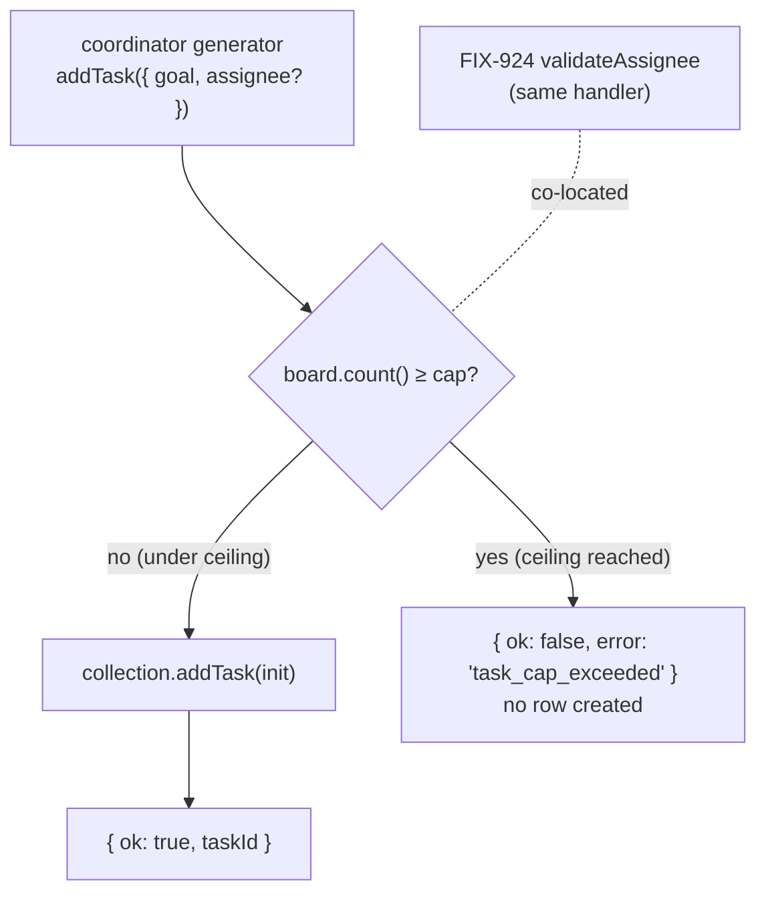

# FIX-931: Over-spawning guard — cap total enqueued tasks before on-demand spawning — Implementation Spec

> **Issue:** [FIX-931](https://linear.app/fixpoint-labs/issue/FIX-931/over-spawning-guard-cap-total-enqueued-tasks-before-on-demand) · **Epic:** [FIX-930](https://linear.app/fixpoint-labs/issue/FIX-930/delegation-substrate-host-model-roster-and-identity-and-worker-context) (Delegation substrate) · **Sequences after:** [FIX-940](https://linear.app/fixpoint-labs/issue/FIX-940/on-demand-default-worker-delegation-floor) (the on-demand default-worker floor) · **Same seam as:** [FIX-924](https://linear.app/fixpoint-labs/issue/FIX-924/roster-aware-task-assignment-manager-knows-its-workers-validate) (assignee validation)
>
> **Spec PR:** kept in sync with this document.
>
> **Necessity verdict:** Build as scoped (small). Neither existing `taskBoard` knob bounds enqueue breadth — `concurrency` paces the parallel drain, `maxIterations` is a per-worker loop-back circuit-breaker that trips *during* a drain. Nothing stops a coordinator from calling `addTask` 50 times in one planning pass. This adds one count check at the existing enqueue seam, co-located with FIX-924's assignee gate. A guard, not a subsystem.

---

## Part I — The Case

### 1. Problem — why it matters, why now

A coordinating agent plans work by adding tasks to its board, then draining the board to run them. Each task is an agent turn, and each agent turn costs tokens. Today nothing bounds how many tasks a coordinator can pile onto the board: it can add fifty in a single off-course planning step, and every one of them eventually runs. The board's `concurrency` setting only decides how many run *at once* — it paces the spend, it doesn't cap it.

**Why now:** FIX-940 makes rosterless delegation the cheap default. A coordinator can `addTask` to a worker that materializes on demand, with no roster to wire up first — so unbounded `addTask` breadth becomes the easy path, not the exception. Anthropic's own multi-agent research reported a lead agent spawning ~50 subagents for a trivial query, with multi-agent runs costing on the order of 15× a single chat. Once the floor lands, a single runaway planning step can silently balloon token spend far past what a human would sanction, with no guardrail catching it. FIX-931 is that guardrail.

### 2. Solution in plain terms

Give the delegation board a **ceiling on how many tasks it will ever accept**, enforced when a task is added. Once a board has accumulated that many tasks, the next `addTask` is refused with a clear message telling the coordinator it has hit its task ceiling and to work with what it already has. Everything under the ceiling behaves exactly as today.

The ceiling is **cumulative across the whole delegation lifecycle**, not a snapshot of what's currently pending. Draining tasks to completion does *not* refund the budget: a coordinator that adds tasks up to the cap, runs them, then tries to add more is still refused. That is deliberate — a runaway that re-triggers must not silently refresh its allowance. This falls out naturally from *where* the count comes from: the delegation board is an append-only record (tasks change status, they are never removed), so counting every task on the board — terminal ones included — is the lifetime enqueue count, for free.

**The philosophy that led here.** This leans on **tenet 3 (Earn every addition)**: no new config knob and no new counter — a constant default at the delegation surface (mirroring the existing `BOARD_CONCURRENCY` constant, "deliberate, not configurable until a consumer needs it"), and the count read from the board's existing `count()`. It leans on **tenet 2 (Composition over features)**: the guard is one check bolted to the enqueue seam that already exists (`addTask`), sharing that seam with FIX-924's assignee validation to form one coherent validation surface rather than two bolt-ons.

### 3. Tradeoffs & alternatives

* **Reuse an existing knob instead of adding a guard (rejected — it doesn't fit).** `concurrency` bounds parallel workers, not total tasks. `maxIterations` (default 10,000) is a per-worker loop-back circuit-breaker that bounds how many times *one worker's* loop re-runs mid-drain — it catches pathological enqueue *cycles* while the board is running, but a coordinator's up-front `addTask` breadth happens before any worker loops, so `maxIterations` never sees it. Neither covers enqueue-time breadth. This is FIX-923 Decision 6's deferred call, and the honest answer is: a new enqueue-time check is warranted.
* **Cap *pending* tasks instead of *total* (rejected — it refreshes the budget).** A `maxPendingTasks`-style snapshot cap (the issue's initial hint) bounds instantaneous breadth but resets as tasks drain: add-to-cap → run-to-completion → add-to-cap again, unbounded total. The epic's decided stance is that caps accumulate. Counting terminal tasks toward the ceiling is what makes it cumulative.
* **The simpler approach we *are* taking:** a plain integer compare against `count()` in the `addTask` handler. No new state, no board-config plumbing, no cost accounting. The count cap is the crude-but-cheap structural bound; the precise spend ceiling is FIX-933's separate job (see §6 non-goals).
* **Where the genuine complexity is:** not the check — it's getting the *semantics* right in one line. Counting all statuses (cumulative) vs. only pending (refreshable) is the whole ballgame, and it's invisible in the happy path. The regression test that fills the cap, drains it, and re-adds is the one that proves it.

### 4. Focus practices

* **Earn every addition (tenet 3).** A constant default (`DELEGATION_TASK_CAP`), not a config field — matches the `BOARD_CONCURRENCY` precedent. No new counter, no new board-config knob. If a consumer later needs it tunable, that's a follow-up, not this issue.
* **Compose at the existing seam (tenet 2).** Enforce in the `addTask` handler that already exists, reading the board's existing `count()`. Co-locate with FIX-924's `validateAssignee` so delegation has one validation surface.
* **BP-035 — walk the second path.** The load-bearing invariant is *cumulative, not instantaneous*: count every task on the board (terminal included), and the board persists across tool-loop steps and wakes. Test the drain-then-re-enqueue path explicitly — that's the one that fails if someone counts only `pending`.
* **BP-003 / tenet 7 — evidence.** Mocked CI proves the reject-at-cap and the cumulative (no-refund) semantics deterministically; a real-model goal check proves a runaway coordinator is actually bounded end-to-end.

### 5. What using it looks like

The cap is enforced automatically on any delegation board; there is no new API to call. The only observable change is the `addTask` result once the ceiling is reached.

```ts
// A coordinator (rosterless delegation: true, per FIX-940) fans out tasks.
await addTask({ goal: "part 1" }); // → { ok: true, taskId: "t_1" }
// ... up to the board's task ceiling ...
await addTask({ goal: "part 33" }); // → { ok: false, error: "task_cap_exceeded" }
//   message: board task ceiling (32) reached — run the tasks you have and
//   synthesize; do not add more.
```

**Cumulative — draining does not refund the budget.**

```ts
// Fill to the cap, then run everything to completion.
await runBoard(); // all tasks settle (completed)
await addTask({ goal: "one more" }); // → { ok: false, error: "task_cap_exceeded" }
//   completed tasks still count — the lifetime ceiling is not refreshed by draining.
```

### 6. Decisions & rules — the sign-off surface

1. **A delegation board caps the total number of tasks it will accept, enforced at `addTask` (enqueue time).** **← core sign-off point.**
   * *Alternative rejected:* rely on `concurrency` / `maxIterations` (neither bounds enqueue breadth); enforce at drain time (there is nothing to enforce at drain — the breadth is already committed by then).
   * *Ramification:* the guard lives at the enqueue seam in the delegation task-tools surface, next to FIX-924's assignee check. `runBoard` and the substrate `TaskCollection` are untouched.
2. **The cap is cumulative across the delegation lifecycle — it counts every task on the board, terminal tasks included, so draining does not refund the budget.** **← semantics sign-off point.**
   * *Alternative rejected:* cap only `pending`/non-terminal tasks (the issue's `maxPendingTasks` hint) — a runaway that drains then re-enqueues would silently get a fresh allowance.
   * *Ramification:* implemented by counting the board's full append-only record (`count()` unfiltered), which persists across tool-loop steps and wakes. A legitimate multi-pass replan consumes the same budget by design — that is the guard working, not a bug.
3. **On breach, reject the individual `addTask` with a clear, actionable soft error (`{ ok: false, error: "task_cap_exceeded" }`); do not throw and do not silently drop.**
   * *Alternative rejected:* throw (crashes the turn); halt/stop the whole board (that is FIX-933's spend-cap shape — heavier, needs cost accounting, and there is nothing running at enqueue time to halt).
   * *Ramification:* matches the task tools' existing `no_delegation_board` soft-error contract; the model reads the result and adapts. The message must clearly tell the model the ceiling is reached and to proceed with existing tasks.
4. **The ceiling is a constant default (`DELEGATION_TASK_CAP`, proposed `32`), not a config knob.** **← default-value sign-off point.**
   * *Alternative rejected:* a `taskBoard({ maxTotalTasks })` config field now (unearned until a consumer needs it); a much smaller number (starves legitimate decomposition).
   * *Ramification:* `32` gives headroom for real decomposition and a replan pass while sitting well under the ~50-subagent runaway. Mirrors `BOARD_CONCURRENCY`'s "constant until a consumer needs it" convention. Owner picks the number here; making it configurable is a flagged follow-up.

**Non-goals:** the on-demand floor itself (FIX-940); assignee/roster validation (FIX-924); a cost/token **spend** ceiling (FIX-933 — a distinct, narrower-vs-broader guard: this bounds *count*, that bounds *spend*); making the cap a configurable board knob; capping non-delegation task collections (patterns, blackboard) — the guard is scoped to model-driven delegation breadth.

**Size:** Small — one enforcement point in the delegation task-tools surface plus a constant, a docs note, and tests. Single PR, no PR plan.

---

## Part II — The Build Plan

### 7. Technical design

The enqueue seam is the model-facing `addTask` tool built in the delegation task-tools surface (`task-tools-capability.ts` → `buildTaskTools`). It resolves the live board collection and calls `collection.addTask(init)`. The guard is a count check in front of that call: if the board already holds `>= cap` tasks, return the soft error instead of creating a row.

The cap value is threaded from the delegation surface (a `DELEGATION_TASK_CAP` constant beside the existing `BOARD_CONCURRENCY`) into the task-tools builder, the same way the board resolver is threaded today. The count comes from the collection's existing `count()` (unfiltered = every task, all statuses). Because the delegation board is a `Record<taskId, Task>` on the host generator's own-state and tasks are only ever status-transitioned (never deleted), the unfiltered count *is* the cumulative lifetime enqueue count — no separate counter field is introduced.

Only `addTask` creates tasks; `assignTask`/`updateTask` mutate existing rows and need no guard. The substrate `TaskCollection` (`sequencer-backed.ts`) is left unchanged so patterns and the blackboard that legitimately create many tasks are unaffected — the ceiling is a delegation-surface policy, not a collection invariant.



*Illustrative (a sketch, not the contract) — the guard in the `addTask` execute, ahead of the create:*

```ts
const collection = await resolve(ctx);
if (!collection) return noBoardError;
if (collection.count() >= cap) return { ok: false, error: "task_cap_exceeded" }; // + clear message
const task = await collection.addTask(init);
return { ok: true, taskId: task.id };
```

### 8. Implementation sequence

All one PR.

1. **Thread the cap into the task-tools surface.** Add `DELEGATION_TASK_CAP` (constant, default 32) beside `BOARD_CONCURRENCY` in the delegation surface. Give `buildTaskToolsList` / `buildTaskTools` an optional cap parameter (defaulting to the constant), passed where the delegation surface builds the flat tool list. *Test:* builder wiring compiles; default applies when unspecified.
2. **Enforce in `addTask`.** In the `addTask` handler, before `collection.addTask(init)`, reject with `{ ok: false, error: "task_cap_exceeded" }` and a clear message when `collection.count() >= cap`. *Test:* add up to cap → all `ok`; the next add → `task_cap_exceeded`, and `count()` did not increase.
3. **Cumulative regression test (load-bearing).** Fill to cap, transition those tasks to a terminal status (completed/cancelled), then `addTask` again → still rejected. This encodes *why* the count is unfiltered. *Test:* as described — fails if the implementation counts only `pending`.
4. **Guidance copy + docs + changeset.** One clause in the delegation playbook/`addTask` description noting the board has a task ceiling. Docs per §11; add the `.changeset/*.md` (minor). *Test:* guidance/description string mentions the ceiling.

**Removals:** none — additive guard. (The check *removes* an unbounded path, but no code is deleted.)

### 9. Edge cases & error handling

| Case | Expected behavior |
| -- | -- |
| `addTask` below the cap | Creates the task — **unchanged**. |
| `addTask` at exactly the cap boundary | The add that would make `count()` exceed the cap is rejected; the one that reaches it is allowed (`count() >= cap` checked before create). |
| Cap reached, tasks then drained to terminal | Further `addTask` still rejected — terminal tasks count (cumulative). |
| `assignTask` / `updateTask` at/over cap | Allowed — they mutate existing rows, create nothing. |
| Non-delegation board (pattern, blackboard) | No cap — the guard is delegation-surface-only; the substrate collection is unchanged. |
| Cap breach mid-turn | Model receives the soft error, adapts (runs existing tasks / synthesizes); the turn does not crash. |
| Board persisted across a wake/resume | Count reflects the restored full record — the ceiling holds across suspend/resume, not per-wake. |

Error taxonomy: one new soft-error code, `task_cap_exceeded`, in the same `{ ok: false, error }` family as `no_delegation_board`. No thrown errors, no new fatal path.

Second-path checklist (BP-035): **cumulative/null-boundary** — the primary risk is counting the wrong set (pending vs. all); §8 step 3 guards it. **Legacy** — a board persisted before this change simply starts being counted; no field added, nothing to migrate. **Concurrency** — `count()` and `addTask` both run under the collection's CAS write path; a rare over-cap race (two concurrent adds both seeing `count() == cap-1`) admits at most one extra task, which is acceptable for a coarse breadth guard (documented, not defended with locking). **Off/new-state** — test at, below, and above the cap, and the drained-then-re-add path.

### 10. Testing strategy

* **Goal & goal check (real path, real model).** A rosterless `delegation: true` coordinator (per FIX-940) prompted to fan out far more tasks than the cap (e.g. "create 100 subtasks"); assert the board never holds more than `DELEGATION_TASK_CAP` tasks and the run still returns a coherent result — a runaway is bounded end-to-end. Seam: `fsdev run` on a small delegation flow, or an integration-tests entry. `AI_GATEWAY_API_KEY` is available; a fresh worktree needs `pnpm install`.
* **CI specs (mocked, deterministic).** Discipline: `tdd` (feature), seam = vitest at the delegation task-tools surface with a stub board collection.
  * add up to the cap → all `{ ok: true }`; the next add → `{ ok: false, error: "task_cap_exceeded" }`, `count()` unchanged.
  * **cumulative:** fill to cap, mark all terminal, add again → still rejected (the invariant test).
  * `assignTask`/`updateTask` unaffected at/over the cap.
  * error message names the ceiling (so the model can act on it).

### 11. Documentation plan

The cap changes observable behavior (`addTask` can now return `task_cap_exceeded`) and adds a default a skill author should know about — so a docs touch is warranted. It is a **delegation-surface** policy, not a `taskBoard` config field, so `apps/docs/docs/orchestration/task-board.md` is deliberately **not** changed (adding it there would imply a board-config knob that doesn't exist).

* **EXTEND** `apps/docs/docs/skills/delegation.md` — in **"Board and overrides"** (where `concurrency` and `delegation: false` already live), add a short note: the delegation board caps the total tasks it accepts (default and the `task_cap_exceeded` result), the cap is cumulative over the run (draining doesn't refund it), and it exists to bound runaway fan-out. Outline: one-line definition, the default number, the observable error, one line on cumulative semantics. Cross-link to the on-demand floor concept (why the cap matters now). Voice risks: lead with the definition; avoid "runaway/powerful"; introduce "ceiling/cap" plainly; watch em-dashes.
* **EXTEND** `packages/orchestration/README.md` — one clause in **"Skills and delegation"** noting the delegation board rejects `addTask` past a cumulative task ceiling with `task_cap_exceeded`. Dense-reference voice, no new heading.

No new page, no `sidebars.ts` edit.

### 12. Dependencies, open questions & follow-ups

**Dependencies:**

* **Sequences after FIX-940** (on-demand default-worker floor). Not a hard code dependency — `addTask` and the board exist today — but the guard is load-bearing *because* the floor makes rosterless fan-out the cheap default, and FIX-940 + FIX-924 both touch this exact seam, so landing FIX-931 after them slots the cap check into a settled `addTask` handler rather than racing their changes. Reference FIX-940's intended surface (default worker floor, rosterless `delegation: true`); do not assume it is merged.
* **Same seam as FIX-924** (Spec Approved) — the assignee-validation gate lives in the same `addTask` handler. Implement the cap check alongside it as one validation surface, not a second bolt-on. Neither strictly blocks the other in code.

**Open questions** (both are §6 sign-off points, surfaced rather than left open):

* *Decision 4 — the default number (proposed 32).* Owner blesses the value; `32` is a starting proposal, not a researched constant.
* *Decision 2 — cumulative counting.* Confirms terminal tasks count toward the ceiling (the epic's decided stance); blessed here so the "draining doesn't refund" behavior is intended, not surprising.

**Follow-ups (flagged, not built):**

* Making the cap a configurable `taskBoard`/delegation knob if a consumer needs a non-default ceiling — deferred per tenet 3 (constant until earned).
* FIX-933 (spend/budget ceiling) is the sibling guard that bounds cumulative *cost* where this bounds *count*; it should compose with this cap rather than add a parallel guard.
* *Deepening note:* the delegation task-tools surface is accumulating validation concerns (assignee via FIX-924, cap here); if a third lands, consider consolidating them into one enqueue-validation pass — follow up via `improve-codebase-architecture`, not in this spec.

---

## Spec evolution

* **Spec drafted** — framed the guard as one cumulative count check at the existing `addTask` enqueue seam (co-located with FIX-924's assignee gate), counting the delegation board's append-only record so terminal tasks count and draining never refunds the budget; a constant default (`DELEGATION_TASK_CAP`, proposed 32) mirroring `BOARD_CONCURRENCY` rather than a config knob; reject-the-enqueue soft error on breach; single small PR sequenced after FIX-940. Related to FIX-933 (spend cap) as the distinct broader guard, not merged with it.
