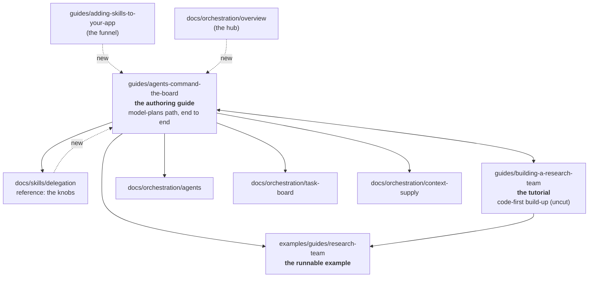

# FIX-932: Delegation authoring guide + canonical worked example — Implementation Spec

> **Repo copy (canonical).** Mirrors the Linear document; kept in sync (BP-037).
> The Linear issue states *what* and *why*; this states *how*.
>
> Linear: [FIX-932](https://linear.app/fixpoint-labs/issue/FIX-932) · Epic parent:
> [FIX-930](https://linear.app/fixpoint-labs/issue/FIX-930) (delegation substrate, `epic approved`)

---

## TLDR

**In plain terms.** We already have a page that teaches people how to make one AI feature hand
work to a small team of helpers, and a working example they can run. The trouble is nothing in
the reference material points at either one, the page skips the questions a first-timer asks in
the first five minutes, and a few things it says stopped being true as the underlying machinery
changed. So: fill in the missing parts of that page, fix what's out of date around it, and add
the handful of links that let someone actually find it. Nothing new gets built.

**Deliverables.** A rewritten authoring guide; corrections applied to every page that publishes a
stale claim — two reference pages, not one — plus a Related section on the delegation reference;
three inbound links from the pages readers actually arrive on; one sidebar reorder; one
package-README link; an empty changeset.

**Size: Small–Medium.** One PR, documentation only.

---

## Part I — The Case *(for the human)*

### 1. Problem — why it matters, why now

**The problem, in plain language.** Someone who wants one of their AI features to hand work to
a small team of sub-agents can't get there from the reference docs — nothing in them points at
either guide that would walk them through it. When they do land on the authoring guide, it
skips what they need in minute two: what to know first, how to staff a seat, and what happens
when it goes wrong. And a few claims on the delegation pages have gone stale as the machinery
moved underneath them.

**Why now.** The delegation substrate has stopped moving. The four features that would have
changed what a guide says — the default worker, assignment checking, the task caps, and
inherited conversation context — have all shipped and are on `main`, and no open pull request
touches delegation code. First moment a guide can be written without being wrong on arrival.

**The issue's premise is stale, and that changes the job.** FIX-932 was filed saying there is
"no user-facing authoring guide and no canonical worked multi-agent example." Both exist:
`apps/docs/guides/agents-command-the-board.md` (134 lines) is a guide-altitude page on exactly
this, and `examples/guides/research-team` is a runnable, tested example with a 391-line guide
already written against it. So the work is deepening and correcting, not creating.

### 2. Solution in plain terms

**Deepen the authoring guide, correct what's wrong on the pages around it, and give the
reference docs a way to reach it.** No new page, no new example, no code.

The gaps, in the order they hurt a reader:

1. **No page in the reference docs routes to a guide.** Nothing under `apps/docs/docs/` links
   to `agents-command-the-board`; a reader landing on the delegation reference from search has
   no path onward. (It *is* in the sidebar and one sibling guide links it — reachable, not
   orphaned.)
2. **The authoring page is missing what an author needs early** — prerequisites, how you staff
   a seat, the rosterless shortcut, and what failure looks like.
3. **Several claims are stale, unqualified, or absent** against merged code — and two of them are
   published on more than one page. Sharpest: both reference pages state a task-cap fact
   correctly and then contradict it a few lines later, telling the coordinator to drain and
   continue on an error that draining cannot relieve. A reader following that advice loops
   pointlessly.
4. **One role has two names in two files.** `docs/skills/delegation.md` says "the executive"
   three times (while already saying "coordinator" five times); `agents-command-the-board` says
   "the model." The tutorial and the example README already say "coordinator" consistently.

**On the overlap between the two guides — accepted, not surgically removed.** The tutorial
`building-a-research-team` §§4–6 teaches delegation too, and an earlier draft of this spec made
deleting that overlap the headline decision. On the actual line numbers it doesn't hold up: the
overlap is ~101 lines, not ~170; §4 (the tutorial's payoff, which teaches `addTask`/`runBoard`)
has to stay, so cutting §5–§6 wouldn't make "assign then drain" single-sourced anyway; §3
forward-references §6 by name; and §5 is the only registry `agent-ref` walkthrough in that arc.
So this change **states the boundary and links the pages to each other** rather than cutting
either. The trim is a follow-up (§12), reconsidered once the deepened guide is stable.

**The philosophy that led here.**

- **Tenet 1 (coherence).** Two guides with no stated boundary and a reference that points at
  neither is incoherence at corpus scale — each page locally reasonable, the whole shapeless.
  Naming what each page owns is worth more than new prose.
- **Tenet 3 (earn every addition).** A third page would be bloat; the existing page grows
  instead. This change is nonetheless net-additive, and that is a real cost — accepted here
  because the alternative (cutting the tutorial) buys less than it breaks, per above.
- **Tenet 6 (readability is an output).** The guide carries the shape and the path; the
  reference carries the knobs. That split is §6.4.

### 3. Tradeoffs & alternatives

**Write the new page FIX-932 asks for.** Rejected — it would put a third delegation page in one
sidebar category, all three built on one example.

**Consolidate the two guides into one and retire a page.** Rejected: a ~550-line merged page
serves neither the build-it-up reader nor the "I just need to author this" reader.

**Cut the overlapping tutorial sections (an earlier draft's headline).** Rejected on the
corrected facts — see §2. Kept as a follow-up rather than dropped entirely.

**Just add the links and stop** — cursor's suggested MVP, and the strongest simplification case.
About 15% of the effort, and it fixes gap 1 outright. Rejected only because it routes more
readers, faster, to pages carrying three stale claims; gaps 1 and 3 are cheapest to fix
together. If the reviewer wants the smaller slice, dropping gap 2's new sections is the clean
cut line — it leaves a correct, reachable corpus and defers only depth.

**Where the genuine complexity is.** Holding the altitude line (§6.4) so the deepened guide
doesn't become a fifth API reference — the delegation surface has four freshly-landed behaviors
and each is tempting to explain in full. Second: the site has **no code-import mechanism**, so
every snippet is a hand-copy that can drift from the tested source; mitigated by `title=`
attribution, not tooling.

### 4. Focus practices (1–5)

- **Verification evidence is mandatory (BP-003); for a docs change the evidence is a claim
  check, not a build.** A green `docs build` proves links resolve — and only partly, since
  `onBrokenMarkdownLinks` is `warn`. Every factual claim gets checked against merged code, and
  the PR carries the table. *(Tenet 7.)*
- **Verify before writing — including this spec's own claims.** Several claims across this spec's
  drafts were overstated and caught by validation and review, not by the author. §8 step 1 is not
  a formality.
- **Fix a claim at every writer, not where the symptom was reported (tenet 5).** The cap-recovery
  error was corrected first only in this spec's own example, while the same false claim sat on two
  reference pages. §7 carries the writer set per claim and §8.1(b) makes the sweep a step. A
  correction that lands on one page and not its siblings just relocates the bug.
- **Behavior in the guide; configuration in the reference.** The operational rule is §6.4.
  *(Tenet 6.)*
- **This change is net-additive; keep the addition small and paid-for.** The only subtraction is
  one duplicated table. Every new section must answer a question the current page leaves open —
  not restate the reference at guide altitude. *(Tenet 3.)*
- **No internal issue or PR numbers in new `apps/docs/**` prose.** (Some legacy instances exist;
  don't add more.)

### 5. What using it looks like

No API changes, so no new calling code. Two examples of the content contract, since that is the
deliverable.

**(a) The altitude line.** The guide names the fields an author types and the behavior; the
library knobs and defaults stay in the reference.

> *In the guide:* "A board won't accept new work forever, and it stops in two different ways.
> Hit the limit on work waiting to start and `addTask` returns `enqueued_task_cap_exceeded` —
> drain what's queued, then carry on adding. Hit the board's lifetime limit and it returns
> `total_task_cap_exceeded`, which draining does not relieve: that budget is spent, so the
> coordinator has to finish with a smaller plan. The numbers and how to change them are in
> [Delegation](/docs/skills/delegation#how-much-work-the-board-will-take-on)."
>
> *Not in the guide:* `maxEnqueuedTasks` / `maxTotalTasks`, their defaults, `null` as the
> opt-out, or how the two interact.

> **Worth recording, because it is the exact failure this spec exists to prevent.** An earlier
> draft of this example told the coordinator to "drain and continue" on *either* cap. That is
> true only of the enqueued cap; the total cap is cumulative and refunds nothing on drain, as
> the shipped delegation playbook says. A spec section demonstrating "the altitude line done
> right" published a false claim about the feature — which is why §8 step 1 verifies before
> writing and §10 makes the claim check the pass/fail criterion rather than the build.

**(b) The correction that is new to these pages.**

> "If a task fails, its dependents don't fail — they stay pending, and `runBoard` comes back
> with `status: \"blocked\"` instead of draining. Read the settled board to find which task
> errored. (The opt-in cascade that skips dependents isn't wired into the delegation board.)"

### 6. Decisions & rules — the sign-off surface

1. **Deepen `apps/docs/guides/agents-command-the-board.md` into the delegation authoring guide.
   No new page; keep the filename and URL.**
   *Alternative rejected:* a new `guides/authoring-a-delegating-skill.md`, as the issue asks.
   *Ramification:* one page owns "how do I author a delegating skill," and the issue's
   "deliverable = a new guide page" wording is superseded. Keeping the filename also holds the
   line FIX-918 already took on this same page ("keep the title, rewrite the body").

2. **State the guide/tutorial/reference boundary; do not cut the tutorial in this change.**
   `building-a-research-team` = the **tutorial** (build one team several ways, code-first).
   `agents-command-the-board` = the **authoring guide** (the model-plans path, end to end).
   `docs/skills/delegation` = the **reference** (the knobs). Each guide links the other.
   *Alternative rejected:* mandatory surgery on the tutorial's §5–§6 (an earlier draft's
   headline decision).
   *Ramification:* ~101 lines of overlap survive, deliberately. Cutting them would not
   single-source "assign then drain" (§4 teaches it and stays), would break §3's forward
   reference to §6, and would remove the arc's only registry `agent-ref` walkthrough. Revisit as
   a follow-up (§12) once the deepened guide is stable.

3. **The canonical worked example is the existing `examples/guides/research-team`. No new
   example, and nothing derived from the delegation goal check.**
   *Alternatives rejected:* a new `apps/kitchen-sink` skill; deriving from
   `goals/delegation/synthesizes-fanned-out-worker-results/`; inline-only snippets.
   *Ramification:* snippets are trimmed, attributed copies of a runnable example — though see
   §10: that example's suite does not exercise the delegation path, so "tested" must not be
   claimed for those particular snippets. The goal check is
   rejected because it demonstrates fan-out *without* dependency edges, in a deliberately
   illegible sentinel domain — and FIX-932's scope names dependency graphs. Note
   `apps/kitchen-sink/skills/research-company` is a near-duplicate of the chosen example;
   flagged in §12.

4. **The guide teaches against one named skill — `research-company` — and says plainly that the
   example's `chat` action binds two skills at once.**
   The example's flow sets `active: ["research-company", "competitor-analysis"]`, so `chat`
   injects both skill bodies on every step, and each instructs the coordinator to seed and drain
   a different graph. A reader who runs `chat` verbatim may see two workflows start, or get a
   clarifying question that belongs to the other skill.
   *Alternatives rejected:* add a per-skill action to the example, or runtime skill selection —
   both are example-package code changes on a docs-only issue, and the same flow backs the
   tutorial, so editing it reaches past this change. Saying nothing was the third option and the
   worst: it would make the guide's "run this" instruction quietly misleading.
   *Ramification:* the guide's prose and snippets name `research-company` throughout, and the
   runnable-example admonition carries a one-line caveat about the shared `chat` action. The
   per-skill action is a follow-up (§12) — worth doing, not here.

5. **The guide teaches the rosterless path, not just the declared-roster one.**
   *Alternative rejected:* document only the declared-`agents:` path.
   *Ramification:* `delegation: true` with no roster is the cheapest entry into delegation and
   inverts the neighbouring behavior — every assignee is accepted and everything runs on the
   default worker, because there is no roster to check against. Omitting it would make the
   guide's "a wrong assignee is rejected" read as universal when it isn't.

6. **The altitude rule: the guide names behaviors and the fields an author types (`agents:`,
   `assignee`, `deps`, `addTask`, `runBoard`); it does not carry library configuration knobs,
   their defaults, or their interactions — those link out.**
   *Alternative rejected:* the blunter "any option name belongs in `docs/`," which would void the
   page — a guide can't teach `deps` without naming it.
   *Ramification:* the floor, assignment checking, and the caps get a sentence or two of
   behavior each and a link. Keeps FIX-932's "per-feature reference is out" boundary checkable.
   Cost: a reader wanting a number takes a hop.

7. **Correct the stale-or-absent claims — on every page that publishes them, not just the one
   the guide links.** The claims and their full writer sets are in §7; the corpus sweep that
   found them is a required step (§8.1), not a courtesy.
   *Alternative rejected:* file these as separate docs bugs; or fix only the pages review
   happened to name.
   *Ramification:* the change edits `docs/orchestration/task-board.md` as well as
   `docs/skills/delegation.md` — two pages each state a cap fact correctly and then contradict it
   a few lines later, and the task-board page states the assignee rule with no rosterless
   qualification. Fixing one writer and leaving the others is the failure tenet 5 names: an
   invariant is not enforced until every writer passes through the same guard.

8. **FIX-641 (dynamic worker identities) is deliberately excluded. No `identity` concept
   appears anywhere.**
   *Ramification:* verified safe — zero code on `main`, `TaskInit` has no `identity` field, and
   FIX-641's own acceptance criteria promise tasks without `identity` behave exactly as today.
   The follow-on is a new **"Dynamic identities"** section appended to the guide, not a rewrite.

**Vocabulary (a rule, not a decision — it is three words in one file).** Normalize
`docs/skills/delegation.md`'s three "executive" hits and `agents-command-the-board`'s "the
model" to **coordinator**. Do **not** touch "executive" in
`docs/patterns/utility-blocks/core.md` or `docs/advanced/utility-blocks-deprecated.md` — that is
the plan-and-execute executive block, a different concept. The tutorial, the example README, and
`packages/orchestration/README.md` need no rename (the README says "the generator" throughout).

**Non-goals.** No new docs page; no new example or kitchen-sink skill; no per-feature API
reference for the floor / assignment checking / caps / context supply; no code changes; no
`identity` content; no tutorial surgery; no `packages/workforce/README.md` edit (§12).

**Size estimate: Small–Medium.** One PR, docs only: one rewritten guide, corrections plus a
`## Related` on the reference page, three inbound links, one sidebar reorder, one README link.
No PR plan.

---

## Part II — The Build Plan *(for the implementing agent)*

### 7. Technical design

No code changes. Two surfaces: the authoring guide (the deliverable) and the reference pages
around it (corrections + inbound links).



Dotted edges don't exist today (gap 1). `G <--> T` is decision 2's boundary: each links the
other and neither re-teaches it going forward.

**The finished authoring page — target outline** (the directional artifact for step 2):

```
title / prerequisites (adding-skills · board-lifecycle · skills/authoring)
:::tip Full, runnable code  → examples/guides/research-team
1. Declare a team           — the agents: map; declaring it is the whole switch
2. Staff each seat          — inline persona vs registry agent; 2 paragraphs + link
3. Plan the work as a graph — addTask, assignee, deps; the fan-out/fan-in shape
4. Draining is the running  — one runBoard call; nothing runs before it
5. A worker that plans more — tools: [taskTools], mid-drain fan-out
6. Without a roster         — delegation: true, everything on the default worker
7. When it goes wrong       — unknown assignee / unset assignee / failed dep → blocked
Related (incl. the tutorial, per decision 2)
```

Removed from that page: the eight-row `taskTools` table (the reference carries the same list in
prose — one canonical home).

**The example is reused, not copied.** `examples/guides/research-team` carries
`src/skills/research-company/SKILL.md` (three `prompt-ref` agents, fan-out with a `deps`-gated
synthesizer) plus `src/agents.ts` / `src/skills.ts` for the registry path, and it runs without an
API key. Its test suite covers the code-first and router actions but **not** the delegation path
(§10). Surface it with the `:::tip Full, runnable code` admonition the tutorial
already uses (a precedent on one page, not yet a site-wide convention) and `title=`-attributed
trimmed snippets.

**Claims that are wrong or silent today — with every page that publishes each one.** This is the
convergence list (tenet 5): a claim is not corrected until every writer of it is. The `writers`
column is the output of the §8.1 sweep, not a list of the pages review happened to name. Where a
shipped goal check exercises the behavior, it is named so a reviewer can spot-check fast.

| Claim | The truth on `main` | Writers to fix | Evidence |
|---|---|---|---|
| **The two caps recover differently** | `enqueued_task_cap_exceeded` is pending-only and refreshes as the board drains — drain, then continue. `total_task_cap_exceeded` is cumulative with **no refund** — draining recovers nothing, so the coordinator must finish with a smaller plan. Teaching one recovery for both teaches an ineffective retry loop. **Both reference pages state the correct fact and then contradict it a few lines later.** | `docs/skills/delegation.md` (annotates the total cap as "the run's ceiling", then says the usual recovery is drain-then-add-the-next-wave); `docs/orchestration/task-board.md` (says "Never refunded by draining", then "a coordinator can drain and continue" applied to *either* error). `packages/orchestration/README.md` is already **correct** — leave it. | `tasks/collection/task-caps.ts`; `DELEGATION_PLAYBOOK` in `delegation-surface.ts` |
| **Assignee rejection is roster-conditional** | "An unknown assignee is rejected at `addTask`" holds **only when a non-empty declared roster exists.** On a rosterless `delegation: true` board, `buildTaskToolsList` gets no roster, `checkAssignee` accepts any name, and the default worker absorbs the registry miss. | `docs/orchestration/task-board.md` states it unconditionally ("The skills delegation surface adds a check further up, refusing an unknown assignee when the task is created"). `docs/skills/delegation.md` already qualifies it correctly — leave it, and make the new guide match its wording, not the task-board page's. | `task-tools-capability.ts` `checkAssignee`; `worker-step.ts` fallback |
| Failed dependency | Dependents are not skipped — `cascadeSkipDependents` isn't wired into the delegation drain. They stay pending; `runBoard` returns `status: "blocked"`. | No page is *wrong*: `docs/orchestration/task-board.md` documents the mode correctly and the patterns pages correctly describe the cascade where it *is* wired (supervisor, plan-and-execute). The gap is that **no delegation page connects the mode to `runBoard`** — so this is an addition to the guide plus `docs/skills/delegation.md`, not a correction elsewhere. | `delegation-surface.ts` settle step; `goals/delegation/` |
| Conversation inheritance | `context-supply: conversation` has shipped and has its own reference page. | `docs/skills/delegation.md`'s closing "Where fork went" paragraph still calls it "a separate direction, tracked as a task context-supply mode". Sole writer — `docs/orchestration/context-supply.md` is correct and `docs/skills/overview.md` already routes to it. | `docs/orchestration/context-supply.md` |
| Roster blurb, and agent metadata | Scope to the two staffing paths separately. An *inline* SKILL.md agent has no `name`/`description` — unknown keys throw — and its roster blurb is its persona's first non-blank line, truncated. A *registered* agent requires both, yet `agentPurpose` renders it as `` agent `<ref>` `` and does **not** use the registry description. | No page asserts the false version, so there is nothing to correct. One clarification is worth making: `docs/orchestration/agents.md` describes `description` as a "routing-facing summary shown in trace UI and the DevTool" — true, but a reader may infer it feeds the delegation roster. Add a half-sentence saying it does not. | `core/src/types/agent.ts`; `delegation-surface.ts` `agentPurpose` |
| **Two "blocked" stories** | Tutorial §7 teaches a code-first board's `terminationReason: "blocked-by-failures"`; the delegation `runBoard` reports `status: "blocked"`. Same word, different surfaces. | **Resolution: the authoring guide's failure section names the delegation one and cross-links the tutorial's §7; the tutorial is not edited** (decision 2). | tutorial §7; `docs/orchestration/task-board.md` |

One more thing already correct in the reference and easy to contradict: the exported `taskTools`
singleton is both uncapped and unvalidated.

### 8. Implementation sequence

1. **Verify first, then sweep for every writer.** Two parts, both required.
   *(a)* Re-read the delegation surface, the task-tools capability, and the skill frontmatter
   parser on `main`; confirm every claim in §7 plus every field name the guide uses. Anything that
   disagrees with this spec is evidence the spec missed something — surface it.
   *(b)* **Convergence sweep (tenet 5).** For each claim, grep the whole `apps/docs` corpus *and*
   `packages/*/README.md` for other pages asserting it, and fix every one. §7's `writers` column is
   the result of that sweep as of this spec; re-run it, because pages move. A correction applied to
   the page review happened to name, while the same claim stays wrong two pages over, is not a
   correction — it is the dominant rework class in this repo and it is what produced this spec's
   third review round.
   *Test:* the claim table in the PR description, each row naming the module (and goal check,
   where one exists) that proves it **and every file the correction touched**.
2. **Rewrite the authoring guide** to the §7 outline. Retitle to the authoring framing (exact
   wording is the implementer's); keep the filename and URL. Remove the `taskTools` table. Fix
   the live error in its Related list — it says the tutorial covers "the three ways to staff
   one"; there are two. Add the tutorial cross-link (decision 2) and the §7 "blocked"
   cross-link. *Test:* the altitude rule (decision 4), sentence by sentence.
3. **Correct the reference.** `docs/skills/delegation.md` gets the three corrections, the
   coordinator vocabulary, a pointer to the guide after its lead, and a `## Related` section (it
   has none).
4. **Wire the inbound links — v1 is three, deliberately.** `docs/skills/delegation.md` (where
   searchers land), `guides/adding-skills-to-your-app` step 10 (the funnel), and
   `docs/orchestration/overview.md` (the hub). `docs/skills/binding.md`,
   `docs/patterns/overview.md`, `docs/orchestration/agents.md`, and the package READMEs are
   deferred to §12 — same coherence goal, smaller review surface, and the guide's text should
   settle before a dozen pages point at it.
5. **Reorder the sidebar.** In `apps/docs/sidebarsGuides.ts`, move `agents-command-the-board`
   ahead of `create-your-own-pattern` in `Orchestration`, so the two model-first pages sit
   together and the code-first advanced page comes last.
6. **Link out from `packages/orchestration/README.md`** — its documentation list has a slot and
   no guide links.
7. **Changeset.** Docs-only: `pnpm changeset --empty`, stated in the PR description (BP-022).

Ordering: step 1 gates everything. Steps 2–4 are one editorial pass. Steps 5–7 are mechanical.

### 9. Edge cases & error handling

| Case | Expected handling |
|---|---|
| A claim in this spec disagrees with `main` at step 1 | Stop and surface it. Three claims across this spec's drafts were overstated; assume more can be. |
| "Executive" outside the delegation cluster | Leave it. The plan-and-execute executive block is a different concept; renaming it would be a real bug. |
| The two "blocked" stories | Guide §7 names the delegation one and cross-links the tutorial's. Do not silently reword the tutorial — decision 2 keeps it uncut. |
| A snippet drifts from the example source | Every fence carries `title=` naming the real file, and the guides state that snippets are trimmed and the example is the complete source. Keep that sentence — but do not extend "tested" to the delegation snippets (§10). |
| A reader wants a knob the guide withholds | Every behavior sentence ends in a link. A behavior mentioned with no outbound link is a review defect. |
| Renaming the file after all | Needs a `plugin-client-redirects` entry (precedent exists) plus updating `guides/board-lifecycle.md`'s inbound link. Decision 1 keeps the filename. |
| Broken links | `onBrokenLinks: "throw"` catches doc-id links at build. `onBrokenMarkdownLinks` is `"warn"` — see §10. |
| FIX-641 lands during review | Append a section; don't restructure. |

**Second-path check (BP-035).** The load-bearing second path is the **rosterless** board — it
inverts the assignment-checking behavior taught on the primary path. Decision 5 gives it its own
short section rather than a footnote.

### 10. Testing strategy

**No goal check applies** — documentation and prose, no runtime behavior. The behaviors
described are already covered by shipped goal checks (`goals/delegation/`,
`goals/delegation-floor/`, `goals/delegation-caps/`); the claim table cites them rather than
adding new ones.

**Verification (BP-003), in place of tests:**

- `pnpm --filter docs build` passes with `onBrokenLinks: "throw"`.
- **A dedicated broken-markdown-link scan is required** (the one `polish-docs` runs).
  `onBrokenMarkdownLinks` is `"warn"`, so the build can go green with exactly the relative-link
  rot this rewrite risks. Choosing the scan over flipping the hook to `"throw"`: flipping it is
  a site-wide config change that would fail the build on pre-existing rot across the whole
  corpus, which belongs to a `polish-docs` sweep, not to this issue. Flagged in §12.
- **The claim check is the real evidence.** The PR carries a table: each factual claim the
  changed prose makes, the module on `main` that proves it, and the goal check that exercises it
  where one exists. A reviewer can spot-check any row. This is the pass/fail criterion.

**What the adopted example does and does not prove — read this before repeating "tested."**
`examples/guides/research-team/test/` is green and needs no API key, but its coverage is:
`board.test.ts` — the code-first static board; `flow.test.ts` — the deterministic `research` and
`researchCompetitors` actions, plus one test that only *parses* the two SKILL.md files and
asserts their text contains `agents:` and `runBoard`. **No test executes the skills-binding
`addTask` → `runBoard` path the guide teaches as canonical.** Consequences, and the
proportionate response:

- The guide may say the example is complete, runnable, and tested — that is true — but must not
  imply its *delegation* snippets are covered by those tests. They are not.
- The evidence for the model-planned path is the shipped goal checks (`goals/delegation/`,
  `goals/delegation-floor/`, `goals/delegation-caps/`), which drive it against a real model.
  Cite those in the claim table rather than the example's suite.
- **Not building a new test in this issue.** A mocked skills-binding integration test in the
  example is the right fix and is worth doing — but it is example-package code on a docs issue,
  and the behavior is already proven by the goal checks. Filed in §12.

**Discipline:** neither `tdd` nor `diagnose` — no code. Nearest is `polish-docs`' editorial pass
over the delegation cluster.

### 11. Documentation plan

The documentation *is* the deliverable, so §8 is the plan. Per-file:

| File | Change |
|---|---|
| `apps/docs/guides/agents-command-the-board.md` | **Rewrite in place** to the §7 outline. Retitled; prerequisites, runnable-example admonition, seat-staffing, rosterless path, failure section added; `taskTools` table removed; "three ways" error fixed; tutorial and "blocked" cross-links added. |
| `apps/docs/docs/skills/delegation.md` | EXTEND + CORRECT — the cap-recovery contradiction (the "usual recovery" line applied to both errors); the stale "Where fork went" paragraph; add the stranded-dependents behavior; coordinator vocabulary; guide pointer after the lead; new `## Related`. |
| `apps/docs/docs/orchestration/task-board.md` | **CORRECT** — the cap-recovery contradiction ("Never refunded by draining" followed by "a coordinator can drain and continue" applied to either error), and the unqualified assignee-rejection sentence, which needs the rosterless carve-out. Found by the §8.1 sweep, not by review. |
| `apps/docs/docs/orchestration/agents.md` | CLARIFY — half a sentence noting that an agent's `description` does not feed the delegation roster blurb. |
| `apps/docs/guides/adding-skills-to-your-app.md` | EXTEND — guide link at step 10 (the funnel). |
| `apps/docs/docs/orchestration/overview.md` | EXTEND — guide link in the agent-first framing. |
| `apps/docs/sidebarsGuides.ts` | EDIT — `Orchestration` items reorder. |
| `packages/orchestration/README.md` | EXTEND — guide link in the documentation list. |
| `apps/docs/guides/building-a-research-team.md` | **No content cut** (decision 2). One reciprocal link to the authoring guide. |
| `examples/guides/research-team/README.md` | EXTEND (optional) — one line naming the guides it backs. **No code change.** |
| `.changeset/*.md` | CREATE — empty fragment. |

**Voice risks.** Jargon on first use is dominant: *skill*, *agent*, *task board*, *coordinator*,
*drain*, *roster*, *worker / default worker* each need a plain-language gloss on first use.
Em-dash density in the pages being edited is high — budget a handful per page. Avoid the "X
isn't just Y — it's Z" shape and escalating triples. Model ids use `openai/gpt-5.4-mini`.

### 12. Dependencies, open questions & follow-ups

**Dependencies: none blocking.** All three Linear blockers (FIX-923, FIX-920, FIX-924) are Done,
as are FIX-918, FIX-927, FIX-928, FIX-931, and FIX-940. No open PR touches
`packages/orchestration`, `packages/workforce`, `apps/kitchen-sink`, or `goals/`.

**Open question for the human at sign-off.** **Decision 1 reverses the issue's literal ask** —
the issue says "a guide" and "one canonical worked example"; this says both exist and should be
deepened and adopted. A scope call, not an implementation detail. (If you want an even smaller
slice, §3 names the clean cut line: links + corrections only, deferring the new sections.)

**Follow-ups (flagged, not built):**

- **The example's `chat` action binds two skills at once** (`active: ["research-company",
  "competitor-analysis"]`), so it can start two workflows or ask a clarifying question belonging
  to the other skill. Decision 4 handles it with a caveat; the real fix is a per-skill action (or
  runtime skill selection) in the example. Example-package code, deliberately out of scope here.
- **The example has no test for the path this guide makes canonical.** Add a mocked
  skills-binding integration test to `examples/guides/research-team` that drives
  `addTask` → `runBoard` through a stub model, so the delegation snippets have the same standing
  as the code-first ones. The strongest follow-up on this list.
- **`onBrokenMarkdownLinks: "warn"` → `"throw"`** site-wide, once the corpus's existing
  markdown-link rot is cleared. Belongs to a `polish-docs` sweep.
- **Tutorial trim.** Revisit cutting `building-a-research-team` §5–§6 (~101 lines) once the
  deepened authoring guide is stable and has absorbed registry wiring. Any such cut must also
  fix §3's forward reference to §6.
- **Deferred inbound links.** `docs/skills/binding.md`, `docs/patterns/overview.md`,
  `docs/orchestration/agents.md` ("Related pages", currently docs-only), and
  `packages/workforce/README.md` (no documentation links at all).
- **Dynamic identities (FIX-641).** A new guide section when runtime-bound personas ship.
- **`apps/kitchen-sink/skills/research-company` is a near-duplicate** of the canonical example's
  skill — same agents, same `prompt-ref` paths, same body. Two copies of "the canonical example"
  is a coherence problem worth one issue.
- **`apps/docs/guides/building-agents.md` "Level 4: Multi-agent coordination"** presents a
  hand-rolled planner / worker / synthesizer sequencer as the multi-agent answer, with no mention
  of boards or delegation. A likely landing page for "multi-agent" that competes with this guide.
- **FIX-936** — board-scoped `taskTools` don't reach agents declaring them via
  `usesCapabilities`. The guide should teach fan-out via `tools: [taskTools]` only.
- **`apps/docs/docs/tools/mcp.md` is in neither sidebar** — an unreachable published page.
- **No code-import mechanism on the docs site**, so every guide snippet is a hand-copy that can
  drift. Worth a corpus-level decision eventually.
- **The epic-spec (FIX-930) is stale** — it names the FIX-931 cap `maxPendingTasks` (shipped as
  `maxTotalTasks` / `maxEnqueuedTasks`) and still carries the floor-implementation-home question
  as open (resolved: it became FIX-940, shipped). Worth a non-blocking comment on the epic PR.

---

## Spec evolution

- **Spec drafted** — research found the issue's premise stale (a guide-altitude page and a
  runnable, tested worked example both already exist), so the Case argues **build smaller**:
  deepen rather than add, adopt rather than author. Rejected deriving the example from the
  delegation goal check (fan-out without dependency edges, in a deliberately illegible domain).
  Excluded FIX-641 deliberately.
- **After validation** — validators refuted several load-bearing claims. Corrected the
  stranded-dependents gap (documented on the substrate page; absent only on the delegation
  pages), the vocabulary drift (two names in two files, not three across four), and two
  overstatements. Added the rosterless path, a third correction, and the finished page's outline.
- **After spec review (cursor)** — the headline decision was **withdrawn**: an earlier draft made
  deleting the tutorial's overlapping sections mandatory, and its rationale was falsified —
  the overlap is ~101 lines not ~170, the tutorial's §4 teaches `addTask`/`runBoard` and survives
  any such cut, §3 forward-references §6, and §5 is the arc's only registry walkthrough. The
  boundary is now *stated and cross-linked* rather than cut, with the trim demoted to a
  follow-up. Also phased the inbound-link pass to three entry points, added the two-"blocked"-
  stories reconciliation, and made the broken-markdown-link scan a required check.
- **After spec review (codex)** — added the plain-language lead the spec was missing (BP-039).
  Fixed a false claim in the spec's own showcase example: it told the coordinator to "drain and
  continue" on either task cap, but only the enqueued cap refreshes on drain — the total cap is
  cumulative, so the recovery differs per error and the guide must say which is which. Scoped
  the agent-metadata claim to inline entries (registered agents do carry `name`/`description`,
  though the roster ignores the description) and made the assignee-rejection rule explicitly
  roster-conditional, matching the rosterless path the file plan already required. Recorded that
  the adopted example's tests cover only its code-first and router actions — nothing executes the
  model-planned path the guide teaches — so the evidence for that path is the goal checks, and
  the example's missing integration test became the top follow-up rather than new scope here.
- **After spec review (codex, round 3)** — ran the corpus-wide convergence sweep the previous
  round should have triggered, and it changed the scope of the corrections. The cap-recovery error
  had been fixed only in this spec's own example while the same false claim sat on **both**
  reference pages, each stating the fact correctly and contradicting it a few lines later; the
  assignee rule is published unconditionally on the task-board page, which the guide links while
  teaching the opposite. §7 now carries a `writers` column per claim, and the sweep is a required
  step rather than an assumption. Also added a decision for the example's `chat` action binding
  two skills at once — the guide now teaches against one named skill and says so — and recorded
  the convergence lesson as a focus practice, since fixing a claim where the symptom was reported
  is this repo's dominant rework class.
