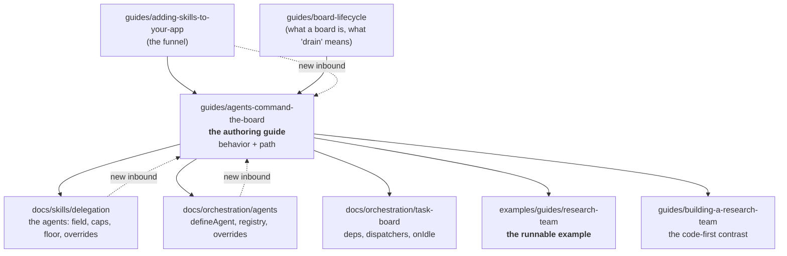

# FIX-932: Delegation authoring guide + canonical worked example — Implementation Spec

> **Repo copy (canonical).** Mirrors the Linear document; kept in sync (BP-037).
> The Linear issue states *what* and *why*; this states *how*.
>
> Linear: [FIX-932](https://linear.app/fixpoint-labs/issue/FIX-932) · Epic parent:
> [FIX-930](https://linear.app/fixpoint-labs/issue/FIX-930) (delegation substrate, `epic approved`)

---

## Part I — The Case *(for the human)*

### 1. Problem — why it matters, why now

**The problem, in plain language.** Someone who wants one of their AI features to hand
work to a small team of sub-agents has to piece the story together from four different
pages, none of which is the one that walks them through it end to end. The pieces are all
written; the path through them is not. And a couple of the pieces are now subtly wrong,
because the delegation machinery kept moving after the pages were written.

**Why now.** The delegation substrate has stopped moving. The four features that were
going to change what a guide would say — the default worker, assignment checking, the
task caps, and inherited conversation context — have all shipped and are on `main`. There
are no open pull requests touching any of the delegation code. This is the first moment a
guide can be written without being wrong on arrival, and the last cheap moment before the
next layer lands on top of it.

**But the issue's premise is stale, and that changes the job.** FIX-932 was filed on
2026-07-23 saying there is "no user-facing authoring guide and no canonical worked
multi-agent example." Both now exist. `apps/docs/guides/agents-command-the-board.md` is a
guide-altitude page about exactly this, and `examples/guides/research-team` is a runnable,
tested, three-ways worked example with a 392-line guide already written against it. What is
actually missing is smaller and different from what the issue describes — see §2.

### 2. Solution in plain terms

**Deepen the guide that already exists; do not write a second one. Adopt the worked
example that already exists; do not author a second one.** Then fix the four things that
are genuinely broken.

The real gaps, in the order they hurt a reader:

1. **The one guide-altitude page is semi-orphaned.** No page under `apps/docs/docs/`
   links to it. A reader who lands on the delegation reference from search has no path
   to the walkthrough.
2. **It is missing the parts an author needs in minute two** — what you need to know
   first, how you *staff* a seat (a persona in the skill folder vs. one from a shared
   registry), and what happens when it goes wrong.
3. **One role has three names.** The reference page says "the executive," this guide says
   "the model," and the research-team guide and package README say "coordinator." Same
   thing, three words, no glossary.
4. **Two claims in the shipped docs are wrong or missing against the merged code.** Most
   importantly: when a task's dependency fails, its dependents are *not* skipped — they
   sit pending and the whole board comes back `blocked`. Nothing documents this today, and
   it is the failure a first-time author is most likely to hit.

So the shape is: **retarget and deepen one page, correct the reference page beside it, and
wire up the inbound links** — plus a documentation-wide vocabulary fix. No new page, no new
example folder, no new code.

**The philosophy that led here.**

- **Tenet 3 (earn every addition).** A new guide page next to a 134-line page on the same
  topic in the same sidebar category is bloat in documentation form — and the doc corpus is
  exactly where bloat becomes incoherence fastest, because nothing type-checks it. The
  default answer to "should this page exist?" is no; the existing page should grow.
- **Tenet 1 (coherence over local cleverness).** Three names for the coordinator across four
  pages is textbook incoherence: each page is locally reasonable, the corpus has lost its
  shape. Fixing the vocabulary is worth more to a reader than any new prose.
- **Tenet 6 (readability is an output).** The guide's job is altitude: the shape of
  delegation and the path through it. Option names and defaults belong one level down in the
  reference. This is the tenet that decides judgment call #2 below.

### 3. Tradeoffs & alternatives

**The main alternative — write the new page FIX-932 literally asks for.** Rejected. It
would land a second task-oriented delegation page in the guides `Orchestration` category
beside a page that already opens with "That's what `taskTools` and `runBoard` are for" and
already contains the `agents:` YAML and an "Assign tasks, then drain" section. Two pages,
one topic, one category is a navigation failure, and it would leave the semi-orphaned page
orphaned *and* stale. The issue asked for a guide because none was known to exist; one does.

**The simpler approach considered — just add the missing cross-links and stop.** That fixes
gap 1 and nothing else. It is genuinely tempting and it is about 15% of the work. It is
insufficient because the page a reader would then successfully reach still doesn't tell them
how to staff a seat or what a failed dependency does, and still calls the coordinator "the
model" while the page next to it calls it "the executive." Discoverability without
correctness just routes more people to the wrong answer faster.

**Where the genuine complexity is.** Not the prose. It is **holding the altitude line** —
§7 below. The delegation surface has four freshly-landed behaviors (floor, assignment
checking, caps, context supply) and every one of them is interesting enough to want to
explain in the guide. FIX-932's scope puts per-feature reference explicitly out, and the
existing reference page already documents three of the four properly. The failure mode for
this change is a guide that quietly becomes a fifth API reference. The decision in §6.5
exists to make that check mechanical rather than a matter of taste.

Second complexity: **the same example now backs two guides.** `building-a-research-team` already
teaches seat-staffing and model-planned tasks in its §5 and §6. Deepening the authoring guide
without cutting those leaves three copies of "assign then drain" in the corpus — so this change
has to subtract from a page the issue never mentions. Decision 4 makes that explicit; it is the
part of the plan most likely to be argued with.

Third complexity: **the docs are hand-copied from the example**, with no import mechanism
(no MDX, no code-import plugin on this site). Every snippet can drift from the tested
source. The mitigation is attribution (`title=` on every fence, pointing at the real file)
plus a claim-check pass, not a tooling change.

### 4. Focus practices (1–5)

- **Verification evidence is mandatory (BP-003), and for a docs change the evidence is a
  claim check, not a build.** `pnpm --filter docs build` proves the links resolve; it proves
  nothing about whether the page is true. Every factual claim in the changed prose gets
  checked against merged code on `main`, and the PR description lists the claims checked.
  *(Tenet 7 — prove the goal, not the mock.)*
- **Document behavior in the guide, option names and defaults in the reference.** The
  operational test is in §6.5. *(Tenet 6.)*
- **One word per concept, corpus-wide.** "Coordinator" replaces "the executive" and "the
  model" everywhere in the delegation pages, in this same change. A rename that lands in one
  page and not its neighbors is worse than not doing it. *(Tenet 1.)*
- **Subtract while adding (tenet 3).** The eight-tool `taskTools` table exists verbatim in
  two pages. The guide's copy goes; the reference keeps one. Net new prose should be well
  under net new value.
- **No internal issue or PR numbers in `apps/docs/**`.** Published prose refers to features
  by what they are. `FIX-932` belongs in the commit, the changeset, and this spec.

### 5. What using it looks like

This change alters no API, so there is no new calling code to show. What changes is what a
reader is told. Two examples of the *content* contract, since that is the deliverable.

**(a) The altitude line in practice.** The guide gets the behavior in a sentence; the
number and the option name stay in the reference.

> *In the guide:* "A board will refuse to keep accepting new work forever — when the
> coordinator hits the ceiling, `addTask` comes back with an error instead of a task id, and
> the expected move is to drain what's queued and continue. The limits and how to change
> them are in [Delegation](/docs/skills/delegation#how-much-work-the-board-will-take-on)."
>
> *Not in the guide:* `maxEnqueuedTasks` (default 100), `maxTotalTasks` (default 500),
> `null` as the opt-out, the `Math.min` interaction between them.

**(b) The correction that is genuinely new information.** Today no page says this, and it is
the first thing that surprises an author:

> "If a task fails, the tasks that depended on it don't fail — they stay pending, and
> `runBoard` comes back with `status: "blocked"` rather than draining. Read the settled
> board to find which task errored."

Verified against `packages/orchestration/src/skills/delegation-surface.ts` — the settle step
reports `blocked` when any task remains pending, and `cascadeSkipDependents` is not wired
into the delegation `runBoard`.

### 6. Decisions & rules — the sign-off surface

1. **Deepen `apps/docs/guides/agents-command-the-board.md` into the delegation authoring
   guide. Do not create a new page.**
   *Alternative rejected:* a new `guides/authoring-a-delegating-skill.md`, as the issue
   literally asks.
   *Ramification:* one page owns "how do I author a delegating skill," and the issue's
   "deliverable = a new guide page" wording is superseded. If the human wants a separate
   page, that reverses this decision and roughly doubles the surface to maintain.

2. **Retitle the page in place; keep the filename and therefore the URL.**
   *Alternative rejected:* rename to `authoring-a-delegating-skill.md` with a redirect entry
   (there is precedent for redirects in `docusaurus.config.ts`).
   *Ramification:* no redirect, no broken inbound links, no external-link churn — at the cost
   of a filename that reads slightly off its new title. Cheaply reversible later; the rename
   is a one-line redirect whenever someone wants it.

3. **The canonical worked example is the existing `examples/guides/research-team`. No new
   example is authored, and nothing is derived from the delegation goal check.**
   *Alternatives rejected:* (a) a new `apps/kitchen-sink` skill; (b) deriving from
   `goals/delegation/synthesizes-fanned-out-worker-results/`; (c) inline-only snippets.
   *Ramification:* the guide's snippets are trimmed, attributed copies of tested source, and
   the example folder stays the single place delegation is proven runnable. See the reasoning
   note below — this is the decision most worth challenging.

4. **Two guides share that example, with a hard division of labor — and the overlapping
   sections are cut from the tutorial, not left in both.**
   `guides/building-a-research-team` stays the **tutorial**: build one team several ways,
   code-first, ending where the model takes over. `guides/agents-command-the-board` becomes the
   **authoring guide**: the model-plans path only, with prerequisites, seat-staffing, and
   failure behavior. `docs/skills/delegation` stays the **reference**: the knobs.
   *Alternative rejected:* leave the tutorial intact and accept the duplication.
   *Ramification:* the tutorial's §5 ("Two ways to staff an agent") and §6 ("Let an agent decide
   the tasks") — about 170 lines that are exactly the authoring guide's subject — **must** be cut
   down to a pointer as part of this change. This is the subtraction half of the change (tenet 3),
   and skipping it leaves the corpus with three copies of "assign then drain" instead of one. It
   also widens the diff into a page the issue never mentions, which is the strongest argument
   against this decision.

5. **The altitude rule, stated in the guide's PR and enforced in review: if a sentence
   contains an option name or a default value, it belongs in `docs/`, not `guides/`.**
   *Alternative rejected:* "use judgment about what's reference-y."
   *Ramification:* the guide names the *behavior* of the floor, assignment checking, and the
   caps in one or two sentences each and links out for the knobs. It keeps FIX-932's "per-
   feature reference is out of scope" boundary mechanically checkable instead of arguable.
   Cost: a reader wanting a number always takes one hop.

6. **Standardize on "coordinator" for the generator that holds the skill and plans the work
   — across the guide, `docs/skills/delegation.md`, and the orchestration README, in this
   change.**
   *Alternative rejected:* keep "the executive" in the reference (it is the term the code
   uses internally) and only fix the guide.
   *Ramification:* one vocabulary fix touches several files at once, which widens the diff.
   The code's internal identifiers are not renamed — this is prose only.

7. **Correct two things about the shipped behavior while here: document that a failed
   dependency strands its dependents and returns `blocked`, and stop implying agents carry a
   `description` (the roster blurb is derived from the persona's first line).**
   *Alternative rejected:* file them as separate docs bugs.
   *Ramification:* the change is no longer purely additive — it fixes the reference page too.
   This is the part that makes the guide *true* rather than merely present.

8. **FIX-641 (dynamic worker identities) is deliberately excluded. No `identity` concept
   appears anywhere in the change.**
   *Alternative rejected:* wait for FIX-641, or write a forward-looking placeholder.
   *Ramification:* verified safe — FIX-641 has zero code on `main`, `TaskInit` has no
   `identity` field, and the issue's own acceptance criteria promise tasks without `identity`
   behave exactly as today. When it ships it adds an optional argument, so the follow-on is a
   new **"Dynamic identities"** section appended to the guide, not a rewrite. Recorded in §12.

**Non-goals.** No new docs page; no new example folder or kitchen-sink skill; no per-feature
API reference for the floor / assignment checking / caps / context supply (those pages already
exist and stay where they are); no code changes to `packages/orchestration` or
`packages/workforce`; no `identity` / FIX-641 content; no fix for the unrelated
`apps/docs/docs/tools/mcp.md` sidebar orphan (flagged in §12).

**Size estimate: Medium.** Multi-file, one PR, docs-and-README only. Roughly one substantially
rewritten guide page, targeted edits to ~10 pages, two package READMEs, one sidebar reorder.
No PR plan needed — it is a single coherent editorial pass and splitting it would strand the
vocabulary fix half-applied.

---

> **Note on decision 3 — why not the goal check.** The dispatch brief for this spec named
> `goals/delegation/synthesizes-fanned-out-worker-results/` as the closest thing to a canonical
> worked example. Research says otherwise, on two counts. First, its domain is deliberately
> illegible: the "researcher" researches nothing and reports the string `QORVIX-7788`; the
> sentinel format exists so a *grader* can attribute an output to a worker. Second and
> decisively, it demonstrates the **wrong topology** — it proves fan-out plus drain, and `deps`
> appears in the whole directory exactly once, as a *negative* assertion (a dependency would
> render the upstream output into the downstream turn and leak the graded marker). FIX-932's
> scope names "orchestrate work as a dependency graph (assign → drain)" — the thing that goal
> structurally forbids. Meanwhile `examples/guides/research-team` and
> `apps/kitchen-sink/skills/research-company` both show a real fan-out/fan-in graph in a legible
> domain, and the former is already tested without an API key. Deriving from the goal would mean
> porting contrived material to teach the wrong shape.

---

## Part II — The Build Plan *(for the implementing agent)*

### 7. Technical design

No code changes. The change is editorial, over three surfaces: the guides page (the
deliverable), the reference pages beside it (corrections + inbound links), and the two package
READMEs (outbound links).

The information architecture this change commits to:

Dotted edges are the ones that don't exist today — the orphaning in gap 1. The guide is the
only node that owns *sequence*; every solid edge out of it is a hop to something that owns
*detail*. Decision 5 is what keeps that split from eroding.

**The example is reused, not moved and not copied.** `examples/guides/research-team` already
carries `src/skills/research-company/SKILL.md` (three `prompt-ref` agents, fan-out with a
`deps`-gated synthesizer) plus `src/agents.ts` / `src/skills.ts` for the registry path. The
guide surfaces it the way every other guide on this site does — a `:::tip Full, runnable code`
admonition near the top with the GitHub tree link and a `cd` + `pnpm fsdev run` block, then
hand-trimmed snippets each attributed with a `title=` fence pointing at the real file.

**Claims the change must get right** (these are where the current corpus is wrong or silent —
verify each against `main` before writing, do not trust the issue text or the epic-spec):

| Claim | The truth on `main` |
|---|---|
| Dependency edges | `deps: string[]` of task ids. There is no `dependsOn` and no `blockedBy`; `blocked` is a status, not an edge. |
| A failed dependency | Dependents are **not** skipped — `cascadeSkipDependents` is not wired into the delegation drain. They stay pending and `runBoard` returns `status: "blocked"`. **Undocumented today.** |
| Assignment checking | Not a mode and not an enum — there is no `strict-roster` / `allow-fallback` option. Strictness is structural: a non-empty declared roster makes it strict, an empty one makes it inert. |
| Reaching the floor | Only by leaving `assignee` unset. A misspelled agent name is rejected at `addTask`, not quietly floored. |
| Agent metadata | No per-agent `description` or `name` field; unknown frontmatter keys throw. The roster blurb is derived from the persona's first non-blank line. |
| Context supply | `context-supply: conversation` is the only legal value; omitting the field *is* the isolated default. There is no `isolated` value. |
| `runBoard` | A model-facing tool name built by the delegation surface, not a substrate export. |
| Hand-wired `taskTools` | The exported singleton is both uncapped and unvalidated. Bounds and roster checking come from the skills binding. Already correct in the reference — keep it that way. |

### 8. Implementation sequence

1. **Verify before writing.** Re-read the merged delegation surface, the task-tools capability,
   and the skill frontmatter parser on `main`, and confirm every row of the claims table above.
   Anything that disagrees with this spec is evidence the spec missed something — surface it,
   don't quietly write around it. *Test:* the claim list in the PR description, each with the
   module that proves it.
2. **Rewrite the guide** (`apps/docs/guides/agents-command-the-board.md`). Retitle to the
   authoring framing, keep the filename. Add: an audience-and-prerequisites block with links, the
   runnable-example admonition, a "staff each seat" section (inline persona vs. registry agent —
   two paragraphs and a pointer, *not* the resolution table), and a "when it goes wrong" section
   covering unknown assignee, unset assignee, and the stranded-dependents behavior. **Remove** the
   eight-tool `taskTools` table (it is duplicated in the reference). Normalize to "coordinator".
   *Test:* the altitude rule from decision 5, applied sentence by sentence.
3. **Correct and cross-link the reference pages.** `docs/skills/delegation.md` gets the
   stranded-dependents behavior, the derived-roster-blurb correction, "coordinator", a pointer to
   the guide after its lead, and a `## Related` section (it has none today). Then add the inbound
   link in `guides/adding-skills-to-your-app` (step 10 — the highest-value funnel),
   `docs/orchestration/overview.md`, `docs/orchestration/agents.md`, `docs/skills/overview.md`,
   `docs/skills/binding.md`, `docs/patterns/overview.md`, and `guides/building-a-research-team.md`.
   *Test:* no page in the delegation cluster is more than one hop from the guide.
4. **Cut the overlap out of the tutorial** (`guides/building-a-research-team.md`, decision 4).
   Its §5 ("Two ways to staff an agent") and §6 ("Let an agent decide the tasks") are the
   authoring guide's subject; reduce each to a short paragraph plus a link, keeping §1–4 (the
   code-first build-up) and §7 intact. Re-read the result end to end — the tutorial has to still
   flow after the cut, not read as a page with two holes in it. *Test:* "assign then drain" is
   taught in exactly one guide.
5. **Reorder the sidebar.** In `apps/docs/sidebarsGuides.ts`, move `agents-command-the-board`
   ahead of `create-your-own-pattern` in the `Orchestration` category, so the two model-first pages
   sit together and the code-first advanced page comes last. *Test:* reading order matches the
   prerequisite order.
6. **Link the READMEs out.** `packages/orchestration/README.md`'s documentation list has no guide
   links; `packages/workforce/README.md` has no links at all. Add the guide to both.
7. **Changeset.** Docs-only and not user-facing in the released-package sense, so
   `pnpm changeset --empty`, and say so in the PR description (BP-022).

Ordering: step 1 gates everything. Steps 2, 3, and 4 are one editorial pass and should land
together — both the vocabulary fix and the tutorial cut are incoherent if split from the rewrite
that absorbs them. Steps 5–7 are mechanical follow-ons.

### 9. Edge cases & error handling

| Case | Expected handling |
|---|---|
| A claim in this spec disagrees with `main` at step 1 | Stop and surface it. Correct the spec, then write. This is the whole point of step 1. |
| A snippet drifts from the example source | Every fence carries `title=` naming the real file, and the guides already state that snippets are trimmed and the example is the complete tested source. Keep that sentence. |
| The vocabulary fix reaches a page outside the delegation cluster | Leave it. Scope is the delegation pages plus the two READMEs; a corpus-wide rename is a `polish-docs` job. |
| A reader wants the option names the guide withholds | Every behavior sentence ends in a link. A behavior mentioned with no outbound link is a review defect. |
| Renaming the file after all | Requires a `plugin-client-redirects` entry plus updating the inbound link in `guides/board-lifecycle.md`. Decision 2 says don't; if reversed, that is the cost. |
| Broken links | `onBrokenLinks: "throw"` is on, so the docs build catches them. Run it. |
| FIX-641 lands during review | Nothing to reconcile — it is additive. Append a "Dynamic identities" section then, don't restructure. |

**Second-path check (BP-035).** The load-bearing second path here is the *rosterless* one: a
skill with `delegation: true` and no declared agents accepts any assignee and runs everything on
the floor. The guide should mention it exists, because it is the cheapest possible entry into
delegation, and it behaves differently from the declared-roster path it sits next to.

### 10. Testing strategy

**No goal check applies** — this is a documentation and prose change with no runtime behavior.
The delegation behaviors it describes are already covered by shipped goal checks
(`goals/delegation/`, `goals/delegation-floor/`, `goals/delegation-caps/`), and this change adds
nothing for them to prove.

**Verification (BP-003), in place of tests:**

- `pnpm --filter docs build` passes with `onBrokenLinks: "throw"` — every internal link resolves.
- The example's existing tests still pass unchanged (`examples/guides/research-team/test/`),
  confirming the source the snippets are trimmed from is still green. These run without an API key.
- **The claim check is the real evidence.** The PR description carries a table: each factual claim
  the changed prose makes about delegation behavior, and the module on `main` that proves it. A
  reviewer can spot-check any row. This is the pass/fail criterion for the change.

**Discipline:** neither `tdd` nor `diagnose` — there is no code. The nearest discipline is
`polish-docs`' editorial pass, run against the delegation cluster.

### 11. Documentation plan

The documentation *is* the deliverable, so §8 is the documentation plan. Per-file:

| File | Change |
|---|---|
| `apps/docs/guides/agents-command-the-board.md` | **CREATE-scale rewrite of an existing file.** Retitled, restructured; new prerequisites block, runnable-example admonition, "staff each seat", "when it goes wrong". `taskTools` table removed. |
| `apps/docs/docs/skills/delegation.md` | EXTEND + CORRECT — stranded dependents, roster-blurb fix, "coordinator", guide pointer after the lead, new `## Related`. |
| `apps/docs/sidebarsGuides.ts` | EDIT — `Orchestration` items reorder. |
| `apps/docs/guides/adding-skills-to-your-app.md` | EXTEND — guide link at step 10. |
| `apps/docs/guides/building-a-research-team.md` | **TRIM + EXTEND** — §5 and §6 (~170 lines, the authoring guide's subject) cut to a paragraph plus a link each; §1–4 and §7 kept. Guide link added in "where to go next". This is the subtraction half of the change. |
| `apps/docs/docs/orchestration/overview.md` | EXTEND — guide link in the agent-first framing and the start-here list. |
| `apps/docs/docs/orchestration/agents.md` | EXTEND — guide + research-team links in "Related pages" (docs-only today). |
| `apps/docs/docs/skills/overview.md`, `skills/binding.md`, `docs/patterns/overview.md` | EXTEND — one guide link each, in the existing delegation sentence. |
| `packages/orchestration/README.md` | EXTEND — guide link in the documentation list. |
| `packages/workforce/README.md` | EXTEND — new short documentation list (has none). |
| `examples/guides/research-team/README.md` | EXTEND (optional) — one line naming the guide it backs. **No code change.** |
| `.changeset/*.md` | CREATE — empty fragment. |

**Voice risks to watch** (from the site writing-style rules): jargon on first use is the dominant
one — *skill*, *agent*, *task board*, *coordinator*, *drain*, *roster*, *worker/floor* each need a
plain-language gloss the first time they appear. Em-dash density in the pages being copied from is
high; budget a handful for the whole page. Avoid the "X isn't just Y — it's Z" shape (there is
already an instance of it in the orchestration overview) and escalating triples. Model ids in
examples use `openai/gpt-5.4-mini`. No issue or PR numbers anywhere under `apps/docs/`.

### 12. Dependencies, open questions & follow-ups

**Dependencies: none blocking.** All three Linear blockers (FIX-923, FIX-920, FIX-924) are Done,
as are FIX-918, FIX-927, FIX-928, FIX-931, and FIX-940. No open pull request touches
`packages/orchestration`, `packages/workforce`, `apps/kitchen-sink`, or `goals/` — the surface is
not moving under this change.

**Open questions for the human at sign-off:**

1. **Decision 1 is the one that reverses the issue's literal ask.** The issue says "an
   `apps/docs` guide" and "one canonical worked example"; this spec says both exist and should be
   deepened and adopted rather than created. If you want the new page anyway, say so at the gate —
   it is a scope decision, not an implementation detail.
2. **Decision 2 (retitle vs. rename).** Low stakes, easily reversed later. Flagging it only so the
   URL choice is yours.

**Follow-ups (flagged, not built):**

- **Dynamic identities (FIX-641).** When runtime-bound worker personas ship, the guide gains a
  "Dynamic identities" section covering the optional per-task `identity` argument. Additive; no
  restructure. This spec deliberately carries no `identity` content.
- **FIX-936** — board-scoped `taskTools` don't reach agents that declare them via
  `usesCapabilities` (the second declaration path). Known bug, not a surface change. The guide
  should teach fan-out via the `tools: [taskTools]` form only, and not lean on `usesCapabilities`.
- **`apps/docs/docs/tools/mcp.md` is in neither sidebar** — an unreachable published page.
  Unrelated to delegation; a `polish-docs` cleanup.
- **The docs site has no code-import mechanism** (no MDX, no code-import plugin), so every snippet
  in every guide is a hand-copy that can drift. Worth a corpus-level decision at some point; out of
  scope here.
- **The epic-spec (FIX-930) is stale** on two points — it lists the FIX-931 cap as `maxPendingTasks`
  (shipped as `maxTotalTasks` / `maxEnqueuedTasks`) and still carries the floor-implementation-home
  question as open (resolved: it became FIX-940, shipped). Worth a non-blocking comment on the epic
  PR rather than a change here.

---

## Spec evolution

- **Spec drafted** — research found the issue's premise stale (a guide-altitude page and a
  runnable, tested worked example both already exist), so the Case argues **build smaller**:
  deepen `agents-command-the-board.md` instead of adding a page, adopt
  `examples/guides/research-team` instead of authoring an example, and spend the saved budget on
  the four real gaps (orphaned page, missing staffing/failure sections, three names for the
  coordinator, two wrong-or-missing behavior claims). Rejected deriving the example from the
  delegation goal check — it demonstrates fan-out without dependencies, which is the wrong shape
  for this issue, in a deliberately illegible domain. Held FIX-932's "per-feature reference is
  out" boundary with a mechanical altitude rule, and excluded FIX-641 deliberately.
- **During drafting** — found that the research-team tutorial already teaches seat-staffing and
  model-planned tasks in its §5–§6, so adopting its example for a second guide would have left
  three copies of "assign then drain"; added the guide/tutorial/reference division of labor and
  made cutting those two sections a required part of the change rather than an optional tidy-up.
